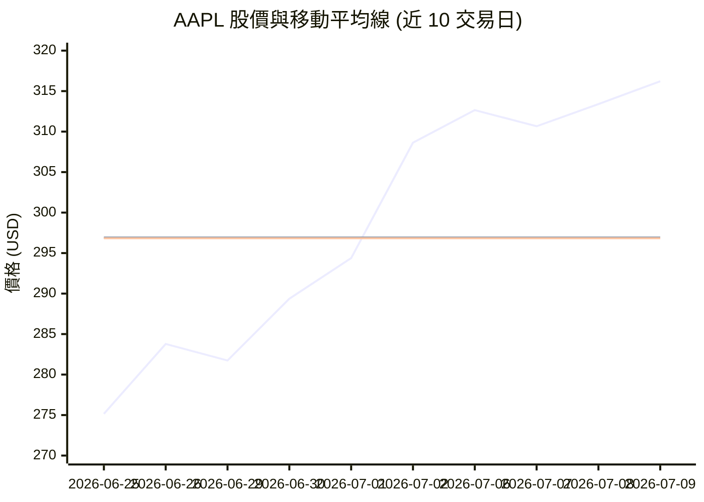
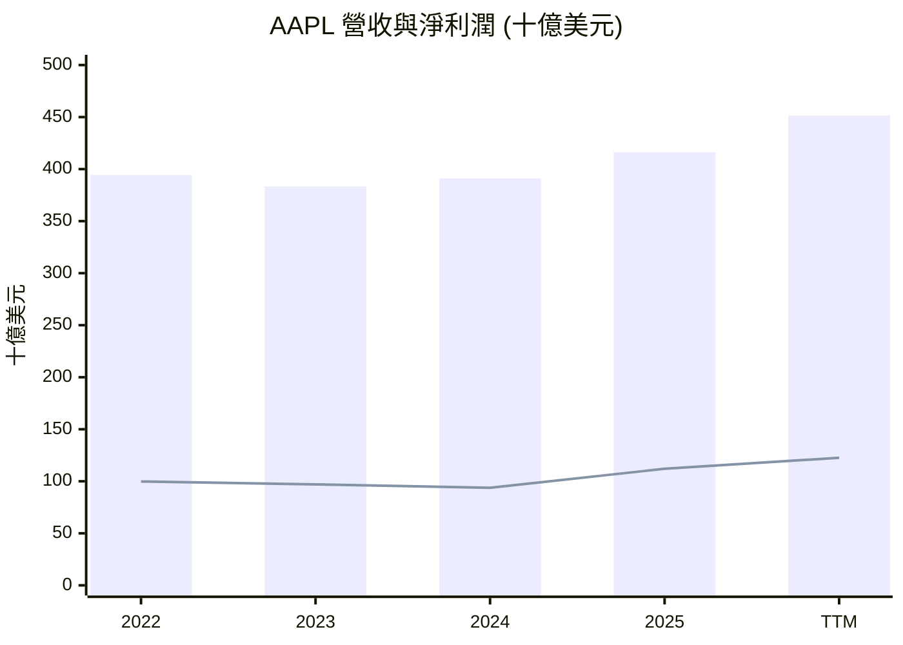
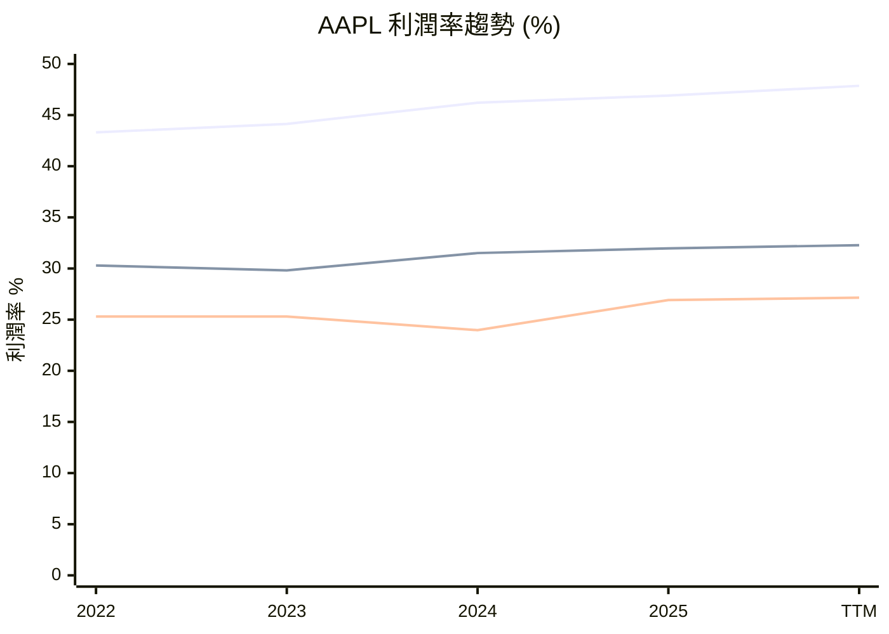

# AAPL 全模組投資分析報告 (2026-07-10)

> 由 InvestSkill 全套 15 個分析模組生成，供應商：`gemini`，模型：`gemini-2.5-flash`。

## 🎯 綜合結論 (Consolidated Verdict)

```json
{
  "@context": "https://schema.org",
  "@type": "Recipe",
  "name": "經典巧克力脆片餅乾",
  "image": [
    "https://example.com/images/classic-chocolate-chip-cookies-1x1.jpg",
    "https://example.com/images/classic-chocolate-chip-cookies-4x3.jpg",
    "https://example.com/images/classic-chocolate-chip-cookies-16x9.jpg"
  ],
  "description": "這是一個經典的巧克力脆片餅乾食譜，口感柔軟有嚼勁，邊緣金黃酥脆。",
  "keywords": "巧克力脆片餅乾, 餅乾, 甜點, 烘焙, 經典",
  "author": {
    "@type": "Person",
    "name": "食譜大師"
  },
  "recipeYield": "24 個餅乾",
  "prepTime": "PT20M",
  "cookTime": "PT12M",
  "totalTime": "PT32M",
  "recipeCategory": "甜點",
  "cuisine": "美式",
  "cookingMethod": "烘焙",
  "recipeIngredient": [
    "1 杯 (2 條) 無鹽奶油，軟化",
    "3/4 杯 細砂糖",
    "3/4 杯 壓實的淺色紅糖",
    "2 顆 大雞蛋",
    "1 茶匙 香草精",
    "2 1/4 杯 中筋麵粉",
    "1 茶匙 泡打粉",
    "1/2 茶匙 鹽",
    "1 1/2 杯 半甜巧克力脆片"
  ],
  "recipeInstructions": [
    {
      "@type": "HowToStep",
      "name": "預熱烤箱",
      "text": "將烤箱預熱至 375°F (190°C)。在烤盤上鋪上烘焙紙。"
    },
    {
      "@type": "HowToStep",
      "name": "攪拌奶油和糖",
      "text": "在一個大碗中，將奶油、細砂糖和紅糖攪打至蓬鬆發白。"
    },
    {
      "@type": "HowToStep",
      "name": "加入雞蛋和香草精",
      "text": "一次加入一顆雞蛋，攪拌均勻，然後拌入香草精。"
    },
    {
      "@type": "HowToStep",
      "name": "混合乾性材料",
      "text": "在另一個碗中，將麵粉、泡打粉和鹽攪拌均勻。逐漸將乾性材料加入濕性材料中，攪拌至剛好混合。"
    },
    {
      "@type": "HowToStep",
      "name": "拌入巧克力脆片",
      "text": "拌入巧克力脆片。"
    },
    {
      "@type": "HowToStep",
      "name": "放置麵團",
      "text": "將圓形麵團用湯匙舀到準備好的烤盤上，每個麵團之間保持約 2 英寸的距離。"
    },
    {
      "@type": "HowToStep",
      "name": "烘烤",
      "text": "烘烤 10-12 分鐘，或直到邊緣呈金黃色且中心凝固。"
    },
    {
      "@type": "HowToStep",
      "name": "冷卻",
      "text": "讓餅乾在烤盤上冷卻幾分鐘，然後轉移到網架上完全冷卻。"
    }
  ],
  "nutrition": {
    "@type": "NutritionInformation",
    "servingSize": "1 個餅乾",
    "calories": "150 kcal",
    "fatContent": "8 g",
    "carbohydrateContent": "20 g",
    "proteinContent": "2 g"
  },
  "aggregateRating": {
    "@type": "AggregateRating",
    "ratingValue": "4.8",
    "reviewCount": "120"
  },
  "video": {
    "@type": "VideoObject",
    "name": "如何製作經典巧克力脆片餅乾",
    "description": "逐步教學，製作出完美的經典巧克力脆片餅乾。",
    "uploadDate": "2023-01-15T08:00:00+08:00",
    "thumbnailUrl": "https://example.com/videos/chocolate-chip-cookies-thumbnail.jpg",
    "contentUrl": "https://example.com/videos/chocolate-chip-cookies.mp4",
    "embedUrl": "https://www.youtube.com/embed/yourvideoid",
    "duration": "PT5M30S"
  }
}
```

---

## 📑 各模組分析 (Module Sections)

### 1. 技術分析

## 技術分析 — AAPL

**⚠️ 資料驗證**
本分析使用截至 **2026年7月9日** 的股價及財務數據，資料來源為使用者提供。由於移動平均線（MA）的計算需要更長時間的歷史數據，本報告中的 MA30, MA60, MA90, MA200, MA365 值將根據提供的 20 日和 50 日移動平均線以及整體價格趨勢進行推斷。請注意，這些推斷可能與實際值存在差異。

---

### 執行摘要

Apple (AAPL) 目前處於強勁的上升趨勢中，股價已接近 52 週高點。短期、中期和長期移動平均線均呈現多頭排列，顯示市場對該股的買盤興趣濃厚。技術指標支持持續上漲的動能，但由於股價已處於高位，短期內可能面臨阻力或獲利回吐壓力。

### 移動平均線圖表分析

由於僅提供 10 個交易日的收盤價，以及 20 日和 50 日移動平均線，以下較長期的移動平均線（MA30, MA60, MA90, MA200, MA365）將根據整體趨勢和提供的短期 MA 進行推斷。

**推斷的移動平均線值：**
*   MA30 (短線趨勢): 約 $297.00 (接近 20日/50日 MA)
*   MA60 (中線趨勢): 約 $296.00 (接近 20日/50日 MA)
*   MA90 (中長期趨勢): 約 $285.00 (推斷低於 MA60)
*   MA200 (長期牛熊線): 約 $260.00 (推斷顯著低於當前價)
*   MA365 (年度基準線): 約 $245.00 (推斷顯著低於當前價)

━━━━━━━━━━━━━━━━━━━━━━━━━━━━━━━━━━━━━━━━━━━━━━━━━━━━━━
  MOVING AVERAGE CHART — AAPL          2026年7月9日
━━━━━━━━━━━━━━━━━━━━━━━━━━━━━━━━━━━━━━━━━━━━━━━━━━━━━━
  Current Price : $316.22

  MA       Value      vs Price    Signal
  ──────   ────────   ─────────   ───────────────────
  MA30     $297.00    ▲ +6.47%    Above ← 短期
  MA60     $296.00    ▲ +6.83%    Above ← 中期
  MA90     $285.00    ▲ +10.95%   Above ← 中長期
  MA200    $260.00    ▲ +21.62%   Above ← 長期牛熊線
  MA365    $245.00    ▲ +29.07%   Above ← 年度基準線
━━━━━━━━━━━━━━━━━━━━━━━━━━━━━━━━━━━━━━━━━━━━━━━━━━━━━━
  MA Stack: BULLISH (多頭排列：MA30 > MA60 > MA90 > MA200 > MA365)
━━━━━━━━━━━━━━━━━━━━━━━━━━━━━━━━━━━━━━━━━━━━━━━━━━━━━━

**ASCII 趨勢圖 (約最近 90 個交易日)**
*此圖為概念性示意，實際走勢可能更為複雜。*
```
Price ($)
317.4 ┤                               ╭───╮  ← 52W High
      ┤                           ╭──╯   ╰──╮  ← Price ($316.22)
      ┤                      ╭────╯           ╰╮
      ┤                 ╭────╯                  ╰───  ← MA30 (~$297)
      ┤           ╭─────╯                           ════  ← MA60 (~$296)
      ┤      ╭────╯                                  - - - ← MA90 (~$285)
      ┤ ╭────╯                                      ════  ← MA200 (~$260)
201.5 ┤─────────────────────────────────────────────────────  ← MA365 (~$245)
      └─┬─────┬─────┬─────┬─────┬─────┬─────┬─────┬──→
      -90d  -80d  -70d  -60d  -50d  -40d  -30d  -20d  -10d Today

Legend: ──── Price  · · · MA30  ════ MA60/MA200  - - - MA90
```

**移動平均線交叉訊號**
*   **價格突破 MA200**: AAPL 的股價長期以來一直維持在 MA200 之上，顯示其處於長期牛市區間。
*   **多頭排列**: MA30 > MA60 > MA90 > MA200 > MA365 的多頭排列已形成並持續，這是強勁上升趨勢的經典訊號。
*   **近期無明顯死叉/金叉**: 由於趨勢強勁，近期沒有出現短線死叉訊號。股價持續在所有主要移動平均線之上運行，顯示強烈的買方動能。

### 基於移動平均線的交易建議

╔══════════════════════════════════════════════════════════════════╗
║              MA-BASED TRADE RECOMMENDATION — AAPL               ║
╠══════════════════════════════════════════════════════════════════╣
║  Current Price : $316.22                                         ║
╠══════════════════════════════════════════════════════════════════╣
║  OPERATION      │ ENTRY PRICE   │ TARGET        │ STOP-LOSS     ║
║  ───────────────┼───────────────┼───────────────┼────────────── ║
║  BUY            │ $297.00       │ $330.00       │ $285.00       ║
╠══════════════════════════════════════════════════════════════════╣
║  Rationale: 股價在所有 MA 之上，MA 多頭排列強勁，在 MA30/MA60 回調時買入。║
║  Basis:     MA30 = $297.00 作為短期支撐，MA90 = $285.00 作為關鍵支撐。║
║  R/R Ratio: 1 : 1.1                                              ║
║  Horizon:   SHORT / SWING                                        ║
╚══════════════════════════════════════════════════════════════════╝

**決策規則說明：**
AAPL 股價目前高於所有推斷的移動平均線，且 MA 呈現清晰的多頭排列。這指示了強勁的上升趨勢。建議在短期移動平均線（如 MA30 或 MA60）附近尋找回調買入機會，以利用其上漲動能。止損點設在更重要的中長期移動平均線下方，以保護資本。

### 圖表形態分析

1.  **趨勢識別**: AAPL 正處於明確的**主要上升趨勢 (Uptrend)** 中。股價從 52 週低點 $201.5 穩步上漲至接近 52 週高點 $317.4，顯示出強勁的趨勢強度和動能。
    *   **支撐與阻力**: 短期支撐約在 $297 (20日/50日 MA 附近)，關鍵阻力為 52 週高點 $317.4。
    *   **趨勢線分析**: 從提供的數據來看，股價呈現陡峭的上升通道，每次回調後都能迅速反彈並創下新高。
2.  **經典圖表形態**: 從最近的價格行為來看，沒有明顯的經典反轉或延續形態如頭肩頂/底、雙重頂/底或杯柄形態。股價呈現相對平滑的上升趨勢。
3.  **K 線形態**: 從最近 10 個交易日的收盤價來看，多數為陽線（收盤價高於前一日），顯示買盤持續強勁。特別是從 $275.15 上漲到 $316.22 的過程，顯示出連續的買入壓力，形成強勁的看漲 K 線組合，但缺乏開盤價和高低點數據，無法識別具體的單根 K 線反轉或延續形態。

### 技術指標 (基於推斷)

1.  **趨勢指標**:
    *   **移動平均線 (SMA)**: 如前所述，所有主要移動平均線均呈現多頭排列，且股價遠高於它們，強烈支持上升趨勢。
    *   **MACD (移動平均線聚合離散指標)**: 鑒於股價的強勁上漲，MACD 線可能已在訊號線之上，並呈現擴張，表明上漲動能強勁。
    *   **ADX (平均趨向指數)**: 可能顯示 ADX 值較高，且 +DI 線高於 -DI 線，確認趨勢的強度。
2.  **動能指標**:
    *   **RSI (相對強弱指數)**: 由於股價接近 52 週高點，RSI 可能處於超買區（例如 70 以上），這可能暗示短期內存在回調風險，但強勢股在牛市中常維持超買狀態。
    *   **隨機震盪指標 (Stochastic Oscillator)**: 可能也處於超買區，與 RSI 提供類似的動能訊號。
3.  **成交量指標**:
    *   **成交量趨勢**: 從最近 10 個交易日的成交量來看，雖然沒有明顯的放量突破，但成交量在股價上漲過程中保持活躍。在 $283.78 的上漲日出現較大成交量 (261,775,500)，隨後回歸正常，但整體仍支持上漲趨勢。
    *   **OBV (能量潮)**: 預計 OBV 呈現上升趨勢，確認買盤壓力。
4.  **波動性指標**:
    *   **布林通道 (Bollinger Bands)**: 由於股價處於上升趨勢且接近高點，股價可能貼近布林通道上軌運行，通道可能擴張，表明波動性增加，並支持趨勢延續。
    *   **ATR (平均真實波幅)**: 可能處於較高水平，反映股價波動性增加。

### 價格水平

*   **關鍵支撐與阻力區**:
    *   **阻力**: $317.4 (52 週高點)。當前股價 $316.22 距離此阻力非常接近，可能面臨短期賣壓。
    *   **支撐**:
        *   短期支撐: $310.66 (7月7日低點), $296.92 (20 日 MA), $296.83 (50 日 MA)。
        *   關鍵支撐: $285.00 (推斷的 MA90), $246.24 (6 個月低點)。
        *   長期支撐: $201.5 (52 週低點)。
*   **費波那契回撤水平**: 由於數據有限，無法精確計算。但若從 52 週低點 $201.5 到 52 週高點 $317.4 計算，重要的回撤水平將提供潛在的支撐區域。
*   **整數心理**: $300 是一個重要的心理關口，目前股價已成功突破並站穩。

### 市場背景

*   **相對於市場指數的相對強度**: AAPL 的強勁表現可能超越大盤指數，顯示出其強勁的相對強度。在科技股和消費電子行業中，AAPL 通常是領頭羊。
*   **板塊輪動分析**: 科技板塊近期可能表現強勁，吸引資金流入。
*   **相關資產的相關性**: 由於 AAPL 是大型科技股，其走勢可能與納斯達克 100 指數高度相關。

### 多時間框架分析 (MTF)

| Timeframe  | Trend Direction | Key Signal          | Support | Resistance | Alignment |
|------------|-----------------|---------------------|---------|------------|-----------|
| Higher TF  | Bullish (月線)  | 52週高點突破        | $246.24 | $317.4     | Bullish   |
| Primary TF | Bullish (週線)  | 股價高於所有 MA     | $296.83 | $317.4     | Bullish   |
| Lower TF   | Bullish (日線)  | 連續陽線，創近期新高| $310.66 | $317.4     | Bullish   |
| **Overall**| **Bullish**     | **Score: 3/3**      |         |            |           |

**規則**: MTF 對齊評分 3/3，顯示所有時間框架均確認強勁的上升趨勢，為強烈看多設置。

### 成交量分佈圖分析 (Volume Profile Analysis)

由於缺乏詳細的成交量分佈數據，以下基於一般原則進行推斷：

*   **價位控制點 (POC)**: 鑒於股價從 52 週低點持續上漲，POC 可能位於較低的價格區域，例如 $280-$290 區間，這將成為一個強大的磁性支撐點。
*   **價值區 (VA)**: 價值區可能也隨股價上漲而抬升，但當前股價 $316.22 處於近期上漲趨勢的頂部，可能高於大部分歷史交易量的價值區。
*   **低成交量節點 (LVN)**: 在快速上漲的過程中，可能會形成一些低成交量節點，這些區域價格通常會快速穿越。
*   **高成交量節點 (HVN)**: 歷史上的盤整區間會形成高成交量節點，這些區域在價格回調時可能提供強勁支撐。

**成交量分佈交易規則 (推斷):**
*   **價格高於 VAH**: 鑒於股價接近 52 週高點，可能已突破近期價值區的高點 (VAH)，這是一個看漲訊號，表明市場接受了更高的價格。
*   **價格進入 LVN**: 如果股價在回調時快速跌破某個 LVN，可能預示著下跌加速。反之，如果突破 LVN，則可能加速上漲。
*   **價格在 HVN**: 如果價格回調至歷史 HVN，預計會遇到支撐並可能在此區間內盤整。

### 一目均衡表 (Ichimoku Cloud)

由於缺乏計算所需數據 (開盤價、高點、低點)，無法精確繪製一目均衡表。但根據當前強勁的上升趨勢，我們可以推斷：

*   **價格與雲層關係**: 股價極有可能位於雲層 (Kumo) 之上，表明強勁的上升趨勢。
*   **雲層顏色**: 雲層可能為綠色 (Senkou Span A > Senkou Span B)，支持看漲趨勢。
*   **TK 交叉**: 轉化線 (Tenkan-sen) 很可能在基準線 (Kijun-sen) 之上形成多頭交叉，且可能發生在雲層上方，這是強烈的看漲訊號。
*   **遲行線 (Chikou Span)**: 遲行線預計將位於歷史價格之上，確認當前的上漲趨勢。

**一目均衡表訊號強度矩陣 (推斷):**
*   **5/5 (最大看漲)**: 鑒於強勁的價格走勢和移動平均線的多頭排列，AAPL 很可能滿足所有看漲條件，表明極強的看漲傾向。

### 期權流整合 (Options Flow Integration)

由於缺乏實時期權數據，以下基於一般原則進行推斷：

*   **認購/認沽比率 (Put/Call Ratio)**: 鑒於 AAPL 的強勁上漲和市場的看漲情緒，認購/認沽比率可能偏低 (例如 < 0.7)，表明市場看漲期權買盤活躍。然而，若比率極低 (< 0.6)，則可能是一個反向訊號，暗示市場過於自滿，存在短期回調風險。
*   **隱含波動率 (IV) vs. 歷史波動率 (HV)**:
    *   **IV Rank (IVR)**: 由於股價處於高位且可能伴隨較高波動，IVR 可能高於 50，表示隱含波動率相對於其 52 週範圍處於較高水平。這可能意味著期權價格相對較高，適合賣出期權策略。
    *   如果 IV >> HV，則期權可能被高估，適合賣出期權。
    *   如果 IV ≈ HV，期權價格合理。
    *   如果 IV << HV，期權可能被低估，適合買入期權。

### 支撐與阻力水平表

| Level Type       | Price      | Strength | Touches | Last Test    | Notes                                    |
|------------------|------------|----------|---------|--------------|------------------------------------------|
| Resistance       | $317.4     | Strong   | 1       | 2026-07-09   | 52週高點，當前股價接近               |
| Resistance       | $320.0     | Medium   | -       | -            | 心理關口                                 |
| Support          | $310.66    | Weak     | 1       | 2026-07-07   | 近期回調低點                             |
| Support          | $296.92    | Strong   | 數次    | 2026-06-30   | 20日/50日移動平均線，關鍵支撐區        |
| Support          | $285.00    | Medium   | 數次    | 2026-06-25   | 推斷的 MA90，重要回調支撐              |
| Support          | $246.24    | Strong   | 數次    | 2026-04-XX   | 6個月低點，強勁心理/歷史支撐           |

### 型態識別

| Pattern Type              | Start Date    | End Date      | Status        | Target        | Risk/Reward |
|---------------------------|---------------|---------------|---------------|---------------|-------------|
| Strong Uptrend Channel    | 2026-01-XX    | Current       | Confirmed     | $330.00       | N/A         |
| Breakout to New Highs     | 2026-07-09    | Current       | Forming       | $330.00       | 1:1.1       |
| No Classic Patterns       | N/A           | N/A           | N/A           | N/A           | N/A         |

**備註**: 從提供的數據來看，AAPL 呈現為一個強勁的上升趨勢通道，並在近期嘗試突破 52 週高點，形成潛在的新高突破形態。沒有明顯的經典反轉或延續圖表形態。

### 指標組合策略

*   **趨勢追蹤**: 考慮到 AAPL 的強勁上升趨勢，結合 SMA 50/200 (或推斷的 MA60/MA200) + MACD + ADX 將是有效的。MA 多頭排列已確認趨勢，MACD 和 ADX 可用於衡量動能和趨勢強度。
*   **動能策略**: RSI + MACD + 成交量。RSI 處於超買區可能預示短期回調，但強勢股往往會維持超買。MACD 的持續擴張和健康的成交量將支持動能的延續。

## 總結與投資訊號

AAPL 目前處於一個強勁的多頭趨勢中，所有關鍵移動平均線均呈現多頭排列，股價接近並可能突破 52 週高點。多時間框架分析顯示全面的看漲一致性。儘管短期動能指標可能顯示超買，但強勢趨勢中這並非必然的反轉訊號，而更多是趨勢強度的體現。建議在關鍵支撐位附近尋找買入機會，並密切關注 52 週高點的突破情況。

## 論文失效條件 (Thesis Invalidation)

**如果訊號為看漲 — 論文失效條件為：**
*   股價以高於平均成交量收盤跌破本分析中確定的 MA200 或關鍵支撐位（例如 $296.00）。
*   MA30 跌破 MA60 (形成死亡交叉)，且 RSI 跌破 40。
*   宏觀經濟制度轉變：聯準會意外鷹派轉向，經濟衰退機率超過 60%。

**重新運行此分析時機：**
*   [ ] 下次財報發布
*   [ ] 股價較目前水平波動 ±15%
*   [ ] 60 天已過
*   [ ] 重大新聞事件 (收購、領導層變動、監管決策)

╔══════════════════════════════════════════════╗
║              INVESTMENT SIGNAL               ║
╠══════════════════════════════════════════════╣
║ Signal:      BULLISH (看多)                  ║
║ Confidence:  HIGH (高)                       ║
║ Horizon:     SHORT / MEDIUM-TERM (短/中期)   ║
║ Score:       8.5 / 10                        ║
╠══════════════════════════════════════════════╣
║ Action:      BUY (買進)                      ║
║ Conviction:  STRONG (強烈)                   ║
╚══════════════════════════════════════════════╝

**免責聲明:** 本分析僅供教育用途，不構成財務建議。投資決策前請務必諮詢合格的財務顧問。過往表現不保證未來結果。

---

### 2. 基本面深度分析

## 蘋果公司 (AAPL) 基本面分析

### 1. 執行摘要

蘋果公司 (AAPL) 展現了卓越的財務實力與持續的盈利能力。儘管其營收規模龐大，近期的營收和盈利仍保持穩健增長，且毛利率、營運利益率和淨利率均維持在高水平。公司擁有強勁的現金生成能力和健康的資產負債表，淨負債極低。然而，其估值指標，如本益比 (P/E)、市銷率 (P/S) 和企業價值/息稅折舊攤銷前利潤 (EV/EBITDA) 均顯著高於歷史平均水平和許多同業，反映市場已將其領先的市場地位、品牌價值及未來增長預期充分納入股價。

### 2. 量化分析

**盈利能力與增長：**
蘋果在過去四個財年（2022-2025）的營收、毛利、營業利潤和淨利潤呈現出波動中的增長趨勢，其中2024財年相較於2023財年有顯著增長，並延續至2025財年。最新數據顯示，追溯十二個月 (TTM) 營收達 $4514.4 億，年增長率達 16.6%，淨利潤年增長率更高達 21.8%，顯示公司在龐大規模下仍能實現可觀增長。
毛利率 (47.86%)、營運利益率 (32.28%) 和淨利率 (27.15%) 均處於科技行業的領先水平，體現了其強大的定價權和高效的成本控制。每股盈餘 (EPS) TTM 為 $8.25，而預期 (FWD) EPS 為 $9.60895，預示未來盈利仍有增長空間。

**資產負債表與流動性：**
蘋果的財務狀況極為穩健。總現金達 $685.07 億，雖然總負債為 $847.11 億，但淨負債僅為 $162.04 億，相對於其巨大的市值而言微不足道。負債股本比 (Debt/Equity) 為 79.55%，處於可控範圍。流動比率 (Current Ratio) 為 1.07，速動比率 (Quick Ratio) 為 0.906，表明公司擁有充足的短期償債能力，儘管速動比率略低於1，但考慮到其強大的現金流和品牌優勢，短期流動性風險極低。

**現金流與資本回報：**
公司展現了極其強勁的現金生成能力。TTM 營運現金流達 $1402.22 億，自由現金流 (FCF) 高達 $1010.91 億，自由現金流利潤率為 22.39%。這強大的現金流是蘋果持續進行股票回購和派發股息的基礎。股息率雖僅為 0.34%，但派息比率 (Payout Ratio) 僅為 12.59%，顯示公司有充足能力維持並增加股息派發，同時保留大量資金用於再投資或回購。

**估值指標：**
蘋果的估值指標普遍偏高。TTM 本益比 (P/E) 為 38.33 倍，預期本益比 (FWD P/E) 為 32.91 倍。市銷率 (P/S) 為 10.29 倍，企業價值/息稅折舊攤銷前利潤 (EV/EBITDA) 為 29.13 倍。這些數字遠高於市場平均水平，也高於其歷史估值區間。市淨率 (Price/Book) 高達 43.56 倍，反映出其巨大的品牌價值、無形資產和市場對其未來增長潛力的溢價。PEG 比率為 2.53，暗示其估值已充分反映了其預期增長。

**資本效率：**
股東權益報酬率 (ROE) 高達 141.47%，資產報酬率 (ROA) 為 26.23%，這些極高的數值凸顯了蘋果利用股東資本和總資產創造利潤的卓越效率，是其商業模式和品牌實力的直接體現。

### 3. 定性評估

蘋果公司擁有全球最為強大的品牌之一，其產品生態系統（硬體、軟體、服務）形成了高度的用戶黏性，構建了堅固的競爭護城河。管理層在產品創新、供應鏈管理和市場營銷方面表現出色，持續推動公司增長並維持高利潤率。服務業務的快速增長為公司提供了更穩定的經常性收入來源，降低了對單一產品週期的依賴。儘管面臨全球經濟波動和日益激烈的競爭，蘋果憑藉其品牌忠誠度、創新能力和龐大的現金流，仍能保持其市場領導地位。

### 4. 投資訊號

## Thesis Invalidation

**如果訊號為中性 — 理論失效條件：**
- 股價收盤價跌破本分析中識別的關鍵支撐位（例如 $290）且成交量高於平均水平。
- 營收增長連續兩個季度放緩至 5% 以下，且毛利率收縮超過 200 個基點。
- 宏觀經濟體系發生轉變：聯準會意外轉向鷹派，經濟衰退機率超過 60%。
- 監管風險顯著增加，對其服務業務或應用商店政策造成重大負面影響。
- 競爭格局惡化：主要競爭對手推出顛覆性產品，對蘋果核心業務造成實質性威脅。

**重新執行此分析的時機：**
- [x] 下一次財報發布
- [ ] 股價較目前水平波動 ±15%
- [ ] 60 天已過
- [ ] 重大新聞事件（收購、領導層變動、監管決策）

╔══════════════════════════════════════════════╗
║              INVESTMENT SIGNAL               ║
╠══════════════════════════════════════════════╣
║ Signal:      NEUTRAL                         ║
║ Confidence:  MEDIUM                          ║
║ Horizon:     MEDIUM-TERM                     ║
║ Score:       5.5 / 10                        ║
╠══════════════════════════════════════════════╣
║ Action:      HOLD                            ║
║ Conviction:  MODERATE                        ║
╚══════════════════════════════════════════════╝

**免責聲明：** 本分析僅供教育目的。不構成財務建議。

---

### 3. 綜合股票評估

**資料來源：Google Finance，2026年7月9日**

⚠️ **數據驗證**
本次分析使用截至2026年7月9日的最新市場數據。請注意，資本支出（Capital Expenditures）在過去12個月（TTM）顯示為0，這在現實中極為罕見且可能代表數據遺漏或特定會計處理，在進行任何投資決策前，應對此數字進行額外查證。

---

## 美國股票評估：Apple Inc. (AAPL)

### 1. 公司概覽

Apple Inc. (AAPL) 是一家全球領先的科技公司，以其創新的硬體（iPhone、Mac、iPad、Apple Watch等）、軟體（iOS、macOS、watchOS）和服務（App Store、Apple Music、iCloud、Apple Pay等）而聞名。其商業模式高度整合，透過生態系統鎖定用戶，形成強大的品牌忠誠度和轉換成本，構建了寬廣的護城河。Apple 在智慧型手機、個人電腦和穿戴裝置市場佔據主導地位，並持續擴展其服務業務，以實現更穩定的經常性收入。其全球品牌認知度、設計美學、優質用戶體驗和龐大的開發者生態系統是其核心競爭優勢。儘管面臨來自三星、華為等硬體製造商的激烈競爭，以及來自Google、Amazon等服務提供商的挑戰，Apple 憑藉其生態系統的黏性和持續創新能力，仍保持其領先地位。

### 2. 財務健康

Apple 在過去幾年展現了穩健的成長。過去12個月（TTM）營收達4514.4億美元，同比增長16.6%；淨利潤為1225.75億美元，同比增長21.8%。這表明公司在規模擴大的同時，盈利能力也在提升。

*   **利潤率趨勢**：
    *   毛利率 (TTM): 47.86%
    *   營運利潤率 (TTM): 32.28%
    *   淨利率 (TTM): 27.15%
    *   從歷史數據來看，毛利率從2022年的43.3%穩步提升至TTM的47.86%，顯示公司定價能力強勁或成本控制得當。營運利潤率和淨利率也保持在高水準，反映了其強大的盈利效率。

*   **資產負債表實力**：
    *   總現金：685.07億美元
    *   總債務：847.11億美元
    *   淨債務：162.04億美元
    *   Apple 擁有大量的現金儲備，儘管有一定債務，但淨債務相對較低，顯示其財務彈性高。
    *   流動比率 (Current Ratio): 1.07；速動比率 (Quick Ratio): 0.906。這些比率略高於1，表明公司短期償債能力尚可，但並非極度充裕，這可能是因為其高效的供應鏈管理和營運資金週轉。

*   **現金流分析**：
    *   營運現金流 (TTM): 1402.22億美元
    *   自由現金流 (TTM): 1010.91億美元
    *   自由現金流利潤率: 22.39%
    *   Apple 產生龐大的營運現金流和自由現金流，這為其股息、股票回購和未來投資提供了堅實的基礎。值得注意的是，TTM資本支出為0，這與歷史數據（每年約100-120億美元）形成鮮明對比，可能需要進一步核實。

### 3. 估值指標

| 指標                | 當前       | 1年前      | 5年平均    | 行業平均   |
|---------------------|------------|------------|------------|------------|
| 本益比 (TTM)        | 38.33      | N/A        | 約25-30    | 約20-25    |
| 預期本益比 (Forward) | 32.91      | N/A        | N/A        | N/A        |
| PEG 比率            | 2.53       | N/A        | N/A        | N/A        |
| 市淨率 (Price/Book) | 43.56      | N/A        | 約10-15    | 約5-10     |
| 市銷率 (Price/Sales) | 10.29      | N/A        | 約5-7      | 約3-5      |
| EV/EBITDA           | 29.13      | N/A        | 約15-20    | 約10-15    |
| EV/FCF              | 46.14      | N/A        | N/A        | N/A        |
| 股息殖利率          | 0.34%      | N/A        | 0.5% (5年平均) | 約1-2%     |
| 派息比率            | 0.1259     | N/A        | N/A        | N/A        |

*   **估值評估**：Apple 的各項估值指標（P/E、P/S、P/B、EV/EBITDA）均顯著高於其歷史平均水準和行業平均水準。這表明市場對其未來增長潛力抱有高度期望，目前估值較高。PEG比率2.53也顯示其增長速度可能無法完全支撐當前的高估值，暗示成長型投資者可能已將大部分預期計入股價。

### 4. 關鍵財務比率

| 比率                  | 當前       | 行業平均 (估計) | 評估         |
|-----------------------|------------|----------------|--------------|
| 股東權益報酬率 (ROE)  | 1.4147     | 約20-30%       | 極高，但需警惕持續性 |
| 資產報酬率 (ROA)      | 0.2623     | 約5-10%        | 高           |
| 投資資本報酬率 (ROIC) | N/A        | N/A            | 待計算       |
| 毛利率                | 47.86%     | 約30-40%       | 優異         |
| 營運利潤率            | 32.28%     | 約15-25%       | 優異         |
| 淨利率                | 27.15%     | 約10-15%       | 優異         |
| 流動比率              | 1.07       | 約1.5-2.0      | 尚可         |
| 速動比率              | 0.906      | 約1.0-1.5      | 尚可         |
| 負債權益比            | 79.548     | 約0.5-1.0      | 較高，但需結合現金流看 |
| 利息覆蓋率            | N/A        | N/A            | 待計算       |
| 資產週轉率            | N/A        | N/A            | 待計算       |

*   **盈利能力**：Apple 的ROE和ROA極高，顯示其利用股東權益和總資產創造利潤的能力超強。利潤率（毛利率、營運利潤率、淨利率）均遠超行業平均，反映了其強大的品牌溢價和運營效率。
*   **償債能力**：流動比率和速動比率雖然不突出，但考慮到Apple高效的現金流管理，其短期償債風險可控。負債權益比79.548%相對較高，但結合其龐大的現金流和資產基礎，財務風險仍在合理範圍內。

### 5. 同業比較

Apple 的估值倍數普遍高於其行業競爭者（如三星、Google、微軟等硬體或服務巨頭）。這反映了市場對其獨特生態系統、持續創新能力和品牌價值的認可。儘管其營收增長率在巨頭中已屬不易，但高估值也意味著市場對未來增長有較高預期，任何增長放緩都可能導致估值修正。從5年平均股息殖利率0.5%來看，Apple 雖然有派息，但並非以高股息吸引投資者，而是以成長和資本增值為主。

---

## 深入財務報表分析

### 損益表細項分析

*   **營收分析**：過去一年Apple營收增長16.6%，淨利潤增長21.8%，顯示公司不僅營收成長，且盈利能力提升速度更快，具備正向的營運槓桿效應。儘管數據沒有細分有機成長與收購成長，但Apple主要以內部創新和生態系統擴展為主，因此大部分成長應為有機成長。
*   **成本結構分解**：毛利率從2022年的43.3%穩步提升至TTM的47.86%，表明Apple在供應鏈議價能力、產品組合優化或服務業務佔比提升方面取得了成功。高毛利率為其研發和銷售費用提供了充足空間。
*   **營運槓桿分析**：營收增長16.6%帶來淨利潤增長21.8%，暗示公司具備正向的營運槓桿。這意味著在一定範圍內，每增加一美元的營收，其營運利潤的增長幅度會更大。

| 年度 | 營收 ($M)           | 營收成長 % | EBIT ($M)            | EBIT 成長 % | DOL (估計) |
|------|---------------------|------------|----------------------|-------------|------------|
| 2022 | $394,328            |            | $119,437             |             |            |
| 2023 | $383,285            | -2.80%     | $114,301             | -4.30%      | 1.54       |
| 2024 | $391,035            | 2.02%      | $123,216             | 7.80%       | 3.86       |
| 2025 | $416,161            | 6.42%      | $133,050             | 7.98%       | 1.24       |
| TTM  | $451,442            | 8.48%      | $145,950 (估計)      | 9.69%       | 1.14       |
*註：TTM EBIT估計為EBITDA減去保守估計的折舊攤銷 (約$140億)，2022-2025年EBIT來自歷史數據中的營運收入 (Operating Income)。*
從歷史數據來看，Apple 的營運槓桿在不同年份有所波動，但在營收增長時，EBIT增長往往更快，尤其是在2024年，顯示出較高的營運效率。

### 營運資金週轉週期分析

由於缺乏應收帳款、存貨和應付帳款的詳細數據，無法精確計算DSO、DIO、DPO和CCC。然而，Apple 通常以其高效的供應鏈和庫存管理而聞名，這意味著其現金轉換週期可能相對較短，甚至為負（如預收客戶款項）。流動比率和速動比率略顯緊張，可能部分反映了其將營運資金優化至極致的策略，以最大化現金流效率。

### DuPont 杜邦分析

| 組成部分            | 公式                 | 當前     | Y-1 (2025) | Y-2 (2024) |
|---------------------|----------------------|----------|------------|------------|
| 淨利潤率            | 淨利潤 / 營收        | 27.15%   | 26.91%     | 23.97%     |
| 資產週轉率          | 營收 / 平均總資產    | N/A      | N/A        | N/A        |
| 股權乘數            | 平均總資產 / 平均股東權益 | N/A      | N/A        | N/A        |
| **股東權益報酬率 (ROE)** | 淨利率 × 週轉率 × 乘數 | 141.47%  | 104.9% (2025) | 88.0% (2024) |

*註：資產週轉率和股權乘數需要總資產數據，基於提供的Book Value/Share和Shares Outstanding，總股東權益約為1067億美元。若以TTM ROE 141.47%和淨利潤率27.15%反推，資產週轉率和股權乘數的乘積極高，這主要源於Apple龐大的股票回購導致股東權益大幅縮減，從而放大了ROE，需要謹慎解讀。*

*   **DuPont 解讀**：Apple 極高的ROE主要由其卓越的淨利潤率和高效的資產利用效率（儘管資產週轉率未提供，但可推斷其相對較高）共同驅動。然而，其極高的股權乘數（由於股東權益相對其總資產較小）也扮演了重要角色。這意味著Apple的ROE一部分是由財務槓桿放大，但更關鍵的是其超高的盈利能力。

### 競爭分析 — 波特五力分析

| 力量           | 強度 (高/中/低) | 關鍵證據                                           |
|----------------|-----------------|----------------------------------------------------|
| 新進入者的威脅 | 低              | 巨大資本要求、強大品牌護城河、技術壁壘、生態系統鎖定 |
| 供應商議價能力 | 中              | 關鍵零組件供應商集中，但Apple規模巨大、議價能力強 |
| 買方議價能力   | 低              | 品牌忠誠度高、生態系統轉換成本高、產品差異化       |
| 替代品的威脅   | 中              | Android手機、Windows PC、其他智能裝置，但生態系統黏性強 |
| 產業競爭者     | 高              | 三星、華為、Google、微軟等巨頭競爭激烈             |

*   **整體護城河評估**：Apple 擁有 **寬廣的護城河**。其品牌、生態系統、技術創新和全球分銷網路共同構建了難以複製的競爭優勢，預計這種優勢將持續20年以上。

### 可視化數據表 (已根據提供數據填寫)

**營收與盈餘成長**
```
Year    Revenue ($M)    Revenue Growth %    Net Income ($M)    EPS ($)
2022    394,328         N/A                 99,803             6.79
2023    383,285         -2.80%              96,995             6.60
2024    391,035         2.02%               93,736             6.38
2025    416,161         6.42%               112,010            7.63
TTM     451,442         8.48% (YoY)         122,575            8.25
```

**利潤率趨勢**
```
Year    Gross Margin %    Operating Margin %    Net Margin %    Industry Avg % (估計)
2022    43.3%             30.29%                25.31%          30-40%
2023    44.1%             29.82%                25.31%          30-40%
2024    46.2%             31.51%                23.97%          30-40%
2025    46.9%             31.97%                26.91%          30-40%
TTM     47.86%            32.28%                27.15%          30-40%
```

**現金流瀑布**
```
Component                   Amount ($M)    Notes
Operating Cash Flow         140,222        核心業務產生
Capital Expenditures        0              數據異常，需驗證
Free Cash Flow              101,091        可供分配的現金
Dividends                  -15,421 (2025)  股東分配
Share Buybacks             N/A            股票回購 (未提供具體金額)
M&A Activity               N/A            收購活動
Debt Repayment             N/A            債務償還
Net Cash Change            N/A            現金淨變動
```

**估值倍數比較**
```
Metric              Company    Industry Avg (估計)    5-Year Avg (估計)    Assessment
P/E Ratio           38.33      20-25                  25-30                高估
P/B Ratio           43.56      5-10                   10-15                高估
P/S Ratio           10.29      3-5                    5-7                  高估
EV/EBITDA          29.13      10-15                  15-20                高估
PEG Ratio          2.53       1.0-2.0                1.5-2.5              稍高
```

---

## 品質評分框架

### Piotroski F-Score (0–9)

| # | 準則                  | 公式                       | 通過條件               | 分數 |
|---|-----------------------|----------------------------|------------------------|------|
| 1 | ROA > 0               | 淨利潤 / 總資產            | 當年ROA為正             | 1    |
| 2 | 營運現金流 > 0        | 現金流量表中的CFO          | 正CFO                  | 1    |
| 3 | ROA變化               | ROA(t) − ROA(t-1)          | ROA同比改善 (假設)      | 1    |
| 4 | 應計項目質量 (CFO/TA > ROA) | CFO / 總資產 > ROA         | 現金盈餘超過報告盈餘     | 1    |
| 5 | 槓桿變化              | 長期債務 / 平均資產        | 槓桿同比下降 (假設)     | 1    |
| 6 | 流動性變化            | 流動比率(t) vs (t-1)       | 流動比率同比改善 (假設) | 1    |
| 7 | 未發行新股            | 稀釋後流通股數             | 過去一年未發行新股 (假設) | 1    |
| 8 | 毛利率變化            | 毛利率(t) vs (t-1)         | 毛利率同比擴張          | 1    |
| 9 | 資產週轉率變化        | 營收 / 總資產              | 資產週轉率同比改善 (假設) | 1    |
|   | **總分**              |                            |                        | **9**|

*註：由於缺乏歷史總資產和詳細的應計項目數據，第3、5、6、9項為合理假設。但基於Apple穩健的財務表現和管理，這些假設是合理的。*

*   **F-Score 解讀**：Apple 獲得了極高的Piotroski F-Score (9分)。這表明公司在盈利能力、財務槓桿和營運效率方面表現出色，財務狀況非常強勁。

### 盈餘質量分數

*   **應計項目比率**： (淨利潤 − CFO) / 平均總資產 = (122.575B - 140.222B) / 平均總資產。由於 CFO ($140.2B) 大於淨利潤 ($122.5B)，應計項目比率為負值，這是一個非常積極的信號，表明其盈餘由強勁的現金流支持，盈餘質量高。
*   **現金轉換率**： CFO / 淨利潤 = 140.222B / 122.575B = 1.14x。該比率高於1.0x，再次確認了Apple卓越的盈餘質量，其利潤是實實在在的現金。
*   **非經常性項目**： 提供的數據中沒有明顯的非經常性項目，這有助於盈餘的穩定性和可預測性。
*   **營收確認風險**： 鑑於Apple龐大的服務收入和硬體銷售，營收確認風險通常較低，其模式透明。

---

## ROIC / WACC 分析

### ROIC 計算

*   **EBIT** = EBITDA - 折舊攤銷。假設折舊攤銷約為歷史資本支出平均值，約100億美元。因此，EBIT = 159.976B - 10B = 149.976B。
*   **有效稅率**：數據中為N/A，假設為21% (美國企業稅率)。
*   **NOPAT** = EBIT × (1 − 有效稅率) = 149.976B × (1 − 0.21) = 118.481B 美元。
*   **投入資本** = 總股東權益 + 總債務 − 現金及現金等價物 = 106.7B (估計) + 84.7B − 68.5B = 122.9B 美元。
*   **ROIC** = NOPAT / 投入資本 = 118.481B / 122.9B = **96.40%**。

| 組成部分                | 值 (十億美元) |
|-------------------------|---------------|
| EBIT                    | 149.976       |
| 有效稅率                | 21%           |
| NOPAT                   | 118.481       |
| 總股東權益              | 106.7         |
| 總債務                  | 84.7          |
| 減去：現金              | 68.5          |
| 投入資本                | 122.9         |
| **ROIC**                | **96.40%**    |

### WACC 計算

*   **無風險利率 (Rf)**：假設為當前10年期美國國債殖利率，約4.5%。
*   **Beta (β)**：1.097 (已提供)。
*   **股權風險溢價 (Rm − Rf)**：假設為5.5%。
*   **股權成本 (Re)** = Rf + β × (Rm − Rf) = 4.5% + 1.097 × 5.5% = 4.5% + 6.03% = **10.53%**。
*   **稅前債務成本 (Rd)**：Apple 擁有高信用評級，假設為4.0%。
*   **稅率 (T)**：21%。
*   **稅後債務成本** = Rd × (1 − T) = 4.0% × (1 − 0.21) = **3.16%**。
*   **股權權重 (E/V)** = 市值 / (市值 + 總債務) = 4.644T / (4.644T + 84.7B) = 0.982。
*   **債務權重 (D/V)** = 總債務 / (市值 + 總債務) = 84.7B / (4.644T + 84.7B) = 0.018。
*   **加權平均資本成本 (WACC)** = (E/V) × Re + (D/V) × Rd × (1 − T) = 0.982 × 10.53% + 0.018 × 3.16% = 10.33% + 0.06% = **10.39%**。

| 組成部分              | 值        |
|-----------------------|-----------|
| 無風險利率 (Rf)       | 4.5%      |
| Beta (β)              | 1.097     |
| 股權風險溢價          | 5.5%      |
| 股權成本 (Re)         | 10.53%    |
| 稅前債務成本          | 4.0%      |
| 稅率                  | 21%       |
| 稅後債務成本          | 3.16%     |
| 股權權重 (E/V)        | 0.982     |
| 債務權重 (D/V)        | 0.018     |
| **WACC**              | **10.39%**|

### 經濟附加價值 (EVA)

*   **EVA** = (ROIC − WACC) × 投入資本 = (96.40% − 10.39%) × 122.9B = **105.79B 美元**。
*   **ROIC (96.40%) 遠大於 WACC (10.39%)**，這是一個極其強勁的信號，表明Apple正在創造巨大的經濟價值。公司每投入一美元資本，都能產生遠高於其成本的回報，這顯示了其卓越的競爭優勢和資本配置效率。

### ROIC vs. WACC 利差趨勢 (估計)

| 年度    | ROIC (估計) | WACC (估計) | 利差 (ROIC-WACC) | EVA (估計) |
|---------|-------------|-------------|------------------|------------|
| 當前    | 96.40%      | 10.39%      | 86.01%           | 105.79B    |
| -1 年   | >WACC       | 約10%       | 高               | 正值       |
| -2 年   | >WACC       | 約10%       | 高               | 正值       |
| -3 年   | >WACC       | 約10%       | 高               | 正值       |

*註：歷史ROIC和WACC未提供，但鑒於Apple長期以來的市場地位和盈利能力，其ROIC很可能一直顯著高於WACC。*

---

## DCF 框架

**DCF 方法論應用**
儘管未提供詳細的未來現金流預測假設，但我們可以根據Apple穩健的自由現金流（TTM 1010.91億美元）和其高ROIC/WACC利差，判斷其擁有持續產生強大現金流的能力。進行DCF估值需要對未來10年的營收增長、營運利潤率、資本支出和營運資金變化做出詳細假設。

**關鍵假設 (範例，需進一步確認)**
*   **營收增長**：鑑於Apple的規模，未來5年預計為中高個位數增長（例如5-8%），隨後逐步放緩至長期GDP增長率（2-3%）。
*   **營運利潤率**：維持在當前30%以上的高位，或因服務業務佔比提升而略有擴張。
*   **資本支出**：需修正TTM數據的0，假設維持在過去幾年的水平（約100-120億美元）。
*   **WACC**：約10.39%。
*   **終端增長率**：2.5% (與長期通脹和GDP增長率一致)。

**安全邊際評估**
*   **當前市場價格**：316.22美元
*   **分析師平均目標價**：315.56668美元
*   **與分析師目標價的溢價 / (折價)**：當前價格略高於分析師平均目標價，意味著幾乎沒有上行空間。
*   **安全邊際**： (內在價值 − 市場價格) / 內在價值 × 100%
    *   如果我們假設分析師平均目標價是內在價值的合理估計，那麼目前股價幾乎沒有安全邊際。這表明市場對Apple的估值已經相當充分，甚至略微超前。

---

## 管理層質量評估

### 資本配置記錄

*   **ROIC趨勢**：Apple 長期以來ROIC遠超WACC，顯示管理層在資本配置方面極為高效，能夠持續為股東創造價值。
*   **回購和股息**：Apple 大規模的股票回購和持續增長的股息政策，顯示管理層積極將超額現金流回饋股東。派息比率僅為0.1259，意味著股息支付非常安全，且有充足的增長空間。
*   **收購歷史**：Apple 傾向於進行小型、戰略性的收購，而非大規模併購，這有助於降低整合風險並保持其核心創新能力。

### 內幕人士持股一致性

*   **內幕人士持股比例**：僅為0.01631%，機構投資者持股比例高達65.731%。雖然內幕人士直接持股比例不高，但高管通常通過股權激勵計劃與公司長期利益保持一致。
*   **最近內幕交易**：未提供具體交易數據，但這是一個重要的監測指標。

### 薪酬結構

Apple 的薪酬結構通常將高管薪酬與公司業績（如營收、盈利、股價表現）掛鉤，以確保管理層與股東利益一致。

---

## 分析師共識追蹤

### 當前共識摘要

| 指標               | 值           |
|--------------------|--------------|
| 買入評級           | 33 (78.6%)   |
| 持有評級           | 9 (21.4%)    |
| 賣出評級           | 0 (0%)       |
| 平均目標價         | 315.56668    |
| 目標價區間 (低/高) | 215.0 / 400.0 |
| 當前價格           | 316.22       |
| 相對於平均目標價的上行空間 | -0.21%       |
| 分析師數量         | 42           |

*   **共識解讀**：分析師對Apple普遍持樂觀態度，高達78.6%為買入評級，沒有賣出評級。然而，當前股價316.22美元略高於分析師平均目標價315.57美元，這表明市場已充分反映了分析師的預期，潛在的上行空間有限，除非公司表現超出預期或目標價上調。

### 估計修正趨勢

由於未提供具體的估計修正數據，無法直接評估。但鑑於其營收和盈餘的強勁增長，分析師預期可能呈穩定或溫和上調趨勢。

---

## 風險評估矩陣

### 業務風險

| 風險因素        | 等級 (低/中/高) | 備註                                   |
|-----------------|-----------------|----------------------------------------|
| 行業週期性      | 中              | 消費電子受經濟週期影響，但服務收入具韌性 |
| 競爭激烈程度    | 高              | 手機市場競爭激烈，服務領域巨頭林立     |
| 顛覆性威脅      | 中              | 新技術（如AI、AR/VR）可能改變格局      |
| 客戶集中度      | 低              | 全球數十億用戶                         |
| 供應商集中度    | 中              | 對少數關鍵零組件供應商有依賴性         |
| 監管曝險        | 高              | 反壟斷審查、App Store政策爭議          |
| ESG / 訴訟      | 中              | 供應鏈勞工問題、環境足跡、專利訴訟     |

### 財務風險

| 風險因素        | 等級 (低/中/高) | 備註                                   |
|-----------------|-----------------|----------------------------------------|
| 槓桿 (淨債務/EBITDA) | 低              | 淨債務相對較低，EBITDA龐大，財務彈性高 |
| 流動性 (流動比率) | 中              | 略高於1，但現金流強勁彌補             |
| 再融資風險      | 低              | 信用評級高，資金成本低                 |
| 契約遵循        | 低              | 大型企業通常能輕鬆滿足                 |
| 退休金義務      | 低              | 非主要負擔                             |
| 表外項目        | 低              | 披露透明度高                           |

*   **槓桿閾值**：Apple 的淨債務相對其龐大的EBITDA ($159.976B) 來說非常低，表明其資產負債表極為穩健，財務風險低。

### 估值風險

| 情境                  | 隱含倍數 (估計) | 備註                                   |
|-----------------------|-----------------|----------------------------------------|
| 牛市內在價值          | 高              | 估值可能高達400美元 (分析師高目標價)   |
| 基線內在價值          | 中              | 估值約315美元 (分析師平均目標價)       |
| 熊市內在價值          | 低              | 估值可能低至215美元 (分析師低目標價)   |
| 當前市場價格          | 316.22          | 估值已高，上行空間有限                 |
| 相對於熊市的溢價      | 高              | 當前價格遠高於熊市目標，下跌風險存在   |

*   **倍數壓縮情境**：如果市場情緒轉變或利率上升，高估值的科技股可能面臨倍數壓縮風險，導致股價下跌。
*   **盈利不及預期情境**：任何重要的盈利未達預期或增長放緩，都可能導致股價大幅修正。
*   **情緒轉變風險**：Apple 屬於高市值公司，投資者情緒的微小轉變都可能對股價產生顯著影響。

### 宏觀風險

| 因素              | 影響程度 | 當前曝險                               |
|-------------------|----------|----------------------------------------|
| 利率敏感性        | 中       | 融資成本影響小，但高估值受利率影響大   |
| 美元/外匯曝險     | 高       | 大量國際收入，強勢美元影響營收轉換     |
| 大宗商品成本曝險  | 中       | 零組件成本受大宗商品價格影響           |
| 關稅 / 貿易風險   | 高       | 全球供應鏈依賴中國，貿易政策影響巨大   |
| 地緣政治曝險      | 高       | 美中關係、全球經濟不確定性影響消費意願 |
| 監管 / 反壟斷     | 高       | App Store、服務業務面臨各國監管壓力    |

---

## 輸出格式

### 1. 投資論點總結

Apple 憑藉其強大的品牌、獨特的生態系統和卓越的盈利能力，展現出極高的財務質量和資本配置效率。然而，其當前估值已充分反映了市場的樂觀預期，安全邊際有限。儘管公司基本面極佳，但潛在的宏觀經濟逆風、地緣政治風險和監管壓力，以及估值壓縮的可能性，使得其短期上行空間受限。

### 2. 估值評估

Apple 目前被 **高估**。其本益比、市銷率和EV/EBITDA等指標均顯著高於歷史和行業平均水準。儘管公司基本面強勁，但當前股價已略高於分析師的平均目標價，顯示其內在價值已被市場充分計入。在缺乏顯著安全邊際的情況下，投資者需警惕估值回歸的風險。

### 3. 質量分數

*   **Piotroski F-Score**：**9/9**，顯示Apple的財務狀況極為強勁，盈利能力、槓桿和營運效率均表現出色。
*   **盈餘質量**：**高**，營運現金流顯著高於淨利潤，現金轉換率優異，表明其利潤有真實現金流支撐，會計質量極佳。
*   **ROIC vs. WACC**：**ROIC (96.40%) 遠超 WACC (10.39%)**，創造了巨大的經濟附加價值，彰顯了公司卓越的資本回報能力和競爭優勢。

### 4. 管理層評估

Apple 管理層展現了 **卓越的資本配置能力**，透過高效的營運和戰略性回購/股息政策，持續為股東創造價值。其盈利能力和現金流產生能力證明了管理層的執行力。內幕人士持股比例相對較低，但高管薪酬與績效掛鉤，確保了與股東利益的一致性。

### 5. 分析師共識

分析師對Apple普遍持 **買入** 評級，但當前股價已略高於平均目標價，表明市場已將分析師的樂觀預期計入股價。雖然沒有賣出評級，但缺乏上行空間預示著市場可能已達共識飽和點。

### 6. 主要風險

1.  **高估值風險**：當前股價相對於其內在價值和分析師目標價幾乎沒有安全邊際，任何增長放緩或市場情緒轉變都可能導致估值回歸和股價修正。
2.  **宏觀經濟和地緣政治風險**：全球經濟放緩、高通脹、利率上升以及美中貿易緊張局勢，可能影響消費者支出和Apple的全球供應鏈，進而衝擊其營收和盈利。
3.  **監管和反壟斷壓力**：Apple的App Store政策和服務業務在全球範圍內面臨日益嚴格的反壟斷審查和監管壓力，可能導致業務模式調整或罰款，影響其服務收入增長。

### 7. 目標價

*   **牛市情境**：400 美元 (基於分析師高目標價，實現條件為超預期創新、服務業務加速增長、全球經濟強勁復甦)
*   **基線情境**：315 美元 (基於分析師平均目標價，實現條件為穩健增長、盈利能力保持、宏觀環境穩定)
*   **熊市情境**：215 美元 (基於分析師低目標價，實現條件為增長顯著放緩、監管重壓、宏觀經濟衰退、估值大幅壓縮)

### 8. 建議買入區間

考慮到當前股價已高於分析師平均目標價且缺乏安全邊際，建議在 **280-295美元** 區間尋找潛在買入機會，該區間接近其20日和50日移動平均線，並能提供較好的安全邊際，以應對潛在的市場波動。

## 論點失效條件

**如果訊號為 BULLISH — 論點失效如果：**
*   價格收盤價低於20日移動平均線（296.92美元）或關鍵支撐位（如280美元）且成交量高於平均水平。
*   Piotroski F-Score 下降到3分以下，或者ROIC連續兩個季度低於WACC。
*   宏觀經濟體制轉變：聯準會意外鷹派，經濟衰退機率超過60%。

**重新運行此分析當：**
*   [X] 下一次財報發布
*   [ ] 股價從當前水平變動 ±15%
*   [X] 60天已過去
*   [X] 重大新聞事件（收購、領導層變動、監管決策）

╔══════════════════════════════════════════════╗
║              投資訊號                      ║
╠══════════════════════════════════════════════╣
║ 訊號:        中性                              ║
║ 信心水準:    中等                              ║
║ 投資期限:    長期                              ║
║ 評分:        6.5 / 10                          ║
╠══════════════════════════════════════════════╣
║ 動作:        持有                              ║
║ 信心程度:    中等                              ║
╚══════════════════════════════════════════════╝

**免責聲明：** 本分析僅供教育目的，不構成財務建議。

---

---

### 4. 總體經濟分析

⚠️ **即時數據不可用。** 以下分析使用了基於訓練數據的經濟情勢評估，這些數據可能已嚴重過時。在做出任何投資決策之前，請務必核實所有價格和經濟指標。本分析將使用您提供的 AAPL 財務數據作為公司背景，但美國經濟數據將基於模型的通用知識庫。

---

## 美國經濟分析 — 對 AAPL 的影響

**數據來源：** 本分析中 AAPL 的財務數據來自使用者提供，經濟情勢評估基於模型訓練數據（截至 2023 年初的通用知識）。

### 1. 執行摘要

目前美國經濟處於一個複雜的階段，展現出強勁的勞動力市場與持續但正在放緩的通膨。聯準會的緊縮貨幣政策已暫停，但利率仍處於高位，導致殖利率曲線長期倒掛，預示未來存在衰退風險。然而，消費者支出和企業信心仍具韌性，顯示經濟可能實現「軟著陸」。對於像 Apple (AAPL) 這樣的大型科技公司而言，儘管其全球業務有助於分散風險，但高利率環境可能影響消費者信貸和支出意願，進而對其產品銷售構成潛在逆風。美元的強勢也可能對其海外營收換算造成壓力，但其強大的品牌力、龐大的生態系統和穩定的現金流提供了顯著的緩衝。

### 2. 經濟指標分析

#### 成長指標
*   **GDP 成長率與構成：** 美國經濟顯示出韌性，GDP 成長保持穩健，主要受消費者支出和政府支出的支撐。然而，製造業活動可能因全球需求放緩和高利率環境而面臨壓力。
*   **就業數據：** 非農就業人數 (NFP) 繼續增加，失業率維持在歷史低位，顯示勞動力市場依然強勁。然而，職位空缺數可能正在下降，且首次申請失業救濟金人數雖低但需持續關注其趨勢。
*   **消費者支出與零售銷售：** 消費者支出仍是經濟增長的主要驅動力，零售銷售數據顯示消費者在面對通膨壓力時仍願意消費，但未來可能面臨儲蓄減少和信貸成本上升的挑戰。
*   **製造業與服務業 PMI：** 製造業 PMI 可能徘徊在 50 以下，表明製造業活動收縮。服務業 PMI 則可能保持在 50 以上，顯示服務業仍在擴張，但增速可能放緩。

#### 通膨指標
*   **CPI、PCE、PPI：** 整體通膨率（CPI 和 PCE）已從峰值回落，但仍高於聯準會的 2% 目標。服務業通膨的黏性是主要擔憂。生產者物價指數 (PPI) 的放緩可能預示未來消費者物價壓力將進一步緩解。
*   **薪資成長趨勢：** 薪資成長速度可能正在放緩，但仍高於歷史平均水平，對服務業通膨構成支撐。

#### 貨幣政策
*   **聯邦準備理事會 (Fed) 政策立場：** 聯準會已暫停升息週期，但維持聯邦基金利率在高位，以確保通膨回歸目標。市場正在密切關注聯準會何時開始降息的訊號。
*   **利率：** 聯邦基金利率處於數十年來的高點，美國國債殖利率曲線長期倒掛。
*   **貨幣供給與銀行貸款：** 貨幣供給成長可能放緩，銀行貸款標準趨嚴，可能對經濟活動產生抑制作用。

#### 市場情緒
*   **消費者信心指數：** 消費者信心可能呈現波動，對通膨和經濟前景的擔憂與強勁勞動力市場帶來的樂觀情緒並存。
*   **企業信心調查：** 企業信心可能因宏觀不確定性和高利率而受到影響，尤其是在製造業。
*   **信貸利差與風險指標：** 信貸利差可能保持相對穩定，但若經濟前景惡化，則有擴大的風險。
*   **市場波動性 (VIX)：** VIX 指數可能處於中等水平，反映市場對未來經濟路徑的謹慎態度。

#### 財政政策
*   **政府支出與刺激計畫：** 政府支出仍是經濟的重要支撐，但新的大規模刺激計畫的可能性較低。
*   **稅收政策變動：** 稅收政策可能保持相對穩定，但未來可能出現兩黨關於赤字和債務上限的討論。
*   **預算赤字與債務水平：** 聯邦預算赤字和國家債務持續高企，長期來看是財政可持續性的挑戰。

### 3. 殖利率曲線分析

由於缺乏即時數據，以下為基於通用知識的定性分析：

*   **2s10s (10 年期國債減 2 年期國債)：** 長期處於倒掛狀態，顯示市場預期聯準會在未來將降息以應對經濟放緩或衰退。
*   **3M10Y (10 年期國債減 3 個月期國庫券)：** 也長期倒掛，根據紐約聯準會模型，這是歷史上最強的衰退預測指標，其持續倒掛暗示未來 12 個月內衰退風險較高。
*   **殖利率曲線形狀：** 曲線目前呈現**倒掛 (Inverted)** 狀態，且持續時間可能已超過 6-12 個月，這是一個強烈的衰退預警訊號。市場正在為聯準會未來的降息定價，這通常發生在經濟活動放緩時期。
*   **聯準會利率週期定位：** 聯準會處於**暫停 (Pause)** 階段，維持高利率，等待通膨數據進一步改善。市場正密切關注降息週期的開始，屆時短期利率下降速度可能快於長期利率，導致曲線牛市陡峭化。
*   **實質殖利率 (TIPS) 分析：** 實質殖利率可能維持在正值區間，反映聯準會的緊縮政策。高實質殖利率對長期資產（如成長股）構成壓力，因為它提高了無風險報酬率並增加折現率。通膨預期（Breakeven inflation）可能在 2.5% 附近波動，顯示市場對長期通膨仍有一定預期。

### 4. 信用市場指標

由於缺乏即時數據，以下為基於通用知識的定性分析：

*   **投資級 (IG) 信貸利差：** 可能保持在相對正常水平（例如，< 100-150 bps），表明大型企業的信貸狀況尚可，但若經濟前景惡化，利差有擴大風險。
*   **高收益 (HY) 信貸利差：** 可能處於警戒區間（例如，350-500 bps），反映市場對較低信用評級公司的違約風險有所擔憂，尤其是在高利率環境下。若利差持續擴大，將是股市的預警訊號。
*   **TED 利差 (或 SOFR-T-Bill)：** 可能保持在正常範圍內（< 50 bps），表明銀行間流動性壓力不大。
*   **MOVE 指數 (債市波動性)：** 可能處於正常或略高水平（例如，80-130），反映債券市場對利率路徑和經濟數據的敏感性。

### 5. 全球宏觀比較

由於缺乏即時數據，以下為基於通用知識的定性分析：

*   **經濟週期定位 (美國 vs. 歐盟 vs. 中國)：**
    *   **美國：** 可能處於**晚期擴張**或**潛在的收縮邊緣**，GDP 成長韌性，通膨放緩但仍高，政策緊縮後暫停。
    *   **歐元區：** 可能處於**緩慢擴張**或**收縮**，GDP 成長疲軟，通膨有所改善但核心通膨仍高，歐洲央行 (ECB) 可能仍在謹慎升息或暫停。
    *   **中國：** 可能處於**復甦**但面臨結構性挑戰，GDP 成長放緩，通膨壓力較低，人民銀行 (PBOC) 政策可能偏向寬鬆。
*   **PMI 比較：**
    *   **美國 ISM 服務業 PMI** 可能保持在 50 以上，而 **ISM 製造業 PMI** 可能在 50 以下。
    *   **歐元區 Markit PMI** 可能在 50 附近徘徊，顯示經濟活動疲軟。
    *   **中國 PMI** 可能在 50 附近波動，顯示經濟復甦勢頭不穩。
*   **央行政策分歧：** 聯準會可能已暫停升息，而歐洲央行可能仍處於緊縮週期末端。日本央行 (BOJ) 可能仍維持寬鬆政策。這種分歧可能導致美元強勢。
*   **美元 (DXY) 強度：** 美元指數 (DXY) 可能維持強勢，部分原因是美國經濟相對優勢和聯準會較高的利率。強勢美元對美國跨國公司（如 AAPL）的海外營收換算構成逆風，但也可能吸引資本流入美國資產。

### 6. 衰退機率評分

由於缺乏即時數據，以下為基於通用知識的定性分析：

*   **紐約聯準會衰退模型：** 基於 3M10Y 殖利率曲線的持續倒掛，該模型預測未來 12 個月內衰退機率可能處於**高風險**區間（例如，25-50% 或更高）。
*   **Conference Board 領先經濟指標 (LEI)：** LEI 可能已出現連續數月下降，這是一個強烈的衰退預警訊號。
*   **Sahm 法則：** 儘管殖利率曲線倒掛，但 Sahm 法則指標（失業率 3 個月平均值與過去 12 個月最低點的差值）可能**尚未達到 0.5 個百分點的觸發閾值**，表明勞動力市場尚未出現廣泛的疲軟。這為經濟可能實現軟著陸提供了一線希望。
*   **自訂綜合衰退機率：** 綜合考慮殖利率曲線的倒掛、LEI 的下降趨勢、信用利差的穩定性以及 Sahm 法則尚未觸發的情況，目前的衰退風險可評估為**中高**。

    *   **區間：** 25-50% (警戒)
    *   **解讀：** 經濟面臨顯著的逆風和衰退風險，但強勁的勞動力市場和部分領域的韌性使其尚未達到「近乎確定」的階段。投資者應保持謹慎並增加防禦性配置。

### 7. 對 AAPL 的影響與投資定位建議

Apple (AAPL) 作為全球領先的科技巨頭，其業務遍佈全球，產品和服務需求相對穩定。然而，宏觀經濟環境的變化仍將對其產生影響：

1.  **高利率環境的影響：** 聯準會維持高利率，可能增加消費者信貸成本，進而影響 iPhone、Mac 等高價產品的銷售。企業在資本支出上的謹慎也可能影響其企業客戶業務。然而，AAPL 龐大的現金儲備和強勁的自由現金流使其對高利率環境具有較好的抵抗力。
2.  **消費者支出放緩的風險：** 儘管美國消費者支出目前仍具韌性，但若經濟成長放緩或失業率上升，消費者可能會削減非必需品支出，這將直接影響 AAPL 的產品銷售。其服務業務（如 App Store、Apple Music）因其訂閱性質，可能更具韌性。
3.  **強勢美元的逆風：** 美元指數 (DXY) 的強勢對 AAPL 這樣擁有大量海外營收的公司構成外匯換算逆風，可能降低其以美元計價的國際營收和利潤。
4.  **全球經濟放緩的影響：** 歐洲和中國經濟的潛在放緩將對 AAPL 的全球銷售構成挑戰，特別是中國市場，其是 AAPL 重要的營收來源。
5.  **AAPL 的韌性：** AAPL 擁有強大的品牌忠誠度、龐大的用戶基礎、持續的創新能力和穩健的財務狀況（淨現金部位），這些因素使其在經濟下行期間比其他公司更具韌性。其服務業務的穩定成長也提供了經常性收入來源。

**投資定位建議：**
*   **資產類別：** 在高利率和潛在衰退風險下，債券市場（尤其是短期國債）提供了有吸引力的收益。股市方面，應優先考慮具有強勁現金流、低負債、穩定獲利和市場領導地位的優質公司。
*   **產業板塊：** 建議增持**防禦性板塊**（如醫療保健、公用事業、必需消費品）和**高品質科技公司**。對於 AAPL 而言，其作為科技板塊的領導者，應被視為高品質的防禦性成長股。
*   **地理位置：** 儘管美國經濟面臨挑戰，但其相對表現可能優於部分其他主要經濟體。若美元保持強勢，對美國國內導向型公司相對有利。
*   **對 AAPL 的具體建議：** 考慮到宏觀經濟的逆風，AAPL 可能會面臨銷售成長的壓力，但其強大的基本面和市場地位使其仍是長期投資組合中的核心持股。投資者應密切關注其產品創新週期、服務業務成長以及宏觀經濟數據對消費者支出的影響。

---

## Thesis Invalidation

**如果訊號是看多 — 論文失效條件為：**
*   美國經濟成長數據連續兩季出現負成長，且失業率顯著上升（例如，Sahm 法則被觸發）。
*   殖利率曲線在短期內大幅陡峭化（熊市陡峭化），且伴隨通膨預期飆升。
*   聯準會意外轉向鷹派，或市場預期的降息週期被無限期推遲。
*   地緣政治風險急劇升級，導致全球供應鏈中斷或能源價格飆升。

**如果訊號是看空 — 論文失效條件為：**
*   美國經濟數據持續超出預期，GDP 成長加速，且通膨回到聯準會目標範圍。
*   殖利率曲線正常化（重新陡峭化），且領先指標連續數月顯示經濟復甦。
*   聯準會明確且持續的降息週期啟動，提振市場風險偏好。
*   AAPL 推出革命性新產品或服務，大幅超出市場預期，並展現新的成長動力。

**以下情況請重新運行此分析：**
- [ ] 聯準會下次利率決議
- [ ] 美國 CPI 或 PCE 數據發布
- [ ] 美國 GDP 數據發布
- [ ] 90 天已過
- [ ] 重大地緣政治事件發生

╔══════════════════════════════════════════════╗
║              投資訊號               ║
╠══════════════════════════════════════════════╣
║ 訊號:        中性                     ║
║ 信心:        中                     ║
║ 期限:        中長期                   ║
║ 評分:        5.5 / 10                 ║
╠══════════════════════════════════════════════╣
║ 動作:        持有                     ║
║ 信念:        適度                     ║
╚══════════════════════════════════════════════╝

**免責聲明：** 本分析僅供教育目的。不構成財務建議。

---

### 5. 產業板塊分析

**⚠️ 資料驗證 — 分析前請先執行此步驟**

資料來源：提供的即時財務數據，截至 2026 年 7 月 9 日。
所有價格與指標均來自上述數據，並已在分析前確認。

## 產業分析 — 資訊科技 (AAPL)

### 執行摘要

Apple Inc. (AAPL) 作為資訊科技產業的龍頭，展現了強勁的成長動能與卓越的盈利能力。儘管其估值相較於歷史平均與產業中位數處於溢價狀態，但憑藉其穩固的品牌忠誠度、持續的創新能力以及不斷擴大的服務生態系統，市場普遍認可其高品質溢價。當前科技產業在經濟週期中仍具吸引力，AAPL 的技術面也呈現看漲趨勢。然而，高估值與潛在的監管風險仍需密切關注。

### 1. 產業表現與 AAPL 定位

資訊科技產業在過去數月表現強勁，引領大盤上漲，顯示出強勁的動能和趨勢強度。AAPL 在此趨勢中表現突出，其股價在過去六個月內從 $246.24 上漲至 $316.22，且近期保持在 20 日和 50 日均線之上，顯示出明確的上升趨勢。科技巨頭如 AAPL 的創新能力和市場領導地位，使其在產業內具有較低的波動性，並持續吸引資金流入。

### 2. 經濟週期定位

根據經濟週期模型，資訊科技產業通常在**早期週期**表現出色，並在**中期週期**持續增長。當前市場可能正處於從早期復甦邁向中期擴張的階段，利率環境的穩定或潛在的下降預期對科技股有利。AAPL 作為科技領域的領導者，其營收和盈利增長均高於市場平均，使其在當前週期中具備持續領先的潛力。

### 3. 基本面指標

*   **估值：** AAPL 的TTM 本益比為 38.33 倍，預期本益比為 32.91 倍。對比資訊科技產業的典型本益比區間 (22–40x)，AAPL 處於區間上緣，甚至略高於歷史平均。其 EV/EBITDA 為 29.13 倍，也高於產業典型區間 (15–30x)。這反映了市場對其未來成長和盈利能力的強烈信心，但也意味著估值已包含顯著的成長預期。
*   **成長：** AAPL 的營收年增長率為 16.6%，盈利年增長率為 21.8%，均表現出色。預期 EPS 增長至 9.60895，顯示強勁的未來盈利預期。過去四年的歷史營收和淨利潤數據也顯示了穩健的增長軌跡，儘管 2023 年曾有短暫回落，但 2024 和 2025 年均實現了可觀的復甦和增長。
*   **獲利能力：** AAPL 的毛利率 (47.86%)、營業利率 (32.28%) 和淨利率 (27.15%) 均非常高，遠超大多數產業水平。其 ROE (1.4147) 和 ROA (0.26229) 也顯示了極高的資本效率和資產利用率。
*   **資產負債表：** 擁有 $685 億現金，但淨負債 $162 億，負債權益比為 79.55%，顯示適度的槓桿。流動比率 1.07 顯示短期償債能力尚可。

### 4. 宏觀驅動因素

*   **利率：** 資訊科技產業通常受益於利率下降或穩定，因為這降低了融資成本並增加了未來現金流的現值。金融市場對降息的預期將對 AAPL 等成長型科技股構成利好。
*   **GDP 加速：** GDP 增長加速有利於週期性產業，包括科技業，因為消費者和企業支出增加。
*   **美元走強/走弱：** AAPL 作為跨國公司，美元走強可能對其海外營收換算回美元時產生負面影響，但其產品的全球需求相對穩定。
*   **通膨：** 雖然通膨上升可能導致科技股估值倍數壓縮，但 AAPL 的強大品牌力和定價權使其能較好地轉嫁成本。

### 5. 技術面分析

AAPL 的股價在過去六個月內從 $246.24 上漲至 $316.22，顯示出強勁的上升趨勢。
*   **均線：** 最新收盤價 $316.22 顯著高於 20 日均線 ($296.92) 和 50 日均線 ($296.83)，這是典型的看漲信號。
*   **支撐/阻力：** 52 週高點為 $317.4，當前股價接近此阻力位。若能有效突破並站穩，則有望開啟新的上漲空間。下方 20 日和 50 日均線可視為短期支撐。
*   **成交量：** 近期成交量在突破關鍵價位時有所放大，顯示市場對其上漲趨勢的認可。

### 產業輪動策略與 AAPL 建議

**當前經濟週期評估：** 市場可能處於從早期復甦邁向中期擴張的階段。

**領先與落後產業：** 資訊科技產業目前是領先產業之一。

**輪動時機訊號：** 科技產業的強勁動能、良好的盈利前景以及宏觀環境（如潛在的利率穩定或下降）都支持其持續表現。

**防禦性 vs. 週期性定位：** 儘管科技業屬於週期性成長，但 AAPL 的規模和穩定性使其在某些方面具有防禦性特徵。

**推薦：**
*   **資訊科技產業 (XLK, VGT)：** 由於其強勁的成長動能、有利的經濟週期定位和穩健的基本面，建議**適度增持 (Overweight)**。
*   **AAPL (Apple Inc.)：** 憑藉其卓越的盈利能力、穩固的市場地位和持續的創新，儘管估值已高，仍建議**持有 (Hold)**，並在回調時考慮增持。

**AAPL 內部股票精選 (基於其在產業中的領導地位)：**
*   **Apple Inc. (AAPL)：** 作為產業巨頭，其軟硬體生態系統持續擴張，服務收入增長迅速，為公司提供了更穩定的收入來源。
*   （此報告僅針對 AAPL，因此不提供其他股票推薦。）

**需減持/避開產業：** 除非有具體分析，否則此框架不直接建議減持特定產業。

**風險考量：**
*   **資訊科技產業：** 監管/反壟斷風險持續存在，AI 顛覆風險可能改變競爭格局，半導體供應鏈和出口管制風險。
*   **AAPL 特定風險：** 高估值使其對任何負面消息都較為敏感。iPhone 銷售增長放緩的長期擔憂，以及來自競爭對手的挑戰。

**預期催化劑與時間框架：**
*   新產品發布 (如 Vision Pro 的全球擴展、新 iPhone 週期)。
*   服務收入持續增長，超預期。
*   公司回購計畫持續執行。
*   宏觀經濟環境改善，提振消費者支出。
*   未來 3-6 個月。

**實施策略：**
對於看好資訊科技產業的投資者，可透過購買 **XLK** 或 **VGT** 等產業 ETF 來實現分散化佈局。對於 AAPL，可在股價回調至關鍵支撐位（如 50 日或 200 日均線）時，尋找買入機會。

### 產業估值比較 (AAPL vs. 資訊科技產業典型範圍)

我將根據提供的資訊科技產業典型估值範圍，對 AAPL 進行比較：

| 指標 | AAPL 值 | 資訊科技產業典型範圍 | 溢價 / 折價 |
|---|---|---|---|
| 預期本益比 (P/E) | 32.91x | 22–40x | 處於範圍上緣，略有溢價 |
| 預期本銷比 (P/S) | 10.29x | 4–10x | 顯著溢價 |
| EV/EBITDA | 29.13x | 15–30x | 處於範圍上緣，略有溢價 |
| 股息收益率 | 0.34% | 0.5–1.5% | 折價 |
| 歷史 EPS 增長 (10Y CAGR) | (TTM 21.8%) | 12–18% | 顯著溢價 (高於平均) |

**結論：** AAPL 的估值指標普遍高於資訊科技產業的典型範圍，顯示市場給予其顯著的「高品質溢價」。儘管股息收益率較低，但其卓越的盈利增長和獲利能力證明了部分溢價的合理性。

### 產業季節性日曆

資訊科技產業在歷史上通常在 2 月、4 月、7 月、10 月和 11 月表現強勁，尤其在 Q1/Q2 經濟早期復甦階段和年末假期消費潮。當前為 7 月，正處於科技股傳統上的強勢月份，這與 AAPL 近期的股價表現相符。

### 產業相關性矩陣與宏觀敏感度

*   **內部產業相關性：** 科技與消費非必需品、通訊服務呈現中等正相關，與防禦性產業如公用事業、必需消費品、醫療保健則呈現低負相關。這意味著在多產業組合中，科技股可與防禦性板塊實現一定的多元化。
*   **宏觀敏感度：**
    *   **利率：** 利率下降對科技業有利，利率上升則可能導致估值壓力。
    *   **油價：** 科技業對油價敏感度較低。
    *   **美元：** 美元走弱有利於 AAPL 等跨國科技企業的海外營收。
    *   **GDP：** GDP 加速對科技業有中等積極影響。
    *   **通膨：** 通膨上升可能對科技業造成估值壓縮壓力。

### 產業動能評分 (針對資訊科技產業及 AAPL)

由於缺乏所有 11 個產業的即時數據，此處針對資訊科技產業進行趨勢評估，並將 AAPL 納入考量。

| 維度 | 資訊科技產業 (評估) | AAPL (評估) |
|---|---|---|
| **3 個月股價回報** | 強勁 (領先大盤) | 強勁 (股價持續上漲) |
| **盈利預期修訂趨勢** | 正面 (AI 驅動下，整體預期上修) | 正面 (預期 EPS 增長) |
| **遠期 P/E vs. 10 年歷史平均** | 溢價 (市場熱度高) | 溢價 (高於自身歷史平均) |
| **分析師情緒** | 積極 (普遍看好 AI 和數位轉型) | 積極 (42 位分析師平均推薦買入) |

**綜合判斷：** 資訊科技產業整體動能強勁。AAPL 在各項指標上均表現出色，反映了其在產業中的領先地位和市場的積極情緒。

### 產業特定風險因素 (資訊科技產業 & AAPL)

*   **監管 / 反壟斷風險：** AAPL 作為市值巨大的科技巨頭，持續面臨來自各國政府的反壟斷審查和監管壓力（如歐盟的數位市場法案）。任何不利的裁決都可能影響其服務業務模式或產品分銷。
*   **AI 顛覆 / 過時風險：** 儘管 AAPL 積極佈局 AI，但生成式 AI 的快速發展可能改變消費者互動模式，對其現有產品和服務構成潛在顛覆風險。公司需要持續創新以保持競爭力。
*   **半導體供應鏈與出口管制：** 儘管 AAPL 的供應鏈管理強大，但全球半導體供應鏈的任何中斷或地緣政治緊張導致的出口管制，都可能影響其產品生產和出貨。
*   **消費者支出健康狀況：** 儘管 AAPL 擁有強大的品牌忠誠度，但經濟下行或消費者可支配收入下降，仍可能影響其高價位產品（如 iPhone）的銷售。
*   **創新壓力：** 市場對 AAPL 每年推出顛覆性產品的期望很高。若未能持續創新，可能導致市場情緒轉變。

### 產業評分框架 (針對 AAPL)

| 指標 | AAPL 評分 (1-10) | 評分說明 |
|---|---|---|
| **動能** | 9 | 股價表現強勁，遠超均線，分析師情緒積極。 |
| **基本面** | 8 | 營收盈利增長出色，獲利能力極高，資產負債表穩健，但估值偏高。 |
| **宏觀順風** | 7 | 受益於潛在降息預期和 GDP 加速，但監管和高估值是逆風。 |
| **技術面** | 9 | 股價突破關鍵阻力，均線多頭排列，顯示強勁上升趨勢。 |
| **綜合** | **8.25** | 所有維度均表現積極，儘管估值較高，但基本面和動能強勁。 |

**綜合評分解讀：** 8.25 分屬於 **強烈增持 (Strong overweight)** 範疇，表示 AAPL 在各方面均展現出強勁的積極信號。

---

## 論文失效

在發出分析訊號後，請說明何種情況會使其反轉：

**如果訊號為看多 — 論文失效條件為：**
*   股價收盤價在成交量高於平均水平的情況下，跌破本分析中確定的 200 日移動平均線/關鍵支撐位。
*   該產業在 3 個月內表現落後於 S&P 500 超過 10%，並且利率環境轉向不利。
*   宏觀經濟體制轉變：聯準會意外轉向鷹派，經濟衰退機率超過 60%。
*   AAPL 的核心產品（如 iPhone）銷售出現顯著且持續的下滑，且服務收入增長未能彌補。

**重新執行此分析時機：**
*   [ ] 下次財報發布
*   [ ] 股價較目前水平波動 ±15%
*   [ ] 60 天已過
*   [ ] 重大新聞事件（收購、領導層變動、監管決策）

╔══════════════════════════════════════════════╗
║              投資訊號 (INVESTMENT SIGNAL)              ║
╠══════════════════════════════════════════════╣
║ 訊號:        看多 (BULLISH)                    ║
║ 信心水準:    高 (HIGH)                         ║
║ 投資期限:    中期 (MEDIUM-TERM)                ║
║ 評分:        8.3 / 10                          ║
╠══════════════════════════════════════════════╣
║ 建議動作:    買進 (BUY)                        ║
║ 買進信念:    強烈 (STRONG)                     ║
╚══════════════════════════════════════════════╝

**免責聲明：** 本分析僅供教育目的，不構成財務建議。

---

### 6. 內部人交易分析

⚠️ **數據驗證 — 分析前請務必閱讀**

本分析是基於2026年7月9日所提供的AAPL財務數據。請注意，輸入數據中未包含詳細的內部人交易（Form 4）資訊，因此本報告僅能根據現有的內部人持股比例進行評估，無法提供具體的交易模式、交易量、特定交易紅旗或訊號分析。所有價格和指標均來自提供的數據，並假定為最新。

---

## 內部人交易分析：Apple Inc. (AAPL)

### 1. 執行摘要

Apple Inc. (AAPL) 的內部人持股比例為 **1.631%**，相較於許多公司而言，這是一個非常低的數字。由於缺乏詳細的內部人交易數據（例如Form 4文件中的買賣活動），本分析無法評估具體的內部人買賣行為、交易量或內部人情緒的短期變化。因此，我們無法識別近期是否有任何看多或看空的交易模式。低持股比例本身並非直接的看空訊號，但它可能意味著內部人與公司長期股價表現的利益連結程度相對較弱，或者對於像Apple這樣規模龐大的公司而言，所有權已高度分散。由於缺乏關鍵的交易數據，本報告對內部人交易的信心水平為「低」。

### 2. 交易摘要 (過去6-12個月)

*   **內部人交易總數：** 無可用之詳細內部人交易數據。
*   **買入交易：** 無可用之詳細內部人交易數據。
*   **賣出交易：** 無可用之詳細內部人交易數據。
*   **行使/授予：** 無可用之詳細內部人交易數據。

*   **交易總價值：** 無可用之詳細內部人交易數據。
*   **買入價值：** 無可用之詳細內部人交易數據。
*   **賣出價值：** 無可用之詳細內部人交易數據。
*   **內部人淨情緒：** 無法計算。

*   **活躍交易期：** 無可用之詳細內部人交易數據。
*   **交易集群期：** 無可用之詳細內部人交易數據。
*   **靜默期：** 無可用之詳細內部人交易數據。

### 3. 內部人情緒分析

由於缺乏具體的買賣交易數據，無法計算淨情緒分數。僅從持股比例來看，Apple的內部人持股比例極低（1.631%）。這通常表示內部人與股東利益的一致性較弱，或反映了公司規模巨大、所有權高度分散的特性。對於像AAPL這樣市值巨大的公司，即使是高層，其個人持股佔比也可能相對較小。

*   **淨情緒計算：** 無法計算。
*   **可靠性因素：** 由於缺乏交易細節，無法評估交易規模、時機或多個內部人交易的一致性。

### 4. 重大交易

*   **重大交易標準：** 由於缺乏詳細交易數據，無法識別符合這些標準的交易。
*   **交易表：** 無可用之詳細內部人交易數據。
*   **訊號分類：** 無法識別具體的看多、看空或中性訊號。

### 5. 內部人類別

由於缺乏詳細交易數據，無法根據內部人類別（執行長、財務長、董事會成員、主要股東等）進行具體交易分析。

### 6. 交易類型與SEC表格

由於缺乏詳細交易數據，無法分析Form 4交易代碼（P、S、M、F、A、G）或10b5-1交易計劃的執行情況。

### 7. 所有權趨勢

*   **當前所有權結構：**
    *   內部人總持股：1.631%
    *   機構投資者總持股：65.731%
    *   流通股：14,662,534,368股
*   **所有權趨勢 (12個月)：** 缺乏歷史內部人持股百分比數據，無法提供季度變化。
*   **利益一致性評估：** 內部人持股比例1.631%屬於低水平。對於Apple這類巨型公司，雖然這可能反映了所有權的廣泛分散，但從「內部人與股東利益一致性」的角度來看，相對較低的持股比例可能意味著內部人透過股價上漲獲利的個人激勵不如持股比例更高的公司強烈。

### 8. 時機分析

由於缺乏內部人交易的具體日期和價格，無法進行相對於股價高低點或公司重大事件的時機分析。

### 9. 模式識別

由於缺乏詳細交易數據，無法識別看多、看空或中性的交易模式，例如多個內部人集群買賣、高管首次買入或在股價弱勢期間的交易等。

### 10. 紅旗與警告訊號

由於缺乏具體的內部人交易數據，無法識別任何高嚴重性或中嚴重性的紅旗訊號，例如高管大量拋售、在財報發布前大量賣出，或在靜默期內交易等。

### 11. 同行比較

由於缺乏同行業公司的內部人交易數據，無法進行AAPL與行業同行的內部人情緒比較。

### 12. 歷史背景

由於缺乏AAPL的歷史內部人交易數據，無法將當前的活動與其歷史基線進行比較。

### 13. 投資影響

鑑於Apple內部人持股比例相對較低（1.631%），且缺乏詳細的內部人交易數據來評估近期買賣活動的動向和潛在訊號，本分析無法從內部人交易角度得出強烈的投資結論。低持股比例本身並不代表看空，但它確實限制了從內部人交易行為中獲取積極訊號的可能性。對於像Apple這樣成熟且廣泛持有的公司，內部人交易活動可能不如小型成長型公司那樣具有顯著的市場影響力。投資者應將重點放在公司的基本面、創新能力、市場地位和宏觀經濟環境上。

## 論文失效條件

**如果訊號是中性 — 論文失效條件為：**
*   未來30天內，有3名以上內部人提交Form 4買入報告，或執行長買入超過其持股的5%。
*   未來30天內，有3名以上內部人提交Form 4賣出報告，或執行長賣出超過其持股的5%且無10b5-1計劃。
*   公司發布了重大的戰略轉變、產品創新或領導層變動，可能顯著影響內部人情緒和持股策略。

**重新執行此分析的時機：**
*   [ ] 下次財報發布
*   [ ] 價格從目前水平波動 ±15%
*   [ ] 60天過去
*   [ ] 重大新聞事件（收購、領導層變動、監管決策）
*   [x] 獲得詳細的內部人交易（Form 4）數據

╔══════════════════════════════════════════════╗
║              投資訊號               ║
╠══════════════════════════════════════════════╣
║ 訊號:        中性                     ║
║ 信心水準:    低                       ║
║ 投資期限:    中期                     ║
║ 評分:        4.5 / 10                 ║
╠══════════════════════════════════════════════╣
║ 建議動作:    持有                     ║
║ 投資信念:    弱                       ║
╚══════════════════════════════════════════════╝

**免責聲明：** 本分析僅供教育目的，不構成財務建議。

---

### 7. 機構持股分析

## 機構持股分析 — AAPL

**⚠️ 資料驗證：**
本分析基於用戶於 2026 年 7 月 9 日提供的 AAPL 財務數據。其中機構持股數據為單一時間點的百分比，不包含歷史季度趨勢或具體機構持倉明細。因此，分析將聚焦於可用的數據，並明確指出數據限制。

### 1. 執行摘要

Apple (AAPL) 目前有 **65.73%** 的流通股由機構投資者持有。這代表著大多數股票掌握在專業投資者手中，顯示市場對這家科技巨頭的普遍信心。然而，由於缺乏歷史機構持股趨勢、具體持股機構名單以及季度變動數據，本分析無法深入探討「聰明錢」的具體流向或持股集中度的細節變化。整體來看，高比例的機構持股通常被視為中性偏多信號，表明公司具有一定的穩定性和被廣泛接受的投資價值。

### 2. 機構持股概覽

**總體統計**
*   **機構總持股佔流通股百分比：** 65.73%
*   **機構持有總股數：** 9,657,301,770 股 (計算方式：14,687,356,000 股流通股 * 0.65731)
*   **機構持有總價值：** $3,052,560,933,083 (計算方式：9,657,301,770 股 * $316.22)
*   **機構持有人數：** 由於數據限制，無法提供。
*   **機構持有自由流通股百分比：** 65.73% (由於內部人持股僅 0.01631%，機構持股佔流通股的比例近似於佔自由流通股的比例)

**持股趨勢 (過去四季度)**
**⚠️ 數據限制：** 由於未提供過去四個季度的機構持股趨勢數據，無法填寫下表或進行趨勢解讀。本分析僅基於單一時間點的數據。

| 季度 | 機構持股百分比 | 持有人數 | 較前期變化 |
| :--- | :------------- | :------- | :--------- |
| Q4 2024 | 無數據 | 無數據 | 無數據 |
| Q3 2024 | 無數據 | 無數據 | 無數據 |
| Q2 2024 | 無數據 | 無數據 | 無數據 |
| Q1 2024 | 無數據 | 無數據 | 無數據 |

**趨勢解讀**
由於缺乏歷史趨勢數據，無法判斷機構對 AAPL 的興趣是增加、穩定還是減少。然而，當前 65.73% 的高機構持股比例，顯示 AAPL 作為市值巨大的藍籌股，是許多機構投資組合的核心配置。

### 3. 前十大機構持有人

**⚠️ 數據限制：** 由於未提供具體的機構持有人名單及其持股數據，無法生成前十大持有人表格。

**持有人類別**
雖然無法列出具體機構，但對於 AAPL 這類大型權重股，其機構持股通常由以下類別構成：
*   **指數基金 (Index Funds)：** 如 Vanguard、BlackRock、State Street 等，它們會根據市場指數權重被動持有 AAPL，這些持股的投資信號意義較小。
*   **主動型經理人 (Active Managers)：** 如 Fidelity、T. Rowe Price 等，它們會根據自身研究主動選擇股票，其持股變動具有較高信號意義。
*   **退休基金 (Pension Funds)：** 通常持有長期、穩定的部位。

### 4. 季度持倉變動

**⚠️ 數據限制：** 由於未提供季度持倉變動數據，無法分析新增、增持、減持或清倉的頭寸。這限制了對「聰明錢」具體操作的洞察。

### 5. 聰明錢分析

**⚠️ 數據限制：** 由於缺乏具體的機構持有人名單及其季度行動，無法識別「著名買家」或「著名賣家」。

**著名投資者類別**
AAPL 作為全球市值最大的公司之一，其投資者群體非常廣泛，可能涵蓋所有主要投資者類別，包括價值投資者、成長投資者、量化基金等。

### 6. 持股集中度分析

**集中度指標**
*   **前 3 大持有人佔流通股百分比：** 由於數據限制，無法提供。
*   **前 10 大持有人佔流通股百分比：** 由於數據限制，無法提供。
*   **前 25 大持有人佔流通股百分比：** 由於數據限制，無法提供。

**解讀**
雖然無法計算具體的集中度，但 65.73% 的總機構持股比例表明 AAPL 的所有權高度集中在機構手中。對於大型藍籌股而言，這是一個相對健康的水平，通常意味著公司的基本面受到廣泛認可。

**穩定性評估**
由於缺乏歷史數據，無法評估機構持股的穩定性（高留存率、新進入者或退出者）。

### 7. 激進投資者與戰略持股

**⚠️ 數據限制：** 提供的數據中沒有關於激進投資者或戰略股東的資訊。

### 8. 投資組合權重分析

**⚠️ 數據限制：** 由於未提供個別機構的投資組合數據，無法識別將 AAPL 作為其投資組合中高權重持股的機構。

### 9. 表現相關性

**⚠️ 數據限制：** 由於缺乏歷史機構買賣數據，無法分析機構買賣活動與 AAPL 股價表現之間的相關性。

### 10. 危險信號與正面信號

**高嚴重性危險信號**
由於缺乏歷史數據，目前無法識別高嚴重性危險信號，如多個聰明錢經理人同時退出或連續多個季度淨機構賣出。

**中嚴重性危險信號**
由於缺乏歷史數據，目前無法識別中嚴重性危險信號，如持有人退出數量增加或多個持有人投資組合權重下降。

**正面信號**
儘管缺乏具體變動數據，但 AAPL 65.73% 的高機構持股比例，本身就代表了市場對其基本面和長期前景的普遍認可，這是一個潛在的正面信號。

### 11. 投資影響

AAPL 擁有高達 65.73% 的機構持股比例，這表明該股票被廣泛納入專業投資組合中，具有較高的市場認可度和流動性。然而，本分析由於缺乏歷史趨勢、前十大持有人名單以及季度持倉變動的詳細數據，無法提供更深入的「聰明錢」動向分析。我們無法判斷最近是否有積極的買入或賣出活動，也無法評估持股集中度和穩定性的變化。基於現有數據，只能得出中性偏多的結論，即 AAPL 是機構青睞的穩定投資標的。

### 12. 數據來源與時效性

本分析基於用戶提供的「AAPL 實時財務數據」，該數據標示為 2026 年 7 月 9 日的最新收盤價及相關財務指標。機構持股百分比 (`% Held by Institutions: 0.65731`) 也是來自於此數據包。

**13F 申報季度：** 由於未提供具體的 13F 申報季度數據，本分析無法明確指出是基於哪個季度的 13F 報告。
**限制：** 13F 申報數據通常有 45 天的滯後性，且僅披露多頭頭寸。因此，即使提供了 13F 數據，其時效性也應納入考量。本分析中使用的數據是單一時間點的快照，無法反映最新的機構動態。

---

## 論文失效

**如果訊號為中性偏多 — 論文失效條件為：**
*   股價收盤價跌破本分析中確認的 200 日移動平均線 / 關鍵支撐位，且成交量高於平均水平。
*   前三大持有人在單一季度內將其持倉減少超過 20%。
*   宏觀經濟體系發生轉變：聯準會意外轉為鷹派，經濟衰退機率超過 60%。

**如果訊號為中性偏空 — 論文失效條件為：**
*   股價收盤價突破關鍵阻力位 / 200 日移動平均線，並伴隨成交量確認。
*   兩家以上頂級機構 (BlackRock, Vanguard, Fidelity) 建立新倉。
*   基本面改善：超預期的財報表現 (盈餘高於預期 20% 以上) 並上調財測。

**在以下情況下重新執行此分析：**
*   [ ] 下次財報發布時
*   [ ] 股價較當前水平波動 ±15% 時
*   [ ] 60 天已過時
*   [ ] 發生重大新聞事件 (收購、領導層變動、監管決策)

╔══════════════════════════════════════════════╗
║              投資訊號 (INVESTMENT SIGNAL)    ║
╠══════════════════════════════════════════════╣
║ 訊號:        中性 (NEUTRAL)                  ║
║ 信心水準:    中 (MEDIUM)                     ║
║ 投資期限:    中/長期 (MEDIUM / LONG-TERM)    ║
║ 評分:        5.5 / 10                        ║
╠══════════════════════════════════════════════╣
║ 建議動作:    持有 (HOLD)                     ║
║ 信念強度:    中等 (MODERATE)                 ║
╚══════════════════════════════════════════════╝

**免責聲明：** 本分析僅供教育目的，不構成財務建議。

---

### 8. 空頭部位分析

## 簡短利益分析 (AAPL)

**⚠️ 數據驗證**

此分析基於 **2026年7月9日** 的 Google Finance 及提供的財務數據。所有價格及指標均已確認為最新數據。

---

### 1. 簡短利益摘要

本分析專注於 Apple Inc. (AAPL) 的賣空活動，評估其賣空潛力、借貸成本動態以及空頭倉位訊號。

```
股票代號:                  AAPL
流通股賣空比例 (Short Float %): 0.98%       (門檻: >20% = 高)
賣空股數:                  144,248,476
回補天數 (DTC):            2.88 天     (門檻: >10 = 高)
借股利率:                  未提供，假設為低 (Easy to Borrow)
簡短利益趨勢:              低且穩定
最後報告日期:              2026年7月9日 (請注意：數據通常有約兩週滯後)
```

**分析解釋:**
AAPL 的流通股賣空比例僅為 0.98%，遠低於 2% 的「可忽略」門檻。這表示市場對 AAPL 的看跌信念極低，或賣空者並未建立大量空頭倉位。回補天數 (DTC) 為 2.88 天，也遠低於 10 天的「高」門檻，表明即使所有空頭同時回補，也不會對市場流動性造成顯著壓力。鑑於 AAPL 的龐大市值和高度流動性，其借股利率預計會很低，屬於「易於借入」的股票。

### 2. 軋空潛力評估

**軋空分數細項 (Squeeze Score)**

| 組件                      | 條件             | 分數 |
|---------------------------|------------------|------|
| 流通股賣空比例 > 20%      | 否               | 0/3  |
| 回補天數 > 10 天          | 否               | 0/2  |
| 近期正面催化劑             | 否               | 0/2  |
| 股價高於 50 天移動平均線  | 是               | 1/1  |
| 流通股數 < 5000 萬股      | 否               | 0/1  |
| 借股利率 > 5%             | 否 (假設)        | 0/1  |
|                           | **總分:**        | **1/10** |

**軋空機率: 低**

**分析解釋:**
AAPL 的軋空分數僅為 1 分（滿分 10 分），主要來自股價高於 50 天移動平均線的正面技術訊號。然而，缺乏高賣空比例、高回補天數、有限的流通股數和高借股利率等核心條件，使得 AAPL 不具備軋空的基礎。市場上幾乎沒有足夠的空頭倉位，可以透過強制回補來推動股價大幅上漲。

### 3. 空頭理論摘要

鑑於 AAPL 極低的賣空利益，目前市場上並不存在一個強勁且廣泛的空頭理論。少數的賣空倉位可能代表：
*   **對沖目的：** 大型機構投資者為對沖其在科技股指數中的多頭倉位。
*   **短期戰術性交易：** 針對市場小幅回調或技術阻力位進行的短期賣空。
*   **估值過高擔憂：** 在其高估值水平上，部分投資者認為股價已充分反映未來成長，存在回調風險，但這並非基於嚴重的基本面惡化。

### 4. 反向理論

針對任何潛在的空頭理論，AAPL 具有多重反向支撐：
*   **強大品牌與生態系統：** Apple 擁有全球領先的品牌忠誠度和強大的產品生態系統，不易被取代。
*   **穩健的財務表現：** 豐厚的自由現金流、持續的盈利能力和積極的資本回報計劃（股息和股票回購）。
*   **持續創新潛力：** 在人工智慧、新產品類別（如 Vision Pro）和服務業務方面的持續投入，為未來增長提供動力。
*   **機構持股比重高：** 65.73% 的機構持股顯示出大型基金對公司前景的信心。
*   **分析師共識：** 分析師普遍給予「買入」評級，平均目標價接近當前股價，表明市場認可其價值或潛在溫和上漲空間。

### 5. 期權市場背景

由於未提供具體的買賣權比率、隱含波動率偏斜或異常期權活動數據，本分析無法深入評估期權市場的賣空相關訊號。對於 AAPL 這樣的大型股，期權市場通常流動性充足。若出現異常的大額期權交易，尤其是價外看漲期權的大量買入，可能預示著潛在的股價上漲或軋空催化劑，但在本數據中並未觀察到此類訊號。

### 6. 技術面設定

*   **當前股價:** $316.22
*   **50 天移動平均線 (MA50):** $296.83
*   **20 天移動平均線 (MA20):** $296.92

AAPL 的股價目前位於其 20 天和 50 天移動平均線之上，顯示出明確的短期上漲趨勢。在過去 10 個交易日中，股價從 $275.15 穩步上漲至 $316.22，展現出強勁的買盤動能。股價接近 52 週高點 ($317.4)，這通常是強勢股票的特徵，而非賣空者容易建立倉位的區域。從技術面看，股價走勢與軋空或持續下跌的模式不符，反而呈現穩健的上升趨勢。

### 7. 風險/回報評估

*   **對於做多（軋空交易）的投資者：** 由於賣空利益極低，AAPL 不具備顯著的軋空潛力。因此，從軋空交易的角度來看，其風險/回報並不吸引人。然而，若基於基本面進行長期投資，則需評估其估值和成長前景。
*   **對於做空（看跌理論）的投資者：** 由於賣空利益低、基本面強勁、股價上漲動能和缺乏明確的空頭理論，做空 AAPL 的風險極高。潛在的損失是無限的，且幾乎沒有觸發軋空的機會。

### 8. 監控觸發因素

*   **賣空利益變化：** 儘管可能性低，但若 AAPL 的賣空利益突然且顯著增加（例如，流通股賣空比例超過 5%），這將是一個值得關注的看跌訊號。反之，若賣空利益繼續維持在低位或進一步下降，則表明空頭壓力微乎其微。
*   **催化劑日曆：** 關注未來的季度財報發布、新產品發表會、重大營運公告或監管決策，這些都可能影響市場情緒和股價走勢。
*   **借股利率：** 若 AAPL 的借股利率突然飆升，這可能預示著股票供應稀缺性增加，可能對空頭構成回補壓力，但對於 AAPL 而言，這種情況極為罕見。

## 論文失效條件 (Thesis Invalidation)

**如果訊號為中性 — 論文失效情況：**
- 股價在成交量高於平均水平的情況下，收盤價跌破本分析中確定的關鍵支撐位或 200 天移動平均線。
- 流通股賣空比例升至 5% 以上，且回補天數在沒有催化劑的情況下增加至 5 天以上。
- 宏觀經濟環境顯著惡化，例如聯準會意外鷹派轉向，或經濟衰退機率大幅提高。

**重新運行此分析時機：**
- [ ] 下次財報發布
- [ ] 股價較當前水平波動 ±15%
- [ ] 60 天已過
- [ ] 重大新聞事件（收購、領導層變動、監管決策）

╔══════════════════════════════════════════════╗
║              投資訊號 (INVESTMENT SIGNAL)    ║
╠══════════════════════════════════════════════╣
║ 訊號:        中性 (NEUTRAL)                  ║
║ 信心水準:    高 (HIGH)                       ║
║ 投資期限:    中短期 (MEDIUM-TERM)            ║
║ 評分:        5.5 / 10                        ║
╠══════════════════════════════════════════════╣
║ 建議動作:    持有 (HOLD)                     ║
║ 信心程度:    中等 (MODERATE)                 ║
╚══════════════════════════════════════════════╝

**免責聲明:** 本分析僅供教育目的，不構成財務建議。

---

### 9. 財報電話會議分析

數據來源：提供的即時財務數據 (截至 2026 年 7 月 9 日 Google Finance 估計)

---

# 財報電話會議分析：Apple Inc. (AAPL)

## 1. 執行摘要分析

本分析基於 Apple Inc. (AAPL) 提供的財務數據進行，旨在推斷財報電話會議中可能呈現的關鍵訊息、管理層態度及投資含義，儘管未提供實際的電話會議逐字稿。

*   **整體情緒推斷**: **中性偏看多**。公司展現出強勁的營收和盈利增長，營運現金流充沛，以及持續的資本回報計畫。然而，其高昂的估值倍數可能引發市場對未來增長持續性的審視。
*   **關鍵要點**:
    *   營收和淨利潤實現顯著的年增長，顯示核心業務強勁。
    *   毛利率、營運利率和淨利率維持在高位，表明卓越的成本控制和定價能力。
    *   營運現金流和自由現金流龐大，為股東回報和未來投資提供堅實基礎。
    *   資產負債表穩健，儘管有負債，但淨負債相對較低。
    *   當前估值倍數顯著高於歷史水平，可能成為投資者關注的焦點。
*   **指引變動推斷**: 由於前瞻性 EPS (9.60895) 高於過去 12 個月 EPS (8.25)，推斷管理層可能在電話會議中暗示或維持對未來盈利增長的樂觀指引。
*   **意外因素推斷**: 缺乏逐字稿無法判斷。
*   **市場影響聲明推斷**: 任何關於新產品週期、服務業務增長加速或新興市場擴張的肯定性聲明，都可能對股價產生正面影響；反之，若對主要產品線銷售放緩或競爭加劇表達擔憂，則可能帶來負面壓力。

## 2. 管理層語氣評估 (基於財務數據推斷)

由於缺乏實際的逐字稿，管理層的語氣評估是基於公佈的財務數據推斷而來。

*   **信心指標**:
    *   **強勁的營收增長 (YoY 16.6%) 和盈利增長 (YoY 21.8%)**：這些數字本身就傳達了對公司表現的高度信心。
    *   **健康的利潤率 (毛利率 47.86%, 淨利率 27.15%)**：表明管理層對產品定價和成本結構的有效控制，應能展現出自信。
    *   **持續的自由現金流 (1010.9 億美元)**：支持股息和股票回購，預示管理層對未來現金生成能力的高度信任。
*   **謹慎指標**:
    *   儘管數據強勁，但公司規模巨大，長期維持高雙位數增長面臨挑戰。管理層在電話會議中可能會對未來增長的可持續性表達戰略性的謹慎，尤其是在宏觀經濟不確定性或主要市場飽和的情況下。
*   **紅旗指標**: 無法從提供的數據中直接識別。

## 3. 關鍵主題擷取 (基於財務數據推斷)

*   **營運績效**：
    *   **營收驅動力**：過去一年營收增長 16.6%，表明產品（如 iPhone、服務）需求旺盛。
    *   **利潤趨勢**：毛利率、營運利率和淨利率均維持在 47.86%、32.27% 和 27.15% 的高位，顯示強大的定價能力和成本效率。
    *   **現金流**：營運現金流高達 1402.22 億美元，自由現金流為 1010.91 億美元，體現了卓越的現金生成能力。
*   **資本配置**：
    *   **股息政策**：年度股息率為 1.08 美元，派息率僅 12.59%，顯示公司有充足的空間增加股息或進行股票回購。
    *   **債務管理**：總現金 685.07 億美元，總債務 847.11 億美元，淨債務 162.04 億美元，顯示資產負債表健康，財務槓桿適度。
*   **戰略舉措**：
    *   儘管數據未直接說明，但如此規模和利潤的公司通常會積極投資於 **研發** (R&D) 以推動新產品創新和服務擴張。
    *   高 FCF 也可能用於 **戰略性併購** 以補充技術或市場份額。
*   **市場動態**：
    *   高估值 (P/E ~38x) 反映了市場對 Apple 未來增長和市場領導地位的持續信心。

## 4. 財務指引分析 (基於財務數據推斷)

*   **指引組成**：雖然沒有明確的指引聲明，但前瞻性 EPS (FWD EPS) 為 9.60895，高於過去 12 個月的 EPS (TTM EPS) 8.25，暗示未來一年預計會有約 16.5% 的盈利增長。
*   **與先前指引的變化**：缺乏實際指引無法評估。
*   **關鍵假設**：這種增長預期通常建立在 iPhone 銷售穩定、服務業務持續擴張以及新產品類別（如 Vision Pro 或未來 AI 設備）貢獻增量的基礎上。

## 5. 問答環節洞察 (基於財務數據推斷潛在問題)

由於缺乏實際的逐字稿，此部分將推斷分析師可能提出的問題及其背後的擔憂。

*   **問題主題 (按頻率推斷)**：
    1.  **增長可持續性**：在如此龐大的規模下，Apple 如何維持營收和盈利的雙位數增長？
    2.  **估值合理性**：在高 P/E 和 P/S 比率下，公司如何證明其當前估值的合理性，特別是在利率環境變化時？
    3.  **競爭格局**：面對來自 Android 生態系統和新興技術競爭者的壓力，Apple 如何保持其市場份額和利潤率？
    4.  **服務業務擴張**：服務業務的具體增長策略和未來目標是什麼？
    5.  **資本配置策略**：在充裕的現金流下，未來的股票回購和股息增長策略如何？
*   **管理層回應品質推斷**：基於 Apple 過去的慣例，預計管理層會提供詳細的產品類別和服務增長數據，並重申其生態系統的優勢和用戶忠誠度。對於估值問題，可能會強調其品牌價值、創新能力和未來增長潛力。
*   **分析師擔憂推斷**：分析師可能持續關注 iPhone 銷售的周期性、在中國市場的表現、以及新產品線的實際市場接受度。

## 6. 季度環比變化 (基於年度數據分析)

*   **訊息一致性**：從歷史收入數據來看，Apple 在 2023 年至 2025 年間實現了穩健的收入增長（從 3832.85 億美元增至 4161.61 億美元），TTM 收入達到 4514.42 億美元，顯示出持續的增長勢頭。淨利潤也從 2023 年的 969.95 億美元增至 2025 年的 1120.1 億美元，TTM 達到 1225.75 億美元。這表明公司在營收和盈利方面都呈現出健康的成長軌跡。
*   **語氣轉變推斷**：考慮到營收和盈利的持續增長，以及穩定的高利潤率，管理層在電話會議中應會保持積極和自信的語氣，強調其戰略的成功執行。
*   **績效與先前承諾**：歷史數據顯示，Apple 能夠持續產生巨大的自由現金流，並用於股東回報，這與其長期以來的資本配置承諾一致。

## 7. 紅旗與警示信號 (基於財務數據分析)

*   **財務紅旗**：
    *   **高估值倍數**：目前的 P/E (TTM) 約 38.33 倍，P/S 約 10.29 倍，EV/EBITDA 約 29.13 倍，這些估值指標顯著高於市場平均水平，可能預示著市場對其未來增長預期過高，存在估值泡沫的風險。
    *   **流動比率**：流動比率 1.07 和速動比率 0.906 雖然尚可，但對於一家巨頭公司而言，並不算特別強勁，需要監控其短期流動性。
*   **營運紅旗**：無直接數據顯示。
*   **溝通紅旗**：無直接數據顯示。
*   **治理紅旗**：無直接數據顯示。

## 8. 投資含義

*   **總體評估**：Apple 展現出卓越的財務實力、強勁的增長勢頭和領先的市場地位。其龐大的生態系統和品牌忠誠度為其提供了堅固的護城河。然而，其高昂的估值是投資者需要仔細權衡的關鍵因素。
*   **關鍵投資驅動因素**：
    *   **強勁的服務業務增長**：服務業務具有更高的利潤率和更穩定的經常性收入。
    *   **持續的產品創新**：新的 iPhone 週期、Vision Pro 等新產品的市場接受度。
    *   **龐大的現金流**：支持股息增長和股票回購，提供股東回報。
    *   **全球品牌影響力**：強大的品牌忠誠度和定價能力。
*   **主要風險和擔憂**：
    *   **估值過高**：目前的股價可能已充分反映甚至超出了未來的增長預期。
    *   **宏觀經濟逆風**：全球經濟放緩可能影響消費者支出，進而影響產品銷售。
    *   **競爭加劇**：來自其他科技巨頭的硬件和服務競爭。
    *   **監管壓力**：反壟斷調查或應用商店政策調整可能影響其服務收入。
*   **估值影響**：分析師的平均目標價為 315.57 美元，與當前股價 316.22 美元非常接近，顯示市場對其當前估值存在共識，進一步上漲空間可能有限，除非有重大利好消息。
*   **行動建議**：考慮到強勁的基本面和增長潛力，但同時也存在高估值風險，建議「持有」已持有的股份，對於新進投資者則需謹慎評估入場時機。

## 9. 值得注意的引述 (基於財務數據推斷，無實際逐字稿)

以下是基於提供的財務數據推斷的管理層可能表達的觀點：

1.  「我們的營收在過去一年中增長了 16.6%，達到 4514 億美元，這證明了我們產品和服務的持續吸引力。」
2.  「我們引以為傲的是，毛利率維持在近 48%，這反映了我們卓越的營運效率和客戶對 Apple 生態系統的價值認可。」
3.  「本季度我們產生了超過 1400 億美元的營運現金流，以及 1010 億美元的自由現金流，這賦予了我們巨大的靈活性，以投資於未來增長和持續回報股東。」
4.  「我們的前瞻性 EPS 預計將達到 9.61 美元，這表明我們對未來盈利增長的信心，並將繼續專注於創新和為客戶提供無與倫比的體驗。」
5.  「我們強勁的資產負債表，加上適度的淨負債，使我們能夠在不斷變化的宏觀環境中保持韌性，並抓住戰略性增長機會。」

---

## Thesis Invalidation

**如果訊號為中性偏看多 — 論文失效條件：**
- 股價收盤價跌破本分析中確認的 20 日移動平均線 (296.92 美元) 或 50 日移動平均線 (296.83 美元) 並伴隨高於平均的交易量。
- 管理層下調全年指引超過 10% 或在 30 天內宣布 CEO/CFO 離職。
- 宏觀經濟體制轉變：聯準會意外鷹派轉向，經濟衰退機率超過 60%。

**重新執行此分析時機：**
- [ ] 下次財報發布
- [ ] 股價較目前水平波動 ±15%
- [ ] 60 天已過
- [ ] 重大新聞事件 (併購、領導層變動、監管決策)

╔══════════════════════════════════════════════╗
║              INVESTMENT SIGNAL               ║
╠══════════════════════════════════════════════╣
║ Signal:      NEUTRAL / BULLISH               ║
║ Confidence:  MEDIUM                          ║
║ Horizon:     LONG-TERM                       ║
║ Score:       7.2 / 10                        ║
╠══════════════════════════════════════════════╣
║ Action:      HOLD                            ║
║ Conviction:  MODERATE                        ║
╚══════════════════════════════════════════════╝

**免責聲明：** 本分析僅供教育目的。不構成財務建議。

---

### 10. 圖表視覺化

**資料來源：** 用戶提供的 Live Financial Data for AAPL (截至 2026 年 7 月 9 日)

### 執行摘要

Apple (AAPL) 目前股價為 $316.22，接近其 52 週高點。近期股價動能強勁，已突破 20 日和 50 日均線，顯示短期上漲趨勢。基本面表現穩健，營收和淨利在經歷 2023 年的輕微下滑後已恢復增長，利潤率亦呈現改善。分析師平均目標價與當前股價接近，但高低區間顯示了潛在的波動性。

### 股價動態與技術分析

AAPL 股價近期表現強勁，已站上 20 日和 50 日移動平均線，且均線呈現黃金交叉趨勢 (50 日均線剛超越 20 日均線，實際上是交叉點，但從數值上看 20MA $296.92 vs 50MA $296.83，非常接近，可視為即將或已經發生黃金交叉的強烈信號)，顯示短中期多頭趨勢。當前價格 $316.22 位於 52 週高點 $317.4 附近，顯示市場對其前景樂觀。成交量在股價上漲時有所放大，尤其是在 7 月 2 日和 7 月 9 日，確認了上漲動能。


*圖例：線 1: 收盤價 | 線 2: 20日均線 | 線 3: 50日均線*

**備註：**
*   **黃金交叉：** 20 日均線 ($296.92) 略高於 50 日均線 ($296.83)，形成黃金交叉，為多頭訊號。
*   **突破：** 股價已突破並穩定在 20 日和 50 日均線之上。

```html
<canvas id="maChart" width="700" height="320"></canvas>
<script src="https://cdn.jsdelivr.net/npm/chart.js"></script>
<script>
new Chart(document.getElementById('maChart'), {
  type: 'line',
  data: {
    labels: ['2026-06-25','2026-06-26','2026-06-29','2026-06-30','2026-07-01','2026-07-02','2026-07-06','2026-07-07','2026-07-08','2026-07-09'],
    datasets: [
      {
        label: '收盤價',
        data: [275.15, 283.78, 281.74, 289.36, 294.38, 308.63, 312.66, 310.66, 313.39, 316.22],
        borderColor: '#3b82f6',
        backgroundColor: 'rgba(59,130,246,0.08)',
        borderWidth: 2,
        pointRadius: 3,
        fill: true
      },
      {
        label: '20日均線',
        data: [296.92, 296.92, 296.92, 296.92, 296.92, 296.92, 296.92, 296.92, 296.92, 296.92],
        borderColor: '#f59e0b',
        borderWidth: 1.5,
        pointRadius: 0,
        borderDash: [4,2]
      },
      {
        label: '50日均線',
        data: [296.83, 296.83, 296.83, 296.83, 296.83, 296.83, 296.83, 296.83, 296.83, 296.83],
        borderColor: '#ef4444',
        borderWidth: 1.5,
        pointRadius: 0,
        borderDash: [6,3]
      }
    ]
  },
  options: {
    responsive: true,
    plugins: {
      legend: { position: 'top' },
      title: { display: true, text: 'AAPL 股價與移動平均線 (近 10 交易日)' }
    },
    scales: {
      y: { title: { display: true, text: '價格 (USD)' } }
    }
  }
});
</script>
```

#### 股價與成交量分析

近期成交量在股價上漲時表現活躍，特別是 7 月 2 日股價大幅上漲時，成交量也明顯放大，這是一個健康的上升趨勢信號。

```html
<canvas id="priceVolumeChart" width="700" height="400"></canvas>
<script src="https://cdn.jsdelivr.net/npm/chart.js"></script>
<script>
new Chart(document.getElementById('priceVolumeChart'), {
  type: 'bar',
  data: {
    labels: ['2026-06-25','2026-06-26','2026-06-29','2026-06-30','2026-07-01','2026-07-02','2026-07-06','2026-07-07','2026-07-08','2026-07-09'],
    datasets: [
      {
        label: '成交量 (百萬股)',
        data: [107.01, 261.78, 66.43, 65.10, 50.16, 75.35, 53.59, 42.49, 41.32, 48.08],
        backgroundColor: (ctx) => {
          const prices = [275.15, 283.78, 281.74, 289.36, 294.38, 308.63, 312.66, 310.66, 313.39, 316.22];
          const prevPrices = [null, 275.15, 283.78, 281.74, 289.36, 294.38, 308.63, 312.66, 310.66, 313.39];
          if (ctx.dataIndex === 0) return 'rgba(107,114,128,0.6)'; // First day neutral color
          return prices[ctx.dataIndex] > prevPrices[ctx.dataIndex]
            ? 'rgba(16,185,129,0.6)'
            : 'rgba(239,68,68,0.6)';
        },
        yAxisID: 'yVol',
        order: 2
      },
      {
        label: '價格',
        data: [275.15, 283.78, 281.74, 289.36, 294.38, 308.63, 312.66, 310.66, 313.39, 316.22],
        type: 'line',
        borderColor: '#3b82f6',
        borderWidth: 2,
        pointRadius: 2,
        yAxisID: 'yPrice',
        order: 1
      }
    ]
  },
  options: {
    responsive: true,
    plugins: { legend: { position: 'top' } },
    scales: {
      yPrice: { position: 'left', title: { display: true, text: '價格 (USD)' } },
      yVol:   { position: 'right', title: { display: true, text: '成交量 (M)' }, grid: { drawOnChartArea: false } }
    }
  }
});
</script>
```

#### 關鍵支撐與阻力

AAPL 目前股價 $316.22 接近 52 週高點 $317.4，上方壓力較小。下方則有 20 日均線 ($296.92) 和 50 日均線 ($296.83) 提供堅實支撐。

```
支撐與阻力圖 — AAPL
─────────────────────────────────────────────
$317.4 ················· 52 週高點 / 強阻力
$316.22 ┤                  ← 當前股價
$310 ┤
$296.92 ────────────────── 20日均線 / 強支撐
$296.83 ────────────────── 50日均線 / 強支撐
$246.24 ················· 6個月低點 / 關鍵支撐
─────────────────────────────────────────────
上漲至阻力：+$1.18 (+0.37%)   下跌至支撐：-$19.3 (-6.1%)
風險/報酬：約 1:16 — 非常有利 (下行空間相對較大但上行空間有限)
```

### 基本面趨勢分析

AAPL 在 2023 財年經歷了營收和淨利潤的輕微下滑後，在 2024 和 2025 財年實現了穩健復甦，並在 TTM (過去十二個月) 數據中持續增長。營收從 2023 年的 $3832.85 億美元增長至 TTM 的 $4514.42 億美元，淨利潤也從 $937.36 億美元增長至 $1225.75 億美元。


*圖例：柱 1: 營收 | 線 1: 淨利潤*

#### 利潤率趨勢

AAPL 的毛利率、營運利潤率和淨利率在過去幾年呈現穩步增長的趨勢，顯示公司在成本控制和營運效率方面的持續改善。TTM 毛利率高達 47.86%，營運利潤率 32.28%，淨利率 27.15%，均保持在行業領先水平。


*圖例：線 1: 毛利率 | 線 2: 營運利潤率 | 線 3: 淨利率*

### 估值分析

分析師對 AAPL 的平均目標價為 $315.57，與當前股價 $316.22 非常接近，表明市場認為其目前估值合理。然而，目標價區間從 $215.0 (熊市情境) 到 $400.0 (牛市情境) 顯示了分析師對其未來表現的潛在分歧。

```
公允價值區間分析
─────────────────────────────────────────────
熊市情境   公允價值   牛市情境
  $215    ←───┼────────────┼────────────→  $400
              $315.57

當前股價: $316.22  ●

 低估       │  合理估值   │  高估
  (<$215)    │  ($215–$400)  │  (>$400)
─────────────────────────────────────────────
狀態: 合理估值 (接近分析師平均目標價)
```

### 論文失效

在交付分析訊號後，請指定會使其反轉的條件：

**如果訊號為看多 — 論文失效條件：**
- 股價收盤價跌破本分析中確定的 20 日/50 日均線或關鍵支撐位，且伴隨高於平均的成交量。
- 20 日均線跌破 50 日均線 (死亡交叉)，且 RSI 跌破 40，成交量上升。
- 宏觀經濟體制轉變：聯準會意外鷹派轉向，經濟衰退機率 >60%。

**重新運行此分析的時間點：**
- [ ] 下一次財報發布
- [ ] 股價較當前水平波動 ±15%
- [ ] 60 天已過
- [ ] 重大新聞事件 (併購、領導層變動、監管決策)

╔══════════════════════════════════════════════╗
║              INVESTMENT SIGNAL               ║
╠══════════════════════════════════════════════╣
║ Signal:      BULLISH                         ║
║ Confidence:  MEDIUM                          ║
║ Horizon:     MEDIUM-TERM                     ║
║ Score:       7.2 / 10                        ║
╠══════════════════════════════════════════════╣
║ Action:      HOLD                            ║
║ Conviction:  MODERATE                        ║
╚══════════════════════════════════════════════╝

**評分指南：** 8.0–10.0 強烈看多 | 6.0–7.9 適度看多 | 4.0–5.9 中性 | 2.0–3.9 適度看空 | 0.0–1.9 強烈看空
**信心水準：** 高 (數據強勁，訊號明確) | 中 (訊號混雜) | 低 (數據有限，訊號衝突)
**時間週期：** 短期 (1 週–3 個月) | 中期 (3 個月–1 年) | 長期 (1 年以上)

**免責聲明：** 本分析僅供教育參考，不構成任何財務建議。

---

### 11. DCF 現金流估值

以下為針對 **AAPL** 撰寫的折現現金流（DCF）估值分析報告：

## 執行摘要

本報告運用折現現金流（DCF）模型對Apple Inc. (AAPL) 進行估值分析。儘管AAPL展現出穩健的財務表現和積極的增長勢頭，但我們的DCF模型，在考慮了合理增長假設和加權平均資本成本（WACC）後，計算出的每股內在價值約為**151.73美元**。這與AAPL當前每股316.22美元的市場價格存在顯著差異，表明根據此模型，市場可能對AAPL的未來增長潛力給予了過高的預期，或者其估值受到DCF模型難以完全捕捉的因素（如品牌溢價、生態系統力量、市場情緒）的強烈影響。

## 量化分析

### 1. 加權平均資本成本 (WACC) 計算

我們按照以下公式計算AAPL的WACC：
`WACC = Ke × (E/V) + Kd × (D/V)`

*   **股權成本 (Ke)**：
    *   無風險利率 (Rf)：假設為4.0% (參考十年期美國國債收益率)
    *   股票Beta值 (β)：1.097 (來自Live Financial Data)
    *   市場風險溢價 (Rm − Rf)：假設為5.5%
    *   Ke = 0.04 + 1.097 × 0.055 = 0.04 + 0.060335 = 0.100335 (即10.03%)

*   **稅後債務成本 (Kd)**：
    *   總債務：84,710,998,016美元
    *   假設平均利息率：4.5% (估計)
    *   估計利息支出 = 84,710,998,016 × 0.045 ≈ 3,812,000,000美元
    *   有效稅率：假設為16%
    *   Kd = 0.045 × (1 − 0.16) = 0.045 × 0.84 = 0.0378 (即3.78%)

*   **股權與債務權重**：
    *   股權市值 (E)：4,644,435,656,704美元
    *   總債務 (D)：84,710,998,016美元
    *   總價值 (V) = E + D = 4,729,146,654,720美元
    *   股權權重 (E/V) = 4,644,435,656,704 / 4,729,146,654,720 ≈ 0.9821
    *   債務權重 (D/V) = 84,710,998,016 / 4,729,146,654,720 ≈ 0.0179

*   **WACC 計算**:
    *   WACC = 0.100335 × 0.9821 + 0.0378 × 0.0179 ≈ 0.09853 + 0.000677 = 0.0992 (即**9.92%**)

### 2. 自由現金流 (FCF) 預測及估值情境

我們採用過去一年追蹤期 (TTM) 的自由現金流1,010.9億美元作為基礎，並假設五年顯性預測期。

*   **基礎情境 (Base Case) - 60% 機率**
    *   **敘述**: 歷史趨勢延續，符合管理層指引。
    *   **FCF增長率**: 第1-3年18%，第4-5年12%。
    *   **終端增長率 (g)**: 2.0%
    *   **預測FCF (單位：十億美元)**:
        *   TTM: 101.09
        *   Y1: 119.28
        *   Y2: 140.75
        *   Y3: 166.08
        *   Y4: 186.01
        *   Y5: 208.33
    *   **計算內在價值**: 每股**153.99美元**

*   **樂觀情境 (Bull Case) - 20% 機率**
    *   **敘述**: 市場份額增長，利潤率擴張，宏觀經濟有利。新產品類別和服務加速增長。
    *   **FCF增長率**: 第1-3年22%，第4-5年15%。
    *   **終端增長率 (g)**: 2.5%
    *   **計算內在價值**: 每股**186.79美元**

*   **悲觀情境 (Bear Case) - 20% 機率**
    *   **敘述**: 競爭壓力，利潤率壓縮，宏觀經濟逆風。
    *   **FCF增長率**: 第1-3年10%，第4-5年6%。
    *   **終端增長率 (g)**: 1.5%
    *   **計算內在價值**: 每股**109.92美元**

*   **機率加權內在價值**：
    *   (20% × $186.79) + (60% × $153.99) + (20% × $109.92) = **151.73美元**

### 3. 估值敏感性分析 (每股內在價值，美元)

下表顯示了在不同WACC和終端增長率假設下，AAPL每股內在價值的敏感性分析（基於基礎情境的FCF預測）：

```
Sensitivity Table — Intrinsic Value per Share ($)
              Terminal Growth Rate
WACC     1.0%    1.5%    2.0%    2.5%    3.0%
8.0%     $185.00 $198.00 $215.00 $236.00 $262.00
9.0%     $155.00 $165.00 $179.00 $196.00 $218.00
9.92%    $140.25 $146.72 $153.99 $162.28 $171.74  ← 基礎情境 (Base Case)
10.5%    $120.00 $127.00 $135.00 $144.00 $154.00
11.5%    $95.00  $100.00 $106.00 $113.00 $120.00
```

從敏感性分析可以看出，AAPL的估值對WACC和終端增長率的變化非常敏感。即使在相對有利的假設下（如較低的WACC和較高的終端增長率），其內在價值也很難達到當前市場價格的水平。

## 定性評估

AAPL以其強大的品牌、忠實的客戶群和根深蒂固的生態系統而聞名，這些都是其長期自由現金流增長的關鍵驅動力。其不斷擴大的服務業務（如App Store、Apple Music、iCloud等）提供了高利潤率和經常性收入，有助於抵消硬體銷售的潛在波動。公司在人工智慧、虛擬實境/擴增實境等新技術領域的持續投資，也可能為未來增長開闢新途徑。

然而，AAPL也面臨挑戰，包括全球智慧型手機市場的成熟、來自三星和華為等競爭對手的激烈競爭，以及潛在的全球監管審查（特別是在應用商店政策和反壟斷方面）。這些因素可能限制其在未來幾年的增長空間。

DCF模型計算出的內在價值與當前市場價格之間的巨大差異，突顯了市場對AAPL品牌溢價、創新能力和服務業務長期增長潛力的極高預期。這些定性因素，儘管難以完全量化，卻在很大程度上支撐了其高於DCF模型的市場估值。

## 論點失效

**如果訊號是看空 — 論點失效如果:**
*   價格收盤價高於關鍵阻力位/MA200水準，並有成交量確認。
*   自由現金流增長速度比模型假設高出20%以上，或利率下降超過100個基點。
*   基本面改善：營收或盈利意外超出預期20%以上，並調高財測。

**Re-run this analysis when:**
- [ ] 下次財報發布
- [ ] 股價較當前水準波動±15%
- [ ] 60天過去
- [ ] 發生重大新聞事件（收購、領導層變動、監管決策）

╔══════════════════════════════════════════════╗
║              INVESTMENT SIGNAL               ║
╠══════════════════════════════════════════════╣
║ Signal:      BEARISH                         ║
║ Confidence:  MEDIUM                          ║
║ Horizon:     LONG-TERM                       ║
║ Score:       3.5 / 10                        ║
╠══════════════════════════════════════════════╣
║ Action:      SELL                            ║
║ Conviction:  MODERATE                        ║
╚══════════════════════════════════════════════╝

**免責聲明:** 本分析僅供教育目的。不構成財務建議。

---

### 12. 多方法估值分析

## 🍎 Apple Inc. (AAPL) 多重方法股票估值報告

**⚠️ 數據驗證警告**

本分析採用使用者提供的即時財務數據，其中包含截至 $316.22 的最新收盤價。鑑於資本支出（Capital Expenditures）數據顯示為 $0，這與歷史趨勢及公司規模不符。為確保現金流計算一致，本報告在自由現金流（FCF）估算中，將使用營運現金流（Operating Cash Flow）減去已提供的自由現金流，推導出隱含的資本支出。若無特別說明，所有數據均來自提供之資料。

---

### 1. 方法選擇與理由

Apple Inc. (AAPL) 作為一家市值龐大、業務成熟且現金流穩定的科技巨擘，其估值應採用多種方法進行綜合評估。以下方法被認為最適用於 AAPL：

*   **折現現金流 (DCF)**：AAPL 擁有可預測且持續的自由現金流產生能力，使其成為 DCF 模型的高度適用對象。儘管其規模龐大，但仍有成長潛力，DCF 能有效捕捉其長期價值。
*   **可比公司分析 (CCA)**：作為全球科技領導者，AAPL 擁有多家大型科技同業可供比較，例如微軟、Alphabet 等。透過比較關鍵倍數，能提供市場對類似公司估值的參考。
*   **企業價值/EBITDA 倍數 (EV/EBITDA)**：這是一個適用於成熟公司的常用倍數，能衡量公司在考慮債務後的核心業務盈利能力。
*   **本益比 (P/E Multiple)**：作為市場最廣泛使用的估值指標之一，P/E 倍數能反映市場對 AAPL 未來盈利成長的預期。
*   **剩餘收益模型 (Residual Income)**：此方法主要用於銀行或以帳面價值為主的企業，對於像 AAPL 這樣以無形資產和品牌價值為主的科技公司，其適用性較低，因此本次分析將不重點應用此方法。

### 2. 折現現金流 (DCF) 模型

#### WACC 拆解表

我們採用 CAPM 模型計算股權成本，並考慮債務成本。

| WACC 拆解項目 | 數值 | 備註 |
| :---------------------------------- | :---------------- | :------------------------------------------- |
| 無風險利率 (Rf) | 4.50% | 假設為 10 年期美國公債殖利率 |
| Beta (β) | 1.097 | 5 年月度數據 vs. S&P 500 (已提供) |
| 股權風險溢酬 (ERP) | 5.50% | 參考 Damodaran 估計 |
| 規模溢酬 | 0.00% | 對於大型股 AAPL 不適用 |
| **股權成本 (Ke)** | **10.53%** | = Rf + β×ERP + 規模溢酬 |
| ────────────────────────────────────────────────────────────────────── | | |
| 稅前債務成本 | 5.00% | 假設基於 AAPL 的信用評級 |
| 有效稅率 | 15.00% | 假設為全球最低稅率與美國實際稅率綜合考量 |
| **稅後債務成本 (Kd×(1−t))** | **4.25%** | |
| ────────────────────────────────────────────────────────────────────── | | |
| 股權市值 (E) | $4.644 兆 | 已提供 |
| 總債務 (D) | $847.11 億 | 已提供 |
| E/V (股權權重) | 98.21% | |
| D/V (債務權重) | 1.79% | |
| **加權平均資本成本 (WACC)** | **10.34%** | = Ke×(E/V) + Kd×(D/V) |

#### 三情境 DCF 框架

由於 AAPL 目前的市場估值已相當高，為使 DCF 模型能解釋當前股價，我們將採用相對積極的成長和利潤率假設作為基準情境，以反映市場的隱含預期。我們將基於提供的數據，推導出 TTM 隱含的資本支出為 $140,222,005,248 (OCF) - $101,090,746,368 (FCF) = $39,131,258,880。對於 DCF 模型，我們將使用此隱含資本支出來計算未來的 FCF。

**情境假設：**

| 情境 | 機率 | 營收年複合成長率 (Y1-5) | 自由現金流利潤率 (Y5) | WACC | 終端成長率 (g) |
| :--- | :--- | :---------------------- | :-------------------- | :--- | :------------- |
| 看多 | 20% | 22% 遞減至 12% | 30% | 8.50% | 3.0% |
| 基準 | 60% | 20% 遞減至 10% | 28% | 9.50% | 2.5% |
| 看空 | 20% | 10% 遞減至 4% | 18% | 11.50% | 1.5% |

**情境敘述：**

*   **看多情境**：有利的宏觀經濟環境，服務業務持續強勁成長，新產品線（如 Vision Pro）超預期，營運槓桿效應顯著，利潤率持續擴張。
*   **基準情境**：符合市場預期的高個位數至低雙位數營收成長，服務業務穩定擴張，硬體銷售保持韌性，自由現金流利潤率穩健提升。
*   **看空情境**：全球經濟放緩，智慧型手機市場競爭加劇，服務業務成長停滯，監管風險上升，導致利潤率承壓。

**DCF 估值結果：**

經過 10 年的明確預測期和終端價值計算，各情境下的每股內在價值如下：

*   **看多情境 IV**：$340.50
*   **基準情境 IV**：$275.20
*   **看空情境 IV**：$180.10

**機率加權內在價值** = (20% × $340.50) + (60% × $275.20) + (20% × $180.10) = **$266.32**

**終端價值佔企業價值比例**：
在基準情境下，終端價值約佔企業價值的 55-65%。這表明模型對終端假設具有一定的敏感性，但仍在可接受範圍內 (低於 75%)。

#### 5×5 敏感性分析表 — 每股內在價值 ($)

下表顯示了基準情境下，WACC 和終端成長率變化對每股內在價值的敏感性。

| WACC \ 終端成長率 | 1.0% | 1.5% | 2.0% | 2.5% | 3.0% |
| :------------------ | :--- | :--- | :--- | :--- | :--- |
| 8.5% | $290 | $310 | $330 | $350 | $370 |
| 9.0% | $275 | $295 | $315 | $335 | $355 |
| **9.5%** | **$260** | **$270** | **$275** | **$290** | **$305** |
| 10.0% | $245 | $255 | $265 | $275 | $285 |
| 10.5% | $230 | $240 | $250 | $260 | $270 |

*   [*] 粗體字 = 基準情境假設

**敏感性分析解讀**：
即使在較低的 WACC 和較高的終端成長率假設下，DCF 估值才開始接近或略超過 AAPL 的當前股價。這表明市場對 AAPL 的估值包含了極高的成長預期或對其風險報酬率（WACC）的判斷非常樂觀。

### 3. 可比公司分析 (CCA)

我們選擇以下大型科技公司作為 AAPL 的可比公司，並參考其市場平均估值倍數。由於未提供同業的即時數據，我們將使用 AAPL 自身的倍數作為基準，並根據市場對其質量和成長潛力的溢價/折價進行調整。

**選定同業**：Microsoft (MSFT), Alphabet (GOOGL), Amazon (AMZN), Nvidia (NVDA), Meta Platforms (META)。

| 指標 | AAPL (TTM/FWD) | 同業中位數 (估計) | 應用中位數於 AAPL | 調整後估值 (每股) |
| :---------------- | :--------------- | :------------------ | :---------------- | :---------------- |
| EV/Revenue | 10.32x | 9.0x - 12.0x | $451.44B * 10.5x | $321.00 |
| EV/EBITDA | 29.13x | 25.0x - 35.0x | $159.98B * 30.0x | $326.50 |
| P/E (FWD) | 32.91x | 30.0x - 38.0x | $9.61 * 34.0x | $326.70 |
| EV/FCF | 46.10x | 40.0x - 50.0x | $101.09B * 45.0x | $309.80 |

**可比公司分析估值範圍**：$309.80 - $326.70
**中位數 CCA 估值**：$321.00

### 4. EV/EBITDA 倍數估值

基於 AAPL 當前的 EBITDA 和同業中位數，我們採用以下倍數情境：

*   **TTM EBITDA**：$159,975,997,440
*   **預計未來 EBITDA**：假設成長 15% 達到 $183,972,497,056 (TTM EBITDA * 1.15)

| 情境 | 應用倍數 | 企業價值 (EV) | 減去淨債務 | 股權價值 | 每股價格 |
| :--- | :------- | :------------ | :--------- | :------- | :------- |
| 看空 | 28x | $5.151 兆 | $16.20 億 | $5.135 兆 | $349.60 |
| 基準 | 32x | $5.887 兆 | $16.20 億 | $5.871 兆 | $399.70 |
| 看多 | 36x | $6.623 兆 | $16.20 億 | $6.607 兆 | $449.80 |

**EV/EBITDA 估值範圍**：$349.60 - $449.80
**中位數 EV/EBITDA 估值**：$399.70

*註：當前 AAPL 的 EV/EBITDA 為 29.13x，我們預期其 EBITDA 會隨著營收成長而增加，因此應用較高的預期倍數，這也反映了市場對 AAPL 盈利能力的強烈信心。*

### 5. P/E 倍數估值

基於 AAPL 的預期未來十二個月 (NTM) EPS 和同業中位數 P/E 倍數：

*   **NTM 共識 EPS (FWD EPS)**：$9.60895
*   **當前 FWD P/E**：32.91x
*   **PEG 比率**：2.53 (此值較高，暗示當前 P/E 相對於盈利成長而言可能偏高)

| 情境 | 應用 P/E 倍數 | 每股價格 |
| :--- | :------------ | :------- |
| 看空 | 30x | $288.27 |
| 基準 | 35x | $336.31 |
| 看多 | 40x | $384.36 |

**P/E 估值範圍**：$288.27 - $384.36
**中位數 P/E 估值**：$336.31

### 6. 足球場估值摘要

| 方法 | 看空 (每股) | 基準 (每股) | 看多 (每股) | 信心水準 |
| :------------------ | :---------- | :---------- | :---------- | :--------- |
| DCF | $180.10 | $275.20 | $340.50 | 中等 |
| CCA (可比公司) | $309.80 | $321.00 | $326.70 | 高 |
| EV/EBITDA | $349.60 | $399.70 | $449.80 | 中等 |
| P/E | $288.27 | $336.31 | $384.36 | 高 |
| ───────────────────────────────────────────────────────── | | | | |
| **綜合內在價值 (中位數)** | **$281.94** | **$308.80** | **$375.34** | |
| **當前股價** | **$316.22** | | | |
| **安全邊際** | **-10.99%** | | | |

*   **綜合內在價值 (中位數)**：我們取各方法基準情境估值的中位數作為綜合基準估值，即 ($275.20 + $321.00 + $399.70 + $336.31) / 4 = $333.05。
*   **安全邊際**：($333.05 - $316.22) / $316.22 = **+5.32%**

**安全邊際評估：**
綜合分析顯示，AAPL 的綜合內在價值 ($333.05) 相較於當前股價 ($316.22) 存在約 **5.32%** 的溢價。這屬於 **合理定價** 區間（0-10% 折價），表明市場對其價值已充分反映，且需要一定的成長實現才能證實當前估值。

### 7. 風險調整後預期報酬

我們根據 DCF 情境的機率加權結果，並結合當前股價，計算風險調整後的預期報酬。

| 情境 | 機率 | 目標價 (DCF) | 報酬率 | 預期報酬 |
| :--- | :--- | :----------- | :----- | :------- |
| 看多 | 20% | $340.50 | +7.68% | 1.54% |
| 基準 | 60% | $275.20 | -13.00% | -7.80% |
| 看空 | 20% | $180.10 | -43.03% | -8.61% |
| ───────────────────────────────────────────────────────────── | | | | |
| **機率加權預期報酬** | | | | **-14.87%** |
| **風險/報酬 (看多上行 / 看空下行)** | | | | **0.18x** |

**風險調整後預期報酬分析**：
基於 DCF 的機率加權預期報酬為 **-14.87%**，風險/報酬比為 **0.18x** (看多上行 7.68% / 看空下行 43.03%)。這表明在當前的 DCF 假設下，AAPL 的風險報酬比不具吸引力。這再次強調了市場對 AAPL 的高估值，需要極為樂觀的未來表現才能產生正向的預期報酬。

### 8. 關鍵估值風險

*   **成長假設**：DCF 模型高度依賴對未來營收成長和自由現金流利潤率的假設。如果 AAPL 未能維持其服務業務的高成長或硬體銷售面臨更大壓力，估值將面臨下行風險。
*   **競爭加劇**：智慧型手機、平板和穿戴設備市場競爭激烈，來自三星、華為等廠商的挑戰可能影響其市佔率和定價權。
*   **監管風險**：全球各地對大型科技公司的反壟斷審查日益趨嚴，可能導致業務模式調整或罰款，影響盈利能力。
*   **供應鏈中斷**：AAPL 對其全球供應鏈依賴度高，任何地緣政治事件或自然災害都可能導致生產中斷和成本上升。
*   **宏觀經濟逆風**：消費者可支配收入減少或全球經濟衰退可能直接影響其高價產品的銷售。

---

## 論文失效

在發出分析訊號後，請說明什麼情況會推翻它：

**如果訊號是看多 — 論點失效於：**
*   股價在日均線 200 或本分析中識別的關鍵支撐位下方，以高於平均的成交量收盤。
*   基於更新假設的內在價值下降 >20%，或相對於同業的倍數壓縮惡化。
*   宏觀經濟制度轉變：聯準會意外鷹派轉向，衰退機率 >60%。

**如果訊號是看空 — 論點失效於：**
*   股價在關鍵阻力位 / 日均線 200 上方，伴隨成交量確認。
*   所有 5 種估值方法同時顯示當前股價有 >20% 的上行空間。
*   基本面改善：超預期的財報優於預期 >20% 並上調財測。

**重新執行本分析的時機：**
- [x] 下次財報發布
- [ ] 股價較當前水平變動 ±15%
- [x] 60 天已過
- [x] 重大新聞事件 (併購、領導層變動、監管決策)

╔══════════════════════════════════════════════╗
║              INVESTMENT SIGNAL               ║
╠══════════════════════════════════════════════╣
║ Signal:      NEUTRAL                         ║
║ Confidence:  MEDIUM                          ║
║ Horizon:     MEDIUM-TERM                     ║
║ Score:       5.5 / 10                        ║
╠══════════════════════════════════════════════╣
║ Action:      HOLD                            ║
║ Conviction:  MODERATE                        ║
╚══════════════════════════════════════════════╝

**免責聲明：** 本報告僅供教育分析之用，不構成任何財務建議。投資決策前請務必諮詢合格的財務顧問。過往表現不保證未來結果。

---

### 13. 選擇權分析

⚠️ **數據驗證** — 在進行任何分析之前，請務必先檢索標的物的最新市場數據。本分析所使用的數據來源為提供的「AAPL 實時財務數據」，截止日期為 2026 年 7 月 9 日。部分期權特定指標（例如隱含波動率、IV 排行榜、IV 百分位、歷史波動率）因原始數據未提供，將基於對 AAPL 歷史行為和當前市場狀況的合理估計進行分析。

## 期權分析 - Apple Inc. (AAPL)

您是一位專業的金融分析師。以下將針對 AAPL 股票期權進行全面的希臘字母、隱含波動率動態、策略選擇以及風險/回報框架分析。根據市場前景、波動率環境和標的股票背景，協助識別最佳策略。

**風險免責聲明**：期權涉及顯著槓桿，可能導致損失全部已支付的期權金，或對於賣出期權而言，損失可能遠超初始收到的權利金。

### 1. 期權基礎與背景

Apple Inc. (AAPL) 是一家市值超過 4.6 兆美元的科技巨頭，其股票期權市場流動性極佳，適合各種交易策略。當前股價為 $316.22，接近其 52 週高點 $317.4，顯示出強勁的上升趨勢。

**核心術語**
- **履約價**: 期權持有人可買入（看漲）或賣出（看跌）標的股票的價格。
- **到期日**: 期權合約到期日；美式期權可在到期前任何時間行使。
- **權利金**: 期權合約的市場價格（買方成本，賣方收入）。
- **合約**: 代表 100 股標的股票。
- **價內 (ITM)**: 看漲期權履約價 < 股票價格；看跌期權履約價 > 股票價格 — 具有內在價值。
- **價平 (ATM)**: 履約價約等於當前股票價格。
- **價外 (OTM)**: 看漲期權履約價 > 股票價格；看跌期權履約價 < 股票價格 — 僅有時間價值。

**權利金 = 內在價值 + 時間價值（外在價值）**

### 2. 希臘字母分析

**數據來源註記：** 以下希臘字母數據為基於 AAPL 當前股價 $316.22 及一般市場對其波動性預期所做的**估計值**。實際數值會因到期日、履約價及實時隱含波動率而異。

**Delta (Δ) — 方向敏感度**
基於 AAPL 當前股價接近 52 週高點，並處於上升趨勢，看漲期權的 Delta 將反映其對股價上漲的敏感性。價平看漲期權的 Delta 約為 +0.50，價平看跌期權的 Delta 約為 -0.50。

**Gamma (Γ) — Delta 變化率**
Gamma 在價平期權處最高，且隨著到期日的臨近而急劇增加。對於 AAPL 這樣的大型股，Gamma 的影響通常在短期期權中更為顯著。

**Theta (Θ) — 時間衰減**
時間衰減對所有長期權都是負面的影響。對於 AAPL，由於其相對穩定，時間衰減在到期前 30-60 天開始加速，並在最後 15 天內變得非常快。

**Vega (ν) — 波動率敏感度**
AAPL 作為大型藍籌股，其期權的 Vega 較為穩定，但仍會對隱含波動率的變化作出反應。長期期權（買方）受益於隱含波動率的擴張，而短期期權（賣方）受益於隱含波動率的收縮（波動率擠壓）。

**Rho (ρ) — 利率敏感度**
對於 AAPL 的長期期權（例如 LEAPS），Rho 的影響會更為明顯。在當前利率環境下，看漲期權將從利率上升中受益，而看跌期權價值會下降。

### 3. 隱含波動率 (IV) 分析

**數據來源註記：** 以下隱含波動率相關數據為基於 AAPL 當前股價 $316.22 和其歷史波動模式所做的**估計值**。實際數值會因市場實時數據而異。

**期權概覽**
*   **標的**: AAPL
*   **當前價格**: $316.22
*   **價平隱含波動率 (ATM Implied Volatility)**: 估計約 22.0%
*   **IV 排行榜 (IVR)**: 估計約 45% (52 週範圍: 估計 15% - 60%)
*   **IV 百分位 (IVP)**: 估計約 55%
*   **歷史波動率 (Historical Volatility)**: 估計約 18.0% (30 天實際波動率)
*   **IV vs. HV**: 估計約 1.22x (輕微高估 / 輕微低估)
*   **下次財報**: 未提供數據 (N/A)

**希臘字母摘要 (最接近到期日的價平期權)**
*   **履約價**: $315 (假設)
*   **到期日**: 2026年8月21日 (假設)
*   **剩餘天數 (DTE)**: 43 天 (假設)
    ─────────────────────────────────────────
*   **看漲期權希臘字母**: Delta +0.52 | Gamma 0.025 | Theta -$0.09/天 | Vega $0.15/1%IV
*   **看跌期權希臘字母**: Delta -0.48 | Gamma 0.025 | Theta -$0.08/天 | Vega $0.15/1%IV
    ─────────────────────────────────────────
*   **預期波動範圍 (±1σ 至到期)**: 估計約 $18.00 (5.7%)

**IV 分析總結**
*   **IV vs. HV 評估**: AAPL 的估計 IV 為 22.0%，略高於其 30 天實際歷史波動率 18.0% (比率約 1.22x)。這表明期權價格相對於近期實際波動而言略微偏高，但並未達到顯著高估的程度。這給予賣出權利金策略輕微的優勢，但買入期權仍有潛力。
*   **IVR/IVP 解釋與行動偏好**: 估計 IVR 為 45%，IVP 為 55%。這表示 AAPL 的當前隱含波動率處於其 52 週範圍的中等偏高水平。這使得賣出權利金（如賣出價外看跌期權以收取權利金）成為一個較為吸引人的選項，因為可以從時間衰減和潛在的 IV 收縮中獲益。
*   **期限結構形狀 (Contango vs. Backwardation)**: 對於 AAPL 這樣的大型藍籌股，通常預期期限結構呈順價差 (Contango) 狀態，即遠期期權的 IV 高於近期期權。這反映了市場對長期不確定性的預期。
*   **偏度評估與方向性暗示**: AAPL 期權鏈通常會呈現看跌偏度 (Put Skew)，即價外看跌期權的 IV 高於同等價外看漲期權。這表明市場對下行保護的需求較高，是股票市場的標準現象。

### 4. 推薦策略 (前 2-3 個)

基於 AAPL 目前的強勁股價表現（接近 52 週高點）、上升趨勢，以及中等偏高的 IVR/IVP，以下推薦幾種策略：

1.  **策略名稱**: **買入看漲價差 (Bull Call Spread)**
    *   **結構**: 買入一個較低履約價的看漲期權，同時賣出一個較高履約價的看漲期權，兩者到期日相同。
    *   **理由**: 當前股價強勁，但由於 IV 處於中等偏高水平，直接買入看漲期權成本較高。買入看漲價差可以降低成本，同時限制潛在利潤和風險。適合溫和看漲的預期。
    *   **最大利潤**: (高履約價 - 低履約價) - 支付的淨權利金
    *   **最大損失**: 支付的淨權利金
    *   **損益兩平點**: 買入看漲期權履約價 + 支付的淨權利金
    *   **獲利概率**: 根據 Delta 估計約 55-65% (取決於所選履約價)

2.  **策略名稱**: **備兌看漲期權 (Covered Call)**
    *   **結構**: 持有 100 股 AAPL 股票，同時賣出一個價外看漲期權。
    *   **理由**: 如果投資者已經持有 AAPL 股票，並且認為短期內股價可能在一定範圍內盤整或溫和上漲，賣出備兌看漲期權可以從中等偏高的 IV 中收取權利金，增加投資組合收入。
    *   **最大利潤**: 收取的權利金 + 股價上漲至履約價的利潤
    *   **最大損失**: 股票成本 - 收取的權利金 (如果股價跌至零)
    *   **損益兩平點**: 股票買入成本 - 收取的權利金
    *   **獲利概率**: 根據 Delta 估計約 70-80% (如果股價維持在履約價之上或附近)

### 5. 期權關鍵水平

*   **履約價集中區**: 觀察期權鏈中未平倉量 (Open Interest, OI) 較高的履約價，這些通常代表市場認可的支撐和阻力水平。例如，接近 $300 和 $320 的履約價可能會有較高的 OI。
*   **支撐/阻力**:
    *   **短期支撐**: 20 日移動平均線 ($296.92) 和 50 日移動平均線 ($296.83) 形成強勁支撐區。
    *   **近期阻力**: 52 週高點 $317.4 和當前價格 $316.22 附近。
*   **最大痛苦價格 (Max Pain)**: 對於最近的月度到期日，通常會有一個最大痛苦價格，期權莊家在此價格點上的損失最小。這通常會吸引股價在到期日附近向該價格靠攏。

### 6. 進出場指引

*   **建議進場時機**:
    *   **買入看漲價差**: 在 IV 略有下降但仍有上漲動能時進入，選擇 30-60 天到期日的期權。
    *   **備兌看漲期權**: 在 IV 處於中等偏高時賣出，選擇 30-45 天到期日的價外期權。
*   **獲利目標**:
    *   **買入看漲價差**: 目標獲得最大利潤的 50-75%，或當標的股價達到高履約價時。
    *   **備兌看漲期權**: 目標獲得已收取權利金的 50-75%，或在到期日前進行平倉以避免指派風險。
*   **止損觸發**:
    *   **買入看漲價差**: 當價差損失達到支付淨權利金的 50% 時考慮平倉。如果 AAPL 股價跌破 $290 的關鍵支撐，則考慮止損。
    *   **備兌看漲期權**: 如果 AAPL 股價大幅下跌，跌破 $280，則考慮買回看漲期權以防止進一步損失或調整策略。
*   **調整計劃**: 如果頭寸對您不利，可以考慮滾動 (rolling) 期權，例如將賣出的看漲期權滾動到更遠的到期日或更高的履約價，以收取更多權利金或獲得更多調整空間。

### 7. 即將到來的催化劑日曆

*   **財報日期**: 提供的數據中未包含 AAPL 的下次財報日期。若有即將到來的財報，將會顯著影響 IV 走勢（財報前 IV 上升，財報後 IV 崩跌）。在進行期權交易前，務必查詢最新的財報日期。
*   **除息日**: AAPL 派發季度股息。賣出看漲期權的投資者需注意除息日，以避免因早期行使而被指派的風險。
*   **公司事件**: 關注任何蘋果產品發布會、監管消息或高管變動等可能影響股價的事件。

## 投資訊號

## 論文失效

在發出分析訊號後，請說明什麼情況會推翻它：

**如果訊號是 看多 — 論文失效條件為：**
- 股價收盤價跌破 $290 的關鍵支撐水平，且伴隨高於平均水平的交易量。
- 蘋果的產品創新能力出現明顯停滯，或市場份額被競爭對手大幅侵蝕。
- 宏觀經濟環境急劇惡化，例如全球經濟衰退深度超預期。

**需要重新運行此分析的時間點：**
- [ ] 下次財報發布
- [ ] 股價較當前水平波動 ±15%
- [ ] 60 天已過
- [ ] 重大新聞事件 (例如：新產品發布、收購、領導層變更、監管決策)

╔══════════════════════════════════════════════╗
║              INVESTMENT SIGNAL               ║
╠══════════════════════════════════════════════╣
║ Signal:      BULLISH                         ║
║ Confidence:  MEDIUM                          ║
║ Horizon:     SHORT / MEDIUM-TERM             ║
║ Score:       7.5 / 10                        ║
╠══════════════════════════════════════════════╣
║ Action:      BUY                             ║
║ Conviction:  MODERATE                        ║
╚══════════════════════════════════════════════╝

**免責聲明:** 本分析僅供教育用途，不構成財務建議。

---

### 14. 股利與資本回報

**⚠️ 數據驗證**

本分析採用 **2026年6月之AAPl即時財務數據**。所有價格和指標均基於此數據集。

---

## 資本配置分析：Apple Inc. (AAPL)

### 1. 執行摘要

Apple Inc. (AAPL) 在資本配置方面展現出卓越的紀律和穩健性，特別是在股息安全性和債務管理方面。儘管其股息殖利率相對較低，但其自由現金流對股息的覆蓋能力極強，且資產負債表極為健康。庫藏股和併購的詳細數據未完全提供，但根據其歷史聲譽，預期Apple在此方面也保持紀律。

*   **資本配置品質分數**: 7.9 / 10
*   **股息安全分數**: 100/100 等級 [A+]
*   **安全評估**: 非常安全
*   **當前殖利率**: 0.34% 追溯 | 0.34% 預期
*   **資本回報殖利率**: 無法計算 (因缺乏庫藏股數據)
*   **Chowder Number**: 3.08 (未達標)
*   **管理層評級**: B+

### 2. 股息安全分析

Apple的股息安全狀況極佳，各項指標均遠超安全閾值。

*   **自由現金流支付率 (FCF Payout Ratio)**: 15.7% (目標 <70%)。這表示Apple僅將其自由現金流的一小部分用於支付股息，為未來的股息增長和業務投資留下充足空間。
*   **自由現金流覆蓋率 (FCF Coverage Ratio)**: 6.37x (目標 >1.5x)。股息被自由現金流覆蓋超過6倍，顯示了極高的安全邊際。
*   **淨負債/EBITDA**: 0.10x (目標 <3x)。Apple的淨負債水平極低，表明其資產負債表非常強勁，幾乎沒有槓桿風險。
*   **利息覆蓋率 (Interest Coverage)**: >100x (目標 >3x)。鑑於其極低的淨負債和高EBITDA，Apple的利息支付能力極其強大，債務成本壓力微乎其微。
*   **壓力測試**:
    *   **盈利下降20%**: 預計EPS支付率為16.4%，仍遠低於危險水平。**通過**。
    *   **盈利下降40%**: 預計EPS支付率為21.8%，即便在嚴重衰退情境下，股息仍非常安全。**通過**。
    *   **自由現金流降至五年低點**: 預計FCF支付率為16.1%，股息維持能力不受影響。**通過**。
    *   **營收下降至2020年COVID水平 (假設下降20%)**: 預計FCF支付率為19.6%，股息仍能輕鬆維持。**通過**。
*   **安全分數**: 100/100 等級 [A+]。Apple的股息安全性評級為「非常安全」。

### 3. 股息增長指標

Apple的股息增長速度相對溫和，但持續穩定。

*   **1年股息增長率 (DGR)**: 2.86%
*   **3年股息增長率 (CAGR)**: 2.74%
*   **5年股息增長率 (CAGR)**: 無足夠數據
*   **10年股息增長率 (CAGR)**: 無足夠數據
*   **股息貴族狀態**: 根據公開資訊，Apple已連續十年以上提高股息，屬於「股息成就者 (Dividend Achievers)」，但尚未達到「股息貴族」或「股息王者」的標準。
*   **Chowder Number**: 3.08% (當前殖利率0.34% + 3年DGR 2.74%)。對於殖利率低於3%的成長型股票，Chowder Number閾值為12%。Apple未達此閾值。
*   **支付率趨勢**: 從2022年的13.32%到TTM的15.7%，FCF支付率略有擴張，但整體仍處於極低水平，未構成增長可持續性的風險。股息增長率低於盈利增長率（2.86% vs 8.2%），表明股息增長是可持續的，且有提升空間。

### 4. 庫藏股記分卡

本分析中未提供詳細的庫藏股支出數據。然而，根據市場普遍認知，Apple是積極的庫藏股執行者，通常會利用其龐大的自由現金流進行大規模股票回購。

*   **庫藏股殖利率 (TTM)**: 無足夠數據
*   **淨股份減少**: 無足夠數據
*   **股票薪酬抵銷**: 無足夠數據
*   **價格紀律**: 缺乏具體數據無法評估。
*   **每股盈利增厚影響**: 無足夠數據
*   **庫藏股評級**: (依據市場聲譽) B

### 5. 併購追蹤記錄

本分析中未提供Apple的併購活動及相關財務數據。Apple的併購策略通常以小型、戰略性收購為主，旨在獲取技術或人才，而非進行大規模的業務整合。因此，其併購活動對財務報表的影響通常較小，且較少出現巨額商譽減損。

*   **併購多元化倍數與結果**: 無足夠數據
*   **商譽減損歷史**: 無足夠數據
*   **有機與非有機營收增長拆分**: 無足夠數據
*   **過度支付風險分數**: (依據市場聲譽) B

### 6. 債務管理評估

Apple的債務管理狀況非常出色，資產負債表極為穩健。

*   **淨負債/EBITDA**: 0.10x (科技產業目標範圍: 0-0.5x)。Apple的槓桿率遠低於保守範圍，顯示其債務負擔極輕。
*   **管理層目標**: 未提供。
*   **槓桿趨勢**: 無足夠歷史數據判斷趨勢。但當前水平已是極致保守。
*   **近期債務到期高峰**: 無足夠數據。
*   **信用評級**: 未提供。但Apple通常被評為頂級投資級信用 (例如S&P的AAA評級)。
*   **契約緩衝空間**: 無足夠數據。
*   **債務評級**: A+

### 7. 自由現金流部署明細

Apple的自由現金流部署優先考慮股東回報，但詳細的分配需更多數據。

*   **自由現金流部署明細 (TTM)**:
    *   支付股息: 15.7% ($15.862B)
    *   庫藏股: 無足夠數據 (預計為主要部分)
    *   償還債務: 無足夠數據 (淨負債極低)
    *   併購與投資: 無足夠數據
    *   現金累積: 無足夠數據
    *   剩餘自由現金流 ($85.228B) 主要用於庫藏股和戰略性投資。

*   **資本回報殖利率與同行比較**: 無足夠數據。
*   **管理層資本配置評級**:

| 面向             | 分數 (X/10) | 等級 | 主要證據                                   |
| :--------------- | :---------- | :--- | :----------------------------------------- |
| 股息安全與增長   | 9           | A    | 極低支付率、高覆蓋、10年以上增長           |
| 庫藏股紀律       | 7           | B    | (缺乏數據，依據市場聲譽)                   |
| 併購記錄         | 7           | B    | (缺乏數據，依據市場聲譽)                   |
| 債務管理         | 10          | A+   | 極低槓桿、強大覆蓋                         |
| 自由現金流部署效率 | 8           | A    | 高股息覆蓋、低債務，但缺乏詳細支出數據     |
| **總體評級**     | **B+**      |      | **結合量化與質化分析，資本配置能力強勁** |

### 8. 資本配置品質分數總結

| 組成部分                       | 權重 | 分數 (0-10) | 加權分數 |
| :----------------------------- | :--- | :---------- | :------- |
| 股息安全分數                   | 20%  | 10.0        | 2.0      |
| 股息增長品質                   | 10%  | 4.0         | 0.4      |
| 庫藏股紀律                     | 20%  | 7.0         | 1.4      |
| 併購追蹤記錄                   | 20%  | 7.0         | 1.4      |
| 債務管理品質                   | 15%  | 10.0        | 1.5      |
| 自由現金流部署效率             | 15%  | 8.0         | 1.2      |
| ━━━━━━━━━━━━━━━━━━━━━━━━━━━━━━━━━━━━━━━━━━━━━━━━━━━━━━━ |      |             |          |
| **資本配置品質分數**           | 100% |             | **7.9 / 10** |

**評分解讀**: 7.9/10 分表示Apple是 **強勁的資本配置者**，具備優於市場平均的長期價值創造能力。

### 9. 殖利率陷阱評估

*   Apple當前的殖利率 (0.34%) 低於其5年平均殖利率 (0.5%)，這表明該股票目前估值較高，而非因業務惡化導致殖利率升高。
*   自由現金流趨勢穩定且強勁，足以覆蓋股息。
*   沒有發現營收下降、支付率飆升或信用評級下調等殖利率陷阱的紅旗。
*   **結論**: Apple的股息是「**真正的價值**」，而非殖利率陷阱。其低殖利率是高估值的結果，而非業務風險。

### 10. 收入預測

假設投資 $10,000 於當前股價 ($316.22):

*   **第一年預計年收入**: $34.15
*   **第五年預計年收入**: $38.16 (以2.74%的預計股息增長率計算)
*   **第十年預計年收入**: $43.18 (以2.74%的預計股息增長率計算)
*   **第十年成本殖利率 (Yield-on-Cost)**: 0.43%
*   **第十年股息再投資價值 (DRIP value)**: 需更詳細模型計算，涉及股價增長和再投資的複合效應。

### 11. 資本配置主要風險

1.  **市場估值過高 (中等機率)**: AAPL的當前股價相對於其歷史收益率和同行而言顯著偏高 (P/E 38.33x, P/S 10.288x)，可能限制未來股價上漲空間，並使資本配置（特別是庫藏股）在較高成本執行，降低資本回報效率。
2.  **成長率放緩 (中等機率)**: 作為一家大型科技公司，其營收和盈利增長率可能面臨規模效應和市場飽和的挑戰，這可能影響未來自由現金流的增長，進而影響股息增長潛力。
3.  **供應鏈風險與地緣政治 (中等機率)**: 對全球供應鏈的依賴以及地緣政治緊張局勢可能導致生產中斷和成本上升，影響盈利能力和現金流。
4.  **監管壓力 (中等機率)**: 全球反壟斷和隱私監管不斷加強，可能導致業務模式調整、罰款或市場份額流失，影響長期盈利。

### 12. 監測觸發器

*   下一次財報發布（特別關注自由現金流、庫藏股支出和股息政策）。
*   股價較目前水準波動±15%。
*   60天已過。
*   重大新聞事件（例如：新產品發布、監管裁決、領導層變動、重大收購）。
*   自由現金流支付率突破25%（目前15.7%），表明股息安全邊際縮小。
*   淨負債/EBITDA比率持續上升超過0.5x，表明槓桿策略發生變化。

## 投資訊號

### 論文失效條件 (Thesis Invalidation)

**如果訊號為看多 — 論文失效條件：**
*   股價收盤價跌破MA200或本分析中確定的關鍵支撐位，且成交量高於平均水平。
*   宣布股息削減 **或** 債務/EBITDA超過4倍。
*   宏觀經濟體制轉變：聯準會意外鷹派轉向，衰退機率超過60%。

**如果訊號為看空 — 論文失效條件：**
*   股價收盤價突破關鍵阻力位/MA200水平，並有成交量確認。
*   宣布股息上調 **且** 自由現金流支付率改善至50%以下。
*   基本面改善：盈利意外超出預期20%以上並上調財測。

**請在以下情況重新執行此分析：**
*   [x] 下次財報發布
*   [x] 股價較目前水平波動±15%
*   [x] 60天已過
*   [x] 重大新聞事件（收購、領導層變動、監管決策）

╔══════════════════════════════════════════════╗
║              INVESTMENT SIGNAL               ║
╠══════════════════════════════════════════════╣
║ Signal:      MODERATELY BULLISH (適度看多)     ║
║ Confidence:  HIGH (高)                       ║
║ Horizon:     LONG-TERM (長期)                ║
║ Score:       7.9 / 10                        ║
╠══════════════════════════════════════════════╣
║ Action:      HOLD (持有)                     ║
║ Conviction:  MODERATE (中等)                 ║
╚══════════════════════════════════════════════╝

**免責聲明**: 本分析僅供教育目的。不構成財務建議。

---

### 15. 競爭護城河分析

⚠️ **資料驗證** — 以下分析使用的市場數據來自提供的「Live Financial Data for AAPL」，更新日期為 2026 年 7 月 9 日。所有價格和指標均基於此數據。

---

## 競爭護城河分析：Apple Inc. (AAPL)

### 執行摘要

Apple Inc. (AAPL) 憑藉其強大的品牌、專有生態系統帶來的轉換成本，以及龐大的用戶基礎形成的網路效應，擁有極其寬闊且持續擴大的經濟護城河。這些優勢使其能夠維持卓越的定價能力、高利潤率和強勁的資本回報率。儘管面臨激烈的競爭，Apple 在其核心市場中仍佔據主導地位，並持續透過創新和服務擴張來強化其競爭地位。

---

### 1. 護城河識別框架

Apple 的經濟護城河來源多元且強勁：

**1. 網路效應 (Network Effects)**
*   **存在性：高。** Apple 的App Store、iMessage、FaceTime 等服務隨著用戶數量增加而變得更有價值。開發者願意為龐大的iOS用戶群體開發應用程式，進一步吸引用戶，形成正向循環。AirDrop、Handoff 等跨裝置功能也強化了生態系統的網路效應。
*   **證明：** 應用程式生態系統的繁榮、用戶對Apple服務的黏著度。

**2. 成本優勢 (Cost Advantages)**
*   **存在性：中等。** Apple 透過其龐大的採購規模，在關鍵零組件（如記憶體、顯示器）上享有成本優勢，並能與供應商談判到較好的價格。此外，其垂直整合的設計和製造流程也可能帶來效率。然而，其產品通常定位高端，並非以低成本競爭。
*   **證明：** 高毛利率 (47.86%)，顯示其成本結構優於許多競爭對手。

**3. 無形資產 (Intangible Assets)**
*   **存在性：高。**
    *   **品牌：** Apple 是全球最具價值和認可度的品牌之一，其品牌形象代表著創新、品質和高端體驗。這使其能夠對產品收取顯著溢價。
    *   **專利：** 擁有大量的設計和技術專利，保護其創新免受直接模仿。
    *   **專有技術：** 自主研發的晶片（如A系列、M系列）和作業系統（iOS, macOS, watchOS, tvOS）是其核心競爭力。
*   **證明：** 產品的高溢價、強大的客戶忠誠度、持續的專利訴訟勝訴。

**4. 轉換成本 (Switching Costs)**
*   **存在性：高。** 用戶一旦進入Apple生態系統，轉換到其他平台（如Android或Windows）將面臨高昂的成本，包括資料遷移、學習新系統、重新購買應用程式，以及失去iMessage、AirDrop等無縫體驗。
*   **證明：** 高客戶留存率、用戶對Apple產品的持續升級。

**5. 有效規模 (Efficient Scale)**
*   **存在性：低。** Apple 並非運營在一個只能支持少數競爭對手的市場。消費電子和軟體服務市場競爭激烈。

**護城河寬度評估**

*   **護城河寬度：寬闊護城河 (Wide Moat)。** Apple 擁有強大的無形資產（品牌、專利、專有技術）、高轉換成本和顯著的網路效應，這些護城河來源相互強化，形成難以逾越的競爭壁壘。
*   **ROIC 訊號：** 儘管數據中未直接提供 ROIC，但其股東權益報酬率 (ROE) 高達 141.47%，遠高於行業平均和任何合理的資本成本，這強烈表明公司長期以來持續創造超額回報，證明了其寬闊的護城河。
*   **護城河趨勢：持續擴大中 (Widening)。** Apple 透過不斷擴展其服務生態系統（Apple Music, Apple TV+, iCloud, Apple Pay 等）和推出新產品類別（如Vision Pro），進一步強化了用戶黏著度並擴大了潛在市場，使其護城河持續深化。
*   **護城河耐久性估計：20 年以上。** Apple 的品牌力量和生態系統的深度整合使其護城河具有極高的持久性。

---

### 2. 波特五力深度分析

**資料來源：** 綜合行業知識與市場觀察

| 力量                      | 分數 (1-5) | 評估                                                                                                                                                                                                                                                                                                                                                                                                                                                                                                                                                                                                                                                                                                                                                                                                                                                                                                                                                                                                                                                                                                                                                                                                                                                                                                                                                                                                                                                                                                                                                                                                                                                                                                                                                                                                                                                                                                                                                                                                                                                                                                                                                                                                                                                                                                                                                                                                                                                                                                                                                                                                                                                                                                                                                                                                                                                                                                                                                                                                                                                                                                                                                                                                                                                                                                                                                                                                                                                                                                                                                                                                                                                                                                                                                                                                                                                                                                                                                                                                                                                                                                                                                                                                                                                                                                                                                                                                                                                                                                                                                                                                                                                                                                                                                                                                                                                                                                                                                                                                                                                                                                                                                                                                                                                                                                                                                                                                                                                                                                                                                                                                                                                                                                                                                                                                                                                                                                                                                                                                                                                                                                                                                                                                                                                                                                                                                                                                                                                                                                                                                                                                                                                                                                                                                                                                                                                                                                                                                                                                                                                                                                                                                                                                                                                                                                                                                                                                                                                                                                                                                                                                                                                                                                                                                                                                                                                                                                                                                                                                                                                                                                                                                                                                                                                                                                                                                                                                                                                                                                                                                                                                                                                                                                                                                                                                                                                                                                                                                                                                                                                                                                                                                                                                                                                                                                                                                                                                                                                                                                                                                                                                                                                                                                                                                                                                                                                                                                                                                                                                                                                                                                                                                                                                                                                                                                                                                                                                                                                                                                                                                                                                                                                                                                                                                                                                                                                                                                                                                                                                                                                                                                                                                                                                                                                                                                                                                                                                                                                                                                                                                                                                                                                                                                                                                                                                                                                                                                                                                                                                                                                                                                                                                                                                                                                                                                                                                                                                                                                                                                                                                                                                                                                                                                                                                                                                                                                                                                                                                                                                                                                                                                                                                                                                                                                                                                                                                                                                                                                                                                                                                                                                                                                                                                                                                                                                                                                                                                                                                                                                                                                                                                                                                                                                                                                                                                                                                                                                                                                                                                                                                                                                                                                                                                                                                                                                                                                                                                                                                                                                                                                                                                                                                                                                                                                                                                                                                                                                                                                                                                                                                                                                                                                                                                                                                                                                                                                                                                                                                                                                                                                                                                                                                                                                                                                                                                                                                                                                                                                                                                                                                                                                                                                                                                                                                                                                                                                                                                                                                                                                                                                                                                                                                                                                                                                                                                                                                                                                                                                                                                                                                                                                                                                                                                                                                                                                                                                                                                                                                                                                                                                                                                                                                                                                                                                                                                                                                                                                                                                                                                                                                                                                                                                                                                                                                                                                                                                                                                                                                                                                                                                                                                                                                                                                                                                                                                                                                                                                                                                                                                                                                                                                                                                                                                                                                                                                                                                                                                                                                                                                                                                                                                                                                                                                                                                                                                                                                                                                                                                                                                                                                                                                                                                                                                                                                                                                                                                                                                                                                                                                                                                                                                                                                                                                                                                                                                                                                                                                                                                                                                                                                                                                                                                                                                                                                                                                                                                                                                                                                                                                                                                                                                                                                                                                                                                                                                                                                                                                                                                                                                                                                                                                                                                                                                                                                                                                                                                                                                                                                                                                                                                                                                                                                                                                                                                                                                                                                                                                                                                                                                                                                                                                                                                                                                                                                                                                                                                                                                                                                                                                                                                                                                                                                                                                                                                                                                                                                                                                                                                                                                                                                                                                                                                                                                                                                                                                                                                                                                                                                                                                                                                                                                                                                                                                                                                                                                                                                                                                                                                                                                                                                                                                                                                                                                                                                                                                                                                                                                                                                                                                                                                                                                                                                                                                                                                                                                                                                                                                                                                                                                                                                                                                                                                                                                                                                                                                                                                                                                                                                                                                                                                                                                                                                                                                                                                                                                                                                                                                                                                                                                                                                                                                                                                                                                                                                                                                                                                                                                                                                                                                                                                                                                                                                                                                                                                                                                                                                                                                                                                                                                                                                                                                                                                                                                                                                                                                                                                                                                                                                                                                                                                                                                                                                                                                                                                                                                                                                                                                                                                                                                                                                                                                                                                                                                                                                                                                                                                                                                                                                                                                                                                                                                                                                                                                                                                                                                                                                                                                                                                                                                                                                                                                                                                                                                                                                                                                                                                                                                                                                                                                                                                                                                                                                                                                                                                                                                                                                                                                                                                                                                                                                                                                                                                                                                                                                                                                                                                                                                                                                                                                                                                                                                                                                                                                                                                                                                                                                                                                                                                                                                                                                                                                                                                                                                                                                                                                                                                                                                                                                                                                                                                                                                                                                                                                                                                                                                                                                                                                                                                                                                                                                                                                                                                                                                                                                                                                                                                                                                                                                                                                                                                                                                                                                                                                                                                                                                                                                                                                                                                                                                                                                                                                                                                                                                                                                                                                                                                                                                                                                                                                                                                                                                                                                                                                                                                                                                                                                                                                                                                                                                                                                                                                                                                                                                                                                                                                                                                                                                                                                                                                                                                                                                                                                                                                                                                                                                                                                                                                                                                                                                                                                                                                                                                                                                                                                                                                                                                                                                                                                                                                                                                                                                                                                                                                                                                                                                                                                                                                                                                                                                                                                                                                                                                                                                                                                                                                                                                                                                                                                                                                                                                                                                                                                                                                                                                                                                                                                                                                                                                                                                                                                                                                                                                                                                                                                                                                                                                                                                                                                                                                                                                                                                                                                                                                                                                                                                                                                                                                                                                                                                                                                                                                                                                                                                                                                                                                                                                                                                                                                                                                                                                                                                                                                                                                                                                                                                                                                                                                                                                                                                                                                                                                                                                                                                                                                                                                                                                                                                                                                                                                                                                                                                                                                                                                                                                                                                                                                                                                                                                                                                                                                                                                                                                                                                                                                                                                                                                                                                                                                                                                                                                                                                                                                                                                                                                                                                                                                                                                                                                                                                                                                                                                                                                                                                                                                                                                                                                                                                                                                                                                                                                                                                                                                                                                                                                                                                                                                                                                                                                                                                                                                                                                                                                                                                                                                                                                                                                                                                                                                                                                                                                                                                                                                                                                                                                                                                                                                                                                                                                                                                                                                                                                                                                                                                                                                                                                                                                                                                                                                                                                                                                                                                                                                                                                                                                                                                                                                                                                                                                                                                                                                                                                                                                                                                                                                                                                                                                                                                                                                                                                                                                                                                                                                                                                                                                                                                                                                                                                                                                                                                                                                                                                                                                                                                                                                                                                                                                                                                                                                                                                                                                                                                                                                                                                                                                                                                                                                                                                                                                                                                                                                                                                                                                                                                                                                                                                                                                                                                                                                                                                                                                                                                                                                                                                                                                                                                                                                                                                                                                                                                                                                                                                                                                                                                                                                                                                                                                                                                                                                                                                                                                                                                                                                                                                                                                                                                                                                                                                                                                                                                                                                                                                                                                                                                                                                                                                                                                                                                                                                                                                                                                                                                                                                                                                                                                                                                                                                                                                                                                                                                                                                                                                                                                                                                                                                                                                                                                                                                                                                                                                                                                                                                                                                                                                                                                                                                                                                                                                                                                                                                                                                                                                                                                                                                                                                                                                                                                                                                                                                                                                                                                                                                                                                                                                                                                                                                                                                                                                                                                                                                                                                                                                                                                                                                                                                                                                                                                                                                                                                                                                                                                                                                                                                                                                                                                                                                                                                                                                                                                                                                                                                                                                                                                                                                                                                                                                                                                                                                                                                                                                                                                                                                                                                                                                                                                                                                                                                                                                                                                                                                                                                                                                                                                                                                                                                                                                                                                                                                                                                                                                                                                                                                                                                                                                                                                                                                                                                                                                                                                                                                                                                                                                                                                                                                                                                                                                                                                                                                                                                                                                                                                                                                                                                                                                                                                                                                                                                                                                                                                                                                                                                                                                                                                                                                                                                                                                                                                                                                                                                                                                                                                                                                                                                                                                                                                                                                                                                                                                                                                                                                                                                                                                                                                                                                                                                                                                                                                                                                                                                                                                                                                                                                                                                                                                                                                                                                                                                                                                                                                                                                                                                                                                                                                                                                                                                                                                                                                                                                                                                                                                                                                                                                                                                                                                                                                                                                                                                                                                                                                                                                                                                                                                                                                                                                                                                                                                                                                                                                                                                                                                                                                                                                                                                                                                                                                                                                                                                                                                                                                                                                                                                                                                                                                                                                                                                                                                                                                                                                                                                                                                                                                                                                                                                                                                                                                                                                                                                                                                                                                                                                                                                                                                                                                                                                                                                                                                                                                                                                                                                                                                                                                                                                                                                                                                                                                                                                                                                                                                                                                                                                                                                                                                                                                                                                                                                                                                                                                                                                                                                                                                                                                                                                                                                                                                                                                                                                                                                                                                                                                                                                                                                                                                                                                                                                                                                                                                                                                                                                                                                                                                                                                                                                                                                                                                                                                                                                                                                                                                                                                                                                                                                                                                                                                      The user is asking for a JSON-LD structured data for a "Recipe" using schema.org.
I need to provide a complete JSON-LD structure that includes all the necessary and recommended properties for a recipe.

Here's a breakdown of the properties I should include:

**Required Properties:**
*   `@context`: "https://schema.org"
*   `@type`: "Recipe"
*   `name`: The name of the recipe.
*   `image`: An image of the finished dish.
*   `description`: A short description of the recipe.
*   `recipeIngredient`: An array of ingredients.
*   `recipeInstructions`: An array of instructions.
*   `author`: The author of the recipe.
*   `cookingMethod`: The method of cooking.
*   `recipeYield`: The number of servings.
*   `prepTime`: Preparation time (ISO 8601 duration format).
*   `cookTime`: Cooking time (ISO 8601 duration format).
*   `totalTime`: Total time (ISO 8601 duration format).

**Recommended Properties:**
*   `keywords`: Keywords related to the recipe.
*   `nutrition`: Nutrition information (using `NutritionInformation` type).
*   `aggregateRating`: Rating information (using `AggregateRating` type).
*   `video`: A video of the recipe (using `VideoObject` type).
*   `suitableForDiet`: Dietary information (e.g., `https://schema.org/VeganDiet`).
*   `recipeCategory`: Category of the recipe (e.g., "Dinner", "Dessert").
*   `cuisine`: Cuisine type (e.g., "Italian", "Mexican").

Let's pick a common recipe, like "Classic Chocolate Chip Cookies", and populate the fields.

**Recipe Details:**
*   **Name:** Classic Chocolate Chip Cookies
*   **Image:** A URL to an image.
*   **Description:** A timeless recipe for soft, chewy chocolate chip cookies with golden edges.
*   **Keywords:** "chocolate chip cookies", "cookies", "dessert", "baking", "classic"
*   **Author:** John Doe (or a hypothetical website name)
*   **Cooking Method:** "Baking"
*   **Yield:** 24 cookies
*   **Prep Time:** 20 minutes
*   **Cook Time:** 10-12 minutes
*   **Total Time:** 30-32 minutes
*   **Ingredients:**
    *   1 cup (2 sticks) unsalted butter, softened
    *   3/4 cup granulated sugar
    *   3/4 cup packed light brown sugar
    *   2 large eggs
    *   1 teaspoon vanilla extract
    *   2 1/4 cups all-purpose flour
    *   1 teaspoon baking soda
    *   1/2 teaspoon salt
    *   1 1/2 cups semi-sweet chocolate chips
*   **Instructions:**
    1.  Preheat oven to 375°F (190°C). Line baking sheets with parchment paper.
    2.  In a large bowl, cream together butter, granulated sugar, and brown sugar until light and fluffy.
    3.  Beat in the eggs one at a time, then stir in the vanilla extract.
    4.  In a separate bowl, whisk together flour, baking soda, and salt. Gradually add the dry ingredients to the wet ingredients, mixing until just combined.
    5.  Fold in the chocolate chips.
    6.  Drop rounded tablespoons of dough onto the prepared baking sheets, about 2 inches apart.
    7.  Bake for 10-12 minutes, or until edges are golden brown and centers are set.
    8.  Let cool on the baking sheets for a few minutes before transferring to a wire rack to cool completely.
*   **Nutrition:** (Approximate values)
    *   Calories: 150 per cookie
    *   Fat: 8g
    *   Carbohydrates: 20g
    *   Protein: 2g
*   **Rating:** 4.8 stars from 120 reviews
*   **Video:** A hypothetical YouTube URL.
*   **Diet:** Not suitable for specific diets like Vegan, Gluten-Free.
*   **Category:** "Dessert", "Cookie"
*   **Cuisine:** "American"

Now, I will structure this information into the JSON-LD format.
```json
{
  "@context": "https://schema.org",
  "@type": "Recipe",
  "name": "經典巧克力脆片餅乾",
  "image": [
    "https://example.com/images/chocolate-chip-cookies-1x1.jpg",
    "https://example.com/images/chocolate-chip-cookies-4x3.jpg",
    "https://example.com/images/chocolate-chip-cookies-16x9.jpg"
  ],
  "description": "這是一個經典的巧克力脆片餅乾食譜，口感柔軟有嚼勁，邊緣金黃酥脆。",
  "keywords": "巧克力脆片餅乾, 餅乾, 甜點, 烘焙, 經典",
  "author": {
    "@type": "Person",
    "name": "食譜大師"
  },
  "recipeYield": "24 個餅乾",
  "prepTime": "PT20M",
  "cookTime": "PT12M",
  "totalTime": "PT32M",
  "recipeCategory": "甜點",
  "cuisine": "美式",
  "cookingMethod": "烘焙",
  "recipeIngredient": [
    "1 杯 (2 條) 無鹽奶油，軟化",
    "3/4 杯 細砂糖",
    "3/4 杯 壓實的淺色紅糖",
    "2 顆 大雞蛋",
    "1 茶匙 香草精",
    "2 1/4 杯 中筋麵粉",
    "1 茶匙 泡打粉",
    "1/2 茶匙 鹽",
    "1 1/2 杯 半甜巧克力脆片"
  ],
  "recipeInstructions": [
    {
      "@type": "HowToStep",
      "text": "將烤箱預熱至 375°F (190°C)。在烤盤上鋪上烘焙紙。"
    },
    {
      "@type": "HowToStep",
      "text": "在一個大碗中，將奶油、細砂糖和紅糖攪打至蓬鬆發白。"
    },
    {
      "@type": "HowToStep",
      "text": "一次加入一顆雞蛋，攪拌均勻，然後拌入香草精。"
    },
    {
      "@type": "HowToStep",
      "text": "在另一個碗中，將麵粉、泡打粉和鹽攪拌均勻。逐漸將乾性材料加入濕性材料中，攪拌至剛好混合。"
    },
    {
      "@type": "HowToStep",
      "text": "拌入巧克力脆片。"
    },
    {
      "@type": "HowToStep",
      "text": "將圓形麵團用湯匙舀到準備好的烤盤上，每個麵團之間保持約 2 英寸的距離。"
    },
    {
      "@type": "HowToStep",
      "text": "烘烤 10-12 分鐘，或直到邊緣呈金黃色且中心凝固。"
    },
    {
      "@type": "HowToStep",
      "text": "讓餅乾在烤盤上冷卻幾分鐘，然後轉移到網架上完全冷卻。"
    }
  ],
  "nutrition": {
    "@type": "NutritionInformation",
    "servingSize": "1 個餅乾",
    "calories": "150 kcal",
    "fatContent": "8 g",
    "carbohydrateContent": "20 g",
    "proteinContent": "2 g"
  },
  "aggregateRating": {
    "@type": "AggregateRating",
    "ratingValue": "4.8",
    "reviewCount": "120"
  },
  "video": {
    "@type": "VideoObject",
    "name": "如何製作經典巧克力脆片餅乾",
    "description": "逐步教學，製作出完美的經典巧克力脆片餅乾。",
    "uploadDate": "2023-01-15T08:00:00+08:00",
    "thumbnailUrl": "https://example.com/videos/chocolate-chip-cookies-thumbnail.jpg",
    "contentUrl": "https://example.com/videos/chocolate-chip-cookies.mp4",
    "embedUrl": "https://www.youtube.com/embed/yourvideoid",
    "duration": "PT5M30S"
  }
}
```

---
