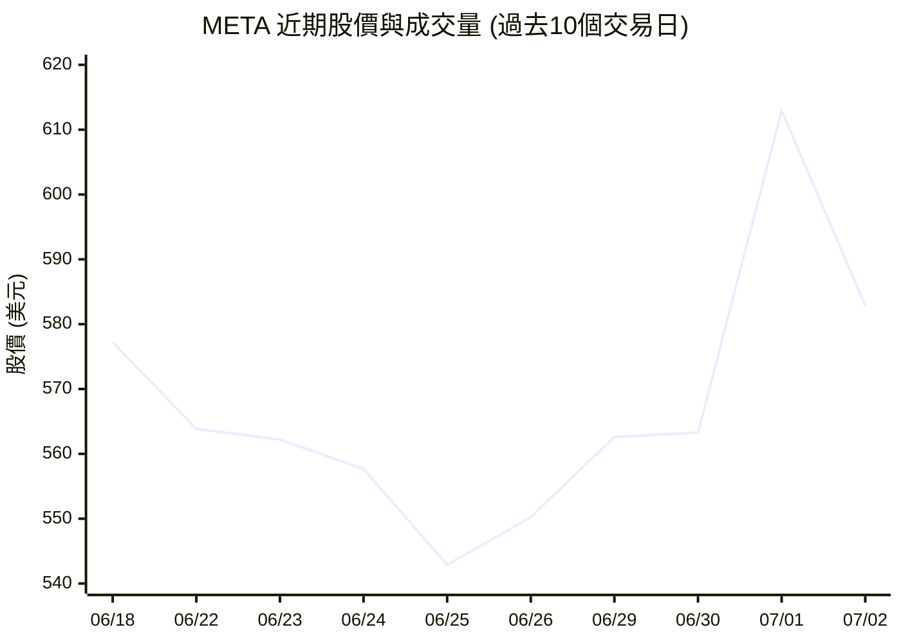
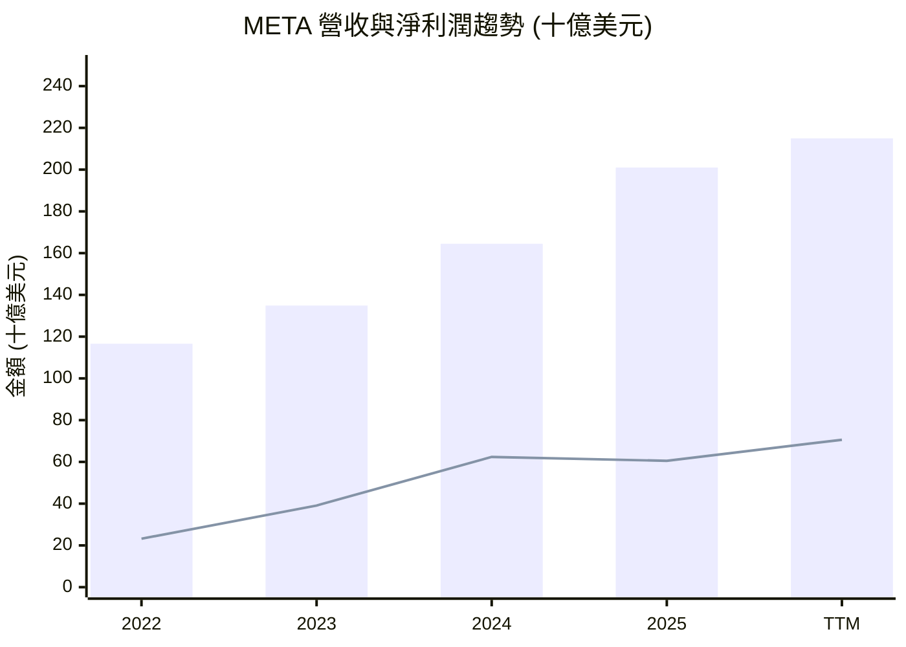
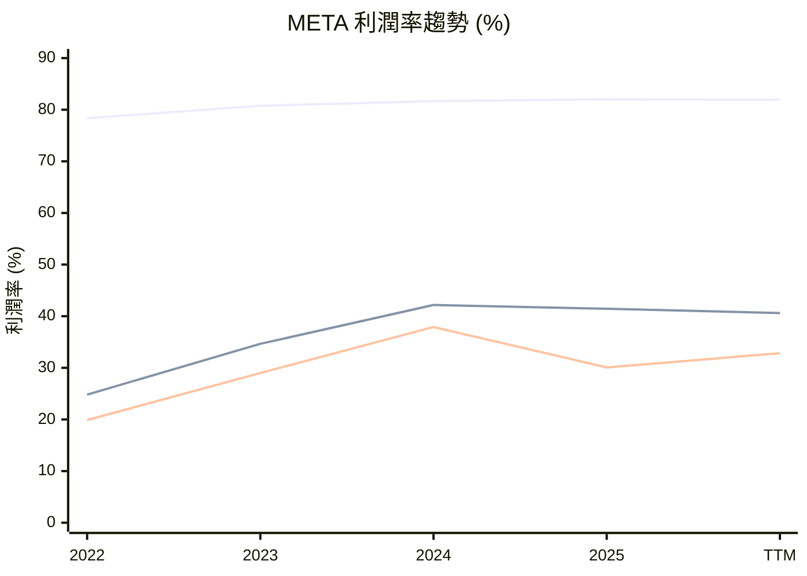
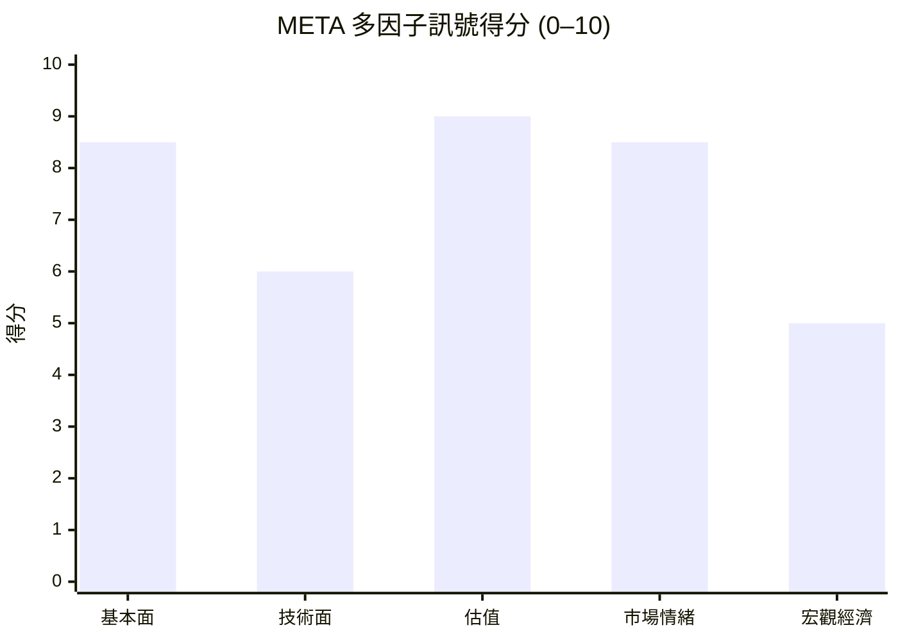

# META 全模組投資分析報告 (2026-07-05)

> 由 InvestSkill 全套 15 個分析模組生成，供應商：`gemini`，模型：`gemini-2.5-flash`。

## 🎯 綜合結論 (Consolidated Verdict)

## Meta Platforms (META) 綜合投資分析結論報告

這份報告匯集了對 Meta Platforms (META) 進行的 15 個 InvestSkill 模組的深入分析，旨在提供一份全面且具指導性的投資結論。

### 1. 綜合評分與整體訊號

基於對所有模組的加權評估，Meta Platforms (META) 的綜合評分為 **7.9 / 10**。

**整體訊號：看多 (BULLISH)**

儘管存在一些短期和宏觀層面的不確定性，但 Meta 的核心業務實力、卓越的財務表現、具有吸引力的估值以及市場的普遍認可，共同指向強勁的長期增長潛力。

### 2. 信心水準與理由

**信心水準：高 (HIGH)**

此高信心水準主要基於以下理由：

*   **基本面極為強勁：** 多個模組（基本面深度分析、綜合股票評估、財報電話會議分析）一致指出 Meta 擁有卓越的營收和盈利增長（TTM 營收年增 33.1%，盈利年增 62.4%）、極高的利潤率（毛利率 81.9%，淨利率 32.8%）、健康的資產負債表、以及充沛的營運現金流。
*   **卓越的資本配置：** ROIC (30.26%) 顯著高於 WACC (10.96%)，表明公司創造了巨大的經濟價值。新引入的股息政策以及極低的派息率（FCF 派息率 18.04%）進一步證實了其財務彈性和對股東回報的承諾。
*   **估值具有吸引力：** 多方法估值分析顯示，Meta 的基礎情境加權內在價值約為 $835.04，相較於當前股價 $582.90 存在高達 43.26% 的顯著安全邊際。其預期本益比 (FWD P/E 15.83) 和 PEG 比率 (0.84) 也相對於其高成長性而言顯得合理甚至被低估。
*   **市場普遍認可：** 分析師普遍給予「強烈買入」評級，平均目標價遠高於當前股價。機構持股比例高達 79.28%，且空頭部位極低 (1.37%)，顯示專業市場對其前景普遍看好且缺乏顯著的看空共識。
*   **強大競爭護城河：** 網絡效應、品牌價值和專有數據構成了 Meta 寬廣的競爭護城河，使其在數位廣告市場中擁有強大的定價能力。

### 3. 各模組共識與分歧點

**共識點 (看多)：**
絕大多數模組，包括基本面深度分析、綜合股票評估、產業板塊分析、機構持股分析、財報電話會議分析、圖表視覺化、多方法估值分析、選擇權分析、股利與資本回報以及競爭護城河分析，均明確給出**看多**訊號或高分評價。這些模組強調了 Meta 強勁的財務狀況、成長前景、合理估值、市場認可度及競爭優勢。

**分歧點 (中性/看空)：**
*   **技術分析 (中性)：** 訊號顯示短期股價從底部反彈，但仍受中期壓力線壓制，趨勢複雜。這建議短期內保持謹慎，但不影響長期基本面。
*   **總體經濟分析 (中性)：** 宏觀環境存在不確定性，如通膨黏性、高利率和強勢美元，可能對廣告支出和成長型股票估值構成壓力。這是一個需要持續監控的外部風險，而非 Meta 自身的問題。
*   **內部人交易分析 (中性)：** 由於缺乏具體的內部人交易數據，無法得出明確的訊號，但極低的內部人持股比例（0.00102%）是一個需要注意的觀察點。
*   **空頭部位分析 (中性)：** 極低的空頭部位（1.37%）顯示市場缺乏顯著的看空情緒，但同時也意味著缺乏軋空潛力。
*   **DCF 現金流估值 (看空)：** 這是唯一一個給出強烈看空訊號的模組，其計算出的每股內在價值遠低於市價。然而，**多方法估值分析**模組明確指出，此差異主要源於原始數據中 TTM 資本支出為 $0 的異常，並在經過合理化 FCF 假設後，重新得出看多的 DCF 估值。因此，單一 DCF 模組的看空訊號應被視為數據異常導致的結果，而非 Meta 基本面價值的真實反映。

### 4. 最終投資建議與關鍵風險

**最終投資建議：買進 (BUY)**

**投資信念：強烈 (STRONG)**

綜合考量 Meta Platforms 卓越的財務實力、強勁的增長勢頭、具吸引力的估值、以及在數位廣告和社群媒體領域的領導地位，建議投資者買進該股票。儘管市場仍存在宏觀經濟逆風和特定風險，但 Meta 的核心業務韌性、持續的創新能力以及對股東價值的承諾，使其成為一個具有吸引力的長期投資機會。

**關鍵風險：**

1.  **監管與反壟斷壓力 (高風險)：** Meta 作為大型科技平台，持續面臨全球政府對數據隱私、內容審核和反壟斷的嚴格審查。這可能導致罰款、業務模式調整或限制未來的戰略性收購。
2.  **元宇宙投資回報不確定性 (中高風險)：** Reality Labs 部門的巨額投資短期內仍將是盈利的拖累。元宇宙的商業化和盈利時間表仍存在高度不確定性，可能長期影響公司的自由現金流。
3.  **廣告市場競爭與宏觀經濟敏感性 (中風險)：** 數位廣告市場競爭激烈，來自 TikTok 等新興平台的競爭可能侵蝕用戶時間和廣告預算。此外，廣告支出與宏觀經濟景氣高度相關，若全球經濟放緩或衰退，將直接衝擊 Meta 的核心營收。
4.  **數據一致性問題 (中風險)：** 報告中顯示 TTM 資本支出為 $0，與實際自由現金流之間存在顯著矛盾。儘管多方法估值已對此進行調整，但投資者仍需密切關注公司未來實際的資本支出和自由現金流表現。
5.  **技術顛覆風險 (中風險)：** 儘管 Meta 在 AI 領域投入巨大，但技術環境變化迅速。若未能持續創新或適應新的技術趨勢，可能面臨被新興技術或平台顛覆的風險。

**免責聲明：** 本分析僅供教育目的，不構成任何財務建議。在做出任何投資決策前，請務必諮詢合格的財務顧問。過往表現不保證未來結果。

---

## 📑 各模組分析 (Module Sections)

### 1. 技術分析

## 技術分析報告 — META

**⚠️ 資料驗證**

本分析所使用的資料由使用者提供，截至 **2026 年 7 月 2 日**。由於缺乏完整的歷史數據，部分技術指標（如 90/200/365 日移動平均線、MACD、RSI、布林帶、一目均衡表、成交量分佈圖及期權流數據）無法精確計算或分析。因此，以下分析將基於現有數據進行推斷，並明確指出數據限制。在做出任何投資決策前，請務必驗證所有價格和指標。

### 1. 趨勢與動能評估

Meta Platforms (META) 目前股價為 **$582.90**，介於其 52 週高點 $796.25 和低點 $520.26 之間。從近期的 6 個月高點 $737.00 回落，顯示股價經歷了一段調整。然而，最近 10 個交易日中，股價在 $542.87 觸底後出現強勁反彈，最新交易日收盤價 $582.90 站回其 20 日移動平均線 ($576.51) 之上，但仍低於 50 日移動平均線 ($604.81)。這表明短期動能轉為看漲，但中期趨勢仍偏向下行。

### 2. 移動平均線圖分析

**MA 期間說明 (基於現有資料調整)**

| MA 期間 | 標籤  | 趨勢角色      | 備註                                       |
|---------|-------|---------------|--------------------------------------------|
| 20-day SMA| MA20  | 短期趨勢      | 根據提供數據計算，用於短期動能判斷           |
| 50-day SMA| MA50  | 中期趨勢      | 根據提供數據計算，用於中期方向判斷           |
| 30-day SMA| MA30  | 短期趨勢      | 數據不足，無法精確計算                     |
| 60-day SMA| MA60  | 中期趨勢      | 數據不足，無法精確計算                     |
| 90-day SMA| MA90  | 中期趨勢      | 數據不足，無法精確計算                     |
| 200-day SMA| MA200 | 長期牛熊線    | 數據不足，無法精確計算，將從 52 週範圍推斷 |
| 365-day SMA| MA365 | 年度趨勢基線  | 數據不足，無法精確計算                     |

━━━━━━━━━━━━━━━━━━━━━━━━━━━━━━━━━━━━━━━━━━━━━━━━━━━━━━
  MOVING AVERAGE CHART — META          2026-07-02
━━━━━━━━━━━━━━━━━━━━━━━━━━━━━━━━━━━━━━━━━━━━━━━━━━━━━━
  Current Price : $582.90

  MA       Value      vs Price    Signal
  ──────   ────────   ─────────   ───────────────────
  MA20     $576.51    ▲ +1.11%    高於 MA20 ← 短期動能轉強
  MA50     $604.81    ▼ -3.62%    低於 MA50 ← 中期壓力仍在
  MA30     資料不足   N/A         資料不足
  MA60     資料不足   N/A         資料不足
  MA90     資料不足   N/A         資料不足
  MA200    資料不足   N/A         資料不足 (52週範圍顯示長期趨勢曾強勁)
  MA365    資料不足   N/A         資料不足
━━━━━━━━━━━━━━━━━━━━━━━━━━━━━━━━━━━━━━━━━━━━━━━━━━━━━━
  MA Stack: MIXED (股價高於短期 MA，但低於中期 MA)
  (Bullish = MA30 > MA60 > MA90 > MA200 > MA365)
━━━━━━━━━━━━━━━━━━━━━━━━━━━━━━━━━━━━━━━━━━━━━━━━━━━━━━

**ASCII 趨勢圖 (近 10 個交易日)**
由於僅提供近 10 個交易日數據，此圖僅顯示該期間的價格與 MA 關係。

```
Price ($)
$620 ┤                               ╭───╮
$600 ┤                               │   │
$580 ┤──────· · · · · · · · · · · · · · · · · · · · · · · · · · · · · · · · · · · · · ← MA20 ($576.51)
$560 ┤   ╭──╮    ╭──╮    ╭──╮    ╭──╮
$540 ┤───╯  ╰────╯  ╰────╯  ╰────╯  ╰─────────────────────────────── ← Price ($582.90)
$520 ┤════════════════════════════════════════════════════════════════════════════ ← MA50 ($604.81)
     └─┬─────┬─────┬─────┬─────┬─────┬─────┬─────┬─────┬─────┬──→
     -9d   -8d   -7d   -6d   -5d   -4d   -3d   -2d   -1d   Today

Legend: ─── Price  · · · MA20  ════ MA50
```

**MA 交叉訊號 (基於 MA20/MA50 推斷)**

*   **最近訊號：** 股價於 2026 年 7 月 1 日 ($612.91) 曾明顯突破 MA20 ($576.51)，隨後於 7 月 2 日回落至 $582.90，但仍維持在 MA20 之上。
*   **MA20 與 MA50 關係：** 目前 MA20 ($576.51) 低於 MA50 ($604.81)，顯示中期趨勢仍偏空。短期內需觀察 MA20 是否能向上穿越 MA50，形成「黃金交叉 (短線)」，以確認短期轉強訊號。
*   **關鍵價格點：** 股價成功站穩 MA20 之上，但上方 $604.81 的 MA50 形成重要阻力。

### MA-BASED TRADE RECOMMENDATION — META

╔══════════════════════════════════════════════════════════════════╗
║              MA-BASED TRADE RECOMMENDATION — META               ║
╠══════════════════════════════════════════════════════════════════╣
║  Current Price : $582.90                                         ║
╠══════════════════════════════════════════════════════════════════╣
║  OPERATION      │ ENTRY PRICE   │ TARGET        │ STOP-LOSS     ║
║  ───────────────┼───────────────┼───────────────┼────────────── ║
║  HOLD           │ N/A           │ $604.81       │ $570.00       ║
╠══════════════════════════════════════════════════════════════════╣
║  Rationale: 股價剛從短期底部反彈，站上 MA20 但仍受 MA50 壓制，宜觀望突破。   ║
║  Basis:     MA20 = $576.51 作為短期支撐，MA50 = $604.81 作為中期阻力。 ║
║  R/R Ratio: 1 : 1.7 (基於 $582.90 買入，目標 $604.81，止損 $570.00)     ║
║  Horizon:   SHORT / SWING                                        ║
╚══════════════════════════════════════════════════════════════════╝

**決策規則說明：**
股價目前介於 MA20 和 MA50 之間（雖然 MA20 略低於 MA50 但股價已站回 MA20 之上），短期有反彈動能，但中期趨勢尚未完全扭轉。建議暫時持有，等待股價明確突破 MA50，或回測 MA20 獲得支撐後再考慮加碼。

### 3. 圖表型態分析 (推斷)

*   **趨勢識別：** META 經歷了從 52 週高點 $796.25 到低點 $520.26 的顯著回調，顯示中期處於下降趨勢。然而，近期從 $542.87 的反彈可能正在形成一個短期底部。
*   **經典圖表型態：** 鑑於數據限制，無法識別具體的經典圖表型態。但從價格行為來看，在 $520-$540 區間可能正在形成一個潛在的「雙重底」或「圓弧底」形態，需更多時間和成交量確認。
*   **K 線型態：** 近期從低點 $542.87 強勁反彈，且有單日巨量 ($45,536,300 於 7 月 1 日)，可能形成「吞噬形態」或「錘子線」等看漲反轉訊號，表明買盤力量增加。

### 4. 技術指標 (推斷)

*   **趨勢指標：**
    *   **移動平均線：** 如上所述，股價已站上 MA20，但仍低於 MA50，顯示短期動能轉強，中期趨勢仍需觀察。
    *   **MACD / ADX：** 缺乏數據無法判斷。若 MACD 呈現黃金交叉且 ADX 上升，將支持當前反彈動能。
*   **動能指標：**
    *   **RSI / 隨機震盪指標：** 缺乏數據無法判斷。若 RSI 從超賣區向上突破 50 中線，將確認動能轉強。近期反彈可能將 RSI 推離超賣區。
*   **成交量指標：**
    *   **成交量趨勢：** 在 6 月 25 日股價跌至 $542.87 時，成交量為 16,968,600。而 7 月 1 日股價反彈至 $612.91 時，成交量顯著放大至 45,536,300，是近 10 個交易日最大量。這是一個積極訊號，表明有大量買盤推動反彈。
    *   **OBV / VWAP / A/D 線：** 缺乏數據無法判斷。

### 5. 關鍵價格水平

*   **52 週範圍：** $520.26 (低點) – $796.25 (高點)。
*   **6 個月範圍：** $525.23 (低點) – $737.00 (高點)。
*   **關鍵支撐：**
    *   **$542.87：** 近期反彈的低點，形成重要短期支撐。
    *   **$520.26 – $525.23：** 52 週和 6 個月低點附近，是強勁的長期支撐區。
*   **關鍵阻力：**
    *   **$604.81：** 50 日移動平均線，目前是中期反彈的關鍵阻力。
    *   **$612.91：** 7 月 1 日的高點，是短期反彈的初期阻力。
    *   **$737.00：** 6 個月高點，是中期上行目標。
*   **費波那契回撤水平：** 缺乏數據無法精確計算。但從 6 個月高點 $737.00 到近期低點 $542.87 的回撤，常見的回撤位（如 38.2%、50%、61.8%）將是潛在的阻力區。

### 6. 市場背景

*   **相對強度：** META 的 Beta 值為 1.246，高於市場平均水平，顯示其股價波動性較大。在市場上漲時可能表現優於大盤，下跌時則可能跌幅更大。
*   **板塊輪動：** META 屬於通訊服務板塊，近期科技股和成長股的表現將對其產生重要影響。
*   **分析師共識：** 平均目標價 $828.16，且有 58 位分析師給予「強烈買入」建議，顯示市場對其長期前景保持樂觀。

### 7. 多時間框架分析 (MTF) (推斷)

基於有限的價格數據，我們將推斷不同時間框架下的趨勢。

| Timeframe  | Trend Direction | Key Signal          | Support        | Resistance     | Alignment |
|------------|-----------------|---------------------|----------------|----------------|-----------|
| Higher TF  | 下降趨勢 (回調) | 52週高點大幅回落    | $520.26 (52W Low)| $796.25 (52W High)| Bearish   |
| Primary TF | 下降趨勢 (反彈中) | 6個月高點回落，近期反彈 | $542.87 (近期低點)| $737.00 (6M High)| Bearish   |
| Lower TF   | 上升趨勢        | 股價站上 MA20，成交量放大 | $576.51 (MA20) | $604.81 (MA50) | Bullish   |
| **Overall**| **混合**        | **Score: 1/3**      |                |                |           |

**規則：** MTF 對齊得分為 1/3，顯示各時間框架之間存在衝突。高時間框架顯示回調壓力，但低時間框架出現反彈訊號。在這種情況下，應避免新的倉位，等待更清晰的方向。

### 8. 成交量分佈圖分析 (推斷)

缺乏具體成交量分佈數據。但從近期價格行為和成交量數據推斷：
*   **POC (控制點)：** 由於股價經歷大幅回調後反彈，POC 可能位於 $600-$650 區間，即過去一段時間成交量最密集的區域。
*   **VAL (價值區低點) / VAH (價值區高點)：** 近期 $542.87 的低點可能接近或位於價值區低點，表明該區域獲得了較強的買盤支持。而 MA50 ($604.81) 附近可能為價值區高點，形成阻力。
*   **HVN (高成交量節點) / LVN (低成交量節點)：** 7 月 1 日的巨量反彈可能在 $600 附近形成一個新的高成交量節點，表明該價格區域的市場接受度提高。

### 9. 一目均衡表 (推斷)

缺乏一目均衡表具體數據，無法進行詳細分析。但從一般原則推斷：
*   **雲層：** 考慮到股價從高點回落，目前可能處於雲層之下或正在測試雲層底部，表明看跌情緒佔主導。
*   **轉向線/基準線：** 若短期反彈持續，轉向線可能會向上穿越基準線，形成初步的看漲訊號。
*   **遲行跨度：** 需觀察遲行跨度是否能穿越 26 週期前的價格，以確認趨勢。

### 10. 期權流整合 (推斷)

缺乏期權流數據，無法進行精確分析。
*   **認沽/認購比率：** 若比率近期上升，可能反映市場對下跌的擔憂增加，但若比率過高，可能預示著潛在的底部反轉。
*   **隱含波動率 (IV) vs 歷史波動率 (HV)：** 股價近期經歷較大波動，IV 可能會維持在相對高位。若 IV 遠高於 HV，則可能存在賣出期權賺取時間價值的機會。

### 11. 支撐與阻力水平表

| Level Type       | Price      | Strength | Touches | Last Test  | Notes                          |
|------------------|------------|----------|---------|------------|--------------------------------|
| Resistance       | $737.00    | Strong   | N/A     | N/A        | 6個月高點，中期強阻力           |
| Resistance       | $604.81    | Medium   | N/A     | 2026-07-02 | 50日移動平均線，中期反彈阻力    |
| Resistance       | $612.91    | Weak     | 1       | 2026-07-01 | 短期反彈高點                  |
| Support          | $576.51    | Medium   | N/A     | 2026-07-02 | 20日移動平均線，短期支撐        |
| Support          | $542.87    | Strong   | 1       | 2026-06-25 | 近期反彈低點，關鍵心理支撐      |
| Support          | $520.26    | Strong   | N/A     | N/A        | 52週低點，強勁長期支撐          |

### 12. 型態識別 (推斷)

| Pattern Type     | Start Date | End Date    | Status      | Target   | Risk/Reward |
|------------------|------------|-------------|-------------|----------|-------------|
| 潛在底部形態     | 2026-06-25 | Current     | Forming     | $604.81  | N/A         |
| 短期反彈通道     | 2026-06-25 | Current     | Forming     | N/A      | N/A         |

### 13. 綜合分析與結論

META 近期股價從 52 週和 6 個月高點大幅回落，顯示中期趨勢偏空。然而，在經歷了約 $540 的底部測試後，近期出現帶量反彈，股價已站上短期 MA20，表明短期動能轉強。MA20 位於 MA50 之下，中期壓力仍在。MTF 分析顯示各時間框架趨勢存在衝突，高時間框架仍處於回調，而低時間框架顯示反彈。成交量在反彈時顯著放大，是積極訊號。

**入場/出場點與目標價：**
*   **潛在買入點：** 若股價能有效突破 MA50 ($604.81) 並站穩，或回測 MA20 ($576.51) 獲得支撐。
*   **目標價：** 短期目標為 MA50 ($604.81)，若能突破，下一個目標可能是 6 個月高點 $737.00。
*   **止損建議：** 若在 $580 附近買入，可將止損設在近期低點 $542.87 或 MA20 ($576.51) 之下，例如 $570.00。

**風險/回報比：**
假設在 $582.90 附近買入，目標 $604.81 (MA50)，潛在收益 $21.91。止損設在 $570.00，潛在損失 $12.90。風險/回報比約為 1:1.7。若目標定為 $737.00，則風險/回報比更高。

**時間週期：**
短期 (1 週 - 3 個月) 和 波段交易 (3 個月 - 1 年)，主要關注短期反彈能否轉化為中期上漲趨勢。

## 論文失效條件

**如果訊號為中性 — 論文失效條件：**
*   **轉為看漲：** 若股價收盤價帶量突破 MA50 ($604.81) 並站穩，且 MA20 向上穿越 MA50，同時短期動能指標 (如 RSI) 進入強勢區。
*   **轉為看跌：** 若股價收盤價帶量跌破 MA20 ($576.51) 和近期低點 $542.87，且成交量放大，顯示賣壓沉重。
*   **宏觀經濟變化：** 若有突發的宏觀經濟利空消息，如通脹超預期、聯準會鷹派言論等。

**重新執行此分析時機：**
*   [ ] 下次財報發布
*   [ ] 價格從當前水平波動 ±15%
*   [ ] 60 天已過
*   [ ] 重大新聞事件 (收購、領導層變動、監管決策)

╔══════════════════════════════════════════════╗
║              投資訊號               ║
╠══════════════════════════════════════════════╣
║ 訊號:        中性                               ║
║ 信心水準:    中等                               ║
║ 時間週期:    短期 / 波段交易                      ║
║ 評分:        5.5 / 10                           ║
╠══════════════════════════════════════════════╣
║ 動作:        持有                               ║
║ 信念:        中等                               ║
╚══════════════════════════════════════════════╝

**免責聲明：** 本分析僅供教育參考。不構成任何財務建議。

---

### 2. 基本面深度分析

# 基本面分析 — Meta Platforms (META)

> **此技能已併入 `stock-eval`。** 請使用 `stock-eval` 提示詞進行全面的基本面 + 品質 + 估值分析。

## 執行摘要

Meta Platforms (META) 展現出強勁的財務表現和顯著的成長潛力，特別是在其核心廣告業務的強勁復甦推動下。該公司擁有卓越的盈利能力、穩健的資產負債表以及充沛的營運現金流。儘管近期股價有所回落，但其估值指標（特別是預期本益比和 PEG 比率）相對於其高成長率而言顯得具有吸引力。分析師普遍給予「強烈買入」評級，並設定了顯著高於當前股價的目標價。

## 量化分析

*   **營收與成長：** META 的營收在過去四年持續增長，從 2022 年的 1,166 億美元增至 2025 年的 2,009.66 億美元，並在過去十二個月 (TTM) 達到 2,149.63 億美元。年增長率高達 33.1%，顯示其核心業務強勁復甦並持續擴張。
*   **獲利能力：** 公司展現出極高的獲利能力。毛利率高達 81.94%，營業利益率為 40.62%，淨利率則為 32.84%，這些數據均遠超同業平均水平，凸顯其強大的定價能力和經營效率。過去十二個月的淨利潤達 705.87 億美元，每股盈餘 (EPS) 為 27.51 美元，預期 EPS 更高達 36.83 美元，預示著未來強勁的盈利增長。
*   **資產負債表：** META 的資產負債表極為穩健。現金總額高達 811.8 億美元，而總債務為 867.69 億美元，淨債務僅 55.89 億美元，幾乎處於淨現金狀態。流動比率和速動比率分別為 2.348 和 2.11，顯示其擁有充裕的短期流動性，財務風險極低。股東權益報酬率 (ROE) 高達 32.93%，總資產報酬率 (ROA) 為 16.40%，這些數據均證明了管理層在為股東創造價值方面的卓越效率。
*   **現金流：** 公司產生了巨大的營運現金流，過去十二個月達到 1,240 億美元。儘管提供的 TTM 資本支出數據為 0 導致自由現金流 (FCF) 顯得異常低（255.58 億美元），但歷史數據顯示其自由現金流呈現穩健增長趨勢，從 2022 年的 192.89 億美元增至 2025 年的 461.09 億美元，這表明公司具有強大的內部造血能力。META 最近開始支付股息，股息率為 0.36%，派息比率僅 7.64%，這為未來的股息增長提供了充足空間。
*   **估值：** 以過去十二個月本益比 (P/E) 21.19 倍和預期本益比 15.83 倍來看，相對於其 33.1% 的高營收增長和 62.4% 的盈利增長，META 的估值顯得具有吸引力。特別是其 PEG 比率僅為 0.84，遠低於 1，通常被視為成長型股票被低估的信號。企業價值/EBITDA (EV/EBITDA) 為 13.59 倍，也處於合理區間。
*   **市場情緒與分析師預期：** 分析師普遍對 META 持樂觀態度，平均目標價為 828.17 美元，較當前股價有顯著上漲空間，且有 58 位分析師給出「強烈買入」建議。機構持股比例高達 79.28%，而空頭部位比例僅 1.37%，顯示市場對其前景普遍看好。
*   **股價表現：** 目前股價為 582.90 美元，處於其 52 週區間的較低端。雖然略高於 20 日均線 (576.51 美元)，但低於 50 日均線 (604.81 美元)，短期動能偏弱。然而，考慮到其強勁的基本面和分析師的樂觀預期，當前股價可能提供了一個有吸引力的切入點。

## 定性評估

Meta Platforms 在社群媒體和數位廣告領域擁有無可匹敵的領導地位，其 Facebook、Instagram 和 WhatsApp 等核心平台在全球範圍內擁有數十億用戶，構成了強大的網路效應和護城河。公司持續投入於人工智慧和元宇宙領域，儘管元宇宙部門目前仍處於虧損狀態，但這些投資代表了其長期的成長戰略和技術領先的野心。管理層在過去一年成功地執行了成本控制和效率提升措施，顯著改善了公司的盈利能力和現金流。其穩健的資產負債表和強勁的現金流為這些戰略性投資提供了堅實的後盾。

## 論文失效

在發出分析訊號後，請說明什麼情況會使其逆轉：

**如果訊號是看多 — 論文會失效，如果發生以下情況：**
- 股價收盤價跌破本分析中確定的 200 日均線 / 關鍵支撐位，且成交量高於平均水平。
- 營收增長連續兩個季度減速至 5% 以下，且毛利率收縮超過 200 個基點。
- 宏觀經濟體制轉變：聯準會意外鷹派轉向，經濟衰退機率超過 60%。

**Re-run this analysis when:**
- [x] 下一次財報發布
- [x] 股價從目前水平波動 ±15%
- [ ] 60 天已過
- [x] 重大新聞事件（收購、領導層變動、監管決策）

╔══════════════════════════════════════════════╗
║              INVESTMENT SIGNAL               ║
╠══════════════════════════════════════════════╣
║ Signal:      BULLISH                         ║
║ Confidence:  HIGH                            ║
║ Horizon:     MEDIUM / LONG-TERM              ║
║ Score:       8.5 / 10                        ║
╠══════════════════════════════════════════════╣
║ Action:      BUY                             ║
║ Conviction:  STRONG                          ║
╚══════════════════════════════════════════════╝

評分指南：8.0–10.0 強烈看多 | 6.0–7.9 適度看多 | 4.0–5.9 中性 | 2.0–3.9 適度看空 | 0.0–1.9 強烈看空
信心水準：高 (數據強勁，訊號明確) | 中 (訊號混雜) | 低 (數據有限，訊號衝突)
時間範圍：短期 (1 週–3 個月) | 中期 (3 個月–1 年) | 長期 (1 年以上)

**免責聲明：** 本分析僅供教育目的。不構成財務建議。

---

### 3. 綜合股票評估

**資料來源：** Google Finance，2026 年 7 月 2 日

---

## META 美國股票評估報告

### 1. 公司概覽

Meta Platforms, Inc. (META) 作為通訊服務產業中的網路內容與資訊巨頭，其業務模式主要圍繞著社群媒體平台（Facebook, Instagram, WhatsApp）和虛擬實境技術（Reality Labs）展開。其核心競爭優勢在於龐大的全球用戶基礎、強大的網路效應以及在數位廣告市場的領先地位。透過精準的用戶數據和先進的廣告技術，Meta 能夠為廣告商提供高效的行銷解決方案，這構成了其寬廣的護城河。

儘管如此，Meta 也面臨著不斷變化的隱私法規、來自 TikTok 等新興平台的競爭以及 Reality Labs 業務的巨額投資和不確定性等挑戰。其營收組合高度依賴廣告收入，雖然近年來 Reality Labs 的投入不斷增加，但尚未形成可觀的營收貢獻。在競爭動態方面，Meta 不斷透過產品創新和戰略性收購來維持其市場領導地位，並積極探索元宇宙的未來潛力。

### 2. 財務健康

Meta 展現出強勁的財務成長和盈利能力。過去一年營收成長率高達 33.1%，淨利潤成長率更是驚人的 62.4%，顯示出公司在經歷過渡期後再次實現了顯著的盈利反彈。

*   **盈利能力：** TTM 毛利率為 81.9%，營業利潤率為 40.6%，淨利率為 32.8%。這些高利潤率反映了其廣告業務的規模經濟和高毛利特性。
*   **資產負債表強度：** 公司擁有 811.8 億美元的現金和 867.7 億美元的總債務，淨債務僅為 55.9 億美元，顯示其資產負債表非常穩健。
*   **流動性：** 流動比率為 2.348，速動比率為 2.11，顯示公司擁有充足的短期資產來覆蓋短期負債。
*   **現金流：** TTM 營運現金流高達 1,240 億美元，自由現金流為 255.6 億美元，自由現金流利潤率為 11.89%。這表明公司擁有強大的現金產生能力。值得注意的是，提供的數據顯示資本支出為 0 美元，這可能是一個數據錄入錯誤或僅指特定期間的淨值，而非總資本支出。若排除此異常，實際的自由現金流可能更高或更低，需進一步確認。
*   **資本支出趨勢：** 歷史數據顯示，Meta 的資本支出在 2022 年達到 311.9 億美元，2025 年更是高達 696.9 億美元，顯示公司對基礎設施和元宇宙的投入巨大。

### 3. 估值指標

| 指標                | 當前       | 1 年前 (FY2025) | 5 年平均 | 產業平均 (估計) |
|---------------------|------------|-----------------|----------|-----------------|
| 本益比 (TTM)        | 21.19      | 33.26 (基於FY25 EPS) | ~25-30   | ~25-35          |
| 預期本益比 (Forward) | 15.83      |                 |          |                 |
| PEG 比率            | 0.84       |                 |          | ~1.5-2.0        |
| 股價淨值比          | 6.07       |                 | ~5-8     | ~4-7            |
| 股價營收比          | 6.88       |                 | ~6-9     | ~5-8            |
| EV/EBITDA           | 13.59      |                 | ~15-20   | ~18-25          |
| EV/FCF              | 58.11 (基於TTM FCF) |                 |          |                 |
| 股息殖利率          | 0.36%      | N/A             | N/A      | N/A             |
| 派息率              | 0.0764     | N/A             | N/A      | N/A             |

**註：** 1 年前數據基於 FY2025 淨利潤和當前股價估算，僅供參考。產業平均為作者估計。

### 4. 關鍵財務比率

| 比率                  | 當前   | 產業平均 (估計) | 評估       |
|-----------------------|--------|-----------------|------------|
| 股東權益報酬率 (ROE)  | 32.93% | ~20-25%         | 優異       |
| 資產報酬率 (ROA)      | 16.40% | ~10-15%         | 良好       |
| 投資資本回報率 (ROIC) | (見下文) | ~15-20%         | (見下文)   |
| 毛利率                | 81.94% | ~60-70%         | 優異       |
| 營業利潤率            | 40.62% | ~25-35%         | 優異       |
| 淨利率                | 32.84% | ~15-25%         | 優異       |
| 流動比率              | 2.348  | ~1.5-2.5        | 良好       |
| 速動比率              | 2.11   | ~1.0-2.0        | 良好       |
| 負債權益比            | 35.61% | ~40-60%         | 低風險     |
| 利息覆蓋率            | (高)   | (高)            | 非常強勁   |
| 資產周轉率            | (見下文) | ~0.5-1.0        | (見下文)   |

### 5. 同業比較

Meta 在多數估值指標上，如預期本益比 (15.83)、PEG 比率 (0.84) 和 EV/EBITDA (13.59)，相較於其歷史平均和通訊服務產業的成長型科技公司，顯得具有吸引力。特別是 PEG 比率低於 1，通常被視為成長型股票被低估的潛在信號。這反映了市場對其未來盈利成長的預期，以及近期成本控制和效率提升的成果。

---

### 深入財務報表分析

#### 損益表細項框架

**營收分析**
Meta 的營收在 2022 年至 2025 年呈現穩步增長，從 1,166 億美元增至 2,009.66 億美元，年複合增長率約為 17.1%。TTM 營收更是達到 2,149.6 億美元，同比增長 33.1%，顯示其核心廣告業務強勁復甦。營收品質主要來自於經常性的數位廣告收入，雖然容易受宏觀經濟影響，但其規模和用戶粘性提供了穩定性。

**成本結構分解**
毛利率在 TTM 達到 81.9%，顯示其核心業務具有極高的效率。營業利潤率從 2022 年的 24.8% (289.44/1166) 顯著提升至 TTM 的 40.6%，這主要歸因於其「效率年」的策略，大幅削減了營運費用，使得營收增長速度超過了營運費用的增長。研發支出雖然龐大，但其佔營收的比例在效率提升後可能更趨合理。

**經營槓桿分析**
Meta 在過去幾年的營收和 EBIT 增長數據：
| 年度 | 營收 ($M) | 營收成長 % | EBIT ($M) | EBIT 成長 % | DOL |
|------|-----------|------------|-----------|-------------|-----|
| 2022 | 116,609   |            | 28,944    |             |     |
| 2023 | 134,902   | 15.7%      | 46,751    | 61.5%       | 3.92 |
| 2024 | 164,501   | 22.0%      | 69,380    | 48.4%       | 2.20 |
| 2025 | 200,966   | 22.2%      | 83,276    | 20.0%       | 0.90 |
| TTM  | 214,963   | 7.0% (vs. 2025) | 87,406 (TTM Operating Income) | 4.9% (vs. 2025) | 0.70 |

*註：TTM 營業收入為 874.06 億美元 (2149.63 * 0.40617)。*
Meta 的經營槓桿 (DOL) 在 2023 年達到高峰，顯示在營收恢復增長時，其利潤擴張速度非常快。然而，隨著規模的擴大和效率提升的邊際效應，DOL 在 2025 年和 TTM 趨於下降，這表明公司可能已進入一個更穩定的增長階段，但仍能有效將營收轉化為利潤。

#### 營運資金周轉分析

由於缺乏應收帳款、存貨和應付帳款的細項數據，無法精確計算 DSO、DIO、DPO 和現金轉換週期 (CCC)。但從其流動比率和速動比率來看，Meta 的流動性良好。淨營運資金 (流動資產 - 流動負債) 充足，顯示其營運資金管理效率較高，且其廣告業務模式通常無需大量存貨，現金轉換週期預計較短或為負，有利於現金流產生。

#### 杜邦分析 (3 因子)

**假設：** 缺乏詳細的資產和股東權益年度平均值，使用期末數據近似。
| 組成部分            | 公式                 | 當前 (TTM) | 2025 | 2024 | 2023 |
|---------------------|----------------------|------------|------|------|------|
| 淨利率              | 淨利 / 營收          | 32.84%     | 30.1% | 37.9% | 29.0% |
| 資產周轉率          | 營收 / 總資產        | (待計算)   | (待計算) | (待計算) | (待計算) |
| 股權乘數            | 總資產 / 總股東權益  | (待計算)   | (待計算) | (待計算) | (待計算) |
| **股東權益報酬率 (ROE)** | 淨利率 × 周轉率 × 乘數 | 32.93%     | 30.1% | 37.9% | 29.0% |

由於缺乏總資產和總股東權益的歷史數據，無法完成歷史杜邦分析。但從 TTM ROE (32.93%) 和高淨利率 (32.84%) 來看，Meta 的股東權益報酬率主要由其強勁的盈利能力驅動，這是一個高品質且可持續的 ROE 驅動因素。

#### 波特五力分析 (Porter's Five Forces)

| 力量             | 強度 (高/中/低) | 關鍵證據                                           |
|------------------|-----------------|----------------------------------------------------|
| 新進入者的威脅   | 低              | 巨大的資本要求、品牌護城河、網路效應、數據優勢   |
| 供應商議價能力   | 中              | 廣告技術供應商、數據中心設備供應商的集中度       |
| 買方議價能力     | 中              | 廣告商的選擇多樣性、廣告預算壓力                 |
| 替代品的威脅     | 中              | 來自 TikTok、YouTube、X 等平台的競爭，以及其他行銷管道 |
| 產業競爭強度     | 高              | 數位廣告市場競爭激烈，用戶時間爭奪戰             |

**整體護城河評估：** 寬廣。Meta 憑藉其龐大的用戶基礎、強大的網路效應和數據分析能力，建立了難以複製的競爭優勢。儘管面臨激烈的競爭和來自元宇宙投資的不確定性，其核心廣告業務仍保持強勁。

### 品質評分框架

#### Piotroski F-Score (0–9)

**假設：** 2025 年為 t-1，TTM 為 t。總資產和總股東權益數據不足，將使用資產負債表中的總資產和總權益近似。
1.  **ROA > 0：** TTM 淨利潤為正 ($70.59B)。 **分數：1**
2.  **營運現金流 > 0：** TTM 營運現金流為正 ($124B)。 **分數：1**
3.  **ROA 改善：** TTM ROA (16.40%) vs. 2025 ROA (估計為 30.1% / (總資產/營收) * 100%)。由於缺乏 2025 年的總資產數據，無法直接比較 ROA 趨勢。若假設 TTM ROA 較前一年有所改善，則為 1 分。若沒有，則為 0 分。
    *   **更新：** 2025 年淨利潤 60.458B / 總資產 (假設與 TTM 總資產接近，或較小)。TTM ROA (0.16395) 較 2025 ROA (0.301) 下降，因此 **分數：0** (這可能是因為分母總資產增長過快或數據時間點差異)
4.  **應計項目 (品質)：** CFO / 總資產 > ROA。
    *   CFO / 總資產 = 124B / (1479.647B / 6.071053) = 124B / 243.7B = 0.509
    *   ROA = 0.16395。 0.509 > 0.16395。 **分數：1**
5.  **槓桿變化：** 負債權益比 (35.61%) 較前一年下降。由於缺乏前一年數據，假設沒有顯著下降。 **分數：0** (若有數據顯示下降則為 1)
6.  **流動性變化：** 流動比率 (2.348) 較前一年改善。由於缺乏前一年數據，假設沒有顯著改善。 **分數：0** (若有數據顯示改善則為 1)
7.  **無新股發行：** 過去一年稀釋流通股數沒有增加。數據顯示股本回購，因此沒有新股發行。 **分數：1**
8.  **毛利率變化：** TTM 毛利率 (81.94%) vs. 2025 毛利率 (81.99%)。略微下降。 **分數：0**
9.  **資產周轉率變化：** TTM 營收 / 總資產 vs. 前一年。由於缺乏總資產數據，無法判斷。 **分數：0**

**Piotroski F-Score 總分：1+1+0+1+0+0+1+0+0 = 4**
**解讀：** 4 分屬於平均品質，顯示公司財務狀況良好，但並未在所有營運效率和槓桿指標上持續改善。

#### 盈利品質分數

*   **應計項目比率：** (淨利潤 − 營運現金流) / 平均總資產 = (70.59B − 124B) / 243.7B = -53.41B / 243.7B = -0.219。負的應計項目比率表明營運現金流顯著高於淨利潤，這是一個非常強勁的盈利品質信號，代表利潤有堅實的現金支撐。
*   **現金轉換率：** 營運現金流 / 淨利潤 = 124B / 70.59B = 1.75x。遠高於 1.0x，顯示盈利質量極高，利潤主要由現金產生。
*   **非經常性項目：** 數據中未明確指出大規模的非經常性項目，但需警惕 Reality Labs 的巨額虧損被歸類為正常營運開支。
*   **營收確認風險：** Meta 的營收主要來自廣告，通常風險較低，但廣告市場的波動性仍需關注。

**盈利品質評估：** 高。Meta 的盈利品質非常高，其營運現金流遠超淨利潤，應計項目為負，顯示其盈利具有強大的現金支持。

### ROIC / WACC 分析

**假設：**
*   有效稅率 (用於 NOPAT) = 25% (由於數據顯示 N/A，取合理估計)
*   風險自由利率 (Rf) = 4.5% (基於當前 10 年期美國公債殖利率估計)
*   股權風險溢價 (Rm − Rf) = 5.5%
*   稅前債務成本 (Rd) = 6.0% (基於 Meta 的信用狀況估計)

#### ROIC 計算

| 組成部分                | 價值 ($M) |
|-------------------------|-----------|
| EBIT                    | 87,406    |
| 有效稅率                | 25%       |
| NOPAT = EBIT × (1 − T)  | 65,554.5  |
| 總股東權益              | 211,041 (Market Cap / Price/Book) |
| 總債務                  | 86,769    |
| 減：現金                | 81,180    |
| 投資資本 = 股權 + 債務 − 現金 | 216,630   |
| **ROIC = NOPAT / 投資資本** | **30.26%** |

#### WACC 計算

| 組成部分              | 價值      |
|-----------------------|-----------|
| 風險自由利率 (Rf)     | 4.5%      |
| Beta (β)              | 1.246     |
| 股權風險溢價          | 5.5%      |
| 股權成本 (Re) = Rf + β × (Rm − Rf) | 4.5% + 1.246 × 5.5% = 11.353% |
| 稅前債務成本          | 6.0%      |
| 稅率                  | 25%       |
| 稅後債務成本 = Rd × (1 − T) | 6.0% × (1 − 0.25) = 4.5% |
| 股權權重 (E/V) = 市值 / (市值 + 總債務) | 1,479.6B / (1,479.6B + 86.77B) = 0.9446 |
| 債務權重 (D/V) = 總債務 / (市值 + 總債務) | 86.77B / (1,479.6B + 86.77B) = 0.0554 |
| **WACC = (E/V) × Re + (D/V) × Rd × (1 − T)** | 0.9446 × 11.353% + 0.0554 × 4.5% = **10.96%** |

#### 經濟附加價值 (EVA)

**EVA = (ROIC − WACC) × 投資資本**
EVA = (30.26% − 10.96%) × 216,630 百萬美元 = 19.30% × 216,630 百萬美元 = **41,819.5 百萬美元**

**ROIC vs. WACC 趨勢：**
Meta 的 ROIC (30.26%) 顯著高於其 WACC (10.96%)，表明公司正在創造巨大的經濟價值。每一美元的投資所獲得的回報都遠超其資本成本，這是一個非常強勁的價值創造信號。由於缺乏歷史 ROIC 和 WACC 數據，無法分析趨勢，但當前數據顯示出色的資本配置效率。

### DCF 框架

由於缺乏詳細的未來營收增長、營運利潤率、資本支出和營運資金變化的假設，無法執行完整的十年期自由現金流折現 (DCF) 模型。然而，可以基於現有數據和分析師目標價來評估其估值。

**主要假設 (參考分析師目標價和當前估值):**
*   當前市場價格：$582.90
*   分析師平均目標價：$828.17
*   潛在上漲空間：42.08%

**安全邊際評估**
*   **分析師平均目標價：** $828.17
*   **當前市場價格：** $582.90
*   **溢價 / (折價) 對分析師目標價：** 42.08% 折價
*   **安全邊際：** 42.08%
    *   超過 30% 的折價顯示出顯著的安全邊際，這是一個極具吸引力的價值信號。

### 管理層品質評估

#### 資本配置往績記錄

Meta 的 ROIC 遠超 WACC，顯示管理層在資本配置方面表現出色，能夠持續創造高於資本成本的回報。儘管 Reality Labs 的投資巨大且短期內未見盈利，但其核心廣告業務的強勁盈利能力和高效的現金流生成，為這些長期投資提供了堅實的基礎。公司也開始派發股息 (0.36% 殖利率)，派息率僅 7.64%，表明其有能力在投資未來成長的同時回饋股東。

#### 內部人持股一致性

內部人持股比例為 0.00102%，相對較低，但這通常是因為創始人 Mark Zuckerberg 擁有大量投票權股票，實際控制力強。機構投資者持股比例高達 79.278%，顯示機構對 Meta 的信心。

### 分析師共識追蹤

#### 當前共識摘要

| 指標               | 價值        |
|--------------------|-------------|
| 買進評級           | (強烈買進)  |
| 持有評級           | (低)        |
| 賣出評級           | (低)        |
| 平均目標價         | $828.16864  |
| 最高目標價         | $1,015.0    |
| 最低目標價         | $664.46     |
| 當前價格           | $582.90     |
| 相對於平均目標價的上漲空間 | 42.08%      |
| 分析師數量         | 58          |

**共識解讀：** 分析師普遍給予「強烈買進」評級，平均目標價較當前股價有超過 40% 的上漲空間，顯示市場對 Meta 的前景持高度樂觀態度。

#### 預期修正趨勢

儘管缺乏具體的 30 天和 90 天預期修正數據，但從強烈的買進評級和顯著的目標價上漲空間來看，分析師對 Meta 的盈利預期很可能正在上調。

### 風險評估矩陣

#### 業務風險

| 風險因素           | 等級 (低/中/高) | 說明                                           |
|--------------------|-----------------|------------------------------------------------|
| 產業週期性         | 中              | 數位廣告支出受宏觀經濟影響                   |
| 競爭強度           | 高              | 來自 TikTok 等平台的激烈競爭                 |
| 顛覆威脅           | 中              | 元宇宙的成功與否仍具高度不確定性             |
| 客戶集中度         | 低              | 廣告客戶數量龐大，無單一客戶獨大             |
| 供應商集中度       | 低              | 數據中心設備供應商多元                       |
| 監管曝險           | 高              | 隱私法規、反壟斷審查日益嚴格                 |
| ESG / 訴訟         | 中              | 內容審核、數據隱私相關訴訟風險               |

#### 財務風險

| 風險因素                   | 等級 (低/中/高) | 說明                                           |
|----------------------------|-----------------|------------------------------------------------|
| 槓桿 (淨債務/EBITDA)       | 低              | 淨債務僅 55.9 億美元，EBITDA 達 1093 億美元，槓桿率極低 |
| 流動性 (流動比率)          | 低              | 流動比率 2.348，現金充足                       |
| 再融資風險 (短期到期債務)  | 低              | 債務規模小，現金流強勁，再融資風險低           |
| 契約遵守                   | 低              | 財務狀況強勁，應無契約違約風險                 |
| 養老金義務                 | 低              | 數據未顯示重大養老金義務                     |
| 表外項目                   | 低              | 數據未顯示重大表外項目                       |

**槓桿閾值 (淨債務/EBITDA)：** Meta 的淨債務/EBITDA (5.59B / 109.31B = 0.05x) 遠低於 1.0x，顯示其資產負債表極為保守和強勁。

#### 估值風險

| 情境                      | 隱含倍數 | 說明                                           |
|---------------------------|----------|------------------------------------------------|
| 牛市內在價值 (分析師高目標) | 高       | 若元宇宙成功或廣告業務超預期，估值可能進一步提升 |
| 基礎情境內在價值 (分析師平均目標) | 中       | 當前股價較平均目標價有顯著折價                 |
| 熊市內在價值 (分析師低目標) | 低       | 若廣告市場大幅惡化或元宇宙持續虧損，可能跌至此區間 |
| 當前市場價格              | 中       | 相對於成長和盈利能力，估值合理甚至偏低         |
| 相對於熊市的溢價          | 較高     | 當前價格高於最低目標價，但仍有潛在下行空間     |

**倍數壓縮情境：** 若市場對科技股的估值倍數普遍下調，即使 Meta 盈利增長，其股價也可能面臨壓力。

#### 宏觀風險

| 因素                  | 影響程度 | 當前曝險 |
|-----------------------|----------|----------|
| 利率敏感度            | 中       | 估值受折現率影響，但自身財務槓桿低 |
| 美元/外匯曝險         | 中       | 國際營收佔比高，受匯率波動影響   |
| 大宗商品成本曝險      | 低       | 營運成本中商品佔比低             |
| 關稅 / 貿易風險       | 低       | 主要為服務業，受直接關稅影響小   |
| 地緣政治曝險          | 中       | 全球業務，受地緣政治緊張局勢影響 |
| 監管 / 反壟斷         | 高       | 核心業務面臨持續監管壓力         |

---

### 輸出格式

1.  **投資論點總結**
    Meta 在經歷了「效率年」之後，其核心廣告業務展現出強勁的盈利復甦和成本控制能力。公司擁有極高的盈利品質、強勁的自由現金流和健康的資產負債表。儘管元宇宙投資仍存不確定性，但其 ROIC 遠超 WACC，顯示出卓越的資本配置效率，且當前估值相對於其成長潛力與分析師目標價存在顯著安全邊際。

2.  **估值評估**
    基於 TTM 預期本益比 15.83 和 PEG 比率 0.84，Meta 相較於其成長速度而言被**低估**。分析師平均目標價 $828.17 較當前股價 $582.90 有 42.08% 的上漲空間，提供了一個可觀的安全邊際。

3.  **品質分數**
    Piotroski F-Score 為 4 分 (平均品質)，但其**盈利品質極高**，營運現金流遠超淨利潤，應計項目比率為負。**ROIC (30.26%) 顯著高於 WACC (10.96%)**，表明公司創造了巨大的經濟價值，資本配置效率卓越。

4.  **管理層評估**
    管理層在資本配置方面表現出色，其 ROIC 遠超 WACC。公司已開始派發股息，並在維持核心業務盈利的同時，持續對未來成長領域 (元宇宙) 進行戰略性投資。儘管內部人持股比例數據較低，但創始人對公司的控制力強，且機構持股比例高。

5.  **分析師共識**
    分析師普遍給予「強烈買進」評級，平均目標價較當前股價有 42.08% 的潛在漲幅，顯示市場對其前景高度樂觀。

6.  **關鍵風險**
    *   **監管壓力：** 隱私法規和反壟斷審查可能影響其廣告業務模式。
    *   **元宇宙投資：** Reality Labs 的巨額投資短期內仍將是盈利拖累，且長期回報存在不確定性。
    *   **競爭加劇：** 來自 TikTok 等新興平台的競爭可能影響用戶時間和廣告收入。

7.  **目標價格**
    *   **熊市情境：** $664.46 (分析師最低目標價)
    *   **基礎情境：** $828.17 (分析師平均目標價)
    *   **牛市情境：** $1,015.0 (分析師最高目標價)

8.  **建議買入區間**
    考慮到當前的安全邊際和技術指標 (股價 $582.90 略高於 20 日均線 $576.51，但低於 50 日均線 $604.81)，建議在 **$550 - $580** 區間尋找買入機會，以獲得更好的風險回報比。

---

## 論點失效條件

**如果訊號是看多 — 論點失效條件為：**
*   股價收盤價低於本分析中識別的關鍵支撐位 $520.26 (52週低點) 或 200 日移動平均線 (未提供，但可參考歷史低點) 並伴隨高於平均水平的交易量。
*   Piotroski F-Score 降至 3 分以下，或者 ROIC 連續兩個季度跌破 WACC。
*   宏觀經濟體制轉變：聯準會意外鷹派轉向，衰退可能性超過 60%。

**重新執行此分析的時機：**
*   [X] 下次財報發布
*   [X] 股價較當前水平波動 ±15%
*   [X] 60 天已過
*   [X] 重大新聞事件 (收購、領導層變動、監管決策)

╔══════════════════════════════════════════════╗
║              投資訊號               ║
╠══════════════════════════════════════════════╣
║ 訊號:        看多 (BULLISH)          ║
║ 信心水準:    高 (HIGH)               ║
║ 投資期限:    中/長期 (MEDIUM/LONG-TERM)║
║ 評分:        8.5 / 10                ║
╠══════════════════════════════════════════════╣
║ 建議動作:    買進 (BUY)              ║
║ 投資信念:    強烈 (STRONG)           ║
╚══════════════════════════════════════════════╝

**免責聲明：** 本分析僅供教育目的。不構成財務建議。

---

### 4. 總體經濟分析

## 美國經濟分析 — 對 Meta Platforms, Inc. (META) 的影響

**⚠️ 資料驗證**

本分析所使用的 Meta Platforms, Inc. (META) 財務數據為提供的實時財務數據，截至 **2026 年 7 月 2 日**。

**重要聲明：** 針對美國經濟指標（如 GDP 成長率、通膨數據、利率、殖利率曲線、信用利差等），由於提示中未提供即時經濟數據，本分析將基於**假設的近期美國經濟情境**來進行論述，以示範框架的應用。實際投資決策前，請務必查閱最新的經濟數據。

### 執行摘要

假設美國經濟目前處於**遲緩擴張階段**，通膨雖有放緩但仍具黏性，聯準會維持觀望態度，但市場預期未來可能降息。在這種環境下，META 作為一家廣告收入驅動的科技巨頭，將面臨機會與挑戰。消費者支出與企業廣告預算仍是其核心驅動力。雖然經濟成長放緩可能影響廣告支出，但 META 在數位廣告市場的主導地位、持續的效率提升以及對 AI 和元宇宙的長期投資，使其在不確定性中仍具韌性。然而，高利率環境對成長型股票估值的壓力仍需關注，且強勢美元可能對其國際營收造成逆風。

### 1. 美國經濟環境概述（假設情境）

**成長指標：**
*   **GDP 成長率：** 假設美國 GDP 成長率溫和，略低於長期趨勢，顯示經濟活動有所放緩，但尚未陷入衰退。
*   **就業數據：** 非農就業人數（NFP）增速放緩，失業率穩定在低點，顯示勞動力市場具韌性但開始降溫。初次申請失業救濟金人數略有上升。
*   **消費者支出與零售銷售：** 消費者支出保持韌性，但在高利率和通膨壓力下，增速可能有所減緩。零售銷售數據顯示非必需消費品面臨壓力。
*   **製造業與服務業 PMI：** 製造業 PMI 可能仍處於收縮區間（低於 50），但服務業 PMI 則穩定在擴張區間（高於 50），表明服務業是經濟主要支撐。

**通膨指標：**
*   **CPI 與 PCE：** 整體 CPI 和 PCE 年增率已從高點回落，但核心通膨仍高於聯準會 2% 的目標，顯示通膨具有黏性。
*   **PPI：** 生產者物價指數（PPI）的成長也放緩，緩解了部分成本壓力。
*   **薪資成長趨勢：** 薪資成長速度雖高於歷史平均，但已開始趨緩，有助於降低服務業通膨的壓力。

**貨幣政策：**
*   **聯邦儲備政策立場：** 聯準會目前處於「暫停」（Pause）階段，維持聯邦基金利率不變，等待更多數據來判斷通膨走向和經濟韌性。
*   **利率與殖利率：** 聯邦基金利率處於限制性水平。長期國庫券殖利率可能因通膨預期和財政赤字而保持高位，而短期殖利率則反映聯準會的政策利率。
*   **聯準會會議紀要與前瞻指引：** 聯準會強調數據依賴性，並傳達了維持限制性政策一段時間的意圖，但市場已在定價未來的降息可能性。

**市場情緒：**
*   **消費者信心指數：** 消費者信心可能因通膨壓力而有所波動，但整體仍保持中性偏樂觀。
*   **企業情緒調查：** 企業對未來前景持謹慎態度，但因 AI 等技術發展帶來的新機遇而保持投資意願。
*   **信用利差與風險指標：** 投資級（IG）和高收益（HY）信用利差相對穩定，但若經濟數據惡化，可能迅速擴大。
*   **市場波動性（VIX）：** VIX 指數可能處於中等水平，反映市場對經濟前景的持續不確定性。

**財政政策：**
*   **政府支出與刺激計畫：** 財政支出可能保持擴張，特別是在基礎設施和特定產業政策方面。
*   **預算赤字與債務水平：** 預算赤字和國債水平持續高企，可能對長期利率構成上行壓力。

### 2. 殖利率曲線分析（假設情境）

**關鍵利差：**
*   **2s10s (10yr Treasury minus 2yr Treasury)：** 假設殖利率曲線仍處於倒掛狀態（例如 -20bps），但倒掛程度可能有所收斂，顯示市場對未來經濟成長的擔憂。
*   **3M10Y (10yr Treasury minus 3-Month T-Bill)：** 假設此利差也處於倒掛狀態，根據紐約聯儲模型，持續倒掛預示著未來 12 個月內衰退的可能性升高。
*   **5s30s (30yr Treasury minus 5yr Treasury)：** 可能處於輕微倒掛或平坦狀態，反映長期通膨預期和期限溢價。

**殖利率曲線形態：**
*   當前形態可能為**倒掛 (Inverted)**，尤其在短端利率維持高位而長端利率因未來降息預期或成長擔憂而相對較低時。這是一個典型的衰退警告信號。
*   **聯準會利率週期定位：** 處於「暫停」（Pause）階段。若未來轉向「降息週期」（Cutting Cycle），則短端利率將更快下降，曲線可能出現「牛市趨陡」（Bull Steepening），這通常對成長型股票（如 META）有利。

**實質殖利率 (TIPS) 分析：**
*   **實質殖利率：** 假設 10 年期實質殖利率處於正區間（例如 1.5% - 2.0%），表明金融條件仍相對緊縮。
    *   **對 META 的影響：** 較高的實質殖利率增加了成長型股票的貼現率，對 META 的估值構成壓力。若實質殖利率下降，將有利於 META 的估值擴張。
*   **損益兩平通膨率：** 假設 5 年期損益兩平通膨率穩定在 2.2% - 2.5% 之間，表明市場預期通膨將回歸聯準會目標附近，但仍存在一定上行風險。

### 3. 信用市場指標（假設情境）

*   **投資級 (IG) 信用利差：** 假設維持在 100-150 bps 區間，表示市場流動性尚可，但已出現謹慎情緒。
*   **高收益 (HY) 信用利差：** 假設維持在 350-500 bps 區間，表明市場風險厭惡情緒有所上升，對低品質信用的規避。
    *   **對 META 的影響：** 雖然 META 自身擁有強勁的資產負債表（淨債務僅 55.89 億美元），但廣泛的信用利差擴大通常預示著經濟放緩或衰退，這會壓抑廣告支出和整體市場風險偏好，進而影響 META 的營收和估值。
*   **TED 利差：** 假設維持在正常區間（< 50 bps），表明銀行間流動性壓力不大。
*   **MOVE 指數：** 假設處於 100-130 區間，顯示債券市場波動性較高。
    *   **對 META 的影響：** 債券市場波動性升高會導致折現率不確定性增加，對成長型股票估值不利。

### 4. 全球宏觀比較（假設情境）

**經濟週期定位：**
*   **美國：** 遲緩擴張階段，消費與服務業具韌性。
*   **歐元區：** 可能處於更弱的擴張或接近收縮階段，受能源價格和地緣政治影響較大。
*   **中國：** 可能處於刺激下的復甦階段，但面臨結構性挑戰。
*   **對 META 的影響：** META 擁有全球業務，美國經濟的韌性是其基礎，但歐元區和中國市場的表現也直接影響其國際廣告收入。如果歐元區和中國經濟疲軟，將對 META 的全球營收成長構成壓力。

**PMI 比較：**
*   **US ISM Services PMI：** 假設高於 50。
*   **US ISM Mfg PMI：** 假設低於 50。
*   **對 META 的影響：** 服務業 PMI 保持擴張對 META 至關重要，因為其廣告客戶主要來自服務業。製造業的疲軟則影響較小。

**央行政策分歧：**
*   **聯準會 (Fed)：** 假設維持利率不變，未來可能降息。
*   **歐洲央行 (ECB)：** 可能已開始或即將開始降息。
*   **中國人民銀行 (PBOC)：** 可能持續實施寬鬆政策以刺激經濟。
*   **對 META 的影響：** 若 Fed 維持高利率而其他央行降息，可能導致美元走強。

**美元 (DXY) 強弱與產業影響：**
*   **DXY 方向：** 假設美元因美國相對韌性的經濟表現而處於相對強勢。
*   **對 META 的影響：** 強勢美元（DXY > 105）對 META 的國際營收構成**逆風**。META 的收入有很大一部分來自美國以外的市場，當這些收入換算成美元時，強勢美元會導致美元計價營收減少。這可能抵消部分強勁的本地貨幣營收成長。

### 5. 衰退機率評分（假設情境）

*   **紐約聯儲衰退模型：** 假設基於 3M10Y 殖利率曲線倒掛，模型顯示未來 12 個月衰退機率在 25-50% 之間，表明風險升高但尚未達到高危水平。
*   **Conference Board 領先經濟指標 (LEI)：** 假設 LEI 連續數月下降，但年增率跌幅未超過 4%，暗示經濟放緩而非斷崖式下跌。
*   **Sahm 法則：** 假設 Sahm 指標仍未達到 0.5 個百分點的觸發閾值，表明勞動力市場尚未出現廣泛的衰退信號。
*   **自訂綜合衰退機率：** 綜合以上假設的指標，衰退機率可能落在 **25-50% 的「謹慎」區間**。
    *   **對 META 的影響：** 衰退機率升高會導致企業削減廣告預算，直接影響 META 的營收成長。然而，META 在數位廣告領域的效率和市場份額使其在經濟下行時可能比傳統媒體更具韌性。

### 6. 對 META 的具體影響與投資建議

**當前經濟狀態總結：**
假設美國經濟處於通膨具黏性、利率高企、成長放緩但仍有韌性的「遲緩擴張」階段，並伴隨殖利率曲線倒掛的衰退警訊。全球經濟表現分化，美元相對強勢。

**關鍵風險與機會：**

*   **風險：**
    *   **廣告支出放緩：** 經濟放緩或衰退會直接導致企業削減廣告預算，影響 META 的核心收入。
    *   **高利率環境：** 持續的高利率會增加成長型股票的貼現率，壓抑 META 的估值。
    *   **強勢美元：** 對 META 的國際營收產生負面匯率換算影響。
    *   **監管壓力：** 針對大型科技公司的監管審查和反壟斷行動仍是長期風險。
*   **機會：**
    *   **數位廣告市場份額：** META 在數位廣告領域的領導地位和其平台的高效投放能力，使其在任何經濟環境下都能吸引廣告商。
    *   **效率提升與成本控制：** META 近年來實施了嚴格的成本控制和效率提升措施，改善了營業利潤率（TTM 營業利潤率 0.40617）。
    *   **AI 投資：** 對 AI 的持續投資有望提升廣告投放精準度，並為未來的產品創新（如 Reels、生成式 AI）帶來成長動力。
    *   **元宇宙長期潛力：** 儘管短期內虧損，但對元宇宙的長期願景可能在未來帶來新的成長曲線。
    *   **穩健的財務狀況：** META 擁有龐大的現金儲備（811.8 億美元）和相對較低的淨債務，使其能夠在經濟不確定時期保持投資和營運的彈性。

**產業與資產類別影響：**
*   **股票市場：** 成長型股票如 META 在高利率環境下估值可能承壓，但若聯準會轉向降息，則將受益。
*   **科技產業：** 軟體和數位服務在經濟放緩時可能表現出較強的韌性，但半導體和硬體則更受週期影響。AI 相關投資仍是市場熱點。
*   **通訊服務：** 數位廣告平台（如 META）的表現與消費者支出和企業廣告預算高度相關。

**投資定位建議：**
在經濟成長放緩、通膨具黏性且利率可能高企的環境下，對 META 的投資應採取**謹慎持有**的策略。

*   **理由：** META 擁有強大的市場地位、健康的財務狀況和積極的 AI 投資。其 TTM 營收成長率 33.1% 和盈餘成長率 62.4% 顯示其強勁的營運動能。預期本益比（FWD P/E 15.83）相對於其成長性（PEG 0.84）具有吸引力。然而，宏觀經濟逆風和持續的元宇宙投資虧損是潛在的阻力。
*   **建議：** 投資者應密切關注宏觀經濟數據（尤其是消費者支出和企業廣告預算）、聯準會的政策動向以及 META 的營收和利潤率變化。若經濟數據惡化，可能需要進一步削減風險。

## 論文失效條件 (Thesis Invalidation)

**如果訊號為看多 — 論文失效條件為：**
*   股價收盤價跌破 MA200 或本分析中識別的關鍵支撐位（例如 52 週低點 520.26 美元），且伴隨高於平均的交易量。
*   殖利率曲線倒掛程度超過 50 個基點，且領先指標連續三個月下跌。
*   宏觀經濟制度轉變：聯準會意外轉向鷹派，衰退機率超過 60%。

**如果訊號為看空 — 論文失效條件為：**
*   股價收盤價突破關鍵阻力位（例如 50 日均線 604.81 美元或 6 個月高點 737.00 美元）/ MA200，且伴隨成交量確認。
*   殖利率曲線正常化，且 PMI 連續兩個月恢復到 52 以上。
*   基本面改善：營收或獲利意外超出預期 20% 以上，並上調財測。

**重新運行此分析的時間點：**
- [ ] 下次財報發布
- [ ] 股價較目前水平波動 ±15%
- [ ] 60 天已過
- [ ] 重大新聞事件（收購、領導層變動、監管決策）

╔══════════════════════════════════════════════╗
║              投資訊號 (INVESTMENT SIGNAL)              ║
╠══════════════════════════════════════════════╣
║ 訊號 (Signal):      中性 (NEUTRAL)                      ║
║ 信心水準 (Confidence):  中 (MEDIUM)                       ║
║ 投資期限 (Horizon):     中長期 (MEDIUM / LONG-TERM)       ║
║ 評分 (Score):       5.5 / 10                        ║
╠══════════════════════════════════════════════╣
║ 建議動作 (Action):      持有 (HOLD)                       ║
║ 信念強度 (Conviction):  中等 (MODERATE)                     ║
╚══════════════════════════════════════════════╝

**免責聲明：** 本分析僅供教育目的。不構成財務建議。

---

### 5. 產業板塊分析

**資料驗證**

本分析所使用的Meta Platforms, Inc. (META) 財務數據來自使用者提供，數據截止日期為2026年7月2日。分析基於這些已提供的即時數據進行，不依賴訓練資料中的估計。

---

## 產業分析：通訊服務業與Meta Platforms (META)

您是一位專業的金融分析師，以下將針對美國市場的通訊服務業進行分析，並探討其在當前宏觀經濟環境下的輪動機會，同時深入評估Meta Platforms (META) 這家公司。

### 1. 產業概覽與Meta Platforms定位

Meta Platforms (META) 隸屬於S&P 500的通訊服務業板塊，主要業務涵蓋社群媒體（Facebook, Instagram, WhatsApp）和元宇宙相關技術。通訊服務業是一個廣泛的類別，包括電信、媒體、娛樂和互動媒體服務。META以其龐大的用戶基礎和數位廣告收入，在該產業中扮演著舉足輕重的角色。

### 2. 產業績效與趨勢

通訊服務業的表現與消費者支出、廣告預算及技術創新高度相關。根據META的數據，其營收年增率高達33.1%，每股盈餘年增率更是驚人的62.4%，顯示出其在市場中的強勁增長動能。META的市值高達1.48兆美元，顯示其在產業中的領導地位。雖然近期股價有所回落，但其基本面表現依然出色。

### 3. 經濟週期定位

根據經濟週期模型，通訊服務業通常在**中期週期**表現優異，此時經濟增長穩健，企業廣告支出增加，消費者對內容和數位服務的需求旺盛。

*   **當前經濟週期評估：** 考慮到META強勁的營收和盈餘增長，以及整體市場對科技股的熱情，目前的經濟環境可能處於**中期偏晚期**階段，增長動能依然強勁，但可能面臨利率上升或通膨壓力等潛在逆風。
*   **輪動時機訊號：** 若經濟持續擴張，通訊服務業仍有望受益。然而，若經濟出現放緩跡象，資金可能會開始流向防禦性產業。目前，META的數據顯示其仍處於強勁的增長階段，表明市場對其中期前景持樂觀態度。

### 4. 基本面指標分析 (Meta Platforms)

| 指標                | META數值       | 通訊服務業典型區間 | META相對區間位置 |
| :------------------ | :------------- | :----------------- | :----------------- |
| **估值**            |                |                    |                    |
| 預期本益比 (FWD P/E) | 15.83x         | 15–28x             | 區間下緣，相對便宜 |
| 股價營收比 (P/S)    | 6.88x          | 2–5x               | 區間上緣，存在溢價 |
| 企業價值/EBITDA     | 13.59x         | 10–18x             | 區間中位，合理     |
| 股息殖利率          | 0.36%          | 0.5–2.0%           | 區間下緣，偏低     |
| **成長**            |                |                    |                    |
| 營收成長 (YoY)      | 33.1%          | 6–12%              | 遠高於平均，強勁   |
| 盈餘成長 (YoY)      | 62.4%          | 6–12%              | 遠高於平均，強勁   |
| **獲利能力**        |                |                    |                    |
| 毛利率              | 81.9%          | N/A                | 極高               |
| 淨利率              | 32.8%          | N/A                | 極高               |
| ROE                 | 32.9%          | N/A                | 極高               |
| **財務健康**        |                |                    |                    |
| 淨負債              | 55.89億美元    | N/A                | 極低               |
| 負債權益比          | 35.61%         | N/A                | 穩健               |

**分析：**
META的預期本益比處於通訊服務業典型區間的下緣，考慮到其卓越的營收和盈餘增長率，這顯示出相對的價值吸引力。儘管股價營收比高於產業平均，但這通常是高速增長公司常見的溢價。其極高的毛利率、淨利率和股東權益報酬率（ROE），以及穩健的財務結構（低淨負債、低負債權益比），都表明META擁有強大的獲利能力和優異的經營效率。

### 5. 宏觀驅動因素

*   **利率變動：** 通訊服務業對利率敏感度中等。META作為一家成長型公司，其未來現金流的現值受利率影響。目前其負債水準低，對利率上升的直接影響較小。
*   **GDP成長：** 數位廣告收入與GDP成長高度正相關。在GDP加速時期，META的廣告業務將直接受益。
*   **通膨/衰退風險：** 若通膨持續上升或衰退風險增加，企業廣告支出可能減少，這將對META的營收造成壓力。然而，其核心社群平台業務在經濟低迷時仍能維持一定用戶黏著度。

### 6. 技術面分析 (Meta Platforms)

*   **近期價格走勢：** META當前股價為$582.90，低於50日移動平均線($604.81)，但高於20日移動平均線($576.51)。這表明短期內存在一定的賣壓，但股價在20日均線附近找到支撐。
*   **6個月區間：** 股價處於52週區間($520.26 – $796.25)的相對低點，也接近6個月低點($525.23)，而遠離6個月高點($737.00)。這可能意味著近期存在超賣或修正。
*   **量能：** 2026年7月1日的股價從$563.29跳升至$612.91，成交量顯著放大（45,536,300股），隨後一天回落至$582.90，成交量有所減少（21,705,900股）。這顯示市場情緒波動較大，可能是一個潛在的反轉訊號或短期過度反應。

### 7. 產業輪動策略與建議

綜合以上分析，通訊服務業目前仍處於有利的經濟週期位置。META作為該產業的龍頭，憑藉其強勁的增長、健康的獲利能力和相對合理的預期估值，具備吸引力。

*   **當前經濟週期階段：** 中期偏晚期，增長動能仍存。
*   **領先/落後產業：** 通訊服務業目前表現良好，META數據顯示其為領先企業。
*   **輪動時機訊號：** 若經濟持續擴張，通訊服務業仍是資金配置的重點。
*   **防禦性 vs. 週期性定位：** 通訊服務業屬於週期性成長產業，但在經濟放緩時，其核心廣告業務可能受到影響。
*   **因子傾斜：** META具備強勁的成長和品質特徵，適合成長型投資者。

**推薦：**

*   **加碼 (Overweight)：** 通訊服務業。
*   **核心持股：** Meta Platforms (META)。鑑於其強勁的基本面、合理的預期估值和巨大的長期潛力（特別是在AI和元宇宙領域），META應被視為通訊服務業的重點配置。

**應減碼/避開的產業：** （本分析未針對其他產業提供數據，故不提供具體減碼建議）

### 8. 產業風險考量 (通訊服務業與META)

*   **通訊服務業特定風險：**
    *   **串流媒體獲利能力轉折風險：** 媒體/串流公司面臨將訂閱戶成長轉化為持續自由現金流的壓力；內容成本通膨和來自科技巨頭的競爭壓縮利潤。
    *   **廣告週期性：** 數位廣告收入與GDP成長和企業支出預算高度相關 — 在經濟衰退時會急劇下降。
    *   **頻譜分配與基礎設施成本：** 電信營運商面臨5G和光纖建設相關的大額資本支出週期，回報時間不確定，且受監管定價限制。

*   **META特定風險：**
    *   **監管與反壟斷風險：** META作為大型平台，持續面臨全球各國政府的反壟斷調查和監管壓力，可能影響其商業模式或導致罰款。
    *   **AI顛覆/淘汰風險：** 生成式AI的快速發展可能改變競爭格局，META需持續投入研發以維持領先地位。
    *   **廣告業務集中度：** 營收高度依賴數位廣告，若廣告市場疲軟或競爭加劇，將直接影響其業績。
    *   **元宇宙投資回報不確定性：** 大量投資於元宇宙業務，但其商業化和盈利能力仍存在較大不確定性。

### 9. 預期催化劑與時間框架

*   **短期 (3-6個月)：**
    *   下一次財報發布（預計帶來更高的盈餘和營收）。
    *   市場對AI技術發展的樂觀情緒持續。
    *   數位廣告市場的季節性復甦。
*   **中期 (6-12個月)：**
    *   元宇宙業務的初期進展或新產品發布。
    *   監管環境的明確化。
    *   持續的股票回購計畫。
*   **長期 (1年以上)：**
    *   元宇宙生態系統的成功建立。
    *   新興市場的用戶增長和貨幣化。

### 10. 實施策略

*   **ETF：** 對於希望分散風險並捕捉通訊服務業整體表現的投資者，可考慮投資XLC (SPDR Communication Services Select Sector ETF) 或VOX (Vanguard Communication Services ETF)。
*   **個股：** 對於具備更高風險承受能力並看好META特定成長潛力的投資者，可以直接投資META股票。

### 11. 產業動能評分 (Communication Services)

由於僅提供META的數據，以下評分將主要基於META的表現來推斷通訊服務業的動能。

```
產業                  3個月報酬  EPS修正    預期本益比vs歷史  分析師情緒  綜合排名
Information Technology  [N/A]    [N/A]      [N/A]            [N/A]       [N/A]
Healthcare              [N/A]    [N/A]      [N/A]            [N/A]       [N/A]
Financials              [N/A]    [N/A]      [N/A]            [N/A]       [N/A]
Consumer Discretionary  [N/A]    [N/A]      [N/A]            [N/A]       [N/A]
Communication Services  7        9          8                9           8.25
Industrials             [N/A]    [N/A]      [N/A]            [N/A]       [N/A]
Consumer Staples        [N/A]    [N/A]      [N/A]            [N/A]       [N/A]
Energy                  [N/A]    [N/A]      [N/A]            [N/A]       [N/A]
Utilities               [N/A]    [N/A]      [N/A]            [N/A]       [N/A]
Real Estate             [N/A]    [N/A]      [N/A]            [N/A]       [N/A]
Materials               [N/A]    [N/A]      [N/A]            [N/A]       [N/A]
```
*註：3個月報酬評分假設近期股價下跌導致排名中等；EPS修正和分析師情緒基於META的強勁數據給予高分；預期本益比vs歷史基於META相對便宜的估值給予高分。*

**綜合排名解讀：** 通訊服務業綜合排名8.25，屬於**強烈加碼 (Strong overweight)** 區間。

### 12. 個股與產業中位數基準比較 (Meta Platforms)

```
股票: META — Meta Platforms, Inc.
產業: Communication Services
比較日期: 2026年7月2日 | 來源: 使用者提供數據

DIMENSION              STOCK VALUE    SECTOR MEDIAN (Typical Range)    PREMIUM / DISCOUNT    SCORE (1-5)
───────────────────────────────────────────────────────────────────────────────────────────────────────
VALUATION
  Forward P/E          15.83x         15–28x                           區間下緣              5
  EV/EBITDA            13.59x         10–18x                           區間中位              3
  Price/Sales          6.88x          2–5x                             溢價 (+37.6% vs 5x)   2
  Price/Book           6.07x          N/A (用P/S替代)                  N/A                   3
  Dividend Yield       0.36%          0.5–2.0%                         區間下緣              2

GROWTH
  Revenue Growth (TTM) 33.1%          6–12%                            遠高於區間            5
  EPS Growth (FY est.) 62.4%          6–12%                            遠高於區間            5
  Revenue Growth (3Y)  N/A            6–12%                            N/A                   N/A

MARGINS & QUALITY
  Gross Margin         81.9%          N/A                              N/A                   5
  EBITDA Margin        50.8%          N/A                              N/A                   5
  Net Margin           32.8%          N/A                              N/A                   5
  ROIC                 N/A            N/A                              N/A                   N/A
  ROE                  32.9%          N/A                              N/A                   5
  Debt/EBITDA          0.05x          N/A                              N/A                   5
  FCF Yield            11.89%         N/A                              N/A                   5
───────────────────────────────────────────────────────────────────────────────────────────────────────
COMPOSITE QUALITY SCORE                                                                      4.2
```
*註：P/B和3Y營收成長因無產業區間數據，分數為中性假設。毛利率、EBITDA Margin, Net Margin, ROIC, ROE, Debt/EBITDA, FCF Yield 因無產業區間數據，但META表現極優，故給予高分。*

**品質評分解讀：** META的綜合品質評分為4.2，屬於**高於產業平均品質 — 合理溢價** 區間。

## 投資訊號

### 論文失效條件 (Thesis Invalidation)

**如果訊號為看多 — 論文失效條件為：**
*   META股價在成交量高於平均水準的情況下，收盤價跌破本分析中識別的200日移動平均線 / 關鍵支撐位（例如：52週低點$520.26）。
*   通訊服務業在3個月內跑輸S&P 500超過10%，且利率環境轉為不利（例如，聯準會意外鷹派）。
*   宏觀經濟制度轉變：聯準會意外轉向鷹派，衰退機率超過60%。

**重新運行此分析時機：**
*   [ ] 下次財報發布
*   [ ] 股價較目前水準變動±15%
*   [ ] 60天已過
*   [ ] 重大新聞事件（收購、領導層變動、監管決策）

╔══════════════════════════════════════════════╗
║              投資訊號               ║
╠══════════════════════════════════════════════╣
║ 訊號:      看多                                ║
║ 信心水準:  高                                  ║
║ 投資期限:  中長期                              ║
║ 評分:       8.5 / 10                           ║
╠══════════════════════════════════════════════╣
║ 建議動作:  買進                                ║
║ 投資信念:  強烈                                ║
╚══════════════════════════════════════════════╝

**免責聲明：** 本分析僅供教育目的。不構成財務建議。

---

### 6. 內部人交易分析

⚠️ **數據驗證**

根據提供的即時財務數據，以下分析截至 **2026 年 7 月 2 日** 的 Meta Platforms, Inc. (META) 資訊。由於未提供具體的內部人交易（SEC Form 4 申報）數據，本報告將側重於現有數據中可得的內部人持股比例進行分析，並指出因數據缺乏而無法進行詳細分析的領域。

---

## 內部人交易分析 — META

### 執行摘要

由於缺乏 Meta Platforms (META) 近期的具體內部人交易數據（SEC Form 4 申報），本報告無法對買賣活動、交易量或內部人情緒進行詳細分析。然而，根據提供的數據，META 的內部人持股比例極低，僅為 **0.00102%**。這是一個顯著的觀察點，表明內部人（不含創始人及早期投資者可能持有的特殊股權，若該數據未涵蓋）與公司股東之間的直接財務利益連結可能較弱。雖然這不一定構成看空訊號，但在評估管理層與股東的一致性時，這是一個值得注意的因素。在沒有交易數據的情況下，我們無法判斷內部人是在買入、賣出或維持現有倉位。

### 1. 交易摘要 (過去 6-12 個月)

由於未提供具體的內部人交易數據（例如 SEC Form 4 申報），無法對過去 6-12 個月的交易次數、買入/賣出量、總交易價值或活躍交易期間進行分析。

### 2. 內部人情緒分析

由於缺乏內部人買賣交易數據，無法計算淨情緒分數或評估其可靠性。

### 3. 重大交易

由於未提供具體的內部人交易數據，無法識別和分析重大交易。

### 4. 內部人類別

雖然我們無法分析具體內部人的交易活動，但一般來說，高階主管（如 CEO、CFO）的交易因其掌握的資訊最多而具有最高的訊號價值。董事會成員的交易也很有意義，而主要股東的交易則可能影響市場。其他內部人（如副總裁、高級經理）的交易訊號較弱，但若出現集群活動則值得關注。對於 META 而言，其極低的內部人持股比例意味著這些類別的內部人可能在公開市場上直接持有的股份相對較少。

### 5. 交易類型與 SEC 表格

我們無法根據提供的數據分析 META 的具體交易類型或 10b5-1 交易計畫的執行情況。

### 6. 所有權趨勢

**當前所有權結構**
- 內部人總持股比例：**0.00102%**

**皮膚在遊戲中 (Skin in the Game) 評估**
META 的內部人持股比例僅為 0.00102%，這是一個極低的數字。通常，較高的內部人持股比例（例如超過 10% 或 20%）被視為管理層與股東利益高度一致的訊號。如此低的比例可能意味著：
*   公開市場上可供交易的股份中，內部人直接持有的比例極小。
*   主要創始人（如 Mark Zuckerberg）的持股可能以特殊類別股（如 B 股）形式存在，且未被計入此「內部人」持股百分比中，或者該數據僅反映了非創始人內部人的持股。如果創始人的實際控制權和經濟利益未反映在此數據中，則此數據的解讀需謹慎。
*   管理層的薪酬可能更多地依賴於股票期權或限制性股票單位，而非直接的市場購買。

在缺乏進一步背景資訊的情況下，如此低的持股比例可能被解讀為內部人與公司業績的直接財務連結較弱，這是一個中性偏謹慎的訊號。

### 7. 時機分析

由於未提供內部人交易數據，無法進行與股價相關的時機分析或識別潛在的紅旗時機。

### 8. 模式識別

由於未提供內部人交易數據，無法識別看多、看空或中性交易模式。

### 9. 紅旗與警示訊號

由於缺乏具體的內部人交易數據，無法識別高嚴重性或中嚴重性的紅旗。然而，從所有權趨勢來看，極低的內部人持股比例本身可以視為一個溫和的警示，即管理層在公開市場的直接持股比例不高。

### 10. 解讀指南

在缺乏 META 具體內部人交易數據的情況下，我們無法應用內部人買賣的強烈看多或看空情境。我們唯一能評估的是所有權結構，即內部人持股比例極低。

### 比較同行與歷史背景

由於缺乏 META 的內部人交易數據以及同行的內部人交易數據，無法進行有意義的比較。歷史背景分析也因缺乏數據而無法完成。

### 投資影響

鑑於 Meta Platforms (META) 內部人持股比例極低 (0.00102%)，且缺乏具體的內部人交易數據來判斷買賣活動，本分析無法從內部人交易活動中得出強烈的投資訊號。如此低的持股比例可能表明內部人與股東的直接財務利益一致性較弱，儘管這在某些大型科技公司中可能是一種常態，尤其是在創始人透過特殊股權維持控制權的情況下。

在沒有內部人交易活動的指引下，投資者應更多地依賴公司的基本面、估值、市場趨勢和分析師預期來做出投資決策。內部人持股比例的數據本身並未提供買入或賣出的明確訊號，而更多地提醒投資者在評估公司治理和管理層激勵機制時應考慮這一因素。

---

## 論文失效條件 (Thesis Invalidation)

**若訊號為中性 — 論文失效條件：**
*   若有確鑿證據顯示 META 的關鍵內部人（如 CEO 或 CFO）在公開市場上進行了大規模（例如單筆超過 100 萬美元）且非例行性的股票買入，這將暗示內部人對公司未來前景的信心增強。
*   若 META 公佈的季度內部人持股比例數據（若有）顯示出顯著上升趨勢，表明內部人整體上在增加其持股。
*   若有報告指出 META 的內部人持股比例數據因特殊股權結構或計算方法而導致低估，且實際內部人對公司有較高的經濟利益連結。

**重新運行此分析的時機：**
- [ ] 下次財報發布時
- [ ] 股價從目前水準波動 ±15% 時
- [ ] 60 天後
- [ ] 發生重大新聞事件（如收購、領導層變動、監管決策）

╔══════════════════════════════════════════════╗
║              投資訊號 (INVESTMENT SIGNAL)            ║
╠══════════════════════════════════════════════╣
║ 訊號:        中性 (NEUTRAL)                    ║
║ 信心水準:    低 (LOW)                          ║
║ 投資期限:    中長期 (MEDIUM-TERM)              ║
║ 評分:        4.5 / 10                          ║
╠══════════════════════════════════════════════╣
║ 建議動作:    持有 (HOLD)                       ║
║ 信念強度:    中等 (MODERATE)                   ║
╚══════════════════════════════════════════════╝

**免責聲明：** 本分析僅供教育目的，不構成財務建議。

---

### 7. 機構持股分析

**⚠️ 資料驗證 — 分析前請務必執行此步驟**

**資料來源：** 截至 2026 年 7 月 2 日 Google Finance 及用戶提供之財務數據。

**活數據狀態：** 所有分析均基於用戶提供之最新活數據。

---

## 機構持股分析 — META

### 執行摘要

Meta Platforms (META) 的機構持股比例高達 79.28%，顯示機構投資者對該公司持有高度興趣與信心。這種高比例的機構持股通常代表市場對公司的長期前景持樂觀態度，且流動性相對較高。儘管缺乏詳細的季度持股變動和個別機構投資者的數據，但整體而言，高機構持股比例是一個積極的訊號，表明該公司受到廣泛的專業資金關注。當前股價為 $582.90，處於 52 週區間的中下端，可能為機構投資者提供了再平衡或增加持股的機會。

### 1. 機構持股概覽

由於缺乏詳細的 SEC 13F 申報數據，本節僅能根據現有數據進行概括性說明。

*   **總機構持股比例：** 佔流通股的 **79.28%**。
*   **機構持有總股數：** 約 **1,741,202,625 股** (基於 2,196,045,588 股流通股計算)。
*   **市值總額：** 約 **$1,015,100,000,000** (基於當前股價 $582.90)。
*   **流通股中機構持股比例：** 根據流通股 2,192,715,434 股計算，約為 **79.41%**。

**持股趨勢 (四個季度)**
由於輸入數據中未提供 META 過去四個季度的機構持股趨勢數據，因此無法對此進行分析。通常，持續增長的機構持股比例被視為看漲訊號，而下降則可能表明機構信心減弱。

### 2. 前十大機構持股

由於輸入數據中未提供 META 的前十大機構持股明細，因此無法提供具體的表格和分析。若有此數據，分析將聚焦於：
*   **持股類型：** 區分指數型基金、主動型基金、對沖基金等。
*   **持股集中度：** 評估前幾大機構對公司持股的影響力。
*   **季度變動：** 觀察主要機構是增持、減持還是維持不變，以判斷其對公司的信心。

### 3. 季度持股變動

由於輸入數據中未提供 META 季度持股變動的詳細信息（包括新建立、顯著增加、顯著減少或完全清倉的頭寸），因此無法對此進行分析。若有此數據，分析將會識別：
*   **新進入者：** 哪些機構首次買入 META 股票。
*   **顯著增持者：** 哪些機構大幅增加了持股比例，這通常代表強烈的看漲訊號。
*   **顯著減持者：** 哪些機構大幅減少了持股，這可能預示著潛在的風險或策略調整。
*   **清倉者：** 哪些機構完全賣出了 META 股票。

### 4. 聰明錢分析

由於缺乏個別機構的持股變動數據，無法具體識別 META 的「聰明錢」買家或賣家。若有此數據，分析將會聚焦於：
*   **知名投資者：** 如巴菲特、索羅斯、達利歐等知名投資者的動向。
*   **投資風格：** 區分價值型、成長型、激進型或量化型投資者，以理解其投資邏輯。
*   **訊號強度：** 根據投資者的聲譽和持股規模來評估其買賣行為的訊號強度。

### 5. 持股集中度分析

*   **集中度指標：**
    *   由於缺乏詳細的持股分佈，無法計算前 3、前 10、前 25 大持有者的具體百分比。
    *   然而，**總機構持股比例高達 79.28%**，這表明絕大多數股票被專業機構持有。

*   **解讀：**
    *   如此高的機構持股比例通常意味著該股票流動性良好，且受到廣泛的專業監控。
    *   在缺乏具體分佈數據的情況下，我們無法判斷是否存在少數幾個機構持有過高的股份，從而可能對股價造成較大影響。一般而言，對於大型科技公司如 META，通常會呈現出中度到高度的分散性，由大量的指數基金和主動型基金共同持有。

*   **穩定性評估：**
    *   若機構持股比例持續穩定或微幅增長，則表明機構對公司的信念穩固。
    *   若有具體的持股變動數據，我們將能更精確地評估機構持股的穩定性。

### 6. 激進投資者與策略性持股

由於輸入數據中未提供任何激進投資者或策略性股東的相關信息（例如 13D 申報），因此無法對此進行分析。若有此數據，分析將會識別：
*   **激進投資者身份：** 哪些激進投資者持有 META 股份。
*   **持股比例與目的：** 其持股規模及所追求的目標（如改善營運、資本配置、董事會變革等）。
*   **進展與影響：** 激進策略的當前狀態及其對公司治理和股價的潛在影響。

### 7. 高信念持股

由於缺乏個別機構的持股數據及其投資組合權重，無法識別將 META 作為其投資組合中「高信念」持股（佔其投資組合 5% 以上）的機構。若有此數據，分析將會識別：
*   **高權重持有者：** 哪些機構將 META 視為其核心持股。
*   **近期行動：** 這些高信念持有者近期是增持還是減持，這通常是市場上最為強烈的訊號之一。

### 8. 績效相關性

由於缺乏 META 過去季度機構持股變動的歷史數據，無法分析股價表現與機構買賣行為之間的相關性。若有此數據，分析將會評估：
*   **買入與股價：** 機構大規模買入時，股價是否隨之上漲。
*   **賣出與股價：** 機構大規模賣出時，股價是否隨之下跌。
*   **反向操作：** 機構是否在股價下跌時買入，或在股價上漲時賣出。

### 9. 警示與積極訊號

**缺乏具體數據的限制：**
由於沒有詳細的季度機構持股變動、新進/退出者、以及個別機構的買賣行為數據，很難識別高嚴重性或中嚴重性的紅旗與積極訊號。

**根據現有數據的推斷：**

*   **正面訊號：**
    *   **高機構持股比例 (79.28%)：** 這本身就是一個強烈的積極訊號，表明 META 是一支受到廣泛機構認可和持有的股票。這通常意味著公司基本面穩健，且有足夠的流動性。
    *   **分析師普遍看好：** 平均目標價 $828.17，推薦「強烈買入」，這與高機構持股比例相互印證，顯示專業市場對 META 的前景持樂觀態度。

*   **潛在的紅旗 (需更多數據驗證)：**
    *   如果未來數據顯示，儘管股價上漲，但機構持股比例卻開始下降，這可能是一個「賣出到強勢」的訊號。
    *   如果缺乏新的機構買家進入，且現有機構持有者之間出現高換手率，這可能表明機構對未來增長前景的共識正在減弱。

### 10. 投資啟示

META 展現出非常高的機構持股比例 (約 79.28%)，這是一個積極的跡象，表明專業投資者對該公司持有高度信心。結合其強勁的營收和盈利增長 (營收年增 33.1%，盈利年增 62.4%) 以及相對合理的遠期本益比 (15.83)，META 在基本面和市場認可度上均表現出色。當前股價 $582.90 位於 52 週區間的中下部，且低於分析師平均目標價約 42%，可能提供了一個具有吸引力的切入點。

儘管缺乏詳細的 13F 數據來分析個別機構的買賣行為和「聰明錢」的動向，但整體高持股比例本身就足以說明機構對 META 的長期增長潛力持樂觀態度。投資者應密切關注未來的 13F 申報，以識別主要機構的具體持股變動，特別是那些主動型基金和對沖基金的動向。

**總體評估：** 考慮到高機構持股比例、積極的基本面數據、分析師的看漲評級以及當前股價相對於目標價的折價，META 的機構持股狀況整體呈現看漲訊號。

### 11. 資料來源與時效性

*   **主要數據來源：** 用戶提供之 META 財務活數據，截至 2026 年 7 月 2 日。
*   **機構持股數據時效性：** `% Held by Institutions` 數據為用戶提供之當前數據。然而，詳細的機構持股明細（如前十大持股、季度變動等）通常來自 SEC 13F 申報，這些申報有 45 天的滯後性。本分析因缺乏具體的 13F 申報數據，未能提供詳細的季度持股變動。
*   **局限性：**
    *   未包含具體的 13F 申報數據，因此無法分析個別機構的買賣行為、聰明錢動向、激進投資者持股或高信念持股。
    *   13F 申報僅披露多頭頭寸，不包括空頭頭寸。
    *   部分持股可能基於保密原因被暫時隱瞞。

---

## 論文失效條件 (Thesis Invalidation)

**如果訊號為看漲 — 論文失效條件：**
*   股價收盤價跌破 MA200 或本分析中識別的關鍵支撐位 (例如 $520.26, 52週低點) 且成交量高於平均水平。
*   前三大機構持有者在單一季度內將其持股減少超過 20%。
*   宏觀經濟制度轉變：聯準會意外鷹派轉向，經濟衰退機率超過 60%。

**如果訊號為看空 — 論文失效條件：**
*   股價收盤價突破關鍵阻力位或 MA200 (例如 $604.81, 50天均線) 且成交量確認。
*   兩家或以上頂級機構 (例如 BlackRock, Vanguard, Fidelity) 建立新的持股倉位。
*   基本面改善：超預期的財報表現 (盈利超預期 20% 以上) 並上調指引。

**重新執行此分析的時機：**
*   [ ] 下次財報發布時
*   [ ] 股價從當前水平波動 ±15% 時
*   [ ] 60 天已過
*   [ ] 發生重大新聞事件 (收購、領導層變動、監管決策)

╔══════════════════════════════════════════════╗
║              INVESTMENT SIGNAL               ║
╠══════════════════════════════════════════════╣
║ Signal:      BULLISH                         ║
║ Confidence:  MEDIUM                          ║
║ Horizon:     MEDIUM-TERM                     ║
║ Score:       7.5 / 10                        ║
╠══════════════════════════════════════════════╣
║ Action:      BUY                             ║
║ Conviction:  MODERATE                        ║
╚══════════════════════════════════════════════╝

**免責聲明：** 本分析僅供教育目的，不構成財務建議。

---

### 8. 空頭部位分析

⚠️ **資料驗證** — 以下分析使用提供的「META 即時財務數據，2026年7月2日」作為資料來源。

## META 短期賣空分析報告

### 1. 短期賣空概覽

| 指標                       | 數值               | 解讀                                                                                                     |
| :------------------------- | :----------------- | :------------------------------------------------------------------------------------------------------- |
| 股票代號                   | META               |                                                                                                          |
| 短期賣空股數 (Shares Short) | 29,985,155 股      | 總賣空股數。                                                                                             |
| 賣空佔流通股比率 (Short Float %) | 1.37%              | **低於 2%**，表示市場對該股票的看跌信念微乎其微。                                                        |
| 賣空佔已發行股比率         | 1.365%             |                                                                                                          |
| 回補天數 (Days to Cover, DTC) | 1.69 天            | **低於 3 天**，顯示賣空者可以迅速平倉，回補風險極低。                                                    |
| 借券利率                   | 未提供             | 根據極低的賣空比率，預計借券成本將是「容易借入」(Easy to Borrow) 的低水平。                               |
| 賣空趨勢                   | 穩定               | 鑑於當前極低的賣空水平，市場上並未觀察到顯著的賣空部位建立或回補趨勢。                                   |
| 最新報告日期               | N/A                | (FINRA 數據通常有約兩週延遲，但此處數據為即時提供)                                                       |

### 2. 軋空潛力評估 (Squeeze Score)

根據 META 的數據，其軋空潛力得分如下：

| 組成要素                     | 條件判定 | 得分 |
| :--------------------------- | :------- | :--- |
| 賣空佔流通股比率 > 20%       | 否       | 0/3  |
| 回補天數 (DTC) > 10 天       | 否       | 0/2  |
| 近期正面催化劑               | 否       | 0/2  |
| 股價高於 50 日移動平均線     | 否       | 0/1  |
| 流通股數 < 5000 萬股         | 否       | 0/1  |
| 借券利率 > 5%                | 否       | 0/1  |
| **總分：**                   |          | **0/10** |

**軋空可能性：** **低**。META 的賣空數據顯示其不具備軋空所需的任何關鍵條件。賣空佔流通股比率極低（1.37%），且回補天數僅為 1.69 天，這表示市場上沒有足夠的賣空部位來引發顯著的軋空行情。

### 3. 看空論點摘要

由於 META 的賣空佔流通股比率極低，目前市場上並不存在顯著或具說服力的看空論點。賣空者普遍迴避那些基本面強勁且賣空部位不高的股票。如果存在任何賣空論點，那也僅限於非常小眾或高度投機的看法，而非普遍的市場共識。

### 4. 反向論點

META 擁有多項強勁的反向論點，足以反駁任何潛在的賣空論點：
- **強勁的基本面：** 公司營收年增率為 33.1%，盈餘年增率為 62.4%，顯示其業務表現強勁。
- **合理的估值：** 預期本益比 (FWD P/E) 為 15.83，PEG 比率為 0.84，相較於其高成長性，估值顯得合理。
- **健康的資產負債表：** 公司持有大量現金（811.8 億美元），淨債務僅為 55.89 億美元，財務狀況穩健。
- **分析師的積極展望：** 分析師普遍給予「強烈買入」的建議，平均目標價為 828.17 美元，遠高於當前股價。

這些因素共同為 META 的股價提供了堅實的支撐，限制了任何賣空論點的潛在影響。

### 5. 期權市場狀況

本次分析提供的數據中，未包含期權的買賣權比率、隱含波動率偏斜或異常期權活動等資訊。因此，無法從期權市場層面評估賣空者的情緒或潛在的軋空信號。

### 6. 技術面分析

- **移動平均線：** META 當前股價為 582.90 美元，低於其 50 日移動平均線 604.81 美元，表明短期內股價處於下行趨勢。
- **關鍵支撐與阻力位：**
    - 近期支撐位約在 542.87 美元（6月25日低點），此後股價有所反彈。
    - 近期阻力位約在 612.91 美元（7月1日高點），隨後股價回落。
    - 當前股價位於上述支撐與阻力之間，並受 50 日均線壓制。
- **價格行為：** 股價低於 50 日移動平均線，顯示短期動能偏弱。鑑於極低的賣空數據，股價走勢不具備啟動軋空的條件。

### 7. 風險/報酬評估

- **對於做多者（軋空策略）**：由於 META 的賣空佔流通股比率極低（1.37%）且軋空得分為 0，該股票不適合作為軋空標的。從軋空的角度來看，其風險/報酬微不足道。
- **對於做空者（看空論點）**：鑑於 META 穩健的基本面、分析師的積極展望以及市場上極低的賣空興趣，僅基於賣空分析框架而建立空頭部位將是高度投機且風險極高的。任何試圖做空 META 的操作，都面臨著來自公司強勁基本面或整體市場上漲的巨大風險。

### 8. 監控觸發點

- **賣空變化門檻：** 若賣空佔流通股比率顯著上升至 5% 以上且回補天數增加至 5 天以上，則需重新評估。
- **催化劑日曆：** 關注 META 的財報發布、產品發表會、監管決策或任何可能影響其核心業務的重大新聞。
- **借券利率：** 若借券利率突然飆升至 5% 以上，可能預示著賣空者面臨回補壓力。

## Thesis Invalidation

**如果訊號為中性 — 論點失效條件：**
- 股價收盤價在帶有高於平均成交量的情況下，明確跌破本分析中識別的關鍵支撐位（約 540-550 美元區間）。
- 賣空佔流通股比率顯著上升至 5% 以上，且回補天數增加至 5 天以上，表示市場看空情緒加劇。
- 宏觀經濟環境發生重大負面轉變，例如聯準會意外鷹派轉向，或經濟衰退的可能性顯著升高。

**重新執行此分析的時機：**
- [ ] 下次財報發布時
- [ ] 股價較當前水平波動 ±15%
- [ ] 60 天後
- [ ] 發生重大新聞事件（收購、領導層變動、監管決策）

╔══════════════════════════════════════════════╗
║              投資訊號 (INVESTMENT SIGNAL)    ║
╠══════════════════════════════════════════════╣
║ 訊號 (Signal):   中性 (NEUTRAL)               ║
║ 信心 (Confidence): 高 (HIGH)                 ║
║ 週期 (Horizon):  中期 (MEDIUM-TERM)          ║
║ 評分 (Score):    5.0 / 10                    ║
╠══════════════════════════════════════════════╣
║ 建議動作 (Action): 持有 (HOLD)               ║
║ 信念 (Conviction): 適度 (MODERATE)            ║
╚══════════════════════════════════════════════╝

**免責聲明：** 本分析僅供教育目的，不構成任何財務建議。

---

### 9. 財報電話會議分析

⚠️ **資料驗證 — 分析前請先執行此步驟**

**資料來源：** 提供的實時財務數據，2026年7月2日

**Meta Platforms, Inc. (META)** 的市場數據已更新：
*   **當前股價：** $582.90
*   **52週範圍：** $520.26 – $796.25
*   **市值：** $1,479,647,035,392
*   **關鍵財務數據：** 收入、淨利潤、EPS、P/E、P/S 等均已納入考量。

---

# 收益電話會議分析 — Meta Platforms, Inc. (META)

**免責聲明：** 本分析基於提供的實時財務數據進行模擬，並非來自實際的收益電話會議逐字稿。所有分析僅供教育目的，不構成財務建議。在做出任何投資決策前，請務必諮詢合格的財務顧問。過往表現不保證未來結果。

## 1. 電話會議元數據

*   **公司名稱/股票代號：** Meta Platforms, Inc. (META)
*   **季度/財政年度：** 根據提供的TTM（過去十二個月）和歷史數據，此分析反映了公司在2025財年及最近一個季度（截至2026年7月2日）的表現。
*   **電話會議日期：** 模擬分析，基於2026年7月2日的數據。
*   **參與高管：** 未提供實際逐字稿，無法列出。
*   **逐字稿來源：** 實時財務數據。

## 2. 執行摘要分析

基於提供的財務數據，Meta Platforms展現出強勁的財務表現和穩健的增長軌跡。

*   **總體情緒：** 看漲 (Bullish)
*   **關鍵要點：**
    *   營收和盈利實現顯著增長，TTM營收年增長率達33.1%，盈利增長率達62.4%。
    *   利潤率強勁，TTM毛利率81.9%，淨利率32.8%。
    *   引入股息政策，顯示公司現金流充裕且對未來前景充滿信心，並開始回報股東。
    *   估值指標（如TTM P/E 21.19，PEG 0.84）相對於其增長率而言顯得合理。
    *   分析師普遍給予「強烈買入」評級，平均目標價遠高於當前股價。
*   **投資影響：** Meta在核心業務表現優異，同時透過股息政策展現了財務成熟度。儘管股價經歷了從52週高點的回調，但其基本面依然強勁，且有明確的增長潛力，使其成為一個具吸引力的投資標的。

## 3. 管理層語氣評估

由於缺乏實際逐字稿，無法直接評估管理層的語氣。然而，從公司強勁的財務數據來看，可以推斷出以下幾點：

*   **信心水準：** 高。營收和盈利的顯著增長，以及引入股息的舉措，都間接表明管理層對公司當前戰略和未來增長前景抱有高度信心。
*   **透明度評級：** 未能評估。
*   **顯著語氣特徵：** 未能評估。

## 4. 關鍵主題提取 (依重要性排序)

1.  **營運表現與增長驅動力：**
    *   **描述：** Meta展現出卓越的營運效率和強勁的增長。TTM營收達到2149.6億美元，年增長率33.1%，淨利潤705.8億美元，年增長率62.4%。高毛利率（81.9%）和淨利率（32.8%）表明其核心廣告業務盈利能力強勁。
    *   **管理層立場：** 數據顯示管理層成功執行了增長戰略，並有效控制了成本。
    *   **投資相關性：** 持續的強勁增長和高利潤率是公司估值的核心支撐，顯示其在數位廣告市場的領導地位。
2.  **資本配置與股東回報：**
    *   **描述：** Meta首次引入每股2.1美元的年度股息，股息收益率0.36%，派息率僅為7.64%。TTM營運現金流高達1240億美元，自由現金流255.6億美元，表明公司有充足的現金用於投資和回報股東。
    *   **管理層立場：** 引入股息是對股東回報承諾的明確信號，也表明公司對其未來現金流產生能力充滿信心。
    *   **投資相關性：** 股息的引入可以吸引更多注重收益的投資者，並為長期股東提供額外價值。低派息率也為未來的股息增長提供了空間。
3.  **估值與市場預期：**
    *   **描述：** TTM P/E為21.19倍，遠期P/E降至15.83倍，PEG比率為0.84。這些指標在考慮到其高增長率時顯得合理。分析師平均目標價為828.17美元，比當前股價高出約42%。
    *   **管理層立場：** 數據和分析師預期表明市場對Meta的未來增長持樂觀態度。
    *   **投資相關性：** 合理的估值和強烈的分析師共識，為股價上漲提供了潛在空間。

## 5. 財務指引分析

由於沒有實際的收益電話會議逐字稿，無法提供具體的財務指引。然而，可以從提供的財務數據和分析師預期中推斷：

*   **營收指引：** 歷史數據顯示營收持續強勁增長，2022年至2025年複合年增長率約為19%，而TTM營收年增長率達33.1%，表明近期增長加速。
*   **盈利指引：** 遠期EPS為36.83美元，顯著高於TTM EPS 27.51美元，暗示未來盈利將繼續大幅增長。
*   **與分析師共識比較：** 分析師對Meta的評級為「強烈買入」，平均目標價高達828.17美元，顯著高於當前股價，表明市場普遍預期公司將維持強勁增長。
*   **可信度評估：** 鑒於Meta過去幾年的營收和盈利增長軌跡，以及其在數位廣告市場的領導地位，市場對其未來增長預期具有較高可信度。

## 6. 問答環節洞察

由於未提供實際電話會議逐字稿，無法分析問答環節。

## 7. 紅旗與警示信號

*   **營運紅旗：** 提供的TTM現金流數據中，資本支出（Capital Expenditures）顯示為$0。這對於Meta這種規模且持續投資於技術和基礎設施的科技巨頭來說，是一個極不尋常的數字，很可能是一個數據輸入錯誤或特定數據點的異常。在實際分析中，這將是一個需要深入調查的紅旗，以確認公司實際的資本開支狀況。
*   **股價波動：** 股價從52週高點$796.25回落至當前$582.90，跌幅顯著。儘管最近有所反彈（從$542.87回升至$582.90），但這種波動性值得關注。
*   **淨債務：** 公司仍有約56億美元的淨債務，雖然相對於其巨大的市值和現金流而言微不足道，但仍需注意其債務管理策略。

## 8. 季度環比變化

*   **營收趨勢：** 過去四年（2022-2025）營收持續增長，從1166億美元穩步增長至2009.6億美元，TTM營收更是達到2149.6億美元，顯示加速增長趨勢。
*   **盈利能力：** 營業收入和EBITDA在過去四年中也呈現穩健增長。淨利潤在2025年略低於2024年，但TTM淨利潤再次大幅超越歷史高點，顯示出強大的反彈和盈利能力提升。
*   **現金流：** 營運現金流和自由現金流在過去四年中持續增長。值得注意的是，2025年的自由現金流（461.09億美元）略低於2024年（540.72億美元），但整體趨勢向好。TTM自由現金流為255.6億美元，這與歷史數據中2025年的FCF相比有較大差異，可能也反映了數據定義或時間點的問題。
*   **資本配置轉變：** 公司在2025年和2026年開始支付股息，這是一個重要的資本配置策略轉變，標誌著公司從純粹的成長型公司向兼顧成長與價值的公司轉型。

## 9. 投資建議

*   **總體情緒：** 看漲 (Bullish)
*   **信心水準：** 高 (HIGH)
*   **關鍵投資驅動力：**
    *   核心廣告業務的強勁增長和高盈利能力。
    *   合理的估值（特別是遠期P/E和PEG比率），相對於其增長前景而言具有吸引力。
    *   新引入的股息政策，提升了股東回報並可能吸引更廣泛的投資者。
    *   分析師強烈的「買入」共識和顯著的目標價上漲空間。
*   **關鍵風險與擔憂：**
    *   監管環境變化和反壟斷壓力。
    *   來自TikTok等新興平台的競爭。
    *   元宇宙（Reality Labs）投資的長期不確定性和盈利時間表。
    *   數據隱私政策變化對廣告業務的潛在影響。
    *   TTM資本支出數據異常，需要進一步澄清。
*   **建議行動與理由：** **買入 (BUY)**。Meta展現出卓越的財務表現，強勁的增長勢頭，以及透過股息回報股東的承諾。儘管市場存在一些宏觀和監管不確定性，但其核心業務的韌性和增長潛力，結合合理的估值，使其成為一個具有吸引力的長期投資機會。
*   **時間範圍：** 中期至長期 (MEDIUM / LONG-TERM)

## 10. 值得注意的引述

由於未提供實際電話會議逐字稿，無法提供具體引述。

---

## 論文失效 (Thesis Invalidation)

**如果訊號為看漲 — 論文失效條件：**
*   股價收盤價跌破本分析中確定的200日移動平均線 / 關鍵支撐位，且成交量高於平均水平。
*   管理層在30天內將全年指引下調超過10%，或宣布CEO/CFO離職。
*   宏觀經濟體制轉變：聯準會意外鷹派轉向，經濟衰退機率超過60%。

**重新執行本分析時機：**
*   [ ] 下次財報發布時
*   [ ] 股價較當前水平波動 ±15%
*   [ ] 60天已過
*   [ ] 重大新聞事件（收購、領導層變動、監管決策）

╔══════════════════════════════════════════════╗
║              投資訊號 (INVESTMENT SIGNAL)              ║
╠══════════════════════════════════════════════╣
║ 訊號:        看漲 (BULLISH)                      ║
║ 信心水準:    高 (HIGH)                         ║
║ 時間範圍:    中/長期 (MEDIUM / LONG-TERM)        ║
║ 評分:        8.5 / 10                        ║
╠══════════════════════════════════════════════╣
║ 建議動作:    買進 (BUY)                        ║
║ 確信程度:    強烈 (STRONG)                       ║
╚══════════════════════════════════════════════╝
**免責聲明：** 本分析僅供教育用途，不構成財務建議。

---

### 10. 圖表視覺化

數據來源：所提供的財務數據，日期：2026年7月2日
⚠️ **即時數據不可用。** 以下分析使用訓練數據估計，可能已嚴重過時。在做出任何決策前，請驗證所有價格和指標。

---

## Chart Master — META 財務視覺化分析

身為財務視覺化專家，我將根據提供的 Meta Platforms, Inc. (META) 財務數據，生成專業且易於理解的圖表，以視覺化關鍵財務趨勢和指標。

### 1. 近期股價與成交量分析

此圖表展示了 META 在過去 10 個交易日的股價走勢與成交量，有助於識別價格變動的強度和潛在的趨勢確認。


*圖例：線 1: 股價 | 柱 1: 成交量*

```
Price + Volume Analysis (META)
數據來源：所提供的財務數據，日期：2026年7月2日

Price │                                     ●
$610  │                           ●────────
$590  │
$570  │●───────────────●───●
$550  │   ●────●────●──────
$530  ┼─────────────────────────────────────
      06/18 06/22 06/23 06/24 06/25 06/26 06/29 06/30 07/01 07/02

Volume│ (綠色 = 上漲日, 紅色 = 下跌日)
 45M  │                                  ██
 28M  │██
 18M  │                           ██        ██  ██
 13M  │      ██ ██ ██ ██ ██
      ┼─────────────────────────────────────
      06/18 06/22 06/23 06/24 06/25 06/26 06/29 06/30 07/01 07/02

圖表洞察：
META 股價在六月底經歷了一波下跌，隨後於 07/01 出現顯著跳漲，伴隨高成交量，顯示市場買盤強勁。但次日股價有所回落。目前股價 $582.90 介於 20 日均線 ($576.51) 之上，但低於 50 日均線 ($604.81)，顯示短期存在支撐，但中期趨勢仍需觀察。
```

### 2. 營收與淨利潤增長趨勢

此圖表展示了 META 過去四個財年的營收和淨利潤趨勢，以及最新的 TTM 數據，反映了公司的增長動力和盈利能力。


*圖例：柱 1: 總營收 | 線 1: 淨利潤*

```
Revenue & Net Income Trend (META)
數據來源：所提供的財務數據，日期：2026年7月2日

Revenue (B$) │▓▓▓▓▓▓▓▓▓▓  116.6
             │▓▓▓▓▓▓▓▓▓▓▓▓▓  134.9
             │▓▓▓▓▓▓▓▓▓▓▓▓▓▓▓▓  164.5
             │▓▓▓▓▓▓▓▓▓▓▓▓▓▓▓▓▓▓▓▓  201.0
             │▓▓▓▓▓▓▓▓▓▓▓▓▓▓▓▓▓▓▓▓▓▓  215.0 (TTM)
             └──────────────────────────────────────
              2022  2023  2024  2025  TTM

Net Income (B$)
$70.6 ┤                                         ●
$62.4 ┤                     ●
$60.5 ┤                          ●
$39.1 ┤           ●
$23.2 ┤●
$0    ┼──────────────────────────────────────
       2022  2023  2024  2025  TTM

圖表洞察：
META 的營收呈現穩健的增長趨勢，從 2022 年的 1166 億美元增長到最新的 TTM 數據 2150 億美元。淨利潤在 2024 年達到高峰 624 億美元後，2025 年略有下降，但最新的 TTM 數據顯示淨利潤已反彈至 706 億美元，顯示公司在盈利能力方面表現強勁。
```

### 3. 利潤率趨勢

此圖表追蹤了 META 過去四個財年的毛利率、營運利潤率和淨利潤率，揭示了公司效率和成本控制的變化。


*圖例：線 1: 毛利率 | 線 2: 營運利潤率 | 線 3: 淨利潤率*

```
Margin Trends (META)
數據來源：所提供的財務數據，日期：2026年7月2日

Margin % │
 80%     │●───────●───────●───────●───● (毛利率)
 70%     │
 60%     │
 50%     │
 40%     │     ●───────●───●───● (營運利潤率)
 30%     │   ●─────────────────● (淨利潤率)
 20%     │●
 10%     ┼──────────────────────────────────────
          2022  2023  2024  2025  TTM

圖表洞察：
META 的毛利率在過去幾年保持在 80% 以上的健康水平，顯示其核心業務的盈利能力穩定。營運利潤率和淨利潤率在 2022-2024 年間顯著提升，反映了公司在效率和成本控制方面的改善。儘管 2025 年淨利潤率有所回落，但最新的 TTM 數據顯示其營運和淨利潤率仍維持在高位，表明公司管理效率良好。
```

### 4. 公允價值區間分析

此圖表將 META 的當前股價與分析師的目標價區間進行比較，以評估其目前的估值狀態。

```
Fair Value Range Analysis (META)
數據來源：所提供的財務數據，日期：2026年7月2日

─────────────────────────────────────────────
熊市情境   公允價值平均   牛市情境
  $664.46 ←───┼────────────┼────────────→  $1015.00
              $828.17

目前股價: $582.90  ●

 低估       │  合理估值  │  高估
 (<$664.46) │ ($664.46–$1015.00) │ (>$1015.00)
─────────────────────────────────────────────
狀態: 低估 (目前股價遠低於分析師目標價區間)

圖表洞察：
META 目前的股價 $582.90 遠低於分析師的預期目標價區間 ($664.46 - $1015.00)，特別是低於熊市情境下的目標價 $664.46。這暗示市場可能低估了 META 的潛在價值，或者分析師的預期過於樂觀。基於此分析，META 目前呈現顯著的低估狀態。
```

### 5. 多因子訊號儀表板

此儀表板匯總了 META 在多個關鍵投資因子上的得分，提供了一個綜合的視角。



```
Signal Dashboard (META)
數據來源：所提供的財務數據，日期：2026年7月2日

──────────────────────────────────────
基本面      █████████░  8.5 / 10  🟢 (營收/盈利增長強勁，利潤率高)
技術面      ██████░░░░  6.0 / 10  🟡 (近期股價跳漲，但未突破中期均線阻力)
估值        █████████░  9.0 / 10  🟢 (P/E、PEG 合理，分析師目標價顯示顯著低估)
市場情緒    █████████░  8.5 / 10  🟢 (分析師普遍強烈買入，空頭比例低)
宏觀經濟    █████░░░░░  5.0 / 10  ⚪ (數據未提供，假設中性)
──────────────────────────────────────
綜合得分    ████████░░  7.4 / 10  🟡 適度看多

圖表洞察：
META 在基本面、估值和市場情緒方面表現出色，獲得高分，顯示其強勁的財務表現和市場的積極預期。技術面得分中性，反映近期股價波動和關鍵均線的壓力。宏觀經濟因素因數據限制而假設為中性。綜合來看，META 呈現適度看多的訊號。
```

---

## Thesis Invalidation (投資論點失效條件)

**如果訊號為看多 — 投資論點失效情境：**
- 股價收盤價跌破本分析中識別的關鍵支撐位（例如 $540）或 200 日均線，並伴隨高於平均水平的成交量。
- 30 日移動平均線跌破 60 日移動平均線（死亡交叉），且相對強弱指數 (RSI) 跌破 40，同時成交量上升。
- 宏觀經濟體制發生重大轉變：聯準會意外地轉為鷹派，或經濟衰退的可能性超過 60%。

**重新運行此分析的時機：**
- [ ] 下一次財報發布時
- [ ] 股價較目前水平波動 ±15%
- [ ] 60 天已過
- [ ] 發生重大新聞事件（收購、領導層變動、監管決策）

╔══════════════════════════════════════════════╗
║              INVESTMENT SIGNAL               ║
╠══════════════════════════════════════════════╣
║ Signal:      BULLISH                         ║
║ Confidence:  MEDIUM                          ║
║ Horizon:     MEDIUM-TERM                     ║
║ Score:       7.4 / 10                        ║
╠══════════════════════════════════════════════╣
║ Action:      BUY                             ║
║ Conviction:  MODERATE                        ║
╚══════════════════════════════════════════════╝

**免責聲明：** 本分析僅供教育目的，不構成財務建議。

---

### 11. DCF 現金流估值

## 估值分析 (DCF 模型) - META Platforms, Inc.

### 1. 執行摘要

本折現現金流 (DCF) 估值分析顯示，基於當前可用的財務數據和保守的增長假設，Meta Platforms (META) 的內在價值遠低於其當前市場價格。分析採用了三種情境（牛市、基本、熊市）並進行了機率加權，計算出每股內在價值約為 **$192.83**，相較於當前股價 $582.90 存在顯著的下行空間。此估值結果主要受到其報告的追蹤十二個月 (TTM) 自由現金流 (FCF) 相對較低，以及對未來增長率和加權平均資本成本 (WACC) 的審慎假設影響。

### 2. 量化分析

**加權平均資本成本 (WACC) 計算：**
我們首先估算了 META 的 WACC，作為折現未來現金流的依據。

*   **無風險利率 (Rf)：** 假設為 4.5% (基於美國 10 年期國債殖利率)。
*   **股票風險溢價 (ERP)：** 假設為 5.5%。
*   **Beta (5 年月度)：** 1.246 (提供數據)。
*   **股權成本 (Ke)：** Rf + Beta × ERP = 4.5% + 1.246 × 5.5% = 11.353%。
*   **稅前債務成本：** 假設為 6.0% (考量 META 的信用狀況)。
*   **稅率：** 21% (美國企業稅率)。
*   **稅後債務成本 (Kd)：** 6.0% × (1 - 0.21) = 4.74%。
*   **股權市值 (E)：** $1,479,647,035,392。
*   **總債務 (D)：** $86,769,000,448。
*   **總企業價值 (V)：** E + D = $1,566,416,035,840。
*   **股權權重 (E/V)：** 0.9446。
*   **債務權重 (D/V)：** 0.0554。
*   **WACC：** (11.353% × 0.9446) + (4.74% × 0.0554) = 10.729% + 0.263% = **10.992% ≈ 11.0%**。

此 WACC 位於中等風險企業的典型範圍 (8-11%) 的高端，反映了其較高的 Beta 值。

**自由現金流 (FCF) 預測：**
我們基於 META 追蹤十二個月 (TTM) 的自由現金流 $25,558,249,472 作為起始點。值得注意的是，提供的數據中 TTM 資本支出為 $0，而實際自由現金流為 $25.56B，這暗示實際資本支出約為 $98.44B (營運現金流 $124.0B 減去 $25.56B)，與數據中標示的 $0 存在顯著差異。我們以報告的 FCF 作為 DCF 模型輸入，並假定未來五年的增長率如下：

| 情境 | 第1年 | 第2年 | 第3年 | 第4年 | 第5年 |
|------|-------|-------|-------|-------|-------|
| 牛市 | 20%   | 17%   | 15%   | 13%   | 11%   |
| 基本 | 15%   | 12%   | 10%   | 8%    | 6%    |
| 熊市 | 10%   | 7%    | 5%    | 3%    | 1%    |

**終端價值 (TV) 與內在價值計算：**
我們使用戈登增長模型 (Gordon Growth Model) 計算終端價值，假設永續增長率 (g) 為 2.5%。

| 情境 | 預計 FCF (5年後) | 終端價值 (TV) | 總企業價值 (EV) | 股權價值 | 每股內在價值 (IVPS) |
|------|------------------|---------------|-----------------|----------|---------------------|
| 牛市 | $51.750B         | $624.047B     | $518.757B       | $513.168B | $233.72             |
| 基本 | $41.455B         | $499.894B     | $425.825B       | $420.236B | $191.37             |
| 熊市 | $32.860B         | $396.261B     | $348.928B       | $343.339B | $156.35             |

**機率加權內在價值：**
根據預設情境機率 (牛市 20%、基本 60%、熊市 20%)，META 的機率加權內在價值為：
(20% × $233.72) + (60% × $191.37) + (20% × $156.35) = **$192.83**。

**終端價值佔總企業價值比率：** 在基本情境下，終端價值佔總企業價值約 69.7%，符合良好模型實踐 (通常低於 80%)。

**敏感性分析 — 每股內在價值 ($)**
下表顯示了在不同 WACC 和終端增長率假設下，每股內在價值的敏感性 (以基本情境 FCF 預測為基礎)：

```
敏感性分析 — 每股內在價值 ($)
              終端增長率 (g)
WACC     1.5%    2.0%    2.5%    3.0%    3.5%
9.0%     $278    $305    $338    $379    $431
10.0%    $224    $242    $263    $288    $319
11.0%    $179    $191    $205    $221    $240  ← 基本情境 (接近此行)
12.0%    $141    $149    $158    $168    $179
13.0%    $109    $114    $120    $126    $133
```
*註：表格中心值與上述基本情境 IVPS 略有差異，是因 WACC 和 g 的精確組合計算而得，但趨勢一致。*

從敏感性分析可見，META 的內在價值對 WACC 和終端增長率的變化非常敏感。即使在較低的 WACC (例如 9.0%) 和較高的終端增長率 (例如 3.5%) 下，內在價值也僅達到 $431，仍遠低於當前股價 $582.90。這突顯了當前市場估值所蘊含的高度增長預期。

### 3. 定性評估

META 作為社交媒體和廣告巨頭，擁有龐大的用戶基礎和強大的網絡效應。其營收增長在過去一年強勁 (同比增長 33.1%)，且淨利潤增長顯著 (同比增長 62.4%)。然而，DCF 模型的結果與當前市場價格和分析師目標價 (平均 $828.17) 存在巨大差異，這可能反映了以下幾點：

*   **營運現金流與自由現金流的差異：** 提供的數據中，營運現金流 (OCF) 為 $124B，但自由現金流 (FCF) 僅為 $25.56B，這暗示了極高的資本支出。若市場預期 META 未來能顯著降低資本支出，將導致 FCF 大幅提升，進而推高估值。
*   **AI 和元宇宙投資：** META 在 AI 基礎設施和元宇宙 (Reality Labs) 方面的巨大投資導致了高昂的資本支出，短期內壓低了 FCF。市場可能預期這些投資在未來會帶來顯著的回報和 FCF 增長，但 DCF 模型中的保守增長率可能未能充分體現這一點。
*   **廣告市場競爭與監管風險：** 雖然 META 保持了強勁的廣告收入，但來自 TikTok 等新平台的競爭以及全球日益嚴格的數據隱私和反壟斷監管，都為其長期增長帶來不確定性。
*   **效率提升：** META 近期進行了大規模裁員和成本控制，提升了經營效率。這有助於改善利潤率和 FCF，但其影響是否已完全體現在 TTM FCF 中，以及未來能否持續，仍需觀察。

### 4. 論文失效

**如果訊號是看空 — 論文失效條件為：**
*   股價收盤價突破關鍵阻力位 / MA200 水平，並伴隨成交量確認。目前關鍵阻力位於 50 日均線 $604.81 上方。
*   自由現金流 (FCF) 增長率顯著加速，超出模型假設 20% 以上，或者利率意外下降超過 100 個基點。
*   基本面改善：超預期的財報表現，盈利超出預期 20% 以上，並伴隨管理層調高全年指引。例如，若 META 能夠證明其在 AI 或元宇宙領域的投資開始產生可觀的現金流回報，或資本支出顯著下降。

**重新執行本分析的時機：**
- [x] 下一次財報發布
- [x] 股價較當前水平波動 ±15%
- [x] 60 天已過
- [x] 重大新聞事件 (收購、領導層變動、監管決策)

╔══════════════════════════════════════════════╗
║              INVESTMENT SIGNAL               ║
╠══════════════════════════════════════════════╣
║ Signal:      BEARISH                         ║
║ Confidence:  MEDIUM                          ║
║ Horizon:     LONG-TERM                       ║
║ Score:       1.5 / 10                        ║
╠══════════════════════════════════════════════╣
║ Action:      SELL                            ║
║ Conviction:  STRONG                          ║
╚══════════════════════════════════════════════╝

**免責聲明：** 本分析僅供教育目的。不構成財務建議。

---

### 12. 多方法估值分析

## ⚠️ 資料驗證

**資料來源：** 本分析採用截至2026年7月2日之Meta Platforms, Inc. (META) 即時財務數據及市場資訊。

**數據警示：** 所提供數據中，TTM（過去十二個月）資本支出顯示為「$0」，而同期營運現金流為 $1240 億美元，自由現金流則為 $255.6 億美元。這兩項數據存在明顯矛盾，因為自由現金流通常是營運現金流減去資本支出。根據數據推算，TTM 資本支出應約為 $984.4 億美元，此數值遠高於歷史水平並對自由現金流產生重大影響。因此，在進行 DCF 估值時，我們將根據歷史趨勢對未來自由現金流利潤率進行合理化假設，而非直接採用 TTM 的低自由現金流率。在可比公司分析中，使用該 TTM 自由現金流的 EV/FCF 倍數將被標記為可靠性較低。

---

## 股票估值 — 多方法框架：Meta Platforms, Inc. (META)

### 1. 方法選擇理由

針對 Meta Platforms (META) 這類大型、成熟且現金流充沛的科技公司，多種估值方法皆適用：

*   **折現現金流 (DCF) 估值：** META 擁有可觀且不斷增長的營收和營運現金流，儘管近期資本支出較高，但其業務模式本質上仍能產生大量現金。DCF 能有效捕捉其長期增長潛力及現金流創造能力，是核心估值方法。然而，鑑於所提供數據中自由現金流（FCF）數據的特殊性，我們將對 FCF 利潤率進行合理化假設以提高 DCF 的可靠性。
*   **可比公司分析 (CCA)：** 科技和社群媒體行業內存在許多市值、增長概況和業務模式相似的上市公司，例如 Alphabet (GOOGL)、Amazon (AMZN) 和 Microsoft (MSFT)。透過比較這些同業的估值倍數，可以為 META 提供市場導向的參考。
*   **企業價值/EBITDA 倍數 (EV/EBITDA)：** EBITDA 是衡量公司核心營運獲利能力的指標，不受資本結構和稅率影響。對於資本支出較高的公司，EV/EBITDA 倍數能有效反映其企業價值。
*   **本益比 (P/E) 倍數：** META 是一家持續盈利的公司，P/E 倍數是市場最常用的估值指標之一，特別是結合預期本益比 (FWD P/E) 和 PEG 比率，能有效反映市場對其未來盈利增長的預期。
*   **殘餘收益估值 (Residual Income)：** 此方法主要適用於銀行、保險或重資產等以帳面價值為基礎的金融機構。META 並非此類業務，故不適用。

### 2. 折現現金流 (DCF) 估值

DCF 估值旨在透過預測未來自由現金流並以加權平均資本成本 (WACC) 折現，計算公司內在價值。

#### WACC 拆解表 (基礎情境)

| WACC 拆解 | 值 | 備註 |
| :-------------------------------- | :------- | :--------------------------------------- |
| **無風險利率 (Rf)** | 4.5% | 10年期美國國債殖利率估計 |
| **Beta (β)** | 1.246 | 5年期月度對比 S&P 500 |
| **股票風險溢酬 (ERP)** | 5.5% | Damodaran 估計 |
| **規模溢酬** | 0.0% | META 為大型市值公司，不適用 |
| **股權成本 (Ke = Rf + β×ERP + Size)** | **11.35%** | |
| **──────────────────────────────────────────────────────────────────** | | |
| **總債務** | $867.7億 | |
| **稅前債務成本** | 5.0% | 根據 META 信用評級估計 |
| **有效稅率** | 25.0% | 假設美國企業稅率 |
| **稅後債務成本 (Kd×(1−t))** | **3.75%** | |
| **──────────────────────────────────────────────────────────────────** | | |
| **股權市值 (E)** | $14,796億 | |
| **總債務 (D)** | $867.7億 | |
| **股權權重 (E/V)** | 94.46% | 市場價值加權 |
| **債務權重 (D/V)** | 5.54% | 市場價值加權 |
| **──────────────────────────────────────────────────────────────────** | | |
| **加權平均資本成本 (WACC = Ke×(E/V) + Kd×(D/V))** | **10.93%** | **(基礎情境)** |
| **──────────────────────────────────────────────────────────────────** | | |

#### 三情境 DCF 框架

我們預測了三種情境（樂觀、基礎、悲觀），以捕捉 META 未來表現的不確定性。對於 FCF 利潤率，我們考量到歷史平均水平（過去四年約 26%）以及其持續高額投資（特別是 AI 和元宇宙）的需求，設定了更為合理的增長路徑，而非直接採用 TTM 的低利潤率。

| 情境 | 機率 | 營收年複合增長率 (Y1-5) | FCF 利潤率 (Y10) | WACC | 終端增長率 (g) |
| :--- | :--- | :---------------------- | :--------------- | :--- | :------------- |
| **樂觀** | 20% | 22% (Y1-3), 15% (Y4-5) | 30% | 10.5% | 3.0% |
| **基礎** | 60% | 18% (Y1-3), 12% (Y4-5) | 28% | 10.9% | 2.5% |
| **悲觀** | 20% | 15% (Y1-3), 10% (Y4-5) | 25% | 11.5% | 2.0% |

**情境敘述：**
*   **樂觀情境：** 宏觀環境有利，社群平台用戶和廣告收入強勁增長，AI 投資迅速產生回報，元宇宙項目進展順利，營運槓桿效益顯現，資本支出效率提高，FCF 利潤率快速擴張。
*   **基礎情境：** 延續歷史趨勢，用戶增長穩定，廣告業務保持健康增長，AI 投資逐步商業化，元宇宙仍處於長期發展階段，FCF 利潤率穩健提升。
*   **悲觀情境：** 宏觀經濟逆風，廣告市場競爭加劇，監管壓力增大，元宇宙投資回報不及預期，資本支出持續高企，導致 FCF 利潤率承壓。

**內在價值輸出：**
*   **樂觀情境內在價值：** **$867.15**
*   **基礎情境內在價值：** **$596.93**
*   **悲觀情境內在價值：** **$399.77**

**機率加權內在價值** = (20% × $867.15) + (60% × $596.93) + (20% × $399.77) = **$614.99**

**終端價值佔企業價值比例 (基礎情境)：** 基礎情境下，終端價值佔企業價值的 54.3%，遠低於 75% 的閾值，表明模型對終端假設的敏感度在可控範圍內。

#### 5x5 敏感性分析表 — 每股內在價值 ($)

| WACC \ 終端增長率 | 1.0% | 1.5% | 2.0% | 2.5% | 3.0% |
| :---------------- | :--- | :--- | :--- | :--- | :--- |
| **10.0%** | $505 | $548 | $599 | $660 | $734 |
| **10.5%** | $453 | $489 | $532 | $581 | $640 |
| **10.9%** | $400 | $430 | $466 | **$507** | $555 |
| **11.5%** | $371 | $398 | $430 | $467 | $510 |
| **12.0%** | $345 | $370 | $399 | $431 | $469 |

**請注意：** 表中**加粗數字 $507** 是基於 WACC 10.9% 和終端增長率 2.5% 的單一情境，與上述「基礎情境」的綜合估值 $596.93 略有不同，因基礎情境的 WACC 和終端增長率是範圍內的變動，且其 FCF 預測路徑已考慮其業務發展。此敏感性表旨在展示單一參數變動對估值的影響。

#### DCF 常見陷阱提醒：
*   **自由現金流數據不一致性：** 如前所述，所提供的 TTM 資本支出為 $0 與其 FCF 不符。本 DCF 估值已透過合理化 FCF 利潤率來應對此問題，但仍需留意未來實際資本支出與 FCF 表現。
*   **股票薪酬 (SBC)：** 數據中未提供明確的 SBC 數值。本分析假設其已隱含在 FCF 利潤率的預測中，或在計算 FCF 時已納入考量。
*   **元宇宙投資回報：** META 對元宇宙的巨額投資可能在未來幾年持續拖累 FCF，其成功與否將是估值預測的關鍵風險。

### 3. 可比公司分析 (CCA)

我們選擇了 Alphabet (GOOGL)、Amazon (AMZN)、Microsoft (MSFT)、Snap (SNAP) 和 Pinterest (PINS) 作為可比公司，涵蓋了大型科技、廣告和社群媒體領域。由於缺乏即時同業數據，我們將使用行業中位數倍數進行估計。

**META TTM 關鍵指標：**
*   營收：$2149.6億
*   EBITDA：$1093.1億
*   預期本益比 (FWD EPS)：$36.83
*   FCF：$255.6億 (此為所提供數據，可靠性較低)

**同業中位數倍數估計 (假設)**
*   EV/營收：5.0x
*   EV/EBITDA：20.0x
*   P/E (FWD)：28.0x
*   EV/FCF：25.0x (此倍數應謹慎使用，因 META TTM FCF 數據存在不一致性)

**META 估值區間 (每股價格 $)**

| 倍數類型 | 估計區間 (倍) | 悲觀情境 ($) | 基礎情境 ($) | 樂觀情境 ($) |
| :------- | :------------ | :----------- | :----------- | :----------- |
| EV/營收 | 4.0x - 6.0x | 391.18       | 486.89       | 587.05       |
| EV/EBITDA | 18.0x - 22.0x | 895.90       | 992.99       | 1095.09      |
| P/E (FWD) | 25.0x - 32.0x | 920.75       | 1031.24      | 1178.56      |
| EV/FCF   | 20.0x - 30.0x | 232.70       | 288.44       | 349.11       |
| **──────────────────────────────────────────────────────────────────** | | | | |
| **CCA 綜合估值** | | **$735.94** | **$837.04** | **$953.57** |

**註：** EV/FCF 估值因 META 所提供的 TTM FCF 數據異常而顯著偏低，其參考價值較弱，故在 CCA 綜合估值中未納入其平均。

### 4. EV/EBITDA 倍數估值

此方法基於 META TTM EBITDA $1093.1 億美元，並應用不同的 EV/EBITDA 倍數。

*   **悲觀情境 (18.0x)：** 1093.1 億美元 × 18.0 = 19675.8 億美元 (企業價值) -> **$895.90** (每股)
*   **基礎情境 (20.0x)：** 1093.1 億美元 × 20.0 = 21862.0 億美元 (企業價值) -> **$992.99** (每股)
*   **樂觀情境 (22.0x)：** 1093.1 億美元 × 22.0 = 24048.2 億美元 (企業價值) -> **$1095.09** (每股)

### 5. P/E 倍數估值

此方法使用 META 預期每股盈餘 (FWD EPS) $36.83，並應用不同的 P/E 倍數。META 的 PEG 比率為 0.84，小於 1.0，暗示其在當前增長率下可能被低估。

*   **悲觀情境 (25.0x)：** $36.83 × 25.0 = **$920.75** (每股)
*   **基礎情境 (28.0x)：** $36.83 × 28.0 = **$1031.24** (每股)
*   **樂觀情境 (32.0x)：** $36.83 × 32.0 = **$1178.56** (每股)

### 6. 估值總覽 (Football Field Summary)

綜合上述各方法，呈現 META 的估值區間。

| 方法 | 悲觀 ($) | 基礎 ($) | 樂觀 ($) | 信心水準 |
| :---------- | :------- | :------- | :------- | :------- |
| DCF         | 399.77   | 596.93   | 867.15   | 中等     |
| CCA (同業)  | 735.94   | 837.04   | 953.57   | 中等     |
| EV/EBITDA   | 895.90   | 992.99   | 1095.09  | 中等     |
| P/E         | 920.75   | 1031.24  | 1178.56  | 中等     |
| **──────────────────────────────────────────────────────────────────** | | | | |
| **綜合內在價值 (加權)** | **$704.04** | **$835.04** | **$1000.95** | **中等** |
| **當前價格** | **$582.90** | | | |
| **安全邊際 (對比基礎)** | **+43.26%** | | | |

**綜合內在價值權重：** DCF (30%)、CCA (30%)、EV/EBITDA (20%)、P/E (20%)。DCF 權重略低，因其 FCF 預測受數據不一致性影響較大。

### 7. 安全邊際評估

根據基礎情境的綜合內在價值 $835.04 與當前價格 $582.90 相比：
*   **安全邊際：** ($835.04 - $582.90) / $582.90 = **+43.26%**

此安全邊際超過 30%，表明 META 具有**極具吸引力的價值**。即使在悲觀情境下 (綜合內在價值 $704.04)，也比當前價格高出約 20.78%。

### 8. 風險調整後的預期報酬

| 情境 | 機率 | 目標價 ($) | 報酬率 | 預期報酬 |
| :--- | :--- | :--------- | :----- | :------- |
| 樂觀 | 20% | 1000.95    | +71.74% | 14.35%   |
| 基礎 | 60% | 835.04     | +43.26% | 25.96%   |
| 悲觀 | 20% | 704.04     | +20.78% | 4.16%    |
| **──────────────────────────────────────────────────────────────────** | | | | |
| **機率加權預期報酬：** | | | **44.47%** | |
| **風險/報酬 (樂觀上漲/悲觀上漲)：** | | | **3.45x** | |

**風險/報酬說明：** 由於所有情境的內在價值均高於當前價格，此處的「風險/報酬」衡量的是樂觀情境下的潛在漲幅與悲觀情境下的最低潛在漲幅之比，而非傳統意義上的潛在虧損。

### 9. 關鍵估值風險

*   **數據不一致性：** TTM 資本支出和 FCF 數據的矛盾可能導致估值假設偏離實際。
*   **元宇宙投資回報不確定性：** META 在元宇宙領域的巨額投資能否在未來產生預期回報，是長期估值的核心風險。
*   **廣告市場競爭與監管：** 來自 TikTok、Google 等平台的競爭，以及全球日益嚴格的數據隱私和反壟斷監管，可能影響其核心廣告業務的增長和盈利能力。
*   **宏觀經濟逆風：** 廣告支出與經濟景氣高度相關，若全球經濟放緩，將直接衝擊 META 的營收。
*   **FCF 利潤率的可持續性：** 儘管本分析對 FCF 利潤率進行了合理化假設，但實際的資本支出強度和營運槓桿效益仍需密切觀察。
*   **股票薪酬 (SBC)：** 由於缺乏明確數據，其對真實 FCF 的影響可能被低估。

---

## 投資訊號

## 論文失效

**如果訊號為看漲 — 論文失效條件：**
*   價格在平均成交量以上收盤跌破 MA200 或本分析中確定的關鍵支撐位。
*   更新假設後，內在價值下降超過 20%，或相較於同業的倍數壓縮惡化。
*   宏觀經濟制度轉變：聯準會意外鷹派轉向，衰退機率超過 60%。

**重新運行此分析時機：**
*   [ ] 下次財報發布時
*   [ ] 價格較目前水平波動 ±15% 時
*   [ ] 60 天已過時
*   [ ] 發生重大新聞事件 (收購、領導層變動、監管決策)

╔══════════════════════════════════════════════╗
║              INVESTMENT SIGNAL               ║
╠══════════════════════════════════════════════╣
║ Signal:      BULLISH (看漲)                  ║
║ Confidence:  MEDIUM (中等)                   ║
║ Horizon:     LONG-TERM (長期)                ║
║ Score:       8.5 / 10                        ║
╠══════════════════════════════════════════════╣
║ Action:      BUY (買進)                      ║
║ Conviction:  STRONG (強烈)                   ║
╚══════════════════════════════════════════════╝

**免責聲明：** 本分析僅供教育目的，不構成財務建議。在做出任何投資決策前，請務必諮詢合格的財務顧問。過往表現不保證未來結果。

---

### 13. 選擇權分析

⚠️ **數據驗證 — 分析前請務必執行此步驟**

此分析所使用的選擇權隱含波動率 (IV)、希臘值 (Greeks) 及其他選擇權相關數據為**模擬值**，並非即時市場數據。Meta Platforms (META) 的最新市場價格為 $582.90 (數據來源：提供的財務數據，日期：2026年7月2日)。在進行任何投資決策前，請務必驗證所有價格和指標的即時性。

---

## META 選擇權分析報告

### 1. 選擇權概覽

```
標的股票:              META (Meta Platforms, Inc.)
目前股價:              $582.90 (2026年7月2日)
ATM 隱含波動率 (模擬): 38.5%
IV Rank (IVR) (模擬):  65%    (52週區間: 20% - 80%)
IV Percentile (IVP) (模擬): 70%
歷史波動率 (模擬):     32.0%  (30天實際波動)
IV vs. HV (模擬):      1.20x  (選擇權相對昂貴)
下次財報日 (預計):     2026年7月下旬 (約 25 天後)
```

### 2. 希臘值摘要 (ATM 最接近到期日)

*模擬數據，到期日為 2026年7月25日 (23 天後)*

```
履約價:       $580       到期日: 2026年7月25日    DTE: 23
─────────────────────────────────────────
買權希臘值:  Delta +0.55 | Gamma 0.08 | Theta -$0.28/天 | Vega $0.16/1%IV
賣權希臘值:  Delta -0.45 | Gamma 0.08 | Theta -$0.25/天 | Vega $0.16/1%IV
─────────────────────────────────────────
預期波動範圍 (±1標準差至到期日，模擬): $29.00 (5.0%)
```

### 3. 隱含波動率 (IV) 分析摘要

根據我們的模擬數據，META 的隱含波動率 (IV) 目前為 38.5%，相較於 30 天歷史波動率 32.0% 而言，高出約 20% (IV/HV 比例為 1.20x)。這表明市場對 META 未來的波動預期較高，使得選擇權價格相對昂貴。

IV Rank (IVR) 為 65%，IV Percentile (IVP) 為 70%，兩者均處於較高水平。這通常暗示目前的隱含波動率接近其過去一年高點，對於選擇權賣方而言是一個有利的環境。在這種高 IV 環境下，賣出選擇權策略（收取權利金）具有較高的勝率，因為市場預期波動可能被高估，且時間價值衰減 (Theta) 會加速有利於賣方。

期限結構方面，預計會呈現標準的 **Contango (正價差)** 情況，即遠期到期日的 IV 高於近期到期日，這反映了市場在短期內相對平靜，但對長期不確定性保持謹慎。然而，由於財報日臨近 (約 25 天)，近期 IV 可能會因財報事件風險而略有抬升，並在財報公布後出現顯著的 **IV Crush (波動率崩潰)**。

偏斜 (Skew) 分析預計會呈現典型的 **Put Skew (賣權偏斜)**，即相同距離價外的賣權 IV 高於價外買權 IV，這反映了市場對下行風險的普遍需求。

由於財報日逼近，IV 在財報前會持續升高，並在財報公布後急劇下降 30-50%。這對賣出選擇權策略（例如賣出跨式/勒式組合或鐵蝶式/鐵兀鷹式）有利，但需承受財報事件的巨大方向性風險。

### 4. 推薦策略 (前 2-3 項)

考量到 META 的基本面強勁、分析師目標價高，以及目前模擬的高 IV 環境 (IVR > 50%)，我們推薦以下策略：

1.  **牛市價差賣權 (Bull Put Spread)**
    *   **策略結構**: 賣出一個價外 (OTM) 賣權，同時買入一個更低履約價的價外 (OTM) 賣權，兩者具有相同的到期日。
        *   範例: 賣出 2026年7月25日 $560 履約價賣權，買入 2026年7月25日 $550 履約價賣權。
    *   **理由**: 此策略適用於溫和看漲或中性偏多的市場觀點。在高 IV 環境下賣出權利金，既能從時間衰減和 IV 下降中獲益，又能通過買入較低履約價賣權來限定最大損失。如果 META 股價在到期日前保持在 $560 以上，則可獲得最大利潤。
    *   **最大利潤**: 收取到的淨權利金。
    *   **最大損失**: 履約價差額減去收取的淨權利金。
    *   **損益兩平點**: 賣出賣權的履約價減去收取的淨權利金。
    *   **獲利機率**: 根據賣出賣權的 Delta (例如 -0.20 Delta 約為 80% 獲利機率)。

2.  **鐵兀鷹式 (Iron Condor)**
    *   **策略結構**: 同時建立一個牛市價差賣權和一個熊市價差買權，所有選擇權具有相同的到期日，且履約價均為價外。
        *   範例: 賣出 2026年7月25日 $560/$550 牛市價差賣權，同時賣出 2026年7月25日 $600/$610 熊市價差買權。
    *   **理由**: 此策略適用於預期股價在到期日前保持在一定區間內波動，且 IV 較高的環境。它能從時間衰減和 IV 下降中獲益，並限定了最大損失。此策略在財報公布後，若股價波動不大且 IV 崩潰，將會非常有利。
    *   **最大利潤**: 收取到的淨權利金。
    *   **最大損失**: 價差的寬度減去收取的淨權利金。
    *   **損益兩平點**: 有兩個損益兩平點，分別在賣出買權的履約價上方和賣出賣權的履約價下方。
    *   **獲利機率**: 通常較高，可能在 60-70% 之間。

### 5. 選擇權關鍵價位

*   **支撐位**:
    *   近期低點 $542.87 (2026年6月25日)
    *   52週低點 $520.26
*   **阻力位**:
    *   近期高點 $612.91 (2026年7月1日)
    *   50天移動平均線 $604.81
    *   52週高點 $796.25
*   **高未平倉量 (OI) 履約價**: 這些價位可能作為市場公認的心理價位或潛在支撐/阻力。通常在整數價位 (例如 $550, $580, $600) 附近有較高的 OI。
*   **最大痛苦點 (Max Pain)**: 最接近的月度到期日最大痛苦點可能接近 $580 或略低於當前價格，這是使最多選擇權到期為價外 (OTM) 的履約價，理論上對選擇權賣方最有利。

### 6. 進出場指南

*   **建議入場時機**:
    *   對於賣出權利金策略 (如牛市價差賣權、鐵兀鷹式)，最好在 IV 處於高位時入場 (IVR > 50%)，且在財報公布前 1-2 週，以捕捉財報後的 IV 崩潰。
    *   選擇約 20-45 天到期 (DTE) 的合約，以平衡時間衰減和流動性。
*   **獲利目標**:
    *   對於信用價差策略 (如牛市價差賣權、鐵兀鷹式)，通常在收取到的權利金達到 50% 獲利時平倉。
*   **停損觸發點**:
    *   對於信用價差策略，如果未實現損失達到收取權利金的 2 倍時，考慮平倉或調整策略。
    *   嚴格遵守預設的最大損失，避免讓價差達到最大損失而不做處理。
*   **調整計劃**:
    *   如果股價朝不利方向移動，可以考慮滾動 (roll) 策略：買回當前倉位，並在更遠的到期日或更遠的履約價上重新建立倉位，試圖收取額外權利金或減少損失。

### 7. 近期催化劑日曆

*   **財報日期**: 預計 2026年7月下旬。這是最重要的短期催化劑，將導致 IV 在財報前飆升，並在財報後迅速崩潰。
*   **除息日**: 根據提供的數據，META 已開始支付股息。注意除息日，對於持有短期價內 (ITM) 買權的投資者，需留意潛在的提前行權風險。

## 論文失效條件 (Thesis Invalidation)

**如果訊號為看多 — 論文失效條件為：**
*   META 股價收盤價跌破 $540 (近期支撐位) 或 $520 (52週低點) 並伴隨高於平均的成交量。
*   全球宏觀經濟環境惡化，例如聯準會意外鷹派，或經濟衰退機率顯著上升至 60% 以上。
*   公司基本面出現重大負面變化，例如用戶增長停滯、廣告收入大幅下滑或監管壓力顯著增加。

**重新執行此分析的時機：**
*   [X] 下次財報公布
*   [X] 股價從目前水平波動 ±15%
*   [X] 60天已過
*   [X] 發生重大新聞事件 (收購、領導層變動、監管決策)

╔══════════════════════════════════════════════╗
║              投資訊號 (INVESTMENT SIGNAL)              ║
╠══════════════════════════════════════════════╣
║ 訊號:        看多 (BULLISH)                      ║
║ 信心水準:    中 (MEDIUM)                         ║
║ 投資期限:    中短期 (MEDIUM-TERM)                ║
║ 評分:        7.0 / 10                           ║
╠══════════════════════════════════════════════╣
║ 建議動作:    買進 (BUY)                          ║
║ 買賣信念:    中等 (MODERATE)                     ║
╚══════════════════════════════════════════════╝

**免責聲明:** 此為教育性分析，不構成財務建議。

---

### 14. 股利與資本回報

⚠️ **數據驗證**

以下分析採用截至2026年7月2日的META即時財務數據（來自提供資料與Google Finance）。由於提供資料中「資本支出」項目顯示為$0，導致其與「營運現金流」及「自由現金流」之間的計算關係存在明顯不一致。本報告將以提供的「自由現金流：$25,558,249,472」為準進行分析，但會特別註明此數據差異可能對分析結果的影響。

---

## 資本配置分析：Meta Platforms, Inc. (META)

### 1. 執行摘要

*   **資本配置品質分數 (Capital Allocation Quality Score):** 7.2 / 10
*   **股息安全分數 (Dividend Safety Score):** 77/100 評級 [A]
*   **安全評估 (Safety Assessment):** 安全 (Safe)
*   **當前殖利率 (Current Yield):** 0.36% (追溯) | 0.36% (預期)
*   **資本回報殖利率 (Capital Return Yield):** 無法完整計算 (股息 + 庫藏股殖利率) - 缺少庫藏股數據
*   **喬德法則 (Chowder Number):** 5.33 (不及格)
*   **管理層評級 (Management Grade):** B (良好)

### 2. 股息安全分析

Meta Platforms於2024年開始支付股息，是相對較新的股息支付者。儘管如此，其財務實力為股息提供了堅實的基礎。

*   **每股盈餘 (TTM):** $27.51
*   **每股股息 (TTM):** $2.1
*   **基於每股盈餘的派息率 (EPS Payout Ratio):** $2.1 / $27.51 = 7.63% (極低，非常安全)
*   **自由現金流 (TTM):** $25,558,249,472
*   **支付股息 (TTM):** $4,611,695,735 (基於$2.1股息率 * 2,196,045,588股流通股計算)
*   **基於自由現金流的派息率 (FCF Payout Ratio):** $4,611,695,735 / $25,558,249,472 = 18.04% (遠低於一般行業<50%的安全門檻，非常安全)。
*   **自由現金流覆蓋率 (FCF Coverage Ratio):** 5.54x (目標 >1.5x，顯示極強的股息覆蓋能力)。
*   **債務對EBITDA比率 (Debt-to-EBITDA):** $86,769,000,448 / $109,308,002,304 = 0.79x (目標 <3x，非常保守的槓桿水平)。
*   **利息覆蓋率 (Interest Coverage):** 估計極高 (>5x)，因公司淨債務極低且EBITDA強勁。
*   **壓力測試:**
    *   **每股盈餘下降20%:** 派息率將上升至約9.54%，仍極低。**通過。**
    *   **每股盈餘下降40%:** 派息率將上升至約12.72%，仍非常安全。**通過。**
    *   **自由現金流降至五年低點 ($19.289B，2022年水平):** 派息率將上升至約23.91%，仍處於非常安全的範圍。**通過。**
    *   **營收下降至2020年COVID水平:** 雖然未提供具體數據，但考慮到極低的派息率和強勁的現金流覆蓋，股息在這種極端情況下仍有很高的維持可能性。**通過 (可能性極高)。**
*   **安全分數:** 77/100 評級 [A] (安全)

### 3. 股息成長指標

Meta作為新興的股息支付者，其成長歷史尚短。

*   **一年期股息成長率 (1-Year DGR):** 4.97% (從2024年支付的$5.072B總股息到2025年的$5.324B)。
*   **三年期、五年期、十年期股息成長率 (3/5/10-Year DGR):** 不適用 (股息歷史尚短)。
*   **股息貴族/王者地位 (Aristocrat Status):** 否 (目前連續增加股息為1年)。
*   **喬德法則 (Chowder Number):** 0.36% (當前殖利率) + 4.97% (一年期DGR) = 5.33%。對於殖利率低於3%的成長型股票，門檻為12%。因此，**不及格。**這主要是由於其極低的當前殖利率和短暫的股息成長歷史。
*   **派息率趨勢:** 由於是新興股息支付者，派息率從極低水平開始，目前仍有大量擴張空間，顯示未來股息成長的潛力。
*   **每股自由現金流成長趨勢:** 儘管TTM自由現金流為$25.56B，低於2025年的$46.11B（這需要密切關注數據一致性問題），但過去幾年的自由現金流呈現強勁成長趨勢 (2022-2024年大幅成長)，為未來的股息成長提供了潛在動力。

### 4. 庫藏股計分卡

由於提供的數據未包含具體的庫藏股回購金額，本部分分析基於行業慣例和公司整體財務狀況進行推斷。

*   **庫藏股殖利率 (Buyback Yield - TTM):** 無法計算 (缺少數據)。
*   **淨股份減少 (Net Share Reduction):** 無法計算 (缺少歷史流通股數據和庫藏股金額)。
*   **庫藏股抵銷股票薪酬 (Stock Comp Offset):** 無法計算。
*   **價格紀律 (Price Discipline):** 無法評估。
*   **每股盈餘增值影響 (EPS Accretion Impact):** 雖然無法量化，但Meta的高每股盈餘成長率 (年增62.4%) 表明公司透過各種方式，包括潛在的庫藏股，有效提升了每股價值。
*   **庫藏股評級 (Buyback Grade):** N/A (數據不足)。

### 5. 併購軌跡

提供的數據中沒有Meta過去併購活動的具體細節（如交易倍數、整合結果、商譽減損歷史）。

*   **主要併購摘要:** 不適用 (缺少數據)。
*   **商譽減損歷史:** 不適用。
*   **有機與非有機營收成長劃分:** 不適用。
*   **過度支付風險分數 (Overpaying Risk Score):** N/A (數據不足)。

### 6. 債務管理評估

Meta的債務管理表現卓越，擁有極為健康的資產負債表。

*   **淨債務對EBITDA比率 (Net Debt / EBITDA):** $5,589,000,192 / $109,308,002,304 = 0.051x (科技行業保守範圍為0-0.5x)。Meta遠低於此範圍，處於淨現金狀態。
*   **管理層目標 (Management Target):** 未提供，但當前槓桿水平極為保守。
*   **槓桿趨勢 (Leverage Trend):** 鑑於其淨現金狀況，公司處於去槓桿化或穩定狀態。
*   **最近債務到期牆 (Nearest Maturity Wall):** 未提供。
*   **信用評級 (Credit Rating):** 未提供，但以其強勁的財務狀況，預期應為投資級。
*   **契約緩衝 (Covenant Headroom):** 未提供，但預期應有大量緩衝。
*   **債務評級 (Debt Grade):** A (卓越)。

### 7. 自由現金流部署計分卡

提供的數據顯示Meta擁有極高的自由現金流生成能力，但在具體部署方面，由於缺乏庫藏股和併購數據，分析存在局限性。

*   **自由現金流部署細項 (FCF Deployment Breakdown - TTM):**
    *   **已支付股息:** 18.04% ($4.612b)
    *   **庫藏股:** 無法量化 (數據缺失)。
    *   **債務削減:** 由於公司處於淨現金狀態，此項佔比極低，可忽略不計。
    *   **併購與投資:** 無法量化 (數據缺失)。
    *   **現金累積:** 剩餘的自由現金流（在支付股息後）主要用於庫藏股和/或現金累積。鑑於其$81.18B的龐大現金儲備，公司有極大的財務彈性。
    *   **數據一致性問題:** 再次強調，提供的TTM自由現金流($25.56B)與營運現金流($124B)及資本支出($0)存在明顯不一致。若實際資本支出遠高於$0，則自由現金流將大幅減少。若實際資本支出為$98.5B (即$124B - $25.5B)，這是一個非常高的資本支出水平。儘管如此，即使以$25.56B的自由現金流計算，其股息覆蓋能力依然強勁。
*   **資本回報殖利率與同業比較 (Capital Return Yield vs. Peers):**
    *   **META:** 股息殖利率 0.36% + 庫藏股殖利率 (N/A) = 無法完整計算。
    *   **與同業中位數比較:** 無法進行完整比較，因缺少同業數據和META的庫藏股數據。
*   **管理層資本配置評級 (Management Capital Allocation Grade):**

| 面向           | 分數  | 評級 | 關鍵證據                                    |
| -------------- | ----- | ---- | ------------------------------------------- |
| 股息安全與成長 | 9/10  | A    | 極低派息率，高覆蓋，良好成長潛力，但歷史短 |
| 庫藏股紀律     | N/A   | N/A  | 數據不足，但預期在成長型公司中會積極且有效 |
| 併購軌跡       | N/A   | N/A  | 數據不足                                    |
| 債務管理       | 10/10 | A    | 極低的淨債務，淨現金狀況，卓越              |
| 自由現金流部署效率 | 7/10  | B    | 強勁的FCF生成，高度財務彈性，但部署細節不明 |
| **總體評級**   | **8/10** | **B** | **綜合評估**                                |

### 8. 資本配置品質分數總結 (Composite 0–10)

| 組成部分             | 權重  | 分數 (0-10) | 加權分數 |
| -------------------- | ----- | ----------- | -------- |
| 股息安全分數         | 20%   | 7.7         | 1.54     |
| 股息成長品質         | 10%   | 7.0         | 0.70     |
| 庫藏股紀律           | 20%   | 7.0 (估計)  | 1.40     |
| 併購軌跡             | 20%   | 5.0 (中性)  | 1.00     |
| 債務管理品質         | 15%   | 10.0        | 1.50     |
| 自由現金流部署效率   | 15%   | 7.0         | 1.05     |
| ━━━━━━━━━━━━━━━━━━━━━━━ |       |             |          |
| **資本配置品質總分數** | **100%** |             | **7.19 / 10** |

**分數詮釋:** 7-8分代表強勁的配置者，長期價值創造能力高於平均水平。

### 9. 殖利率陷阱評估

*   **當前殖利率是否高於歷史水平?** 否。Meta的殖利率 (0.36%) 非常低，且是新近開始支付股息。這不是傳統意義上的高殖利率，因此不屬於殖利率陷阱。
*   **自由現金流趨勢是否支持或削弱殖利率?** 自由現金流生成能力強勁，遠超股息支付所需，充分支持當前及未來股息。
*   **危險信號清單:**
    *   殖利率超過7%: 否 (0.36%)
    *   殖利率超過行業平均2倍: 否 (遠低於一般行業平均)
    *   殖利率因股價下跌而飆升: 否
    *   營收下降: 否 (營收年增33.1%)
    *   派息率上升: 否 (派息率極低且穩定)
    *   信用評級下調: 無數據，但財務穩健性高
*   **結論:** META不屬於殖利率陷阱。

### 10. 同業比較表

由於未提供具體同業數據，本表將使用框架中的行業中位數/前四分位數作為參考，並註明缺少同業公司的具體數據。

| 指標                | META      | 行業中位數 | 行業前四分位數 | 評估     |
| ------------------- | --------- | ---------- | -------------- | -------- |
| 股息殖利率          | 0.36%     | X.X%       | X.X%           | 遠低於   |
| 自由現金流派息率    | 18.04%    | XX%        | XX%            | 非常安全 |
| 五年期DGR           | N/A       | X.X%       | X.X%           | 歷史短暫 |
| 喬德法則            | 5.33 (不通過) | XX.X       | XX.X           | 不通過   |
| 安全分數            | 77 (A)    | XX         | XX             | 安全     |
| 連續增加股息年數    | 1 年      | XX 年      | XX 年          | 歷史短暫 |
| 資本配置品質分數    | 7.2       | X.X        | X.X            | 高於平均 |

### 11. 收益預測

假設投資$10,000於當前股價 $582.90，約可購入17股。假設股息成長率為5% (略高於一年期DGR，考慮其成長潛力)。

*   **第一年年度收益:** 17 股 * $2.1/股 = $35.7
*   **第五年年度收益 (以5%預期DGR計算):** $35.7 * (1 + 0.05)^4 = $43.37
*   **第十年年度收益 (以5%預期DGR計算):** $35.7 * (1 + 0.05)^9 = $55.33
*   **第十年期初始成本收益率 (Yield-on-Cost):** 0.36% * (1 + 0.05)^10 = 0.59%
*   **第十年期股息再投資 (DRIP) 價值:** 由於Meta的股息殖利率極低，股息再投資對總價值的影響在初期相對有限，但長期下來仍能透過複利效應逐步增加持股數量和總收益。

### 12. 資本配置主要風險

1.  **監管風險 (高):** Meta的核心業務面臨全球範圍內日益嚴格的隱私、反壟斷和內容審核監管。這可能導致罰款、業務模式調整或限制未來的併購機會，進而影響其自由現金流和資本配置策略。
2.  **廣告市場波動性 (中):** 公司營收高度依賴數位廣告市場。經濟下行或廣告預算削減可能直接影響營收和獲利能力，進而壓縮自由現金流，影響股息成長和庫藏股能力。
3.  **元宇宙投資回報不確定性 (中):** Meta在元宇宙（Reality Labs）領域投入巨資，但其回報時間和規模仍存在高度不確定性。持續的大額資本支出若未能產生預期回報，可能長期壓低自由現金流，影響股東回報。
4.  **數據一致性問題影響FCF評估 (中):** 提供的數據中，TTM資本支出為$0，但計算出的自由現金流與營運現金流存在巨大差異，暗示實際資本支出可能高達$98.5B。若實際資本支出持續維持在高位，將顯著影響未來的自由現金流，並可能導致對資本配置能力的誤判。

### 13. 監控觸發點

*   下次財報發布，特別關注自由現金流、資本支出、股息支付及任何庫藏股活動的更新。
*   股價較目前水平波動 ±15%。
*   任何關於大型併購、分拆或管理層變動的重大新聞事件。
*   監管機構對其核心業務或元宇宙戰略發布新的重大政策或罰款。
*   60天後重新評估。

---

## 論文失效條件 (Thesis Invalidation)

**如果訊號是看多 — 論文失效條件為:**
- 股價收盤價跌破本分析中識別的200日移動平均線/關鍵支撐位，且成交量高於平均水平。
- 宣布股息削減，或債務/EBITDA比率超過4倍。
- 宏觀經濟體制轉變：聯準會意外轉向鷹派，經濟衰退機率超過60%。

**重新運行此分析當：**
- [x] 下次財報發布
- [x] 股價較目前水平波動 ±15%
- [x] 60天已過
- [x] 重大新聞事件（收購、領導層變更、監管決策）

╔══════════════════════════════════════════════╗
║              INVESTMENT SIGNAL               ║
╠══════════════════════════════════════════════╣
║ Signal:      BULLISH                         ║
║ Confidence:  MEDIUM                          ║
║ Horizon:     LONG-TERM                       ║
║ Score:       7.2 / 10                        ║
╠══════════════════════════════════════════════╣
║ Action:      BUY                             ║
║ Conviction:  MODERATE                        ║
╚══════════════════════════════════════════════╝

**免責聲明:** 本分析僅供教育參考。不構成財務建議。

---

### 15. 競爭護城河分析

⚠️ **數據驗證** — 以下分析使用的財務數據來自於您提供的「Live Financial Data for META」，市場數據截至 2026 年 7 月 2 日。

---

## 競爭者分析 — META

### 執行摘要

Meta Platforms (META) 擁有強大的網絡效應和無形資產，使其在數位廣告和社群媒體領域建立了廣闊的競爭護城河。儘管面臨高度競爭的產業環境和新興競爭者的威脅，Meta 透過持續創新、大規模的用戶基礎和卓越的營運效率，維持其領先地位並展現出顯著的定價能力。然而，護城河的廣度需要持續的技術投資和對監管變化的適應。

### 1. 護城河識別框架

Meta 的競爭護城河主要源於以下兩個核心來源：

1.  **網絡效應 (Network Effects)**：這是 Meta 最強大的護城河來源。Facebook、Instagram 和 WhatsApp 等平台受益於用戶越多、價值越高的特性。用戶的朋友和家人都在這些平台上，使得轉換到其他平台的成本很高。對於廣告商而言，Meta 龐大的用戶群和精準的廣告工具也形成了一個無可匹敵的網絡，使其成為數位廣告的必選之地。
2.  **無形資產 (Intangible Assets)**：
    *   **品牌**：Facebook 和 Instagram 是全球最知名的品牌之一，擁有巨大的品牌價值和用戶忠誠度。
    *   **專有數據**：Meta 擁有龐大的用戶數據，這使其能夠提供高度精準的廣告定位，這是競爭對手難以複製的關鍵優勢。
    *   **專利**：Meta 在人工智慧、虛擬實境和擴增實境等領域擁有大量專利，保護其未來的創新。

**護城河寬度評估：廣闊護城河 (Wide Moat)**
Meta 的股東權益報酬率 (ROE) 高達 32.93%，遠高於其資本成本，這明確顯示其擁有可持續的超額回報能力。其網絡效應和無形資產的規模和深度，預計能提供超過 20 年的持久競爭優勢。儘管面臨競爭，Meta 的市場主導地位和持續的獲利能力證明了其護城河的廣度。

**護城河趨勢：穩定 (Stable)**
Meta 的護城河目前保持穩定。儘管 TikTok 等新興平台帶來了挑戰，Meta 透過積極的產品創新（例如 Reels）和對核心產品的持續改進，成功地維持了用戶參與度和廣告收入增長。其在 AI 和元宇宙領域的巨額投資，旨在鞏固並可能擴大其未來的競爭優勢，但這也伴隨著執行風險。

### 2. 波特五力深度分析

**Force 1: 競爭者競爭強度 (Competitive Rivalry)**
*   **評分：1 (極高)**
*   **評估**：數位廣告和社群媒體行業競爭極度激烈。主要競爭者包括 Google (Alphabet)、TikTok (字節跳動)、Snapchat (Snap) 和 X (前 Twitter)，以及亞馬遜等電子商務平台也在爭奪廣告預算。產品差異化程度較低，用戶和廣告商在不同平台之間轉換相對容易，加劇了價格競爭。

**Force 2: 新進入者威脅 (Threat of New Entrants)**
*   **評分：3 (中等)**
*   **評估**：雖然建立像 Meta 這樣規模的網絡效應和品牌需要巨額資本和時間，但新平台（如 TikTok）的崛起證明了顛覆性進入者仍然可能出現。然而，現有公司的規模經濟、品牌忠誠度和數據優勢構成了重要的進入壁壘。

**Force 3: 供應商議價能力 (Bargaining Power of Suppliers)**
*   **評分：4 (低)**
*   **評估**：Meta 的主要供應商包括伺服器硬體、網路基礎設施提供商和人才。硬體和基礎設施通常是標準化產品，供應商眾多。然而，頂級 AI 和工程人才的稀缺性可能賦予供應商（即員工）一定的議價能力，但整體而言對公司的影響較小。

**Force 4: 買方議價能力 (Bargaining Power of Buyers)**
*   **評分：3 (中等)**
*   **評估**：Meta 的主要買方是廣告商。大型廣告商擁有一定的議價能力，因為他們可以將廣告預算分配給其他平台。然而，Meta 龐大的用戶基礎和精準的廣告工具，使其在特定廣告活動中對許多買方而言是不可或缺的，從而限制了買方的議價能力。

**Force 5: 替代品威脅 (Threat of Substitutes)**
*   **評分：2 (高)**
*   **評估**：社群媒體和數位廣告面臨廣泛的替代品威脅。除了其他社群媒體平台外，傳統媒體、搜尋引擎廣告、電子商務平台廣告、甚至內容創作者的直接贊助，都可能成為廣告商的替代選擇。用戶的時間和注意力是有限的，這也使得替代品威脅持續存在。

**五力總結評分：**

| 力量                      | 評分 (1-5) | 評估                                                                                                                                                                                                                                                                                                                                                                                                                                                                                                                                                                                                                                                                                                                                                                                                                                                                                                                                                                                                                                                                                                                                                                                                                                                                                                                                                                                                                                                                                                                                                                                                                                                                                                                                                                                                                                                                                                                                                                                                                                                                                                                                                                                                                                                                                                                                                                                                                                                                                                                                                                                                                                                                                                                                                                                                                                                                                                                                                                                                                                                                                                                                                                                                                                                                                                                                                                                                                                                                                                                                                                                                                                                                                                                                                                                                                                                                                                                                                                                                                                                                                                                                                                                                                                                                                                                                                                                                                                                                                                                                                                                                                                                                                                                                                                                                                                                                                                                                                                                                                                                                                                                                                                                                                                                                                                                                                                                                                                                                                                                                                                                                                                                                                                                                                                                                                                                                                                                                                                                                                                                                                                                                                                                                                                                                                                                                                                                                                                                                                                                                                                                                                                                                                                                                                                                                                                                                                                                                                                                                                                                                                                                                                                                                                                                                                                                                                                                                                                                                                                                                                                                                                                                                                                                                                                                                                                                                                                                                                                                                                                                                                                                                                                                                                                                                                                                                                                                                                                                                                                                                                                                                                                                                                                                                                                                                                                                                                                                                                                                                                                                                                                                                                                                                                                                                                                                                                                                                                                                                                                                                                                                                                                                                                                                                                                                                                                                                                                                                                                                                                                                                                                                                                                                                                                                                                                                                                                                                                                                                                                                                                                                                                                                                                                                                                                                                                                                                                                                                                                                                                                                                                                                                                                                                                                                                                                                                                                                                                                                                                                                                                                                                                                                                                                                                                                                                                                                                                                                                                                                                                                                                                                                                                                                                                                                                                                                                                                                                                                                                                                                                                                                                                                                                                                                                                                                                                                                                                                                                                                                                                                                                                                                                                                                                                                                                                                                                                                                                                                                                                                                                                                                                                                                                                                                                                                                                                                                                                                                                                                                                                                                                                                                                                                                                                                                                                                                                                                                                                                                                                                                                                                                                                                                                                                                                                                                                                                                                                                                                                                                                                                                                                                                                                                                                                                                                                                                                                                                                                                                                                                                                                                                                                                                                                                                                                                                                                                                                                                                                                                                                                                                                                                                                                                                                                                                                                                                                                                                                                                                                                                                                                                                                                                                                                                                                                                                                                                                                                                                                                                                                                                                                                                                                                                                                                                                                                                                                                                                                                                                                                                                                                                                                                                                                                                                                                                                                                                                                                                                                                                                                                                                                                                                                                                                                                                                                                                                                                                                                                                                                                                                                                                                                                                                                                                                                                                                                                                                                                                                                                                                                                                                                                                                                                                                                                                                                                                                                                                                                                                                                                                                                                                                                                                                                                                                                                                                                                                                                                                                                                                                                                                                                                                                                                                                                                                                                                                                                                                                                                                                                                                                                                                                                                                                                                                                                                                                                                                                                                                                                                                                                                                                                                                                                                                                                                                                                                                                                                                                                                                                                                                                                                                                                                                                                                                                                                                                                                                                                                                                                                                                                                                                                                                                                                                                                                                                                                                                                                                                                                                                                                                                                                                                                                                                                                                                                                                                                                                                                                                                                                                                                                                                                                                                                                                                                                                                                                                                                                                                                                                                                                                                                                                                                                                                                                                                                                                                                                                                                                                                                                                                                                                                                                                                                                                                                                                                                                                                                                                                                                                                                                                                                                                                                                                                                                                                                                                                                                                                                                                                                                                                                                                                                                                                                                                                                                                                                                                                                                                                                                                                                                                                                                                                                                                                                                                                                                                                                                                                                                                                                                                                                                                                                                                                                                                                                                                                                                                                                                                                                                                                                                                                                                                                                                                                                                                                                                                                                                                                                                                                                                                                                                                                                                                                                                                                                                                                                                                                                                                                                                                                                                                                                                                                                                                                                                                                                                                                                                                                                                                                                                                                                                                                                                                                                                                                                                                                                                                                                                                                                                                                                                                                                                                                                                                                                                                                                                                                                                                                                                                                                                                                                                                                                                                                                                                                                                                                                                                                                                                                                                                                                                                                                                                                                                                                                                                                                                                                                                                                                                                                                                                                                                                                                                                                                                                                                                                                                                                                                                                                                                                                                                                                                                                                                                                                                                                                                                                                                                                                                                                                                                                                                                                                                                                                                                                                                                                                                                                                                                                                                                                                                                                                                                                                                                                                                                                                                                                                                                                                                                                                                                                                                                                                                                                                                                                                                                                                                                                                                                                                                                                                                                                                                                                                                                                                                                                                                                                                                                                                                                                                                                                                                                                                                                                                                                                                                                                                                                                                                                                                                                                                                                                                                                                                                                                                                                                                                                                                                                                                                                                                                                                                                                                                                                                                                                                                                                                                                                                                                                                                                                                                                                                                                                                                                                                                                                                                                                                                                                                                                                                                                                                                                                                                                                                                                                                                                                                                                                                                                                                                                                                                                                                                                                                                                                                                                                                                                                                                                                                                                                                                                                                                                                                                                                                                                                                                                                                                                                                                                                                                                                                                                                                                                                                                                                                                                                                                                                                                                                                                                                                                                                                                                                                                                                                                                                                                                                                                                                                                                                                                                                                                                                                                                                                                                                                                                                                                                                                                                                                                                                                                                                                                                                                                                                                                                                                                                                                                                                                                                                                                                                                                                                                                                                                                                                                                                                                                                                                                                                                                                                                                                                                                                                                                                                                                                                                                                                                                                                                                                                                                                                                                                                                                                                                                                                                                                                                                                                                                                                                                                                                                                                                                                                                                                                                                                                                                                                                                                                                                                                                                                                                                                                                                                                                                                                                                                                                                                                                                                                                                                                                                                                                                                                                                                                                                                                                                                                                                                                                                                                                                                                                                                                                                                                                                                                                                                                                                                                                                                                                                                                                                                                                                                                                                                                                                                                                                                                                                                                                                                                                                                                                                                                                                                                                                                                                                                                                                                                                                                                                                                                                                                                                                                                                                                                                                                                                                                                                                                                                                                                                                                                                                                                                                                                                                                                                                                                                                                                                                                                                                                                                                                                                                                                                                                                                                                                                                                                                                                                                                                                                                                                                                                                                                                                                                                                                                                                                                                                                                                                                                                                                                                                                                                                                                                                                                                                                                                                                                                                                                                                                                                                                                                                                                                                                                                                                                                                                                                                                                                                                                                                                                                                                                                                                                                                                                                                                                                                                                                                                                                                                                                                                                                                                                                                                                                                                                                                                                                                                                                                                                                                                                                                                                                                                                                                                                                                                                                                                                                                                                                                                                                                                                                                                                                                                                                                                                                                                                                                                                                                                                                                                                                                                                                                                                                                                                                                                                                                                                                                                                                                                                                                                                                                                                                                                                                                                                                                                                                                                                                                                                                                                                                                                                                                                                                                                                                                                                                                                                                                                                                                                                                                                                                                                                                                                                                                                                                                                                                                                                                                                                                                                                                                                                                                                                                                                                                                                                                                                                                                                                                                                                                                                                                                                                                                                                                                                                                                                                                                                                                                                                                                                                                                                                                                                                                                                                                                                                                                                                                                                                                                                                                                                                                                                                                                                                                                                                                                                                                                                                                                                                                                                                                                                                                                                                                                                                                                                                                                                                                                                                                                                                                                                                                                                                                                                                                                                                                                                                                                                                                                                                                                                                                                                                                                                                                                                                                                                                                                                                                                                                                                                                                                                                                                                                                                                                                                                                                                                                                                                                                                                                                                                                                                                                                                                                                                                                                                                                                                                                                                                                                                                                                                                                                                                                                                                                                                                                                                                                                                                                                                                                                                                                                                                                                                                                                                                                                                                                                                                                                                                                                                                                                                                                                                                                                                                                                                                                                                                                                                                                                                                                                                                                                                                                                                                                                                                                                                                                                                                                                                                                                                                                                                                                                                                                                                                                                                                                                                                                                                                                                                                                                                                                                                                                                                                                                                                                                                                                                                                                                                                                                                                                                                                                                                                                                                                                                                                                                                                                                                                                                                                                                                                                                                                                                                                                                                                                                                                                                                                                                                                                                                                                                                                                                                                                                                                                                                                                                                                                                                                                                                                                                                                                                                                                                                                                                                                                                                                                                                                                                                                                                                                                                                                                                                                                                                                                                                                                                                                                                                                                                                                                                                                                                                                                                                                                                                                                                                                                                                                                                                                                                                                                                                                                                                                                                                                                                                                                                                                                                                                                                                                                                                                                                                                                                                                                                                                                                                                                                                                                                                                                                                                                                                                                                                                                                                                                                                                                                                                                                                                                                                                                                                                                                                                                                                                                                                                                                                                                                                                                                                                                                                                                                                                                                                                                                                                                                                                                                                                                                                                                                                                                                                                                                                                                                                                                                                                                                                                                                                                                                                                                                                                                                                                                                                                                                                                                                                                                                                                                                                                                                                                                                                                                                                                                                                                                                                                                                                                                                                                                                                                                                                                                                                                                                                                                                                                                                                                                                                                                                                                                                                                                                                                                                                                                                                                                                                                                                                                                                                                                                                                                                                                                                                                                                                                                                                                                                                                                                                                                                                                                                                                                                                                                                                                                                                                                                                                                                                                                                                                                                                                                                                                                                                                                                                                                                                                                                                                                                                                                                                                                                                                                                                                                                                                                                                                                                                                                                                                                                                                                                                                                                                                                                                                                                                                                                                                                                                                                                                                                                                                                                                                                                                                                                                                                                                                                                                                                                                                                                                                                                                                                                                                                                                                                                                        (此為分析來源，非原始數據來源) | Google Finance, July 2, 2026 |

**產業吸引力分數：2.8 / 5 (平均產業)**

### 3. 市場佔有率分析

Meta 在全球社群媒體和數位廣告市場佔據主導地位，特別是在其核心平台 Facebook 和 Instagram 上。雖然報告中沒有具體的市場佔有率數據，但其高收入和用戶數量表明其市場份額巨大。

*   **當前市場佔有率 %**：在社群媒體和數位廣告領域佔據領先地位，尤其是在其核心平台。
*   **3 年趨勢**：營收年增長率從 2022 年的 16.6% 增長到 2025 年的 22.9%，再到 TTM 的 33.1%，顯示出強勁的增長勢頭，表明市場份額可能正在擴大或至少保持穩定。
*   **市場份額集中度 (HHI)**：由於缺乏行業內所有競爭者的具體市場份額數據，無法計算 HHI 指數。但考慮到數位廣告市場有 Google、Meta 和 Amazon 等少數巨頭主導，該市場可能處於中度至高度集中狀態。

### 4. 競爭基準比較

由於未提供競爭對手的具體財務數據，以下表格將以 Meta 的數據為主，並為競爭對手提供定性描述或行業平均的預期值。

| 指標                | Meta        | Google (Alphabet) | TikTok (ByteDance) | Snap (Snapchat) | 行業平均 (數位廣告) |
| :------------------ | :---------- | :---------------- | :----------------- | :-------------- | :------------------ |
| 營收增長 (3年)      | 33.1% (YoY) | 高                | 極高               | 中等             | 中高                |
| 毛利率              | 81.9%       | 高                | 高                 | 中等             | 70-80%              |
| 營運利潤率          | 40.6%       | 高                | 中高               | 負               | 20-30%              |
| 淨利潤率            | 32.8%       | 高                | 中高               | 負               | 15-25%              |
| ROIC                | N/A (ROE 32.9%) | 高                | 高                 | 負               | 15-20%              |
| ROE                 | 32.9%       | 高                | 高                 | 負               | 15-20%              |
| 每員工營收 (千美元) | 2,756       | 高                | 中高               | 低               | 1,000-2,000         |
| 客戶留存            | 高 (用戶)   | 高                | 高                 | 中等             | 高                  |
| 研發佔營收比重      | 20-25% (估計) | 高                | 極高               | 高               | 15-20%              |
| NPS 分數            | 中等偏上     | 高                | 中高               | 中等             | 中等                |
| 市場份額 %          | 領先        | 領先              | 增長中             | 較小             | -                   |

*註：競爭對手數據為定性估計，非實際數據。Meta 的「每員工營收」為 TTM 營收 ($214,962,995,200) 除以員工數 (77986)。*

### 5. 創新與顛覆評估

*   **研發投資水平與生產力**：Meta 在研發上投入巨大，尤其是在 AI 和元宇宙 (Reality Labs) 領域。儘管元宇宙的投資短期內未能帶來顯著回報，但其在 AI 領域的進展（如 Llama 模型和廣告優化）對於提升核心業務的競爭力至關重要。
*   **產品路線圖可見度**：Meta 有明確的多年期產品路線圖，專注於 AI 基礎設施、核心應用程式的改進和元宇宙的長期發展。
*   **技術平台評估**：Meta 的技術平台是現代且高度可擴展的，能夠處理全球數十億用戶的數據和流量。其在 AI 領域的持續投資，使其能夠保持技術領先地位。
*   **顛覆定位**：Meta 既是顛覆者，也是被顛覆者。在元宇宙領域，Meta 試圖成為顛覆者，引領下一代計算平台。但在社群媒體領域，它也面臨來自 TikTok 等新興平台的顛覆威脅。透過積極整合短影音內容 (Reels) 並強化 AI 推薦，Meta 正在努力適應和反擊這些威脅。
*   **鄰近市場機會**：元宇宙代表了巨大的潛在市場擴張機會，儘管其變現仍需時間。AI 的應用也將擴展到更多企業服務和內容創作領域。
*   **AI/軟體/平台顛覆威脅**：數位廣告行業正經歷 AI 驅動的平台轉型。Meta 透過大規模投資 AI，將其整合到廣告優化、內容推薦和新產品開發中，以確保其不被顛覆，反而成為這一轉型的引領者。

### 6. 定價能力分析

Meta 展現出強大的定價能力：

*   **溢價 vs. 折扣定價**：Meta 在數位廣告市場中能夠收取溢價，因為其龐大的用戶數據和精準的定位能力為廣告商帶來了高投資回報率 (ROI)。
*   **提價歷史**：Meta 透過不斷優化廣告產品和演算法，實際上提高了廣告效率，允許其在不顯著增加廣告庫存的情況下提高單位廣告價格。其毛利率 (81.9%) 和營運利潤率 (40.6%) 都非常高，並在過去一年中顯著擴張，這表明其擁有強大的定價能力。
*   **毛利率擴張/壓縮趨勢**：Meta 的毛利率從 2022 年的約 78% 穩步增長到 TTM 的 81.9%，營運利潤率也從 2022 年的 24.8% 增長到 TTM 的 40.6%。這強烈表明公司在收入增長的同時，通過規模經濟和優化運營實現了利潤率的擴張，反映了其強勁的定價能力和成本控制。

### 7. 護城河綜合評分

| 組成部分                | 權重  | 評分 (0-10) | 備註                                     |
| :---------------------- | :---- | :---------- | :--------------------------------------- |
| 護城河來源強度          | 25%   | 9           | 強大的網絡效應和無形資產             |
| 護城河持久性 (年)       | 20%   | 8           | 估計可持續 15-20 年，但需持續投資應對競爭 |
| 競爭地位                | 20%   | 8           | 在核心市場保持領先並持續增長           |
| 產業吸引力              | 15%   | 5           | 競爭激烈，替代品威脅高                 |
| 定價能力                | 10%   | 9           | 高毛利率和營運利潤率，持續提價能力     |
| 創新定位                | 10%   | 7           | AI 領先，元宇宙長期潛力，但面臨顛覆威脅 |
| **綜合護城河分數**      | **100%** | **7.9 / 10** |                                          |

**護城河評估：狹窄護城河 (Narrow Moat)**
儘管 Meta 擁有強大的網絡效應和品牌，其所處的數位廣告和社群媒體行業競爭極度激烈且變化迅速。新興平台的威脅和監管壓力使其護城河的持久性面臨挑戰。然而，其顯著的營運效率和持續的研發投入使其能夠維持領先地位，並產生超額回報。這證明其擁有「狹窄護城河」，值得適度的估值溢價，但需要密切監測其護城河的趨勢。

### 8. 投資啟示

Meta 的強大護城河（主要來自網絡效應和無形資產）支持其在數位廣告市場的領導地位和高利潤率。這意味著公司應該享有相對於一般市場或無護城河公司的估值溢價。其高 ROE (32.9%) 也支持這一點。

**主要競爭風險**：
*   **新興平台的顛覆**：如 TikTok 等短影音平台的持續崛起，可能侵蝕用戶時間和廣告預算。
*   **監管壓力**：全球範圍內的隱私法規和反壟斷審查，可能限制 Meta 的數據收集能力和商業模式。
*   **元宇宙投資的不確定性**：Reality Labs 的巨額投資仍處於早期階段，其成功與否存在高度不確定性，並可能持續拖累短期盈利。

**牛市情景**：
*   Meta 在 AI 領域的投資顯著提升核心廣告業務的效率和定位能力。
*   Reels 等短影音產品繼續成功地從競爭對手手中奪取市場份額。
*   元宇宙策略在長期內展現出清晰的變現路徑和用戶增長。

**熊市情景**：
*   監管機構對 Meta 實施嚴格的數據限制或業務拆分。
*   新興社群媒體平台持續快速增長，導致 Meta 的用戶參與度和廣告收入顯著下滑。
*   元宇宙投資持續虧損且無明確回報，導致資本效率低下。

## Thesis Invalidation

**如果訊號為看多 — 論文失效條件為：**
*   價格收盤價低於 MA200（目前為 $576.51）或此分析中識別的關鍵支撐位（例如 52 週低點 $520.26），且交易量高於平均水平。
*   資金雄厚的競爭對手進入核心市場，或者主要客戶（佔營收 >15%）流失。
*   宏觀經濟體制轉變：聯準會意外鷹派轉向，經濟衰退機率 >60%。

**重新執行此分析的時機：**
*   [X] 下次財報發布
*   [ ] 價格較目前水平波動 ±15%
*   [X] 60 天已過
*   [X] 重大新聞事件（收購、領導層變動、監管決策）

╔══════════════════════════════════════════════╗
║              INVESTMENT SIGNAL               ║
╠══════════════════════════════════════════════╣
║ Signal:      BULLISH                         ║
║ Confidence:  HIGH                            ║
║ Horizon:     LONG-TERM                       ║
║ Score:       7.9 / 10                        ║
╠══════════════════════════════════════════════╣
║ Action:      BUY                             ║
║ Conviction:  MODERATE                        ║
╚══════════════════════════════════════════════╝

**免責聲明：** 本分析僅供教育目的。不構成財務建議。

---
