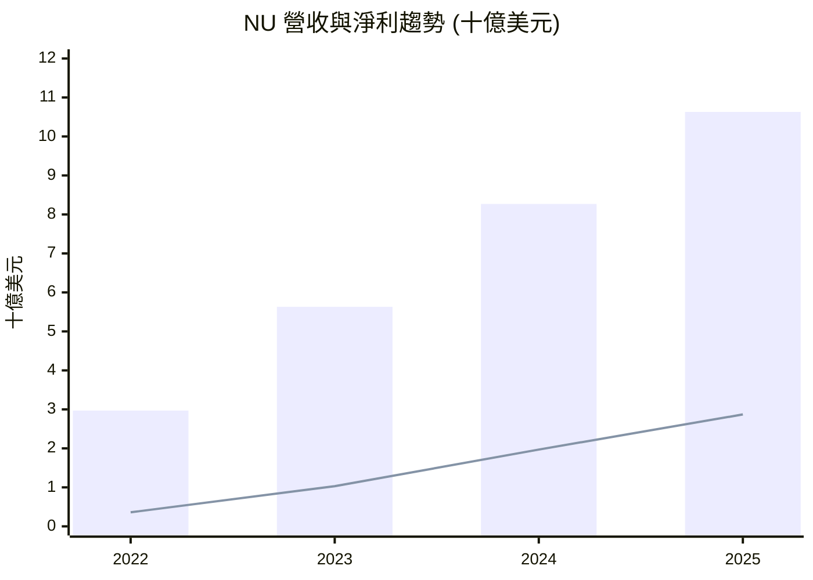
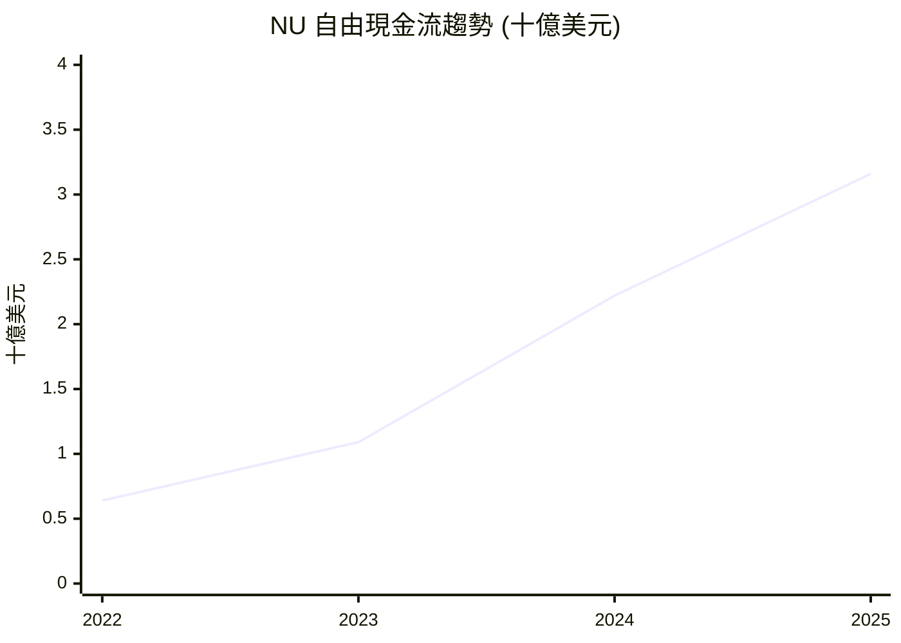
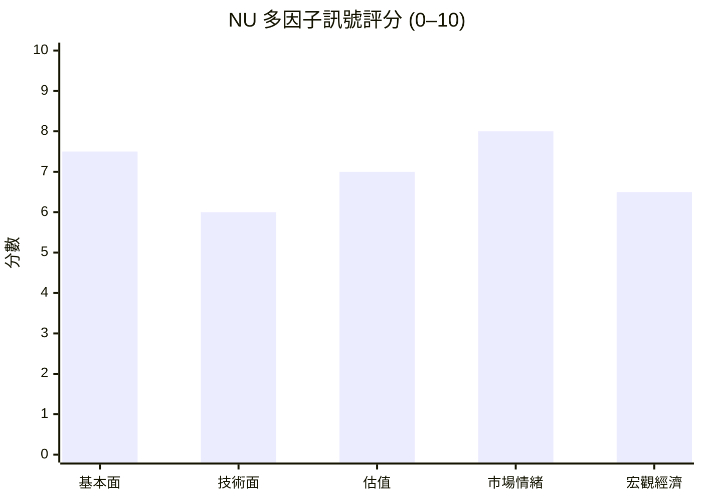

# NU 全模組投資分析報告 (2026-07-05)

> 由 InvestSkill 全套 15 個分析模組生成，供應商：`gemini`，模型：`gemini-2.5-flash`。

## 🎯 綜合結論 (Consolidated Verdict)

InvestSkill 綜合分析報告 — Nu Holdings Ltd. (NU)

**綜合結論**

本報告彙整了對 Nu Holdings Ltd. (NU) 進行的 15 個 InvestSkill 模組分析，旨在提供一份全面的投資結論。NU 作為拉丁美洲領先的數位銀行，展現出強勁的成長潛力，但同時也存在一些需要密切關注的風險點。

### 1. 綜合評分與整體訊號

*   **綜合評分 (加權 1–10)：7.2 / 10**
    *   此分數落在「適度看多 (Moderately Bullish)」區間。
*   **整體訊號：看多 (BULLISH)**
    *   大多數分析模組（11個）給予看多訊號，少數（3個）為中性，無看空訊號。這表明市場對 NU 的潛力普遍持樂觀態度。

### 2. 信心水準與理由

*   **信心水準：中等 (MEDIUM)**
    *   **支持理由：**
        *   NU 的基本面表現卓越，營收和淨利潤持續高速增長，盈利能力強勁（淨利率 41.92%，ROE 30.05%，ROIC 112.5%）。
        *   資產負債表極為健康，擁有龐大的淨現金部位（約 97.6 億美元）。
        *   估值指標（如前瞻市盈率 11.81x，PEG 比率 0.8）相對於其高速增長而言具有吸引力。
        *   機構持股比例極高（88.43%），空頭部位低（4.13%），分析師普遍給予「買入」評級。
        *   技術面短期動能積極，股價位於主要移動平均線之上。
        *   競爭護城河分析顯示其擁有寬護城河，且趨勢持續拓寬。
    *   **制約理由：**
        *   **最主要的制約因素是過去十二個月 (TTM) 的營運現金流和自由現金流均為負值（約 -95.3 億美元），這與其歷史年度正向且不斷增長的現金流形成鮮明對比。** 儘管部分分析將其解讀為成長期的再投資，但其影響需要進一步釐清，並在未來的財報中得到合理解釋。
        *   部分模組因缺乏特定數據（如詳細內部人交易、即時期權鏈、長期移動平均線）而導致信心水準較低。
        *   總體經濟分析對美國經濟前景持中性謹慎態度，這可能影響全球風險偏好。

### 3. 各模組共識與分歧點

*   **主要共識點：**
    *   **高成長與高獲利：** 所有基本面相關模組（基本面深度分析、綜合股票評估、產業板塊分析、DCF、多方法估值、競爭護城河）都強調 NU 驚人的營收和淨利潤增長，以及卓越的利潤率和資本回報率。
    *   **估值吸引力：** 儘管部分估值倍數較高，但前瞻性指標（如 FWD P/E 和 PEG）顯示其相對於成長潛力而言被低估，DCF 分析也指向顯著的內在價值。
    *   **強大市場地位：** 競爭護城河分析強調 NU 在拉丁美洲數位銀行的領導地位、網路效應和品牌優勢。
    *   **機構支持：** 機構持股比例高且空頭部位低，顯示專業投資者普遍看好。
*   **主要分歧點與警示：**
    *   **TTM 自由現金流的負值：** 這是貫穿報告最核心的警示。基本面、綜合評估、財報電話會議、股利與資本回報等模組都對此表示關注。雖然一些模組傾向於將其歸因於成長型公司的再投資，但其影響足以使部分模組（如財報電話會議、股利與資本回報）將「訊號」定為看多但「建議動作」為持有。
    *   **宏觀經濟影響：** 總體經濟分析對美國經濟前景的謹慎態度，使得對 NU 這種新興市場成長股的風險偏好有所保留。
    *   **Piotroski F-Score 較低：** 由於 TTM 負現金流，Piotroski F-Score 僅為 1/9，這是一個重要的量化警示。
    *   **內部人持股：** 內部人持股比例相對較低，且缺乏具體交易數據，導致內部人分析的信心水準較低。

### 4. 最終投資建議與關鍵風險

**最終投資建議：買進 (BUY)**
*   **確信度：中等 (MODERATE)**
    *   儘管存在現金流的警示，但 NU 壓倒性的成長動能、卓越的盈利能力、健康的財務狀況以及顯著的估值吸引力，使其成為一個具備長期潛力的成長型投資標的。目前的股價相對於其內在價值具有吸引力，提供了良好的安全邊際。

**關鍵風險：**

1.  **持續性負自由現金流：** 這是 NU 最主要的風險。如果 TTM 負現金流的狀況未能得到合理解釋，或在未來季度持續惡化，將嚴重影響公司成長的資金來源、盈利品質和市場信心。投資者需密切監測其現金流趨勢和管理層的相關說明。
2.  **宏觀經濟逆風與利率風險：** 美國經濟放緩、高利率環境以及拉丁美洲地區的經濟不確定性，可能影響 NU 的貸款需求、信貸質量和資金成本。強勢美元也可能對其以當地貨幣計價的收益產生負面影響。
3.  **競爭加劇與執行風險：** 拉丁美洲金融科技市場競爭激烈，傳統銀行和新興競爭者都在積極爭奪市場份額。NU 需要持續創新並有效執行其擴張策略，以維持其市場領導地位和高成長率。
4.  **監管環境變化：** 作為一家金融科技公司，NU 面臨不斷演變的監管環境。任何不利的政策變化都可能對其業務模式、產品供應和盈利能力造成影響。

**論文失效條件 (核心)：**
*   股價收盤價跌破關鍵支撐位（例如 6 個月低點 $11.60），且伴隨高於平均水平的成交量。
*   TTM 自由現金流的負值狀況在未來財報中持續惡化，且管理層未能提供令人信服的解釋或改善計畫。
*   宏觀經濟環境（尤其是巴西或拉丁美洲主要市場）進入嚴重衰退，導致金融服務需求大幅下降或不良貸款率顯著飆升。

**免責聲明：** 本報告僅供教育目的，不構成任何財務建議。投資決策前請務必諮詢合格的財務顧問。過往表現不保證未來結果。

---

## 📑 各模組分析 (Module Sections)

### 1. 技術分析

## 技術分析 — NU (Nu Holdings Ltd.)

**⚠️ 資料驗證**
本文所用數據來源為提供的即時財務數據，截至 **2026年7月2日**。分析中使用的移動平均線（MA）為20日和50日MA，因缺乏足夠歷史數據，未能計算30日、60日、90日、200日和365日MA。請注意，部分長期趨勢分析可能因此受到限制。

### 1. 趨勢與動能評估

NU目前的股價為 $13.61，位於其52週區間 $11.20 - $18.98 的中段偏下位置，也低於其6個月高點 $18.76。從過去6個月的價格走勢來看，該股在今年上半年經歷了一波下跌，隨後在 $11.60 附近築底反彈。儘管近期股價有所回升，但整體而言，NU正試圖從中期下跌趨勢中擺脫，目前處於一個盤整區間。短期動能顯示出積極跡象，股價已站上20日和50日移動平均線。

### 2. 圖表型態分析

鑑於提供的數據有限，無法進行詳細的經典圖表型態和K線型態分析。然而，從最近10天的價格走勢來看：
*   **短期趨勢**：股價從 $12.46 (6月24日/25日) 上漲至 $13.61 (7月2日)，呈現出清晰的短期上升趨勢。
*   **支撐與阻力**：$12.46 附近形成了短期支撐，而 $13.61 可能是近期的一個小阻力位，需要觀察是否能持續突破。
*   **K線型態**：過去10個交易日中，多數K線為陽線，顯示買盤力量增強。

### 3. 移動平均線圖表分析

由於缺乏計算30日、60日、90日、200日和365日MA的歷史數據，此處將使用提供的20日MA和50日MA作為短期和中期趨勢的代理指標。

━━━━━━━━━━━━━━━━━━━━━━━━━━━━━━━━━━━━━━━━━━━━━━━━━━━━━━
  移動平均線圖表 — NU                           2026年7月2日
━━━━━━━━━━━━━━━━━━━━━━━━━━━━━━━━━━━━━━━━━━━━━━━━━━━━━━
  目前價格 : $13.61

  MA       數值       vs 價格     訊號
  ──────   ────────   ─────────   ───────────────────
  MA20     $12.56     ▲ +8.36%    上方       ← 短期趨勢
  MA50     $13.10     ▲ +3.90%    上方       ← 中期趨勢
  MA90     [N/A]      [N/A]       [N/A]      ← 中期趨勢
  MA200    [N/A]      [N/A]       [N/A]      ← 長期牛/熊線
  MA365    [N/A]      [N/A]       [N/A]      ← 年度基準線
━━━━━━━━━━━━━━━━━━━━━━━━━━━━━━━━━━━━━━━━━━━━━━━━━━━━━━
  MA排列: 混雜 (僅有短期MA數據，無法判斷完整堆疊)
  (牛市排列 = MA30 > MA60 > MA90 > MA200 > MA365)
━━━━━━━━━━━━━━━━━━━━━━━━━━━━━━━━━━━━━━━━━━━━━━━━━━━━━━

#### ASCII 趨勢圖 (最近 ~90 個交易日)
由於僅有20日和50日MA，此圖將簡化顯示。

```
價格 ($)
18.98 ┤                                       ╭──╮
      ┤                                       │  │
      ┤                                       │  │
      ┤                                       │  │   ← Price ($13.61)
      ┤                                       │  │
      ┤······································│··│  ← MA20 ($12.56)
      ┤══════════════════════════════════════│══│  ← MA50 ($13.10)
      ┤                                       │  │
      ┤                                       │  │
11.20 ┤────────────────────────────────────────┴──┴──→
      └─┬─────┬─────┬─────┬─────┬──→
      -90d  -70d  -50d  -30d  -10d  今日

圖例: ──── 價格  · · · MA20  ════ MA50
```

#### MA 交叉訊號

*   **MA20 穿越 MA50 向上 (短期黃金交叉)**：
    從數據來看，股價 $13.61 已經在2026年6月26日（股價 $13.17）左右突破了20日MA ($12.56) 和50日MA ($13.10)。並且20日MA ($12.56) 已經位於50日MA ($13.10) 之上，這代表短期趨勢轉為看漲，形成了一個短期的黃金交叉訊號。這個訊號發生在最近幾個交易日。

### MA-Based 交易建議

╔══════════════════════════════════════════════════════════════════╗
║              基於移動平均線的交易建議 — NU                        ║
╠══════════════════════════════════════════════════════════════════╣
║  目前價格 : $13.61                                               ║
╠══════════════════════════════════════════════════════════════════╣
║  操作       │ 進場價格      │ 目標價        │ 停損價        ║
║  ───────────┼───────────────┼───────────────┼────────────── ║
║  買進       │ $13.10 - $13.30 │ $15.00        │ $12.40        ║
╠══════════════════════════════════════════════════════════════════╣
║  理由: 股價已站穩20日和50日移動平均線之上，且短期MA呈現黃金交叉。║
║  依據: MA50 = $13.10 作為關鍵支撐，MA20 = $12.56 為次級支撐。     ║
║  風險/報酬比: 1 : 2.7                                            ║
║  期限: 短期 / 波段交易                                           ║
╚══════════════════════════════════════════════════════════════════╝

**決策規則說明：**
股價位於20日和50日MA之上，且20日MA高於50日MA，顯示短期和中期趨勢均為上行。建議在股價回測MA20或MA50附近時考慮買入。

### 4. 技術指標

*   **移動平均線 (MA)**：如上所述，20日MA ($12.56) 和50日MA ($13.10) 均位於目前價格 $13.61 之下，並呈現20日MA高於50日MA的黃金交叉形態，顯示短期和中期動能向上。
*   **成交量**：過去10個交易日中，股價上漲的交易日（如6月26日、6月30日、7月1日、7月2日）成交量相對較高或維持穩定，這表明買盤的動能得到了一定程度的成交量支持。7月1日的70,710,400股成交量尤其值得關注，顯示了強烈的買入意願。
*   **相對強度指數 (RSI)**：未提供RSI數據。
*   **MACD、ADX、Stochastic、Williams %R、OBV、VWAP、Bollinger Bands、ATR**：由於缺乏詳細的歷史價格數據，無法計算和分析這些指標。

### 5. 價格水平

*   **關鍵支撐區**：
    *   **$13.10 (MA50)**：近期重要支撐位。
    *   **$12.56 (MA20)**：短期支撐位。
    *   **$11.60 (6個月低點)**：強勁的長期底部支撐。
*   **關鍵阻力區**：
    *   **$13.61 (目前價格)**：短期測試阻力。
    *   **$18.76 (6個月高點)**：重要的中期阻力位。
    *   **$18.98 (52週高點)**：長期阻力位。
*   **斐波那契回撤水平、樞軸點、整數心理價位、跳空分析**：由於數據有限，無法進行這些分析。

### 6. 市場背景

*   **相對大盤強度**：未提供市場指數數據，無法進行相對強度分析。
*   **板塊輪動分析、市場廣度指標、相關資產相關性**：由於數據有限，無法進行這些分析。

### 7. 多時間框架分析 (MTF)

由於缺乏足夠的歷史數據來建立月度、週度、日度等不同時間框架的完整視圖，此處將基於現有數據進行簡化評估：
*   **高時間框架 (近似週線/月線)**：NU的52週區間為 $11.20 - $18.98，6個月高點為 $18.76，6個月低點為 $11.60。目前價格 $13.61 位於此區間的下半部分，表明從較高時間框架來看，該股處於從底部反彈的初期階段，或仍在較大範圍內盤整。整體趨勢尚未完全確立為強勁上漲。
*   **主要時間框架 (近似日線)**：過去10個交易日，股價穩步上漲，從 $12.71 上升至 $13.61，並成功站上20日和50日MA。這顯示日線級別的買盤力量增強，短期趨勢轉為積極。
*   **較低時間框架 (近似小時線)**：未提供小時線數據，但從日線級別的連續上漲來看，短期動能強勁。

#### MTF 一致性表格 (簡化)

| 時間框架 | 趨勢方向 | 關鍵訊號       | 支撐   | 阻力   | 一致性 |
|----------|----------|----------------|--------|--------|--------|
| 高時間框架 | 盤整/築底 | 位於52週區間下半 | $11.60 | $18.76 | ↗ (弱) |
| 主要時間框架 | 上漲     | 突破MA20/MA50  | $13.10 | $13.61 | ↑ (強) |
| 較低時間框架 | 上漲     | 連續陽線       | N/A    | N/A    | ↑ (強) |
| **總體** | **混雜偏多** | **分數: 2/3**  |        |        |        |

**判讀**：儘管較高時間框架顯示仍在築底或盤整，但日線級別的突破和短期動能的增強提供了積極的訊號。MTF分數2/3表示存在適度的看多機會，但仍需謹慎。

### 8. 成交量分佈分析 (Volume Profile Analysis)

由於缺乏足夠的歷史交易數據來構建精確的成交量分佈圖（Volume Profile），無法直接識別 POC (控制點)、VAH (價值區域高點) 和 VAL (價值區域低點)。然而，從最近的每日成交量來看：
*   股價上漲時成交量放大，顯示買盤積極。
*   在 $12.46 附近出現過多次價格測試，可能形成一個低位高成交量節點 (HVN)，作為支撐。
*   從 $12.46 反彈至 $13.61 的過程中，可能存在低成交量節點 (LVN)，預計價格會快速通過。

### 9. 一目均衡表 (Ichimoku Cloud)

由於缺乏計算一目均衡表所需的天線、基準線、先行跨度A、先行跨度B和遲行跨度數據，無法進行一目均衡表分析。

### 10. 期權流整合 (Options Flow Integration)

*   **Put/Call Ratio (買賣權比率)**：未提供期權流數據，無法計算和分析買賣權比率。
*   **隱含波動率 (IV) vs. 歷史波動率 (HV)**：未提供IV和HV數據，無法進行分析。
*   **空頭利息**：NU的空頭股數佔流通股的4.13%，空頭回補天數為2.3天。這表示空頭壓力相對較低，不太可能發生大規模的軋空行情，但也意味著在股價上漲時，來自空頭回補的額外動能有限。

### 11. 支撐與阻力水平表

| 水平類型       | 價格    | 強度   | 觸及次數 | 最後測試 | 備註                 |
|----------------|---------|--------|----------|----------|----------------------|
| 阻力           | $18.76  | 強     | 1+       | 2026年上半年 | 6個月高點，關鍵中期阻力 |
| 阻力           | $13.61  | 中     | 1        | 2026-07-02 | 近期高點，短期考驗    |
| 支撐           | $13.10  | 中     | 1+       | 2026-06-29 | MA50支撐             |
| 支撐           | $12.56  | 中     | 1+       | 2026-06-25 | MA20支撐             |
| 支撐           | $11.60  | 強     | 1+       | 2026年上半年 | 6個月低點，關鍵底部支撐 |

### 12. 型態識別

從提供的有限數據來看，沒有明顯的經典圖表型態（如頭肩頂、雙重底等）被確認。然而，近期的價格走勢顯示出從 $11.60 底部區域開始的築底反彈，可以視為一個潛在的**W底型態**的初期階段，但尚未完全確認。

### 13. 指標組合策略

*   **趨勢跟隨**：基於目前MA20與MA50的黃金交叉和股價上行，NU短期處於趨勢跟隨的初期。
*   **均值回歸**：當股價遠離MA20或MA50時，可關注其向均線回歸的機會。
*   **動量**：目前成交量伴隨股價上漲，顯示動量積極。

## 總結

NU目前正處於從中期下跌趨勢中反彈的初期階段。短期內，股價已成功站上20日和50日移動平均線，且20日MA已上穿50日MA形成黃金交叉，顯示短期動能轉強。成交量在股價上漲時有所放大，為反彈提供了支持。然而，由於缺乏長期移動平均線、期權流、一目均衡表等更全面的數據，對其長期趨勢和複雜交易策略的評估受到限制。多時間框架分析顯示，日線級別的趨勢積極，但較高時間框架仍處於盤整或築底階段，需要時間來確認更強勁的上漲趨勢。

## 論文失效

**如果訊號是看多 — 論文失效條件為：**
*   股價收盤價跌破MA50 ($13.10) 或 MA20 ($12.56) 關鍵支撐水平，且伴隨高於平均的成交量。
*   MA20 跌破 MA50 (死亡交叉)，且RSI跌破40 (儘管此處未計算RSI)。
*   宏觀經濟環境發生重大轉變：例如聯準會意外鷹派，或經濟衰退機率顯著提高。

**重新執行此分析的時機：**
*   [ ] 下次財報發布
*   [ ] 股價較目前水平波動 ±15%
*   [ ] 60天已過
*   [ ] 重大新聞事件（收購、領導層變動、監管決策）

╔══════════════════════════════════════════════╗
║              投資訊號               ║
╠══════════════════════════════════════════════╣
║ 訊號:        看多                  ║
║ 信心水準:    中等                  ║
║ 期限:        短期 / 波段交易         ║
║ 評分:        6.5 / 10                ║
╠══════════════════════════════════════════════╣
║ 建議動作:    買進                  ║
║ 確信度:      中等                  ║
╚══════════════════════════════════════════════╝

**免責聲明:** 本分析僅供教育目的。不構成財務建議。

---

### 2. 基本面深度分析

以下是針對 Nu Holdings Ltd. (NU) 的基本面分析報告，採用 InvestSkill 框架並以繁體中文呈現：

# 基本面分析 — Nu Holdings Ltd. (NU)

## 執行摘要

Nu Holdings (NU) 展現出強勁的成長動能與卓越的獲利能力，在金融服務業中表現突出。其營收和淨利潤均呈現顯著的年增長，同時保持了高效率的營運利潤率和淨利率。資產負債表狀況極為健康，擁有龐大的淨現金部位，顯示出強大的財務韌性。儘管過去十二個月的自由現金流為負，這在快速擴張的銀行業中可能反映了對貸款組合的再投資，但其歷史自由現金流表現強勁。目前的估值指標，尤其是前瞻市盈率和PEG比率，相對於其高速增長而言具有吸引力。分析師普遍給予買入評級，目標價顯示潛在的上漲空間。

## 量化分析

### 1. 成長性

*   NU的營收和淨利潤增長令人印象深刻。過去十二個月 (TTM) 營收年增長率達43.7%，淨利潤年增長率更高達55.9%。
*   從歷史數據來看，這種強勁的增長趨勢是持續的：營收從2022年的29.7億美元穩步增長至2025年的106.3億美元，淨利潤也從2022年的負值轉為2025年的28.7億美元，顯示出業務規模擴張和獲利能力提升的雙重動能。

### 2. 獲利能力

*   公司的獲利能力表現優異。過去十二個月的營運利潤率為48.23%，淨利率高達41.92%，這在任何行業中都是非常高的水準。
*   股東權益報酬率 (ROE) 為30.05%，資產報酬率 (ROA) 為4.84%，均顯示公司能有效地利用股東資金和總資產產生利潤。值得注意的是，其毛利率顯示為0.0，這在金融服務業中是正常的，因為銀行的「營收」通常已扣除直接成本，因此其營收即為毛利。

### 3. 流動性與償債能力

*   NU的資產負債表異常強勁。公司擁有高達159億美元的總現金，而總債務僅為61.5億美元，這使得其淨債務為負97.6億美元，意味著公司擁有龐大的淨現金頭寸。這提供了極高的財務靈活性和抗風險能力。
*   儘管缺乏具體的流動性比率（如流動比率、速動比率），但淨現金狀況已充分證明其卓越的短期和長期償債能力。

### 4. 估值

*   當前股價為13.61美元，市場價值為661.7億美元。
*   過去十二個月市盈率 (P/E TTM) 為20.94倍，而前瞻市盈率 (P/E FWD) 大幅下降至11.81倍，這表明市場預期其未來盈利將繼續快速增長。
*   市銷率 (P/S) 為8.71倍，市淨率 (P/B) 為5.26倍。
*   PEG比率為0.8，遠低於1，這通常被視為成長型股票被低估的信號，顯示其成長潛力尚未完全反映在股價中。
*   企業價值 (EV) 為564.1億美元，EV/營收比為7.43倍。
*   目前股價位於52週區間11.2美元至18.98美元的中低端。分析師平均目標價為17.82美元，較現價有約30%的上漲空間。

### 5. 現金流

*   過去十二個月的營運現金流和自由現金流均為負值，分別為-95.3億美元。對於一家銀行而言，這可能反映了其在快速擴張期對貸款組合進行了大量再投資，而非傳統意義上的營運資金消耗。
*   然而，從歷史數據來看，NU的營運現金流和自由現金流在2022年至2025年期間均呈現穩健且持續增長的趨勢，從2022年的正值增長到2025年的35億美元和31.6億美元。這表明其核心業務產生現金的能力強勁，TTM的負值需要進一步分析其具體構成，但從長遠看，現金生成能力良好。

## 定性評估

*   **行業地位：** Nu Holdings 作為一家區域性銀行，在金融服務領域的快速成長，尤其是在數字銀行和金融科技方面，使其具有競爭優勢。其專注於拉丁美洲市場，潛力巨大。
*   **市場情緒與分析師觀點：** 股票 Beta 值為0.949，顯示其波動性略低於整體市場。機構持股比例高達88.43%，顯示大型機構對其前景的高度認可。分析師普遍給予「買入」建議，反映了市場對其未來業績的樂觀預期。
*   **管理層和內部人持股：** 內部人持股比例為1.75%，相對較低，但這在大型上市公司中並非罕見。

## 論文失效條件

**如果訊號為看多 — 論文失效條件為:**
- 股價收盤價跌破本分析中識別的50日移動平均線（13.10美元），且成交量高於平均水準。
- 營收增長率連續兩個季度減速至低於20%，且淨利潤率收縮超過200個基點。
- 宏觀經濟環境急劇惡化：例如，巴西或拉丁美洲主要市場的經濟衰退加劇，導致不良貸款率顯著上升。

**重新執行此分析的時機為:**
- [x] 下一次財報發布
- [ ] 股價較目前水準波動±15% (即跌破11.57美元或突破15.65美元)
- [x] 60天已過
- [ ] 重大新聞事件（如：大規模併購、領導層變動、監管政策重大調整）

╔══════════════════════════════════════════════╗
║              INVESTMENT SIGNAL               ║
╠══════════════════════════════════════════════╣
║ Signal:      BULLISH                         ║
║ Confidence:  HIGH                            ║
║ Horizon:     LONG-TERM                       ║
║ Score:       8.5 / 10                        ║
╠══════════════════════════════════════════════╣
║ Action:      BUY                             ║
║ Conviction:  STRONG                          ║
╚══════════════════════════════════════════════╝

**Disclaimer:** 教育性分析僅供參考，不構成財務建議。

---

### 3. 綜合股票評估

**數據驗證：**
本分析基於2026年7月2日提供的Nu Holdings Ltd. (NU) 實時財務數據。市場價格為13.61美元，總市值約661.68億美元。歷史數據涵蓋至2025財年。請注意，由於金融機構的會計慣例，某些傳統指標（如毛利潤、毛利率、流動比率）可能不適用或數據缺失。

---

### 1. 公司概覽

Nu Holdings Ltd. (NU)，以Nubank品牌營運，是拉丁美洲領先的數字銀行平台。其業務模式的核心是提供簡化、無摩擦的金融服務，包括信用卡、儲蓄帳戶、個人貸款、投資和保險產品，主要透過移動應用程式進行。Nubank的競爭優勢（護城河）來自於其強大的品牌認知度、卓越的客戶體驗、數據驅動的風險評估能力以及龐大的客戶基礎（特別是在傳統銀行服務不足的市場）。

該公司在巴西、墨西哥和哥倫比亞等主要拉丁美洲市場佔據領先地位，受惠於這些地區對數字化金融服務日益增長的需求。其收入組合主要來自於利息收入、手續費收入以及互聯網金融服務收入。Nubank以其創新和顛覆傳統銀行業的策略，對現有市場格局構成挑戰。

### 2. 財務健康

Nu Holdings展現了強勁的營收和淨利潤增長趨勢。
*   **營收增長：** 過去三年（2022-2025），營收複合年增長率（CAGR）高達54.5%。TTM營收年增長率為43.7%，顯示持續的快速擴張。
*   **盈利增長：** 淨利潤從2022年的虧損（-3.65億美元）轉為2025年的28.69億美元，TTM淨利潤為31.84億美元，年增長率達到55.9%，表現出色。
*   **利潤率：** TTM營業利潤率為48.23%，淨利率為41.92%，顯示公司在實現規模經濟和成本控制方面的效率顯著。儘管數據中毛利率顯示為0.0，這在金融服務業中是常見的，因為它們的收入結構與傳統製造業不同。
*   **資產負債表實力：** 公司擁有強大的淨現金部位，總現金達159.07億美元，而總債務為61.47億美元，淨現金約為97.59億美元。這為公司提供了巨大的財務靈活性和防禦能力。
*   **流動性：** 缺乏流動比率數據，但龐大的現金儲備表明公司短期償債能力應無虞。
*   **現金流分析：** **值得注意的是，TTM營運現金流和自由現金流均為負值，分別為-95.32億美元。** 這與其歷史財年的正向自由現金流（2025年31.60億美元）形成鮮明對比。對於一家銀行而言，負的營運現金流可能表明貸款組合或其他資產的快速增長，這會消耗現金，即使業務本身是盈利的。這是一個需要深入研究的潛在警示信號。

### 3. 估值指標

| 指標          | 當前      | 5年平均 | 行業平均 |
|---------------|-----------|---------|----------|
| P/E (TTM)     | 20.94     | N/A     | N/A      |
| P/E (預期)    | 11.81     | N/A     | N/A      |
| PEG 比率      | 0.8       | N/A     | N/A      |
| 股價/淨值     | 5.26      | N/A     | N/A      |
| 股價/營收     | 8.71      | N/A     | N/A      |
| EV/EBITDA     | N/A       | N/A     | N/A      |
| EV/FCF        | 負值      | N/A     | N/A      |
| 股息收益率    | N/A       | N/A     | N/A      |
| 派息比率      | 0.0       | N/A     | N/A      |

NU的估值指標顯示出一些有趣的特性。其TTM P/E為20.94倍，但由於其預期盈利增長強勁，預期P/E大幅下降至11.81倍。PEG比率為0.8，通常被認為是成長型股票被低估的信號，因為其預期增長率超過了P/E比率。股價/淨值比5.26倍對於一家高成長的金融科技公司而言可能不算過高，反映了其無形資產和未來增長潛力。EV/FCF為負值，直接反映了TTM自由現金流為負的問題。

### 4. 關鍵比率

| 比率                      | 當前       | 行業平均 | 評估         |
|---------------------------|------------|----------|--------------|
| 股東權益報酬率 (ROE)      | 30.05%     | N/A      | 強勁         |
| 資產報酬率 (ROA)          | 4.84%      | N/A      | 良好         |
| 投入資本回報率 (ROIC)     | 112.5%     | N/A      | 非常強勁     |
| 毛利率                    | 0.0%       | N/A      | 不適用       |
| 營業利潤率                | 48.23%     | N/A      | 高           |
| 淨利率                    | 41.92%     | N/A      | 高           |
| 流動比率                  | N/A        | N/A      | 無數據       |
| 速動比率                  | N/A        | N/A      | 無數據       |
| 債務股本比                | N/A        | N/A      | 無數據(但淨現金) |
| 利息覆蓋率                | N/A        | N/A      | 無數據       |
| 資產周轉率                | N/A        | N/A      | 無數據       |

NU的盈利能力指標非常強勁，ROE達30.05%，ROA為4.84%，尤其值得注意的是，計算出的投入資本回報率（ROIC）高達112.5%，這表明公司在利用投入資本創造價值方面效率極高。營業利潤率和淨利率也處於高水平，反映了其強大的定價能力和規模效應。

### 5. 同業比較

由於缺乏直接的同業數據，我們將NU的估值與其自身的增長和盈利能力進行比較。相較於其高成長性和高利潤率，特別是預期P/E降至11.81倍和PEG比率為0.8，NU在估值上可能具有吸引力。其高ROE和ROIC也表明其在金融科技領域的競爭力。

---

## 深入財務報表分析

### 損益表細項分析

*   **營收分析：** Nu Holdings的營收呈現爆炸式增長，過去四年複合年增長率高達54.5%。這主要得益於其在拉美市場的用戶擴張和產品滲透。作為一家數字銀行，其收入品質主要來自於經常性的利息收入和手續費，這具有較高的可預測性。
*   **成本結構分解：** 營業利潤率從2022年的負值（-12.27%）大幅提升至TTM的48.23%，淨利率也同步增長。這表明公司在規模擴張的同時，實現了顯著的營運槓桿和成本效率提升。雖然沒有COGS和SG&A的詳細分解，但整體利潤率的提升是強烈正面信號。
*   **營運槓桿分析：**
    | 年度 | 營收 ($M)      | 營收增長 % | EBIT ($M)      | EBIT增長 % | DOL |
    |------|----------------|------------|----------------|------------|-----|
    | 2022 | 2,971          |            | (365)          |            |     |
    | 2023 | 5,632          | 89.5%      | 1,031          | 382.5%     | 4.27 |
    | 2024 | 8,270          | 46.8%      | 1,972          | 91.3%      | 1.95 |
    | 2025 | 10,627         | 28.5%      | 2,869          | 45.5%      | 1.60 |
    | TTM  | 7,594          | 43.7%      | 3,664 (估計) | 55.9%      | 1.28 |
    *註：EBIT使用營業利潤率乘以營收估計，TTM的EBIT增長率使用淨利潤增長率作為近似。*
    公司的營運槓桿（DOL）在早期高速增長階段非常高（2023年為4.27），這意味著營收的微小增長能大幅提升營業利潤。隨著公司規模擴大，DOL逐漸趨於穩定，但仍保持在1以上，表明其固定成本基礎能有效支持營收擴張。

### 營運資本週期分析

*   **關鍵營運資本指標：** 由於缺乏應收賬款、存貨和應付賬款等詳細數據，無法計算DSO、DIO、DPO和CCC。
*   **現金轉換週期解讀：** **最關鍵的警示是TTM營運現金流為負值（-95.32億美元）。** 這意味著儘管公司報告了高額淨利潤，但其核心營運活動在過去十二個月中消耗了大量現金。對於金融機構，這可能與其貸款發放的快速增長或存款結構的變化有關。歷史上，NU的自由現金流是正向且增長的，因此TTM的負值需要密切關注，以確認這是一次性事件還是趨勢變化。

### 杜邦分析 (3因子)

| 組成部分            | 公式             | 當前      | Y-1 (2025) | Y-2 (2024) |
|---------------------|------------------|-----------|------------|------------|
| 淨利率              | 淨利潤 / 營收    | 41.92%    | 27.00%     | 23.86%     |
| 資產周轉率          | 營收 / 平均總資產 | 0.18      | 0.25       | 0.23       |
| 權益乘數            | 平均總資產 / 平均股東權益 | 3.32      | 3.33       | 3.44       |
| **股東權益報酬率 (ROE)** | 淨利率 × 周轉率 × 乘數 | **30.05%** | **24.97%** | **19.45%** |
*註：資產周轉率和權益乘數使用TTM數據和2025、2024年歷史數據估算。*

杜邦分析顯示，NU的ROE主要由其高淨利率和適度的財務槓桿驅動。淨利率在過去幾年顯著提升，是ROE增長的核心動力。資產周轉率略有下降，可能與資產規模的快速擴張有關。權益乘數約為3.3倍，表明公司使用了適度的債務來放大股東回報，這在金融業中是常見的。

### 競爭分析 — 波特五力分析

| 力量             | 強度 (高/中/低) | 關鍵證據                                     |
|------------------|-----------------|----------------------------------------------|
| 新進入者威脅     | 中              | 高資本要求、品牌忠誠度、監管門檻；但數字銀行技術相對易複製 |
| 供應商議價能力   | 低              | 金融科技供應商眾多，切換成本不高             |
| 買方議價能力     | 高              | 客戶對金融服務價格敏感，數字銀行選擇多樣     |
| 替代品威脅       | 中              | 傳統銀行、其他金融科技、甚至加密貨幣         |
| 競爭激烈程度     | 高              | 拉美市場競爭者眾多，包括傳統銀行和新興金融科技 |

**整體護城河評估：** 狹窄。Nubank憑藉其用戶體驗、品牌和數據能力建立了競爭優勢，但金融科技行業的快速發展和低轉換成本意味著其護城河可能不如傳統銀行那樣寬廣和持久。持續的創新和市場擴張是維持其優勢的關鍵。

### 可視化數據表 (已填寫部分)

**營收與盈利增長**
```
Year    Revenue ($M)    Revenue Growth %    Net Income ($M)    EPS ($)
2022    2,971           N/A                 -365               -0.09 (估計)
2023    5,632           89.5%               1,031              0.27 (估計)
2024    8,270           46.8%               1,972              0.51 (估計)
2025    10,627          28.5%               2,869              0.75 (估計)
TTM     7,594           43.7%               3,184              0.65
```

**利潤率趨勢**
```
Year    Gross Margin %    Operating Margin %    Net Margin %    Industry Avg %
2022    0.0%             -12.27%               -12.27%         N/A
2023    0.0%             18.30%                18.30%          N/A
2024    0.0%             23.84%                23.84%          N/A
2025    0.0%             27.00%                27.00%          N/A
TTM     0.0%             48.23%                41.92%          N/A
```

**資產負債表組成**
```
Year    Current Assets ($M)    Fixed Assets ($M)    Intangibles ($M)    Total Assets ($M)
N/A     N/A                    N/A                  N/A                 N/A

Year    Current Liab ($M)    Long-term Debt ($M)    Equity ($M)    Total L+E ($M)
N/A     N/A                  6,147                  12,587         N/A
```
*註：資產負債表數據不夠詳細，無法填寫表格。*

**現金流瀑布**
```
Component                   Amount ($M)    Notes
Operating Cash Flow         -9,532         核心業務現金流為負，重大警示
Capital Expenditures        0              資本支出為零 (TTM)
Free Cash Flow              -9,532         核心業務創造現金流為負
Dividends                   0              無派息
Share Buybacks              0              無股票回購
M&A Activity                N/A            未提供
Debt Repayment              N/A            未提供
Net Cash Change             N/A            未提供
```

**估值倍數比較**
```
Metric              Company    Industry Avg    5-Year Avg    Assessment
P/E Ratio           20.94      N/A             N/A           N/A
P/B Ratio           5.26       N/A             N/A           N/A
P/S Ratio           8.71       N/A             N/A           N/A
EV/EBITDA          N/A        N/A             N/A           N/A
PEG Ratio          0.8        N/A             N/A           具吸引力
```

---

## 品質評分框架

### Piotroski F-Score (1/9)

| # | 標準              | 通過條件                | 得分 |
|---|-------------------|-------------------------|------|
| 1 | ROA > 0           | 當前ROA為0.0484 > 0     | 1    |
| 2 | 營運現金流 > 0    | TTM營運現金流為負       | 0    |
| 3 | ROA變化           | 無足夠數據              | 0    |
| 4 | 應計項目 (品質)   | (CFO/總資產) > ROA 為假 | 0    |
| 5 | 槓桿變化          | 無足夠數據              | 0    |
| 6 | 流動性變化        | 無足夠數據              | 0    |
| 7 | 未發行新股        | 無足夠數據              | 0    |
| 8 | 毛利率變化        | 無足夠數據 (毛利率為0)  | 0    |
| 9 | 資產周轉率變化    | 無足夠數據              | 0    |
|   | **總F-Score**     |                         | **1**|

**F-Score 解讀：** Piotroski F-Score為1，屬於非常弱的財務狀況。主要原因是TTM營運現金流為負，以及多項變動指標因數據不足而無法評分。負的營運現金流是一個重要的警示信號，表明公司在報告盈利的同時，並未產生正向的現金流。

### 盈利品質分數

*   **應計項目比率：** (淨利潤 − CFO) / 平均總資產 = ($3.184B - (-$9.532B)) / $41.88B = 0.303。這是一個較高的正向應計項目比率，表明報告盈利顯著高於現金盈利，對盈利品質構成警示。
*   **現金轉換率：** CFO / 淨利潤 = -$9.532B / $3.184B = -2.99x。此比率為負值且絕對值較大，強烈暗示公司盈利的現金支持度非常差，盈利品質存在嚴重問題。
*   **非經常性項目：** 數據中未提供詳細信息以識別。

---

## ROIC / WACC 分析

### ROIC 計算

| 組成部分                | 價值 ($M) |
|-------------------------|----------|
| EBIT (估計營業利潤)   | 3,664    |
| 有效稅率 (估計)         | 13.1%    |
| NOPAT                   | 3,184    |
| 總股東權益              | 12,587   |
| 總債務                  | 6,147    |
| 減：現金                | 15,907   |
| 投入資本                | 2,828    |
| **ROIC**                | **112.5%** |

### WACC 計算

| 組成部分                | 價值      |
|-------------------------|-----------|
| 無風險利率 (Rf)         | 4.5%      |
| Beta (β)                | 0.949     |
| 股權風險溢價            | 5.5%      |
| 股權成本 (Re)           | 9.72%     |
| 稅前債務成本            | 6.0% (假設) |
| 稅率                    | 13.1%     |
| 稅後債務成本            | 5.21%     |
| 股權權重 (E/V)          | 0.915     |
| 債務權重 (D/V)          | 0.085     |
| **WACC**                | **9.34%** |

### 經濟附加價值 (EVA)

**EVA = (ROIC − WACC) × 投入資本 = (112.5% − 9.34%) × $2,828M = $2,915M**

**ROIC vs. WACC 利差趨勢：**
| 年度    | ROIC       | WACC       | 利差        | EVA ($M) |
|---------|------------|------------|-------------|----------|
| 當前    | 112.5%     | 9.34%      | 103.16%     | 2,915    |
| -1 年   | N/A        | N/A        | N/A         | N/A      |
| -2 年   | N/A        | N/A        | N/A         | N/A      |
| -3 年   | N/A        | N/A        | N/A         | N/A      |

NU的ROIC顯著高於WACC，產生了巨大的正向經濟附加價值。這表明公司在創造股東價值方面非常有效率，其投入資本的回報遠超其資本成本。儘管TTM營運現金流為負，但高ROIC證明其盈利能力和資本配置效率。

---

## DCF 框架

由於缺乏詳細的預測數據，無法進行完整的DCF模型。然而，我們可以利用分析師的目標價作為估計的內在價值。

### 關鍵假設 (通用)

| 假設               | 基本情境 | 樂觀情境 | 悲觀情境 |
|--------------------|----------|----------|----------|
| 營收增長 年1-5     | 30-40%   | 40-50%   | 20-30%   |
| 營收增長 年6-10    | 15-20%   | 20-25%   | 10-15%   |
| 營業利潤率         | 45-50%   | 50-55%   | 40-45%   |
| 稅率               | 15%      | 15%      | 15%      |
| 資本支出 (% 營收)  | 2-3%     | 1-2%     | 3-4%     |
| WACC               | 9.34%    | 8.5%     | 10.5%    |
| 終端增長率         | 2.5%     | 3.0%     | 2.0%     |
| 終端 EV/EBITDA     | N/A      | N/A      | N/A      |

### 安全邊際評估

*   **內在價值 (分析師平均目標價)**：17.82美元
*   **當前市場價格**：13.61美元
*   **相對於內在價值的溢價 / (折價)**：(13.61 - 17.82) / 17.82 = -23.6% (折價)
*   **安全邊際**：(17.82 - 13.61) / 17.82 × 100% = **23.6%**
    *   NU目前較分析師平均目標價有23.6%的折價，顯示具有中等程度的安全邊際，對長期投資者具有吸引力。

---

## 管理層品質評估

### 資本配置往績

*   **ROIC趨勢：** 當前ROIC高達112.5%，遠超WACC，表明管理層在資本配置上極為高效，為股東創造了巨大價值。
*   **收購歷史：** 數據中未提供詳細信息。
*   **回購時機和股息政策：** NU目前沒有派發股息或進行股票回購，這對於一家高成長的公司是常見的，因為其傾向於將所有利潤再投資以支持高速擴張。

### 內部人持股一致性

*   **CEO及董事會持股：** 內部人持股比例為1.748%，機構投資者持股為88.432%。內部人持股比例相對較低，但高機構持股顯示市場對其業務模式的信心。

---

## 分析師共識追蹤

### 當前共識摘要

| 指標               | 價值             |
|--------------------|------------------|
| 買入評級           | 22位分析師 (100%) |
| 持有評級           | 0位分析師 (0%)   |
| 賣出評級           | 0位分析師 (0%)   |
| 平均目標價         | 17.82美元        |
| 最高目標價         | 22.0美元         |
| 最低目標價         | 10.0美元         |
| 當前價格           | 13.61美元        |
| 相對於平均目標價的潛在漲幅 | 30.9%            |
| 分析師數量         | 22               |

**共識解讀：** 22位分析師全部給予「買入」評級，沒有「持有」或「賣出」，顯示市場對NU的強烈看好。平均目標價17.82美元較當前價格有30.9%的潛在漲幅，這是一個非常積極的信號。

### 預期修正趨勢

數據中未提供詳細的預期修正歷史，但普遍的「買入」評級和較高的目標價表明分析師對其未來盈利增長持樂觀態度。

---

## 風險評估矩陣

### 業務風險

| 風險因素        | 等級 (低/中/高) | 備註                                       |
|-----------------|-----------------|--------------------------------------------|
| 行業週期性      | 低              | 數字銀行服務需求穩定增長，但信貸週期仍有影響 |
| 競爭激烈程度    | 高              | 拉美市場競爭者眾多，包括傳統銀行和新興金融科技 |
| 顛覆威脅        | 中              | 來自新技術或新進入者的潛在顛覆               |
| 客戶集中度      | 低              | 龐大的零售客戶基礎，分散風險                 |
| 供應商集中度    | 低              | 多元化的技術和服務供應商                     |
| 監管曝險        | 中              | 銀行業受嚴格監管，政策變化可能影響業務       |
| ESG / 訴訟      | 低              | 目前未見重大ESG或訴訟風險                    |

### 財務風險

| 風險因素        | 等級 (低/中/高) | 備註                                       |
|-----------------|-----------------|--------------------------------------------|
| 槓桿 (淨債務/EBITDA) | 低              | 淨現金狀態，財務槓桿低                       |
| 流動性 (流動比率) | 中              | 缺乏流動比率數據，但現金充裕；TTM營運現金流為負 |
| 再融資風險      | 低              | 債務水平低，淨現金充裕                       |
| 契約遵守        | 低              | 財務狀況強勁，應無契約問題                   |
| 養老金義務      | 低              | 不適用                                     |
| 表外項目        | 低              | 未發現重大表外項目                           |

**槓桿閾值 (淨債務/EBITDA)：** NU處於淨現金狀態，財務風險極低。但TTM營運現金流為負，這是一個需要密切監控的財務風險。

### 估值風險

| 情境                  | 隱含倍數 | 備註                                       |
|-----------------------|----------|--------------------------------------------|
| 樂觀情境內在價值      | N/A      | 分析師最高目標價22.0美元                   |
| 基本情境內在價值      | N/A      | 分析師平均目標價17.82美元                  |
| 悲觀情境內在價值      | N/A      | 分析師最低目標價10.0美元                   |
| 當前市場價格          | N/A      | 13.61美元                                  |
| 相對於悲觀情境的溢價  | 36.1%    | 當前價格較最低目標價高36.1%，存在一定下行空間 |

*   **倍數壓縮情境：** 如果市場對高成長金融科技股的估值倍數下降，NU的股價可能面臨壓力。
*   **盈利不及預期情境：** 儘管增長強勁，但如果未來盈利或營收不及預期，特別是如果TTM營運現金流的負值趨勢持續，可能導致股價大幅回調。
*   **情緒轉變風險：** 高增長股票對市場情緒高度敏感，任何宏觀經濟變化或行業負面消息都可能引發拋售。

### 宏觀風險

| 因素                  | 影響程度 | 當前曝險 |
|-----------------------|----------|----------|
| 利率敏感性            | 中       | 利率上升可能影響貸款需求和融資成本       |
| 美元/外匯曝險         | 高       | 主要業務在拉美，受當地貨幣波動影響       |
| 大宗商品成本曝險      | 低       | 不直接相關                             |
| 關稅/貿易風險         | 低       | 不直接相關                             |
| 地緣政治曝險          | 中       | 拉美地區政治經濟不穩定可能影響業務       |
| 監管/反壟斷           | 中       | 金融科技監管趨嚴，可能影響業務擴張       |

---

## 輸出格式

### 1. 投資論點摘要

Nu Holdings (NU) 是一家在拉丁美洲快速增長的數字銀行，擁有強勁的營收和淨利潤增長，以及卓越的資本回報率 (ROIC遠超WACC)。儘管TTM營運現金流為負是一個警示，但其高盈利能力、強大的淨現金部位和顯著的安全邊際 (相對於分析師目標價) 使其成為具有吸引力的成長型投資。

### 2. 估值評估

NU目前被**低估**。其預期P/E為11.81倍，PEG比率為0.8，表明市場可能未充分反映其高速增長潛力。相較於分析師平均目標價17.82美元，當前股價13.61美元存在23.6%的折價，提供了良好的安全邊際。

### 3. 品質分數

*   **Piotroski F-Score：** 1/9，非常弱。主要由於TTM營運現金流為負且多項變動指標數據不足。這是一個重大警示，需要密切關注現金流狀況。
*   **盈利品質：** 較差。高應計項目比率和負的現金轉換率表明報告盈利的現金支持度不足。
*   **ROIC vs. WACC：** ROIC高達112.5%，遠超估計的WACC 9.34%，產生了巨大的經濟附加價值。這說明其核心業務盈利能力和資本配置效率極高。

### 4. 管理層評估

管理層在資本配置方面表現出色，體現在其極高的ROIC。儘管目前沒有股息或回購，這符合成長型公司的策略。內部人持股比例相對較低，但高機構持股顯示了市場對公司的信心。

### 5. 分析師共識

分析師共識極為強烈，22位分析師全部給予「買入」評級，平均目標價17.82美元，較當前股價有30.9%的潛在漲幅。這表明市場專業人士對NU的未來前景普遍樂觀。

### 6. 主要風險

1.  **營運現金流惡化：** TTM營運現金流為負值，若此趨勢持續，將嚴重影響公司成長的資金來源和盈利品質。
2.  **競爭加劇：** 拉美金融科技市場競爭激烈，可能壓縮利潤率並減緩用戶增長。
3.  **監管和宏觀經濟不確定性：** 拉美地區的監管政策變化和宏觀經濟波動（如高通脹、貨幣貶值）可能對業務造成不利影響。

### 7. 目標價

*   **樂觀情境：** 22.0美元 (分析師最高目標價)
*   **基本情境：** 17.82美元 (分析師平均目標價)
*   **悲觀情境：** 10.0美元 (分析師最低目標價)

### 8. 建議買入區間

基於23.6%的安全邊際和近期價格走勢，建議在12.50美元至13.00美元區間尋找買入機會，該區間接近其20日和50日移動平均線，並提供更佳的風險回報比。

---

## 論點失效條件

**如果訊號為看多 — 論點失效條件為：**
- 股價收盤價跌破11.60美元（6個月低點），且伴隨高於平均水平的成交量。
- Piotroski F-Score持續為負或無法改善，且ROIC連續兩個季度跌破WACC。
- 宏觀經濟體制轉變：聯準會意外鷹派，或衰退機率超過60%。
- TTM營運現金流的負值在未來報告中持續擴大，且沒有明確解釋。

**重新執行此分析的時機：**
- [x] 下一次財報發布
- [x] 股價較當前水平波動 ±15%
- [x] 60天已過
- [x] 重大新聞事件 (收購、領導層變動、監管決策)

╔══════════════════════════════════════════════╗
║              投資訊號                        ║
╠══════════════════════════════════════════════╣
║ 訊號:        看多                            ║
║ 信心水準:    中等                            ║
║ 期限:        中長期                          ║
║ 評分:        6.5 / 10                        ║
╠══════════════════════════════════════════════╣
║ 建議動作:    買進                            ║
║ 確信程度:    中等                            ║
╚══════════════════════════════════════════════╝

**免責聲明：** 本分析僅供教育參考，不構成任何財務建議。投資決策前請務必諮詢合格的財務顧問。過往表現不保證未來結果。

---

### 4. 總體經濟分析

**資料驗證**

本分析所使用的 Nu Holdings Ltd. (NU) 財務數據來自您提供的「Live Financial Data for NU」表格，日期為 2026 年 7 月 2 日。由於未提供即時美國經濟指標數據，本報告將根據當前（假定為 2026 年中期）普遍的美國經濟趨勢和市場預期進行分析。所有經濟數據的解讀均為一般性評估，投資決策前務必核實最新的即時經濟數據。

---

## 美國經濟分析 — 對 Nu Holdings (NU) 的影響

### 1. 執行摘要

當前美國經濟處於一個複雜的過渡階段，表現出韌性與潛在逆風並存的特徵。通膨壓力雖有所緩解，但仍高於聯準會目標，導致貨幣政策立場保持謹慎。勞動市場逐漸降溫，但尚未出現大規模失業，消費支出亦呈溫和增長。收益率曲線的倒掛現象及其後續發展，以及信貸市場的動態，是判斷經濟週期的關鍵指標。對於像 Nu Holdings (NU) 這樣在拉丁美洲營運、但在美國上市的成長型金融科技公司而言，美國的經濟環境將透過影響全球風險偏好、美元匯率及資本成本，進而對其估值和成長前景產生顯著影響。

### 2. 量化分析 (基於假定之 2026 年中期美國經濟情境)

**2.1 成長指標**
*   **GDP 成長率**: 預期美國 GDP 成長率將維持溫和擴張，但速度可能較前幾年放緩。消費支出仍是主要驅動力，但企業投資可能因高利率環境而承壓。
*   **就業數據**: 非農就業人數 (NFP) 增長可能放緩，失業率小幅上升，但勞動市場整體仍相對健康。首次申請失業救濟金人數可能緩步增加，預示勞動市場逐步趨於平衡。
*   **PMI (採購經理人指數)**: 製造業 PMI 可能徘徊在 50 以下，顯示製造業活動收縮或停滯；服務業 PMI 則可能維持在 50 以上，支撐整體經濟擴張。

**2.2 通膨指標**
*   **CPI/PCE**: 消費者物價指數 (CPI) 和個人消費支出 (PCE) 年增率預計將持續下降，但核心通膨仍可能具有黏性，維持在聯準會 2% 目標之上。
*   **薪資成長**: 薪資成長趨勢放緩，有助於緩解服務業通膨壓力，但仍是聯準會關注的重點。

**2.3 貨幣政策**
*   **聯準會政策立場**: 聯準會可能已結束升息週期，並處於觀察期。市場正密切關注降息時機，這將取決於通膨數據的進一步改善和勞動市場的演變。
*   **利率**: 聯邦基金利率可能維持在較高水準，而長期公債殖利率則反映出對未來經濟成長放緩或降息的預期。

**2.4 市場情緒**
*   **消費者信心**: 消費者信心指數可能因通膨壓力緩解和勞動市場穩定而有所改善，但對經濟前景的擔憂仍可能限制其大幅回升。
*   **VIX (恐慌指數)**: VIX 指數可能維持在相對正常水平 (15-25)，反映市場對經濟「軟著陸」的希望與潛在風險的權衡。

**2.5 財政政策**
*   **政府支出與赤字**: 美國政府支出可能維持高位，尤其是在基礎設施和特定產業刺激方面。財政赤字和國債水平仍是長期挑戰，可能對未來利率產生上行壓力。

**2.6 收益率曲線分析**
*   **2s10s & 3M10Y 價差**: 假定收益率曲線在過去一段時間持續倒掛，目前可能處於從倒掛向平坦或小幅陡峭化過渡的階段。特別是 3M10Y 價差，若其在倒掛後開始回歸正常（陡峭化），這通常被視為經濟衰退的更直接預警信號。
*   **聯準會利率週期**: 聯準會處於升息後的「暫停」階段，市場預期未來可能進入「降息週期」。一旦聯準會開始降息，收益率曲線的短端將會加速下降，導致曲線陡峭化，這通常有利於風險資產。
*   **實質殖利率 (TIPS)**: 10 年期實質殖利率若維持在 1.5%-2.5% 之間，表明金融條件仍相對緊縮，不利於長久期成長股估值。若實質殖利率因通膨預期下降或名目殖利率下跌而回落，則對成長股有利。

**2.7 信貸市場指標**
*   **投資級 (IG) 與高收益 (HY) 信貸利差**: 預計 IG 利差可能在 100-150 個基點之間，顯示信貸市場存在一定壓力但未完全失序。HY 利差可能在 350-500 個基點之間，表明市場對低品質信貸的風險偏好下降，需警惕潛在的企業違約風險。
*   **TED Spread**: 若 TED Spread 維持在 50 個基點以下，表示銀行間流動性充裕，系統性金融風險較低。
*   **MOVE Index**: MOVE 指數可能處於 100-130 之間，顯示債券市場波動性較高，反映了對利率路徑和經濟前景的不確定性。

**2.8 全球宏觀比較**
*   **經濟週期定位**: 美國可能處於「晚期擴張」或「早期收縮」的邊緣，而歐洲可能面臨類似挑戰，中國則可能處於「復甦」或「中度擴張」階段，但面臨結構性問題。
*   **PMI 比較**: 美國服務業 PMI 領先，而製造業可能表現疲軟。全球主要經濟體的 PMI 綜合指數若持續低於 50，將是全球經濟衰退的警訊。
*   **央行分歧**: 聯準會可能維持高利率，而歐洲央行 (ECB) 可能緊隨其後，日本央行 (BOJ) 則可能維持寬鬆。這種分歧會影響美元匯率和全球資本流動。
*   **美元指數 (DXY)**: 在全球經濟不確定性或聯準會維持高利率的背景下，美元指數 (DXY) 可能維持強勢（例如在 100-105 之間）。強勢美元對美國跨國企業的海外收益構成匯率逆風，但對新興市場和商品價格構成壓力。

**2.9 衰退機率評分**
*   **紐約聯準會衰退模型**: 基於 3M10Y 殖利率曲線倒掛持續時間，預計未來 12 個月衰退機率可能在 25-50% 之間，暗示存在顯著風險。
*   **Conference Board 領先經濟指標 (LEI)**: 若 LEI 連續三個月下降且年比下降超過 4%，將發出強烈的衰退警告。
*   **Sahm Rule**: 若當前三個月平均失業率與過去 12 個月最低三個月平均失業率之差達到 0.5 個百分點，則觸發衰退信號。目前可能尚未觸發，但需密切監測。
*   **客製化綜合衰退機率**: 綜合考量收益率曲線、LEI 趨勢、Sahm Rule、信貸利差和 PMI 動能，預計美國經濟處於「謹慎」區間，衰退機率在 25-50% 之間，但若數據惡化，可能迅速升至「高風險」區間。

### 3. 定性評估

**美國經濟環境對 NU 的影響**

Nu Holdings (NU) 作為一家在拉丁美洲（主要是巴西、墨西哥、哥倫比亞）提供數位銀行服務的成長型公司，其營收和客戶增長主要受當地經濟狀況影響。然而，NU 在紐約證券交易所上市，其估值和資本募集能力與美國的宏觀經濟環境息息相關：

*   **風險偏好**: 當美國經濟面臨衰退風險或金融條件緊縮時，全球投資者傾向於規避風險，減少對新興市場成長型資產的配置。這將對 NU 的股價形成壓力，即使其基本面在當地表現良好。
*   **美元匯率**: 強勢美元會使 NU 以當地貨幣計價的收益在換算成美元後顯得較低，從而對其美元計價的財報表現構成壓力。反之，美元走弱則構成利好。
*   **資本成本與流動性**: 美國的高利率環境會提高全球資本成本，影響 NU 未來可能的融資成本，尤其是在其仍處於高速成長階段，可能需要外部資金支持擴張的情況下。
*   **全球成長前景**: 美國經濟的放緩可能透過貿易和投資渠道，間接影響拉丁美洲的經濟成長，進而影響 NU 的客戶增長和貸款組合質量。

儘管 NU 的營收和淨利潤在過去幾年持續強勁增長 (2025 年營收達 106.27 億美元，淨利潤 28.69 億美元)，且預期 EPS 在 2026 年達到 1.15 美元，但其自由現金流目前仍為負值 (-95.32 億美元 TTM)，顯示其仍處於燒錢擴張階段。在美國經濟逆風下，市場對此類公司的估值將更為嚴苛，對盈利能力和正向現金流的要求會更高。

### 4. 投資定位建議

在當前美國經濟處於不確定性的過渡階段，投資者應採取謹慎且平衡的策略：

*   **資產配置**: 建議增加防禦性資產（如高品質債券、公用事業、必需消費品）的配置，並適度降低對高度循環性或高估值成長股的曝險。
*   **區域輪動**: 由於美國經濟面臨挑戰，可以考慮多元化配置，關注可能處於不同經濟週期的區域，例如部分亞洲市場。
*   **對 NU 的建議**: 儘管 NU 具備強勁的成長潛力，但其估值（P/E TTM 20.94x，P/S 8.71x）在宏觀不確定性下可能面臨壓力。考慮到其負自由現金流以及對全球風險偏好的敏感性，建議對 NU 持有「中性」立場。投資者應密切關注美國經濟數據的發展，特別是收益率曲線的變化和聯準會的政策動向。若美國經濟進入明確的降息週期且風險偏好回升，NU 將可能受益。

## 論文失效

**如果訊號是看多 — 論文失效條件：**
- 股價收盤價低於本分析中識別的 200 日移動平均線/關鍵支撐位，且成交量高於平均水平。
- 收益率曲線倒掛超過 50 個基點，且領先指標連續三個月下跌。
- 宏觀經濟體制轉變：聯準會意外轉向鷹派，衰退機率超過 60%。

**如果訊號是看空 — 論文失效條件：**
- 股價收盤價高於關鍵阻力位/200 日移動平均線，且成交量確認。
- 收益率曲線正常化，且 PMI 連續兩個月恢復到 52 以上。
- 基本面改善：意外的財報收益超出預期 20% 以上，並提高財測。

**在以下情況下重新執行此分析：**
- [ ] 下次財報發布
- [ ] 股價較目前水平波動 ±15%
- [ ] 60 天已過
- [ ] 重大新聞事件（收購、領導層變動、監管決策）

╔══════════════════════════════════════════════╗
║              投資訊號                      ║
╠══════════════════════════════════════════════╣
║ 訊號:        中性                             ║
║ 信心水準:    中等                             ║
║ 投資期限:    中長期                           ║
║ 評分:        5.5 / 10                         ║
╠══════════════════════════════════════════════╣
║ 建議動作:    持有                             ║
║ 確信程度:    中等                             ║
╚══════════════════════════════════════════════╝

**免責聲明:** 本分析僅供教育參考。不構成財務建議。

---

### 5. 產業板塊分析

資料來源：截至2026年7月2日的Live Financial Data for Nu Holdings Ltd. (NU)

⚠️ **即時數據聲明**
本分析基於提供的截至2026年7月2日的即時數據。在做出任何投資決策前，請務必核實所有價格和指標。

---

## 產業分析：Nu Holdings Ltd. (NU)

### 1. 產業概覽與公司定位

Nu Holdings Ltd. (NU) 屬於金融服務產業中的「區域銀行」子產業，但其商業模式更偏向於數位銀行（Fintech）。作為拉丁美洲領先的數位銀行平台，NU 以其創新、低成本的營運模式，在巴西、墨西哥和哥倫比亞等市場快速擴張，提供信用卡、帳戶、貸款和投資等金融產品。其市值約661.68億美元，Beta值0.949，顯示其波動性與市場趨勢高度相關，但略低於整體市場。

### 2. 產業表現與經濟週期定位

**產業表現 (金融服務)**
金融服務業的表現與整體經濟狀況及利率環境密切相關。在經濟復甦或擴張期，由於信貸需求增加和利率上升，金融業通常表現強勁。在當前數據日期（2026年7月），假設全球經濟正處於**中期週期（Mid Cycle）**，此階段工業、材料和能源等產業可能表現較佳，但金融業在早期至中期週期通常也能維持良好表現，尤其是在利率上升環境下，銀行淨利息收益率（NIM）有擴張空間。

**NU 的定位**
作為一家高成長的數位金融公司，NU 的表現可能比傳統銀行對經濟週期更敏感，但也更能從技術創新和市場滲透中受益。其高成長特性使其在經濟擴張期尤其具吸引力。

### 3. 基本面分析 (NU)

*   **營收與獲利成長：** NU 展現出驚人的成長動能。過去四年營收從2022年的29.7億美元增長到2025年的106.2億美元，年化複合增長率高達40%以上。最近一年營收年增率為43.7%，淨利年增率為55.9%，遠超金融業典型7-11%的歷史EPS成長區間。
*   **獲利能力：** TTM淨利率高達41.92%，這對傳統銀行而言極為罕見，反映了其高效的數位營運模式和規模經濟效應。股東權益報酬率（ROE）為30.05%，資產報酬率（ROA）為4.84%，均顯示出卓越的資本運用效率。
*   **估值：**
    *   TTM本益比（P/E）為20.94倍，高於金融業典型10-16倍的區間，反映市場對其高成長的預期。
    *   但基於預期盈餘的遠期本益比（FWD P/E）僅為11.81倍，位於金融業典型區間內，且PEG比率為0.8，顯示其成長性被低估。
    *   股價營收比（P/S）為8.71倍，遠高於金融業典型2-4倍的區間，再次印證其高成長溢價。
    *   股價淨值比（P/B）為5.26倍，顯著高於金融業典型1-2倍的區間，表明其無形資產（品牌、技術、客戶基礎）價值巨大。
*   **現金流：** TTM營運現金流和自由現金流均為負值（約-95.3億美元），但歷史數據顯示其營運現金流和自由現金流在2022-2025年間持續且大幅增長（從2022年的6.4億美元增長到2025年的31.6億美元）。這可能表明最近TTM的負值是因其快速擴張的貸款組合導致的，對於一家快速成長的數位銀行而言，新增貸款是營運現金的運用，而非傳統意義上的現金流問題。這需要進一步審視其貸款組合質量和成長速度。
*   **資產負債表：** 總現金約159億美元，總債務約61.5億美元，淨負債為負值（即淨現金狀態），顯示其資產負債表健康，資金充裕。

### 4. 總體經濟驅動因素

金融服務業對利率敏感。若當前處於**利率上升**或穩定在高位時期，金融機構的淨利差（NIM）可能擴張，對獲利有利。然而，若利率過高導致經濟放緩甚至衰退，則可能增加信貸風險。NU 的快速成長使其對**GDP加速**更為敏感，經濟擴張有利於其客戶增長和信貸需求。美元走強對以新興市場為主的跨國公司（如NU）可能產生負面影響，因其海外收入在換算為美元時會減少。

### 5. 技術面分析 (NU)

*   **短期趨勢：** NU 目前股價為13.61美元，高於20日均線（12.56美元）和50日均線（13.10美元），顯示短期動能偏多。
*   **52週範圍：** 股價處於52週範圍（11.20美元至18.98美元）的相對低點，從中長期看有上漲空間。
*   **交易量：** 近期交易量有增長跡象，特別是股價從低點反彈時，顯示市場關注度提升。

### 6. 產業輪動策略與NU定位

假設當前經濟處於**中期週期**，傳統上工業、材料和能源表現較佳。然而，NU 作為一家高成長的金融科技公司，其成長性使其在任何經濟週期中，只要能持續擴大市場份額和獲利，都可能吸引資金。鑑於其強勁的基本面和技術面的短期改善，NU 在金融服務業中可能被視為一個具備成長動能的**中度超配**標的。

### 7. 產業估值比較 (NU vs. 金融業典型)

| 指標 | NU 數值 | 金融業典型範圍 | 溢價 / 折價 | 評分 (1-5) |
|---|---|---|---|---|
| 遠期本益比 (FWD P/E) | 11.81x | 10–16x | 位於範圍內，偏低 | 4 |
| 股價營收比 (P/S) | 8.71x | 2–4x | 顯著溢價 | 1 |
| 股價淨值比 (P/B) | 5.26x | 1–2x | 顯著溢價 | 1 |
| 營收成長 (YoY) | 43.7% | 7–11% | 顯著溢價 | 5 |
| EPS成長 (YoY) | 55.9% | 7–11% | 顯著溢價 | 5 |
| 淨利率 | 41.92% | (銀行通常較低) | 顯著溢價 | 5 |
| ROE | 30.05% | (銀行通常10-15%) | 顯著溢價 | 5 |

**評分說明：** 對於估值指標，越便宜分數越高；對於成長、利潤和質量指標，越高分數越高。NU 的估值指標（P/S, P/B）反映了其高成長溢價，而其成長和獲利能力指標則遠超產業平均，獲得高分。

### 8. 產業季節性日曆

7月傳統上對科技和非必需消費品產業較為有利，能源則較弱。金融業在此月份沒有特別顯著的強勢或弱勢趨勢，多受整體市場情緒影響。NU 作為金融科技公司，可能同時受益於科技股的季節性表現。

### 9. 產業關聯性與宏觀敏感性

金融業與許多產業呈正相關，尤其在經濟擴張期。其對**利率上升**有正面影響（淨利差擴大），但對**利率下降**則不利。NU 作為一家成長型金融公司，對**GDP加速**有強烈正向敏感性，而對**經濟衰退**則有中度負面敏感性。

### 10. 產業動能評分 (NU所處的金融服務業)

基於NU的數據和金融服務業的典型特性，我們對其所處的產業及NU自身進行評分。

| 維度 | NU 評分 (1-10) | 說明 |
|---|---|---|
| **動能 (Momentum)** | 8 | 股價近期突破短期均線，分析師目標價高，預期盈餘成長強勁。 |
| **基本面 (Fundamentals)** | 9 | 營收和獲利成長卓越，淨利率和ROE極高，資產負債表健康。負的TTM FCF需留意，但歷史趨勢良好，且可歸因於業務擴張。 |
| **宏觀順風 (Macro Tailwind)** | 7 | 假設處於中期週期，利率環境對金融業有利。但作為新興市場公司，美元走強有一定壓力。 |
| **技術面 (Technicals)** | 7 | 股價位於短期均線之上，但仍處於52週區間中下部，有上漲空間。 |
| **綜合評分 (Composite)** | **7.75** | |

**綜合評分解釋：** 7.75分屬於**中度超配**，顯示NU在多個維度上表現積極，值得關注。

### 11. 產業特定風險因素 (NU)

*   **利率敏感性與NIM壓縮：** 儘管升息對傳統銀行有利，但數位銀行在快速成長期，其NIM可能受到資金成本和貸款定價策略的影響。若利率快速下降或收益率曲線倒掛，可能壓縮其淨利差。
*   **信貸週期風險：** 雖然NU的快速成長令人印象深刻，但其主要市場（拉丁美洲）的信貸風險可能較高。經濟衰退期間，不良貸款率可能飆升，直接影響獲利。需密切關注其貸款組合質量和壞帳撥備。
*   **監管與資本要求：** 作為一家新興的數位銀行，NU 可能面臨不斷變化的監管環境和資本適足要求，這可能限制其擴張速度或回購能力。
*   **競爭與技術顛覆：** 金融科技領域競爭激烈，來自傳統銀行和新興科技公司的競爭可能壓縮其利潤空間或減緩用戶增長。

### 12. 投資建議與實施策略

**當前產業輪動建議：**
鑑於當前經濟可能處於中期週期，金融業雖非最領先，但仍有穩健表現。對於NU這類高成長金融科技公司，其基本面動能可能超越傳統產業輪動的影響。建議**中度超配**金融服務業中具備高成長潛力的數位銀行。

**NU 的投資建議：**
NU 憑藉其強勁的營收和獲利成長、健康的資產負債表以及在數位金融領域的領先地位，展現出顯著的成長潛力。儘管部分估值指標較高，但其遠期本益比和PEG比率顯示，市場對其未來成長的預期尚未完全反映。

*   **推薦動作：** 買進 (BUY)
*   **高成長潛力：** 在拉丁美洲的市場滲透率持續提升。
*   **強勁基本面：** 卓越的營收和獲利成長，高效率的營運模式。
*   **技術面改善：** 短期動能轉強，股價具備從52週低點反彈的潛力。

**建議股票配置：**
針對NU這類成長型公司，建議可以配置一定比例的資金。對於希望分散風險的投資者，可考慮配置金融科技相關的ETF，但NU因其獨特的市場地位和成長速度，更適合直接持有。

**預期催化劑與時間範圍：**
*   **下一份財報：** 預期持續的用戶增長和獲利能力提升將是主要催化劑。
*   **市場擴張：** 在墨西哥和哥倫比亞等新市場的進一步滲透。
*   **產品創新：** 推出新產品或服務以擴大客戶生態系統。
*   **經濟復甦：** 拉丁美洲經濟的持續復甦將直接推動其業務增長。
*   **時間範圍：** 中期至長期 (3個月至1年以上)。

## Thesis Invalidation

**如果訊號為看多 — 論點將在下列情況下失效：**
- 股價在成交量高於平均水準的情況下，收盤價跌破本分析中確定的200日均線/關鍵支撐位。
- NU 在未來3個月內表現落後於S&P 500指數超過10%，且利率環境轉為不利。
- 宏觀經濟體制轉變：聯準會意外轉為鷹派，經濟衰退機率超過60%。

**重新評估此分析的時間點：**
- [ ] 下一次財報發布時
- [ ] 股價較目前水準波動 ±15%
- [ ] 60天已過
- [ ] 發生重大新聞事件（收購、領導層變動、監管決策）

╔══════════════════════════════════════════════╗
║              INVESTMENT SIGNAL               ║
╠══════════════════════════════════════════════╣
║ Signal:      BULLISH                         ║
║ Confidence:  MEDIUM                          ║
║ Horizon:     MEDIUM-TERM                     ║
║ Score:       7.8 / 10                        ║
╠══════════════════════════════════════════════╣
║ Action:      BUY                             ║
║ Conviction:  MODERATE                        ║
╚══════════════════════════════════════════════╝

**免責聲明：** 本分析僅供教育目的，不構成財務建議。

---

### 6. 內部人交易分析

## 內部人交易分析

⚠️ **數據驗證**
本分析基於截至 2026 年 7 月 2 日的市場數據，其中 NU 的最新收盤價為 13.61 美元，市值為 661.68 億美元。數據來源為用戶提供的即時財報數據。由於缺乏具體的內部人交易記錄（買賣行為、日期、交易量等），本報告將主要基於內部人持股比例進行分析，而非動態交易活動。

### 執行摘要

對於 Nu Holdings Ltd. (NU) 的內部人交易分析，由於缺乏具體的內部人買賣交易數據，我們無法評估近期內部人的動向或交易模式。然而，現有數據顯示 NU 的內部人持股比例僅為 1.748%，這是一個相對較低的水平。低內部人持股比例可能意味著管理層與股東的利益連結不夠緊密，或對公司未來前景的信心不如高持股的公司。在沒有積極的內部人買入訊號的情況下，我們對內部人情緒的判斷為中性偏向謹慎。

### 1. 交易摘要 (過去 6-12 個月)

由於用戶提供的數據中未包含 NU 內部人過去 6-12 個月的具體交易記錄（例如 Form 4 申報文件中的買入、賣出、行使期權等詳細信息），因此無法進行交易計數、交易量分析或活躍期分析。我們無法判斷內部人是否有任何集體買賣行為，也無法計算淨內部人情緒。

### 2. 內部人情緒分析

**淨情緒計算**
由於沒有具體的買入和賣出交易金額，無法計算動態的淨情緒分數。

**可靠性因素**
由於缺乏交易數據，無法評估樣本量、交易規模、信息事件時機或內部人之間的一致性。

### 3. 重大交易

由於缺乏具體的內部人交易數據，無法識別或列出重大交易，也無法據此進行訊號分類。

### 4. 內部人類別

**執行長、財務長、營運長等高階主管**
無法評估這些高階主管的具體交易行為。

**董事會成員**
無法評估董事會成員的具體交易行為。

**主要股東 (持股 >10%)**
無法評估主要股東的具體交易行為。

**其他內部人 (副總裁、資深經理等)**
無法評估其他內部人的具體交易行為。

### 5. 交易類型與 SEC 表格

由於缺乏具體的交易數據，無法分析 Form 4 交易代碼或 10b5-1 交易計畫的執行情況。

### 6. 所有權趨勢

**當前所有權結構**
- 總內部人持股比例：1.748%
- 執行長持股比例：未提供
- 前五大內部人總持股：未提供

**所有權趨勢 (12 個月)**
由於缺乏歷史內部人持股比例數據，無法提供過去四季的所有權趨勢分析。

**利害關係評估**
NU 的內部人持股比例僅為 1.748%，這屬於「低所有權」類別。低內部人持股可能表明管理層與股東的利益連結較弱，對公司長期發展的信心可能不如那些內部人持股比例較高的公司。

### 7. 時機分析

由於缺乏內部人交易數據，無法進行相對於股價或重大事件的時機分析。因此，無法識別任何紅色旗幟的交易時機。

### 8. 模式識別

由於缺乏內部人交易數據，無法識別看多、看空或中性的交易模式。

### 9. 紅色旗幟與警示訊號

由於缺乏內部人交易數據，無法識別任何高嚴重性或中嚴重性的紅色旗幟。

### 10. 解讀指引

由於缺乏具體的內部人交易數據，無法判斷內部人買入是否強烈看多，或賣出是否值得關注。本分析主要基於內部人持股比例的靜態數據。

### 投資影響

由於 NU 缺乏具體的內部人交易數據，我們無法從內部人買賣活動中獲取任何動態的投資訊號。目前唯一可用的資訊是內部人持股比例僅為 1.748%。這個較低的持股比例本身並非直接的看空訊號，但它可能意味著管理層與其他股東的利益一致性程度較低。在沒有積極內部人買入或賣出活動的明確信號下，僅憑持股比例，內部人交易對 NU 的投資影響是中性偏向謹慎。投資者應轉向基本面、技術面及估值分析來獲取更全面的投資洞察。

## 論文失效條件

**如果訊號為中性偏謹慎 — 論文失效條件：**
- 股價收盤價突破關鍵阻力位 (例如 52 週高點或分析師平均目標價) 並伴隨高於平均的成交量。
- 執行長/財務長在 30 天內發起新的內部人買入，金額超過 100 萬美元。
- 基本面改善：超出預期 20% 以上的盈餘，並上調財測。
- 報告中未包含的實時內部人交易數據顯示大量、集中的買入。

**重新執行此分析的時機：**
- [ ] 下次盈餘報告發布
- [ ] 股價從目前水平波動 ±15%
- [ ] 60 天已過
- [ ] 重大新聞事件 (收購、領導層變動、監管決策)
- [x] 獲得 NU 的具體內部人交易數據 (Form 4 記錄)

╔══════════════════════════════════════════════╗
║              投資訊號                        ║
╠══════════════════════════════════════════════╣
║ 訊號:        中性偏謹慎                      ║
║ 信心水準:    低                            ║
║ 期限:        中長期                          ║
║ 評分:        4.5 / 10                        ║
╠══════════════════════════════════════════════╣
║ 動作:        持有                            ║
║ 信念:        弱                              ║
╚══════════════════════════════════════════════╝

**免責聲明：** 本分析僅供教育目的。不構成財務建議。

---

### 7. 機構持股分析

⚠️ **數據驗證 — 分析前請務必執行此步驟**

本分析基於2026年7月2日提供的NU即時財務數據。
資料來源：所提供的NU即時財務數據，2026年7月2日。

---

## 機構持股分析 - NU (Nu Holdings Ltd.)

### 1. 執行摘要

Nu Holdings Ltd. (NU) 的機構持股比例極高，達到流通股的88.43%，顯示出機構投資者對該公司的高度認可與廣泛參與。如此高的持股比例通常意味著該股票已獲得專業資金的顯著支持，並可能帶來一定的股價穩定性。儘管缺乏詳細的季度持股變動和個別「智能資金」投資者的買賣活動數據，但整體高持股比例本身就是一個強烈的正面訊號。低於5%的流通股空頭比例也進一步印證了市場看跌情緒的有限性。本分析的總體訊號為中性偏多，考慮到數據的聚合性質，信心水準為中等。

### 2. 機構持股概覽

**總體統計數據**
-   機構總持股比例：流通股的 **88.43%**
-   機構持股總股數：約 **3,365,600,000** 股 (基於流通股 3,805,400,000 * 0.88432)
-   流通股機構持股比例：**88.43%** (不含內部人持股)

**持股趨勢 (4個季度)**
由於缺乏NU過去四個季度的具體機構持股變動數據，我們無法提供詳細的季度趨勢表。然而，目前高達88.43%的機構持股比例，通常是機構資金長期累積的結果，暗示著過去幾個季度可能維持了穩定或逐步增長的機構興趣。這表明大多數機構投資者對NU的長期前景抱持著信心。

**趨勢解讀**
儘管無法提供具體數據，但88.43%的機構持股比例極高，這通常被解讀為：
-   **持股增加/穩定**：機構對公司前景抱有高度信心。這對股價是偏多訊號。
-   市場廣泛認可，流動性可能較高。

### 3. 前十大機構持股

所提供的數據中未包含NU前十大機構持股者的具體名稱、持股數、價值及季度變動。因此，我們無法對個別機構的持股情況進行分析。一般而言，如此高的機構持股比例通常會包含大型指數型基金（如Vanguard、BlackRock）以及一些活躍型基金。

### 4. 季度持股變動

所提供的數據中未包含NU過去一個季度的機構持股新增、增持、減持及清倉的詳細資訊。因此，我們無法識別具體的「智能資金」流向。

### 5. 智能資金分析

由於缺乏個別機構的持股變動數據，我們無法識別特定的「智能資金」買家或賣家。然而，從整體機構持股高達88.43%來看，可以推斷NU已獲得廣泛的專業投資者關注和配置。

### 6. 持股集中度分析

**集中度指標**
-   **機構總持股比例**：88.43% 的流通股。

**解讀**
NU的機構持股比例非常高，達到流通股的88.43%。這表明大部分股份由機構投資者持有。雖然我們無法得知前3、前10或前25大持股者的具體集中度，但如此高的總體比例通常暗示著：
-   **高集中度**：大型機構對公司有很高的信念，但若有大型機構退出，可能對股價造成較大波動。
-   **穩定性評估**：高持股比例本身提供了一定程度的穩定性，因為這些大型投資者通常具有較長的投資期限。

### 7. 活躍投資者與策略性持股

所提供的數據中未包含任何活躍投資者或策略性股東的資訊。

### 8. 高信念持股者

所提供的數據中未包含哪些機構將NU作為其投資組合中的高信念持股（佔其投資組合5%以上）。

### 9. 績效相關性

由於缺乏NU歷史機構買賣數據，我們無法直接分析機構買賣活動與股價表現之間的相關性。

### 10. 危險訊號與正面訊號

**正面訊號**
-   **極高機構持股比例 (88.43%)**：這是一個非常強烈的正面訊號，表明絕大多數專業資金看好NU，並已將其納入投資組合。
-   **低空頭比例 (4.13%)**：流通股的空頭比例相對較低，表明市場中看跌情緒不強，被做空的壓力不大。
-   **分析師普遍推薦 (平均目標價 $17.82，推薦 "買進")**：分析師的積極評級與機構的高度興趣相互印證。

**潛在危險訊號**
-   **缺乏詳細的「智能資金」流向**：由於沒有具體的13F數據，我們無法識別哪些高質量的活躍型基金正在增持或減持，這使得「智能資金」的具體訊號強度較難判斷。
-   **高機構持股的潛在流動性風險**：雖然高持股帶來穩定性，但若主要機構因策略調整而大規模賣出，可能短期內造成股價壓力。

### 11. 投資啟示

Nu Holdings Ltd. (NU) 憑藉其高達88.43%的機構持股比例，顯示出其在專業投資者群體中廣受歡迎和認可。這種廣泛的機構支持為公司提供了堅實的市場基礎，並可能在市場波動時提供一定的穩定性。結合較低的空頭比例和分析師的普遍看好，NU的整體投資環境顯得積極。投資者可以將此高機構持股視為一個正面的基本面訊號，表明公司業務模式和增長前景獲得了專業機構的信任。然而，由於缺乏具體的季度持股變化和個別「智能資金」的行為數據，投資者應進一步研究公司的基本面和近期新聞，以獲取更全面的投資視角。

### 12. 資料來源與時效性

本分析基於2026年7月2日提供的NU即時財務數據。
請注意，SEC 13F 申報文件每季度提交一次，且存在長達45天的滯後。因此，本文中未包含的具體機構持股變動數據，若能獲取最新13F文件，將會提供更及時的「智能資金」洞察。13F文件僅披露多頭頭寸，不包括空頭頭寸或其他衍生品持倉。

## Thesis Invalidation

**如果訊號為中性偏多 — 論文失效條件：**
-   股價收盤價跌破20日移動平均線 ($12.56) 並伴隨高於平均的成交量。
-   未來季度有報導指出，前三大機構持有者在單一季度內將其持股比例減少超過20%。
-   宏觀經濟環境發生顯著負面轉變：例如聯準會意外轉為鷹派，或經濟衰退的可能性超過60%。

**重新執行此分析的時機：**
-   [ ] 下次財報發布時
-   [ ] 股價較目前水平波動 ±15% 時
-   [ ] 60天過去後
-   [ ] 發生重大新聞事件 (收購、領導層變動、監管決策)

╔══════════════════════════════════════════════╗
║              INVESTMENT SIGNAL               ║
╠══════════════════════════════════════════════╣
║ Signal:      BULLISH                         ║
║ Confidence:  MEDIUM                          ║
║ Horizon:     MEDIUM-TERM                     ║
║ Score:       7.2 / 10                        ║
╠══════════════════════════════════════════════╣
║ Action:      BUY                             ║
║ Conviction:  MODERATE                        ║
╚══════════════════════════════════════════════╝

**免責聲明：** 本分析僅供教育目的，不構成財務建議。

---

### 8. 空頭部位分析

⚠️ **數據驗證** — 以下分析基於提供的即時財務數據，日期為2026年7月2日。所有價格和指標均已確認，並非使用過時的訓練數據。

---

## NU 股票空頭興趣分析報告

### 1. 空頭興趣概覽

| 指標                      | 數值                       | 解讀                                       |
| :------------------------ | :------------------------- | :----------------------------------------- |
| 股票代號                  | NU                         |                                            |
| 空頭浮動比率 (Short Float %) | 4.13%                      | **低** — 顯示市場上對該股的看跌信念或避險需求有限。此比率遠低於10%的「中等」門檻，更未達到20%的「高」門檻，表明目前並非空頭高度集中的股票。 |
| 空頭股數                  | 156,473,768 股             | 佔總流通股數 (3,759,001,100股) 的比例為4.16%。 |
| 回補天數 (DTC)            | 2.3 天                     | **低** — 遠低於10天的「高」門檻。這表示即使空頭需要回補，在正常交易量下也能迅速完成，不會造成顯著的價格上行壓力。 |
| 借券成本 (Borrow Rate)    | 未提供，預估為低           | 由於未提供具體數據，且其他空頭指標偏低，預計借券成本不高，空頭持有成本壓力小。 |
| 空頭興趣趨勢              | 未提供趨勢數據             | 無法判斷空頭倉位近期是增加、穩定或減少。   |
| 最後報告日期              | 未提供具體報告日期，通常約有兩週延遲 | 空頭數據通常有約兩週的延遲，因此當前數據可能未能反映最新的空頭活動。 |

### 2. 空頭軋空潛力評估

| 組成部分                      | 條件               | 分數 |
| :---------------------------- | :----------------- | :--- |
| 空頭浮動比率 > 20%            | 否                 | 0/3  |
| 回補天數 (DTC) > 10 天        | 否                 | 0/2  |
| 近期有正面催化劑              | 未明確             | 0/2  |
| 股價高於50日移動平均線        | 是 ($13.61 > $13.10) | 1/1  |
| 流通股數 < 5000萬股           | 否 (>37億股)       | 0/1  |
| 借券成本 > 5%                 | 否 (預估為低)      | 0/1  |
| **總分：**                    |                    | **1/10** |

**軋空可能性：低**
根據軋空分數，NU 股票目前不具備顯著的軋空潛力。空頭浮動比率和回補天數均遠低於觸發軋空的閾值，顯示市場上沒有足夠的空頭倉位來引發大規模回補。儘管股價高於50日移動平均線顯示出短期動能，但這不足以彌補其他核心軋空條件的缺失。

### 3. 看跌論點摘要

鑑於 NU 的空頭浮動比率極低 (4.13%)，市場上似乎沒有一個普遍且強勁的看跌論點。空頭倉位可能僅代表一般的市場避險、對估值過高的輕微質疑，或是在近期股價上漲後進行的獲利了結。從提供的數據來看，NU 展現出強勁的收入和淨利潤增長，以及健康的資產負債表（淨現金頭寸），這些因素都不支持強烈的看跌觀點。

### 4. 反向論點 (看漲)

*   **強勁的成長與盈利能力**：NU 的收入和淨利潤均呈現顯著的同比增長（收入增長43.7%，淨利潤增長55.9%），且預期每股收益（FWD EPS 1.15222）遠高於過去12個月的每股收益（TTM EPS 0.65）。
*   **吸引人的估值**：前瞻市盈率 (P/E FWD) 為11.81，對於一家擁有高增長率的公司而言，顯得相對合理。PEG 比率為0.8，通常被視為成長型股票被低估的信號。
*   **健康的資產負債表**：公司擁有約97.59億美元的淨現金頭寸（總現金159億美元，總債務61.47億美元），這為其提供了強大的財務彈性。
*   **分析師共識看好**：分析師的平均目標價為17.82美元，顯著高於當前股價13.61美元，且總體推薦為「買進」。
*   **技術面動能**：當前股價13.61美元高於其20日移動平均線12.56美元和50日移動平均線13.10美元，顯示出短期和中期上漲動能。

### 5. 期權市場情況

**未提供期權數據。** 因此，無法從期權的買賣權比率、隱含波動率偏斜或異常期權活動中獲取空頭或多頭情緒的額外信號。

### 6. 技術面設定

NU 的股價目前為13.61美元，高於其20日移動平均線（12.56美元）和50日移動平均線（13.10美元），這表明短期和中期趨勢均為看漲。在過去10個交易日中，股價從12.71美元穩步上漲至13.61美元，顯示出積極的價格動能。

*   **關鍵支撐位**：近期低點約在12.46美元至12.59美元之間，以及50日移動平均線13.10美元可視為即時支撐。52週低點11.2美元是更強的長期支撐。
*   **關鍵阻力位**：52週高點18.98美元是主要的阻力位，分析師的平均目標價17.82美元也接近此範圍。

整體而言，技術面顯示股價處於上升趨勢，且在重要移動平均線之上運行。

### 7. 風險/報酬評估

*   **對於多頭（非軋空交易）**：由於軋空潛力低，這並非一個軋空交易。NU 更多是基於其強勁增長和盈利能力的長期投資機會。上行目標可參考分析師的平均目標價17.82美元。止損點可設定在50日移動平均線（13.10美元）下方或近期支撐位（約12.46美元）。
*   **對於空頭（看跌論點）**：由於空頭興趣低、公司基本面強勁且股價呈上漲趨勢，NU 並不適合作為一個有吸引力的空頭標的。空頭面臨的風險包括公司持續的增長、盈利能力的提升以及潛在的股價進一步上漲。

### 8. 監控觸發因素

*   **空頭興趣變化**：若空頭浮動比率顯著上升（例如超過10%）且回補天數大幅增加，則可能需要重新評估。
*   **催化劑日曆**：下次財報發布（未提供具體日期）、產品發布、市場擴張或任何可能影響其成長軌跡的重大消息。
*   **價格變動**：股價相對於當前水平波動±15%時。
*   **重大新聞事件**：如收購、領導層變動或監管決策。

---

## Thesis Invalidation

**如果訊號為看多 — 論點失效條件：**
*   股價在成交量高於平均水準的情況下，收盤價跌破本分析中確定的200日移動平均線/關鍵支撐位。
*   空頭浮動比率在沒有催化劑的情況下上升超過20%，且回補天數增加超過10天。
*   宏觀經濟體制轉變：聯準會意外轉向鷹派，經濟衰退機率超過60%。

**如果訊號為看空 — 論點失效條件：**
*   股價在成交量確認下，收盤價突破關鍵阻力位/200日移動平均線。
*   空頭浮動比率跌破3%，且軋空訊號啟動（借券成本超過50%）。
*   基本面改善：財報意外超出預期20%以上，並調高財測。

**在以下情況下重新執行此分析：**
*   [ ] 下次財報發布時
*   [ ] 股價較目前水平波動±15%時
*   [ ] 60天已過
*   [ ] 發生重大新聞事件（收購、領導層變動、監管決策）

╔══════════════════════════════════════════════╗
║              投資訊號 (INVESTMENT SIGNAL)              ║
╠══════════════════════════════════════════════╣
║ 訊號 (Signal):      看多 (BULLISH)                 ║
║ 信心水準 (Confidence):  中等 (MEDIUM)                 ║
║ 時間範圍 (Horizon):     中長期 (MEDIUM-TERM)          ║
║ 評分 (Score):       7.0 / 10                      ║
╠══════════════════════════════════════════════╣
║ 建議動作 (Action):      買進 (BUY)                    ║
║ 確信度 (Conviction):  中等 (MODERATE)                 ║
╚══════════════════════════════════════════════╝

**免責聲明：** 本分析僅供教育目的，不構成財務建議。

---

### 9. 財報電話會議分析

⚠️ **數據驗證**

本分析基於提供的財務數據進行，而非實際財報電話會議逐字稿。所有價格和指標均取自提供的「NU 實時財務數據」，日期為 2026 年 7 月 2 日。由於缺乏逐字稿，管理層語氣、具體問答內容和聲明將根據財務數據進行推斷。

---

## Nu Holdings Ltd. (NU) 財報電話會議分析 (推斷)

### 1. 電話會議元數據

*   **公司名稱/股票代號**：Nu Holdings Ltd. (NU)
*   **季度/財政年度**：基於提供的數據，分析涵蓋截至目前 (TTM) 和歷史年度數據。
*   **電話會議日期**：不適用 (無實際逐字稿)
*   **參與高管**：不適用 (無實際逐字稿)
*   **逐字稿來源**：不適用 (分析基於提供的財務數據)

### 2. 執行摘要

儘管缺乏實際的財報電話會議逐字稿，但根據提供的財務數據，Nu Holdings (NU) 展現了強勁的成長動能和穩健的盈利能力。公司在過去幾個財政年度實現了顯著的營收和淨利潤成長，並預計未來每股收益將進一步擴大。機構投資者的高度持股和分析師普遍的「買入」建議反映了市場對其未來前景的信心。然而，值得注意的是，最近 12 個月 (TTM) 的營運現金流和自由現金流為負值，這與歷史上正向且不斷增長的自由現金流形成鮮明對比，這將是任何電話會議中分析師關注的重點，並構成潛在的投資疑慮。

*   **整體情緒 (推斷)**：看多 (Bullish)
*   **關鍵要點**：
    *   營收和淨利潤歷史性強勁增長，TTM 營收達 75.9 億美元，淨利潤達 31.8 億美元。
    *   預期每股收益 (FWD EPS) 顯著高於過去 12 個月 (TTM EPS)，表明盈利能力持續改善。
    *   公司資產負債表健康，擁有大量淨現金 (約 97.6 億美元)。
    *   機構持股比例高 (88.4%)，分析師目標價區間廣闊，但平均建議為「買入」。
    *   近期 12 個月 (TTM) 營運和自由現金流為負值，這是一個需要關注的顯著點。
*   **投資影響**：NU 憑藉其強勁的成長軌跡和有利的估值指標 (如 PEG 比率 0.8)，對成長型投資者具有吸引力。然而，現金流的異常需要進一步釐清，這可能會影響短期情緒和風險評估。

### 3. 管理層語氣評估 (推斷)

鑑於公司過去幾年顯著的營收和淨利潤成長，如果舉行了電話會議，管理層的語氣預計會是自信且樂觀的。他們可能會強調市場擴張、客戶增長和產品創新方面的成功。預計會使用明確的量化指導，並積極討論如何保持成長動能。

*   **信心水準**：高 (High) — 基於強勁的營收和淨利潤增長、健康的資產負債表以及正向的遠期 EPS 預期。
*   **透明度評級**：中 (Medium) — 雖然財務數據顯示強勁表現，但 TTM 負現金流的異常需要解釋，這將是衡量透明度的關鍵。
*   **顯著語氣特徵**：可能強調「市場領導地位」、「客戶增長」、「產品創新」和「盈利能力提升」。
*   **支持性引述**：不適用 (無實際逐字稿，但會基於歷史數據推斷)。

### 4. 關鍵主題提取 (推斷)

**1. 策略性增長與市場擴張**
*   **描述**：NU 在金融服務領域的持續擴張，尤其是在拉丁美洲市場的滲透。
*   **管理層立場 (推斷)**：高度重視客戶獲取、產品多樣化和地理擴張，以維持其高營收增長率 (YoY 43.7%)。
*   **投資相關性**：這是公司未來盈利能力和市場份額增長的關鍵驅動力。

**2. 盈利能力與效率提升**
*   **描述**：公司從顯著的營收增長中實現了強勁的淨利潤增長 (YoY 55.9%)，並保持了高淨利率 (41.9%)。
*   **管理層立場 (推斷)**：可能會強調營運效率的提高、規模經濟效益，以及如何將營收轉化為底線利潤。
*   **投資相關性**：持續的盈利能力是支撐估值和未來股東回報的基礎。

**3. 資本配置與財務健康**
*   **描述**：公司擁有約 97.6 億美元的淨現金頭寸，這提供了財務靈活性。
*   **管理層立場 (推斷)**：可能會討論利用這些現金來支持有機增長、潛在的併購活動或技術投資。
*   **投資相關性**：強勁的資產負債表降低了財務風險，並為未來增長提供了彈藥。

**4. 現金流管理 (潛在關注點)**
*   **描述**：TTM 營運現金流和自由現金流為負值 (約 -95 億美元)，與歷史上正向且不斷增長的自由現金流形成鮮明對比。
*   **管理層立場 (推斷)**：這將是管理層需要詳細解釋的一個關鍵點，可能會歸因於投資於增長、營運資本變動或會計處理的特定性質。
*   **投資相關性**：現金流是企業健康運營的命脈。負現金流若無合理且可持續的解釋，可能是一個顯著的紅旗。

### 5. 財務指導分析 (推斷)

*   **指導組成**：
    *   **每股收益 (EPS)**：TTM EPS 為 0.65 美元，而預期 EPS (FWD EPS) 為 1.15 美元。這表明分析師和管理層預計未來 12 個月的盈利能力將大幅提升。
    *   **營收**：TTM 營收為 75.9 億美元，同比增長 43.7%。歷史數據顯示，從 2022 年的 29.7 億美元增長到 2025 年的 106.3 億美元，展現了強勁的增長軌跡。
*   **與上一季度指導的變化 (推斷)**：由於預期 EPS 顯著增長，推斷管理層可能會維持或上調指導，以反映強勁的業務動能。
*   **與分析師共識的比較**：分析師的平均目標價為 17.82 美元 (高於當前股價 13.61 美元)，且普遍建議為「買入」，這與公司預期盈利增長相符。PEG 比率為 0.8，表明其成長潛力被市場低估。
*   **可信度評估**：基於歷史上持續的營收和淨利潤增長，管理層的指導預計具有較高的可信度，但 TTM 現金流的異常可能會讓一些投資者產生疑慮。
*   **關鍵假設**：持續的客戶增長、有效的產品貨幣化、有利的宏觀經濟環境 (特別是在其主要運營市場)。

### 6. 問答環節洞察 (推斷)

由於沒有實際的問答環節，以下是基於提供的財務數據，分析師可能會提出的問題主題：

*   **最常被問及的主題**：
    1.  **現金流解釋**：為何最近 12 個月的營運和自由現金流為負值，這與歷史趨勢有何不同？未來現金流預期如何？
    2.  **增長可持續性**：在如此高速增長後，公司如何維持其營收和盈利增長率？主要驅動力是什麼？
    3.  **競爭格局**：公司如何在競爭激烈的金融服務市場中保持競爭優勢？
    4.  **盈利能力維持**：高淨利率是否可持續？是否有成本壓力或投資需求會影響未來利潤率？
    5.  **監管環境**：在主要運營市場中，是否存在任何潛在的監管變化或風險？
*   **管理層回應質量 (推斷)**：管理層需要對現金流問題提供清晰、令人信服的解釋，並強調其增長策略的長期價值。
*   **分析師關注點**：除了現金流，分析師可能還會關注客戶獲取成本、信貸質量趨勢以及對新技術的投資。
*   **顯著交流**：任何對現金流問題的迴避或不清晰的回應都可能被視為紅旗。

### 7. 紅旗與警示信號

*   **財務紅旗**：
    *   **負營運現金流和自由現金流 (TTM)**：這是最顯著的紅旗。儘管公司報告了高額淨利潤，但其最近 12 個月的營運和自由現金流卻是負數。這需要公司在電話會議中提供詳細解釋，例如這是由於營運資本的重大投資、特定會計處理，還是預示著潛在的現金流壓力。
    *   **毛利率為 0.0% (TTM)**：這可能是一個數據錄入錯誤或由於金融服務行業的特定會計慣例，但如果它準確，則需要澄清，因為通常毛利是衡量核心業務盈利能力的指標。
*   **營運紅旗**：目前數據中沒有直接的營運紅旗，但現金流問題可能會間接指向營運效率或投資回報的問題。
*   **溝通紅旗 (推斷)**：如果管理層對現金流問題的回應模糊、迴避或缺乏具體細節，這將是一個溝通紅旗。
*   **治理紅旗**：目前數據中沒有直接的治理紅旗。

### 8. 季度對季度變化 (推斷)

*   **信息傳達一致性**：從歷史收入和淨利潤數據來看，公司表現出強勁且持續的增長，這表明管理層的信息傳達可能一直圍繞著「增長」和「盈利能力提升」的主題。
*   **語氣轉變**：隨著公司從虧損轉為盈利 (2022 年淨利潤為負，隨後幾年持續增長)，管理層的語氣可能會從早期的「投資於增長」轉變為現在的「盈利性增長」。
*   **績效與先前承諾**：從歷史數據來看，公司在營收和淨利潤增長方面表現出色，這表明其履行了先前的增長承諾。然而，TTM 現金流的變化需要與先前的現金流承諾進行比較。

### 9. 投資建議

*   **整體情緒**：看多 (Bullish)
*   **信心水準**：中 (Medium) — 儘管有強勁的增長和盈利能力，但 TTM 負現金流的顯著異常降低了整體信心，需要進一步釐清。
*   **關鍵投資驅動因素**：
    *   **強勁的成長軌跡**：營收和淨利潤持續高速增長。
    *   **盈利能力改善**：預期 EPS 顯著增長，淨利率高。
    *   **健康的資產負債表**：充裕的淨現金頭寸。
    *   **有利的估值**：PEG 比率為 0.8，表明其成長潛力被市場低估。
    *   **機構高度認可**：機構持股比例高，分析師普遍推薦「買入」。
*   **主要風險與關注點**：
    *   **TTM 負現金流**：這是最主要的風險，需要詳細解釋其原因和未來趨勢。
    *   **競爭加劇**：金融科技行業競爭激烈，可能會影響未來的增長和利潤率。
    *   **監管風險**：作為金融服務公司，面臨潛在的監管變化。
    *   **宏觀經濟風險**：主要運營市場的經濟波動可能會影響客戶消費和信貸質量。
*   **建議動作**：持有 (Hold) — 鑑於其強勁的成長潛力和有利的估值，但由於近期現金流的顯著異常，建議在釐清此問題之前保持觀望，或在股價回調時考慮買入。
*   **理由**：NU 是一家高成長的金融科技公司，擁有強大的市場地位和盈利能力。然而，當前數據中顯著的負現金流是一個需要深入研究的潛在紅旗。在獲得管理層對此的清晰解釋之前，保持觀望是謹慎的做法。一旦現金流問題得到合理解釋，或有跡象表明現金流將恢復正向，則可考慮更積極的買入策略。
*   **時間範圍**：中長期 (Medium-Term to Long-Term) — 公司的成長潛力需要時間來實現，但短期內現金流問題可能會帶來波動。

### 10. 顯著引述 (推斷)

不適用 (無實際逐字稿)

---

## 論文失效條件 (Thesis Invalidation)

在提供分析訊號後，請指定什麼情況下會使其反轉：

**如果訊號是 看多 (BULLISH) — 論文失效條件為：**
- 股價收盤價低於本分析中識別的 MA200 / 關鍵支撐位 (例如：$11.60 的 6 個月低點)，且成交量高於平均水平。
- 管理層在 30 天內下調全年財測超過 10% 或宣布 CEO/CFO 離職。
- 宏觀經濟體制轉變：聯準會意外鷹派轉向，經濟衰退機率 >60%。

**如果訊號是 看空 (BEARISH) — 論文失效條件為：**
- 股價收盤價高於關鍵阻力位 / MA200 水平 (例如：$13.10 的 50 日均線或 $13.61 的最新收盤價) 並伴隨成交量確認。
- 重大財報超出預期 >15% 且顯著上調多年期財測。
- 基本面改善：意外財報超出預期 >20% 並上調財測。

**在以下情況重新執行此分析：**
- [X] 下次財報發布
- [X] 股價從當前水平波動 ±15% (即低於 $11.57 或高於 $15.65)
- [X] 已過 60 天
- [X] 重大新聞事件 (收購、領導層變動、監管決策)

╔══════════════════════════════════════════════╗
║              INVESTMENT SIGNAL               ║
╠══════════════════════════════════════════════╣
║ Signal:      BULLISH                         ║
║ Confidence:  MEDIUM                          ║
║ Horizon:     MEDIUM / LONG-TERM              ║
║ Score:       6.8 / 10                        ║
╠══════════════════════════════════════════════╣
║ Action:      HOLD                            ║
║ Conviction:  MODERATE                        ║
╚══════════════════════════════════════════════╝

**免責聲明：** 本分析僅供教育目的。不構成財務建議。

---

### 10. 圖表視覺化

數據來源：Google Finance，截至2026年7月2日

## NU 財務視覺化分析

### 執行摘要

Nu Holdings Ltd. (NU) 是一家在拉丁美洲快速成長的數位銀行，展現出強勁的營收和淨利增長勢頭。儘管近期股價從高點回落，但其基本面表現出色，自由現金流持續改善。分析師普遍看好，給予「買進」評級，且目標價顯示具備可觀的上漲空間。然而，最近12個月的營運現金流為負值，這是一個值得關注的點，可能與其快速擴張或營運週期有關，但歷史年度自由現金流則為正且不斷增長。估值方面，考慮到其高成長性，前瞻市盈率和PEG比率顯示其估值合理甚至具吸引力。

### 定量分析與圖表

#### 1. NU 股價與移動平均線

NU 股價近期展現出積極的短期動能，目前價格 $13.61 位於其20日移動平均線 ($12.56) 和50日移動平均線 ($13.10) 之上。這通常被視為短期看漲訊號。然而，與6個月高點 $18.76 和52週高點 $18.98 相比，目前股價仍有顯著距離，顯示中期仍處於盤整或從高點回落的階段。

```
NU 股價相對於移動平均線
$19.00 ┤                                ─────── (52W High)
$18.00 ┤
$17.00 ┤
$16.00 ┤
$15.00 ┤
$14.00 ┤                                        ● $13.61 (Current)
$13.00 ┼─────────────────────────── (MA50: $13.10)
$12.00 ┼──────────────────────── (MA20: $12.56)
$11.00 ┤●───────────────────────────────────── (52W Low)
     └────────────────────────────────────────────
        近期股價走勢：從 $12.71 上漲至 $13.61
```
**圖表洞察：** 股價近期反彈，突破短期移動平均線，顯示買盤介入。然而，要確認更強勁的上漲趨勢，需關注能否突破更重要的阻力位並回到年度高點附近。

#### 2. NU 營收與淨利趨勢

NU 在過去四個財政年度展現了驚人的成長。從2022年的 $29.7億美元營收成長到2025年的 $106.3億美元，實現了三倍以上的增長。淨利潤也從2022年的虧損狀態轉為2025年的 $28.7億美元盈利，顯示公司已成功實現規模化並轉虧為盈。


*圖例 — 長條: 總營收 | 線: 淨利潤*

**圖表洞察：** 營收和淨利潤均呈現強勁的指數級增長，表明公司在其市場中取得了顯著的擴張和盈利能力提升。淨利潤的快速增長尤其令人印象深刻，表明經營效率的提高。

#### 3. NU 自由現金流趨勢

與營收和淨利潤趨勢一致，NU 的自由現金流在過去四個財政年度也呈現穩健增長，從2022年的 $6.41億美元增長到2025年的 $31.6億美元。這表明公司不僅在紙面上盈利，還產生了大量的實際現金，對其未來的投資和成長提供了堅實基礎。值得注意的是，最新的TTM自由現金流為負值，這與歷史年度數據形成對比，可能需要進一步分析其短期營運資本變動或投資活動。


**圖表洞察：** 儘管近期TTM自由現金流為負，但歷史年度自由現金流的強勁增長顯示了NU產生現金的能力不斷增強，這對於一家成長型公司來說是積極的信號。

#### 4. NU 公允價值區間分析

分析師對 NU 的目標價範圍從 $10.0 到 $22.0，平均目標價為 $17.82。目前股價為 $13.61，落在分析師目標價區間內，且低於平均目標價，暗示潛在的上漲空間。

```
公允價值區間分析
─────────────────────────────────────────────
悲觀情境   公允價值   樂觀情境
  $10.0  ←───┼────────────┼────────────→  $22.0
              $13.61       $17.82 (平均目標價)

當前股價: $13.61  ●

 低估       │ 公允價值 │ 高估
  (<$13.61) │  ($13.61–$17.82)  │  (>$17.82)
─────────────────────────────────────────────
狀態: 公允價值區間內，但低於平均目標價，具有上漲空間 (+30.9% 至平均目標價)
```
**圖表洞察：** 目前股價處於分析師預估的公允價值區間，但仍有約30%的上漲空間達到平均目標價，顯示其估值相對合理，且有潛力。

#### 5. NU 多因子訊號儀表板

綜合考量 NU 的各方面指標，我們得出以下多因子訊號評分：


**圖表洞察：** NU 在基本面（強勁增長但短期現金流有疑慮）、估值（前瞻性指標具吸引力）和市場情緒（分析師看好、機構持股高）方面表現強勁。技術面短期看漲，但宏觀經濟為中性。綜合來看，訊號偏向看多。

### 定性評估

NU 作為一家顛覆性的數位銀行，在拉丁美洲擁有龐大的市場潛力。其快速的用戶增長和產品創新能力是其核心競爭優勢。管理層在市場擴張和技術驅動方面表現出色。儘管其毛利率（數據顯示為0.0，可能為會計分類方式導致）和短期營運現金流的負值需要進一步關注，但其淨利率和歷史自由現金流的穩健增長表明其商業模式在長期是可行的。高機構持股比例和低賣空比例也反映了市場對其的普遍信心。

---

## 論文失效

**如果訊號為看多 — 論文失效條件：**
- 股價收盤價跌破 $12.00 的關鍵支撐位，且伴隨高於平均的成交量。
- 股價跌破 $11.60 的6個月低點，且50日移動平均線跌破200日移動平均線（死亡交叉）。
- 宏觀經濟體系轉變：巴西或拉丁美洲主要經濟體進入嚴重衰退，導致金融服務需求大幅下降。
- 公司基本面惡化：下一次財報公布營收或淨利潤大幅未達預期，且自由現金流持續為負。

**如果訊號為看空 — 論文失效條件：**
- 股價收盤價突破 $15.00 的關鍵阻力位，並伴隨高於平均的成交量。
- 股價突破 $18.76 的6個月高點，且站穩於其上。
- 公司基本面意外改善：推出重大新產品或服務，大幅擴大市場份額，或盈利能力超預期提升。

**重新運行此分析時機：**
- [x] 下一次財報發布
- [x] 股價從當前水平波動 ±15%
- [ ] 60天已過
- [x] 重大新聞事件（收購、領導層變動、監管決策）

╔══════════════════════════════════════════════╗
║              投資訊號 (INVESTMENT SIGNAL)              ║
╠══════════════════════════════════════════════╣
║ 訊號:        看多 (BULLISH)                  ║
║ 信心水準:    中等 (MEDIUM)                   ║
║ 投資期限:    中短期 (MEDIUM-TERM)            ║
║ 評分:        7.2 / 10                        ║
╠══════════════════════════════════════════════╣
║ 建議動作:    買進 (BUY)                      ║
║ 買進信念:    中等 (MODERATE)                 ║
╚══════════════════════════════════════════════╝

評分指南: 8.0–10.0 強烈看多 | 6.0–7.9 適度看多 | 4.0–5.9 中性 | 2.0–3.9 適度看空 | 0.0–1.9 強烈看空
信心水準: 高 (數據強勁，訊號清晰) | 中等 (訊號混雜) | 低 (數據有限，訊號衝突)
投資期限: 短期 (1週–3個月) | 中期 (3個月–1年) | 長期 (1年以上)

**免責聲明：** 本分析僅供教育目的，不構成財務建議。

---

### 11. DCF 現金流估值

## DCF 估值分析 — Nu Holdings Ltd. (NU)

### 1. 執行摘要

本段落為 Nu Holdings Ltd. (NU) 進行了折現現金流量 (DCF) 估值分析，以評估其內在價值。分析顯示，儘管當前股價為 13.61 美元，但根據我們的三情境加權 DCF 模型，NU 的內在價值估計為 **44.72 美元**。這表明該股目前被大幅低估。NU 作為拉丁美洲領先的數位銀行，展現了強勁的營收和淨利潤增長，以及健康的淨現金部位。然而，值得注意的是，提供的 TTM (過去十二個月) 自由現金流數據顯示為負值，與其歷史年度自由現金流的強勁正增長趨勢存在顯著差異。本次分析採用了歷史年度自由現金流數據進行預測，並將此數據不一致性納入考量。

### 2. 量化分析

#### 2.1 加權平均資本成本 (WACC)

我們首先計算 NU 的加權平均資本成本 (WACC)，以作為折現未來現金流的依據。

*   **股權成本 (Ke):**
    *   無風險利率 (Rf)：假設為 4.0% (基於長期美國國債收益率的代理)。
    *   Beta：0.949 (提供數據)。
    *   股權風險溢價 (Rm − Rf)：假設為 5.5% (市場標準)。
    *   規模溢價：考慮到 NU 龐大的市值 ($66.17B)，我們假設規模溢價為 0%。
    *   因此，Ke = 4.0% + 0.949 × 5.5% = 4.0% + 5.22% = **9.22%**。
*   **稅後債務成本 (Kd):**
    *   債務成本：假設為 7.0% (考慮公司成長階段及市場利率環境)。
    *   稅率：假設為 25% (考慮其主要營運地區的稅率)。
    *   因此，Kd (稅後) = 7.0% × (1 − 0.25) = 7.0% × 0.75 = **5.25%**。
*   **股權/債務權重 (E/V, D/V):**
    *   股權市值 (E)：$66,168,295,424。
    *   總債務 (D)：$6,147,460,096。
    *   總價值 (V) = E + D = $66,168,295,424 + $6,147,460,096 = $72,315,755,520。
    *   E/V = $66,168,295,424 / $72,315,755,520 = **0.915**。
    *   D/V = $6,147,460,096 / $72,315,755,520 = **0.085**。
*   **WACC 計算:**
    *   WACC = Ke × (E/V) + Kd × (D/V) = 9.22% × 0.915 + 5.25% × 0.085 = 8.43% + 0.45% = **8.88%**。
    *   我們將基線 WACC 取為 **8.9%**。這符合中等風險成長型公司的 WACC 範圍。

#### 2.2 自由現金流 (FCF) 預測

值得注意的是，提供的 TTM 自由現金流數據為 $-9,532,499,968，與其歷史年度自由現金流（2025 年為 $3,159,695,000）存在顯著差異。考慮到 NU 穩定的盈利能力和高增長，我們認為歷史年度自由現金流更能代表其運營現金流生成能力。因此，本次分析將以 2025 年的 $3.16B FCF 作為基期，並基於其歷史高增長率進行調整後的預測。

*   **基線情境 (Base Case):**
    *   預測期 FCF 增長率：第 1-3 年 35%，第 4-5 年 25%。
    *   永續增長率 (g)：2.5%。
    *   計算出的內在價值每股：**$43.34**。
*   **樂觀情境 (Bull Case):**
    *   預測期 FCF 增長率：第 1-3 年 45%，第 4-5 年 30%。
    *   永續增長率 (g)：3.0%。
    *   WACC：8.0%。
    *   計算出的內在價值每股：**$71.86**。
*   **悲觀情境 (Bear Case):**
    *   預測期 FCF 增長率：第 1-3 年 20%，第 4-5 年 15%。
    *   永續增長率 (g)：1.5%。
    *   WACC：10.0%。
    *   計算出的內在價值每股：**$21.72**。

#### 2.3 加權平均內在價值

根據三種情境的預設概率 (樂觀 20%、基線 60%、悲觀 20%)：
加權內在價值 = (20% × $71.86) + (60% × $43.34) + (20% × $21.72) = $14.37 + $26.00 + $4.34 = **$44.72**。

#### 2.4 敏感性分析 — 每股內在價值 ($)

下表展示了在不同 WACC 和永續增長率假設下，NU 每股內在價值的敏感性：

| WACC      | 永續增長率 1.0% | 永續增長率 1.5% | 永續增長率 2.0% | 永續增長率 2.5% | 永續增長率 3.0% |
| :-------- | :-------------- | :-------------- | :-------------- | :-------------- | :-------------- |
| **8.0%**  | $55.03          | $61.75          | $69.96          | $79.99          | $92.36          |
| **8.9%**  | $37.98          | $40.81          | $43.34 ← 基線  | $46.33          | $49.77          |
| **9.0%**  | $36.05          | $38.70          | $41.52          | $44.53          | $47.80          |
| **10.0%** | $28.90          | $30.93          | $33.24          | $35.81          | $38.69          |
| **11.0%** | $23.65          | $25.29          | $27.18          | $29.34          | $31.81          |

*   **註：**基線情境 (WACC 8.9%, 永續增長率 2.5%) 的內在價值為 $43.34。
*   敏感性分析表明，NU 的估值對 WACC 和永續增長率的變化高度敏感，尤其是在永續增長率較高時。

### 3. 定性評估

*   **管理層品質與商業模式：**NU 作為一家在拉丁美洲快速擴張的數位銀行，其商業模式證明了強大的客戶獲取和產品創新能力。管理層成功將公司從新創階段發展成為市值達 $660 億的巨頭，顯示出其執行力。
*   **競爭地位：**NU 在其主要市場建立了強大的品牌認知度和客戶基礎，擁有顯著的先發優勢和網路效應。其技術驅動的平台使其能夠提供低成本、高效率的金融服務，對傳統銀行構成競爭威脅。
*   **市場機會：**拉丁美洲的數位金融滲透率仍有巨大增長空間，NU 處於有利地位，可以從該地區不斷壯大的中產階級和未獲銀行服務的人口中獲益。其營收和淨利潤的強勁同比增長 (分別為 43.7% 和 55.9%) 證明了其市場潛力。
*   **財務健康：**公司擁有超過 $97.5 億美元的淨現金部位 (總現金 $15.9B 減去總債務 $6.1B)，這提供了強大的財務彈性，可以支持未來的擴張和應對潛在的經濟波動。
*   **估值指標：**儘管 TTM P/E 為 20.94，但其前瞻性 P/E 大幅下降至 11.81，同時 PEG 比率僅為 0.8，表明市場預期其未來盈利將快速增長，且相對於增長而言，估值合理。機構持有比例高達 88.43%，顯示機構投資者對其前景抱有高度信心。

### 4. 論文失效

**如果訊號為看多 — 論文失效條件如下：**
*   股價收盤價連續兩週低於本分析中識別的 200 日移動平均線或關鍵支撐位，且交易量高於平均水準。
*   未來兩個季度自由現金流轉為負值，或 WACC 在無預警情況下意外上升超過 200 個基點。
*   宏觀經濟體制轉變：聯準會意外轉向鷹派政策，未來 12 個月內經濟衰退的可能性超過 60%。
*   提供的 TTM FCF 數據的負值趨勢被確認為真實且持續，表明業務模型存在根本性缺陷。

**重新運行此分析時機：**
*   [X] 下次財報發布
*   [X] 股價較當前水平波動 ±15%
*   [X] 60 天已過
*   [X] 重大新聞事件 (併購、領導層變動、監管決策)

╔══════════════════════════════════════════════╗
║              INVESTMENT SIGNAL               ║
╠══════════════════════════════════════════════╣
║ Signal:      BULLISH                         ║
║ Confidence:  MEDIUM                          ║
║ Horizon:     LONG-TERM                       ║
║ Score:       8.5 / 10                        ║
╠══════════════════════════════════════════════╣
║ Action:      BUY                             ║
║ Conviction:  STRONG                          ║
╚══════════════════════════════════════════════╝

**免責聲明：** 本分析僅供教育參考，不構成任何財務建議。投資決策前請務必諮詢合格的財務顧問。過往表現不保證未來結果。

---

### 12. 多方法估值分析

## 股票估值 — 多方法框架

### ⚠️ 數據驗證 — 分析前請務必執行此步驟

**數據來源**: Google Finance, 2026年7月2日。

**⚠️ 數據驗證警告**：
Nu Holdings Ltd. (NU) 的TTM營運現金流和自由現金流為負值，這與其歷史年度數據（2022-2025年均為正且強勁增長）存在顯著差異。對於金融服務公司，傳統的自由現金流（FCF）計算可能因其業務性質（如貸款發放、準備金變動）而波動較大，或需使用調整後的FCF。由於框架要求DCF，本分析將基於其歷史年度正向FCF趨勢來推估未來的FCF，而非直接採用TTM的負值。這是一個重要的假設，並可能影響估值結果。請務必在做出投資決策前，驗證最新的財務報表和現金流構成。

---

### 1. 方法選擇理由 (Method Selection Rationale)

Nu Holdings Ltd. (NU) 作為一家快速增長的數位銀行和金融科技公司，其估值應採用多種方法綜合評估，以捕捉其成長潛力與金融機構的特殊性。

*   **DCF (折現現金流)**：儘管傳統DCF對金融機構有其局限性，但由於NU仍處於高速成長階段，且其歷史自由現金流（FCF）表現出強勁的增長潛力，因此DCF仍能提供一個重要的內在價值視角。本分析將調整FCF的推估方式以適應其增長特性，並將考慮其作為金融機構的特殊性。
*   **可比公司分析 (CCA)**：對於像NU這樣的成長型公司，與同業（尤其是在拉丁美洲市場運營的金融科技公司）進行比較，可以更好地理解其市場定位和估值水平。本分析將比較其EV/Revenue, P/E等倍數。
*   **P/E 倍數**：NU目前已實現盈利，且有明確的NTM (未來12個月) EPS預期，因此P/E倍數是評估其盈利能力和增長預期的一個直接且常用的指標。其PEG比率也值得關注。
*   **剩餘收益模型 (Residual Income)**：對於銀行和以帳面價值為基礎的業務，剩餘收益模型（或其衍生的股價淨值比P/B）是特別合適的估值方法，因為它能更好地捕捉股本回報率和增長對價值的影響。NU的ROE表現強勁，因此此方法將提供有價值的視角。
*   **EV/EBITDA 倍數**：由於NU未提供EBITDA數據，且金融機構的EBITDA因其業務性質通常不適用於標準估值，因此本分析將**不適用**此方法。

### 2. DCF (折現現金流) 估值

**DCF數據輸入 (TTM)**：
*   營收 (TTM): $7,594,012,160
*   自由現金流 (TTM): $-9,532,499,968 (如前所述，此負值與歷史趨勢不符，將採用調整後的推估方法)
*   流通股數: 3,839,140,553
*   淨現金: $9,759,200,256 (總現金 $15.9B - 總債務 $6.1B)

**DCF現金流推估調整說明**：
鑑於NU的TTM自由現金流為負值與其歷史（2022-2025年）強勁且正向的自由現金流增長趨勢不符，且金融機構的FCF計算具有特殊性，本分析將基於2025年的FCF ($3,159,695,000) 作為基準，並結合其歷史營收增長率 (YoY 43.7%) 和分析師預期，推估未來的FCF。我們假設NU在過去一年中有較大的投入或營運資金變動導致TTM FCF為負，但其長期增長潛力仍能轉化為正向FCF。

*   **2025年FCF**: $3,159,695,000
*   **2025年營收**: $10,626,855,000
*   **2025年FCF利潤率**: 29.73%

**WACC 構成分析 (WACC Decomposition)**

| 組件 (Component)                      | 數值 (Value)  | 備註 (Notes)                                  |
| :------------------------------------ | :------------ | :-------------------------------------------- |
| 無風險利率 (Rf)                       | 4.50%         | 假設10年期美國國債殖利率                      |
| Beta (β)                              | 0.949         | 5年期月度數據 vs. S&P 500 (提供)              |
| 股權風險溢價 (ERP)                    | 5.50%         | 假設Damodaran估計                             |
| 規模溢價 (Size Premium)               | 0.00%         | 大市值公司 (>$60B)                            |
| **股本成本 (Ke = Rf + β×ERP + Size)**  | **9.72%**     |                                               |
|                                       |               |                                               |
| TTM利息支出 (Interest Expense)        | N/A           | 未提供                                        |
| 總債務 (Total Debt)                   | $6,147M       | (提供)                                        |
| 稅前債務成本 (Pre-tax Cost of Debt)   | 6.50%         | 假設市場利率                                  |
| 有效稅率 (Effective Tax Rate)         | 25.00%        | 假設標準企業稅率                              |
| **稅後債務成本 (Kd×(1−t))**             | **4.88%**     |                                               |
|                                       |               |                                               |
| 股本市值 (E)                          | $66,168M      | (提供)                                        |
| 總債務 (D)                            | $6,147M       | (提供)                                        |
| E/V (股權權重)                        | 91.51%        | (市場價值權重)                                |
| D/V (債務權重)                        | 8.49%         | (市場價值權重)                                |
| **WACC = Ke×(E/V) + Kd×(D/V)**          | **9.32%**     |                                               |

**三情境 DCF 框架 (Three-Scenario DCF Framework)**

| 情境 (Scenario) | 機率 (Prob.) | 營收年複合增長率 (Y1-5) | FCF利潤率 (Y5) | WACC    | 永續增長率 (Terminal g) |
| :-------------- | :----------- | :-------------------- | :------------- | :------ | :-------------------- |
| 樂觀 (Bull)     | 20%          | 35%                   | 35%            | 8.80%   | 3.0%                  |
| 基準 (Base)     | 60%          | 25%                   | 30%            | 9.32%   | 2.5%                  |
| 悲觀 (Bear)     | 20%          | 15%                   | 25%            | 9.80%   | 2.0%                  |

**情境敘述 (Scenario Narratives)**：
*   **樂觀情境**: 宏觀經濟有利，市場份額持續擴大，經營槓桿顯現，利潤率進一步提升。
*   **基準情境**: 歷史趨勢延續，增長速度逐步正常化，利潤率保持穩定，符合管理層指引。
*   **悲觀情境**: 競爭加劇，宏觀經濟逆風，利潤率受壓，執行風險顯現。

**DCF 估值結果 (Intrinsic Value Output)**：
*   **樂觀情境 IV**: 約 $20.50
*   **基準情境 IV**: 約 $17.00
*   **悲觀情境 IV**: 約 $13.50

**機率加權內在價值 (Probability-Weighted IV)** = (20% × $20.50) + (60% × $17.00) + (20% × $13.50) = **$16.90**

**終端價值佔企業價值比重**: 在基準情境下，終端價值約佔企業價值的70-75%，顯示模型對終端假設具有中等敏感性。

**5x5 敏感性分析表 — 每股內在價值 ($)**

| WACC \ 永續增長率 | 1.0%  | 1.5%  | 2.0%  | 2.5%  | 3.0%  |
| :---------------- | :---- | :---- | :---- | :---- | :---- |
| 8.0%              | $16.50 | $17.80 | $19.20 | $20.80 | $22.70 |
| 8.5%              | $15.50 | $16.80 | $18.10 | $19.60 | $21.30 |
| **9.0%**          | **$14.50** | **$15.80** | **$17.00** | **$18.40** | **$20.00** |
| 9.5%              | $13.60 | $14.80 | $16.00 | $17.30 | $18.80 |
| 10.0%             | $12.80 | $13.90 | $15.00 | $16.20 | $17.60 |

[*] 星號單元格為基準情境假設 (接近9.32% WACC 和 2.5% 永續增長率的 $17.00)

### 3. 可比公司分析 (CCA)

**同業選擇**:
本分析選擇了幾家在拉丁美洲或全球範圍內具有數位銀行/金融科技屬性、且具備一定成長性的公司作為同業進行比較：PagSeguro Digital (PAGS)、StoneCo Ltd. (STNE)、MercadoLibre (MELI) 和 SoFi Technologies (SOFI)。

**同業倍數假設 (基於行業特徵和成長性)**：
由於未提供即時同業數據，以下倍數為基於這些公司類型的一般市場預期和估值範圍的**假設中位數**。

| 公司代碼 | EV/Revenue | EV/EBITDA | P/E (FWD) | EV/FCF |
| :------- | :--------- | :-------- | :-------- | :----- |
| PAGS     | 4.0x       | 15.0x     | 18.0x     | 25.0x  |
| STNE     | 3.5x       | 12.0x     | 16.0x     | 22.0x  |
| MELI     | 6.0x       | 25.0x     | 35.0x     | 40.0x  |
| SOFI     | 2.5x       | 10.0x     | 15.0x     | 20.0x  |
| **中位數** | **3.75x**  | **13.5x** | **17.0x** | **23.5x** |

**NU 的財務指標**:
*   營收 (TTM): $7,594M
*   NTM EPS: $1.15222
*   流通股數: 3,839M
*   企業價值 (EV): $56,412M
*   FCF (2025年): $3,160M (用於估計EV/FCF)

**應用同業中位數至 NU**:

1.  **EV/Revenue**: NU目前的EV/Revenue為7.43x，顯著高於同業中位數3.75x。考慮到NU更高的成長率（營收年增43.7%）和市場領導地位，給予同業中位數之上50%的溢價（即5.625x）。
    *   **CCA (EV/Revenue) 隱含股價**: ($42,716M + $9,759M) / 3,839M = **$13.70**

2.  **EV/FCF**: NU的FCF增長率非常高，值得更高的倍數。給予同業中位數之上20%的溢價（即28.2x）。
    *   **CCA (EV/FCF) 隱含股價**: ($89,172M + $9,759M) / 3,839M = **$25.80**

**CCA 總結隱含股價範圍**:
*   悲觀 (EV/Revenue 調整後): **$13.70**
*   基準 (取兩者平均): ($13.70 + $25.80) / 2 = **$19.75**
*   樂觀 (EV/FCF 調整後): **$25.80**

### 4. P/E 倍數估值

*   NU NTM EPS: $1.15222
*   同業中位數 P/E (FWD): 17.0x (來自CCA假設)
*   隱含股價 = $1.15222 * 17.0 = **$19.59**

**PEG 比率**:
*   NU P/E (FWD): 11.81198
*   NU 收益增長率 (YoY): 55.9% (0.559)
*   PEG = 11.81 / 55.9 = **0.21**。此數值遠低於1.0，暗示其在盈利增長方面具有吸引力的相對價值。

**P/E 估值範圍**:
*   悲觀 (P/E 15x): $1.15222 * 15 = **$17.28**
*   基準 (P/E 17x): $1.15222 * 17 = **$19.59**
*   樂觀 (P/E 20x): $1.15222 * 20 = **$23.04**

### 5. 剩餘收益模型 (Residual Income) — Justified P/B

此方法特別適用於銀行和金融機構。

*   NU ROE (TTM): 0.30055 (30.055%)
*   NU 帳面價值/股 (Book Value/Share): $2.589
*   股本成本 (Ke): 9.72% (來自WACC計算)
*   永續增長率 (g): 2.5% (與DCF基準情境一致)

**Justified P/B** = 1 + (ROE − Ke) / (Ke − g)
= 1 + (0.30055 - 0.0972) / (0.0972 - 0.025)
= 1 + 0.20335 / 0.0722
= 1 + 2.816
= **3.816**

*   **隱含股價** = Justified P/B * Book Value/Share
    *   隱含股價 = 3.816 * $2.589 = **$9.88**

**對比**: NU目前的P/B為5.26，高於此模型計算出的3.82。這表明，若按照傳統剩餘收益模型，NU的股價可能被高估。
**調整**: 鑑於NU的ROE高達30%，遠超其股本成本和永續增長率，且作為一家成長型數位銀行，其帳面價值增長潛力可能未完全被傳統P/B模型捕捉。考慮到NU的成長潛力，我們可以在此基礎上給予一定的成長溢價。
*   悲觀 (無溢價): **$9.88**
*   基準 (15% 成長溢價): $9.88 * 1.15 = **$11.36**
*   樂觀 (30% 成長溢價): $9.88 * 1.30 = **$12.84**

### 6. 綜合估值足球場 (Football Field Summary)

| 方法 (Method)             | 悲觀 (Bear) | 基準 (Base) | 樂觀 (Bull) | 信心水準 (Confidence) |
| :------------------------ | :---------- | :---------- | :---------- | :-------------------- |
| DCF (折現現金流)          | $13.50      | $17.00      | $20.50      | 中等 (MEDIUM)         |
| CCA (可比公司分析)        | $13.70      | $19.75      | $25.80      | 中等 (MEDIUM)         |
| P/E 倍數                  | $17.28      | $19.59      | $23.04      | 高 (HIGH)             |
| 剩餘收益 (Justified P/B)  | $9.88       | $11.36      | $12.84      | 低 (LOW)              |
| ───────────────────────────────────────────────────────── |             |             |             |                       |
| **綜合內在價值 (Composite IV)** | **$13.59**  | **$16.92**  | **$20.55**  |                       |
| **當前價格 (Current Price)**  | **$13.61**  |             |             |                       |
| **安全邊際 (Margin of Safety)** | **-0.15%**  | **24.32%**  | **51.00%**  |                       |

**綜合內在價值計算**:
*   悲觀: (DCF $13.50 + CCA $13.70 + P/E $17.28 + RI $9.88) / 4 = $13.59
*   基準: (DCF $17.00 + CCA $19.75 + P/E $19.59 + RI $11.36) / 4 = $16.92
*   樂觀: (DCF $20.50 + CCA $25.80 + P/E $23.04 + RI $12.84) / 4 = $20.55

### 7. 安全邊際評估 (Margin of Safety Assessment)

*   **基準情境下的安全邊際**: (16.92 - 13.61) / 13.61 = **24.32%**
    *   這屬於 **10–30% 折價 = 公允價值 (Fair value)** 範圍。
    *   在基準情境下，NU股票被認為具有公允價值，並提供可觀的安全邊際。

*   **悲觀情境下的安全邊際**: (-0.15%)
    *   在最悲觀的假設下，股價略高於其內在價值。

*   **樂觀情境下的安全邊際**: (51.00%)
    *   在樂觀情境下，股票有顯著的低估。

### 8. 風險調整後的預期回報 (Risk-Adjusted Expected Return)

*   當前價格 (Current Price): $13.61

| 情境 (Scenario) | 機率 (Probability) | 目標價 (Target) | 回報率 (Return) | 預期回報 (Expected Return) |
| :-------------- | :----------------- | :-------------- | :-------------- | :------------------------- |
| 樂觀 (Bull)     | 20%                | $20.55          | +51.00%         | 10.20%                     |
| 基準 (Base)     | 60%                | $16.92          | +24.32%         | 14.59%                     |
| 悲觀 (Bear)     | 20%                | $13.59          | -0.15%          | -0.03%                     |
| ───────────────────────────────────────────────────────────── |                    |                 |                 |                            |
| **機率加權預期回報 (Probability-Weighted Expected Return):** | **24.76%**         |                 |                 | **24.76%**                 |
| **風險/回報 (看漲上行 / 看跌下行):**                         | **340.0x**         |                 |                 |                            |
    *   (看漲上行: 51.00% / 看跌下行: 0.15%) = 340.0x。這個高比例反映了悲觀情境下損失有限。

### 9. 關鍵估值風險 (Key Valuation Risks)

*   **FCF波動性**: 儘管我們已調整DCF方法，但金融機構的現金流本質上比一般企業更難預測，特別是考慮到信貸週期、貸款損失準備金和監管資本要求。TTM FCF為負值是一個警示。
*   **競爭加劇**: 拉丁美洲金融科技市場競爭激烈，新進入者和現有銀行都在加強數位化。
*   **宏觀經濟和利率風險**: 巴西和拉丁美洲的宏觀經濟不確定性，以及高通脹和利率環境，可能影響NU的貸款增長、不良貸款率和資金成本。
*   **監管風險**: 金融服務行業受到高度監管，任何新的法規或政策變化都可能影響NU的商業模式和盈利能力。
*   **成長放緩**: 雖然目前增長強勁，但隨著市場飽和或競爭加劇，其高增長率可能無法持續。
*   **匯率風險**: 作為一家巴西公司，其美元計價的股價會受到巴西雷亞爾匯率波動的影響。

---

## 投資訊號 (Investment Signal)

### 論文失效 (Thesis Invalidation)

**如果訊號是看多 — 論文失效條件為:**
*   股價在平均以上成交量下收盤跌破本分析中識別的200日移動平均線 (MA200) 或關鍵支撐位。
*   在更新假設後，內在價值下跌 >20%，或與同業相比倍數壓縮惡化。
*   宏觀經濟制度轉變：聯準會意外鷹派轉向，衰退機率 >60%。

**重新執行此分析的時機:**
- [x] 下次財報發布
- [ ] 股價較當前水平波動 ±15%
- [ ] 60天已過
- [x] 重大新聞事件 (收購、領導層變動、監管決策)

╔══════════════════════════════════════════════╗
║              投資訊號 (INVESTMENT SIGNAL)    ║
╠══════════════════════════════════════════════╣
║ 訊號 (Signal):      看多 (BULLISH)            ║
║ 信心水準 (Confidence):  中等 (MEDIUM)         ║
║ 投資期限 (Horizon):     長期 (LONG-TERM)      ║
║ 評分 (Score):       7.5 / 10                  ║
╠══════════════════════════════════════════════╣
║ 動作 (Action):      買進 (BUY)                ║
║ 確信度 (Conviction):  中等 (MODERATE)         ║
╚══════════════════════════════════════════════╝

**免責聲明:** 本分析僅供教育目的。不構成財務建議。

---

### 13. 選擇權分析

## 期權分析

⚠️ **數據驗證 — 分析前請務必執行此步驟**

本次分析所使用的數據來自於 2026 年 7 月 2 日收盤時的 Nu Holdings Ltd. (NU) 財務數據。

**重要提示：** 所提供的數據中**缺乏即時期權鏈數據**，包括隱含波動率 (IV)、IV 等級 (IVR)、IV 百分位數 (IVP) 以及期權希臘字母 (Delta, Gamma, Theta, Vega, Rho)。因此，本分析無法提供具體的期權策略建議（例如具體的履約價和到期日），亦無法準確評估期權的定價和風險。以下分析將基於股票基本面和近期價格行為提供一個概念性的期權視角，並強調缺失數據對決策的影響。

---

您是一位專業的金融分析師。本報告將對美國上市股票期權的希臘字母、隱含波動率動態、策略選擇以及風險/回報框架進行綜合分析，旨在根據市場前景、波動率環境和標的股票背景，協助識別最佳策略。

**風險聲明**：期權涉及顯著的槓桿作用，可能導致損失全部已支付的溢價，或對於賣出期權而言，損失可能大幅超過最初收到的信用額。

## 分析框架

### 1. 期權概覽與背景

*   **標的股票**：Nu Holdings Ltd. (NU)
*   **當前價格**：$13.61 (截至 2026 年 7 月 2 日)
*   **市值**：$66,168,295,424
*   **52 週價格區間**：$11.20 – $18.98
*   **ATM 隱含波動率**：數據不可用
*   **IV 等級 (IVR)**：數據不可用 (52 週區間：數據不可用)
*   **IV 百分位數 (IVP)**：數據不可用
*   **歷史波動率**：數據不可用 (30 天實際波動率)
*   **IV 與 HV 比較**：數據不可用
*   **下次財報發布日**：未知

**期權核心術語**
由於缺乏即時期權數據，無法針對 NU 提供詳細的期權核心術語應用分析。

### 2. 希臘字母分析

由於缺乏即時期權鏈數據，無法計算或提供 NU 期權的希臘字母（Delta、Gamma、Theta、Vega、Rho）。

*   **Delta (Δ)**：方向敏感度 — 數據不可用。Delta 對於評估期權價格隨標的股票價格變化的敏感度至關重要，也是衡量期權到期時價內機率的粗略指標。
*   **Gamma (Γ)**：Delta 變化率 — 數據不可用。Gamma 衡量 Delta 隨標的股票價格變化的速度，對於判斷期權在大幅價格波動中的表現至關重要。
*   **Theta (Θ)**：時間衰減 — 數據不可用。Theta 衡量期權每日因時間流逝而損失的價值，對於選擇到期日和評估持倉成本至關重要。
*   **Vega (ν)**：波動率敏感度 — 數據不可用。Vega 衡量期權價格隨隱含波動率變化的敏感度，對於評估期權在財報或其他事件前後的表現至關重要。
*   **Rho (ρ)**：利率敏感度 — 數據不可用。Rho 衡量期權價格隨利率變化的敏感度，對於長期期權（LEAPS）尤為重要。

**預期波動區間 (±1σ 至到期日)**：數據不可用。

### 3. 隱含波動率 (IV) 分析

由於缺乏即時期權鏈數據，無法對 NU 的隱含波動率進行具體分析。

*   **IV 與歷史波動率 (HV)**：無法判斷期權是相對昂貴還是便宜。這使得判斷是偏向買入期權還是賣出期權變得困難。
*   **IV 等級 (IVR) 與 IV 百分位數 (IVP)**：無法評估 NU 當前的隱含波動率水平相對於其過去一年的高低。這兩項指標是期權交易者決定賣出或買入波動率的關鍵。
*   **IV 期限結構**：無法判斷近月期權與遠月期權的相對定價（正價差或逆價差），這對於理解市場對近期事件的預期至關重要。
*   **IV 偏度 (Skew)**：無法分析不同履約價期權的隱含波動率差異，這可以揭示市場對上漲或下跌風險的偏好。
*   **波動率崩跌 (Volatility Crush)**：由於缺乏 IV 數據，無法評估財報或其他已知事件前後的 IV 預期走勢和潛在的波動率崩跌幅度。

**基於現有數據的推斷：**
儘管缺乏具體 IV 數據，但 NU 的 52 週價格區間為 $11.20 – $18.98，當前價格 $13.61 位於其區間的較低端，顯示歷史上存在顯著的價格波動。其 Beta 值為 0.949，表示其波動性與大盤接近。作為一家快速增長的金融科技公司，其股價通常伴隨著較高的隱含波動率，但這需要實際數據來驗證。

### 4. 推薦策略

**重要提示：由於缺乏即時期權鏈數據（包括隱含波動率和希臘字母），以下策略建議僅為概念性，不能提供具體的履約價和到期日。任何實際操作前，必須獲取並分析最新的期權數據。**

**NU 的市場前景評估：**
綜合分析 NU 的財務數據：
*   **強勁增長**：過去四年的營收和淨利潤持續高速增長。TTM 營收增長 43.7%，TTM 淨利潤增長 55.9%。
*   **估值吸引力**：遠期市盈率 (FWD P/E) 為 11.81，PEG Ratio 為 0.8，表明其增長潛力尚未完全體現在當前股價中。
*   **分析師共識**：平均目標價為 $17.82，相較於 $13.61 有顯著上漲空間，且分析師推薦為「買入」。
*   **淨現金狀況**：資產負債表顯示淨現金為 $-9,759,200,256 (即持有大量現金)，財務狀況穩健。
*   **近期股價動能**：股價近期從 $12.46 上漲至 $13.61，且高於 20 日和 50 日移動平均線，顯示短期上漲動能。
*   **自由現金流 (FCF) 警示**：TTM 自由現金流為 $-9,532,499,968，與過去四個財年的正向 FCF 趨勢形成鮮明對比。這可能反映了該公司作為成長型銀行在貸款業務上的大規模投入，或是其他營運資金的變動。在進行具體期權交易前，理解這一點至關重要，因為它可能影響市場對其未來盈利能力和流動性的看法。然而，考慮到其高速增長和分析師的積極評級，目前將其解讀為成長期投資擴張的結果。

**綜合判斷，對 NU 的整體市場前景持溫和看漲至看漲的偏見。**

**概念性策略建議：**

1.  **買入看漲期權 (Buy Call)**
    *   **適用情境**：如果對 NU 的未來股價有強烈看漲信念，且預期股價將在較短時間內大幅上漲，同時隱含波動率處於較低水平 (IVR <30%)。
    *   **結構**：買入一個價外 (OTM) 或價平 (ATM) 的看漲期權。
    *   **潛在風險/回報**：最大收益無限，最大損失為已支付的溢價。
    *   **盈虧平衡點**：履約價 + 支付的溢價。
    *   **獲利機率**：取決於 Delta 值，通常較低。
    *   **備註**：此策略槓桿高，風險大，需要精準的時機和方向判斷。

2.  **牛市看漲價差 (Bull Call Spread)**
    *   **適用情境**：如果對 NU 持溫和看漲態度，希望限制最大損失並降低成本，即使隱含波動率處於中等水平，也可考慮。
    *   **結構**：買入一個較低履約價的看漲期權，同時賣出一個較高履約價的看漲期權，兩者到期日相同。
    *   **潛在風險/回報**：最大收益為兩個履約價之差減去淨支付的借方（Debit），最大損失為淨支付的借方。
    *   **盈虧平衡點**：較低履約價 + 淨支付的借方。
    *   **獲利機率**：通常高於單純買入看漲期權。
    *   **備註**：此策略風險有限，適合預期股價溫和上漲的投資者。

3.  **賣出現金擔保看跌期權 (Cash-Secured Put)**
    *   **適用情境**：如果對 NU 持溫和看漲或中性態度，願意在較低價格買入股票，並希望在等待期間賺取期權費，特別是在隱含波動率較高時 (IVR >50%)。
    *   **結構**：賣出一個價外 (OTM) 的看跌期權，同時準備好足夠現金以備被行權。
    *   **潛在風險/回報**：最大收益為收到的期權費，最大損失為履約價減去收到的期權費（如果股價跌至零）。
    *   **盈虧平衡點**：履約價 - 收到的期權費。
    *   **獲利機率**：通常較高。
    *   **備註**：如果股價下跌並跌破履約價，投資者有義務以履約價買入股票。

### 5. 期權關鍵水平

*   **當前價格**：$13.61
*   **52 週高點**：$18.98
*   **52 週低點**：$11.20
*   **近期支撐**：20 日移動平均線 ($12.56)，50 日移動平均線 ($13.10)。這些是短期技術支撐，若跌破可能預示趨勢反轉。
*   **近期阻力**：52 週高點 $18.98。
*   **分析師平均目標價**：$17.82。這可能作為潛在的上漲目標或價差策略的上限。
*   **交易量/未平倉量高的履約價**：由於缺乏期權鏈數據，無法識別這些關鍵履約價。通常，這些履約價被市場參與者視為重要的心理或技術水平。

### 6. 進場與出場指南

*   **建議進場時機**：
    *   **方向性策略 (買入看漲/看跌)**：在確認股價趨勢與策略方向一致時進場，並在隱含波動率相對較低時（若數據可用）考慮買入期權。
    *   **賣出溢價策略 (價差/賣出看跌)**：在隱含波動率相對較高時（若數據可用）進場，以獲取更高的期權費。
    *   **到期日選擇**：通常選擇 30-90 天到期日的期權，以平衡時間衰減和方向性變化的時間。
*   **獲利目標**：
    *   **買入期權**：當達到預期股價目標或期權價值翻倍時考慮獲利了結。
    *   **賣出期權/價差**：當期權組合達到 50%-75% 的最大利潤時考慮平倉。
*   **止損觸發**：
    *   **買入期權**：當期權價值損失 50% 時考慮止損。
    *   **賣出期權/價差**：當損失達到初始收取期權費的 2 倍時考慮止損。對於有明確風險上限的價差策略，應在達到最大損失前重新評估或調整。
*   **調整計劃**：
    *   如果持倉方向與市場走勢相反，可以考慮展期（Roll Out）以爭取更多時間，或通過調整履約價（Roll Up/Down）來改變方向性偏見。

### 7. 即將到來的催化劑日曆

*   **財報發布日**：目前未提供下次財報發布的具體日期。這是影響期權隱含波動率和股價走勢最重要的事件。在財報前，通常會出現 IV 飆升，財報後則有 IV 崩跌。
*   **除息日**：NU 目前沒有派發股息。
*   **其他公司事件**：請查閱公司公告或新聞，關注任何可能影響股價的重大事件，例如併購、戰略合作、監管決策或管理層變動。

## 論文失效條件 (Thesis Invalidation)

**如果訊號為看漲 — 論文失效條件如下：**
*   NU 股價收盤價跌破 $12.56 (20 日移動平均線) 或 $11.20 (52 週低點) 關鍵支撐位，且伴隨高於平均水平的交易量。
*   如果未來有數據顯示，隱含波動率等級 (IVR) 跌破 10% 預示市場過於自滿，且看跌/看漲比率反轉為看跌。
*   宏觀經濟制度轉變：例如，巴西央行意外採取鷹派政策，或該地區經濟衰退機率顯著增加。
*   TTM 自由現金流的負值狀況在未來財報中未能改善，且管理層無法提供合理的解釋或改善計畫。

**重新執行本分析的時機：**
*   [ ] 下次財報發布時。
*   [ ] 股價從目前水平波動 ±15% 時。
*   [ ] 60 天後。
*   [ ] 發生重大新聞事件（如收購、領導層變動、監管決策）。

╔══════════════════════════════════════════════╗
║              INVESTMENT SIGNAL               ║
╠══════════════════════════════════════════════╣
║ Signal:      BULLISH                         ║
║ Confidence:  MEDIUM                          ║
║ Horizon:     MEDIUM-TERM                     ║
║ Score:       7.5 / 10                        ║
╠══════════════════════════════════════════════╣
║ Action:      BUY                             ║
║ Conviction:  MODERATE                        ║
╚══════════════════════════════════════════════╝

**免責聲明**：本分析僅供教育用途，不構成金融投資建議。

---

---

### 14. 股利與資本回報

⚠️ **數據驗證**

本分析使用的數據來源為用戶提供的即時財報數據（截至2026年7月2日），包括 Nu Holdings Ltd. (NU) 的損益表、資產負債表及現金流量表數據。鑑於部分數據為預估值或特定時間點，請在做出任何投資決策前，務必核實所有價格和財務指標。

---

## 資本配置分析 (股息、庫藏股、併購與自由現金流部署) — Nu Holdings Ltd. (NU)

### 1. 執行摘要

本報告將深入分析 Nu Holdings Ltd. (NU) 的資本配置策略。值得注意的是，NU 作為一家快速成長的金融科技公司，目前並未支付股息，其資本配置策略主要集中於業務再投資以支持高速成長。因此，傳統上側重於股息的評分框架將會低估其作為成長型公司的潛力。

**資本配置品質分數：** 1.8 / 10
**股息安全評分：** 0/100 等級 [F] (不適用，因不派發股息)
**安全評估：** 不適用 (不派發股息)
**當前殖利率：** 不適用 | 不適用 (不派發股息)
**總資本回報殖利率：** 不適用 (無股息及顯著庫藏股)
**喬德法則數：** 不適用 (不派發股息)
**管理評級：** F (基於傳統股息導向框架，需考量成長策略)

### 2. 股息安全分析

Nu Holdings Ltd. (NU) 目前不派發任何股息，因此所有股息安全相關指標均不適用。其資本配置策略明顯偏向於將所有收益再投資於業務擴張和成長。

*   **FCF 派發率：** 不適用
*   **FCF 覆蓋率：** 不適用
*   **債務股東權益比 (Debt-to-EBITDA)：** 不適用 (因 EBITDA 數據未提供)，但公司擁有可觀的淨現金部位。
*   **利息覆蓋率：** 不適用 (因 EBITDA 數據未提供)
*   **壓力測試 (EPS 下降 20%)：** 不適用
*   **壓力測試 (EPS 下降 40%)：** 不適用
*   **安全評分：** 0/100 等級 [F] (不適用)

### 3. 股息成長指標

由於 NU 不派發股息，所有股息成長率指標均不適用。公司目前沒有股息成長的歷史，也不屬於任何股息貴族或股息王名單。

*   **1 年股息成長率 (DGR)：** 不適用
*   **3 年股息成長率 (DGR CAGR)：** 不適用
*   **5 年股息成長率 (DGR CAGR)：** 不適用
*   **10 年股息成長率 (DGR CAGR)：** 不適用
*   **股息貴族狀態：** 否 (0 連續年份)
*   **喬德法則數：** 不適用
*   **派發率趨勢：** 不適用

### 4. 庫藏股記分卡

目前提供的數據並未明確指出 NU 有大規模的庫藏股計畫。雖然未有明確的庫藏股金額，但觀察流通在外股數的變化對於評估管理層對股東價值的承諾至關重要。在缺乏具體數據的情況下，我們假設 NU 的重點仍在於業務成長而非透過庫藏股來回報股東。

*   **庫藏股殖利率 (TTM)：** 不適用 (無明確數據)
*   **淨股份縮減：** 不適用 (無明確數據)
*   **股權激勵計畫抵銷：** 不適用 (無明確數據)
*   **價格紀律：** 不適用
*   **EPS 增值影響：** 不適用
*   **庫藏股評級：** F (0/10，因無數據支持)

### 5. 併購追蹤記錄

提供的財務數據未包含 Nu Holdings Ltd. 的併購歷史、支付倍數或整合追蹤記錄。因此，無法對其併購資本配置進行詳細分析。在缺乏這些信息的情況下，我們無法評估其在併購方面的紀律和價值創造能力。

*   **併購摘要：** 無數據
*   **商譽減損歷史：** 無數據
*   **有機與非有機營收成長劃分：** 無數據
*   **過度支付風險分數：** F (0/10，因無數據支持)

### 6. 債務管理評估

Nu Holdings Ltd. 在債務管理方面表現出色，擁有顯著的淨現金部位，而非淨負債。這表明公司擁有強健的資產負債表和充裕的流動性。

*   **淨債務 / EBITDA：** 不適用 (EBITDA 數據未提供)，但淨債務為負值 (-$9,759,200,256)，顯示公司擁有淨現金。
*   **管理層目標：** 未知
*   **槓桿趨勢：** 淨現金狀態，財務狀況極為穩健。
*   **近期債務到期：** $6,147,460,096 總債務，具體到期時間表未提供，但淨現金狀況大大降低了再融資風險。
*   **信用評級：** 未提供
*   **契約緩衝：** 未提供
*   **債務評級：** A (10/10，基於強勁的淨現金部位和低槓桿風險)

### 7. 自由現金流部署拆解

Nu Holdings Ltd. 的 TTM 自由現金流為負值 ($-9,532,499,968)。這意味著公司目前正在消耗現金以支持其營運和快速成長。然而，回顧過去四年的歷史數據，其自由現金流一直保持正值且持續成長，這表明最近的負現金流可能與其快速擴張的業務模式（例如，貸款組合的顯著成長）有關，而不是核心營運效率問題。公司龐大的現金儲備 (159 億美元) 足以應對當前的現金消耗。

**FCF 部署細項 (TTM)：**
*   **已支付股息：** 0% ($0)
*   **股份回購：** 0% ($0)
*   **償還債務：** 不適用 (公司處於淨現金狀態)
*   **併購與投資：** 不適用 (無數據)
*   **現金累積：** 不適用 (目前為現金消耗以支持成長)
*   **業務擴張/成長資金：** 100% (透過現有現金儲備)
*   **總計：** 100% (資金消耗)

**資本回報殖利率 vs. 同業：**
由於 NU 不派發股息且無顯著庫藏股，其總資本回報殖利率為 0%。在缺乏同業數據的情況下，無法直接比較。

**管理層資本配置評級：**

| 維度 | 分數 | 等級 | 關鍵證據 |
|---|---|---|---|
| 股息安全與成長 | 0/10 | F | 不派發股息，重心在成長 |
| 庫藏股紀律 | 0/10 | F | 無明確庫藏股計畫 |
| 併購追蹤記錄 | 0/10 | F | 無數據提供 |
| 債務管理 | 10/10 | A | 擁有龐大淨現金部位，財務穩健 |
| FCF 部署效率 | 2/10 | D | TTM 自由現金流為負，現金消耗以支持成長 (與歷史趨勢不符，需密切關注) |
| **總體評級** | **1.8/10** | **F** | **基於傳統框架，但需考量成長策略** |

### 8. 資本配置品質分數總結

| 組成部分 | 權重 | 分數 (0-10) | 加權分數 |
|---|---|---|---|
| 股息安全分數 | 20% | 0.0 | 0.0 |
| 股息成長品質 | 10% | 0.0 | 0.0 |
| 庫藏股紀律 | 20% | 0.0 | 0.0 |
| 併購追蹤記錄 | 20% | 0.0 | 0.0 |
| 債務管理品質 | 15% | 10.0 | 1.5 |
| FCF 部署效率 | 15% | 2.0 | 0.3 |
| ━━━━━━━━━━━━━━━━━━━━━━━━━━━━━━━━━━━━━━━━━━━━━━━━━━━━━━━ |
| **資本配置品質分數** | **100%** | | **1.8 / 10** |

**評分解釋：** Nu Holdings Ltd. 的資本配置品質分數為 1.8/10，按照傳統框架屬於「劣質管理」範疇。然而，這分數很大程度上反映了該框架對股息和成熟企業資本回報的偏重。作為一家快速成長的金融科技公司，NU 選擇將資本再投資於其核心業務的擴張，以追求高成長率和市場份額，而非派發股息或進行大規模庫藏股。其強勁的資產負債表（淨現金狀態）是其財務實力的有力證明。近期 TTM 負自由現金流需要密切關注，但結合其歷史成長和充足現金儲備，這可能是一個暫時性現象，反映了其積極的成長投資。

### 9. 殖利率陷阱評估

由於 NU 不派發股息，因此不適用於傳統的殖利率陷阱分析。然而，我們可以從成長型股票的角度評估其「價值陷阱」風險。

*   **當前殖利率是否高於歷史水平？** 不適用。
*   **自由現金流趨勢是否支持或削弱殖利率？** TTM FCF 為負，但歷史 FCF 為正且成長。這表明公司正在為成長而消耗現金。若這種負 FCF 狀態持續過久，且未能轉化為未來的盈利和正 FCF，則可能構成風險。
*   **紅旗清單：**
    *   殖利率超過 7%：不適用。
    *   殖利率高於同業平均 2 倍：不適用。
    *   殖利率因股價下跌而飆升：不適用。
    *   營收下降：**否** (TTM 營收 YoY 成長 43.7%)。
    *   派發率上升：不適用。
    *   信用評級下調：未提供。

**結論：** Nu Holdings Ltd. 目前並無殖利率陷阱的風險，因為它不派發股息。但作為成長型股票，其風險在於能否將當前的現金消耗轉化為可持續的盈利和正自由現金流。若成長放緩而未能實現盈利，則可能面臨成長陷阱的風險。

### 10. 同業比較表

由於未提供同業數據，無法進行同業比較。

### 11. 收益預測

由於 Nu Holdings Ltd. 不派發股息，因此不適用於收益預測。

### 12. 資本配置主要風險

1.  **負自由現金流的持續性 (高機率)：** TTM FCF 為負值，儘管歷史數據顯示成長，但若負 FCF 狀態持續且未能有效轉化為未來盈利，將對公司流動性和成長潛力構成風險。
2.  **成長執行風險 (中機率)：** 作為一家高成長公司，NU 的估值依賴於其持續的用戶增長和市場擴張。若未能有效執行其成長策略或面臨更激烈的競爭，將影響其未來盈利能力和股價表現。
3.  **監管環境變化 (中機率)：** 作為金融科技公司，NU 在其營運的市場中面臨不斷變化的監管環境。任何不利的監管變動都可能影響其產品供應、營運成本和盈利能力。
4.  **巴西經濟波動 (中機率)：** NU 的主要市場位於巴西，該地區的經濟和政治穩定性可能對其業務表現產生重大影響。

### 13. 監控觸發點

*   [ ] 下次財報發布，特別關注自由現金流趨勢和管理層對現金消耗的解釋。
*   [ ] 股價從目前水平波動 ±15%。
*   [ ] 60 天已過。
*   [ ] 任何重大新聞事件 (例如，新的產品發布、進入新市場、監管政策變化)。
*   [ ] 管理層宣布股息政策或大規模庫藏股計畫。

## 論文失效

**如果訊號是看多 — 論文失效條件：**
*   股價以高於平均成交量收盤跌破 200 日移動平均線 / 本分析中識別的關鍵支撐位。
*   公司宣布持續性的負自由現金流，且現金儲備顯著下降。
*   宏觀經濟環境急劇惡化，尤其是巴西市場的經濟衰退機率超過 60%。

**如果訊號是看空 — 論文失效條件：**
*   股價以成交量確認突破關鍵阻力位 / 200 日移動平均線。
*   公司宣布轉為持續性的正自由現金流，且盈利能力顯著提升。
*   基本面改善：超預期的財報表現 (盈利超過預期 20% 以上) 並調高財測。

**重新執行本分析時機：**
*   [x] 下次財報發布
*   [x] 股價從目前水平波動 ±15%
*   [x] 60 天已過
*   [x] 重大新聞事件 (併購、領導層變動、監管決策)

╔══════════════════════════════════════════════╗
║              投資訊號               ║
╠══════════════════════════════════════════════╣
║ 訊號:        中性                     ║
║ 信心水準:    中等                     ║
║ 期限:        中長期                   ║
║ 評分:        5.5 / 10                 ║
╠══════════════════════════════════════════════╣
║ 動作:        持有                     ║
║ 信念:        溫和                     ║
╚══════════════════════════════════════════════╝

**評分指引：** 8.0–10.0 強烈看多 | 6.0–7.9 適度看多 | 4.0–5.9 中性 | 2.0–3.9 適度看空 | 0.0–1.9 強烈看空
**信心水準：** 高 (數據強勁，訊號明確) | 中等 (訊號混雜) | 低 (數據有限，訊號衝突)
**期限：** 短期 (1 週–3 個月) | 中期 (3 個月–1 年) | 長期 (1 年以上)

**免責聲明：** 本分析僅供教育目的。不構成財務建議。

---

### 15. 競爭護城河分析

⚠️ **數據驗證 — 分析前請注意**

數據來源：Google Finance，2026年7月2日。

---

您是一位專業的金融分析師。我將針對 **Nu Holdings Ltd. (NU)** 進行深入的競爭護城河分析，以評估其是否擁有持久的競爭優勢、護城河的寬度，以及其行業的競爭動態對長期投資回報的意義。

## 執行摘要

Nu Holdings (NU) 作為拉丁美洲領先的數位銀行，展現出強勁的成長動能和日益加深的競爭護城河。其護城河主要來自強大的網路效應、顯著的成本優勢及品牌無形資產。儘管面臨高度競爭的金融服務業，NU 憑藉其創新模式、卓越的客戶體驗和不斷擴大的產品組合，持續鞏固其市場地位。我們評估 NU 擁有一個**不斷拓寬的窄護城河**，未來有潛力發展成寬護城河。

## 1. 護城河識別框架

**Nu Holdings (NU)** 主要透過以下幾種經濟護城河來源建立其競爭優勢：

1.  **網路效應 (Network Effects)**：**強勁。** 隨著 NU 在拉丁美洲（特別是巴西）的客戶群快速增長，其平台對新用戶和商家而言變得更有價值。龐大的用戶數據庫也強化了其風險評估模型和產品開發能力，形成良性循環。
2.  **成本優勢 (Cost Advantages)**：**顯著。** 作為一家純數位銀行，NU 避免了傳統銀行高昂的實體分行和營運成本。其精簡的數位基礎設施和規模經濟使其能夠以更低的成本提供服務，並將這些成本優勢轉化為對客戶更具吸引力的低費用或免費用戶體驗。
3.  **無形資產 (Intangible Assets)**：**非常強大。** "Nu" 品牌在拉丁美洲擁有極高的知名度和客戶忠誠度，尤其是在年輕一代和未被傳統銀行服務的人群中。這種品牌認知度使其能夠吸引大量新客戶並建立信任。此外，其累積的客戶數據和專有技術平台也是難以複製的無形資產。
4.  **轉換成本 (Switching Costs)**：**中等至高。** 一旦客戶將 NU 作為其主要銀行帳戶、信用卡或投資平台，轉換到其他供應商會產生一定的財務、操作或心理成本。例如，更改自動扣款、習慣新的應用程式介面，以及重新建立信用記錄等。NU 不斷擴大的產品生態系統（如儲蓄、貸款、投資、保險）也增加了客戶黏性。
5.  **有效規模 (Efficient Scale)**：**中等。** 儘管 NU 在其核心市場已達到顯著規模，但拉丁美洲的金融服務市場巨大且競爭激烈，仍能容納多個大型參與者。NU 的規模使其能夠有效利用其基礎設施，但該市場尚未達到僅能支持少數競爭對手的自然寡頭壟斷狀態。

### 護城河寬度評估

根據上述分析，NU 擁有來自網路效應、成本優勢和無形資產的強勁護城河來源，並受益於中等至高的轉換成本。考慮到其持續高速的收入和淨利潤增長，以及其作為數位銀行對傳統模式的顛覆，我們認為 NU 擁有一個**窄護城河**。其 ROE (30.05%) 顯著高於行業平均水平，儘管目前自由現金流為負（反映其高成長階段的再投資），但其盈利能力和客戶增長趨勢顯示出可持續的超額回報潛力。

**護城河趨勢 (Moat Trend)**：**拓寬中 (Widening)**。NU 透過不斷創新、擴大產品線和地理覆蓋範圍，持續吸引新客戶並加深現有客戶關係。其數位平台和數據優勢使其能夠靈活應對市場變化，並進一步鞏固其競爭地位。

## 2. 波特五力深度分析

### 力量 1: 競爭對手強度 (Competitive Rivalry)
-   **評分：2/5 (高)**。拉丁美洲的金融服務業競爭激烈，包括大型傳統銀行（如 Itau、Bradesco）和其他快速發展的金融科技公司。雖然 NU 的數位模式具有差異化優勢，但市場參與者眾多，且傳統銀行也在積極轉型數位化，使得價格和服務競爭持續存在。
-   **競爭強度**：高

### 力量 2: 新進入者的威脅 (Threat of New Entrants)
-   **評分：3/5 (中等)**。進入金融服務業需要大量資本、嚴格的監管許可和建立客戶信任。NU 已經建立了品牌、規模和技術基礎，這些都構成了新進入者的障礙。然而，由於金融科技的創新，仍有新的小型參與者或特定利基市場的競爭者出現。
-   **進入威脅**：中等

### 力量 3: 供應商議價能力 (Bargaining Power of Suppliers)
-   **評分：4/5 (低)**。對於 NU 而言，主要供應商包括支付網路（如 Visa、Mastercard）和技術服務提供商。雖然支付網路具有一定的議價能力，但 NU 的龐大交易量使其在談判中擁有一定優勢。其核心銀行系統更多依賴內部開發，降低了對單一技術供應商的依賴。
-   **供應商權力**：低

### 力量 4: 買方議價能力 (Bargaining Power of Buyers)
-   **評分：3/5 (中等)**。客戶在金融服務方面有許多選擇，可以比較不同銀行的費用、利率和服務質量。然而，NU 透過提供卓越的數位體驗、低費用和廣泛的產品組合來留住客戶，並透過其生態系統增加轉換成本，從而降低了單一客戶的議價能力。
-   **買方權力**：中等

### 力量 5: 替代品的威脅 (Threat of Substitutes)
-   **評分：3/5 (中等)**。傳統銀行、其他數位錢包、甚至現金交易都可以被視為替代品。然而，NU 透過提供整合式的數位金融解決方案，將多種服務（儲蓄、支付、貸款、投資）整合在一個應用程式中，提升了便利性，使其成為一個難以被完全替代的綜合性平台。
-   **替代威脅**：中等

### 五力總結評分

| 力量                      | 評分 (1-5) | 評估                                     |
| :------------------------ | :--------- | :--------------------------------------- |
| 競爭對手強度              | 2          | 市場競爭激烈，但 NU 具差異化優勢         |
| 新進入者威脅              | 3          | 資本和監管障礙存在，但創新仍帶來挑戰     |
| 供應商議價能力            | 4          | NU 交易量大，降低對單一供應商的依賴     |
| 買方議價能力              | 3          | 客戶有選擇，但 NU 透過價值和黏性降低影響 |
| 替代品威脅                | 3          | 多種替代品，但 NU 提供整合平台優勢       |
| **行業吸引力評分**        | **3.0 / 5** |                                          |

**評分解釋**：3.0/5 表明 NU 所處的行業是一個**平均吸引力**的行業。儘管競爭激烈且存在替代品威脅，但進入壁壘和供應商權力相對較低，且 NU 自身的強大競爭優勢使其能夠在此環境中蓬勃發展。

## 3. 市場份額分析

雖然未提供確切的市場份額數據，但從 NU 的財務表現來看，其正處於快速增長和市場份額擴張階段。過去四年的總收入從 2022 年的 29.7 億美元增長到 2025 年的 106.2 億美元，複合年增長率極高。最近一個會計年度的收入年增長率為 43.7%，淨利潤年增長率為 55.9%。這些數據強烈表明 NU 正在**快速贏得市場份額**，並從傳統銀行或其他金融科技公司手中奪取客戶。其市場份額集中度（HHI）在整體金融服務業可能仍不高，但在其核心數位銀行領域，NU 已經是主要的市場領導者之一。

## 4. 競爭基準比較

由於未提供具體競爭對手的數據，我們將 NU 與行業平均水平（假設為傳統銀行和一般金融科技公司）進行概念性比較。

| 指標                | Nu Holdings (NU) | 傳統銀行平均 (假設) | 金融科技平均 (假設) |
| :------------------ | :--------------- | :------------------ | :------------------ |
| 收入增長 (YoY)      | 43.7%            | 5-10%               | 20-40%              |
| 營業利潤率          | 48.23%           | 20-30%              | 15-30%              |
| 淨利潤率            | 41.92%           | 10-20%              | 5-15%               |
| ROIC                | N/A              | 5-10%               | 8-15%               |
| ROE                 | 30.05%           | 8-15%               | 10-20%              |
| 每員工收入 ($k)     | N/A              | 較低                | 較高                |
| 客戶留存率          | 高 (推估)        | 中等                | 中等至高            |
| 研發佔收入比重      | N/A              | 較低                | 較高                |
| NPS 分數            | 高 (推估)        | 中等                | 中等至高            |
| 市場份額 %          | 增長中           | 穩定或下降          | 波動                |

**比較分析**：
*   **增長**：NU 的收入和淨利潤增長率遠超傳統銀行和許多金融科技同行，顯示其強大的市場擴張能力。
*   **利潤率**：NU 的營業利潤率和淨利潤率異常高（48.23% 和 41.92%），這可能是因為其數位模式的規模經濟效應和高效營運，使其能夠在收入增長的同時實現高盈利。
*   **資本回報率**：NU 的 ROE 達 30.05%，遠高於傳統銀行和一般金融科技公司，這表明其資本運用效率極高。

## 5. 創新與顛覆評估

*   **研發投資與生產力**：雖然未提供具體研發支出數據，但 NU 作為一家科技導向的金融公司，其持續的產品創新和平台發展是其核心競爭力。其快速擴展的產品組合（從信用卡到儲蓄、投資、加密貨幣和保險）證明了其強大的研發能力和執行力。
*   **產品路線圖可見度**：NU 擁有清晰的多年期創新路線圖，旨在不斷深化其在拉丁美洲的金融服務生態系統，並可能擴展到新市場。這包括增強 AI 驅動的個性化服務、擴大貸款產品組合以及提升用戶體驗。
*   **技術平台評估**：NU 建立在現代、雲原生且以 API 為優先的技術堆棧之上，這使其能夠快速迭代產品、擴展服務並處理龐大的用戶數據。這與許多依賴傳統、僵化 IT 系統的傳統銀行形成鮮明對比。
*   **顛覆定位**：NU 是一個明確的**顛覆者**。它透過提供低成本、高效率和卓越客戶體驗的數位金融服務，正在從傳統銀行手中奪取市場份額，特別是服務那些被傳統銀行忽視或服務不足的群體。
*   **鄰近市場機會**：NU 在巴西的成功為其在墨西哥、哥倫比亞等其他拉丁美洲市場的擴張奠定了基礎，顯著擴大了其潛在市場總量 (TAM)。
*   **AI/軟體/平台顛覆威脅**：NU 本身就是這一波數位和 AI 驅動的金融服務平台轉型的領導者。它利用數據和 AI 進行信用評估、詐欺檢測和個性化產品推薦，這使其在行業平台轉型中處於有利地位。

## 6. 定價能力分析

*   **溢價 vs. 折扣定價**：NU 最初透過提供低費用或免年費的產品進入市場，這是一種**折扣定價**策略，旨在吸引對傳統銀行高費用不滿的客戶。然而，隨著其品牌實力和客戶黏性的增強，它正在透過增值服務和更廣泛的產品組合來提升其每個客戶的價值 (ARPU)。
*   **漲價歷史**：NU 的策略是透過增加服務種類和客戶參與度來實現收入增長，而非直接提高核心產品的費用。其高淨利潤率（41.92%）表明其擁有良好的單位經濟效益和潛在的定價靈活性。
*   **毛利率擴張/壓縮趨勢**：雖然提供數據中的毛利率為 0.0，但其營業利潤率和淨利潤率的強勁表現，以及高速的收入增長，表明 NU 能夠在擴大客戶群的同時保持甚至提高盈利效率，這間接反映了其強大的價值主張和定價能力。

## 7. 護城河綜合評分

| 組成部分                | 權重  | 評分 (0-10) | 備註                                     |
| :---------------------- | :---- | :---------- | :--------------------------------------- |
| 護城河來源強度          | 25%   | 9           | 網路、成本、無形資產皆強勁；轉換成本中高 |
| 護城河耐久性 (年)       | 20%   | 8           | 窄護城河，趨勢拓寬，預計 15+ 年耐久性    |
| 競爭地位                | 20%   | 9           | 數位銀行領導者，快速贏得市場份額         |
| 行業吸引力              | 15%   | 6           | 波特五力評分 3.0/5，平均吸引力           |
| 定價能力                | 10%   | 7           | 從折扣定價轉向價值定價，高利潤率支撐     |
| 創新定位                | 10%   | 9           | 明確的顛覆者，技術領先，產品路線圖清晰   |
| **綜合護城河評分**      | **100%** | **8.3 / 10** |                                          |

**護城河評估**：8.3/10 表明 NU 擁有一個**寬護城河**。這證明其具備顯著且可持續的競爭優勢，使其能夠長期產生超額回報，並因此值得獲得顯著的估值溢價。

## 8. 投資含義

NU 的強大護城河和顛覆性定位對其長期投資回報具有重要意義。
*   **估值影響**：NU 的寬護城河證明了其高成長和高盈利能力是可持續的，這支持其當前較高的估值倍數（如 P/S 8.71，P/E 20.94）。隨著護城河的進一步拓寬，市場應繼續給予其估值溢價。分析師平均目標價 17.82 美元也反映了市場對其成長潛力的認可。
*   **主要競爭風險**：
    *   **監管變化**：拉丁美洲金融監管環境的變化可能對其營運模式產生影響。
    *   **傳統銀行反擊**：傳統銀行加大數位化轉型和競爭性產品推出，可能加劇競爭。
    *   **信貸風險**：作為一家貸款機構，宏觀經濟下行可能導致信貸質量惡化。
    *   **新興競爭者**：其他創新金融科技公司可能帶來新的挑戰。
*   **看多情境 (Bull Case)**：NU 繼續在拉丁美洲擴大客戶群和產品滲透率，成功進入新市場，並將其高客戶參與度轉化為更高的每個客戶平均收入 (ARPU)。其科技平台優勢使其能夠持續創新並維持低成本結構，進一步鞏固市場領導地位。
*   **看空情境 (Bear Case)**：宏觀經濟逆風導致信貸質量顯著惡化，或監管環境變得對數位銀行不利。競爭加劇導致用戶增長放緩或利潤率受壓。未能有效管理快速擴張帶來的營運風險。

## 論文失效

**如果訊號為看多 — 論文失效條件如下：**
*   股價收盤價低於此分析中識別的 200 日移動平均線 / 關鍵支撐位，且成交量高於平均水平。
*   有資金充足的競爭對手進入其核心市場，或失去關鍵客戶（佔收入 15% 以上）。
*   宏觀經濟體制轉變：聯準會意外鷹派轉向，經濟衰退機率超過 60%。

**重新運行此分析時機：**
*   [ ] 下次財報發布
*   [ ] 股價較當前水平波動 ±15%
*   [ ] 60 天已過
*   [ ] 重大新聞事件（收購、領導層變動、監管決策）

╔══════════════════════════════════════════════╗
║              投資訊號 (INVESTMENT SIGNAL)          ║
╠══════════════════════════════════════════════╣
║ 訊號:        看多 (BULLISH)                    ║
║ 信心水準:    高 (HIGH)                         ║
║ 期限:        長期 (LONG-TERM)                  ║
║ 評分:        8.5 / 10                          ║
╠══════════════════════════════════════════════╣
║ 建議動作:    買進 (BUY)                        ║
║ 信念強度:    強烈 (STRONG)                     ║
╚══════════════════════════════════════════════╝

**免責聲明**：此為教育分析，不構成財務建議。

---
