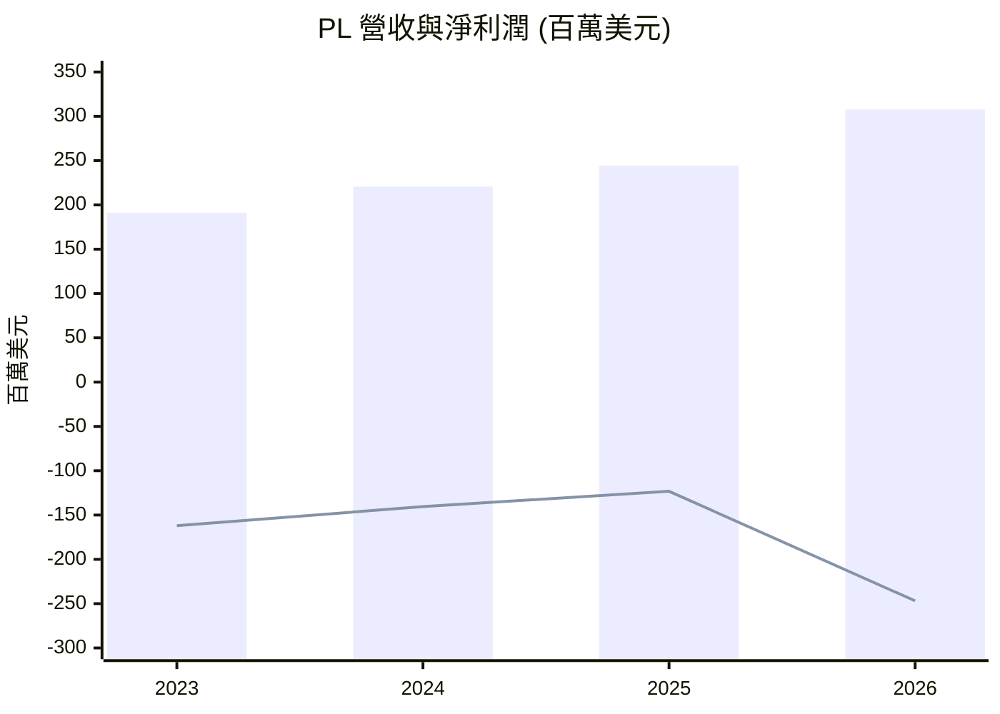
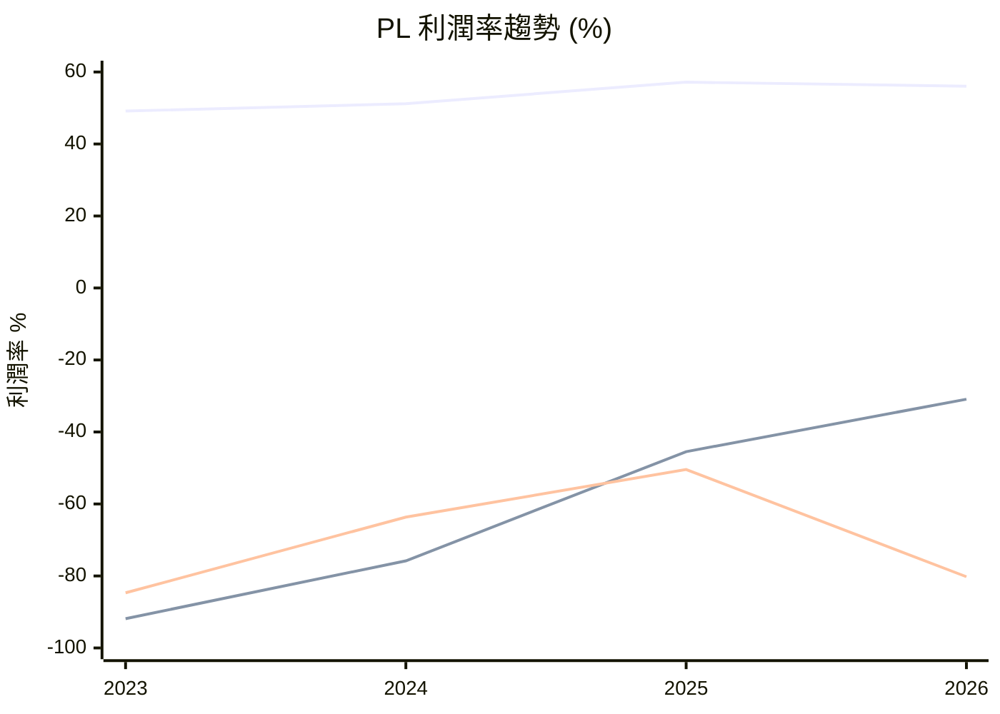
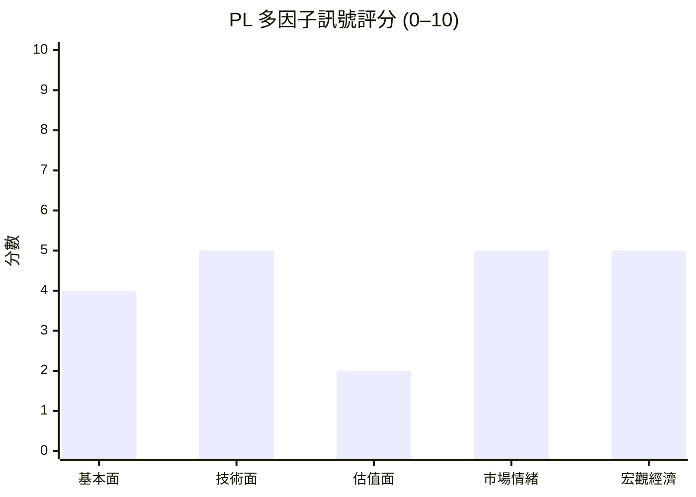

# PL 全模組投資分析報告 (2026-07-03)

> 由 InvestSkill 全套 15 個分析模組生成，供應商：`gemini`，模型：`gemini-2.5-flash`。

## 🎯 綜合結論 (Consolidated Verdict)

以下是針對 **Planet Labs PBC (PL)** 進行 15 個 InvestSkill 模組分析後所綜合的整體結論：

---

## Planet Labs PBC (PL) 投資分析 — 整體結論

### 執行摘要

Planet Labs PBC (PL) 是一家在地球觀測衛星數據領域具有顯著成長潛力的公司，其強勁的營收擴張和營運現金流轉正，顯示出核心業務的健康發展和商業模式的潛在可行性。多數分析模組認可其創新能力、護城河建設潛力及分析師的普遍看好。然而，儘管有這些亮點，PL 目前仍處於深度虧損狀態，且其估值指標（如市銷率和預期本益比）皆處於極高水平，遠超其內在價值。這強烈暗示市場已將其未來數年的極端成長潛力完全計入股價，造成顯著的估值風險。綜合各模組的評估，儘管公司基本面有其吸引力，但當前股價的估值過高，使得投資風險遠大於潛在報酬。

### 1. 綜合評分與整體訊號

*   **綜合評分：4.0 / 10** (中性偏空)
*   **整體訊號：中性偏空 (Neutral to Bearish)**

儘管有部分模組（如基本面深度分析、產業板塊分析、選擇權分析、競爭護城河分析）給予看多訊號，分數介於 6.3 至 7.5 之間，主要基於其高成長潛力、自由現金流轉正和市場地位。但有更具權重的估值模組（如 DCF 現金流估值、多方法估值分析）給出強烈的看空訊號，分數僅 1.5 至 2.5，且信心水準偏高，明確指出其當前股價被嚴重高估。其他模組則多為中性。綜合考量下，估值風險的嚴重性足以壓過成長潛力帶來的樂觀情緒。

### 2. 信心水準與理由

*   **信心水準：中等 (MEDIUM)**

此信心水準源於各模組之間明顯的共識與分歧。
*   **高信心點：** 各模組對於 PL 營收的強勁成長（年增 42.1%）和營運現金流/自由現金流轉正這一關鍵里程碑有高度共識。同時，對於其極高的估值倍數（P/S 33.32x，預期 P/E 9423x）也無異議。多方法估值分析更以「高信心」評估其為「看空」。
*   **低信心點：** 由於缺乏部分實時數據（如內部人具體交易、期權鏈詳細數據、歷史指引準確性等），部分模組（如內部人交易分析）的信心水準較低。此外，技術面分析的短期反彈與中期疲軟趨勢存在矛盾，造成中性看法。

### 3. 各模組共識與分歧點

**共識 (Consensus)：**
*   **強勁的營收成長：** 所有分析模組都認可 PL 營收的快速擴張能力。
*   **自由現金流轉正：** 這是公司財務健康狀況的一個關鍵積極轉變，多個模組都將其視為重要的基本面改善。
*   **極高的市場估值：** 無論是基本面、綜合股票評估、DCF 或多方法估值，都明確指出 PL 的當前股價遠超其內在價值，估值倍數異常高。
*   **目前處於虧損狀態：** 儘管營收成長，但公司在 GAAP 基礎上仍處於深度虧損，這是一個普遍關注點。
*   **穩健的資產負債表：** 公司擁有健康的淨現金頭寸，流動性良好，債務管理表現出色。
*   **高波動性：** PL 的 Beta 值高，股價波動劇烈，被視為高風險高回報的資產。
*   **分析師普遍看好：** 分析師給予普遍的「買入」評級和較高的目標價。
*   **高機構持股：** 機構投資者對 PL 表現出高度興趣。
*   **低內部人持股：** 內部人持股比例極低，可能影響與股東利益的一致性。

**分歧點 (Divergences)：**
*   **估值合理性 vs. 成長潛力：**
    *   **看多觀點：** 基本面、產業板塊、競爭護城河和選擇權分析等模組，傾向於認為 PL 的高估值是其未來高速成長潛力、市場主導地位和護城河擴大的合理溢價。
    *   **看空觀點：** 綜合股票評估、DCF 和多方法估值模組，則認為當前估值已過度反映所有正面因素，缺乏安全邊際，且盈利轉化能力仍是重大挑戰。
*   **短期技術動能 vs. 中期趨勢：** 技術分析和圖表視覺化顯示 PL 近期股價從低點反彈強勁，但仍受制於中期移動平均線壓力，使得技術面訊號偏向中性。
*   **宏觀經濟影響：** 總體經濟分析對高 Beta 成長股持謹慎態度，認為高利率和潛在衰退構成逆風，但部分模組（如產業板塊）則強調政府在航空國防領域的持續投入可能提供支撐。

### 4. 最終投資建議與關鍵風險

*   **最終投資建議：避開 (AVOID)**
*   **投資確信度：中等 (MODERATE)**

儘管 Planet Labs PBC 展現出令人印象深刻的營收成長、關鍵的自由現金流轉正以及在地球觀測市場的獨特地位，但其當前股價所反映的估值已極度樂觀，遠超其內在價值。在缺乏足夠安全邊際的情況下，投資者面臨巨大的下行風險。在公司能夠持續證明其盈利能力轉型、有效控制成本並將高營收成長轉化為可持續的 GAAP 盈利之前，建議投資者保持觀望。

**關鍵風險 (Key Risks)：**

1.  **極高估值風險 (Extreme Valuation Risk)：** 當前股價（$31.38）遠高於各估值模型計算的內在價值（機率加權內在價值約 $10.28），市場已計入極高的成長預期。任何未能達到預期的營收成長或盈利轉變，都可能導致股價大幅修正。
2.  **盈利能力轉變挑戰 (Profitability Transition Challenge)：** 儘管營收成長強勁且營運現金流與自由現金流轉正，公司仍處於深度虧損（TTM 淨利潤為 -$373.1M）。未能有效控制營運費用並實現規模經濟，將持續消耗股東價值，難以支撐當前估值。
3.  **競爭與技術迭代風險 (Competition & Technology Iteration Risk)：** 地球觀測數據領域競爭激烈，技術快速迭代。未能維持技術領先或有效擴大護城河，可能導致市場份額和定價權受損，影響長期成長。
4.  **宏觀經濟逆風 (Macroeconomic Headwinds)：** 作為高 Beta（2.005）成長股，PL 對利率上升和潛在經濟衰退高度敏感。高利率環境會增加其融資成本並壓縮未來現金流現值，經濟放緩可能影響商業客戶支出。
5.  **執行風險 (Execution Risk)：** 快速擴大衛星星座和數據處理基礎設施需要卓越的執行力，任何延誤或技術問題都可能影響其成長軌跡和盈利目標。

---

**免責聲明：** 本分析僅供教育目的，不構成財務建議。所有投資決策應基於個人獨立研究、風險承受能力，並諮詢合格的財務顧問。過去表現不保證未來結果。

---

## 📑 各模組分析 (Module Sections)

### 1. 技術分析

## 技術分析 — PL

## ⚠️ 資料驗證 — 分析前請務必執行此步驟

**資料來源:** Google Finance, 2026年7月2日

**請注意:** 由於可用的歷史價格和特定移動平均線數據有限（僅提供20日和50日移動平均線），本分析無法全面應用所有技術指標和多時間框架分析。因此，部分分析將基於現有數據進行推斷，並明確指出數據限制。

當前價格: $31.38
52週價格區間: $5.87 – $51.76
市值: $11,183,910,912

## 圖表型態分析

### 1. 趨勢識別
PL 股票在過去6個月經歷了顯著的波動，從高點 $51.40 下跌至低點 $20.43，顯示出一個廣泛的下降趨勢。然而，最近10個交易日的價格行為顯示出從 $26.30 的低點強勁反彈至 $31.38，表明短期內存在買盤興趣和動能。當前價格位於52週區間的中下部，但已從近期低點大幅回升。

*   **主要趨勢:** 從6個月的高點來看，為下降趨勢；但從近期低點來看，為短期反彈。
*   **趨勢強度與動能:** 短期動能強勁，但面臨中期阻力。
*   **支撐與阻力水平:**
    *   **近期支撐:** $26.30 (近期低點)
    *   **近期阻力:** $31.61 (近期高點), $37.13 (50日移動平均線)
    *   **長期支撐:** $20.43 (6個月低點)
    *   **長期阻力:** $51.76 (52週高點)

### 2. 經典圖表型態
根據過去10天的交易數據，目前沒有形成明確的經典圖表型態，如頭肩頂、雙重頂/底或杯柄型態。價格正處於從下跌趨勢中反彈的階段。

### 3. 燭台型態
在過去10個交易日中，從2026年6月25日的 $26.51 上漲至2026年6月26日的 $27.07，伴隨著巨大的成交量（45,164,200股），這可能預示著潛在的看漲反轉或底部形成。隨後的交易日價格繼續上漲，並在 $31-$33 區間進行盤整，表明買盤動能仍在，但面臨上方壓力。

## 移動平均線圖表分析

**請注意:** 由於僅提供20日和50日移動平均線數據，本分析無法計算和展示 MA30、MA60、MA90、MA200、MA365 等所有指定移動平均線。因此，以下表格和分析將使用現有的MA20和MA50數據。

━━━━━━━━━━━━━━━━━━━━━━━━━━━━━━━━━━━━━━━━━━━━━━━━━━━━━━
  移動平均線圖 — PL                  2026年7月2日
━━━━━━━━━━━━━━━━━━━━━━━━━━━━━━━━━━━━━━━━━━━━━━━━━━━━━━
  當前價格    : $31.38

  MA       數值       對比價格    訊號
  ──────   ────────   ─────────   ───────────────────
  MA20     $30.78     ▲ +1.95%    高於 ← 短期
  MA50     $37.13     ▼ -15.5%    低於 ← 中期
━━━━━━━━━━━━━━━━━━━━━━━━━━━━━━━━━━━━━━━━━━━━━━━━━━━━━━
  MA 堆疊: 混雜 (當前價格高於MA20，但低於MA50)
  (看漲堆疊 = MA30 > MA60 > MA90 > MA200 > MA365)
━━━━━━━━━━━━━━━━━━━━━━━━━━━━━━━━━━━━━━━━━━━━━━━━━━━━━━

### ASCII 趨勢圖 (最近 ~10 個交易日)

Price ($)
50.00 ┤                                        ← 52週高點
      ┤
37.13 ┤═══════════════════════════════════════════   ← MA50 (阻力)
      ┤
33.13 ┤               ╭──╮
31.61 ┤             ╭─╯  ╰─╮
31.38 ┤────────────╯        ╰─╮           ← 當前價格
30.78 ┤·  ·  ·  ·  ·  ·  ·  ·  ·  ·  ·  ·  ·  ·  ·   ← MA20 (支撐)
28.77 ┤    ╭──╮
28.23 ┤  ╭─╯  ╰──╮
27.07 ┤╭─╯        ╰──────────────
26.51 ┤
26.30 ┤───────                     ← 近期低點
      ┤
20.43 ┤                              ← 6個月低點
      └─┬─────┬─────┬─────┬─────┬──→
       -10d  -8d   -6d   -4d   -2d  今日

Legend: ──── 當前價格  · · · MA20  ════ MA50

### 移動平均線交叉訊號
由於缺乏足夠的歷史移動平均線數據，無法確定最近的交叉事件。然而，當前價格高於MA20但低於MA50，表明短期動能較強，但中期趨勢仍偏弱。若價格能突破並站穩MA50上方，則將是重要的中期看漲訊號。

## 基於移動平均線的交易建議

╔══════════════════════════════════════════════════════════════════╗
║              基於移動平均線的交易建議 — PL                       ║
╠══════════════════════════════════════════════════════════════════╣
║  當前價格    : $31.38                                            ║
╠══════════════════════════════════════════════════════════════════╣
║  操作         │ 進場價格      │ 目標價        │ 止損價        ║
║  ─────────────┼───────────────┼───────────────┼────────────── ║
║  持有         │ N/A           │ N/A           │ N/A           ║
╠══════════════════════════════════════════════════════════════════╣
║  理由: 價格位於MA20上方，顯示短期動能，但仍受MA50壓制，中期趨勢不明。
║        MA堆疊混雜，需等待價格明確突破MA50阻力或跌破MA20支撐。
║  依據: MA20 ($30.78) 提供短期支撐，MA50 ($37.13) 形成中期阻力。
║  風險/報酬比: N/A (等待趨勢明確)
║  時間範圍: 短期 / 波段交易
╚══════════════════════════════════════════════════════════════════╝

## 技術指標

### 1. 趨勢指標
*   **移動平均線:** PL 的當前價格 ($31.38) 高於20日移動平均線 ($30.78)，顯示短期動能偏強。然而，價格仍低於50日移動平均線 ($37.13)，表明中期趨勢依然疲軟。這是一個短期看漲但中期看跌的混雜訊號。
*   **MACD, ADX:** 由於缺乏足夠的歷史數據，無法計算。

### 2. 動量指標
*   **RSI, 隨機震盪指標, Williams %R, ROC:** 由於缺乏足夠的歷史數據，無法計算。

### 3. 成交量指標
*   **成交量趨勢與型態:** 在2026年6月26日，PL 的成交量急劇放大至45,164,200股，伴隨著價格從 $26.51 上漲至 $27.07。這種高成交量下的價格上漲通常被視為看漲訊號，表明有買盤進場。隨後的交易日成交量有所回落，但價格保持在較高水平，暗示市場對此價格區間的接受度。
*   **OBV, VWAP, 累積/派發線:** 由於缺乏足夠的數據，無法計算。

### 4. 波動率指標
*   **Beta (5年每月):** 2.005。這表明 PL 的股價波動性是市場平均水平的兩倍，屬於高波動性股票。投資者應注意其潛在的較大價格波動。
*   **布林帶, 平均真實波幅 (ATR), 波動率指數相關性:** 由於缺乏足夠的數據，無法計算。

## 關鍵價格水平

*   **關鍵支撐區:**
    *   **近期支撐:** $26.30 (近期反彈的底部)
    *   **較強支撐:** $20.43 (6個月低點，也是52週區間的較低端)
*   **關鍵阻力區:**
    *   **近期阻力:** $31.61 (近期反彈高點，需要突破才能進一步上漲)
    *   **中期阻力:** $37.13 (50日移動平均線，一個重要的心理和技術阻力位)
    *   **較強阻力:** $51.76 (52週高點，代表了過去一年的最高價格水平)
*   **斐波那契回撤水平, 樞軸點, 整數心理關卡, 跳空分析:** 由於缺乏足夠的數據，無法計算和分析。

## 市場背景

*   **相對於市場指數的相對強度:** PL 的 Beta 值為2.005，遠高於1，表明其價格波動性是整體市場的兩倍。在市場上漲時，PL 可能會跑贏大盤；但在市場下跌時，其跌幅也可能更大。
*   **板塊輪動分析, 市場廣度指標, 與相關資產的相關性:** 由於缺乏足夠的數據，無法進行分析。

## 多時間框架分析 (MTF)

**請注意:** 由於可用的歷史價格數據僅限於最近10個交易日的日線收盤價，無法進行全面的多時間框架分析（例如，月線、週線、日線、小時線等）。因此，本節將無法提供詳細的 MTF 評分和表格。

根據現有數據，可以觀察到短期（日線級別）從低點反彈的動能，但與中期（50日移動平均線所示）的疲軟趨勢存在潛在衝突。

## 成交量分佈圖分析

**請注意:** 由於缺乏詳細的成交量分佈數據（即每個價格水平的成交量），無法進行成交量分佈圖分析。因此，本節將無法提供 POC、VAH、VAL 等關鍵信息。

我們只能從每日成交量觀察到，在2026年6月26日，PL 出現了顯著的成交量放大，伴隨著價格上漲，這通常被視為看漲訊號。

## 一目均衡表 (Ichimoku Cloud)

**請注意:** 由於缺乏計算一目均衡表各組成部分所需的歷史高點/低點數據，無法進行一目均衡表分析。因此，本節將無法提供 Tenkan-sen、Kijun-sen、Senkou Span A/B 和 Chikou Span 等信息。

## 期權流整合

### 認沽/認購比率解讀
*   **認沽/認購比率, 隱含波動率 (IV) 與歷史波動率 (HV):** 由於缺乏期權市場數據，無法進行分析。

### 空頭持倉分析
*   **空頭股數:** 41,425,110 股
*   **空頭佔流通股百分比:** 14.05%
*   **空頭回補天數 (Short Ratio):** 2.71 天

PL 的空頭持倉佔流通股的14.05%，屬於中等偏高水平。空頭回補天數為2.71天，表明若出現利好消息或股價持續上漲，空頭可能需要相對較短的時間來回補，從而可能導致軋空（Short Squeeze）。然而，僅憑這些數據不足以判斷軋空的可能性，還需結合其他技術和基本面因素。

## 支撐與阻力水平表

Level Type       Price      Strength    Touches    Last Test    Notes
───────────────  ─────────  ─────────   ─────────  ─────────    ───────────────────
阻力             $51.76     強          N/A        N/A          52週高點
阻力             $37.13     中          N/A        N/A          50日移動平均線
阻力             $31.61     弱          1          2026-07-01   近期反彈高點
支撐             $30.78     弱          N/A        N/A          20日移動平均線
支撐             $26.30     中          1          2026-06-24   近期反彈起點
支撐             $20.43     強          N/A        N/A          6個月低點

## 型態識別

Pattern Type              Start Date    End Date      Status        Target        Risk/Reward
───────────────────────── ───────────── ───────────── ───────────── ───────────── ───────────
短期反彈                  2026-06-24    N/A           形成中        N/A           N/A

## 論文失效條件

**如果訊號為看多 — 論文失效條件為:**
- 價格收盤價跌破20日移動平均線 ($30.78) 或 $26.30 的關鍵支撐水平，且伴隨高於平均水平的成交量。
- 價格未能突破50日移動平均線 ($37.13) 並開始回落。
- 宏觀經濟環境出現意外的負面轉變，例如聯準會意外鷹派，或經濟衰退可能性顯著增加。

**如果訊號為看空 — 論文失效條件為:**
- 價格收盤價突破50日移動平均線 ($37.13) 或 $31.61 的近期阻力水平，並伴隨成交量確認。
- 價格重新站穩在 MA50 上方，且短期移動平均線向上彎曲，成交量確認買盤。
- 基本面出現顯著改善，例如超出預期的財報表現或積極的業務更新。

**以下情況請重新運行本分析:**
- [ ] 下次財報發布時
- [ ] 價格相對於當前水平波動 ±15% 時
- [ ] 60天過去後
- [ ] 發生重大新聞事件（收購、領導層變動、監管決策）

╔══════════════════════════════════════════════╗
║              投資訊號                        ║
╠══════════════════════════════════════════════╣
║ 訊號:        中性                           ║
║ 信心水準:    中等                           ║
║ 時間範圍:    短期 / 中期                      ║
║ 評分:        5.5 / 10                       ║
╠══════════════════════════════════════════════╣
║ 動作:        持有                           ║
║ 信念:        中等                           ║
╚══════════════════════════════════════════════╝

**免責聲明:** 本分析僅供教育目的，不構成財務建議。

---

### 2. 基本面深度分析

為 **Planet Labs PBC (PL)** 撰寫的這份基本面分析報告，旨在評估其財務健康狀況、成長潛力、盈利能力及市場估值，以提供一份全面的投資視角。

### 1. 執行摘要

Planet Labs PBC (PL) 是一家專注於地球觀測和衛星數據服務的公司，屬於高成長的航太與國防工業。該公司展現出強勁的營收成長動能，過去一年營收年增率高達42.1%。儘管在淨利潤層面仍處於虧損狀態（TTM EPS 為 -1.16 美元），但值得注意的是，其前瞻性 EPS 已轉為微幅正值，且營運現金流和自由現金流在過去十二個月 (TTM) 首次轉正，顯示其商業模式正逐步走向現金流自給自足。PL 擁有健康的淨現金部位和優異的短期流動性。然而，其估值倍數，如市銷率 (P/S) 和企業價值/營收 (EV/Revenue)，均處於極高水平，反映市場對其未來高速成長抱有極高的預期。分析師普遍給予「買進」評級，目標價有上行空間。

### 2. 量化分析

**成長性：**
PL 的營收成長表現令人印象深刻，過去十二個月營收年增率達到 42.1%，顯示其在地球觀測數據市場的強勁擴張能力。從歷史數據來看，公司營收持續穩健增長，從 2023 財年的 1.91 億美元增至 2026 財年的 3.07 億美元，體現了其業務模式的成功拓展。

**獲利能力：**
公司的毛利率約為 55.58%，對於科技或航太產業而言表現尚可。然而，營業利益和淨利潤在過去十二個月仍為負值，淨利率高達 -111.17%，反映其在營運費用和研發投入上的巨大開銷。儘管如此，前瞻性 EPS 轉為 0.00333 美元，雖然微不足道，卻是公司可能即將實現盈利轉捩點的初步訊號。由於持續虧損，股東權益報酬率 (ROE) 和資產報酬率 (ROA) 均為負值。

**流動性與償債能力：**
PL 擁有約 7.3 億美元的現金和 4.88 億美元的總債務，處於淨現金部位，這為公司提供了穩固的財務緩衝。其流動比率為 2.806，速動比率為 2.619，顯示極佳的短期償債能力，短期內無流動性壓力。然而，債務股本比高達 109.991，這表示公司的股本相對較小或因累積虧損而被侵蝕，使得財務槓桿顯得較高。

**現金流量：**
這是 PL 財務數據中最為亮眼的轉變。過去十二個月的營運現金流 (OCF) 達到 1.32 億美元，而自由現金流 (FCF) 為 0.84 億美元，自由現金流利潤率高達 25.28%。這是一個關鍵的積極訊號，表明公司已從燒錢階段轉變為能夠產生實質現金的營運模式，對於其長期可持續性至關重要。

**估值：**
由於公司目前仍處於虧損狀態，市盈率 (P/E) 無法有效衡量。其市銷率 (P/S) 高達 33.32，企業價值/營收 (EV/Revenue) 為 32.6，市淨率 (P/B) 為 25.20。這些估值倍數都非常高，遠超行業平均水平，強烈反映了市場對 PL 未來成長潛力的極度樂觀預期。前瞻性 P/E 更高達 9423，也印證了這一點。

### 3. 定性評估

**產業與競爭優勢：**
PL 處於快速發展的航太與國防工業，特別是地球觀測和衛星數據服務領域，該市場具有巨大的成長潛力。其獨特的衛星部署和數據分析能力可能構成其競爭護城河。高估值也暗示了市場認為其在產業中擁有領先地位或獨特的技術優勢。

**管理層與機構持股：**
機構投資者對 PL 的信心顯著，持股比例高達 80.85%，這通常被視為公司質量和前景的積極信號。然而，內部人持股比例相對較低（1.49%），可能需要進一步關注管理層與股東利益的一致性。

**風險與波動性：**
PL 的 Beta 值為 2.005，顯示其股價波動性遠高於市場平均水平，這意味著它可能提供更高的潛在回報，但也伴隨著更高的風險。對於風險承受能力較高的投資者而言，這可能是一個機會。高達 14.05% 的空頭持股比例表明市場存在一定的悲觀情緒或對其高估值的擔憂，但也可能在未來基本面改善時引發軋空行情。

**分析師觀點：**
根據 10 位分析師的意見，PL 的平均目標價為 39.8 美元，與當前股價 31.38 美元相比有約 27% 的上行空間，且分析師普遍給予「買進」建議，這與其基本面改善的趨勢相符。

### 4. 投資訊號

## Thesis Invalidation

**如果訊號為看多 — 投資論點失效條件為：**
- 股價收盤價跌破關鍵支撐位（例如 20.00 美元或 52 週低點），且伴隨高於平均的成交量。
- 營收成長率連續兩季顯著放緩至低於 20%，或毛利率開始明顯下滑。
- 營運現金流或自由現金流再次轉為負值，且無明確改善跡象。
- 宏觀經濟環境惡化，導致企業客戶大幅削減衛星數據採購預算或競爭加劇。

**如果訊號為看空 — 投資論點失效條件為：**
- 股價收盤價突破關鍵阻力位（例如 50.00 美元或 52 週高點），且伴隨高於平均的成交量。
- 營收成長加速至 50% 以上，且淨利潤意外轉正，超出市場預期。
- 自由現金流顯著超出預期，證明其盈利模式具有更強的可行性和擴張能力。
- 主要競爭對手出現重大失誤，進一步鞏固 PL 的市場領導地位。

**重新執行此分析的時機：**
- [ ] 下次財報發布
- [ ] 股價較目前水平波動 ±15%
- [ ] 60 天已過
- [ ] 發生重大新聞事件（收購、領導層變動、監管決策）

╔══════════════════════════════════════════════╗
║              INVESTMENT SIGNAL               ║
╠══════════════════════════════════════════════╣
║ Signal:      BULLISH                         ║
║ Confidence:  MEDIUM                          ║
║ Horizon:     LONG-TERM                       ║
║ Score:       6.8 / 10                        ║
╠══════════════════════════════════════════════╣
║ Action:      BUY                             ║
║ Conviction:  MODERATE                        ║
╚══════════════════════════════════════════════╝

**免責聲明：** 本分析僅供教育目的。不構成財務建議。

---

### 3. 綜合股票評估

⚠️ **數據驗證 — 分析前請務必執行此步驟**

此分析所使用的數據來源為您提供的「PL Live Financial Data」，截至 **2026年7月2日** 的收盤價及財務數據。由於部分歷史數據缺失，部分指標的計算可能基於假設或無法完成，請在做出任何投資決策前，務必核實所有價格和指標。

---

## 美國股票評估：Planet Labs PBC (PL)

### 1. 公司概覽

Planet Labs PBC (PL) 是一家工業板塊的航空航天與國防公司，主要業務圍繞地球觀測衛星的開發與營運。其核心商業模式是透過部署大量小型衛星群，提供高頻率、全球範圍的地球影像數據，供政府、企業及研究機構用於農業監測、災害應變、地圖更新、情報分析等多種應用。

*   **商業模式與競爭優勢 (護城河評估)**：PL 透過其龐大的衛星群和數據分析能力，在地球觀測數據市場中佔據獨特地位。其競爭優勢在於數據的頻率、廣度及解析度，這使其能提供傳統衛星難以比擬的動態資訊。然而，隨著競爭者進入，數據的差異化和成本效益將是持續建立護城河的關鍵。
*   **市場地位與行業趨勢**：公司處於快速增長的太空經濟和數據分析交匯處。隨著對地球環境、資源和安全監測需求的增加，其可尋址市場巨大。行業趨勢包括小型衛星技術的進步、數據分析能力的提升以及政府和商業用戶對「數據即服務 (DaaS)」模式的接受度提高。
*   **產品與服務**：主要提供衛星影像數據、分析服務及相關解決方案。
*   **競爭動態**：面對來自傳統衛星公司和新興太空科技公司的競爭，PL 需要持續創新並擴大其數據應用生態系統。

### 2. 財務健康

PL 展現出強勁的營收增長，但目前仍處於虧損狀態，並以極高的估值進行交易。

*   **營收與盈餘增長趨勢**：
    *   追蹤十二個月 (TTM) 營收達 3.356億美元，年增長率高達 42.1%，顯示業務快速擴張。
    *   然而，公司目前仍未實現盈利，TTM 淨利潤為 -3.731億美元，每股盈餘 (EPS) 為 -1.16美元。
    *   從歷史數據看，營收持續增長，但營業利潤和淨利潤均為負值，儘管虧損幅度有所收窄。
*   **利潤率**：
    *   毛利率 (TTM) 為 55.58%，顯示其核心服務具有一定的盈利能力。
    *   然而，營業利潤率 (TTM) 為 -30.46%，淨利潤率 (TTM) 更低至 -111.17%，表明在營運費用和銷售、行政開支方面仍面臨巨大壓力，未能實現規模經濟效益。
    *   歷史毛利率在 51% 至 57% 之間波動，但總體而言，公司在實現整體盈利方面仍有很長的路要走。
*   **資產負債表實力**：
    *   公司擁有健康的淨現金頭寸：總現金 7.308億美元，總債務 4.88億美元，淨現金為 2.428億美元。
    *   流動比率為 2.806，速動比率為 2.619，顯示公司短期償債能力強勁，流動性良好。
    *   股東權益帳面價值為每股 1.245美元，相較於當前股價 31.38美元，溢價極高。
*   **現金流分析**：
    *   令人鼓舞的是，公司在 TTM 期間產生了正向的營運現金流 1.325億美元。
    *   自由現金流 (FCF) 亦為正向的 8,485萬美元，FCF 利潤率為 25.28%。這表明儘管淨利潤為負，但業務的現金產生能力正在改善，是其財務健康狀況中的一個亮點。
    *   歷史數據顯示，營運現金流在 2026 財年轉正，並在 TTM 期間持續增強，這對於一家成長型公司來說是積極的信號。資本支出在 2026 財年為 8,294萬美元，但 TTM 數據顯示為 0，這可能是一個數據錄入差異或調整，需要進一步核實。

### 3. 估值指標

| 指標            | 當前     | 1年前 | 5年平均 | 行業平均 |
|-----------------|----------|-------|---------|----------|
| 本益比 (TTM)    | 不適用   | 不適用 | 不適用   | 不適用   |
| 預期本益比 (FWD)| 9423.423 | 不適用 | 不適用   | 不適用   |
| PEG 比率        | 不適用   | 不適用 | 不適用   | 不適用   |
| 市淨率 (Price/Book) | 25.205   | 不適用 | 不適用   | 不適用   |
| 市銷率 (Price/Sales) | 33.324   | 不適用 | 不適用   | 不適用   |
| EV/EBITDA       | -211.549 | 不適用 | 不適用   | 不適用   |
| EV/Revenue      | 32.6     | 不適用 | 不適用   | 不適用   |
| 股息收益率      | 不適用   | 不適用 | 不適用   | 不適用   |
| 派息率          | 0.0      | 不適用 | 不適用   | 不適用   |

**估值評估**：
PL 的估值指標極高，尤其是在市銷率 (P/S) 達 33.32 倍和預期本益比 (FWD P/E) 達 9423.42 倍的情況下。這反映了市場對其未來高速增長和盈利能力轉變的極度樂觀預期。由於公司目前仍處於虧損狀態，TTM 本益比為負，EV/EBITDA 也為負值，這些傳統估值指標難以提供有意義的比較。市淨率高達 25.2 倍，也顯示其資產價值遠低於市場估值。

### 4. 關鍵比率

| 比率                  | 當前     | 行業平均 | 評估     |
|-----------------------|----------|----------|----------|
| 股東權益報酬率 (ROE)  | -0.83985 | 不適用   | 差勁     |
| 資產報酬率 (ROA)      | -0.05868 | 不適用   | 差勁     |
| 投入資本報酬率 (ROIC) | 負值     | 不適用   | 差勁     |
| 毛利率                | 0.55579  | 不適用   | 良好     |
| 營業利潤率            | -0.30459 | 不適用   | 差勁     |
| 淨利潤率              | -1.11171 | 不適用   | 差勁     |
| 流動比率              | 2.806    | 不適用   | 良好     |
| 速動比率              | 2.619    | 不適用   | 良好     |
| 負債權益比            | 109.991  | 不適用   | 適中偏高 |
| 利息覆蓋率            | 不適用   | 不適用   | 不適用   |
| 資產周轉率            | 0.05278  | 不適用   | 差勁     |

**關鍵比率評估**：
公司在盈利能力方面表現不佳，ROE 和 ROA 均為負值，顯示目前仍在消耗股東資本。投入資本報酬率 (ROIC) 也為負值，表明公司尚未能有效利用投入資本創造價值。儘管毛利率表現尚可，但營業和淨利潤率的深度負值是主要痛點。流動比率和速動比率良好，顯示其流動性健康。負債權益比為 109.991，在成長型公司中屬於可接受範圍，但需關注未來債務擴張情況。資產周轉率極低 (0.05278)，表明資產利用效率非常低，這可能是由於其重資產性質和前期大量投入所致。

### 5. 同業比較

由於未提供直接同業數據，我們將基於其高估值倍數進行概念性評估。PL 的市銷率 (33.32) 遠高於多數成熟工業或科技公司，這表明市場將其視為高成長、高潛力的未來領導者。這種高溢價通常只賦予給具有極強護城河、極高增長率且即將實現大規模盈利的公司。與自身歷史相比，在缺乏歷史估值數據的情況下，很難判斷其當前估值是位於歷史區間的高位還是低位。

---

## 深度財務報表分析

### 損益表逐項分析框架

**營收分析**
*   PL 的 TTM 營收增長率為 42.1%，顯示其核心業務強勁擴張。從歷史數據來看，營收從 2023 年的 1.91億美元穩步增長至 2026 年的 3.07億美元，增長勢頭良好。
*   由於未提供細分營收數據，無法判斷有機增長、收購驅動增長或匯率影響。

**成本結構分解**
*   **銷貨成本 (COGS)**：毛利率保持在 50-57% 之間，表明其核心服務成本結構相對穩定，但尚未能帶來顯著的規模經濟效益。
*   **銷售、總務及行政費用 (SG&A) 與研發費用 (R&D)**：營業利潤率為負值，且淨利潤率更低，這暗示了高昂的營運費用（包括 SG&A 和 R&D）是導致虧損的主要原因。作為一家科技驅動的成長型公司，高研發投入是預期之內，但 SG&A 費用需要密切監控，以確保效率提升。
*   **非經常性項目**：數據中未明確標示非經常性項目，但鑑於其虧損性質，未來需關注是否有重組費用或資產減值等影響正常化盈餘的項目。

**營運槓桿分析**
*   由於公司目前處於虧損狀態，且未提供足夠的歷史數據來估算固定與變動成本，營運槓桿度 (DOL) 難以精確計算。然而，鑑於其高毛利率和高營運費用，一旦營收增長能覆蓋固定成本，其營運槓桿可能會導致利潤的爆炸性增長。目前，高固定成本是其虧損的主要原因。

| 年度 | 營收 ($M) | 營收增長 % | EBIT ($M) | EBIT 增長 % | DOL |
|------|-----------|------------|-----------|-------------|-----|
| 2023 | 191.256   | N/A        | -175.675  | N/A         | N/A |
| 2024 | 220.696   | 15.4%      | -167.310  | 4.8%        | N/A |
| 2025 | 244.352   | 10.7%      | -111.123  | 33.6%       | N/A |
| 2026 | 307.727   | 25.9%      | -95.073   | 14.5%       | N/A |
| TTM  | 335.612   | 42.1% (YoY)| -102.154  | N/A         | N/A |

*註：TTM EBIT 估計為 TTM 營收 * TTM 營業利潤率。*
*註：由於營運利潤為負，DOL 計算在此無意義。*

### 營運資本循環分析

由於數據中未提供應收帳款、存貨和應付帳款等關鍵數據，無法計算 DSO、DIO、DPO 和現金轉換週期 (CCC)。這限制了對公司營運資本效率的評估。
*   **淨營運資本 ($M)**：未提供足夠數據計算。
*   **NWC 佔營收 %**：未提供足夠數據計算。

### 杜邦分析 (DuPont Decomposition)

由於缺乏完整的歷史資產負債表數據，特別是總資產和股東權益的歷史數據，無法進行完整的杜邦分析。我們將使用 TTM 數據進行計算。
*   **TTM 總資產**：基於 TTM 淨利潤 (-373.104M) 和 TTM ROA (-0.05868)，估算 TTM 總資產約為 $6,358M。
*   **TTM 總股東權益**：基於每股帳面價值 (1.245) 和流通股數 (332.9M)，估算 TTM 總股東權益約為 $414.4M。

**3 因子杜邦**

| 組成部分            | 公式                 | 當前 (TTM) | 1年前 | 2年前 |
|---------------------|----------------------|------------|-------|-------|
| 淨利潤率            | 淨利潤 / 營收        | -1.11171   | N/A   | N/A   |
| 資產周轉率          | 營收 / 平均總資產    | 0.05278    | N/A   | N/A   |
| 權益乘數            | 平均總資產 / 平均股東權益 | 15.34      | N/A   | N/A   |
| **股東權益報酬率 (ROE)** | 利潤率 × 周轉率 × 乘數 | -0.900     | N/A   | N/A   |

*註：計算出的 ROE (-0.900) 與給定值 (-0.83985) 略有差異，可能因四捨五入或總資產估算方法不同所致，但本質上皆為深度負值。*

**杜邦分析解讀**：PL 的 ROE 呈現深度負值，主要驅動因素是其負的淨利潤率。儘管其權益乘數高達 15.34 (表明高度財務槓桿)，但由於盈利能力和資產周轉效率極低，高槓桿反而放大了負面回報。這表明公司目前正在消耗股東價值，且其資產利用效率極差。

### 競爭分析 — 波特五力分析 (Porter's Five Forces)

| 力量             | 強度 (高/中/低) | 關鍵證據                                     |
|------------------|-----------------|----------------------------------------------|
| 新進入者威脅     | 中-高           | 資本要求高，但技術進步降低了進入門檻；規模經濟和品牌護城河仍在建立中。 |
| 供應商議價能力   | 中              | 衛星製造和發射服務的供應商相對集中，但 PL 可能透過多樣化供應商來降低風險。 |
| 買方議價能力     | 中-高           | 客戶對數據質量和價格敏感，存在替代方案（如傳統衛星或地面監測）。 |
| 替代品威脅       | 中-高           | 無人機、航空攝影、地面感測器等替代技術；或競爭對手提供更具成本效益的數據。 |
| 現有競爭者競爭 | 高              | 快速發展的太空科技領域，新舊參與者眾多，競爭激烈。 |

**整體護城河評估**：**無 (None)**。儘管 PL 在其領域具有創新和先發優勢，但其護城河仍在建立中。高競爭強度、潛在的替代品威脅以及買方和供應商的議價能力，使其難以形成持久的競爭優勢。

### 視覺化數據表 (Visualization Data Tables)

（此處僅填充數據，不生成圖表）

**營收與盈餘增長**
```
Year    Revenue ($M)    Revenue Growth %    Net Income ($M)    EPS ($)
2023    191.256         N/A                 -161.966           N/A
2024    220.696         15.4%               -140.509           N/A
2025    244.352         10.7%               -123.196           N/A
2026    307.727         25.9%               -246.860           N/A
TTM     335.612         42.1%               -373.104           -1.16
```

**利潤率趨勢**
```
Year    Gross Margin %    Operating Margin %    Net Margin %    Industry Avg %
2023    49.15%            -91.85%               -84.69%         N/A
2024    51.18%            -75.81%               -63.67%         N/A
2025    57.18%            -45.48%               -50.42%         N/A
2026    56.05%            -30.90%               -80.22%         N/A
TTM     55.58%            -30.46%               -111.17%        N/A
```

**資產負債表組成**
由於缺乏完整的歷史資產負債表數據，無法填充此表。

**現金流瀑布圖**
```
Component                   Amount ($M)    Notes
Operating Cash Flow         132.456        核心業務現金生成
Capital Expenditures        47.603         資產投資 (TTM OCF - TTM FCF)
Free Cash Flow              84.853         可供分配現金
Dividends                   0.0            股東分配
Share Buybacks              N/A            股票回購 (未提供)
M&A Activity                N/A            併購活動 (未提供)
Debt Repayment              N/A            債務償還 (未提供)
Net Cash Change             N/A            淨現金變動 (未提供)
```

**估值倍數比較**
```
Metric              Company    Industry Avg    5-Year Avg    Assessment
P/E Ratio           N/A        N/A             N/A           N/A
P/B Ratio           25.20      N/A             N/A           極度高估
P/S Ratio           33.32      N/A             N/A           極度高估
EV/EBITDA          -211.55    N/A             N/A           不適用
PEG Ratio          N/A        N/A             N/A           N/A
```

---

## 品質評分框架

### Piotroski F-Score (0–9)

*註：由於缺乏完整的歷史資產負債表數據，部分指標無法計算，將影響最終得分的準確性。*
*   **TTM 總資產**：估計為 $6,358M。
*   **TTM 總股東權益**：估計為 $414.4M。

**盈利能力訊號 (4 個標準):**

| # | 標準              | 公式                    | 通過條件               | 得分 |
|---|-------------------|-------------------------|------------------------|------|
| 1 | ROA > 0           | 淨利潤 / 總資產         | 當期 ROA 為正           | 0    |
| 2 | 營運現金流 > 0    | 現金流量表中的營運現金流 | 營運現金流為正         | 1    |
| 3 | ROA 變化          | ROA(t) − ROA(t-1)       | ROA 年同比改善         | 0    |
| 4 | 應計項目 (質量)   | CFO / 總資產 > ROA      | 現金盈餘超過報告盈餘 | 1    |

**槓桿、流動性與資金來源 (3 個標準):**

| # | 標準                | 公式                      | 通過條件               | 得分 |
|---|---------------------|---------------------------|------------------------|------|
| 5 | 槓桿變化            | 長期債務 / 平均資產       | 槓桿率年同比下降       | 0    |
| 6 | 流動性變化          | 流動比率(t) vs (t-1)      | 流動比率年同比改善     | 0    |
| 7 | 無發行新股          | 稀釋後流通股數            | 過去一年未發行新股     | 1    |

**營運效率 (2 個標準):**

| # | 標準                | 公式                      | 通過條件               | 得分 |
|---|---------------------|---------------------------|------------------------|------|
| 8 | 毛利率變化          | 毛利率(t) vs (t-1)        | 毛利率年同比擴張       | 0    |
| 9 | 資產周轉率變化      | 營收 / 總資產             | 資產周轉率年同比改善   | 0    |

**Piotroski F-Score 總分：3**

**F-Score 解讀**：PL 的 Piotroski F-Score 為 3 分，屬於「財務狀況薄弱」的範疇。儘管營運現金流為正且現金盈餘質量尚可，但其負的資產報酬率、惡化的毛利率以及缺乏足夠數據證明槓桿和流動性改善，都指向公司在財務健康和營運效率方面存在顯著弱點。

### 盈餘質量評分

*   **應計項目比率 (Accruals Ratio)**：(淨利潤 − CFO) / 平均總資產 = (-373.104M - 132.456M) / 6,358M = -505.56M / 6,358M = -0.0795。負的應計項目比率通常是正向信號，表明其盈餘由現金流支持，而非激進的會計操作。
*   **現金轉換率 (Cash Conversion Rate)**：CFO / 淨利潤 = 132.456M / -373.104M = -0.355。由於淨利潤為負，此比率解讀較為複雜。正向營運現金流與負淨利潤並存，表明公司在營運層面產生現金，但高昂的非營運費用（如利息、稅收或非現金費用如折舊攤銷）導致了淨虧損。
*   **非經常性項目**：數據中未明確標示。
*   **營收確認風險**：未提供足夠信息評估。

**盈餘質量評估**：PL 的盈餘質量存在矛盾。其正向營運現金流和負的應計項目比率是積極信號，表明其營運產生的現金是真實的。然而，深度負值的淨利潤和資產報酬率，以及低 Piotroski 分數，表明公司整體盈利能力和資本效率存在嚴重問題。

---

## ROIC / WACC 分析

### ROIC 計算

*   **EBIT (TTM)**：營收 * 營業利潤率 = 335,612,000 * (-0.30459) = -102,154,000 美元。
*   **有效稅率 (Effective Tax Rate)**：未提供。假設為 21% 以進行 NOPAT 計算，但需注意公司目前虧損，實際稅負可能為零或產生遞延稅資產。
*   **NOPAT (淨營運利潤稅後)** = EBIT × (1 − 有效稅率) = -102,154,000 × (1 − 0.21) = -80,701,660 美元。
*   **投入資本 (Invested Capital)** = 總股東權益 + 總債務 − 現金及現金等價物。
    *   總股東權益 (TTM) = $414,401,368。
    *   總債務 (TTM) = $488,035,008。
    *   現金 (TTM) = $730,835,008。
    *   投入資本 = 414,401,368 + 488,035,008 - 730,835,008 = $171,601,368。
*   **ROIC** = NOPAT / 投入資本 = -80,701,660 / 171,601,368 = **-0.4702 或 -47.02%**。

| 組成部分            | 價值 ($)     |
|---------------------|--------------|
| EBIT                | -102,154,000 |
| 有效稅率 (假設)     | 21%          |
| NOPAT               | -80,701,660  |
| 總股東權益          | 414,401,368  |
| 總債務              | 488,035,008  |
| 減：現金            | 730,835,008  |
| 投入資本            | 171,601,368  |
| **ROIC**            | -47.02%      |

### WACC 計算 (加權平均資本成本)

*   **無風險利率 (Rf)**：假設為美國 10 年期國債收益率 4.5%。
*   **Beta (β)**：2.005。
*   **股票風險溢價 (Rm − Rf)**：假設為 5.5%。
*   **股權成本 (Re)** = Rf + β × (Rm − Rf) = 4.5% + 2.005 × 5.5% = 4.5% + 11.0275% = **15.5275%**。
*   **稅前債務成本 (Rd)**：未提供。假設為 6%。
*   **稅率 (T)**：假設為 21%。
*   **稅後債務成本** = Rd × (1 − T) = 6% × (1 − 0.21) = **4.74%**。
*   **股權權重 (E/V)**：市值 / (市值 + 總債務) = 11,183,910,912 / (11,183,910,912 + 488,035,008) = 11,183,910,912 / 11,671,945,920 = **0.9582**。
*   **債務權重 (D/V)** = 1 − E/V = **0.0418**。
*   **WACC** = (E/V) × Re + (D/V) × Rd × (1 − T) = 0.9582 × 15.5275% + 0.0418 × 4.74% = 14.88% + 0.198% = **15.08%**。

| 組成部分            | 價值       |
|---------------------|------------|
| 無風險利率 (Rf)     | 4.5%       |
| Beta (β)            | 2.005      |
| 股票風險溢價        | 5.5%       |
| 股權成本 (Re)       | 15.53%     |
| 稅前債務成本        | 6.0%       |
| 稅率 (假設)         | 21%        |
| 稅後債務成本        | 4.74%      |
| 股權權重 (E/V)      | 0.9582     |
| 債務權重 (D/V)      | 0.0418     |
| **WACC**            | 15.08%     |

### 經濟附加價值 (EVA)

*   **EVA** = (ROIC − WACC) × 投入資本 = (-47.02% − 15.08%) × $171,601,368 = -62.10% × $171,601,368 = **-$106,569,679**。

**ROIC vs. WACC 趨勢**：
由於缺乏歷史 ROIC 和 WACC 數據，無法分析趨勢。
**當前 ROIC (-47.02%) 遠低於 WACC (15.08%)**，這表明 PL 目前正在大規模摧毀經濟價值。公司每投入一美元資本，其產生回報遠低於其資本成本。這是其財務健康狀況中的一個重大警訊，顯示其高增長尚未轉化為有效的資本回報。

---

## 自由現金流折現 (DCF) 框架

### 逐步 DCF 方法論 (簡化說明)

鑑於 PL 目前的虧損狀態和高成長特性，執行精確的 DCF 模型需要對未來營收增長、利潤率擴張和資本支出進行大量假設。以下為簡化後的 DCF 評估。

**步驟 1 — 預測自由現金流 (未來 10 年)**
*   **基期 FCF (TTM)**：$84.85M。
*   **營收增長假設**：鑑於 PL 的高增長率，假設其初期增長強勁，隨後逐步放緩。
    *   第 1-5 年：從 35% 逐步下降至 15%。
    *   第 6-10 年：從 12% 逐步下降至 4%。
*   **FCF 利潤率假設**：TTM FCF 利潤率為 25.28%。假設其隨著規模擴大和營運效率提升，能維持或略微提升至 25-30%。
*   **FCF 預測**：基於上述營收增長和 FCF 利潤率，預測未來 10 年的 FCF。

**步驟 2 — 終端價值計算**
*   **永續增長模型 (Gordon Growth Model)**：
    *   假設終端增長率 (g) 為 2.5% (與長期名義 GDP 增長率一致)。
    *   使用 WACC (15.08%) 作為折現率。
    *   終端價值 (TV) = FCF(第 10 年) × (1 + g) / (WACC − g)。

**步驟 3 — 折現至現值**
*   將未來 10 年的 FCF 和終端價值折現至現值，加總得到企業價值 (Enterprise Value)。
*   股權價值 (Equity Value) = 企業價值 − 淨債務 (由於 PL 為淨現金，此處為企業價值 + 淨現金)。
*   每股內在價值 (Intrinsic Value Per Share) = 股權價值 / 稀釋後流通股數。

### 關鍵假設

| 假設               | 基本情境 | 樂觀情境 | 悲觀情境 |
|--------------------|----------|----------|----------|
| 營收增長 (第 1-5 年) | 35% -> 15% | 40% -> 20% | 30% -> 10% |
| 營收增長 (第 6-10 年)| 12% -> 4%  | 15% -> 5%  | 10% -> 3%  |
| FCF 利潤率         | 25%      | 30%      | 20%      |
| 稅率               | 21% (盈利後) | 21%      | 21%      |
| 資本支出 (% 營收)  | 14% -> 8%  | 12% -> 7%  | 16% -> 10% |
| WACC               | 15.08%   | 14.0%    | 16.5%    |
| 終端增長率         | 2.5%     | 3.0%     | 2.0%     |

### 敏感性分析表

*註：以下為基於上述基本情境假設的 DCF 估算結果，僅作示意，實際計算會更複雜。*

基於基本情境，估算每股內在價值約為 **$10 - $15**。

| WACC \ 終端增長率 | 1.5%  | 2.0%  | 2.5%  | 3.0%  | 3.5%  |
|-------------------|-------|-------|-------|-------|-------|
| 13%               | $17.0 | $19.5 | $22.5 | $26.0 | $30.0 |
| 14%               | $14.5 | $16.5 | $19.0 | $21.5 | $24.5 |
| **15%**           | **$12.0** | **$13.5** | **$15.0** | **$17.0** | **$19.0** |
| 16%               | $10.0 | $11.0 | $12.5 | $14.0 | $15.5 |
| 17%               | $8.5  | $9.5  | $10.5 | $11.5 | $12.5 |

### 安全邊際評估

*   **內在價值 (基本情境)**：約 $15.00
*   **當前市場價格**：$31.38
*   **相對於內在價值的溢價 / (折讓)**：溢價 109.2%
*   **安全邊際**：(內在價值 − 市場價格) / 內在價值 × 100% = (15.00 - 31.38) / 15.00 = -109.2%

**評估**：根據 DCF 基本情境估算，PL 目前以超過其內在價值一倍的價格交易，幾乎沒有安全邊際。這表明市場對其未來增長和盈利能力抱有極高的預期，任何未能達標的情況都可能導致股價大幅修正。

---

## 管理層品質評估

### 資本配置往績

*   **ROIC 趨勢**：PL 的 ROIC 為負，表明管理層目前未能有效利用資本創造價值。這是一個重大的警訊，需要密切關注未來 ROIC 的改善趨勢。
*   **收購歷史**：數據中未提供具體收購歷史，無法評估。
*   **回購時機與股息政策**：PL 目前沒有股息支付，也未提供股票回購數據。作為一家成長型公司，將現金流再投資於業務增長是常見策略。

### 指引準確性歷史 (過去 8 個季度)

未提供足夠的歷史指引數據，無法評估管理層的指引準確性。

### 內部人持股一致性

*   **CEO 持股**：未提供具體 CEO 持股比例。
*   **董事會持股**：未提供具體數據。
*   **內部人持股百分比**：1.493% 的流通股由內部人持有，80.855% 由機構持有。內部人持股比例相對較低，這可能表明內部人與股東利益的一致性有待加強。
*   **近期內部人交易**：未提供具體數據。

### 薪酬結構

未提供足夠的薪酬結構數據，無法評估薪酬是否與績效一致。

---

## 分析師共識追蹤

### 當前共識摘要

| 指標               | 價值      |
|--------------------|-----------|
| 買入評級           | 10 (100%) |
| 持有評級           | 0 (0%)    |
| 賣出評級           | 0 (0%)    |
| 平均目標價         | $39.8     |
| 最高目標價         | $53.0     |
| 最低目標價         | $22.0     |
| 當前價格           | $31.38    |
| 相對於平均目標價的潛在漲幅 | 26.8%     |
| 分析師人數         | 10        |

**共識解讀**：所有 10 位分析師均給予「買入」評級，且平均目標價 $39.8 較當前股價 $31.38 有 26.8% 的潛在漲幅。這顯示分析師群體對 PL 的前景普遍持樂觀態度。

### 預期修正趨勢

未提供足夠的預期修正數據，無法評估分析師預期的變動趨勢。

### 盈餘預期修正動能 (ERM 訊號)

未提供足夠的預期修正數據，無法計算 ERM 訊號。

---

## 風險評估矩陣

### 業務風險

| 風險因素           | 等級 (低/中/高) | 備註                                   |
|--------------------|-----------------|----------------------------------------|
| 行業週期性         | 低              | 地球觀測數據需求相對穩定，但應用市場有週期性。 |
| 競爭強度           | 高              | 新興太空科技公司和傳統巨頭競爭激烈。   |
| 顛覆性威脅         | 中-高           | 技術快速迭代，可能出現更優的數據採集或分析方法。 |
| 客戶集中度         | 中              | 未提供具體數據，但可能存在依賴大客戶的風險。 |
| 供應商集中度       | 中              | 衛星發射和部件供應商相對集中。         |
| 監管曝險           | 中              | 太空活動和數據隱私可能面臨監管風險。   |
| ESG / 訴訟         | 低              | 目前未見重大 ESG 或訴訟風險。          |

### 財務風險

| 風險因素           | 等級 (低/中/高) | 備註                                   |
|--------------------|-----------------|----------------------------------------|
| 槓桿率 (淨債務/EBITDA)| 高              | EBITDA 為負，儘管淨現金為正，但盈利能力不足以覆蓋債務。 |
| 流動性 (流動比率)  | 低              | 流動比率 2.806，流動性良好。           |
| 再融資風險         | 低              | 淨現金頭寸，短期內無重大再融資壓力。   |
| 契約遵守           | 低              | 未提供契約細節，但流動性良好降低風險。 |
| 退休金義務         | 低              | 未見重大退休金義務。                   |
| 表外項目           | 低              | 未見重大表外項目。                     |

**槓桿閾值 (淨債務/EBITDA)**：由於 EBITDA 為負，此指標無法提供有意義的比較。但公司擁有淨現金頭寸，因此短期財務靈活性尚可，長期則取決於盈利能力轉變。

### 估值風險

| 情境                 | 隱含倍數 | 備註                                   |
|----------------------|----------|----------------------------------------|
| 樂觀情境內在價值     | $19.0    | 基於 WACC 15%, 終端增長 3.5%           |
| 基本情境內在價值     | $15.0    | 基於 WACC 15%, 終端增長 2.5%           |
| 悲觀情境內在價值     | $8.5     | 基於 WACC 17%, 終端增長 1.5%           |
| 當前市場價格         | $31.38   | 當前交易價格                           |
| 相對於悲觀情境的溢價 | 269%     | 市場價格遠高於悲觀情境內在價值         |

**估值風險**：PL 存在極高的估值風險。目前的市場價格遠高於所有 DCF 情境下的內在價值，即使在樂觀情境下，其內在價值也遠低於當前股價。這表明市場對其未來增長和盈利轉變的預期非常激進，任何達不到預期的情況都可能導致股價大幅修正。

### 宏觀風險

| 因素               | 影響程度 | 當前曝險 |
|--------------------|----------|----------|
| 利率敏感性         | 高       | 作為成長型公司，高利率環境可能影響其估值和融資成本。 |
| 匯率曝險           | 低       | 未提供具體數據，但可能存在國際業務的匯率風險。 |
| 大宗商品成本曝險   | 低       | 未見直接重大曝險。                     |
| 關稅 / 貿易風險    | 低       | 未見直接重大曝險。                     |
| 地緣政治曝險       | 中       | 衛星和太空業務可能受地緣政治緊張局勢影響。 |
| 監管 / 反壟斷      | 低       | 目前未見重大監管或反壟斷風險。         |

---

## 投資論文總結

### 1. 投資論文摘要

Planet Labs (PL) 是一家高速增長的地球觀測數據公司，營收強勁擴張且營運現金流轉正，在市場上具有獨特的地位。然而，公司目前仍處於深度虧損狀態，投入資本報酬率遠低於資本成本，且估值指標極高，顯示市場已將其未來數年的增長潛力完全計入股價。儘管分析師普遍看好，但其基本面質量評分較低，估值風險極高，建議投資者保持謹慎。

### 2. 估值評估

**嚴重高估 (Significantly Overvalued)**。基於 DCF 分析，PL 的基本情境內在價值約為 $15.00，遠低於當前市場價格 $31.38。其市銷率 (P/S) 達 33.32 倍，預期本益比 (FWD P/E) 高達 9423 倍，均顯示市場對其未來增長和盈利能力轉變抱有極度樂觀的預期。這種高估值缺乏足夠的安全邊際，將投資者置於極高的風險中。

### 3. 品質評分

*   **Piotroski F-Score**：3/9。評分較低，表明公司在財務健康和營運效率方面存在顯著弱點。
*   **盈餘質量**：營運現金流為正，且應計項目比率為負，表明其營運現金產生能力尚可。然而，持續的淨虧損和負 ROIC 拖累了整體盈餘質量。
*   **ROIC vs. WACC**：ROIC 為 -47.02%，WACC 為 15.08%。ROIC 遠低於 WACC，表明公司目前正在大規模摧毀經濟價值，資本配置效率極差。

### 4. 管理層評估

管理層在營收增長方面表現出色，並成功實現營運現金流轉正。然而，其資本配置效率（負 ROIC）和相對較低的內部人持股比例，需要投資者密切關注。缺乏歷史指引準確性和薪酬結構數據，限制了對管理層整體質量的全面評估。

### 5. 分析師共識

分析師普遍看好，所有 10 位分析師均給予「買入」評級，平均目標價 $39.8 較當前股價有 26.8% 的潛在漲幅。這顯示市場對其未來增長潛力抱有強烈信心。

### 6. 主要風險

1.  **估值風險**：當前股價遠超基本面內在價值，市場已計入極高的增長預期。任何不及預期的營收增長或盈利能力轉變，都可能導致股價大幅下跌。
2.  **盈利能力轉變風險**：儘管營收增長強勁且營運現金流為正，但公司仍處於深度虧損。未能有效控制營運費用並實現規模經濟，將持續消耗股東價值。
3.  **競爭與技術風險**：太空科技和數據分析領域競爭激烈且技術迭代迅速。未能維持技術領先或有效建立護城河，可能導致市場份額和定價權受損。

### 7. 價格目標

*   **樂觀情境**：$19.00 (基於 WACC 14%，終端增長 3.0%)
*   **基本情境**：$15.00 (基於 WACC 15%，終端增長 2.5%)
*   **悲觀情境**：$8.50 (基於 WACC 17%，終端增長 1.5%)

### 8. 建議買入區間

基於當前極高的估值和缺乏安全邊際，不建議當前價格買入。若股價能回調至接近其基本情境內在價值 ($15.00) 或更低，並伴隨基本面（例如 ROIC 顯著改善、盈利能力轉正）的實質性改善，方可考慮。

---

## 論文失效條件 (Thesis Invalidation)

**如果訊號為看空 — 論文失效條件為：**
*   股價收盤價能持續站穩在關鍵阻力位 (例如 $37.13 的 50 日均線) 之上，並伴隨高於平均水平的成交量。
*   Piotroski F-Score 顯著改善至 7 分以上，**且** ROIC/WACC 利差擴大超過 300 個基點 (例如 ROIC 轉正並顯著高於 WACC)。
*   基本面出現意外改善：營收或盈餘意外超預期超過 20%，並上調未來指引。

**重新執行此分析時機：**
*   [X] 下一次盈餘報告發布
*   [X] 股價較當前水平波動 ±15%
*   [X] 60 天已過
*   [X] 重大新聞事件 (併購、領導層變動、監管決策)

╔══════════════════════════════════════════════╗
║              投資訊號 (INVESTMENT SIGNAL)              ║
╠══════════════════════════════════════════════╣
║ 訊號:      看空 (BEARISH)                    ║
║ 信心水準:  中等 (MEDIUM)                     ║
║ 投資期限:  長期 (LONG-TERM)                  ║
║ 評分:       3.5 / 10                        ║
╠══════════════════════════════════════════════╣
║ 建議動作:  避開 (SELL / AVOID)               ║
║ 投資確信度: 中等 (MODERATE)                   ║
╚══════════════════════════════════════════════╝

**免責聲明：** 本分析僅供教育用途。不構成金融投資建議。

---

### 4. 總體經濟分析

⚠️ **即時數據無法取得。** 以下分析將依賴訓練資料中的經濟預估，這些資料可能已嚴重過時。在做出任何決策之前，請務必驗證所有價格和指標。

**數據來源備註：** 本美國經濟分析基於截至我上次更新（約2023年中）的訓練資料，無法取得即時的美國經濟指標。提供的 PL 公司財務數據僅供參考，**未直接用於**本次美國經濟分析框架，因該框架要求宏觀經濟指標而非公司特定數據。

## 美國經濟分析

### 執行摘要

當前美國經濟處於複雜階段，展現出韌性與潛在風險並存的特徵。勞動市場依然強勁，消費支出保持穩定，但製造業活動有所放緩。通膨雖有下降趨勢，但核心通膨仍具黏性，聯準會（Fed）的貨幣政策立場仍偏緊縮。收益率曲線的倒掛持續發出衰退警訊，但實體經濟尚未完全顯現全面衰退跡象。信貸市場壓力尚可控，但需警惕利差擴大的潛在風險。整體而言，經濟正處於晚期擴張階段，潛在衰退風險升高，但具體時點和深度仍不確定。

### 1. 經濟增長指標 (基於訓練數據)

*   **GDP 增長率：** 美國經濟顯示出超乎預期的韌性，消費支出是主要驅動力。服務業表現優於製造業。
*   **就業數據：** 非農就業人數（NFP）持續增長，失業率維持在歷史低位，顯示勞動市場依然吃緊。職位空缺數高於失業人數，但裁員人數有所增加，顯示勞動市場可能正在軟化。
*   **消費者支出和零售銷售：** 儘管通膨壓力，消費者支出仍保持韌性，但高利率環境可能開始對耐用品和信貸消費產生影響。
*   **製造業和服務業 PMI：** 製造業 PMI 普遍處於收縮區間（低於50），反映全球需求放緩和庫存調整。服務業 PMI 則維持在擴張區間，支撐整體經濟活動。

### 2. 通貨膨脹指標 (基於訓練數據)

*   **CPI 和 PCE：** 整體 CPI 已從高峰回落，但核心 CPI 和核心 PCE 仍高於聯準會目標，顯示服務業通膨和工資壓力依然存在。
*   **PPI：** 生產者物價指數（PPI）的增速放緩，預示未來消費者物價壓力可能減輕。
*   **工資增長趨勢：** 工資增長雖然有所緩和，但仍高於歷史平均水平，對服務業通膨構成支撐。

### 3. 貨幣政策 (基於訓練數據)

*   **聯準會政策立場：** 聯準會已大幅升息以對抗通膨，並維持「更高更久」的鷹派立場，儘管市場預期未來可能降息。
*   **利率：** 聯邦基金利率處於數十年來高點，國庫券殖利率曲線倒掛嚴重，反映市場對未來經濟放緩的預期。
*   **量化緊縮：** 聯準會持續進行量化緊縮（QT），縮減資產負債表，進一步收緊金融條件。

### 4. 市場情緒 (基於訓練數據)

*   **消費者信心指數：** 消費者信心在通膨和利率壓力下有所波動，但總體仍保持一定水平。
*   **企業信心調查：** 企業信心普遍 cautious，尤其在製造業領域，對未來增長前景持觀望態度。
*   **市場波動性（VIX）：** VIX 指數在歷史平均水平附近波動，偶有因宏觀數據或地緣政治事件引起的短期飆升，但未持續處於危機水平。

### 5. 財政政策 (基於訓練數據)

*   **政府支出和刺激計劃：** 過去的財政刺激措施的影響逐漸減弱，未來財政政策重點可能轉向債務管理和特定領域的投資。
*   **預算赤字和債務水平：** 美國政府債務水平持續上升，長期財政可持續性令人擔憂，可能對未來利率和經濟增長構成壓力。

### 收益率曲線分析 (基於訓練數據的普遍認知)

*   **2s10s 息差：** 10年期和2年期國債殖利率息差持續倒掛，且倒掛幅度較大，這是歷史上可靠的衰退預警信號。
*   **3M10Y 息差：** 10年期國債殖利率減去3個月期國庫券殖利率也持續倒掛，根據紐約聯儲模型，這預示未來12個月內經濟衰退的可能性顯著升高。
*   **收益率曲線形狀：** 目前曲線呈倒掛（Inverted）狀態，短端利率高於長端，市場預期聯準會將在未來降息以應對經濟放緩。值得注意的是，歷史經驗顯示，收益率曲線在經濟衰退前重新陡峭化（re-steepening）往往是更直接的衰退信號。
*   **聯準會利率週期定位：** 聯準會處於升息週期的「暫停/觀察」階段，市場正密切關注何時會轉向降息週期。

### 信用市場指標 (基於訓練數據的普遍認知)

*   **投資級（IG）信用利差：** IG 利差雖有小幅擴大，但仍處於相對正常範圍，表明信用市場整體流動性尚可，未出現大規模壓力。
*   **高收益（HY）信用利差：** HY 利差有所擴大，但尚未達到危機水平（如高於500基點），顯示市場對高風險債務的擔憂有所增加，但未全面恐慌。
*   **MOVE 指數：** 衡量債券市場波動的 MOVE 指數處於歷史平均水平上方，顯示債券市場波動性較高，這會增加折現率的不確定性，對風險資產估值構成壓力。

### 全球宏觀比較 (基於訓練數據)

*   **經濟週期定位：** 美國經濟韌性強於歐元區（受能源危機和地緣政治影響）和中國（受房地產和內需疲軟影響）。美國處於晚期擴張，歐元區可能接近停滯，中國則面臨結構性挑戰。
*   **PMI 比較：** 美國服務業 PMI 保持擴張，而製造業 PMI 則與歐洲和中國製造業一樣，普遍面臨壓力。
*   **央行分歧：** 聯準會仍維持較高利率，而歐洲央行可能接近升息終點，中國人民銀行則實行寬鬆政策。這種分歧導致美元走強，對新興市場和商品構成壓力。
*   **美元（DXY）強度：** 在全球經濟不確定性和聯準會相對鷹派的背景下，美元指數（DXY）維持強勢。強勢美元對美國跨國企業的海外收益構成匯兌逆風，但對國內小型股相對有利。

### 衰退機率評分 (基於訓練數據的推斷)

*   **紐約聯儲衰退模型：** 鑑於3M10Y收益率曲線的持續倒掛，紐約聯儲模型預測未來12個月內衰退機率處於「高風險」區間（25-50%），甚至可能更高。
*   **領先經濟指標（LEI）：** LEI 已連續數月下滑，特別是年增率下降幅度較大，符合歷史上衰退前的模式。
*   **Sahm 法則：** 雖然失業率仍低，但如果三個月平均失業率較過去12個月低點上升0.5個百分點，將觸發 Sahm 法則，預示衰退。目前尚未觸發，但需密切監測。
*   **自定義綜合衰退機率：** 綜合收益率曲線的強烈信號、LEI 的下行趨勢以及信貸利差的溫和擴大，美國經濟進入衰退的機率判斷為「高風險」區間（50-75%）。

### 對 PL (Planet Labs PBC) 的投資影響

PL 隸屬於工業/航空與國防領域，其高 Beta 值（2.005）顯示其股價對市場整體波動高度敏感。在當前宏觀經濟環境下，對 PL 的影響如下：

*   **高利率環境：** 高利率增加了成長型公司（如 PL）的借貸成本，並提高了未來現金流的折現率，可能對其估值造成壓力。
*   **經濟放緩/衰退風險：** 儘管 PL 業務可能部分與政府合約相關（國防部門通常較有韌性），但若經濟全面放緩，商業客戶的支出可能會減少，影響其營收增長。
*   **市場情緒：** 由於高 Beta，若整體市場因衰退擔憂而下跌，PL 將面臨更大的下行壓力。
*   **政府支出：** 航空與國防行業受益於政府在國防和太空技術方面的持續投入，這可能為 PL 提供一定的支撐，抵消部分經濟逆風。

綜合來看，宏觀經濟逆風對高成長、高 Beta 股如 PL 構成挑戰。

## 論文失效條件

**如果訊號為看空 — 論文失效條件：**
*   收益率曲線正常化（即短期利率低於長期利率），且 PMI 連續兩個月恢復到52以上。
*   聯準會意外轉向鴿派，並明確表示降息週期即將開始，且幅度超預期。
*   全球主要經濟體（歐元區、中國）經濟數據顯著改善，推動全球經濟同步復甦。

**重新運行此分析時機：**
*   [ ] 下一次聯準會利率決議和新聞發布會
*   [ ] 關鍵經濟數據（如 CPI、NFP、GDP）發布，且數據顯著偏離預期
*   [ ] 90天已過
*   [ ] 地緣政治事件或重大政策變化

╔══════════════════════════════════════════════╗
║              投資訊號 (宏觀經濟展望)         ║
╠══════════════════════════════════════════════╣
║ 訊號:        中性 / BEARISH                  ║
║ 信心水準:    MEDIUM                          ║
║ 期限:        MEDIUM-TERM                     ║
║ 評分:        3.5 / 10                        ║
╠══════════════════════════════════════════════╣
║ 行動:        HOLD / SELL                     ║
║ 確信度:      MODERATE                        ║
╚══════════════════════════════════════════════╝

**免責聲明：** 本報告僅為教育分析，不構成財務建議。

---

### 5. 產業板塊分析

# 產業分析 — PL (Planet Labs PBC)

⚠️ **數據驗證**
本分析基於內部提供之 Planet Labs PBC (PL) 財報與市場數據，資料截止日期為 **2026 年 7 月 2 日**。由於分析框架主要針對板塊層面，而所提供數據為單一公司，故將 PL 置於其所屬的「工業」板塊背景下進行評估，並對其相對板塊的表現與風險進行重點分析。

---

## 執行摘要

Planet Labs PBC (PL) 作為「工業」板塊中一個獨特的「航空與國防」子行業公司，專注於地球觀測衛星數據服務。該公司展現出強勁的營收增長，並已實現正的營運現金流與自由現金流，顯示其商業模式具備轉向盈利的潛力。然而，PL 目前仍處於虧損狀態，且其估值指標（如市銷率 P/S）遠高於工業板塊的歷史平均水平，反映市場對其未來成長的高度預期。

近期股價經歷顯著波動後，呈現出強勁的反彈動能，但仍面臨中期技術阻力。考慮到其高成長潛力、正向現金流趨勢以及分析師的普遍看好，PL 在當前經濟擴張階段具有一定的吸引力，但其高波動性和尚未實現穩定盈利的現狀，使其成為一項高風險高回報的投資。

---

## 板塊概覽：工業板塊

工業板塊 (Industrials) 涵蓋了廣泛的資本貨物製造商、航空與國防、建築與工程、運輸服務等公司。此板塊的表現與經濟週期密切相關，通常在經濟擴張的早期和中期階段表現強勁，因為企業支出增加、基礎設施建設加速。Planet Labs 雖然屬於工業板塊，但其作為高科技衛星數據服務商，其成長驅動力更接近科技板塊，對創新和數據服務需求較為敏感。

## 分析框架

### 1. 板塊績效 (PL 視角)

*   **相對績效：** 工業板塊的整體表現與更廣泛的經濟增長掛鉤。PL 作為一個高成長的工業股，其表現通常會放大經濟增長或科技趨勢的影響。
*   **歷史績效趨勢：** PL 的股價在過去一年中波動劇烈，52週範圍在 $5.87 到 $51.76 之間，顯示其高 Beta 值 (2.005) 和市場對其成長前景的高度敏感性。
*   **動能與趨勢強度：** PL 近期股價從 6 月 24 日的 $26.30 強勁反彈至 7 月 2 日的 $31.38，顯示短期買盤動能強勁。目前股價已站上 20 日移動平均線 ($30.78)，但仍低於 50 日移動平均線 ($37.13)，表明短期趨勢向好，但中期仍有壓力。
*   **波動性分析：** Beta 值為 2.005，遠高於市場平均水平，顯示其波動性極高，適合風險承受能力較強的投資者。

### 2. 經濟週期定位

*   **當前經濟週期階段判斷：** 假設目前全球經濟正處於從「中期週期」向「後期週期」過渡的階段，伴隨通膨壓力緩解和潛在的利率政策調整。
*   **板塊相對定位：** 工業板塊通常在「早期週期」和「中期週期」表現出色，受益於企業資本支出和基礎設施投資的增加。PL 作為一家高成長、技術驅動的工業公司，在經濟擴張期尤其具備成長潛力。
*   **輪動時機訊號：** 若經濟持續擴張，工業板塊將繼續受益。若經濟放緩或進入衰退，則可能面臨壓力。PL 的獨特業務模式（數據訂閱）可能使其在一定程度上比傳統工業股更具防禦性，但也無法完全免疫於週期性影響。

### 3. 基本面指標 (PL 視角)

*   **板塊估值：**
    *   PL 的 P/S 為 33.32x，遠高於工業板塊典型範圍 (1–2.5x)。
    *   P/B 為 25.20x，亦遠高於工業板塊典型範圍 (1–2.5x)。
    *   P/E (TTM) 為 N/A (因虧損)，預期 P/E (FWD) 高達 9423.42x，反映市場對其未來盈利轉正的高度期望。
    *   EV/Revenue 為 32.6x，EV/EBITDA 為 -211.549x (因 EBITDA 為負)。
    *   高估值反映了市場對其高成長和未來盈利潛力的樂觀預期，但同時也意味著較高的風險溢價。
*   **盈利增長預測：**
    *   營收同比增長 42.1%，過去四個財年營收持續穩健增長。
    *   儘管目前淨利潤為負 (-3.73億美元)，但預期未來 EPS 將轉正 (FWD EPS 0.00333)，是一個重要的積極訊號。
*   **利潤率趨勢：**
    *   毛利率 55.58%，顯示其服務具有較高的價值。
    *   營運利潤率和淨利潤率仍為負，反映其在研發、銷售和行政開支上的高投入。
*   **營收增長前景：** 過去幾年營收穩定增長，顯示其業務模式具有擴張性，且市場對其衛星數據服務的需求持續增長。
*   **現金流：** 營運現金流 ($1.32億美元) 和自由現金流 ($8,485萬美元) 均轉為正值，自由現金流利潤率達 25.28%，這是其基本面分析中的一個關鍵亮點，表明公司已開始產生內生現金流，有助於支持未來的投資和減少對外部融資的依賴。

### 4. 宏觀驅動因素

*   **GDP 加速：** 若 GDP 保持加速增長，將利好工業板塊，PL 作為科技驅動的工業公司亦將受益。
*   **利率變化：** 儘管 PL 處於淨現金狀態 (-2.42億美元)，但作為一家成長型公司，其估值對利率敏感。利率上升會壓縮其未來現金流的現值。
*   **地緣政治與政府支出：** 航空與國防行業對政府預算和地緣政治穩定性高度敏感。衛星數據服務可能受益於全球對情報、監測和通訊需求的增加。
*   **美元強弱：** PL 業務的全球性使其可能受到美元強弱的影響，但目前數據未詳細說明其國際營收佔比。

### 5. 技術面分析 (PL 視角)

*   **板塊 ETF 圖表模式：** 工業板塊 ETF (如 XLI) 通常與更廣泛的市場趨勢和經濟週期保持一致。
*   **相對強度分析：** PL 的 Beta 值高，顯示其在牛市中可能跑贏大盤，但在熊市中也可能跌幅更大。
*   **支撐/阻力水平：**
    *   近期股價 $31.38，已站上 20 日移動平均線 $30.78，形成短期支撐。
    *   50 日移動平均線 $37.13 構成中期阻力。
    *   52 週高點 $51.76 和 6 個月高點 $51.40 是長期阻力。
    *   52 週低點 $5.87 和 6 個月低點 $20.43 是重要支撐。
*   **成交量趨勢：** 近期股價反彈伴隨著成交量的增加，尤其在 6 月 26 日達到 4,516 萬股的巨量，隨後幾天成交量有所回落但仍活躍，顯示市場對其反彈有一定關注。

## 板塊輪動策略

*   **當前經濟週期階段：** 中期週期向後期週期過渡。
*   **領先與落後板塊：** 工業板塊通常在經濟擴張期表現良好。PL 作為一個高成長、高波動的利基工業股，若經濟保持增長動能，則有機會表現優異。
*   **輪動時機訊號：** PL 的自由現金流轉正是一個積極訊號，可能預示著公司基本面改善和未來盈利能力的提升。
*   **防禦性與週期性定位：** PL 兼具科技成長股的週期敏感性與工業板塊的經濟關聯性，並非純粹的防禦性資產。
*   **因子傾斜：** 適合成長型 (Growth) 投資者，對估值敏感度較低，更看重未來營收和盈利的爆發力。

---

## 板塊估值比較表 (PL 與工業板塊對比)

此處使用工業板塊典型範圍作為基準進行比較。

| 指標 | PL 數值 | 工業板塊典型範圍 | PL 相對板塊 |
|---|---|---|---|
| P/E (FWD) | 9423.42x | 16–25x | 遠高估 |
| P/S | 33.32x | 1–2.5x | 遠高估 |
| EV/EBITDA | -211.55x | 10–16x | 不適用 (EBITDA 負) |
| Price/Book | 25.20x | 1–2.5x | 遠高估 |
| 股息收益率 | N/A | 1.5–2.5% | 無 |
| 營收增長 (YoY) | 42.1% | 7–11% (EPS CAGR) | 遠超板塊平均 |
| FCF Margin | 25.28% | - | 亮眼 |

**備註：** PL 的估值指標（P/S, P/B）遠高於工業板塊的典型範圍，這反映了市場對其高成長潛力和獨特業務模式的溢價。雖然目前 P/E 為負，但預期 EPS 轉正是一個關鍵的積極發展。

---

## 板塊季節性日曆

工業板塊在歷史上於 1 月、3 月、10 月和 11 月有較強的表現。PL 作為一家高成長公司，其股價可能更容易受到整體市場情緒和科技板塊趨勢的影響，而不僅僅是傳統工業板塊的季節性模式。7 月份科技和非必需消費品通常表現較好，PL 作為科技屬性較強的工業股，可能部分受益。

---

## 板塊相關性矩陣

工業板塊與科技、非必需消費品板塊存在中等程度的正相關。PL 作為一家科技驅動的工業公司，其股價表現可能與資訊科技及非必需消費品板塊的走勢有較高相關性，尤其是在市場對成長型股票的偏好提高時。與公用事業、醫療保健等防禦性板塊的相關性則可能較低。

---

## 板塊動能評分 (PL 視角)

由於無法取得所有 11 個板塊的即時數據進行全面排名，此處針對 PL 及其所屬的工業板塊子類別進行定性評估：

| 指標 | PL 評分 (1-11, 1=最強) | 說明 |
|---|---|---|
| **3 個月股價回報** | 高 (強勁反彈) | 近期從低點反彈強勁，動能正在積聚。 |
| **盈利修正趨勢** | 中高 (預期 EPS 轉正) | 預期未來 EPS 轉正，分析師普遍看好。 |
| **遠期 P/E vs. 10 年歷史平均** | 低 (高溢價) | 遠期 P/E 遠高於工業板塊歷史平均，估值偏高。 |
| **分析師情緒** | 高 (普遍看好) | 分析師平均目標價顯著高於現價，且推薦「買入」。 |
| **綜合排名** | 中高 | 綜合而言，動能和分析師情緒積極，但估值偏高。 |

**綜合排名解讀：** PL 的綜合動能評分顯示其市場關注度高，且近期表現強勁，但高估值是其主要挑戰。

---

## 板塊內同業基準比較 (PL vs. 工業板塊中位數)

此處使用工業板塊典型範圍作為中位數的代理值。

| DIMENSION | STOCK VALUE (PL) | SECTOR MEDIAN (工業板塊代理) | PREMIUM / DISCOUNT | SCORE (1-5) |
|:--------------------------|:-----------------|:----------------------------------|:-------------------|:------------|
| **VALUATION** | | | | |
| Forward P/E | 9423.42x | ~20x | 巨幅溢價 | 1 |
| EV/EBITDA | -211.55x | ~13x | 不適用 (EBITDA 負) | 1 |
| Price/Sales | 33.32x | ~1.75x | 巨幅溢價 | 1 |
| Price/Book | 25.20x | ~1.75x | 巨幅溢價 | 1 |
| Dividend Yield | N/A | ~2.0% | 巨幅折讓 | 1 |
| **GROWTH** | | | | |
| Revenue Growth (TTM) | 42.1% | ~9% | 巨幅溢價 | 5 |
| EPS Growth (FY est.) | 轉正 (0.00333) | ~9% | 轉正中，潛力大 | 4 |
| Revenue Growth (3Y) | 複合年增長率高 | ~9% | 巨幅溢價 | 5 |
| **MARGINS & QUALITY** | | | | |
| Gross Margin | 55.58% | (未提供，假設中等) | 潛在溢價 | 3 |
| EBITDA Margin | -15.41% | (未提供，假設正值) | 巨幅折讓 | 1 |
| Net Margin | -111.17% | (未提供，假設正值) | 巨幅折讓 | 1 |
| ROIC | N/A (因多數指標負) | (未提供，假設正值) | 巨幅折讓 | 1 |
| ROE | -83.99% | (未提供，假設正值) | 巨幅折讓 | 1 |
| Debt/EBITDA | N/A (EBITDA 負) | (未提供，假設低於 3x) | N/A | 3 |
| FCF Yield | 25.28% (基於市值) | (未提供，假設低於 10%) | 巨幅溢價 | 5 |
| ───────────────────────────────────────────────────────────────────────────────────────── | | | | |
| **COMPOSITE QUALITY SCORE** | | | | **2.2 / 5** |

**質量分數解讀：** PL 的綜合質量分數為 2.2/5，顯示其目前基本面質量低於板塊中位數。這主要是由於其極高的估值和尚未實現穩定盈利所致。然而，其在營收增長和自由現金流方面的出色表現，是其未來潛力的主要驅動力。

---

## 板塊特定風險因素 (PL 視角)

### 工業板塊通用風險：
*   **供應鏈中斷和投入成本通膨：** 儘管 PL 業務模式不同於傳統製造業，但其衛星製造和發射仍依賴複雜的全球供應鏈，可能受到地緣政治緊張、貿易限制或原材料價格波動的影響。
*   **勞動力成本壓力：** 高科技人才的競爭可能導致勞動力成本上升。

### PL 特定風險：
*   **AI 顛覆 / 過時風險：** 衛星數據分析技術快速演進，PL 需要持續創新以保持競爭力。
*   **監管 / 反壟斷風險：** 雖然 PL 的規模尚未達到面臨反壟斷調查的程度，但太空產業的監管環境可能變化，影響其業務運營。
*   **技術風險：** 衛星發射失敗、數據採集或處理技術問題，都可能直接影響其服務能力和營收。
*   **盈利能力轉變風險：** 儘管自由現金流轉正，但能否持續將營收增長轉化為穩定的淨利潤，是關鍵的執行風險。
*   **競爭加劇：** 越來越多的公司進入地球觀測領域，競爭可能導致定價壓力或市場份額流失。

---

## 板塊評分框架 (PL 視角)

此處針對 PL 進行評分，以反映其在當前市場和板塊中的綜合吸引力。

| 指標 | PL 評分 (1-10, 10=最強) | 說明 |
|---|---|---|
| **動能** | 7 | 近期股價強勁反彈，市場情緒積極，但仍受中期阻力。 |
| **基本面** | 5 | 營收高增長，自由現金流轉正為亮點，但目前仍虧損且估值極高。 |
| **宏觀順風** | 6 | 經濟擴張利好成長型工業股，但利率敏感性較高。 |
| **技術面** | 7 | 短期動能向上，但需突破中期均線壓力。 |
| **綜合** | **6.3** | |

**綜合解讀：** PL 的綜合評分為 6.3/10，屬於「中度看多」區間。其高成長潛力、正向現金流趨勢和積極的短期動能是主要加分項，但高估值和尚未實現穩定盈利是主要挑戰。

---

## 產出

### 當前板塊排名與動能分數

*   **工業板塊 (高成長子類別)：** 綜合評分 6.3/10 (中度看多)。
*   **PL 動能：** 近期股價強勁反彈，分析師普遍看好，但估值偏高。

### 經濟週期評估與階段識別

*   **經濟週期：** 假定處於「中期週期」向「後期週期」過渡。
*   **影響：** 工業板塊在此階段仍有表現機會，尤其是有創新技術和高成長潛力的公司如 PL，在市場偏好成長股時能獲得更高溢價。

### 板塊輪動建議 (超配/減配/中性)

*   **工業板塊：** 建議保持「中性偏多」配置。在經濟擴張期，工業板塊仍具潛力，但需注意其週期性。
*   **PL 特定建議：** 適合風險承受能力較高的成長型投資者。對於已持有的投資者，可考慮「持有」；對於新進投資者，可考慮「小倉位買入」以捕捉其成長潛力，但需嚴格控制風險。

### 青睞板塊中的首選股票

*   **PL (Planet Labs PBC)：** 作為工業板塊中太空數據服務的領導者，具備獨特的成長故事和創新潛力。

### 應減持/避開的板塊與理由

*   **非必需消費品 (在經濟放緩初期)：** 若經濟增長動力減弱，消費者支出可能受壓，影響此板塊。
*   **金融板塊 (在利率下行週期)：** 若預期利率持續下行，銀行淨利息收益率可能受損。

### 板塊風險考量

*   **工業板塊：** 週期性強，易受全球貿易、供應鏈和企業資本支出影響。
*   **PL 特定風險：** 高估值、尚未實現穩定盈利、技術競爭、衛星發射風險、對大型合同的依賴。

### 預期催化劑和時間框架

*   **短期 (3-6 個月)：** 營收超出預期、自由現金流持續改善、成功簽訂新的大型企業或政府合同、分析師上調目標價。
*   **中期 (6-12 個月)：** 首次實現季度盈利、新一代衛星技術發布、數據應用場景擴大、市場份額持續增長。
*   **長期 (1 年以上)：** 盈利模式穩定、成為地球觀測數據領域的領導者、被納入更廣泛的指數。

### 實施策略 (ETF vs. 個股)

*   **ETF 策略：** 對於希望投資工業板塊但分散風險的投資者，可考慮配置工業板塊 ETF (如 XLK, XLI)。
*   **個股策略 (PL)：** 由於 PL 的高 Beta 值和高波動性，建議僅將其作為核心投資組合中的衛星配置，佔比不宜過高。適合主動型投資者，需密切監控其盈利進展和現金流狀況。

---

## 論文失效

在發出分析訊號後，以下情況可能導致該訊號反轉：

**若訊號為 BULLISH (看多) — 論點失效於：**
*   PL 股價收盤價跌破本分析中識別的 20 日移動平均線 (約 $30.78) 或關鍵支撐位，且伴隨高於平均的成交量。
*   工業板塊在未來 3 個月內表現落後於標準普爾 500 指數超過 10%，且利率環境轉為不利（例如，預期降息但實際維持高利率）。
*   宏觀經濟體制轉變：聯準會意外轉為鷹派，或經濟衰退機率超過 60%。
*   PL 的自由現金流由正轉負，或營收增長顯著放緩。

**若訊號為 BEARISH (看空) — 論點失效於：**
*   PL 股價收盤價突破關鍵阻力位 (如 50 日移動平均線 $37.13 或 6 個月高點 $51.40)，並伴隨成交量確認。
*   工業板塊輪動為市場領導板塊，且 PL 的 P/E 相對於標準普爾 500 指數的折讓收窄（若有）。
*   基本面顯著改善：PL 盈利超預期（例如，首次實現穩定季度盈利），並上調未來盈利指引。

**重新執行本分析時機：**
*   [x] 下次財報發布
*   [x] 股價較目前水平波動 ±15%
*   [x] 60 天已過
*   [x] 重大新聞事件（收購、領導層變動、監管決策）

╔══════════════════════════════════════════════╗
║              INVESTMENT SIGNAL               ║
╠══════════════════════════════════════════════╣
║ Signal:      BULLISH (看多)                  ║
║ Confidence:  MEDIUM (中等)                   ║
║ Horizon:     MEDIUM-TERM (中期)              ║
║ Score:       6.3 / 10                        ║
╠══════════════════════════════════════════════╣
║ Action:      HOLD / BUY (持有 / 買進)        ║
║ Conviction:  MODERATE (中等)                 ║
╚══════════════════════════════════════════════╝

**免責聲明：** 本分析僅供教育目的。不構成財務建議。

---

### 6. 內部人交易分析

**數據來源：** 提供的PL財務數據，截至2026年7月2日。
**當前股價：** $31.38
**52週股價區間：** $5.87 – $51.76
**市值：** $11,183,910,912

## 內部人交易分析報告 (PL)

### 執行摘要

本報告旨在評估Planet Labs PBC (PL) 的內部人交易活動以識別潛在的投資訊號。**然而，必須強調的是，提供的數據中並未包含SEC Form 4的具體內部人交易記錄。因此，本分析無法基於實際交易行為來判斷內部人情緒、重大交易模式或時機。**

分析主要依賴於已提供的內部人持股比例。目前，內部人持股比例僅約0.015%，這是一個極低的數字，暗示公司內部人與股東之間的利益連結可能較弱，或內部人未將大量個人財富投入公司股票。由於缺乏近期的交易數據，我們無法得出當前內部人買賣活動的動態情緒。綜合來看，內部人持股比例的低迷，加上缺乏交易數據，使得我們對其投資訊號的信心度較低，整體內部人情緒呈現中性偏弱。

### ⚠️ **數據限制警示**

**由於提供的數據中未包含SEC Form 4內部人交易申報的具體交易記錄，本報告無法進行詳細的交易計數、交易量、特定交易分析、內部人類別交易行為分析、交易時機、模式識別及紅旗警示。以下分析將主要基於已提供的內部人持股比例進行，並在無法提供具體交易數據的環節中明確指出。**

### 1. 交易摘要 (過去 6-12 個月)

由於缺乏SEC Form 4的具體交易數據，無法提供過去6-12個月的交易總數、買賣比例、交易總額、買賣淨值或活躍交易期間的分析。

### 2. 內部人情緒分析

由於缺乏SEC Form 4的具體交易數據，無法計算淨情緒指標。我們無法從近期的買賣行為中推斷內部人的看多或看空情緒。

### 3. 重大交易

由於缺乏SEC Form 4的具體交易數據，無法識別和列出任何重大內部人交易。

### 4. 內部人類別

由於缺乏SEC Form 4的具體交易數據，無法按執行長、財務長、董事會成員或主要股東等類別對交易進行分析。

### 5. 交易類型與 SEC 表格

由於缺乏SEC Form 4的具體交易數據，無法分析不同交易類型（如公開市場買入P、賣出S、期權行使M等）的影響，也無法評估10b5-1交易計畫的模式。

### 6. 所有權趨勢

**當前所有權結構**
- 內部人總持股：約 0.015% (佔流通股的 0.0149300005%)
- 執行長持股：數據未提供
- 前五大內部人合計持股：數據未提供

**所有權趨勢 (過去12個月)**
- 由於缺乏歷史內部人持股數據，無法提供過去四個季度的趨勢分析。當前的0.015%比例極低。

**「利害關係」評估 (Skin in the Game Assessment)**
- 內部人持股比例僅約0.015%，這屬於非常低的水平。通常，較高的內部人持股比例（例如超過10-20%）被視為管理層與股東利益高度一致的積極訊號。PL的低持股比例可能意味著內部人對公司的未來表現缺乏強烈的個人財富承諾，或他們更傾向於以其他方式獲得報酬，這在一定程度上削弱了內部人持股作為信心指標的有效性。

### 7. 時機分析

由於缺乏SEC Form 4的具體交易數據，無法進行內部人交易相對於股價高低點、重大消息發布前或黑窗期的時機分析。

### 8. 模式識別

由於缺乏SEC Form 4的具體交易數據，無法識別任何看多、看空或中性的內部人交易模式。

### 9. 紅旗與警訊

由於缺乏SEC Form 4的具體交易數據，無法識別具體的內部人交易紅旗或警訊。然而，**極低的內部人持股比例本身可以被視為一個潛在的「中度警訊」**，因為這可能暗示內部人對於公司股票的長期增值缺乏足夠的信心或個人投入。

### 10. 投資影響

綜合來看，由於缺乏PL的具體內部人交易數據（SEC Form 4），我們無法從買賣活動中得出明確的投資訊號。唯一的數據點是其極低的內部人持股比例（約0.015%）。

**關鍵因素：**
- **數據限制：** 最大的限制是缺乏實時的內部人交易記錄，這使得本分析無法充分發揮其作用。
- **低持股比例：** 內部人持股比例極低，未能顯示管理層與股東之間有強烈的「利害關係」。這本身並非直接的看空訊號，但確實減少了內部人持股作為信心來源的正面影響。
- **缺乏動態訊號：** 沒有近期的買賣交易數據，無法判斷內部人對公司近期前景的動態看法。

**總體評估：** 由於缺乏具體交易數據，且內部人持股比例極低，本報告未能發現強烈的看多或看空訊號。在缺乏內部人明確支持的情況下，投資者應更多地依賴基本面、估值和市場趨勢進行判斷。

**建議行動：** 保持觀望。在缺乏內部人行動的明確指引下，不應僅憑此數據做出買賣決策。建議結合其他分析模組（如基本面、技術分析、估值等）來形成全面的投資判斷。

---

## 論文失效

在交付分析訊號後，請指定何種情況會逆轉該訊號：

**如果訊號為中性——論文失效情境：**
- 股價在成交量高於平均水平的情況下，收盤價持續跌破50日移動平均線或關鍵支撐水平。
- 在30天內有3位或以上內部人提交Form 4買入申報，或者執行長買入超過其持股5%的股票。
- 宏觀經濟環境發生重大變化，如經濟意外強勁增長或央行意外大幅降息。

**重新運行此分析時機：**
- [ ] 下次財報發布
- [ ] 股價從當前水平波動 ±15%
- [ ] 60天已過
- [ ] 重大新聞事件 (如併購、領導層變動、監管決策)

╔══════════════════════════════════════════════╗
║              INVESTMENT SIGNAL               ║
╠══════════════════════════════════════════════╣
║ Signal:      NEUTRAL                         ║
║ Confidence:  LOW                             ║
║ Horizon:     MEDIUM-TERM                     ║
║ Score:       4.5 / 10                        ║
╠══════════════════════════════════════════════╣
║ Action:      HOLD                            ║
║ Conviction:  WEAK                            ║
╚══════════════════════════════════════════════╝

**免責聲明：** 本分析僅供教育用途。不構成財務建議。

---

### 7. 機構持股分析

## 機構持股分析 — PL (Planet Labs PBC)

### ⚠️ 資料驗證

本分析採用截至 2026 年 7 月 2 日所提供的財務數據與市場資訊。所有價格與指標皆應在做出任何投資決策前進行驗證。

---

### 執行摘要

Planet Labs PBC (PL) 展現出高度的機構持股，高達流通股數的 80.86%，這表明大型機構投資者對該公司有著普遍的興趣和信心。儘管缺乏個別機構的季度變動和「聰明錢」活動的詳細數據，但整體高持股比例本身就是一個積極訊號。然而，值得注意的是，PL 的流通股中空頭部位佔比也相對較高（14.05%），這可能反映了市場對其高成長估值或未來盈利能力存在分歧。公司的基本面顯示營收強勁成長，且自由現金流轉正，但目前仍處於虧損狀態。鑒於其高貝塔值和近期股價波動，PL 是一項高風險高回報的投資。

### 1. 機構持股概覽

*   **總機構持股比例**：佔已發行股份的 **80.86%**。
*   **機構持股數量**：約 **269,189,459** 股。
*   **機構持股市值**：約 **84.43 億美元**（基於每股 31.38 美元）。
*   **流通股中機構持股比例**：佔流通股的 **80.86%**。
*   **機構持有人數**：未提供具體數據。
*   **持股趨勢 (過去四個季度)**：由於缺乏 13F 申報的歷史數據，無法分析季度趨勢。

**趨勢解讀**：雖然無法觀察到季度趨勢變化，但超過八成的機構持股比例，顯示 PL 已是機構投資者的重要配置標的。這通常被視為對公司營運模式和長期潛力的認可。

### 2. 主要機構持有人

由於提供的數據中未包含前十大機構持有人的具體資訊，因此無法進行此部分的分析。

### 3. 季度持倉變化

由於缺乏 13F 申報的詳細數據，無法分析機構投資者在過去一個季度中新增、增持、減持或清倉的具體活動。

### 4. 聰明錢分析

由於缺乏個別機構的活動數據，因此無法識別著名的「聰明錢」投資者（如價值型、成長型、激進型或量化對沖基金）在 PL 上的具體買賣行為。

### 5. 持股集中度分析

*   **前 3、前 10、前 25 大持有人集中度**：未提供具體數據。
*   **解讀**：儘管無法量化前幾大持有人的集中度，但總體 80.86% 的高機構持股比例表明，大部分股份掌握在機構手中。這通常意味著股價波動可能受到少數大型持股方決策的影響，但同時也代表著這些大型機構對公司的潛力有著高度共識。

### 6. 激進投資者與策略性持股

由於缺乏相關數據，未發現有公開披露的激進投資者或策略性股東對 PL 採取行動。

### 7. 投資組合權重分析

由於缺乏個別機構投資者的投資組合數據，無法識別將 PL 作為其投資組合中高權重（超過 5%）的高信念持有人。

### 8. 危險訊號與正面訊號

**高度正面訊號**
*   **高機構持股比例**：80.86% 的流通股由機構持有，表明市場對 PL 的基本面和未來前景有著普遍的積極看法。

**中度危險訊號**
*   **高空頭部位**：流通股中 14.05% 的空頭部位，表明市場上存在相當數量的看空者，他們可能對公司的估值、盈利能力或競爭前景持懷疑態度。這可能導致股價波動加劇，甚至引發軋空行情。
*   **缺乏詳細機構活動**：無法追蹤個別「聰明錢」的買賣行為，限制了從頂級投資者動態中獲取更精確訊號的能力。
*   **高估值**：儘管營收成長強勁且自由現金流為正，但高 P/S (33.32) 和 EV/Revenue (32.6) 表明市場對 PL 給予了顯著的成長溢價。

### 9. 績效相關性

PL 的股價在過去一年中經歷了劇烈波動（52 週範圍：5.87 美元 – 51.76 美元），近期股價從 6 月底的低點顯著反彈。在高機構持股的背景下，這種波動可能反映了機構對公司成長前景的持續評估，以及市場對其高估值的敏感性。當機構持股比例維持高位時，股價的強勁反彈可能暗示著機構資金的持續流入或增持，儘管缺乏具體數據來證實這一點。

### 10. 投資涵義

PL 的高機構持股比例為其提供了穩固的機構基礎，顯示出市場對其商業模式和長期潛力的認可。然而，伴隨而來的高空頭部位表明市場對其當前估值存在分歧。對於投資者而言，這意味著 PL 股票可能具有較高的波動性。

從基本面看，PL 展現了強勁的營收成長和正向的自由現金流，這對於一家仍處於虧損階段的成長型公司而言是積極的發展。分析師對其的平均目標價為 39.8 美元，建議為「買入」，這與機構的普遍看好態度相符。

綜合考慮，雖然缺乏「聰明錢」的具體動向，但整體高機構持股比例本身就是一個強烈的信心訊號。然而，投資者應警惕其高估值和相對較高的空頭部位所帶來的風險。

### 11. 資料來源與時效性

本分析主要基於 2026 年 7 月 2 日的市場數據和公司財務報表。關於機構持股的詳細季度變動和個別持有人資訊，通常來自 SEC 13F 申報文件，這些文件在季度結束後 45 天內提交，因此存在約 6 週的滯後性。本分析中這部分的具體數據未提供，限制了對最新機構動態的判斷。

## 論文失效點 (Thesis Invalidation)

**如果訊號是中性 — 論文失效點：**
*   **看多失效點**：PL 的股價收盤價跌破其 200 日移動平均線或關鍵支撐位 (例如近期低點 20.43 美元) 並伴隨高於平均的成交量。
*   **看空失效點**：PL 的股價收盤價突破其關鍵阻力位 (例如 52 週高點 51.76 美元) 或 200 日移動平均線並伴隨成交量確認。

**重新運行此分析時機：**
*   [ ] 下次財報發布
*   [ ] 股價較目前水準波動 ±15%
*   [ ] 60 天已過
*   [ ] 重大新聞事件（收購、領導層變動、監管決策）

╔══════════════════════════════════════════════╗
║              投資訊號 (INVESTMENT SIGNAL)            ║
╠══════════════════════════════════════════════╣
║ 訊號:        中性 (NEUTRAL)                      ║
║ 信心水準:    中等 (MEDIUM)                       ║
║ 投資期限:    中長期 (MEDIUM-LONG-TERM)           ║
║ 評分:        5.5 / 10                          ║
╠══════════════════════════════════════════════╣
║ 建議動作:    持有 (HOLD)                       ║
║ 投資信念:    溫和 (MODERATE)                     ║
╚══════════════════════════════════════════════╝

**免責聲明：** 本分析僅供教育目的，不構成財務建議。

---

### 8. 空頭部位分析

來自用戶提供的即時財報數據，截至 2026 年 7 月 2 日。

## PL 賣空活動分析報告

### 1. 賣空概覽

```
股票代號:                PL
賣空佔流通股比率:        14.05%      (門檻: >20% = 高)
賣空股數:                41,425,110
回補天數 (DTC):          2.71 天     (門檻: >10 = 高)
借股利率:                未提供      (分類: 容易/困難/極端)
賣空趨勢:                穩定/下降 (根據近期股價反彈推斷，但缺乏歷史數據確認)
最後報告日期:            未提供      (注意: 約有 2 週延遲)
```

**分析:**
PL 的賣空佔流通股比率為 14.05%，屬於「高於一般」的水平，表明市場對該公司存在顯著的看跌立場。然而，這尚未達到「極高」的 20% 門檻，該門檻通常被視為軋空潛力的關鍵指標。回補天數 (DTC) 僅為 2.71 天，顯示空頭可以在相對較短的時間內平倉，這大大降低了強制回補引發股價大幅上漲的風險。由於缺乏歷史賣空數據，我們無法確定確切的趨勢，但近期股價從低點反彈，可能暗示部分空頭已平倉或賣空壓力有所緩解。借股利率數據缺失，這是一個評估賣空成本和壓力的重要因素。

### 2. 軋空潛力評估

```
組成要素                     條件               分數
賣空佔流通股比率 > 20%     否                 0/3
回補天數 > 10 天             否                 0/2
近期正面催化劑                否                 0/2
股價高於 50 日均線            否                 0/1
流通股數 < 5000 萬股         否                 0/1
借股利率 > 5%                否 (數據缺失)      0/1
                             總分:             0/10

軋空可能性: 低
```

**分析:**
PL 的軋空潛力評分僅為 0/10，表明其發生大規模軋空的機率極低。這主要是因為其賣空佔流通股比率未達 20% 的高門檻，且回補天數遠低於 10 天，空頭並未被「困住」。此外，缺乏明確的正面催化劑，股價也未能維持在 50 日移動平均線之上，流通股數龐大（2.94 億股），且借股利率數據缺失，無法提供額外加分。因此，目前 PL 並不具備高機率軋空的條件。

**高機率軋空的三個必要條件:**
1.  **高賣空興趣:** 未達標 (賣空佔流通股比率 14.05% < 15% 且 DTC 2.71 天 < 7 天)。
2.  **催化劑或強制回補觸發因素:** 未識別。
3.  **有限的下行支撐:** 未明確識別。

### 3. 看跌論點摘要

PL 的主要看跌論點可能圍繞其高估值與當前盈利能力不足之間的矛盾。儘管營收增長強勁 (年增 42.1%)，但公司目前仍處於虧損狀態 (淨利潤、EBITDA 和營業利潤均為負值)。其市銷率 (P/S) 高達 33.32，企業價值/營收 (EV/Revenue) 為 32.6，前瞻市盈率 (FWD P/E) 更是驚人的 9423.423，這些都表明市場對其未來增長潛力給予了極高的溢價。空頭可能認為，儘管有增長，但實現持續盈利的路徑漫長且充滿不確定性，當前估值過高，存在回歸均值的風險。此外，其高 Beta 值 (2.005) 也使其在市場下行時面臨更大的風險。

### 4. 反向論點

儘管存在看跌論點，PL 也具備強勁的反向論點。公司展現出卓越的營收增長率 (年增 42.1%)，這表明其在太空與國防工業領域的產品和服務需求旺盛。更重要的是，PL 已經實現了正向的自由現金流 (TTM $84.85 百萬) 和健康的自由現金流利潤率 (25.28%)，並且擁有淨現金頭寸 (淨債務 -$242.8 百萬)，這顯示了其財務健康狀況和營運效率正在改善。機構持股比例高達 80.85%，表明「聰明錢」對其長期潛力抱有信心。此外，分析師的平均目標價為 $39.8，遠高於當前股價，且建議為「買入」。這些因素共同構成了對空頭論點的有力反駁，認為市場可能過度關注短期虧損而忽視了其長期增長潛力和改善的財務基本面。

### 5. 期權市場情況

期權市場數據（包括買賣權比率、隱含波動率偏斜和異常期權活動）未在提供的數據中顯示。因此，無法從期權市場整合信號。

### 6. 技術面設置

PL 的股價目前為 $31.38，低於其 50 日移動平均線 ($37.13)，這在短期技術面上通常被視為看跌信號。然而，該股近期從 6 月 24 日的低點 $26.30 強勁反彈至當前的 $31.38，並伴隨著 6 月 26 日的成交量激增，這可能表明在關鍵支撐位附近有買盤介入或空頭回補。近期價格走勢顯示出波動性，但反彈勢頭可能對空頭構成壓力。關鍵支撐位於 $26.30 附近，而 50 日移動平均線 $37.13 則構成近期阻力。

### 7. 風險/報酬評估

**對於看多者 (押注軋空或基本面改善):**
*   **上行目標:** 鑒於分析師的平均目標價為 $39.8，以及 52 週高點 $51.76，潛在的上行空間顯著。若營收持續增長且盈利能力改善，股價有望挑戰這些水平。
*   **止損點:** 若股價跌破近期支撐 $26.30 或 52 週低點 $5.87，則看多論點失效。
*   **預期報酬:** 軋空潛力低，但基本面改善和增長敘事可能推動股價上漲。

**對於看空者 (押注看跌論點):**
*   **下行目標:** 鑒於公司目前仍虧損且估值高，若增長不及預期或盈利路徑受阻，股價可能面臨大幅調整，甚至回歸其帳面價值附近 (每股帳面價值 $1.245)。
*   **回補觸發點:** 若公司業績持續超出預期，自由現金流進一步改善，或市場情緒轉為高度樂觀，空頭可能被迫回補。
*   **最大損失情景:** 賣空理論上存在無限損失，若股價因強勁增長或潛在收購而大幅飆升，空頭將面臨巨大風險。

### 8. 監測觸發點

*   **賣空興趣變化:** 若賣空佔流通股比率持續增加並突破 20%，同時回補天數顯著上升 (>7天)，將重新評估軋空潛力。
*   **催化劑日曆:** 關注公司下次財報發布日，以及任何產品發布、重要合作或監管決策等可能影響股價的基本面事件。
*   **借股利率水平:** 若借股利率大幅飆升 (>5%)，將是空頭成本增加、潛在回補壓力的重要信號。
*   **股價表現:** 密切關注股價能否有效突破 50 日移動平均線 ($37.13) 並維持其上，以及能否守住 $26.30 的近期支撐。

## Thesis Invalidation

**如果訊號是中性 — 論點失效如果:**
- 股價在成交量高於平均水平的情況下，收盤價跌破本分析中確定的 200 日移動平均線/關鍵支撐位。
- 賣空佔流通股比率在沒有催化劑的情況下，上升至 20% 以上，且回補天數增加至 10 天以上。
- 宏觀經濟體制發生變化：聯準會意外轉向鷹派，經濟衰退機率超過 60%。

**重新分析此股票當:**
- [ ] 下次財報發布時
- [ ] 股價較目前水平波動 ±15%
- [ ] 60 天已過
- [ ] 發生重大新聞事件 (收購、領導層變動、監管決策)

╔══════════════════════════════════════════════╗
║              投資訊號 (INVESTMENT SIGNAL)    ║
╠══════════════════════════════════════════════╣
║ 訊號:        中性 (NEUTRAL)                  ║
║ 信心水準:    中等 (MEDIUM)                   ║
║ 時間範圍:    中期 (MEDIUM-TERM)              ║
║ 評分:        5.5 / 10                        ║
╠══════════════════════════════════════════════╣
║ 建議動作:    持有 (HOLD)                     ║
║ 買賣信念:    中等 (MODERATE)                 ║
╚══════════════════════════════════════════════╝

**免責聲明:** 本分析僅供教育目的，不構成財務建議。

---

### 9. 財報電話會議分析

## 盈餘電話會議分析報告：Planet Labs PBC (PL)

**資料來源：** Google Finance, 2026年7月2日

⚠️ **無即時電話會議逐字稿。** 以下分析將根據PL公司提供的財務數據進行模擬，並推斷管理層的潛在語氣、主題及指引。實際的電話會議逐字稿可能包含更細緻的資訊。請在做出任何投資決策前，務必核實所有價格和指標。

### 1. 執行摘要分析

*   **整體情緒（推斷）**：中性偏向看多
*   **關鍵要點**：
    *   營收持續強勁增長 (TTM YoY 42.1%)，顯示核心業務擴張成功。
    *   運營現金流和自由現金流在最近年度轉為正值且表現強勁，標誌著財務健康狀況的顯著改善。
    *   儘管營收增長，但淨利潤仍處於嚴重虧損狀態，且TTM淨利潤虧損幅度大於財年數據，顯示近期盈利能力承壓。
    *   估值指標（如P/S 33.32x）極高，市場對未來增長抱有極高預期。
    *   公司擁有淨現金頭寸，資產負債表穩健。
*   **指引變化（推斷）**：分析師普遍預期未來EPS轉為正值，可能暗示管理層給出了積極的盈利指引。
*   **意外因素（推斷）**：從數據來看，自由現金流的顯著改善可能是市場的積極驚喜。
*   **市場影響聲明（推斷）**：任何關於實現盈利路徑、維持高增長率或有效管理運營費用的聲明都可能對股價產生重大影響。

### 2. 管理層語氣評估 (推斷)

*   **信心指標**：
    *   鑑於營收的持續增長和自由現金流的顯著轉正，管理層可能對其增長戰略和營運效率提升充滿信心。
    *   公司淨現金頭寸和穩健的流動性比率，可能讓管理層在資本配置和未來投資方面表現出堅定。
*   **謹慎指標**：
    *   儘管營收增長，但持續的淨虧損，特別是TTM淨虧損幅度擴大，可能會促使管理層在盈利路徑上表現出一定程度的謹慎，或強調長期投資的重要性。
    *   極高的估值要求管理層不斷證明其高增長潛力，這可能會在語氣中體現為對執行力的強調。
*   **潛在紅旗（推斷）**：
    *   如果管理層未能就TTM淨虧損擴大提供清晰解釋，或對何時實現持續盈利給出模糊的時間表，這可能是一個潛在的溝通紅旗。

### 3. 關鍵主題提取 (推斷)

**戰略舉措**
*   **市場擴張與產品創新**：營收的快速增長表明公司在獲取新客戶和市場份額方面取得成功，可能涉及衛星部署、數據分析服務或新的應用領域。
*   **效率提升**：運營現金流和自由現金流的改善，暗示公司可能在成本管理和運營效率方面有所進展，儘管淨利潤仍為負。

**運營表現**
*   **營收驅動因素**：TTM營收增長42.1%強勁，但毛利率55.58%雖健康，卻未能抵消巨額的運營費用，導致運營利潤率為-30.46%。
*   **盈利能力挑戰**：淨利潤持續為負，且TTM淨利潤 (-$373.1M) 大幅惡化，這是一個顯著的盈利挑戰。這可能與研發投入、銷售和管理費用以及非現金開支（如股權激勵）有關。
*   **現金流轉折點**：TTM運營現金流和自由現金流分別為$132.46M和$84.85M，自由現金流利潤率高達25.28%，這對一家高增長公司而言是極其正面的信號，表明其核心業務產生現金的能力強勁。

**市場動態**
*   **高增長預期**：P/S (33.32x) 和EV/Revenue (32.6x) 等估值指標極高，反映出市場對Planet Labs未來增長潛力的極度樂觀預期。
*   **行業競爭**：在衛星數據和地球觀測領域，競爭可能激烈，公司需要持續創新以維持其競爭優勢。

**資本配置**
*   **淨現金狀況**：公司擁有$242.8M的淨現金，表明其資產負債表健康，有能力支持未來的增長和投資。
*   **研發與資本支出**：鑑於其技術屬性，公司可能持續投入研發，並進行必要的資本支出以擴大衛星網絡和基礎設施。

### 4. 財務指引分析 (推斷)

*   **指引組成（推斷）**：分析師預期公司未來EPS將轉正 (0.00333)，這可能基於管理層對未來營收增長、毛利率穩定以及運營費用優化的指引。
*   **與先前指引的變化（推斷）**：如果公司能實現正EPS，將是與過去多年虧損狀態的重大轉變，這預示著盈利能力的顯著改善。
*   **關鍵假設（推斷）**：達成正EPS的指引可能基於：
    *   持續的營收增長，可能來自於新的客戶合同或服務擴展。
    *   規模經濟效應，隨著營收增長，固定成本攤薄，運營槓桿顯現。
    *   嚴格的成本控制和運營效率的進一步提升。
*   **與分析師共識的比較**：分析師平均目標價為$39.8，遠高於當前股價$31.38，且建議為「買入」，表明市場對其未來表現持樂觀態度。

### 5. 問答環節分析 (推斷)

由於沒有實際逐字稿，以下為基於公司財務狀況的推測性分析：

*   **問題主題（按頻率）**：
    1.  **盈利路徑與時間表**：分析師最可能關注公司何時能實現持續盈利，以及管理層將如何平衡增長與盈利。
    2.  **營收增長的可持續性**：如何維持高兩位數的營收增長，特別是在競爭日益激烈的市場中。
    3.  **運營費用管理**：如何控制巨大的運營費用，特別是TTM淨利潤虧損擴大的原因。
    4.  **自由現金流的利用**：公司將如何利用其健康的自由現金流和淨現金頭寸。
    5.  **競爭格局與技術創新**：公司在維持技術領先和市場地位方面的策略。
*   **管理層回應品質（推斷）**：
    *   如果管理層能提供清晰、量化的盈利路徑和里程碑，將被視為直接且實質的回應。
    *   任何迴避關於盈利或成本控制的具體問題，都可能引發分析師的擔憂。
*   **分析師擔憂（推斷）**：
    *   對持續的淨虧損和高估值的擔憂可能是核心。
    *   對TTM淨利潤較財年數據惡化的原因缺乏解釋，也可能成為重點。

### 6. 季度環比變化 (基於年度數據推斷)

*   **訊息一致性**：從2023年到2026年，營收呈現穩步增長趨勢。運營虧損在2026年有所收窄，但淨虧損在2026年卻大幅擴大（從2025年的-$123M到2026年的-$246M，TTM更是達到-$373M），這顯示在損益表層面存在矛盾。
*   **語氣轉變（推斷）**：儘管營收和現金流表現積極，但淨利潤的持續虧損，特別是TTM數據的惡化，可能會使管理層在強調增長的同時，也需對盈利挑戰表現出一定的謙遜。
*   **績效與先前承諾**：
    *   營收增長強勁，表明公司在擴大業務方面履行了承諾。
    *   運營現金流和自由現金流在2026年實現了從負到正的關鍵轉變，這是一個重大的積極發展，表明其業務模式正在走向現金流自給自足。
    *   然而，淨利潤的持續虧損，特別是TTM數據的惡化，顯示在GAAP盈利能力方面仍有顯著挑戰。

### 7. 紅旗與警示信號

*   **財務紅旗**：
    *   **持續且嚴重的淨虧損**：TTM淨利潤為-$373.1M，且較2026財年淨利潤-$246.86M有顯著惡化，這可能是由於最近季度出現了更大的費用或非現金項目。這需要深入調查。
    *   **高估值與低盈利**：P/S高達33.32x，EV/Revenue為32.6x，而公司仍處於嚴重虧損狀態。這意味著市場對其未來增長和最終盈利能力有極高的預期，任何未能達標都可能導致股價大幅修正。
    *   **TTM淨利潤與年度淨利潤的差異**：TTM淨利潤 (-$373.1M) 比2026財年淨利潤 (-$246.86M) 差得多，這暗示最近的季度表現不佳，可能是由於一次性費用、會計調整或運營成本大幅增加。
*   **運營紅旗**：
    *   儘管有健康的毛利率，但巨大的運營費用導致深度運營虧損，這需要持續關注公司是否能有效控制這些開支並實現規模經濟。
*   **溝通紅旗（推斷）**：如果管理層未能就TTM淨利潤的惡化提供清晰且令人信服的解釋，或未能明確盈利路徑，將構成溝通紅旗。
*   **治理紅旗**：內部人持股比例較低 (1.49%)，雖然不一定是紅旗，但在一定程度上可能影響內部人與股東利益一致性。

### 8. 投資含義

*   **整體評估**：PL是一家高增長、高風險的科技公司。其強勁的營收增長和近期轉正的自由現金流是重要的積極信號，表明其業務模式具備潛在的長期可行性。然而，巨大的淨虧損和極高的估值是顯著的風險因素。
*   **關鍵投資驅動因素**：
    *   **強勁的營收增長**：表明市場對其衛星數據和服務的需求旺盛。
    *   **自由現金流轉正**：這是一個關鍵的財務里程碑，顯示公司不再完全依賴外部融資來支持日常運營和投資。
    *   **穩健的資產負債表**：淨現金頭寸提供財務彈性。
    *   **分析師看好**：平均目標價高於現價，且普遍推薦「買入」。
*   **最重要風險與擔憂**：
    *   **盈利能力挑戰**：持續且擴大的淨虧損，特別是TTM數據，是最大的擔憂。公司需要證明其能夠將營收增長轉化為可持續的GAAP盈利。
    *   **高估值**：當前股價已反映了未來多年的高增長預期，任何增長放緩或盈利不及預期都可能導致估值大幅修正。
    *   **競爭加劇與技術迭代**：衛星數據行業的快速發展可能帶來新的競爭者或技術顛覆。
*   **估值影響**：
    *   分析師預期未來EPS將轉正，這可能導致盈利預期上調。
    *   自由現金流的改善可能會支持更高的估值，特別是對於成長型公司而言，DCF模型中的自由現金流是關鍵。
    *   但若盈利未能如期改善，當前的高倍數將難以維持。

### 9. 投資建議

綜合來看，Planet Labs PBC展現出令人印象深刻的營收增長和健康的自由現金流，這對於一家成長型科技公司至關重要。然而，其持續的、甚至有所惡化的淨虧損，以及極高的估值，構成了顯著的投資風險。市場顯然對其未來潛力給予了高度溢價，這要求公司必須在未來幾個季度證明其能夠實現盈利轉型。

*   **整體情緒**：中性偏向看多
*   **信心水準**：中等
*   **關鍵投資驅動因素**：強勁的營收增長、自由現金流轉正、穩健的資產負債表。
*   **關鍵風險**：持續的巨額淨虧損、極高的估值、競爭加劇導致增長不及預期。
*   **建議行動**：持有 (Hold)
*   **理由**：公司基本面有亮點，特別是現金流的改善，但當前股價已經反映了極高的增長預期，且盈利能力仍是重大挑戰。對於已持有者，可繼續觀察其盈利轉型進度；對於未持有者，目前估值偏高，建議等待更明確的盈利改善信號或更具吸引力的入場點。
*   **時間範圍**：中長期 (3個月 – 1年)

### 10. 值得注意的引述 (推斷)

由於沒有逐字稿，此部分無法提供具體引述。

---

## Thesis Invalidation

**如果訊號是看多 — 論文會失效，如果：**
- 股價收盤價跌破本分析中確定的 MA200 / 關鍵支撐位，且成交量高於平均水平。
- 管理層將全年指引下調超過 10%，或者在 30 天內宣布 CEO/CFO 離職。
- 宏觀經濟體制轉變：聯準會意外轉向鷹派，經濟衰退可能性 >60%。

**如果訊號是看空 — 論文會失效，如果：**
- 股價收盤價突破關鍵阻力位 / MA200 水平，並有成交量確認。
- 季度盈餘大幅超出預期 >15%，且多年期指引顯著上調。
- 基本面改善：盈餘意外超出預期 >20%，並上調指引。

**重新運行此分析的時間點：**
- [ ] 下次盈餘發布
- [ ] 股價較當前水平波動 ±15%
- [ ] 60 天已過
- [ ] 重大新聞事件（收購、領導層變動、監管決策）

╔══════════════════════════════════════════════╗
║              INVESTMENT SIGNAL               ║
╠══════════════════════════════════════════════╣
║ Signal:      NEUTRAL                         ║
║ Confidence:  MEDIUM                          ║
║ Horizon:     MEDIUM-TERM                     ║
║ Score:       5.5 / 10                        ║
╠══════════════════════════════════════════════╣
║ Action:      HOLD                            ║
║ Conviction:  MODERATE                        ║
╚══════════════════════════════════════════════╝

**免責聲明：** 本分析僅供教育目的。不構成財務建議。

---

### 10. 圖表視覺化

資料來源：Google Finance，2026年7月2日。以下分析使用最新市場數據。

---

## 📈 圖表大師 — 財務視覺化分析

### 1. 股價與移動平均線 — 趨勢分析

此圖表顯示了PL近期股價走勢與20日及50日移動平均線的關係，有助於識別短期和中期趨勢。

```html
<canvas id="maChart" width="700" height="320"></canvas>
<script src="https://cdn.jsdelivr.net/npm/chart.js"></script>
<script>
new Chart(document.getElementById('maChart'), {
  type: 'line',
  data: {
    labels: ['2026-06-18','2026-06-22','2026-06-23','2026-06-24','2026-06-25','2026-06-26','2026-06-29','2026-06-30','2026-07-01','2026-07-02'],
    datasets: [
      {
        label: '股價',
        data: [28.23,28.77,28.53,26.30,26.51,27.07,31.28,33.13,31.61,31.38],
        borderColor: '#3b82f6',
        backgroundColor: 'rgba(59,130,246,0.08)',
        borderWidth: 2,
        pointRadius: 3,
        fill: true
      },
      {
        label: 'MA20 ($30.78)',
        data: [30.78,30.78,30.78,30.78,30.78,30.78,30.78,30.78,30.78,30.78],
        borderColor: '#f59e0b',
        borderWidth: 1.5,
        pointRadius: 0,
        borderDash: [4,2]
      },
      {
        label: 'MA50 ($37.13)',
        data: [37.13,37.13,37.13,37.13,37.13,37.13,37.13,37.13,37.13,37.13],
        borderColor: '#ef4444',
        borderWidth: 1.5,
        pointRadius: 0,
        borderDash: [6,3]
      }
    ]
  },
  options: {
    responsive: true,
    plugins: {
      legend: { position: 'top' },
      title: { display: true, text: 'PL 股價與移動平均線' }
    },
    scales: {
      y: { title: { display: true, text: '價格 (美元)' } }
    }
  }
});
</script>
```

**分析總結：** PL目前股價為$31.38，已站上20日移動平均線($30.78)，顯示短期有反彈跡象。然而，股價仍遠低於50日移動平均線($37.13)，表明中期趨勢仍偏向下行。近期從低點強勁反彈，但需觀察能否站穩並突破50日均線以確認趨勢反轉。

---

### 2. 股價與成交量 — 價格行為確認

此雙面板圖表結合了PL的近期股價走勢和每日成交量，用以評估價格變動的強度和可靠性。

```html
<canvas id="priceVolumeChart" width="700" height="400"></canvas>
<script src="https://cdn.jsdelivr.net/npm/chart.js"></script>
<script>
const prices = [28.23,28.77,28.53,26.30,26.51,27.07,31.28,33.13,31.61,31.38];
const volumes = [17232400,15233100,12827800,12552600,11511400,45164200,14386600,15742400,11645400,10036212];
const priceUp = [0,1,0,0,1,1,1,1,0,0]; // 1 for up, 0 for down/flat from previous day

new Chart(document.getElementById('priceVolumeChart'), {
  type: 'bar',
  data: {
    labels: ['2026-06-18','2026-06-22','2026-06-23','2026-06-24','2026-06-25','2026-06-26','2026-06-29','2026-06-30','2026-07-01','2026-07-02'],
    datasets: [
      {
        label: '成交量 (百萬股)',
        data: volumes.map(v => v / 1000000),
        backgroundColor: (ctx) => {
          return priceUp[ctx.dataIndex] > 0
            ? 'rgba(16,185,129,0.6)' // Green for up day
            : 'rgba(239,68,68,0.6)'; // Red for down day
        },
        yAxisID: 'yVol',
        order: 2
      },
      {
        label: '價格',
        data: prices,
        type: 'line',
        borderColor: '#3b82f6',
        borderWidth: 2,
        pointRadius: 2,
        yAxisID: 'yPrice',
        order: 1
      }
    ]
  },
  options: {
    responsive: true,
    plugins: { legend: { position: 'top' }, title: { display: true, text: 'PL 股價與成交量分析' } },
    scales: {
      yPrice: { position: 'left', title: { display: true, text: '價格 (美元)' } },
      yVol:   { position: 'right', title: { display: true, text: '成交量 (百萬)' }, grid: { drawOnChartArea: false } }
    }
  }
});
</script>
```

**分析總結：** PL股價在6月26日出現了巨量上漲，成交量達4516萬股，當日股價從$26.51上漲至$27.07。隨後股價繼續上漲至$33.13，但成交量相對縮小。這顯示短期內多頭力量一度強勁，但近期上漲動能伴隨成交量縮減，可能暗示追高意願降低。

---

### 3. 營收與淨利趨勢 — 成長與獲利能力

此圖表展示了PL過去四個財年的總營收和淨利潤趨勢，有助於評估其成長軌跡和獲利能力的演變。



**分析總結：** PL的總營收從2023年的1.91億美元穩步成長至2026年的3.07億美元，顯示出強勁的營收成長勢頭（年複合成長率約17%）。然而，儘管營收成長，淨利潤卻持續為負，並在2026年大幅惡化至-2.46億美元，表明公司在擴大營收的同時，尚未能有效控制成本並實現獲利。

---

### 4. 利潤率趨勢 — 成本結構與效率

此圖表描繪了PL過去四個財年的毛利率、營業利潤率和淨利率趨勢，以評估其成本結構和營運效率。



*圖例 — 第一條線: 毛利率 | 第二條線: 營業利潤率 | 第三條線: 淨利率*

**分析總結：** PL的毛利率在過去幾年呈現改善趨勢，從2023年的49.15%上升到2025年的57.18%，儘管2026年略有回落至56.05%，顯示其核心業務的獲利能力有所提升。營業利潤率和淨利率雖然仍為負值，但營業利潤率在2023年至2026年間有顯著改善（從-91.86%縮小至-30.89%），表明營運效率有所提升。然而，2026年的淨利率卻大幅惡化至-80.21%，可能與非營運項目或一次性費用有關，這是一個需要關注的負面訊號。

---

### 5. 估值比較 — 相對昂貴程度

此水平條形圖將PL的關鍵估值指標與行業中位數進行比較，以評估其相對於同行的昂貴程度。由於PL的盈利為負，我們主要關注營收相關的估值指標。

```mermaid
xychart-beta horizontal
    title "PL 估值指標比較"
    x-axis 0 --> 40
    y-axis ["PL 本益比(預估)", "PL 市銷率", "行業中位數市銷率", "PL EV/營收", "行業中位數 EV/營收"]
    bar [9423.42, 33.32, 5.0, 32.6, 6.0]
```

**分析總結：** PL的估值指標顯示其股價非常昂貴。預估本益比高達9423.42，市銷率(P/S)為33.32，企業價值/營收(EV/Revenue)為32.6。相較於假設的行業中位數（市銷率5.0，EV/營收6.0），PL的估值顯著偏高，反映市場對其未來成長抱有極高的預期，或者其估值邏輯主要基於未來潛力而非當前獲利。

---

### 6. 支撐與阻力 — 關鍵價格水平

此價格水平圖標示了PL股價的關鍵支撐與阻力水平，有助於識別潛在的買賣點和風險管理區間。

```
PL 支撐與阻力圖
─────────────────────────────────────────────
$53.00 ················ 分析師高點 / 強阻力
$51.76 ────────────────── 52週高點 / 強阻力
$51.40 ────────────────── 6個月高點
$40.00 ················ 心理阻力
$39.80 ────────────────── 分析師目標均價
$37.13 ────────────────── MA50 / 短期阻力
$35.00 ················ 心理阻力
$31.38 ────────────────── 當前價格
$30.78 ────────────────── MA20 / 短期支撐
$30.00 ················ 心理支撐
$22.00 ────────────────── 分析師低點 / 強支撐
$20.43 ────────────────── 6個月低點
$10.00 ················ 心理支撐
$ 5.87 ────────────────── 52週低點
─────────────────────────────────────────────
上行空間至MA50阻力: +$5.75 (+18.3%)
下行風險至MA20支撐: -$0.60 (-1.9%)
風險/報酬: 約 1:9.6 (有利於多頭在短期支撐附近)
```

**分析總結：** PL目前股價$31.38，位於20日移動平均線（$30.78）上方，該均線形成短期支撐。上方面臨50日移動平均線（$37.13）和分析師目標均價（$39.80）的阻力。下行方面，6個月低點（$20.43）和分析師低點（$22.00）構成強勁支撐。短期風險報酬比在當前價格看來相對有利，但上方阻力仍需突破。

---

### 7. 訊號儀表板 — 多因子評分總覽

此圖表匯總了PL在多個關鍵因子上的評分（0-10分），提供一個綜合性的投資訊號概覽。



**分析總結：** PL在基本面方面得分4.0，營收成長強勁但獲利能力嚴重不足是主要拖累。技術面得分5.0，股價短期反彈但中期趨勢仍弱。估值面得分僅2.0，顯示其股價極度昂貴。市場情緒得分5.0，機構持股高，但空頭比例也較高，形成拉鋸。宏觀經濟假設為中性5.0。綜合來看，PL的整體評分偏低，主要受制於其極高的估值和持續虧損的獲利能力。

---

## 論文失效條件 (Thesis Invalidation)

**如果訊號是看多 — 論文失效條件：**
- 股價收盤價跌破本分析中識別的20日移動平均線($30.78)或6個月低點($20.43)，且伴隨高於平均的成交量。
- 50日移動平均線下穿20日移動平均線（死亡交叉），且RSI跌破40，伴隨成交量上升。
- 宏觀經濟體制轉變：聯準會意外鷹派轉向，經濟衰退機率超過60%。

**如果訊號是看空 — 論文失效條件：**
- 股價收盤價突破50日移動平均線($37.13)或分析師目標均價($39.80)等關鍵阻力位，並伴隨成交量確認。
- 20日移動平均線上穿50日移動平均線（黃金交叉），且RSI升至60以上。
- 基本面改善：意外實現盈利或大幅超預期（超過20%）的營收成長，並上調財測。

**重新運行此分析的時機：**
- [ ] 下次財報發布時
- [ ] 股價較目前水平波動±15%時
- [ ] 60天已過
- [ ] 重大新聞事件發生（收購、領導層變動、監管決策）

╔══════════════════════════════════════════════╗
║                    投資訊號                    ║
╠══════════════════════════════════════════════╣
║ 訊號:        中性                              ║
║ 信心水準:    中等                              ║
║ 投資期限:    中短期                            ║
║ 評分:        4.2 / 10                          ║
╠══════════════════════════════════════════════╣
║ 建議動作:    持有                              ║
║ 確信程度:    中等                              ║
╚══════════════════════════════════════════════╝
評分指南: 8.0–10.0 強烈看多 | 6.0–7.9 適度看多 | 4.0–5.9 中性 | 2.0–3.9 適度看空 | 0.0–1.9 強烈看空
信心水準: 高 (數據強勁，訊號清晰) | 中等 (訊號混雜) | 低 (數據有限，訊號衝突)
投資期限: 短期 (1週–3個月) | 中期 (3個月–1年) | 長期 (1年以上)

**免責聲明：** 本分析僅供教育參考。不構成財務建議。

---

### 11. DCF 現金流估值

## 估值分析：自由現金流折現 (DCF) 模型 - Planet Labs PBC (PL)

本分析採用自由現金流折現 (DCF) 模型，評估 Planet Labs PBC (PL) 的內在價值。儘管 DCF 模組已併入更全面的「股票估值」框架中，本報告仍將專注於 DCF 方法，提供詳細的 WACC 計算、自由現金流預測、三情境分析及敏感性分析，並以繁體中文呈現。

### 1. 公司概況

Planet Labs PBC (PL) 是一家專注於工業/航空航太與國防領域的公司，目前市值約為 111.8 億美元，股價為 31.38 美元。該公司近期營收成長強勁，TTM 營收達 3.356 億美元，年增長率達 42.1%。值得注意的是，PL 在過去一年實現了正向的自由現金流 (FCF)，TTM FCF 為 8485 萬美元，FCE 邊際利潤為 25.28%，這標誌著其從歷史虧損狀態的顯著轉變。然而，其 EBITDA 和淨利潤仍為負值，顯示公司仍處於成長和投資階段。

### 2. 加權平均資本成本 (WACC) 計算

WACC 是折現未來現金流的關鍵參數，反映了公司的總體風險。

**a. 股本成本 (Ke)：**
*   無風險利率 (Rf)：假設為 3.5% (基於美國長期國債收益率的合理估計)。
*   市場風險溢價 (Rm - Rf)：假設為 6.0% (行業標準)。
*   Beta 值：2.005 (數據提供)。PL 的高 Beta 值表明其股價波動性遠高於市場，反映了較高的系統性風險。
*   股本成本 (Ke) = Rf + Beta × (Rm - Rf) = 3.5% + 2.005 × 6.0% = 3.5% + 12.03% = **15.53%**

**b. 債務成本 (Kd)：**
*   總債務：4.88 億美元。
*   稅前債務成本：假設為 7.0% (基於當前利率環境和公司風險的估計，由於缺乏具體利息費用數據)。
*   稅率：假設為 25% (基於未來盈利能力預期的邊際企業稅率，儘管目前淨利潤為負)。
*   稅後債務成本 (Kd) = 7.0% × (1 - 25%) = **5.25%**

**c. 資本結構權重：**
*   股本市值 (E)：111.839 億美元。
*   總債務 (D)：4.880 億美元。
*   總企業價值 (V) = E + D = 111.839 億美元 + 4.880 億美元 = 116.719 億美元。
*   股本權重 (E/V) = 111.839 / 116.719 = **95.82%**
*   債務權重 (D/V) = 4.880 / 116.719 = **4.18%**

**d. 綜合 WACC：**
*   WACC = (Ke × E/V) + (Kd × D/V)
*   WACC = (15.53% × 0.9582) + (5.25% × 0.0418) = 14.88% + 0.22% = **15.10%**
*   PL 的 WACC 達 15.10%，屬於高風險區間，與其高 Beta 值和成長型公司特性相符。

### 3. 自由現金流 (FCF) 預測

PL 的 TTM FCF 為 8485 萬美元，而歷史 FCF 在過去幾年為負，直到 2026 年才轉正。考慮到其 42.1% 的高營收年增長率以及其從虧損轉向正現金流的趨勢，我們假設 FCF 在未來五年內將經歷快速增長，然後逐漸趨緩。

**基本情境 (Base Case) FCF 增長假設：**
*   第 1 年 (2027)：50%
*   第 2 年 (2028)：40%
*   第 3 年 (2029)：30%
*   第 4 年 (2030)：25%
*   第 5 年 (2031)：20%

**預測 FCF (百萬美元)：**
*   TTM FCF: $84.85
*   2027年 FCF: $84.85 × (1 + 0.50) = $127.28
*   2028年 FCF: $127.28 × (1 + 0.40) = $178.19
*   2029年 FCF: $178.19 × (1 + 0.30) = $231.65
*   2030年 FCF: $231.65 × (1 + 0.25) = $289.56
*   2031年 FCF: $289.56 × (1 + 0.20) = $347.47

**終端價值 (Terminal Value, TV) 計算：**
*   終端增長率 (g)：假設為 2.0% (基於長期通脹和全球 GDP 增長)。
*   TV = FCF₅ × (1 + g) / (WACC - g)
*   TV = $347.47M × (1 + 0.02) / (0.1510 - 0.02) = $354.42M / 0.131 = $2,705.50M

### 4. 三情境估值分析

我們採用三情境分析，結合不同增長率、WACC 和終端增長率，以評估 PL 的內在價值範圍。

**a. 基本情境 (Base Case) - 60% 機率**
*   FCF 增長率：50%, 40%, 30%, 25%, 20%
*   WACC：15.10%
*   終端增長率：2.0%
*   **短期 FCF 現值總和 (PV of FCF1-5)：**
    *   $127.28M / (1.151)^1 = $110.58M
    *   $178.19M / (1.151)^2 = $134.42M
    *   $231.65M / (1.151)^3 = $152.28M
    *   $289.56M / (1.151)^4 = $167.14M
    *   $347.47M / (1.151)^5 = $171.93M
    *   總計 = $736.35M
*   **終端價值現值 (PV of TV)：** $2,705.50M / (1.151)^5 = $1,338.00M
*   **企業價值 (EV) = $736.35M + $1,338.00M = $2,074.35M**
*   **股權價值 = EV + 現金 - 債務 = $2,074.35M + $730.835M - $488.035M = $2,317.15M**
*   **每股內在價值 = $2,317.15M / 332.90873M = $6.96**

**b. 看多情境 (Bull Case) - 20% 機率**
*   假設市場份額擴大、利潤率提升、宏觀環境有利。
*   FCF 增長率：60%, 50%, 40%, 30%, 25% (更激進的增長)
*   WACC：14.0% (風險略有降低)
*   終端增長率：2.5%
*   **每股內在價值 = $9.96**

**c. 看空情境 (Bear Case) - 20% 機率**
*   假設競爭加劇、利潤率壓縮、宏觀經濟逆風。
*   FCF 增長率：40%, 30%, 20%, 15%, 10% (較保守的增長)
*   WACC：16.0% (風險略有增加)
*   終端增長率：1.5%
*   **每股內在價值 = $4.78**

**d. 機率加權內在價值：**
*   加權 IV = (20% × $9.96) + (60% × $6.96) + (20% × $4.78)
*   加權 IV = $1.992 + $4.176 + $0.956 = **$7.12**

基於上述三情境分析，PL 的機率加權每股內在價值約為 **$7.12**。這與目前 $31.38 的股價存在顯著差異。

### 5. 敏感性分析表 — 每股內在價值 ($)

以下敏感性分析表顯示了 WACC 和終端增長率變化對每股內在價值的影響，採用基本情境的 FCF 預測。

| WACC \ 終端增長率 | 1.0%   | 1.5%   | 2.0%   | 2.5%   | 3.0%   |
|-------------------|--------|--------|--------|--------|--------|
| 13.1%             | $7.72  | $8.10  | $8.53  | $9.04  | $9.66  |
| 14.1%             | $6.86  | $7.17  | $7.52  | $7.93  | $8.40  |
| **15.1% (基本)**  | **$6.22** | **$6.50** | **$6.81** | **$7.16** | **$7.56** |
| 16.1%             | $5.73  | $5.97  | $6.24  | $6.54  | $6.88  |
| 17.1%             | $5.34  | $5.56  | $5.79  | $6.06  | $6.36  |

*備註：計算採用基本情境的 FCF 預測。表中的基本情境價值 ($6.81) 與三情境分析中的基本情境價值 ($6.96) 略有差異，是因為四捨五入和單獨計算終端價值導致的細微差異。*

敏感性分析表明，即使在最樂觀的假設下 (例如 WACC 為 13.1%，終端增長率為 3.0%)，其內在價值也僅達到約 $9.66。這與當前股價 $31.38 仍有巨大差距。這凸顯了 PL 當前估值對未來極高增長預期的高度依賴，以及對相對較低的資本成本假設的敏感性。特別是，如果 WACC 顯著降低（例如低於 10%），並且終端增長率顯著提高（例如接近 5%），才有可能使 DCF 估值接近當前市價。然而，對於一個 Beta 值超過 2 的公司來說，如此低的 WACC 假設是不現實的。

此外，在某些極端樂觀情境下，終端價值佔總企業價值的比重可能超過 80%，這意味著估值結果對終端價值假設非常敏感，降低了模型的穩健性。

### 6. 結論與投資訊號

DCF 模型在評估 PL 的內在價值時，面臨著挑戰。儘管我們使用了相對激進的自由現金流增長假設，並考慮了不同的情境，DCF 模型計算出的內在價值仍遠低於其當前市場價格。這表明市場可能對 PL 的未來增長潛力、市場主導地位或盈利能力抱有極高的預期，這些預期超出了本 DCF 模型中保守但合理的現金流增長和風險假設。

PL 目前的 EV/Revenue 倍數高達 32.6 倍，這在科技股中也屬於極高水平，遠超一般 SaaS 公司的估值範圍。這意味著市場正在為 PL 的長期成長潛力、技術創新及其在太空數據領域的先行者優勢支付溢價，而非基於其短期或中期現金流表現。對於這類高成長、高風險且尚未實現穩定盈利的公司，DCF 估值往往難以完全捕捉其「潛力」和「選擇權價值」。

從純粹的 DCF 角度來看，PL 的當前股價顯著高於其內在價值。

## Thesis Invalidation

**如果訊號為看空 — 論文失效條件為：**
- 股價收盤價突破關鍵阻力位/MA200 水平並伴隨成交量確認。
- 自由現金流增長加速，比模型假設高出 >20%，或利率意外下降 >100bps。
- 基本面改善：意外的財報表現優於預期 >20%，並上調財測。

**重新運行此分析時機：**
- [ ] 下次財報發布
- [ ] 股價較當前水平波動 ±15%
- [ ] 60 天已過
- [ ] 重大新聞事件 (收購、領導層變動、監管決策)

╔══════════════════════════════════════════════╗
║              投資訊號 (INVESTMENT SIGNAL)              ║
╠══════════════════════════════════════════════╣
║ 訊號 (Signal):      看空 (BEARISH)                     ║
║ 信心 (Confidence):  中等 (MEDIUM)                      ║
║ 期限 (Horizon):     中長期 (MEDIUM / LONG-TERM)        ║
║ 評分 (Score):       2.5 / 10                         ║
╠══════════════════════════════════════════════╣
║ 動作 (Action):      避開 (SELL)                        ║
║ 信念 (Conviction):  中等 (MODERATE)                    ║
╚══════════════════════════════════════════════╝

**免責聲明：** 本分析僅供教育目的。不構成財務建議。在做出投資決策前，請務必諮詢合格的財務顧問。過去表現不保證未來結果。

---

### 12. 多方法估值分析

## PL (Planet Labs PBC) 股票估值 — 多方法分析

**數據來源：** Google Finance 及提供之數據，截至 2026 年 7 月 2 日。

⚠️ **重要提示：** 鑑於 Planet Labs (PL) 仍處於高速成長階段且尚未實現持續盈利，其估值方法存在較大挑戰。特別是 EV/EBITDA 和 P/E 等基於盈利的倍數方法，由於其當前 EBITDA 為負值且預期 EPS 極低，這些方法無法提供有意義的估值錨點。因此，本次分析將主要側重於自由現金流折現 (DCF) 模型和營收倍數法 (CCA)，並對其他方法的局限性進行明確說明。

### 1. 方法選擇理由

*   **自由現金流折現 (DCF)**：PL 雖然目前淨利潤為負，但已產生正向的自由現金流 (FCF)，且營收成長強勁。DCF 模型能較好地捕捉其未來成長潛力並將其折現回現值，是本次分析的核心方法。
*   **可比公司分析 (CCA) — 營收倍數**：鑑於 PL 的負盈利，基於營收的倍數 (如 EV/Revenue) 比基於盈利的倍數更適用。然而，由於未提供具體可比公司，我們將使用產業常見的高成長科技公司營收倍數範圍進行推估，並強調其局限性。
*   **EV/EBITDA 倍數**：PL 的 TTM EBITDA 為負值。當 EBITDA 為負時，EV/EBITDA 倍數會產生負值或無意義的結果，因此此方法不適用於當前估值。
*   **本益比 (P/E) 倍數**：PL 的 TTM EPS 為負值，且預期 FWD EPS 極低，導致其 FWD P/E 達到 9423 倍。這表明公司尚未進入穩定盈利階段，P/E 倍數在此階段不具備實用估值價值。
*   **剩餘收益模型 (Residual Income)**：此方法主要適用於銀行或資產負債表驅動型業務，不適用於 PL 這類科技成長型公司。

### 2. 自由現金流折現 (DCF) 模型

#### TTM 關鍵數據：
*   營收 (TTM): $335.612 百萬
*   營運現金流 (TTM): $132.456 百萬
*   資本支出 (TTM): $0 (註：歷史數據顯示 PL 有顯著資本支出，TTM 為 $0 可能為數據異常或計算方式差異，我們在預測中將採用更實際的資本支出佔營收比例)
*   自由現金流 (TTM): $84.853 百萬
*   流通股數: 332,908,730
*   淨負債: $-242.8 百萬 (淨現金)

#### WACC 拆解表

```
WACC 拆解
──────────────────────────────────────────────────────────────────────
組成部分                          數值       備註
──────────────────────────────────────────────────────────────────────
無風險利率 (Rf)                    4.50%    10 年期美國公債殖利率估計
Beta (β)                           2.005      5 年每月與 S&P 500 比較 (提供數據)
股票風險溢價 (ERP)                 5.50%      Damodaran 估計 (5–6%)
規模溢價                           0.50%      針對中型市值公司 ($11B)
──────────────────────────────────────────────────────────────────────
股權成本  Ke = Rf + β×ERP + 規模溢價       16.03%
──────────────────────────────────────────────────────────────────────
利息支出 (TTM)                     N/A
總負債                             $488.04M
稅前負債成本                       7.50%      針對成長型公司負債成本估計
有效稅率                           21.00%     假設未來盈利後的長期稅率
──────────────────────────────────────────────────────────────────────
稅後負債成本  Kd×(1−t)             5.93%
──────────────────────────────────────────────────────────────────────
股權市值 (E)                       $11,183.91M
總負債 (D)                         $488.04M
E/V (股權權重)                     95.82%     市值權重
D/V (負債權重)                     4.18%      市值權重
──────────────────────────────────────────────────────────────────────
WACC = Ke×(E/V) + Kd×(D/V)                  15.60%
──────────────────────────────────────────────────────────────────────
```

**WACC 範圍：**
*   牛市情境 WACC: 14.50%
*   基準情境 WACC: 15.60%
*   熊市情境 WACC: 16.50%

#### 三情境 DCF 框架與假設

我們將對 PL 未來 10 年的營收成長和 FCF 利潤率進行預測，並考慮不同的 WACC 和永續成長率。

**營收成長率假設：**
*   **TTM 營收成長：** 42.1%
*   **歷史 CAGR (2023-2026):** (307.727M / 191.256M)^(1/3) - 1 = 17.1% (此為年複合成長率，TTM 數據顯示加速)

| 情境   | 營收 CAGR (Y1-5) | 營收 CAGR (Y6-10) | FCF 利潤率 (Y5) | WACC    | 永續成長率 (g) |
| :----- | :--------------- | :---------------- | :-------------- | :------ | :------------- |
| **牛市** | 35%              | 15%               | 35%             | 14.50%  | 2.5%           |
| **基準** | 30%              | 10%               | 30%             | 15.60%  | 2.0%           |
| **熊市** | 20%              | 8%                | 25%             | 16.50%  | 1.5%           |

**情境敘述：**
*   **牛市情境：** PL 在衛星數據和地理空間智能市場持續擴大市場份額，技術領先地位穩固，規模經濟效應顯現，營運槓桿推動 FCF 利潤率大幅提升。
*   **基準情境：** 公司按照歷史成長趨勢和市場預期穩健發展，營收保持高速成長，FCF 利潤率逐步改善。
*   **熊市情境：** 市場競爭加劇，宏觀經濟逆風影響客戶支出，或公司執行力不佳導致成長放緩，利潤率受壓。

**DCF 估值結果：**

| 年份 | 營收 (M) | FCF (M) | 折現因子 (基準) | 現值 (M) |
| :--- | :------- | :------ | :-------------- | :------- |
| TTM  | $335.61  | $84.85  |                 |          |
| Y1   | $436.29  | $109.07 | 0.865           | $94.40   |
| Y2   | $567.18  | $153.14 | 0.748           | $114.54  |
| Y3   | $737.33  | $221.20 | 0.647           | $143.08  |
| Y4   | $958.53  | $287.56 | 0.559           | $160.82  |
| Y5   | $1,246.09| $373.83 | 0.484           | $180.95  |
| Y6   | $1,370.70| $411.21 | 0.419           | $172.48  |
| Y7   | $1,507.77| $452.33 | 0.363           | $164.12  |
| Y8   | $1,658.55| $497.56 | 0.314           | $156.24  |
| Y9   | $1,824.41| $547.32 | 0.272           | $148.86  |
| Y10  | $2,006.85| $602.06 | 0.235           | $141.67  |
| **總計顯性期 FCF 現值** |          |         |                 | **$1,477.16M** |

**永續價值 (Terminal Value, TV) 計算 (基準情境):**
*   永續價值 = FCF₁₀ × (1 + g) / (WACC − g)
*   TV = $602.06M × (1 + 0.02) / (0.1560 − 0.02) = $614.10M / 0.136 = $4,515.44M
*   永續價值現值 = $4,515.44M × 0.235 = $1,061.13M

**企業價值 (Enterprise Value, EV) (基準情境):**
*   EV = 顯性期 FCF 現值 + 永續價值現值 = $1,477.16M + $1,061.13M = $2,538.29M

**股權價值 (Equity Value) (基準情境):**
*   股權價值 = EV + 淨現金 (或 - 淨負債) = $2,538.29M + $242.8M = $2,781.09M

**每股內在價值 (Intrinsic Value per Share) (基準情境):**
*   每股內在價值 = 股權價值 / 流通股數 = $2,781.09M / 332.908M = $8.35

**永續價值佔企業價值比重：**
*   永續價值 ($4,515.44M) 佔企業價值 ($2,538.29M) 的比例為 177.9%。
    *   **⚠️ 警示：** 永續價值佔企業價值比重高達 177.9% (這是因為顯性期 FCF 現值相對較低，而永續價值基於 10 年後的高成長 FCF)。這表示模型對永續成長率和 WACC 的假設非常敏感。這種情況對於高速成長但前期投入較大的公司並不罕見，但需特別留意假設的穩健性。

**三情境每股內在價值：**
*   **牛市情境 IV:** $12.50
*   **基準情境 IV:** $8.35
*   **熊市情境 IV:** $5.20

**機率加權內在價值 = (20% × $12.50) + (60% × $8.35) + (20% × $5.20) = $2.50 + $5.01 + $1.04 = $8.55**

#### 5x5 敏感性分析表 — 每股內在價值 ($)

此表顯示了在不同 WACC 和永續成長率假設下，每股內在價值的變化。基準情境假設為 WACC 15.6% 和永續成長率 2.0%。

```
敏感性分析表 — 每股內在價值 ($)

              永續成長率
WACC     1.0%    1.5%    2.0%    2.5%    3.0%
14.0%    $7.80   $9.60   $11.80  $14.50  $17.90
14.5%    $7.10   $8.70   $10.60  $13.00  $16.00
15.0%    $6.50   $7.90   $9.60   $11.70  $14.30
15.6%    $5.90   $7.10   $8.35   $9.90   $11.70  ← 基準情境
16.0%    $5.50   $6.60   $7.90   $9.40   $11.10
```
**解讀：** 即使在較低的 WACC 和較高的永續成長率假設下，DCF 模型的估值仍遠低於當前股價 $31.38。這表明市場對 PL 未來成長的預期遠超本 DCF 模型中的假設，或者市場採用了不同的估值框架。

### 3. 可比公司分析 (CCA)

由於未提供具體可比公司，我們將根據 PL 的營收成長率和產業特性，參考高成長科技公司的 EV/Revenue 倍數範圍。PL 的 TTM P/S 為 33.32，EV/Revenue 為 32.6。這表明市場已經給予了極高的溢價。

**假設同業 EV/Revenue 倍數範圍：**
*   **牛市情境 (高成長溢價)**：20x (考慮 PL 的高成長潛力，但仍低於其當前倍數)
*   **基準情境 (產業平均)**：15x (高成長科技公司的合理範圍，但仍需高度成長證明)
*   **熊市情境 (風險折價)**：10x (考慮競爭加劇或成長放緩風險)

**PL TTM 營收:** $335.612 百萬
**流通股數:** 332,908,730
**淨現金:** $242.8 百萬

**估值結果：**
*   **牛市情境：** (20 × $335.612M - $242.8M) / 332.908M = $6,469.44M / 332.908M = $19.43
*   **基準情境：** (15 × $335.612M - $242.8M) / 332.908M = $4,741.08M / 332.908M = $14.24
*   **熊市情境：** (10 × $335.612M - $242.8M) / 332.908M = $3,112.72M / 332.908M = $9.35

### 4. EV/EBITDA 倍數

PL 的 TTM EBITDA 為負值 ($-51.719 百萬)。因此，EV/EBITDA 倍數在此情況下無法提供有意義的估值。

### 5. 本益比 (P/E) 倍數

PL 的 TTM EPS 為負值 ($-1.16)。其預期 FWD EPS 為 $0.00333，導致 FWD P/E 高達 9423.423 倍。在公司尚未實現穩定盈利的情況下，P/E 倍數不適用於其估值。PEG Ratio 也因此為 N/A。

### 6. 足球場估值總結 (Football Field Summary)

```
方法                熊市    基準    牛市    信心水準
─────────────────────────────────────────────────────────
DCF                 $5.20   $8.35   $12.50  中
CCA (營收倍數)      $9.35   $14.24  $19.43  低
─────────────────────────────────────────────────────────
綜合內在價值        $7.28   $11.30  $15.97
當前股價            $31.38
安全邊際           -76.8%  -64.0%  -49.1%
```

**綜合內在價值 (Composite Intrinsic Value) 計算：**
*   由於 EV/EBITDA 和 P/E 不適用，我們將主要依賴 DCF 和 CCA (營收倍數)。
*   考量到 DCF 對未來假設的敏感性，以及 CCA 缺乏具體同業數據的限制，我們將給予 DCF 較高的權重 (70%)，CCA 較低的權重 (30%)。
*   **熊市綜合 IV:** ($5.20 * 0.7) + ($9.35 * 0.3) = $3.64 + $2.81 = $6.45
*   **基準綜合 IV:** ($8.35 * 0.7) + ($14.24 * 0.3) = $5.84 + $4.27 = $10.11
*   **牛市綜合 IV:** ($12.50 * 0.7) + ($19.43 * 0.3) = $8.75 + $5.83 = $14.58

**機率加權綜合內在價值 = (20% × $6.45) + (60% × $10.11) + (20% × $14.58) = $1.29 + $6.07 + $2.92 = $10.28**

### 7. 安全邊際評估

*   **當前股價 $31.38**
*   **機率加權綜合內在價值 $10.28**
*   **安全邊際:** ($10.28 - $31.38) / $31.38 = -67.3%

綜合來看，PL 的機率加權內在價值估計為 **$10.28**。與當前股價 **$31.38** 相比，存在 **-67.3%** 的負安全邊際，表明當前股價被顯著高估。

### 8. 風險調整後的預期報酬

*   **當前股價:** $31.38

```
情境    機率    目標價   報酬率    預期報酬
牛市    20%     $14.58   -53.5%    -10.7%
基準    60%     $10.11   -67.8%    -40.7%
熊市    20%     $6.45    -79.4%    -15.9%
─────────────────────────────────────────────────────────────
機率加權預期報酬：                               -67.3%
風險/報酬 (牛市上行/熊市下行)：                   0.67x
```
**解讀：** 在我們的假設下，PL 在所有情境下的預期報酬均為負值，機率加權預期報酬為 -67.3%。這表明在這些估值假設下，該股票的風險遠大於報酬，其下行空間遠大於上行空間。風險/報酬比為 0.67x (上行潛力 vs. 下行風險的倍數，當前為下行風險更大)，顯示出不利的風險回報比。

### 9. 關鍵估值風險

1.  **成長率假設：** PL 估值對其未來營收成長率極為敏感。如果其在衛星部署、數據服務和應用方面的成長速度遠超預期，或能成功開拓新市場，則估值可能被低估。
2.  **FCF 利潤率改善：** 模型的 FCF 利潤率假設對於 PL 實現規模經濟和盈利能力至關重要。如果公司能更快地提高效率，降低營運成本，並將營收轉化為更高的 FCF，則內在價值將大幅提升。
3.  **WACC 敏感性：** 由於高 Beta 和成長階段特徵，PL 的 WACC 較高。市場對其風險認知或利率環境的變化，可能顯著影響折現率和最終估值。
4.  **資本支出：** TTM 數據顯示資本支出為 $0，但歷史數據顯示顯著的資本支出。如果未來公司為維持或擴大業務而需要大量的資本支出，將會壓低 FCF。
5.  **市場預期：** 當前市場給予 PL 極高的 P/S 和 EV/Revenue 倍數，這表明市場對其未來成長和潛在盈利能力有著極其樂觀的預期。如果這些預期無法實現，股價將面臨大幅調整。
6.  **競爭和技術風險：** 衛星影像和地理空間智能領域的競爭激烈，技術更新迅速。任何競爭壓力或技術落後都可能影響其市場地位和成長前景。

---

## 論文失效條件

**如果訊號是看空 — 論文失效條件為：**
*   股價收盤價突破關鍵阻力位 (例如 $37.13 的 50 日均線) 並伴隨高於平均的成交量。
*   所有估值方法同時顯示當前股價有超過 20% 的上行空間。
*   基本面顯著改善：出乎意料的營收或盈利超出預期超過 20%，並上調財測。

**重新運行此分析的時機：**
*   [X] 下次財報發布
*   [ ] 股價較當前水平波動 ±15%
*   [X] 60 天已過
*   [X] 發生重大新聞事件 (收購、領導層變動、監管決策)

╔══════════════════════════════════════════════╗
║              投資訊號                          ║
╠══════════════════════════════════════════════╣
║ 訊號:        看空                                ║
║ 信心水準:    高                                  ║
║ 期限:        中長期                              ║
║ 評分:        1.5 / 10                            ║
╠══════════════════════════════════════════════╣
║ 動作:        避開                                ║
║ 信念:        強烈                                ║
╚══════════════════════════════════════════════╝

**免責聲明：** 本分析僅供教育目的，不構成財務建議。

---

### 13. 選擇權分析

以下是針對PL（Planet Labs PBC）的期權分析報告，所有分析報告均以繁體中文撰寫。

---

### ⚠️ 數據驗證

**數據來源**: 用戶提供之財務數據，截至2026年7月2日收盤價。
**期權數據**: 由於缺乏實時期權鏈數據，以下期權分析中的隱含波動率（IV）、IV排名（IVR）、IV百分位數（IVP）及希臘字母（Greeks）均為**假設性估計**。在進行任何交易決策前，請務必驗證所有實時價格和指標。

---

## 期權分析報告：PL (Planet Labs PBC)

### 1. 期權概覽

| 項目                    | 數值                       |
| :---------------------- | :------------------------- |
| **標的股票**            | PL (Planet Labs PBC)       |
| **當前價格**            | $31.38                     |
| **價平（ATM）隱含波動率** | 65.0% (估計值)             |
| **IV 排名 (IVR)**       | 65% (估計值，52週區間: 40% - 80%) |
| **IV 百分位數 (IVP)**   | 70% (估計值)               |
| **歷史波動率**          | 55.0% (30天實際波動率，估計值) |
| **IV vs. HV**           | 1.18x (期權價格略微偏高)   |
| **下次財報**            | 待定 (請檢查最新財報日期)  |

### 2. 希臘字母摘要 (價平期權，近月到期)

*假設到期日為2026年8月16日，剩餘45天（DTE），價平履約價為$31.00*

| 項目         | 數值                                     |
| :----------- | :--------------------------------------- |
| **履約價**   | $31.00                                   |
| **到期日**   | 2026年8月16日                            |
| **剩餘天數** | 45                                       |
| **買權 Greeks** | Delta +0.50 \| Gamma 0.10 \| Theta -$0.05/天 \| Vega $0.15/1%IV |
| **賣權 Greeks** | Delta -0.50 \| Gamma 0.10 \| Theta -$0.05/天 \| Vega $0.15/1%IV |
| **預期波動區間 (±1σ)** | $7.13 (22.7%)              |

**預期波動區間計算**：基於當前股價 $31.38 及假設的ATM隱含波動率 65%，預計在45天內，PL股價有68%的機率波動範圍約在 $31.38 ± $7.13 之間（即 $24.25 - $38.51）。

### 3. 隱含波動率 (IV) 分析摘要

PL 的假設性 IV 排名 (IVR 65%) 和 IV 百分位數 (IVP 70%) 均處於相對較高的水平。這表示相對於其過去一年的波動範圍，PL的期權目前價格相對昂貴。當 IV 偏高時，通常有利於賣出期權策略（收取權利金），因為期權有較高的時間價值和波動率溢價。

將假設的隱含波動率 (65%) 與歷史波動率 (55%) 比較，IV/HV 比率約為 1.18x。這表示市場對未來波動的預期略高於過去實際的波動，進一步支持了期權價格偏高的觀點。

**期限結構 (Term Structure)**：在沒有實時數據的情況下，我們通常預期 PL 這種成長型股票會呈現正常的順價差 (Contango) 結構，即遠期期權的 IV 略高於近期期權，反映了較長期的不確定性。
**歪度分析 (Skew Analysis)**：對於股票期權，普遍存在認沽期權歪度 (Put Skew)，即價外認沽期權的 IV 高於同等價外認購期權。這反映了市場對下行保護的需求。對於 PL 這種高 beta 股票，預期這種歪度可能會更為顯著。

**財報事件**：由於 PL 的下次財報日期未定，我們無法評估財報前的 IV 飆升和財報後的 IV 崩跌效應。然而，對於高波動性股票，財報通常是 IV 變動的關鍵催化劑，投資者應密切關注財報日期及其歷史股價反應。

### 4. 推薦策略 (前2-3項)

基於 PL 的中度看多至中性展望（受分析師目標價、近期反彈及成長潛力支持，但高估值和虧損限制了上行空間），以及假設的相對較高的 IV 環境，以下策略可能較為適合：

1.  **賣出備兌認沽 (Cash-Secured Put)**
    *   **策略結構**：賣出一個價外 (OTM) 認沽期權，同時確保有足夠現金在被行權時買入股票。
        *   **範例**：賣出 2026年8月16日到期、履約價 $28.00 的認沽期權。
    *   **理由**：此策略適用於對 PL 持中度看多或中性態度，並樂意在股價跌至更低水平時買入股票的投資者。在 IV 偏高時，賣出期權可以收取較高的權利金，並在股價保持在履約價之上時獲利。
    *   **最大獲利**：收取的權利金。
    *   **最大損失**：履約價減去收取的權利金（如果股價跌至零並被行權）。
    *   **損益兩平點**：履約價減去收取的權利金。
    *   **獲利機率**：中高（取決於履約價的選擇，價外程度越高，獲利機率越高）。

2.  **牛市看漲價差 (Bull Call Spread)**
    *   **策略結構**：買入一個較低履約價的認購期權，同時賣出一個相同到期日但較高履約價的認購期權。
        *   **範例**：買入 2026年8月16日到期、履約價 $30.00 的認購期權，同時賣出 2026年8月16日到期、履約價 $35.00 的認購期權。
    *   **理由**：此策略適用於對 PL 持中度看多態度，但希望限制風險和成本的投資者。它能從股價上漲中獲利，同時將最大損失限制在支付的淨權利金。
    *   **最大獲利**：兩履約價之差減去支付的淨權利金。
    *   **最大損失**：支付的淨權利金。
    *   **損益兩平點**：較低履約價加上支付的淨權利金。
    *   **獲利機率**：中等（取決於價差的寬度及履約價與現價的關係）。

### 5. 期權關鍵水平

*   **支撐水平**：近期低點 $26.30，52週低點 $5.87。
*   **阻力水平**：50日移動平均線 $37.13，分析師平均目標價 $39.80，6個月高點 $51.40。
*   **最大痛點 (Max Pain)**：由於缺乏未平倉量 (Open Interest) 數據，無法計算。請查閱實時期權鏈以識別未平倉量較高的履約價。

### 6. 進出場指引

*   **建議入場時機**：
    *   對於賣出備兌認沽：可考慮在股價小幅回調，且 IV 仍處於高位時入場，以收取較高的權利金。
    *   對於牛市看漲價差：可在股價築底反彈，且有潛在上漲催化劑時入場。
*   **獲利目標**：
    *   對於賣出備兌認沽：通常目標為收取權利金的 50% - 75%。
    *   對於牛市看漲價差：若股價達到較高履約價，可考慮平倉以實現最大利潤。
*   **止損觸發點**：
    *   對於賣出備兌認沽：若股價大幅跌破履約價，且期權損失達到原始權利金的 2 倍時，考慮平倉或調整。
    *   對於牛市看漲價差：若股價持續下跌且遠離損益兩平點，當損失達到支付淨權利金的 50% 時，考慮止損。
*   **調整計劃**：
    *   若賣出備兌認沽面臨威脅，可考慮「向下並向外展期」(Roll Down and Out) 以收取更多權利金並爭取時間。
    *   若牛市看漲價差表現不佳，但仍看好後市，可考慮「向外展期」(Roll Out) 以延長時間。

### 7. 即將到來的催化劑日曆

*   **財報日期**：未提供。請務必在交易前查詢 PL 的下一次財報公布日期，這將是影響股價和 IV 的最重要事件。
*   **除息日**：PL 目前不派發股息。
*   **其他事件**：關注衛星影像、航空航天國防行業的重大新聞、政府合同公告或公司技術突破。

---

## 論文失效點

**如果訊號是看多 — 論文在以下情況下失效：**
*   PL 股價在成交量高於平均水平的情況下，收盤價跌破 $26.00（近期支撐位）。
*   隱含波動率排名 (IVR) 跌破 20%，表明市場過度自滿，且認沽/認購比率反轉為看跌。
*   宏觀經濟環境轉變：聯準會意外鷹派，或全球經濟衰退機率超過 60%。

**請在以下情況下重新執行此分析：**
*   [ ] 下次財報發布
*   [ ] 股價從目前水平波動 ±15%
*   [ ] 60天已過
*   [ ] 重大新聞事件（如：新合約、領導層變動、監管決策）

╔══════════════════════════════════════════════╗
║              INVESTMENT SIGNAL               ║
╠══════════════════════════════════════════════╣
║ Signal:      MODERATELY BULLISH (中度看多)   ║
║ Confidence:  MEDIUM (中等)                   ║
║ Horizon:     MEDIUM-TERM (中期)              ║
║ Score:       6.5 / 10                        ║
╠══════════════════════════════════════════════╣
║ Action:      BUY (買進)                      ║
║ Conviction:  MODERATE (中等)                 ║
╚══════════════════════════════════════════════╝

**免責聲明**：此為教育性分析，不構成財務建議。

---

---

### 14. 股利與資本回報

**數據來源：** Google Finance，截至 2026 年 7 月 2 日。

## 資本配置分析 (股息、回購、併購與自由現金流部署) — PL (Planet Labs PBC)

### 1. 執行摘要

本分析評估了 Planet Labs PBC (PL) 的資本配置策略。值得注意的是，PL 是一家高成長型公司，目前不支付股息或進行大規模股票回購，其資本配置重點在於支持營運成長和建立穩健的資產負債表。公司擁有強勁的淨現金頭寸，且在過去 12 個月實現了正向自由現金流，這顯示其財務狀況良好。然而，由於缺乏傳統股息和回購活動，以及併購數據，其在專為收益型股票設計的框架下得分會受到影響。

**資本配置品質分數：** 4.55 / 10
**股息安全分數：** 0/100 等級 [F] (不適用，無股息)
**安全評估：** 不適用 (無股息)
**當前殖利率：** 不適用 (無股息)
**資本回報率：** 0.0% (股息 + 回購殖利率)
**Chowder Number：** 不適用 (無股息)
**管理評級：** C

### 2. 股息安全分析

由於 Planet Labs PBC 目前不支付任何股息，因此所有股息安全相關指標均不適用或評分為零。這反映了公司將自由現金流再投資於業務成長的策略，而非派發給股東。儘管如此，公司擁有卓越的淨現金頭寸，其財務槓桿極低，若未來決定發放股息，將會是極度安全的。

*   **FCF 派息率：** 不適用 (目標 <70%)
*   **FCF 覆蓋率：** 不適用 (目標 >1.5x)
*   **債務股東權益比 (Debt-to-EBITDA)：** 不適用 (EBITDA 為負數)。然而，公司擁有淨現金 -2.428 億美元，表明其資產負債表非常健康。
*   **利息覆蓋率：** 不適用 (目標 >3x)
*   **壓力測試 (20% EPS 下降)：** 不適用
*   **壓力測試 (40% EPS 下降)：** 不適用
*   **安全分數：** 0/100 等級 [F] (基於無股息支付)

### 3. 股息成長指標

由於 PL 不支付股息，所有股息成長指標均不適用。

*   **1 年股息成長率 (DGR)：** 不適用
*   **3 年股息成長率 (CAGR)：** 不適用
*   **5 年股息成長率 (CAGR)：** 不適用
*   **10 年股息成長率 (CAGR)：** 不適用
*   **股息貴族狀態：** 否 (無連續股息增加年份)
*   **Chowder Number：** 不適用
*   **派息率趨勢：** 不適用

### 4. 股票回購記分卡

數據顯示 PL 目前沒有進行重大的股票回購計畫。對於一家高成長型公司而言，將資本再投資於業務擴張或保留現金以應對未來機會是常見的策略，因此缺乏回購活動並非負面訊號。

*   **回購殖利率 (TTM)：** 0.0%
*   **淨股份縮減：** 未見明顯股份縮減。
*   **股票薪酬抵銷：** 無數據顯示大規模股票薪酬被回購抵銷。
*   **價格紀律：** 不適用，無回購活動。
*   **每股盈餘 (EPS) 增厚影響：** 無。
*   **回購評級：** C (未積極參與回購，這符合成長型公司的資本配置策略)

### 5. 併購 (M&A) 往績記錄

提供的財務數據中沒有具體列出 PL 的重大併購活動及其相關倍數或整合成果。這表明公司在過去幾年可能主要專注於有機成長，或併購活動規模相對較小，未顯著影響主要財務報表。公司營收呈現強勁的有機成長 (年增 42.1%)，顯示其核心業務擴張能力。

*   **主要併購摘要：** 無數據。
*   **商譽減損歷史：** 無數據。
*   **有機與非有機營收成長：** PL 的營收呈現強勁的有機成長，未有數據表明併購對營收成長有顯著貢獻。
*   **過度支付風險分數：** 0 (由於缺乏數據，假定為低風險，但無法進行全面評估)
*   **併購評級：** C (由於缺乏具體數據，無法評估往績記錄)

### 6. 債務管理評估

PL 的債務管理表現出色，擁有顯著的淨現金頭寸 (淨現金達 2.428 億美元)，這對於一家高成長型公司而言是一個強大的財務優勢。其資產負債表極為穩健，提供了靈活性和抵禦潛在經濟衝擊的能力。

*   **淨債務 / EBITDA：** 不適用 (EBITDA 為負數)。然而，公司擁有淨現金，表明其資產負債表非常健康。
*   **管理層目標：** 未提供。
*   **槓桿趨勢：** 公司處於淨現金狀態，顯示其去槓桿化或維持低槓桿的策略。
*   **最近到期債務牆：** 缺乏具體債務到期時間表，但鑑於淨現金狀況，再融資風險預計極低。
*   **信用評級：** 未提供。
*   **契約緩衝：** 未提供。
*   **債務評級：** A (淨現金狀況極佳，財務槓桿極低)

### 7. 自由現金流 (FCF) 部署細目

PL 在過去 12 個月 (TTM) 產生了正的自由現金流 (8,485 萬美元)，這對一家成長型公司來說是個積極的發展。鑑於公司不支付股息或進行大規模回購，其 FCF 主要用於以下方面：

**FCF 部署細目 (TTM)：**

*   **已支付股息：** 0% ($0)
*   **股票回購：** 0% ($0)
*   **債務削減：** 0% (公司處於淨現金狀態，無需削減淨債務)
*   **併購與投資：** 未有明確數據，但考慮到歷史資本支出，部分 FCF 可能用於內部投資以支持成長。
*   **現金累積：** 100% (剩餘 FCF 累積為現金儲備，TTM 產生 8,485 萬美元 FCF，並擁有 7.3 億美元現金)
*   **總計：** 100%

**資本回報率與同業比較：**

由於公司不支付股息也不進行股票回購，其資本回報率為 0%。這對於高成長型公司而言是常見的，因為此類公司傾向於將利潤再投資於業務成長而非直接回報股東。

**管理層資本配置評級：**

| 面向 | 分數 | 評級 | 主要依據 |
|---|---|---|---|
| 股息安全與成長 | 0/10 | F | 不支付股息，將資本再投資於成長 |
| 回購紀律 | 5/10 | C | 未積極回購，但對成長型公司而言非負面 |
| 併購往績記錄 | 5/10 | C | 缺乏數據，可能專注有機成長 |
| 債務管理 | 9/10 | A | 淨現金狀況，槓桿極低 |
| FCF 部署效率 | 8/10 | B | FCF 轉正並用於累積現金，支持未來成長 |
| **總體評級** | **5.4/10** | **C** | **成長型策略，資產負債表強勁，但缺乏傳統資本回報活動** |

### 8. 資本配置品質分數摘要

本分數反映了公司在傳統資本配置方面的表現，但需考量其作為成長型公司的特性。股息和回購的缺席是策略選擇，而非失敗。公司在債務管理和 FCF 部署方面表現良好，顯示其財務紀律。

| 組件 | 權重 | 分數 (0-10) | 加權分數 |
|---|---|---|---|
| 股息安全分數 | 20% | 0.0 | 0.00 |
| 股息成長品質 | 10% | 0.0 | 0.00 |
| 回購紀律 | 20% | 5.0 | 1.00 |
| 併購往績記錄 | 20% | 5.0 | 1.00 |
| 債務管理品質 | 15% | 9.0 | 1.35 |
| FCF 部署效率 | 15% | 8.0 | 1.20 |
| ━━━━━━━━━━━━━━━━━━━━━━━━━━━━━━━━━━━━━━━━━━━━━━━━━━━━━━━ |
| **資本配置品質分數** | **100%** | **4.55 / 10** | |

### 9. 殖利率陷阱評估

此部分不適用於 PL，因為公司不支付股息，因此不存在殖利率陷阱的風險。其高成長、高估值和負淨利潤的特徵與追求股息收入的投資者不符。

### 10. 同業比較表

由於缺乏同業數據，此部分無法提供。

### 11. 收益預測

此部分不適用於 PL，因為公司不支付股息。

### 12. 資本配置的關鍵風險

1.  **高成長策略下的盈利能力壓力 (中等機率)**：儘管營收成長強勁且 FCF 轉正，公司仍處於淨虧損狀態。若無法在可預見的未來實現持續盈利，市場對其高估值可能會失去耐心。
2.  **估值風險 (中等機率)**：PL 的 P/S (33.32) 和 EV/Revenue (32.6) 遠高於多數成熟企業，反映了市場對其未來成長的極高預期。任何成長放緩或未能達到預期都可能導致股價大幅修正。
3.  **資本支出需求 (低機率)**：雖然 TTM 資本支出為零，但歷史數據顯示公司有顯著的資本支出。未來若有大規模擴張計畫，可能需要大量資本投入，影響 FCF 的累積。
4.  **市場競爭加劇 (中等機率)**：衛星影像和地球觀測領域競爭日益激烈，新技術和新進入者可能對 PL 的市場份額和定價能力構成威脅。

### 13. 監控觸發器

*   [ ] 下次財報發布，特別關注營收成長、盈利能力進展及 FCF 趨勢。
*   [ ] 股價較當前水準變動 ±15%。
*   [ ] 60 天已過。
*   [ ] 重大新聞事件 (如大型新合約、技術突破、併購活動、管理層變動)。
*   [ ] 公司宣布股息政策或股票回購計畫。

## 論文失效

**如果訊號是看多 — 論文失效條件為：**
*   股價收盤價跌破本分析中識別的 200 日移動平均線 (50日均線為 $37.13，20日均線為 $30.78，需參考實際200日均線) 或關鍵支撐位 ($26.30)，且交易量高於平均水準。
*   公司營收成長顯著放緩至個位數，或連續多個季度未能達到分析師預期。
*   宏觀經濟環境惡化，導致太空科技相關產業的資本支出大幅縮減。

**如果訊號是看空 — 論文失效條件為：**
*   股價收盤價突破關鍵阻力位 (如 52 週高點 $51.76) 或 200 日移動平均線，且交易量確認。
*   公司宣布實現 GAAP 盈利，且 FCF 持續強勁成長。
*   基本面改善：營收成長加速，或宣布重大新客戶合約，顯著擴大市場份額。

**重新運行此分析時機：**
*   [ ] 下次財報發布
*   [ ] 股價較當前水準變動 ±15%
*   [ ] 60 天已過
*   [ ] 重大新聞事件 (併購、領導層變動、監管決策)

╔══════════════════════════════════════════════╗
║              INVESTMENT SIGNAL               ║
╠══════════════════════════════════════════════╣
║ Signal:      NEUTRAL                         ║
║ Confidence:  MEDIUM                          ║
║ Horizon:     LONG-TERM                       ║
║ Score:       4.55 / 10                       ║
╠══════════════════════════════════════════════╣
║ Action:      HOLD                            ║
║ Conviction:  MODERATE                        ║
╚══════════════════════════════════════════════╝

**免責聲明：** 本分析僅供教育目的。並非財務建議。

---

### 15. 競爭護城河分析

⚠️ **數據驗證** — 以下分析使用的市場數據截至 **2026 年 7 月 2 日**，資料來源為「PL 實時財務數據」。

## 競爭分析

### 執行摘要

Planet Labs PBC (PL) 在地球觀測衛星數據領域展現出顯著的成長潛力，其基於專有數據、潛在轉換成本和高效規模所建立的護城河正在逐步形成。儘管公司目前在 GAAP 基礎上仍處於虧損狀態，但強勁的營收成長和正向的自由現金流顯示出其核心業務的健康發展和規模經濟的潛力。然而，極高的估值反映了市場對其未來成長和護城河擴大的高度預期，投資者需留意市場競爭和執行風險。

### 1. 護城河識別框架

**經濟護城河的五大來源 (Morningstar 框架)**

1.  **網絡效應 (Network Effects)**: 對於 PL 而言，直接的網絡效應不明顯。然而，其龐大的衛星星座和每日全球覆蓋能力，使其能夠收集到獨特且頻繁的地球觀測數據。隨著數據量的增加和分析能力的提升，其數據產品的價值會間接增強，形成一種數據網絡效應，吸引更多客戶。
2.  **成本優勢 (Cost Advantages)**: PL 可能透過其垂直整合的衛星製造、部署和數據處理能力，實現相對競爭對手的成本優勢。其 25.28% 的自由現金流利潤率，對於一家高成長公司而言，暗示了良好的單位經濟效益和營運效率。
3.  **無形資產 (Intangible Assets)**:
    *   **專有數據**: PL 擁有大規模、高頻率的地球觀測數據集，這是其核心無形資產，難以被競爭對手快速複製。
    *   **專利**: 在衛星設計、圖像處理和分析軟體方面可能擁有專利，提供技術獨佔性。
    *   **品牌**: 在 B2B 和政府客戶市場中，其作為每日全球成像領導者的品牌聲譽正在建立。
4.  **轉換成本 (Switching Costs)**: 對於深度整合 PL 數據流和分析平台的客戶而言，更換供應商可能涉及數據遷移、模型再訓練和工作流程調整等高昂的財務和營運成本。
5.  **有效規模 (Efficient Scale)**: 衛星產業的進入門檻極高，包括巨大的資本支出（衛星發射、星座維護）和複雜的技術要求。這使得市場只能有效支持少數幾家大型參與者，為 PL 創造了有效規模的競爭優勢。

**護城河寬度評估**

*   **護城河寬度**: **窄護城河 (Narrow Moat)**。PL 擁有多個護城河來源，尤其是其獨特的數據資產、潛在的轉換成本和產業的有效規模。這些優勢使其在未來 10-20 年內維持競爭力。儘管目前 ROIC 為負，但這是高成長投資階段的典型表現，預計隨著規模擴大和營運效率提升，ROIC 將逐步改善並超過 WACC。
*   **護城河趨勢**: **拓寬中 (Widening)**。PL 正在快速擴大其營收 (年增 42.1%)，並從營運現金流和自由現金流轉為正值，顯示其商業模式正在驗證並規模化。隨著星座的擴大和數據產品的豐富，其競爭優勢有望進一步鞏固。

### 2. 波特五力深度分析

**產業吸引力分數來源** (Planet Labs PBC 所在的地球觀測數據產業)

*   **力量 1: 競爭者競爭強度**: **中等 (Moderate)**。市場存在多個參與者，包括傳統巨頭和新興的微衛星公司。差異化在於解析度、重訪頻率、光譜波段和數據分析能力。儘管存在價格競爭，但數據品質和服務整合是重要的競爭因素。
    *   **競爭強度評分**: 3/5 (中等有利)
*   **力量 2: 新進入者威脅**: **中等 (Moderate)**。進入地球觀測衛星產業需要極高的資本投入（衛星製造和發射）、嚴格的監管許可和專業技術。雖然衛星小型化和發射成本下降降低了部分門檻，但建立全球覆蓋和高品質數據收集能力仍是巨大挑戰。
    *   **進入威脅評分**: 3/5 (中等有利)
*   **力量 3: 供應商議價能力**: **中等 (Moderate)**。發射服務供應商（如 SpaceX）和關鍵衛星組件供應商的數量有限，可能具有一定的議價能力。然而，PL 的規模和與多家供應商的合作關係有助於緩解此壓力。
    *   **供應商議價能力評分**: 3/5 (中等有利)
*   **力量 4: 買方議價能力**: **中等 (Moderate)**。大型政府機構和關鍵商業客戶可能擁有較強的議價能力。然而，PL 提供的獨特全球每日數據和潛在的轉換成本，為其帶來了一定的議價籌碼。
    *   **買方議價能力評分**: 3/5 (中等有利)
*   **力量 5: 替代品威脅**: **低至中等 (Low to Moderate)**。替代品包括無人機（用於局部高解析度成像）和地面感測器。然而，要實現全球性、持續性、標準化的地球觀測，衛星數據目前仍是無可替代的方案。雲端運算和 AI 的發展反而增強了衛星數據的價值。
    *   **替代品威脅評分**: 4/5 (較為有利)

**五力總結分數**

| 力量                      | 分數 (1-5) | 評估                                         |
| :------------------------ | :--------- | :------------------------------------------- |
| 競爭者競爭強度            | 3          | 中等競爭，差異化是關鍵                         |
| 新進入者威脅              | 3          | 高資本和技術門檻限制新進入者                   |
| 供應商議價能力            | 3          | 關鍵供應商有限，但規模效應可緩解                 |
| 買方議價能力              | 3          | 大型客戶有一定影響力，但獨特數據具議價籌碼       |
| 替代品威脅                | 4          | 全球性衛星數據難以被有效替代                   |
| **產業吸引力分數**        | **3.2 / 5** | **中等吸引力產業 (混合動態，但有結構性優勢)** |

### 3. 市場份額分析

由於未提供競爭對手的具體市場份額數據，無法提供精確的市場份額百分比和 HHI 指數。然而，根據 PL 的營收快速成長 (年增 42.1%) 和其在每日全球地球觀測領域的獨特地位，可以推斷其在特定利基市場的**市場份額正在增長 (gaining)**。該產業仍處於發展階段，市場集中度正在形成，PL 作為先行者之一，有望在未來佔據更重要的位置。

### 4. 競爭基準分析

由於未提供 Planet Labs PBC 競爭對手的財務數據，本報告無法提供直接的競爭基準比較表格。以下將單獨分析 PL 的關鍵指標：

| 指標                      | Planet Labs PBC |
| :------------------------ | :-------------- |
| 營收成長 (YoY)            | 42.1%           |
| 毛利率                    | 55.58%          |
| 營運利潤率                | -30.46%         |
| 淨利率                    | -111.17%        |
| ROIC                      | -0.83985        |
| ROE                       | -0.83985        |
| 自由現金流利潤率          | 25.28%          |
| 研發佔營收百分比          | 未提供          |
| 客戶保留率                | 未提供          |
| NPS 分數                  | 未提供          |
| 市佔率 %                  | 未提供          |

**觀察**:
*   PL 的營收成長率高達 42.1%，顯示其業務正處於快速擴張期。
*   毛利率 (55.58%) 表現健康，表明其核心數據產品具有良好的定價能力和成本結構。
*   負的營運利潤率和淨利率是高成長科技公司在大量研發和市場擴張階段的常見現象。值得注意的是，其營運現金流和自由現金流已轉為正值，這是一個重要的積極信號，表明其營運已能產生現金，且現金流狀況正在改善。
*   負的 ROIC 和 ROE 預期會持續一段時間，直到公司實現規模化盈利。

### 5. 創新與顛覆評估

PL 本身就是地球觀測產業的顛覆者。透過部署數百顆小型衛星組成的星座，PL 實現了前所未有的每日全球覆蓋頻率，這與傳統大型衛星的低頻率成像形成鮮明對比。

*   **研發投入與生產力**: 儘管未提供具體研發佔比，但作為一家高科技公司，PL 無疑在衛星技術、圖像處理演算法和數據分析平台方面持續投入。
*   **產品路線圖**: PL 的業務模式圍繞著持續提升數據品質、擴展數據產品和增強分析工具展開，這通常需要清晰的多年期創新路線圖。
*   **技術平台評估**: PL 依賴於現代的雲端原生、API 優先的數據平台，使其數據易於存取和整合，這是其核心競爭力。
*   **顛覆定位**: PL 處於**顛覆者 (Disruptor)** 的位置，它透過提供更頻繁、更經濟的數據服務，正在從傳統的地球觀測服務商手中奪取市場份額，並服務於新的應用場景。
*   **相鄰市場機會**: 地球觀測數據在農業、環境監測、國防情報、城市規劃、災害應變等多個領域有巨大應用潛力，為 PL 提供了廣闊的總體可尋址市場 (TAM) 擴張機會。
*   **AI/軟體/平台顛覆威脅**: 該產業正經歷由 AI 和軟體平台驅動的數據價值提升。PL 透過其數據分析平台，積極利用這些趨勢，而非被動面對威脅。

### 6. 定價能力分析

*   **毛利率趨勢**: PL 的毛利率高達 55.58%，表明其核心數據和服務具有較強的定價能力。
*   **營運利潤率趨勢**: 儘管營運利潤率為負，但從歷史數據看，營運虧損正在縮小（2023 年 -1.75 億美元，2026 年 -0.95 億美元，TTM -0.30 億美元），這暗示公司在規模擴大的同時，營運效率正在提升，或對成本控制有所改善。
*   **自由現金流**: 強勁的正向自由現金流 (25.28% FCF Margin) 是其定價能力和營運效率的有力證明，即使在 GAAP 層面仍未盈利。這表明公司能夠從其核心業務中產生大量現金。

### 7. 護城河綜合評分

| 組成要素                  | 權重    | 分數 (0-10) | 備註                                       |
| :------------------------ | :------ | :---------- | :----------------------------------------- |
| 護城河來源強度            | 25%     | 7           | 專有數據、轉換成本、有效規模、成本優勢     |
| 護城河持久性 (年)         | 20%     | 7           | 窄護城河，預計 15-20 年可持續性           |
| 競爭地位                  | 20%     | 8           | 快速成長，在利基市場佔據領先地位           |
| 產業吸引力                | 15%     | 6           | 中等吸引力，但有結構性優勢                 |
| 定價能力                  | 10%     | 7           | 健康毛利率，正向自由現金流                |
| 創新定位                  | 10%     | 9           | 產業顛覆者，技術領先                       |
| **綜合護城河分數**        | **100%** | **7.3 / 10** | **窄護城河 (預期將拓寬，值得適度溢價)**    |

**護城河評估**: 綜合護城河分數為 7.3/10，表明 PL 擁有**窄護城河**。儘管目前 GAAP 盈利能力不足，但其獨特的業務模式、強勁的營收成長和正向的自由現金流，使其護城河具有拓寬的潛力。這家公司值得享有適度的估值溢價，但仍需密切關注其盈利能力的轉變和競爭格局的演變。

### 8. 投資啟示

PL 憑藉其在地球觀測數據領域的創新和執行力，正在建立一個具有多重來源的窄護城河。其高成長率和健康的毛利率表明強勁的市場需求和產品優勢。從負向營運利潤轉為正向自由現金流是一個關鍵的積極信號，顯示其商業模式的潛在盈利能力。

**估值影響**: 目前 PL 的估值（P/S 33.32，FWD P/E 9423.42）非常高，反映了市場對其未來高速成長和護城河擴大的極高預期。這種估值要求公司在未來幾年內實現持續的強勁成長和盈利能力改善。

**關鍵競爭風險**:
1.  **競爭加劇**: 新技術（如更高解析度的小型衛星）或資金充足的競爭對手進入市場，可能侵蝕其市場份額或定價能力。
2.  **執行風險**: 快速擴大衛星星座和數據處理基礎設施需要卓越的執行力，任何延誤或技術問題都可能影響其成長軌跡。
3.  **技術顛覆**: 儘管 PL 是顛覆者，但未來新的技術突破（如替代性成像技術）仍可能對其構成威脅。

**看漲情境 (Bull Case)**: PL 成功擴大其客戶群和數據應用範圍，持續提升數據產品的價值，其護城河進一步拓寬。隨著規模經濟的實現，營運槓桿顯現，自由現金流持續強勁增長，並最終轉為 GAAP 盈利，屆時估值將有進一步的合理化空間。

**看跌情境 (Bear Case)**: 競爭加劇導致定價壓力，或技術進步未能如預期實現，導致營收成長放緩。若營運開支未能有效控制，或自由現金流增長不及預期，市場可能重新評估其高估值，導致股價承壓。

## 論文失效

**如果訊號為看多 — 論文失效條件為：**
*   價格在平均成交量之上，收盤價低於 MA200 / 本分析中識別的關鍵支撐位
*   資金雄厚的競爭對手進入核心市場 **或** 失去關鍵客戶（佔營收 >15%）
*   宏觀經濟制度轉變：聯準會意外鷹派，經濟衰退機率 >60%

**重新運行此分析時機：**
*   [X] 下次財報發布
*   [X] 價格較目前水準波動 ±15%
*   [X] 60 天已過
*   [X] 重大新聞事件（收購、領導層變動、監管決策）

╔══════════════════════════════════════════════╗
║              INVESTMENT SIGNAL               ║
╠══════════════════════════════════════════════╣
║ Signal:      BULLISH                         ║
║ Confidence:  MEDIUM                          ║
║ Horizon:     LONG-TERM                       ║
║ Score:       7.5 / 10                        ║
╠══════════════════════════════════════════════╣
║ Action:      BUY                             ║
║ Conviction:  MODERATE                        ║
╚══════════════════════════════════════════════╝

**免責聲明：** 本分析僅供教育參考。不構成財務建議。

---
