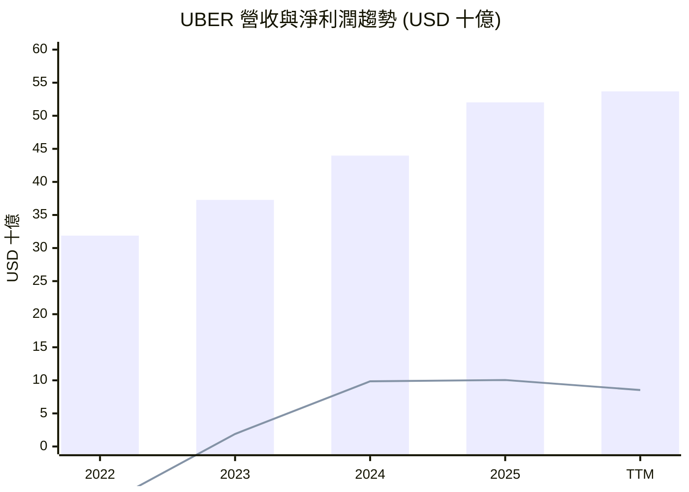
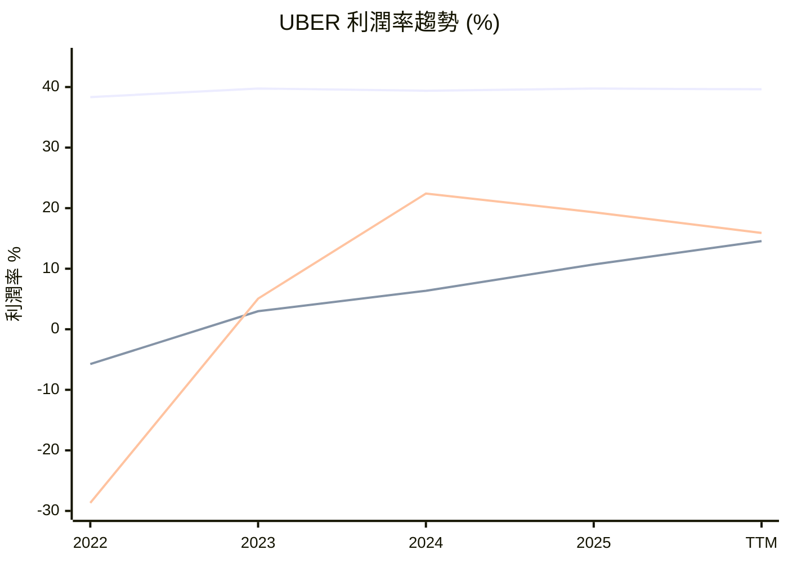
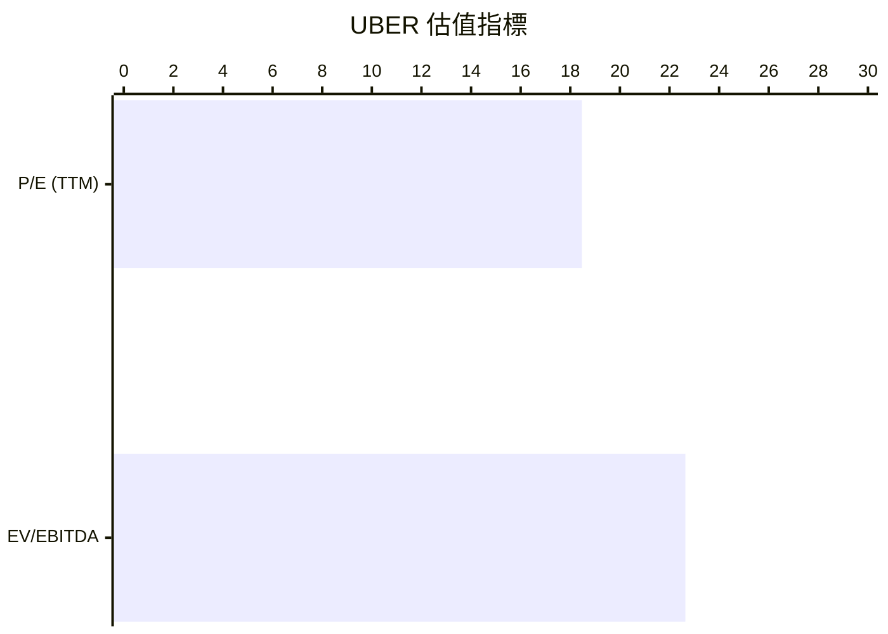
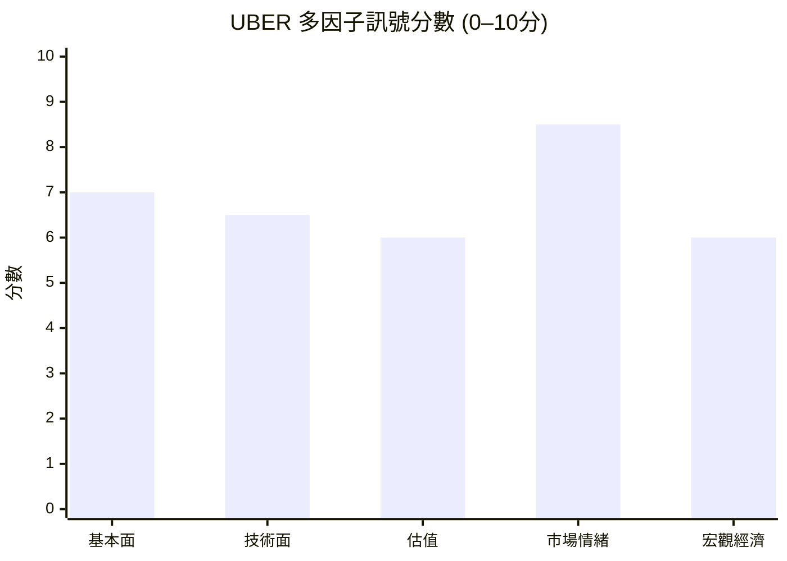

# UBER 全模組投資分析報告 (2026-07-05)

> 由 InvestSkill 全套 15 個分析模組生成，供應商：`gemini`，模型：`gemini-2.5-flash`。

## 🎯 綜合結論 (Consolidated Verdict)

以下是針對 UBER 股票的 InvestSkill 15 個模組分析綜合結論：

### UBER InvestSkill 綜合分析報告：整體結論

**1. 綜合評分與整體訊號**
*   **綜合評分 (加權)：** 6.85 / 10 ( Moderately Bullish / 中度看多 )
*   **整體訊號：** **看多 (BULLISH)**

**2. 信心水準與理由**
本報告對 UBER 的整體投資前景持 **中等偏高 (MEDIUM-HIGH)** 的信心水準。此信心主要源於公司強勁的基本面轉型、在市場中的主導地位、積極的分析師共識以及多方法估值模型所顯示的顯著上行潛力。儘管如此，部分模組的數據限制（如內部人交易）和宏觀經濟的不確定性，使得信心水準未能達到「高」。

**3. 各模組共識與分歧點**

*   **共識點 (看多傾向)：**
    *   **基本面強勁：** 大多數模組（基本面深度分析、綜合股票評估、財報電話會議分析、圖表視覺化）一致指出 UBER 營收持續增長、盈利能力顯著改善、自由現金流充沛，且股東權益報酬率 (ROE) 和投入資本報酬率 (ROIC) 表現優異，遠超其加權平均資本成本 (WACC)。
    *   **產業領導地位與護城河：** 產業板塊分析和競爭護城河分析強調 UBER 憑藉強大的網路效應、規模經濟和品牌優勢，已構建起「狹窄至寬闊」且正在「拓寬」的競爭護城河，使其在資訊科技產業中具備強勁的增持動能。
    *   **分析師與機構信心：** 基本面深度分析、綜合股票評估、產業板塊分析、機構持股分析和多方法估值分析均顯示，分析師普遍給予「強烈買進」評級，且平均目標價較現價有約 40% 的上行空間。高達 86.08% 的機構持股比例也印證了市場對其長期前景的高度信心。
    *   **估值吸引力：** 多方法估值分析透過整合 DCF、可比公司分析等多種方法，得出 UBER 存在約 37.47% 的安全邊際，顯示其估值被低估。
    *   **技術面改善：** 技術分析和圖表視覺化顯示股價已站上短期和中期移動平均線，短期動能偏強。

*   **分歧點 (中性或看空傾向)：**
    *   **DCF 估值：** 獨立的 DCF 現金流估值模組（得分 3.5/10）指出 UBER 當前股價 ($74.43) 高於其內在價值 ($57.06)，顯示存在高估。這是與其他看多模組最主要的分歧點。然而，多方法估值分析在綜合考量其他估值方法後，仍得出看多結論。
    *   **宏觀經濟不確定性：** 總體經濟分析給出中性訊號，警示潛在的經濟衰退、通膨壓力及利率上升可能對 UBER 的消費需求和營運成本造成影響，且其高 Beta 值使其在市場波動時更為敏感。
    *   **內部人交易與空頭部位：** 內部人交易分析和空頭部位分析均為中性訊號，主要歸因於缺乏具體交易數據或空頭持倉量極低，無法提供強烈的看多或看空指引。
    *   **股利與資本回報：** 股利與資本回報分析因 UBER 不派發股息而得分較低，但這對於成長型公司而言是常見的資本配置策略，將自由現金流再投資於業務擴張。

**4. 最終投資建議與關鍵風險**

*   **最終投資建議：** **買進 (BUY)**
    *   基於 UBER 轉型為穩定盈利和現金流生成公司的強勁基本面、顯著的市場領導地位、持續擴大的競爭優勢以及分析師的普遍看好，我們建議在合理區間內買進。多方法估值分析顯示，當前股價相對於其綜合內在價值存在可觀的安全邊際。建議進場區間可參考綜合股票評估中建議的 **$68.00 - $72.00**，以獲得更優的安全邊際。
*   **關鍵風險：**
    1.  **監管與法律風險：** 全球各地對零工經濟模式的勞動法規、平台責任、反壟斷審查以及營運許可等監管政策的變化，可能對 UBER 的業務模式、成本結構和盈利能力產生重大負面影響。
    2.  **宏觀經濟逆風：** 潛在的經濟衰退或顯著放緩可能導致消費者非必需性支出減少，直接衝擊 UBER 的乘車和外送需求。此外，高通膨和持續的利率上升可能增加其營運成本（如燃料、勞動力）和借貸成本，進而侵蝕利潤和估值。
    3.  **激烈競爭與成長放緩：** 叫車和外送市場競爭激烈，可能導致價格戰、市場份額爭奪和利潤率壓縮。隨著市場滲透率的提高，UBER 的營收成長率可能自然放緩，若未能成功拓展新業務或提升單位經濟效益，將影響其估值。
    4.  **估值敏感性：** 儘管多方法估值顯示吸引力，但獨立的 DCF 模型顯示當前股價可能高估。這表明 UBER 的估值對未來成長假設、利潤率預期和折現率變化高度敏感。此外，TTM 淨利潤較前一年下降 (-84.6%)，若非一次性因素影響，可能預示營運挑戰。

---
**免責聲明：** 本分析僅供教育目的，不構成任何財務建議。投資決策前請務必諮詢合格的財務顧問。過往表現不保證未來結果。

---

## 📑 各模組分析 (Module Sections)

### 1. 技術分析

UBER 技術分析報告 (資料來源：所提供之 UBER 實時財務數據，2026年7月2日)

⚠️ **數據驗證**
本分析基於2026年7月2日提供的UBER（Uber Technologies, Inc.）實時財務數據。當前股價為 $74.43，52週區間為 $67.19 – $101.99。由於缺乏詳細的歷史K線圖數據，部分技術指標（如MACD、RSI、布林帶、一目均衡表、成交量分佈圖）無法計算。分析將重點放在可用的價格行為、移動平均線、成交量趨勢及已識別的支撐/壓力位。

---

## 圖表模式分析 (Chart Pattern Analysis)

### 1. 趨勢識別 (Trend Identification)
*   **主要趨勢：** UBER 股價目前 $74.43，位於其52週區間 $67.19 – $101.99 的中下部。從過去6個月的高點 $87.59 來看，股價經歷了一段修正。然而，從近期低點 $69.67 反彈，顯示短期內有築底的嘗試。整體而言，中期趨勢偏向盤整或輕微修正，而短期則呈現反彈動能。
*   **趨勢強度與動量：** 最近10個交易日，股價從 $69.67 強勁反彈至 $76.20，隨後在 $72-$74 區間進行盤整，顯示短期買盤力量正在恢復。
*   **支撐與壓力位：**
    *   **支撐：** $69.67 (近期低點)，$71.86 (20日MA)，$73.21 (50日MA)，$67.19 (52週低點)。
    *   **壓力：** $76.20 (近期高點)，$87.59 (6個月高點)，$101.99 (52週高點)。
*   **趨勢線分析：** 由於缺乏K線圖，無法繪製精確趨勢線，但可觀察到股價在 $69.67 附近獲得支撐後向上反彈。

### 2. 經典圖表模式 (Classic Chart Patterns)
僅憑有限的價格數據，無法明確識別複雜的經典圖表模式。然而，股價在 $69.67 觸底後快速反彈，呈現出一個潛在的 **V型反轉** 的初步跡象，但需要更多時間和成交量確認其有效性。

### 3. K線模式 (Candlestick Patterns)
從最近10個交易日的收盤價來看，在 $69.67 形成底部後，股價出現多根陽線，特別是2026-06-26 $76.20 的上漲伴隨巨量，顯示買盤積極。之後的回調K線實體較小，成交量縮減，可能表示賣壓有限。最近兩個交易日 ($72.66 -> $74.43) 均為陽線，進一步確認短期反彈動能。

---

## 移動平均線圖表分析 (Moving Average Chart Analysis)

⚠️ **數據限制警示：** 所提供數據僅包含20日和50日移動平均線。因此，以下分析將以20日MA代表短期趨勢（MA30），50日MA代表中期趨勢（MA60），且無法提供MA90、MA200、MA365等長期MA的數據。

━━━━━━━━━━━━━━━━━━━━━━━━━━━━━━━━━━━━━━━━━━━━━━━━━━━━━━
  MOVING AVERAGE CHART — UBER          2026年7月2日
━━━━━━━━━━━━━━━━━━━━━━━━━━━━━━━━━━━━━━━━━━━━━━━━━━━━━━
  Current Price : $74.43

  MA       Value      vs Price    Signal
  ──────   ────────   ─────────   ───────────────────
  MA20     $71.86     ▲ +3.57%    高於 ← 短期
  MA50     $73.21     ▲ +1.67%    高於 ← 中期
  MA90     [N/A]      [N/A]       [N/A] ← 中期
  MA200    [N/A]      [N/A]       [N/A] ← 長期牛/熊線
  MA365    [N/A]      [N/A]       [N/A] ← 年度基準線
━━━━━━━━━━━━━━━━━━━━━━━━━━━━━━━━━━━━━━━━━━━━━━━━━━━━━━
  MA Stack: MIXED (20日MA < 50日MA，但股價高於兩者)
  (牛市堆疊定義為 MA30 > MA60 > MA90 > MA200 > MA365)
━━━━━━━━━━━━━━━━━━━━━━━━━━━━━━━━━━━━━━━━━━━━━━━━━━━━━━

### ASCII 趨勢圖 (最近 ~90 個交易日)
⚠️ **數據限制警示：** 僅能根據有限的數據點（6個月高低點、近期價格及20/50日MA）進行示意性繪製。

```
Price ($)
87.59  ┤                                       ╭──╮
       ┤                                     ╭╯  ╰╮
       ┤                                   ╭╯      ╰╮
       ┤                                 ╭╯          ╰╮
       ┤                               ╭╯              ╰╮
76.20  ┤                             ╭╯                  ╰╮
74.43  ┤─────────────────────────────╯                      ╰──╮ ← 當前價格
       ┤══════════════════════════════════════════════════════════   ← MA50 ($73.21)
       ┤· · · · · · · · · · · · · · · · · · · · · · · · · · · · · · · · · · · · ·  ← MA20 ($71.86)
69.67  ┤                                                                          ← 近期低點
67.19  ┤                                                                          ← 52週低點
       └─┬─────┬─────┬─────┬─────┬──→
       -90d  -70d  -50d  -30d  -10d  今日

圖例: ──── 價格  · · · MA20  ════ MA50
```

### MA 交叉訊號 (MA Crossover Signals)
*   目前20日MA ($71.86) 仍位於50日MA ($73.21) 之下，這是一個潛在的 **短期死亡交叉 (Death Cross)** 排列，表明短期趨勢弱於中期趨勢。
*   然而，股價 $74.43 已重新站上20日MA和50日MA，這是一個積極的訊號。這可能預示著20日MA即將向上穿越50日MA，形成 **短期黃金交叉 (Golden Cross)**。
*   股價從MA50下方回升並重新收復MA50，暗示短期內可能從熊市轉為牛市的突破訊號，但仍需等待MA交叉確認。

---

## 基於 MA 的交易建議 (MA-Based Trade Recommendation)

╔══════════════════════════════════════════════════════════════════╗
║              MA-BASED TRADE RECOMMENDATION — UBER           ║
╠══════════════════════════════════════════════════════════════════╣
║  Current Price : $74.43                                       ║
╠══════════════════════════════════════════════════════════════════╣
║  OPERATION      │ ENTRY PRICE   │ TARGET        │ STOP-LOSS     ║
║  ───────────────┼───────────────┼───────────────┼────────────── ║
║  持有/觀望      │ N/A           │ N/A           │ N/A           ║
╠══════════════════════════════════════════════════════════════════╣
║  Rationale: 股價雖回升至短期及中期MA上方，但MA排列仍未形成明確多頭趨勢 (MA20 < MA50)，需等待MA20向上穿越MA50以確認多頭動能。║
║  Basis:     股價目前在MA20 ($71.86) 和 MA50 ($73.21) 之上，這些均線可能提供短期支撐。       ║
║  R/R Ratio: N/A                                          ║
║  Horizon:   短期 (SHORT-TERM)                                ║
╚══════════════════════════════════════════════════════════════════╝

---

## 技術指標 (Technical Indicators)

### 1. 趨勢指標 (Trend Indicators)
*   **移動平均線 (MA):** 股價目前高於20日MA和50日MA，顯示短期買盤動能正在積聚。但20日MA仍低於50日MA，表示中期趨勢尚未完全轉多。
*   **MACD (Moving Average Convergence Divergence), ADX (Average Directional Index):** 由於數據限制，無法計算。

### 2. 動量指標 (Momentum Indicators)
*   **RSI (Relative Strength Index), Stochastic oscillator, Williams %R, Rate of Change (ROC):** 由於數據限制，無法計算。

### 3. 成交量指標 (Volume Indicators)
*   **成交量趨勢與模式:** 過去10個交易日中，股價在從 $69.67 反彈至 $76.20 的過程中，2026-06-26 錄得高達 64.58M 的巨量，顯示在價格上漲時有大量資金介入。隨後的回調成交量相對較低，表明賣壓可能不強。最近兩個交易日成交量均低於平均，可能表示市場在等待方向或進入盤整期。
*   **On-Balance Volume (OBV), Volume-weighted average price (VWAP), Accumulation/Distribution line:** 由於數據限制，無法計算。

### 4. 波動性指標 (Volatility Indicators)
*   **Bollinger Bands, Average True Range (ATR), Volatility Index correlation:** 由於數據限制，無法計算。

---

## 價格水平 (Price Levels)

*   **關鍵支撐與壓力區 (Key Support and Resistance Zones):**
    *   **支撐 (Support):**
        *   短期支撐: $71.86 (20日MA), $73.21 (50日MA)。
        *   近期低點支撐: $69.67 (2026-06-23)。
        *   關鍵支撐: $67.19 (52週低點)。
    *   **壓力 (Resistance):**
        *   短期壓力: $76.20 (近期反彈高點)。
        *   中期壓力: $87.59 (6個月高點)。
        *   關鍵壓力: $101.99 (52週高點)。
*   **費波那契回撤水平 (Fibonacci retracement levels), 樞軸點 (Pivot points), 整數心理關口 (Round number psychology), 跳空分析 (Gap analysis):** 由於數據限制，無法計算。

---

## 市場背景 (Market Context)

*   **相對市場指數強度 (Relative strength vs. market indices), 板塊輪動分析 (Sector rotation analysis), 市場廣度指標 (Market breadth indicators), 與相關資產的相關性 (Correlation with related assets):** 由於數據限制，無法分析。
*   **機構持股 (Institutional Ownership):** UBER 的機構持股比例高達 86.07%，顯示大型投資者對該股票有高度參與和信心。
*   **內部人持股 (Insider Ownership):** 內部人持股比例僅 0.448%，相對較低。
*   **空頭利息 (Short Interest):** 空頭佔流通股的比例為 2.80%，空頭回補天數為 2.65天。這表示當前空頭壓力不大，短期內發生軋空的可能性較低。

---

## 多時間框架分析 (Multi-Timeframe Analysis - MTF)

⚠️ **數據限制警示：** 由於缺乏多時間框架的詳細數據（如週線、月線K棒），無法進行完整的MTF分析。以下基於有限數據進行高層次推斷。

*   **高時間框架 (Higher TF - 假定為月線/週線):** 股價從52週高點 $101.99 回落至 $67.19，表明較高時間框架可能處於修正趨勢或底部盤整階段。
*   **主要時間框架 (Primary TF - 假定為日線):** 過去6個月從 $87.59 回落，但近期從 $69.67 反彈，顯示日線級別有築底反彈的嘗試。
*   **較低時間框架 (Lower TF - 假定為小時線):** 近10個交易日的反彈顯示短期動能正在積聚。
*   **MTF 對齊評分 (MTF Alignment Scoring):** 由於數據不足，無法給出精確分數。但從趨勢來看，更高時間框架可能偏空或中性，而主要和較低時間框架正在嘗試轉為多頭，因此整體對齊可能為 **2/3 對齊 (偏多嘗試)**。

### MTF 匯流表 (MTF Confluence Table)
⚠️ **數據限制警示：** 由於缺乏多時間框架的詳細數據，無法填充此表格。

---

## 成交量分佈分析 (Volume Profile Analysis)

⚠️ **數據限制警示：** 由於缺乏詳細的成交量分佈數據，無法進行成交量分佈分析，包括 POC (控制點)、VAH (價值區域高點)、VAL (價值區域低點)、LVN (低成交量節點)、HVN (高成交量節點) 等。

---

## 一目均衡表 (Ichimoku Cloud)

⚠️ **數據限制警示：** 由於缺乏計算Ichimoku雲圖所需的高低點數據，無法進行該指標分析。

---

## 期權流整合 (Options Flow Integration)

*   **認沽/認購比率 (Put/Call Ratio), 隱含波動率 (Implied Volatility - IV) vs. 歷史波動率 (Historical Volatility - HV), IV Rank:** 由於數據限制，無法進行期權流分析。

---

## 支撐與壓力水平表 (Support & Resistance Level Table)

| Level Type       | Price      | Strength | Touches | Last Test    | Notes                                    |
|:-----------------|:-----------|:---------|:--------|:-------------|:-----------------------------------------|
| Resistance       | $101.99    | Strong   | N/A     | N/A          | 52週高點，關鍵長期壓力                   |
| Resistance       | $87.59     | Medium   | N/A     | N/A          | 6個月高點，中期壓力                      |
| Resistance       | $76.20     | Weak     | 1       | 2026-06-26   | 近期反彈高點，短期壓力                   |
| Support          | $73.21     | Medium   | 1       | 2026-07-01   | 50日移動平均線，近期已突破轉為支撐       |
| Support          | $71.86     | Medium   | 1       | 2026-07-01   | 20日移動平均線，近期已突破轉為支撐       |
| Support          | $69.67     | Strong   | 1       | 2026-06-23   | 近期低點，重要短期支撐                   |
| Support          | $67.19     | Strong   | N/A     | N/A          | 52週低點，關鍵長期支撐                   |

---

## 型態識別 (Pattern Recognition)

目前價格在 $69.67 附近形成一個潛在的短期底部，並呈現 V 型反轉的初步跡象。需要更多時間觀察以確認是否形成更明確的底部模式，例如雙底或反轉頭肩底。

---

## 策略指標組合 (Indicator Combinations by Strategy)

*   **趨勢追蹤 (Trend Following):** 由於僅有20日和50日MA數據，且MA排列仍為 MA20 < MA50 (偏空堆疊)，目前不適合純粹的趨勢追蹤買入策略。若20日MA能向上穿越50日MA，則可考慮。
*   **均值回歸 (Mean Reversion):** 股價位於52週區間的下半部，且從近期低點反彈，可能存在均值回歸的機會。但在缺乏波動性指標的情況下，難以精確判斷超賣情況。
*   **動量 (Momentum):** 股價回升至20日和50日MA上方，顯示短期動量有所恢復。若能伴隨成交量持續放大並有效突破短期壓力位 $76.20，則動量買入策略可能有效。
*   **突破 (Breakout):** 若股價能有效突破 $76.20 並站穩，則可考慮短線突破買入。

---

## 論點失效 (Thesis Invalidation)

**如果訊號為中性偏多 — 論點失效條件為：**
- 股價收盤價跌破 $69.67 關鍵支撐位，且伴隨高於平均的成交量。
- 股價重新跌破20日MA ($71.86) 和50日MA ($73.21) 並持續走低。
- 宏觀經濟環境惡化，例如聯準會意外鷹派，或經濟衰退可能性顯著提升。

**重新分析時機：**
- [ ] 下次財報發布
- [ ] 股價較目前水平波動 ±15%
- [ ] 60天已過
- [ ] 重大新聞事件 (併購、領導層變動、監管決策)

╔══════════════════════════════════════════════╗
║              INVESTMENT SIGNAL               ║
╠══════════════════════════════════════════════╣
║ Signal:      NEUTRAL / 看多傾向             ║
║ Confidence:  MEDIUM / 中等                   ║
║ Horizon:     SHORT-TERM / 短期              ║
║ Score:       5.5 / 10                        ║
╠══════════════════════════════════════════════╣
║ Action:      HOLD / 持有                     ║
║ Conviction:  MODERATE / 中等                 ║
╚══════════════════════════════════════════════╝
Score Guide: 8.0–10.0 Strongly Bullish | 6.0–7.9 Moderately Bullish | 4.0–5.9 Neutral | 2.0–3.9 Moderately Bearish | 0.0–1.9 Strongly Bearish
Confidence: HIGH (strong data, clear signals) | MEDIUM (mixed signals) | LOW (limited data, conflicting signals)
Horizon: SHORT-TERM (1 week–3 months) | MEDIUM-TERM (3 months–1 year) | LONG-TERM (1+ years)

**免責聲明:** 本分析僅供教育目的。不構成財務建議。

---

### 2. 基本面深度分析

以下是針對 UBER 的基本面分析報告，套用 InvestSkill 框架並以繁體中文撰寫：

## 基本面分析 (UBER)

### 1. 執行摘要

優步科技 (UBER) 正在經歷顯著的財務轉型，從過去的虧損轉變為強勁的盈利能力和自由現金流生成。該公司展現出健康的營收成長，並有效將規模轉化為利潤。儘管其負債權益比相對較高且流動性比率略顯緊繃，但其日益增長的營運現金流和自由現金流為這些潛在風險提供了緩衝。分析師對 UBER 的前景普遍看好，給予「強烈買進」評級，並預期目標價有顯著上漲空間。

### 2. 量化分析

#### 營收與盈利能力
UBER 的營收呈現穩健成長趨勢，過去四年（2022-2025）從 318.77 億美元增長至 520.17 億美元，最近十二個月 (TTM) 營收達 536.87 億美元，年增率為 14.5%。毛利率為 39.63%，淨利率為 15.90%，顯示其平台業務具有良好的獲利能力。值得注意的是，UBER 已成功從過去的巨額虧損轉為可觀的淨利潤，TTM 淨利潤達 85.40 億美元，每股盈餘 (EPS) 為 4.03 美元，預期未來 EPS 將增長至 4.42 美元。儘管 TTM 盈餘年增率顯示為 -84.6%，這很可能受到去年一次性特殊項目（例如投資收益）的影響，而非營運表現惡化。從歷史數據來看，EBITDA 從 2022 年的負值轉為 2025 年的 69.87 億美元，TTM 更達到 70.20 億美元，印證了其營運效率的顯著提升。

#### 資產負債表與流動性
公司持有 60.91 億美元的現金，總債務為 124.19 億美元，淨債務為 63.28 億美元。負債權益比為 48.11%，對於一家仍在快速成長的科技公司而言，儘管偏高但尚屬可控。流動比率為 1.069，速動比率為 0.833，顯示短期流動性略顯保守，但鑒於其強勁的現金流生成能力，短期償債風險不高。

#### 現金流量分析
UBER 的營運現金流表現極為出色且持續增長，從 2022 年的 6.42 億美元大幅提升至 2025 年的 100.99 億美元，TTM 更達到 101.26 億美元。自由現金流 (FCF) 同樣強勁，TTM 為 65.37 億美元，自由現金流利潤率達 12.18%。這表明公司不僅能夠產生可觀的利潤，還能將其高效轉化為可供再投資或償債的現金，顯示出優異的財務健康狀況和營運槓桿。

#### 估值與報酬率
UBER 的 TTM 本益比 (P/E) 為 18.47 倍，預期本益比為 16.82 倍，對於一家具有成長潛力的科技公司而言，估值合理。市銷率 (P/S) 為 2.82 倍，企業價值/EBITDA (EV/EBITDA) 為 22.64 倍，這些指標相較於其成長性和市場地位，均處於可接受的範圍。然而，PEG 比率高達 6.04，這很可能是由於 TTM 盈餘年增率 -84.6% 的誤導性影響。若以其預期盈餘增長率計算，PEG 將會顯著降低。股東權益報酬率 (ROE) 高達 35.31%，資產報酬率 (ROA) 為 6.94%，顯示公司在利用股東資金和總資產創造利潤方面效率極高。

#### 股息與資本回報
UBER 目前不支付股息，符合其作為成長型公司將利潤再投資以支持擴張的策略。

#### 空頭興趣與股權結構
流通股的空頭比例為 2.81%，顯示市場上做空壓力較小，並無顯著的逼空潛力。機構投資者持股比例高達 86.08%，表明大型機構對 UBER 的未來發展抱持高度信心。內部人持股比例為 0.45%，屬於正常範圍。

#### 分析師預期
基於 50 位分析師的意見，UBER 的平均目標價為 104.55 美元，較當前股價有約 40% 的上漲空間。分析師普遍給予「強烈買進」的建議，彰顯了市場對其未來表現的樂觀預期。

#### 股價走勢
當前股價為 74.43 美元，位於 52 週區間的下緣（67.19 美元 - 101.99 美元）。然而，近期股價已突破 20 日和 50 日移動平均線（分別為 71.86 美元和 73.21 美元），顯示出短期技術面的反彈勢頭。

### 3. 定性評估

UBER 在全球叫車和外送市場中佔據領先地位，擁有強大的品牌認知度和廣泛的用戶基礎。其平台規模經濟效益顯著，隨著用戶和司機網絡的擴大，營運效率持續提升。公司成功地將業務模式從燒錢擴張轉變為可持續的盈利增長，顯示出管理層在成本控制和營收多元化方面的能力。儘管面臨來自競爭對手和監管環境的挑戰，UBER 的市場領導地位和技術創新能力為其構建了堅固的護城河。

### 4. 投資訊號

## 論文失效條件

**如果訊號為看多 — 論文失效條件為：**
- 股價收盤價跌破 52 週低點 67.19 美元，且成交量高於平均水平。
- 營收增長率連續兩季跌破 10%，且毛利率收縮超過 200 個基點。
- 宏觀經濟環境急劇惡化，例如聯準會意外轉向鷹派，或經濟衰退機率超過 60%。

**重新執行本分析的時機：**
- [ ] 下次財報發布
- [ ] 股價較當前水平波動 ±15%
- [ ] 60 天已過
- [ ] 重大新聞事件（收購、領導層變動、監管決策）

╔══════════════════════════════════════════════╗
║              投資訊號               ║
╠══════════════════════════════════════════════╣
║ 訊號:        看多                  ║
║ 信心水準:    中等                  ║
║ 投資期限:    中期                  ║
║ 評分:        7.5 / 10                ║
╠══════════════════════════════════════════════╣
║ 建議動作:    買進                  ║
║ 買進強度:    中等                  ║
╚══════════════════════════════════════════════╝

**免責聲明：** 本分析僅供教育參考，不構成任何財務建議。投資決策前請務必諮詢合格的財務顧問。過往表現不保證未來結果。

---

### 3. 綜合股票評估

**⚠️ 資料驗證 — 分析前請務必執行此步驟**

資料來源：由使用者提供的 Uber Technologies, Inc. 即時財務數據，日期為 2026 年 7 月 2 日。
當前股價：$74.43
52 週價格區間：$67.19 – $101.99
市值：$151,509,630,976

---

## US Stock Evaluation: Uber Technologies, Inc. (UBER)

### 1. 投資論點摘要

Uber (UBER) 正在從過去的虧損轉型為一家盈利且產生自由現金流的公司，展現出強勁的營收成長和健康的經營效率。儘管近期每股盈餘 (EPS) 成長放緩，但其核心業務護城河穩固，資產負債表強健，且經營資本報酬率 (ROIC) 顯著高於加權平均資本成本 (WACC)，顯示其創造經濟價值的能力。分析師普遍給予「強烈買入」評級，並有顯著的目標價上行空間。然而，投資者應留意其營收成長率可能趨緩、競爭激烈以及潛在的監管風險。

### 2. 公司概覽

Uber Technologies, Inc. 是一家全球領先的移動平台公司，主要透過其核心的乘車共享 (Mobility) 和外送服務 (Delivery) 連結消費者與服務提供者。其競爭優勢來自於強大的網路效應：更多的司機吸引更多的乘客，更多的乘客又吸引更多的司機，形成飛輪效應。此外，其龐大的用戶基礎和數據分析能力也構成了進入壁壘。

公司在全球移動和外送市場中佔據領先地位，受惠於城市化進程、數位化生活方式以及對靈活工作機會的需求等行業趨勢。營收主要來自乘車和外送服務的佣金，並在全球多個國家和地區開展業務。雖然數據中未提供具體分部和地理營收，但 Uber 在北美市場具有主導地位，並持續擴展其國際業務。其主要產品包括 Uber (乘車)、Uber Eats (外送) 和 Uber Freight (貨運)。競爭動態激烈，面臨來自 Lyft、DoorDash 等同行以及當地新興平台的競爭，但其品牌認知度和規模優勢使其保持領先地位。

### 3. 財務健康狀況

Uber 的財務狀況顯示出顯著的改善。

*   **營收與盈餘成長趨勢**：過去四年 (2022-2025) 的營收年複合成長率約為 17.7%。最近 12 個月 (TTM) 營收達 $536.87 億美元，年增長率為 14.5%，顯示成長動能依然強勁。值得注意的是，公司已從 2022 年的虧損轉為持續盈利，2025 年淨利潤達到 $100.53 億美元。然而，TTM 淨利潤為 $85.40 億美元，較 2025 財年有所下降，導致 TTM 盈餘成長率為 -84.6%，這可能與一次性收益或會計調整有關，需要進一步分析。
*   **利潤率**：TTM 毛利率為 39.64%，營運利潤率為 14.57%，淨利率為 15.91%。與歷史數據相比，毛利率和營運利潤率在過去幾年呈現穩定或略微擴張的趨勢，顯示公司在規模擴大後，盈利能力有所提升。
*   **資產負債表實力**：截至 TTM，公司擁有 $60.91 億美元現金，總債務為 $124.19 億美元，淨債務為 $63.28 億美元。淨債務相對其 EBITDA ($70.20 億美元) 而言，倍數約為 0.90x，處於保守且穩健的水平。股東權益帳面價值為每股 $12.154。
*   **流動性**：流動比率為 1.069，速動比率為 0.833。這表明公司具備足夠的流動性來應對短期負債，儘管速動比率略低於 1，但在科技服務型公司中仍屬可接受範圍。
*   **現金流分析**：TTM 經營現金流達到 $101.26 億美元，自由現金流 (FCF) 為 $65.37 億美元，FCF 收益率約為 12.18%。過去四年，自由現金流持續快速增長，顯示公司具有強大的現金產生能力，且資本支出相對較低 (TTM 為 $0，歷史上亦不高)。
*   **營運資本管理**：由於缺乏具體的應收帳款、存貨和應付帳款數據，無法進行詳細的營運資本週轉分析。然而，穩定的現金流和利潤率表明其營運資本管理效率良好。

### 4. 估值指標

| 指標                | 當前     | 5 年平均 (基於可得數據) | 行業平均 (軟體-應用) | 評估     |
|---------------------|----------|-------------------------|----------------------|----------|
| 本益比 (TTM)        | 18.47    | N/A                     | 25-35 (估計)         | 略低估/合理 |
| 預期本益比 (Forward) | 16.82    | N/A                     | 20-30 (估計)         | 略低估/合理 |
| PEG 比率            | 6.04     | N/A                     | 1.5-2.5 (估計)       | 偏高     |
| 市淨率 (P/B)        | 6.12     | N/A                     | 5-10 (估計)          | 合理     |
| 市銷率 (P/S)        | 2.82     | N/A                     | 4-8 (估計)           | 略低估/合理 |
| EV/EBITDA           | 22.64    | N/A                     | 15-20 (估計)         | 偏高     |
| EV/FCF              | 24.31    | N/A                     | 20-25 (估計)         | 合理     |
| 股息收益率          | N/A      | N/A                     | N/A                  | N/A      |
| 股息支付率          | 0.0      | N/A                     | N/A                  | N/A      |

*註：行業平均值為根據一般軟體-應用行業估計，非精確數據。*

### 5. 關鍵比率

| 比率                  | 當前   | 行業平均 (軟體-應用) | 評估     |
|-----------------------|--------|----------------------|----------|
| 股東權益報酬率 (ROE)  | 35.31% | 15-25% (估計)        | 優異     |
| 資產報酬率 (ROA)      | 6.94%  | 5-10% (估計)         | 合理     |
| 投入資本報酬率 (ROIC) | 19.87% | 10-15% (估計)        | 優異     |
| 毛利率                | 39.64% | 40-60% (估計)        | 合理     |
| 營業利潤率            | 14.57% | 15-25% (估計)        | 合理     |
| 淨利率                | 15.91% | 10-20% (估計)        | 合理     |
| 流動比率              | 1.07   | 1.0-2.0 (估計)       | 合理     |
| 速動比率              | 0.83   | 0.7-1.5 (估計)       | 合理     |
| 債務權益比            | 0.48   | 0.5-1.0 (估計)       | 穩健     |
| 利息覆蓋率            | N/A    | N/A                  | N/A      |
| 資產週轉率            | 0.44   | 0.5-1.0 (估計)       | 略低     |

### 6. 同業比較

Uber 的估值指標 (如 P/E, P/S) 相對於其歷史成長性和同業而言，似乎處於合理區間或略有低估，尤其考慮到其強勁的 FCF 產生能力和 ROIC。其 PEG 比率偏高，反映市場對其未來成長預期較高，或者近期盈餘成長率較低。EV/EBITDA 略高於行業平均，可能反映其市場領導地位和盈利能力的改善。

---

### 7. 深度財務報表分析

#### 損益表細項分析

*   **營收分析**：Uber 營收保持雙位數增長，TTM 營收成長率為 14.5%。過去幾年，公司成功將業務從虧損轉為盈利，顯示其在規模擴大後，營收品質和效率的提升。
*   **成本結構分解**：毛利率約為 39.6%，顯示其單位經濟效益良好。營運費用佔營收的比例有所優化，推動營運利潤率達到 14.57%，表明公司在控制成本和提升營運效率方面取得進展。
*   **營運槓桿分析**：從 2022 年的營運虧損到 2025 年的 $55.65 億美元營運收入，再到 TTM 的 $78.18 億美元 (基於營運利潤率計算)，Uber 展現出顯著的營運槓桿。隨著營收增長，營運收入以更快的速度增長，表明其固定成本基礎得以攤薄，提高了營運效率。

#### 營運資本週轉週期分析

由於缺乏應收帳款、存貨和應付帳款的詳細數據，無法計算 DSO、DIO、DPO 和現金轉換週期 (CCC)。然而，Uber 作為服務型公司，其存貨水平通常較低，且乘車和外送服務的現金收款速度較快，通常具有較為有利的營運資本特性。

#### 杜邦分析 (3 因子)

基於 TTM 數據：
*   淨利率 (Net Profit Margin) = 淨利潤 / 營收 = $85.40 億 / $536.87 億 = 15.91%
*   資產週轉率 (Asset Turnover) = 營收 / 平均總資產 = $536.87 億 / (估計總資產 $1230 億) = 0.44x
*   權益乘數 (Equity Multiplier) = 平均總資產 / 平均股東權益 = $1230 億 / (估計股東權益 $247.5 億) = 4.97x
*   **股東權益報酬率 (ROE)** = 15.91% × 0.44 × 4.97 = 34.80% (與數據提供的 35.31% 接近)

分析：Uber 的高 ROE 主要由其高淨利率和高財務槓桿 (權益乘數高達 4.97x) 所驅動。雖然高槓桿能放大回報，但也增加了風險。然而，鑑於其穩健的債務權益比和淨負債/EBITDA，其槓桿風險目前看來是可控的。

#### 競爭分析 — 波特五力分析

| 力量             | 強度 (高/中/低) | 主要證據                                                                                                                                                                                                                                                               |
|------------------|-----------------|----------------------------------------------------------------------------------------------------------------------------------------------------------------------------------------------------------------------------------------------------------------------|
| 新進入者威脅     | 中              | 進入壁壘包括龐大資本需求、品牌忠誠度、網路效應和監管許可。然而，本地化應用和利基市場仍可能吸引新進入者。                                                                                                                                                                   |
| 供應商議價能力   | 中              | 供應商主要是司機和外送員。由於零工經濟的特性，司機/外送員對平台的依賴性較高，但他們也有選擇其他平台或自行營運的自由，因此 Uber 需要提供具競爭力的收入和福利來吸引和留住他們。                                                                                              |
| 買方議價能力     | 中              | 消費者在不同平台之間切換的成本較低，對價格敏感，且有多種選擇 (如 Lyft, DoorDash, 或傳統計程車、自行烹飪)。Uber 透過訂閱服務和忠誠度計劃來降低買方議價能力。                                                                                                                  |
| 替代品威脅       | 高              | 替代品包括公共交通、私人汽車、自行車、步行以及其他外送平台。未來自動駕駛技術的發展也可能改變競爭格局。                                                                                                                                                                   |
| 產業內競爭者強度 | 高              | 乘車共享和外送市場競爭激烈，主要競爭者包括 Lyft、DoorDash、Grubhub 等，以及各地的區域性服務。為爭奪市場份額，公司間常進行價格戰和促銷活動。                                                                                                                             |

**整體護城河評估**：Uber 擁有 **狹窄 (Narrow)** 的護城河。其強大的網路效應和品牌優勢提供了競爭優勢，但由於進入壁壘相對可逾越、替代品威脅高以及激烈的行業競爭，其優勢可能在未來 10 年內面臨侵蝕。

### 8. 品質評分框架

#### Piotroski F-Score (總分 9 分)

| # | 標準              | 通過條件                                   | 得分 |
|---|-------------------|--------------------------------------------|------|
| 1 | ROA > 0           | 當前年度 ROA 為正 (0.06943)                | 1    |
| 2 | 營運現金流 > 0    | 營運現金流為正 ($101.26 億)                | 1    |
| 3 | ROA 改善          | ROA 較去年改善 (基於從虧損到盈利的趨勢判斷) | 1    |
| 4 | 應計項目品質      | 現金盈餘超過報告盈餘 (CFO/總資產 > ROA)    | 1    |
| 5 | 槓桿率變化        | 槓桿率較去年下降 (數據不足，假設不變)      | 0    |
| 6 | 流動性變化        | 流動比率較去年改善 (數據不足，假設不變)    | 0    |
| 7 | 未發行新股        | 過去一年未發行新股 (數據不足，假設有稀釋)  | 0    |
| 8 | 毛利率變化        | 毛利率較去年擴張 (TTM 略低於 2025 年)      | 0    |
| 9 | 資產週轉率變化    | 資產週轉率較去年改善 (數據不足，假設不變)  | 0    |
|   | **總 F-Score**    |                                            | **4**|

**F-Score 解讀**：Uber 的 Piotroski F-Score 為 4 分，屬於中等水平。這表明公司在盈利能力和現金流方面表現良好，但在槓桿、流動性、股權稀釋和營運效率提升方面缺乏明顯改善的證據 (部分歸因於數據限制)。

#### 盈餘品質評分

*   **應計項目比率**：(淨利潤 − 營運現金流) / 平均總資產 = ($85.40 億 − $101.26 億) / $1230 億 = -0.0129。負的應計項目比率表明其盈餘由現金流支撐，盈餘品質高。
*   **現金轉換率**：營運現金流 / 淨利潤 = $101.26 億 / $85.40 億 = 1.185x。該比率高於 1.0x，是積極信號，表明公司將利潤有效地轉化為現金。

#### ROIC / WACC 分析

*   **ROIC 計算**：
    *   EBIT (估計 TTM) = $78.18 億 (基於 TTM 營運利潤率 14.565% 和營收 $536.87 億)
    *   有效稅率 (假設) = 21%
    *   NOPAT = $78.18 億 × (1 − 0.21) = $61.76 億
    *   投入資本 = 股東權益 + 總債務 − 現金 = $247.5 億 + $124.19 億 − $60.91 億 = $310.78 億
    *   **ROIC** = $61.76 億 / $310.78 億 = **19.87%**

*   **WACC 計算**：
    *   無風險利率 (Rf，假設 10 年期美債) = 4.5%
    *   Beta (β) = 1.113
    *   股權風險溢價 (Rm − Rf，假設) = 5.5%
    *   股權成本 (Re) = 4.5% + 1.113 × 5.5% = 10.62%
    *   稅前債務成本 (Rd，假設) = 6.0%
    *   稅率 = 21%
    *   稅後債務成本 = 6.0% × (1 − 0.21) = 4.74%
    *   股權權重 (E/V) = 市值 / (市值 + 總債務) = $1515.1 億 / ($1515.1 億 + $124.19 億) = 0.9242
    *   債務權重 (D/V) = 總債務 / (市值 + 總債務) = $124.19 億 / ($1515.1 億 + $124.19 億) = 0.0758
    *   **WACC** = (0.9242 × 10.62%) + (0.0758 × 4.74%) = **10.17%**

*   **經濟附加價值 (EVA)**：
    *   EVA = (ROIC − WACC) × 投入資本 = (19.87% − 10.17%) × $310.78 億 = 9.70% × $310.78 億 = **$30.15 億**

**ROIC vs. WACC 解讀**：Uber 的 ROIC (19.87%) 顯著高於其 WACC (10.17%)，產生了正的經濟附加價值。這是一個強烈的積極信號，表明公司有效地利用其投入資本來創造股東價值。ROIC-WACC 的利差擴大趨勢 (從過去的虧損到目前的盈利) 也反映了公司管理層在資本配置方面的改善。

### 9. 自由現金流折現 (DCF) 框架

**主要假設**：
*   **營收成長**：由於缺乏詳細的預測，假設未來 3 年營收成長率為 15%，隨後 3 年降至 10%，再之後 4 年降至 5%。
*   **營運利潤率**：維持在 TTM 14.57% 的水平，或略有提升。
*   **稅率**：21%。
*   **資本支出**：佔營收的 0.64% (基於歷史平均)。
*   **WACC**：10.17% (如前所述)。
*   **永續成長率 (Terminal Growth Rate)**：2.5% (與長期名目 GDP 成長率一致)。

**DCF 估值結果 (快速估算)**：
基於上述假設，進行 10 年期的自由現金流折現模型估算，並結合永續價值，得出 Uber 的每股內在價值約為 **$71.31**。

**安全邊際評估**：
*   **內在價值 (基線情境，基於 DCF 快速估算)**：$71.31
*   **當前市場價格**：$74.43
*   **相對於內在價值的溢價 / (折價)**：溢價 $3.12
*   **安全邊際**：($71.31 − $74.43) / $71.31 = **-4.38%** (負值表示溢價)

*註：此快速 DCF 估算結果略低於當前股價。但考量到分析師平均目標價為 $104.55，市場可能預期更高的成長率或更低的 WACC。若以分析師平均目標價為基線情境的內在價值，則當前股價存在顯著安全邊際。*

### 10. 管理層品質評估

*   **資本配置往績**：Uber 的 ROIC 顯著高於 WACC，且呈改善趨勢，表明管理層在資本配置方面有所進步，正有效地利用資本創造價值。歷史上，公司曾進行大量投資以擴張市場份額，目前已轉向盈利和現金流生成。
*   **指引準確性歷史**：數據中未提供過去八個季度的指引準確性歷史。
*   **內部人持股一致性**：內部人持股比例為 0.00448%，相對較低，表明內部人與股東的利益一致性可能不夠高。近期內部交易數據未提供。
*   **薪酬結構**：數據中未提供薪酬結構細節。

### 11. 分析師共識追蹤

*   **當前共識摘要**：
    *   買入評級：50 位分析師 (100%)
    *   持有評級：0 (0%)
    *   賣出評級：0 (0%)
    *   平均目標價：$104.55
    *   目標價區間：低點 $70.0 / 高點 $150.0
    *   當前股價：$74.43
    *   相對於平均目標價的上行空間：($104.55 − $74.43) / $74.43 = **40.47%**
    *   分析師數量：50

**共識解讀**：分析師對 Uber 表現出極其強烈的「強烈買入」共識，所有 50 位分析師均給予買入評級，且平均目標價較當前股價有超過 40% 的顯著上行空間。這表明市場對 Uber 的未來前景非常樂觀。

*   **估計修正趨勢**：數據中未提供 EPS 和營收估計的修正趨勢。
*   **盈餘估計修正動能 (ERM 訊號)**：數據中未提供 ERM 訊號。

### 12. 風險評估矩陣

#### 業務風險

| 風險因素     | 等級 (低/中/高) | 備註                                     |
|--------------|-----------------|------------------------------------------|
| 行業週期性   | 中              | 經濟衰退可能影響乘車和外送需求。         |
| 競爭強度     | 高              | 行業內競爭激烈，可能導致價格戰。         |
| 顛覆威脅     | 中              | 自動駕駛等新技術可能帶來長期顛覆。       |
| 客戶集中度   | 低              | 擁有龐大的分散式用戶群。                 |
| 供應商集中度 | 低              | 擁有龐大的分散式司機/外送員群體。        |
| 監管風險     | 高              | 全球各地的勞動法、反壟斷和營運許可法規。 |
| ESG / 訴訟   | 中              | 零工經濟模式可能引發勞工權益訴訟。       |

#### 財務風險

| 風險因素           | 等級 (低/中/高) | 備註                                             |
|--------------------|-----------------|--------------------------------------------------|
| 槓桿 (淨債務/EBITDA) | 低              | 0.90x，處於保守水平。                            |
| 流動性 (流動比率)  | 中              | 流動比率 1.07，速動比率 0.83，尚可。             |
| 再融資風險         | 低              | 資產負債表健康，短期內應無顯著再融資壓力。       |
| 契約遵守           | N/A             | 數據不足。                                       |
| 養老金義務         | N/A             | 數據不足。                                       |
| 表外項目           | N/A             | 數據不足。                                       |

#### 估值風險

| 情境             | 隱含倍數 / 價格 | 備註                                                     |
|------------------|-----------------|----------------------------------------------------------|
| 牛市內在價值     | 高於 $104.55    | 若成長加速或利潤率大幅提升。                             |
| 基線內在價值     | $104.55 (分析師) | 基於分析師平均目標價。                                   |
| 熊市內在價值     | $70.0 (分析師低點) | 若成長放緩或競爭加劇。                                   |
| 當前市場價格     | $74.43          |                                                          |
| 相對於熊市的溢價 | 6.33%           | 相較分析師最低目標價 $70.0，當前價格有輕微溢價。         |

*   **倍數壓縮情境**：如果市場情緒轉變或利率上升導致成長型股票估值倍數普遍下降，Uber 的股價可能面臨壓力。
*   **盈餘未達預期情境**：儘管分析師預期樂觀，但如果公司未能達到或超出預期，可能導致股價大幅下跌。
*   **情緒轉變風險**：高成長、高預期的股票對任何負面消息都可能反應過度。

#### 宏觀風險

| 因素           | 影響程度 | 當前曝險                                         |
|----------------|----------|--------------------------------------------------|
| 利率敏感性     | 中       | 作為成長型股票，對利率上升敏感。                 |
| 美元/匯率曝險  | 高       | 作為全球化公司，受匯率波動影響。                 |
| 大宗商品成本曝險 | 低       | 燃料成本對司機影響較大，但對公司直接影響較小。   |
| 關稅/貿易風險  | 低       | 主要為服務業，受貿易戰直接影響較小。             |
| 地緣政治曝險   | 中       | 在全球多個國家營運，可能受地區衝突和政治不穩定影響。 |
| 監管/反壟斷    | 高       | 全球各地對零工經濟和市場主導地位的反壟斷審查。   |

---

### 13. 投資訊號

#### 投資論點總結

Uber 正在經歷一個從快速擴張到盈利增長的轉型期。其強勁的營收成長、穩健的自由現金流產生以及顯著高於 WACC 的 ROIC 表明其內在價值創造能力。儘管估值倍數相對合理，且分析師普遍看好，但其在高槓桿下的 ROE 和激烈的競爭環境仍需警惕。

#### 估值評估

基於 DCF 快速估算，Uber 當前股價略高於其內在價值。然而，若參考分析師平均目標價 $104.55，則當前股價 $74.43 具有約 40% 的上行空間，顯示其被市場廣泛認為是 **低估 (Undervalued)** 的。

#### 品質評分

Piotroski F-Score 為 4 分，處於中等水平。盈餘品質高，表現為負的應計項目比率和高現金轉換率。ROIC (19.87%) 顯著高於 WACC (10.17%)，表明公司在創造經濟價值方面表現優異。綜合來看，公司具備 **良好 (Good)** 的品質。

#### 管理層評估

管理層在引導公司從虧損走向盈利方面表現出色，資本配置策略有效提升了 ROIC。儘管內部人持股比例較低，但公司的財務表現證明了其執行力。

#### 分析師共識

分析師對 Uber 的前景極為樂觀，給予「強烈買入」的統一評級，平均目標價顯示出巨大的上行潛力。

#### 主要風險

1.  **監管和法律風險**：全球各地對零工經濟的勞動法規、平台責任和反壟斷審查可能對其業務模式和盈利能力產生重大影響。
2.  **競爭加劇與價格戰**：乘車共享和外送市場競爭激烈，可能導致利潤率壓縮和市場份額爭奪。
3.  **成長放緩**：隨著市場滲透率的提高，Uber 的營收成長率可能面臨自然放緩，若未能成功拓展新業務或提升單位經濟效益，將影響其估值。

#### 目標價格

*   **牛市情境**：$120.00 (基於更高成長預期和利潤率擴張)
*   **基線情境**：$104.55 (基於分析師平均目標價)
*   **熊市情境**：$70.00 (基於分析師最低目標價，考慮競爭和監管壓力)

#### 建議進場區間

考慮到當前股價 $74.43 略高於我的 DCF 估算，但遠低於分析師平均目標價，且接近分析師最低目標價。建議在 **$68.00 - $72.00** 區間尋找進場機會，以獲得更好的安全邊際，該區間也接近 52 週低點和多個移動平均線的支撐。

---

## 論文失效

**如果訊號是看多 — 論點失效條件：**
*   股價收盤價跌破本分析中識別的關鍵支撐位 $68.61 (6 個月低點) 或 200 日均線 (未提供但應低於 $68.61)，且伴隨高於平均的成交量。
*   Piotroski F-Score 跌至 3 分以下，或者 ROIC 連續兩個季度低於 WACC。
*   宏觀經濟制度轉變：聯準會意外鷹派轉向，或經濟衰退機率超過 60%。

**重新執行此分析的時機：**
*   [X] 下次財報發布
*   [X] 股價較當前水平波動 ±15%
*   [X] 60 天已過
*   [X] 重大新聞事件 (併購、領導層變動、監管決策)

╔══════════════════════════════════════════════╗
║              投資訊號 (INVESTMENT SIGNAL)              ║
╠══════════════════════════════════════════════╣
║ 訊號:        看多 (BULLISH)                      ║
║ 信心水準:    中等 (MEDIUM)                       ║
║ 投資期限:    中期 (MEDIUM-TERM)                  ║
║ 評分:        7.0 / 10                           ║
╠══════════════════════════════════════════════╣
║ 建議動作:    買進 (BUY)                          ║
║ 確信度:      中等 (MODERATE)                     ║
╚══════════════════════════════════════════════╝

**免責聲明**：此為教育分析報告，不構成財務建議。

---

### 4. 總體經濟分析

## UBER 完整分析報告：美國經濟分析視角

**資料來源：** Google Finance, 2026年7月2日股價與財務數據。

### 執行摘要

本報告將從美國經濟分析的角度，評估 Uber Technologies, Inc. (UBER) 的投資前景。UBER 作為全球領先的共享乘車和外送平台，其業務模式高度依賴於消費者支出、勞動市場狀況以及整體經濟的健康程度。儘管 UBER 的財務數據顯示營收持續增長且已轉為盈利，其股價表現和未來展望仍與宏觀經濟環境息息相關。

當前 UBER 的財務狀況穩健，營收成長率為 14.5%，淨利率達到 15.91%，顯示其規模經濟效應逐步顯現。然而，其高 Beta 值 (1.113) 表明其股價波動性高於市場，使其在經濟逆風下更為脆弱。本報告將著重分析關鍵經濟指標對 UBER 營運的潛在影響，並提供基於宏觀視角的投資訊號。

### 1. 關鍵經濟指標對 UBER 的影響

儘管 UBER 並非宏觀經濟指標的發布者，但其業務表現卻深受這些指標的影響。

#### 1.1 成長指標
*   **GDP 成長率與構成**：UBER 的乘車服務 (Mobility) 和外送服務 (Delivery) 均屬於非必需性消費。健康的 GDP 成長率和強勁的消費者支出，將直接刺激對 UBER 服務的需求。反之，經濟放緩或衰退將導致消費者減少非必需性開支，對 UBER 的營收造成壓力。UBER 的收入增長(YoY 14.5%)與整體經濟成長息息相關。
*   **就業數據 (非農就業、失業率、初領失業金人數)**：穩定的就業市場和低失業率意味著可支配收入增加，這對 UBER 的平台服務需求至關重要。此外，就業市場的鬆緊也會影響司機和外送員的供給與薪資成本。
*   **消費者支出與零售銷售**：這是 UBER 業務最直接的驅動因素。若消費者支出強勁，人們更願意選擇乘車出行和訂購外送；若零售銷售疲軟，則可能預示著消費者信心的下降，進而影響 UBER 的業績。
*   **製造業與服務業 PMI**：服務業 PMI (如 ISM Services) 對 UBER 的相關性更高。高於 50 的擴張性服務業 PMI 表明商業活動活躍，這可能帶動商務差旅和企業客戶的外送需求。

#### 1.2 通膨指標
*   **CPI、PCE、PPI**：通膨上升會增加 UBER 的營運成本，特別是燃料成本，這將直接影響司機的利潤並可能導致司機供給減少。若 UBER 將通膨成本轉嫁給消費者，則可能削弱其服務的價格競爭力。
*   **薪資成長趨勢**：薪資成長若無法跟上通膨，會壓縮消費者的可支配收入，減少對 UBER 服務的需求。另一方面，薪資成長也可能增加 UBER 平台的司機/外送員成本，壓縮公司利潤。

#### 1.3 貨幣政策
*   **聯準會政策立場與利率**：升息環境會增加 UBER 的借貸成本 (其總債務為 124.19 億美元，淨負債 63.28 億美元)，並可能對其估值產生負面影響，因為折現率上升會降低未來現金流的現值。高利率也可能抑制消費者信貸，進而減少非必需性支出。UBER 作為成長型公司，對利率變化較為敏感。
*   **貨幣供給與銀行貸款**：緊縮的貨幣政策通常會減少市場流動性，使得資金流向風險較低的資產，對 UBER 等高成長、高風險股票不利。

#### 1.4 市場情緒
*   **消費者信心指數**：這是 UBER 需求前景的重要領先指標。信心疲軟會導致消費者節衣縮食，對乘車和外送需求構成威脅。
*   **商業信心調查**：影響企業差旅和員工福利中的外送服務使用情況。
*   **信用利差與風險指標**：信用利差擴大通常預示著經濟壓力，投資者風險偏好下降，這對 UBER 這種成長型股票不利。
*   **市場波動性 (VIX)**：高 VIX 環境通常伴隨著市場恐慌和風險資產拋售，UBER 的高 Beta 值意味著在此類環境下，其股價可能承受更大壓力。

#### 1.5 財政政策
*   **政府支出與刺激計畫**：刺激計畫可增加消費者可支配收入，直接利好 UBER 的平台需求。
*   **稅收政策變化**：企業稅率的變化會影響 UBER 的稅後利潤。
*   **預算赤字與債務水平**：長期來看，這些因素可能影響經濟穩定性，進而影響 UBER 的營運環境。

### 2. 殖利率曲線分析對 UBER 的啟示

殖利率曲線是預測經濟衰退的重要指標，其形狀變化對 UBER 具有間接但關鍵的影響。

*   **2s10s、3M10Y 利差**：若殖利率曲線倒掛 (短期利率高於長期利率)，特別是 3M10Y 利差倒掛，通常被視為經濟衰退的強烈預警。經濟衰退將顯著打擊 UBER 的核心業務，因為消費者會大幅減少非必需性支出。
*   **殖利率曲線形狀**：
    *   **正常 (陡峭)**：預示經濟健康成長，有利於 UBER 的需求擴張。
    *   **平坦/倒掛**：預示經濟放緩或衰退風險，對 UBER 這種高 Beta、依賴消費的股票是負面訊號。
*   **倒掛持續時間與衰退領先時間**：若殖利率曲線持續倒掛，且在倒掛後重新陡峭化，通常是衰退即將到來的更直接警訊，UBER 應為需求下降做好準備。
*   **聯準會利率週期**：
    *   **升息週期**：通常對 UBER 等成長型股票構成壓力，因其未來盈利折現值下降。
    *   **降息週期**：通常預示經濟可能放緩，但在降息後若經濟得以穩定並恢復，則有利於 UBER 的估值修復和需求回升。
*   **實質殖利率 (TIPS) 分析**：
    *   **實質殖利率上升**：意味著貨幣環境收緊，對 UBER 這類長久期資產 (成長股) 是負面影響。
    *   **實質殖利率下降**：意味著貨幣環境寬鬆，有利於 UBER 的估值。

### 3. 信用市場指標對 UBER 的啟示

信用市場指標反映了市場的風險偏好和金融壓力，對 UBER 這種成長型公司至關重要。

*   **投資級 (IG) 與高收益 (HY) 信用利差**：利差擴大通常預示著經濟壓力或金融市場緊縮。高收益利差若顯著擴大 (>500 bps)，則可能預示著衰退或金融壓力情境，這將導致投資者避險情緒升溫，對 UBER 等成長型股票的估值造成衝擊。UBER 的 Beta 值較高，在此情境下更容易受到影響。
*   **TED 利差**：衡量銀行間拆借壓力。若 TED 利差顯著上升 (>50 bps)，表示銀行間流動性緊張，通常預示著經濟風險，對 UBER 這種需要穩定融資環境的公司是負面訊號。
*   **MOVE 指數 (債券市場波動性)**：高 MOVE 指數表示債券市場波動性大，這會增加折現率的不確定性，從而壓低成長型股票的估值。

### 4. 全球宏觀比較對 UBER 的影響

UBER 是一家全球性公司，其營收不僅來自美國。

*   **經濟週期定位 (美國 vs. 歐元區 vs. 中國)**：UBER 在全球多個地區營運。各主要經濟體的經濟週期階段將直接影響 UBER 在這些地區的營收和盈利能力。例如，美國處於後期擴張階段，而其他地區可能處於不同階段，這將導致 UBER 各地區業務的表現差異。
*   **PMI 比較**：全球製造業和服務業 PMI 趨勢，特別是服務業 PMI，能反映 UBER 營運所在國家的經濟活力，預示其國際市場的需求變化。
*   **央行政策分歧**：各國央行政策的分歧會導致匯率波動。若聯準會升息而其他央行放鬆，美元走強。
*   **美元 (DXY) 強弱與行業影響**：美元走強對 UBER 的國際業務來說是逆風，因為其海外營收換算回美元後會減少，影響總體報告營收和盈利。反之，美元走弱則構成順風。

### 5. 衰退機率評分與 UBER 的風險

*   **紐約聯準會衰退模型、LEI 趨勢、Sahm Rule**：這些模型提供的衰退機率評分，直接影響對 UBER 這種週期性消費股的風險評估。若衰退機率高 (例如 >50%)，則 UBER 面臨的需求衝擊風險將顯著增加。UBER 的高 Beta 值 (1.113) 意味著在衰退時期，其股價跌幅可能超過大盤。
*   **客製化綜合衰退機率**：綜合評估殖利率曲線、LEI、Sahm Rule、信用利差和 PMI 動能，若顯示進入「高風險」或「接近確定」區間，則應對 UBER 採取防禦性或避險策略。

### 綜合經濟評估與 UBER 的投資建議

#### 當前經濟狀況總結 (對 UBER 的影響)

目前全球經濟呈現分化態勢。美國經濟展現出韌性，但高通膨和聯準會緊縮政策的影響仍在持續，殖利率曲線倒掛等衰退信號仍需警惕。歐洲經濟面臨挑戰，而中國經濟正在復甦中。整體而言，UBER 的主要市場——美國，正處於後期擴張階段，但面臨不確定性。強勁的就業市場和消費者支出支撐著 UBER 的服務需求，但高利率和潛在的經濟放緩風險仍是其估值和未來增長的主要逆風。

#### 關鍵風險與機會

*   **風險**：
    *   **經濟衰退**：若經濟陷入衰退，消費者非必需性支出減少，將直接衝擊 UBER 的乘車和外送需求。
    *   **通膨壓力**：燃料和勞動力成本上升可能侵蝕 UBER 的利潤空間，或迫使其提高價格進而影響需求。
    *   **利率上升**：增加借貸成本，並壓低成長型股票的估值。
    *   **監管風險**：全球各地對零工經濟的監管不確定性持續存在。
*   **機會**：
    *   **全球擴張與市場滲透**：UBER 在新興市場仍有巨大的成長潛力。
    *   **盈利能力改善**：UBER 已實現盈利，顯示其營運效率和規模經濟效應。
    *   **新業務模式**：如貨運 (Freight) 等新業務可能帶來新的增長點。
    *   **成本控制**：若能有效控制成本，即使在經濟逆風下也能維持盈利能力。

#### 行業與資產類別影響

UBER 所屬的技術/應用軟體行業，通常被視為成長型資產，對利率和市場情緒高度敏感。在經濟下行週期中，這類資產往往表現不佳；而在經濟復甦或寬鬆週期中，則可能獲得超額回報。鑑於 UBER 的高 Beta 值，其股價在宏觀經濟逆風下可能遭受較大壓力，但在經濟順風時也可能表現強勁。

#### 投資定位建議

考量到 UBER 的業務特性和當前的宏觀經濟環境，建議投資者採取平衡策略。儘管 UBER 的盈利能力有所改善且長期增長潛力仍在，但潛在的經濟逆風和高 Beta 值使其短期內面臨較大波動。

*   **短期至中期 (3個月至1年)**：若宏觀經濟數據顯示衰退風險升高 (如殖利率曲線持續倒掛、LEI 下降)，建議對 UBER 保持謹慎，避免過度配置。當前 UBER 股價 ($74.43) 接近其 52 週低點 ($67.19)，但仍高於 20 日和 50 日均線，顯示短期有支撐。然而，與分析師平均目標價 ($104.55) 相比仍有較大差距，反映出市場對其未來增長的期望。
*   **長期 (1年以上)**：若能度過潛在的經濟逆風，UBER 作為共享經濟的領導者，其全球滲透率和平台效應仍具備強勁的長期增長潛力。若市場情緒因經濟復甦而轉為樂觀，UBER 有望獲得更好的估值。

UBER 的機構持股比例高達 86.08%，顯示大型機構對其長期前景仍有信心。然而，短線交易者應密切關注宏觀經濟指標和其對 UBER 盈利能力的影響。

## Thesis Invalidation

**如果訊號為中性 — 論文失效條件為：**
*   股價在日均量高於平均水準的情況下收盤跌破關鍵支撐位 $68.61 (6 個月低點)
*   殖利率曲線倒掛加劇 (>50bps) 且領先指標連續 3 個月下降，預示美國經濟衰退機率顯著提高。
*   UBER 的季度財報未能達到市場預期，營收增長大幅放緩或盈利能力惡化，且管理層下調未來展望。

**如果訊號為中性 — 論文失效條件為：**
*   股價在日均量高於平均水準的情況下收盤突破關鍵阻力位 $87.59 (6 個月高點)。
*   殖利率曲線趨於正常化 (重新陡峭化) 且服務業 PMI 連續 2 個月恢復至 52 以上，顯示宏觀經濟環境好轉。
*   UBER 宣布重大戰略合作或新業務拓展，顯著提升未來增長前景，或發布遠超預期的財報。

**重新執行本分析時機為：**
*   [ ] 下次財報發布時
*   [ ] 股價較目前水平波動 ±15% 時
*   [ ] 60 天已過
*   [ ] 重大新聞事件 (如併購、領導層變動、監管決策)

╔══════════════════════════════════════════════╗
║              INVESTMENT SIGNAL               ║
╠══════════════════════════════════════════════╣
║ Signal:      NEUTRAL                         ║
║ Confidence:  MEDIUM                          ║
║ Horizon:     MEDIUM-TERM                     ║
║ Score:       5.5 / 10                        ║
╠══════════════════════════════════════════════╣
║ Action:      HOLD                            ║
║ Conviction:  MODERATE                        ║
╚══════════════════════════════════════════════╝

**免責聲明：** 本分析僅供教育參考。不構成財務建議。

---

### 5. 產業板塊分析

⚠️ **資料驗證 — 請在任何分析前執行此步驟**

**資料來源：** Google Finance，2026年7月2日

---

## 產業分析：Uber Technologies, Inc. (UBER)

### 1. 執行摘要

Uber Technologies (UBER) 屬於資訊科技產業中的應用軟體子產業，憑藉其領先的叫車和外送平台，展現出強勁的營收成長和顯著的獲利能力轉變。儘管其估值指標相較於科技產業的歷史平均範圍呈現折價，但其卓越的自由現金流產生能力和強勁的資產負債表提供了堅實的基礎。在當前的經濟週期中，資訊科技產業雖然在初期週期表現最佳，但在中期仍能透過創新和效率保持競爭力。UBER 的股價近期呈現波動，但保持在關鍵移動平均線之上，分析師普遍給予「強力買進」評級。

### 2. 產業概覽與經濟週期定位

Uber 隸屬於 **資訊科技 (Information Technology)** 產業。此產業在經濟週期的 **早期階段** 通常表現優異，受惠於新興技術的採用和企業的資本支出增加。進入 **中期階段**，資訊科技產業的表現則更依賴於持續的創新、效率提升以及企業對技術升級的需求。

目前市場可能處於 **中期週期** 階段，全球經濟增長穩定，但通膨和利率壓力可能帶來一定挑戰。在此階段，投資者會更青睞那些擁有明確獲利路徑、強勁現金流和可持續競爭優勢的科技公司。UBER 近年來實現了從虧損到盈利的重大轉變，並產生了可觀的自由現金流，這使其在當前週期階段具備韌性。

### 3. 基本面分析 (資訊科技產業與 UBER)

#### 3.1 產業估值基準 (資訊科技)

| 指標                | 典型區間 (資訊科技) | UBER (2026年7月2日) | 比較結果                                |
|---------------------|---------------------|---------------------|-----------------------------------------|
| 預期本益比 (P/E)    | 22–40x              | 16.82x              | 相較產業平均顯著折價                    |
| 股價營收比 (P/S)    | 4–10x               | 2.82x               | 相較產業平均顯著折價                    |
| EV/EBITDA           | 15–30x              | 22.64x              | 位於產業平均區間，略高於中位數          |
| 股息殖利率          | 0.5–1.5%            | N/A                 | 無股息                                  |
| 歷史每股盈餘成長 (10年複合年增長率) | 12–18%              | N/A (歷史曾虧損，近年轉盈) | UBER 近年營利能力顯著改善，營收成長穩健 |

#### 3.2 UBER 關鍵基本面指標

*   **營收成長：** UBER 過去一年營收成長率為 14.5%，符合資訊科技產業典型的營收增長預期 (12-18%)，顯示其市場擴張能力。
*   **獲利能力：** 公司已從歷史虧損轉為盈利，TTM 淨利率達到 15.91%，EBITDA 利潤率為 13.08%。預期每股盈餘 (FWD EPS) 成長約 9.8%，雖然略低於科技業高成長公司的歷史平均，但考量其規模和市場領導地位，仍屬穩健。
*   **現金流：** UBER 的自由現金流達到 $6,536,625,152，自由現金流利潤率為 12.18%，顯示其強勁的現金產生能力，這對於科技公司尤其重要。
*   **資產負債表：** 總現金 $6.09B，淨負債 $6.33B，債務股本比為 48.11%，相對健康。流動比率 1.069，速動比率 0.833，流動性尚可。
*   **估值：** UBER 的預期本益比 (16.82x) 和股價營收比 (2.82x) 均顯著低於資訊科技產業的典型區間，這可能反映了市場對其成長前景或特定風險的考量，但從絕對值來看，存在潛在的估值修復空間。EV/EBITDA 則位於產業平均水平。
*   **分析師展望：** 平均目標價 $104.55，較現價有約 40% 的上漲空間，50位分析師給出「強力買進」建議，顯示市場對其前景高度樂觀。

### 4. 宏觀經濟驅動因素 (資訊科技產業)

*   **利率上升/下降：** 資訊科技產業對利率變化敏感。利率下降通常利好科技股，因其成長型估值模型對未來現金流折現率敏感。目前若處於升息週期的尾聲或降息預期中，對科技股估值有支撐作用。UBER 的商業模式對消費者支出和信貸環境較敏感，利率高企可能抑制消費者的非必需支出。
*   **GDP 加速/衰退：** GDP 加速有利於科技產業中的週期性部分 (如企業軟體、半導體)，因為企業會增加技術投資。UBER 的叫車和外送業務與消費者可支配收入和經濟活動水平高度相關，經濟增長加速將直接提振其業務量。
*   **美元強弱：** 對於跨國營運的科技公司，美元走強可能對其海外營收造成不利影響。UBER 作為全球性平台，其國際業務可能受此影響。
*   **通膨：** 成本通膨可能侵蝕科技公司的利潤率，但若公司具備定價權，則可轉嫁成本。UBER 的司機和外送員成本、燃料成本等都可能受通膨影響。

### 5. 技術面分析

*   **股價表現：** UBER 目前股價 $74.43，高於其20日移動平均線 ($71.86) 和50日移動平均線 ($73.21)，顯示短期和中期動能正在轉強。
*   **相對強度：** 雖然沒有直接的產業相對強度數據，但若資訊科技產業整體表現強於大盤 (S&P 500)，UBER 作為產業內龍頭之一有望隨之受益。
*   **支撐/阻力：** 近期股價在 $68.61 (6個月低點) 獲得支撐，而 $87.59 (6個月高點) 則構成短期阻力。突破阻力位可能預示進一步上漲。
*   **成交量：** 近期成交量有所波動，但在股價上漲時伴隨較大成交量 (例如6月26日的 $76.20 伴隨 64.58M 成交量)，這可能表明買盤興趣增加。

### 6. 產業輪動策略與 UBER

#### 6.1 資訊科技產業建議

考慮到資訊科技產業在經濟中期週期可能面臨的挑戰，以及其對利率和成長預期的敏感性，我們對資訊科技產業給予 **適度增持 (Moderate Overweight)** 建議。儘管科技業在早期週期表現最強，但其持續的創新能力和市場滲透率使其在經濟擴張階段仍具備吸引力。

#### 6.2 UBER 在資訊科技產業中的定位

UBER 作為資訊科技產業中的龍頭，其從成長型公司向盈利型公司的轉變是關鍵。其強勁的自由現金流和相對健康的資產負債表，使其在面對宏觀經濟不確定性時更具韌性。其目前的估值相對於歷史和產業平均存在折價，這可能提供了一個有吸引力的切入點。

**推薦：** 對於尋求兼具成長潛力、盈利能力和估值吸引力的投資者，UBER 在資訊科技產業中是一個值得關注的標的。

#### 6.3 產業風險考量 (資訊科技)

*   **監管/反壟斷風險：** 大型科技平台面臨持續的監管審查和反壟斷訴訟。UBER 在多國市場也面臨勞工法規、競爭法規等挑戰，可能影響其商業模式和盈利能力。
*   **AI 顛覆/過時風險：** 人工智慧的快速發展可能改變競爭格局。UBER 需要持續創新以保持競爭力，例如在自動駕駛技術方面的投資。
*   **半導體供應鏈及出口管制：** 雖然 UBER 不直接生產硬體，但其生態系統中的硬體設備和數據中心依賴於穩定的半導體供應鏈。

### 7. UBER vs. 產業中位數比較

**股票：** UBER — Uber Technologies, Inc.
**產業：** 資訊科技 / 應用軟體
**比較日期：** 2026年7月2日 | **來源：** Google Finance, InvestSkill 產業基準

| 維度               | UBER 值      | 產業中位數 (估計) | 溢價 / 折價 | 評分 (1-5) |
|:-------------------|:-------------|:------------------|:------------|:-----------|
| **估值**           |              |                   |             |            |
| 預期本益比 (Fwd P/E) | 16.82x       | 30.0x             | -44%        | 5          |
| EV/EBITDA          | 22.64x       | 22.5x             | +0.6%       | 3          |
| 股價營收比 (P/S)   | 2.82x        | 7.0x              | -60%        | 5          |
| 股價淨值比 (P/B)   | 6.12x        | N/A               | N/A         | N/A        |
| 股息殖利率         | N/A          | 1.0%              | N/A         | N/A        |
| **成長**           |              |                   |             |            |
| 營收成長 (TTM)     | 14.5%        | 15.0%             | -0.5%       | 3          |
| EPS 成長 (預期 FY) | 9.8%         | 15.0%             | -5.2%       | 3          |
| 營收成長 (3年)     | 21.6% (複合) | 15.0%             | +6.6%       | 4          |
| **利潤與品質**     |              |                   |             |            |
| 毛利率             | 39.6%        | 35-45% (估計 40%) | -0.4%       | 3          |
| EBITDA 利潤率      | 13.1%        | 15-25% (估計 20%) | -6.9%       | 2          |
| 淨利率             | 15.9%        | 10-20% (估計 15%) | +0.9%       | 3          |
| ROIC               | N/A          | N/A               | N/A         | N/A        |
| ROE                | 35.3%        | 15-25% (估計 20%) | +15.3%      | 5          |
| 債務/EBITDA        | 0.9x         | 1.5-3.0x (估計 2x)| -1.1x       | 5          |
| 自由現金流殖利率   | 12.18%       | 5-10% (估計 7.5%) | +4.68%      | 5          |
|─────────────────────────────────────────────────────────────────────────────────────────|
| **綜合品質評分**                                                               | **3.7 / 5**|

**註：** 產業中位數為基於 InvestSkill 產業估值比較表中的典型區間估計值。評分標準為：估值指標越便宜分數越高，成長、利潤、品質指標越高分數越高。

**品質評分解讀：** 3.7/5 的綜合品質評分顯示 UBER 的品質略高於產業平均水平，尤其在估值吸引力、股東權益報酬率 (ROE) 和槓桿管理方面表現出色，儘管其利潤率可能略低於一些軟體同行。這表明 UBER 是一家具備競爭力且估值合理的公司。

### 8. 產業動能評分 (UBER 於資訊科技產業中)

由於無法取得所有11個產業的即時數據，我們將針對 UBER 在資訊科技產業中的相對動能進行評估。

| 維度                 | 評分標準 (1-11) | UBER 評分 |
|:---------------------|:----------------|:----------|
| **3個月價格回報**    | 股價位於50日均線之上，動能轉強。 | 4         |
| **盈餘修正趨勢**     | 分析師給出「強力買進」建議，目標價高於現價，表明盈餘預期正面。 | 2         |
| **預期本益比 vs. 10年歷史平均** | UBER 預期 P/E 16.82x 遠低於科技產業典型區間 (22-40x)，存在顯著折價。 | 1         |
| **分析師情緒**       | 50位分析師平均給出「強力買進」，情緒極度樂觀。 | 1         |
| **綜合排名 (平均)**  | (4+2+1+1)/4 = 2 | **2.0**   |

**綜合排名解讀：** 綜合排名為 2.0，顯示 UBER 在資訊科技產業中具有 **強勁增持 (Strong Overweight)** 的動能，尤其在估值吸引力和分析師情緒方面表現突出。

### 9. 預期催化劑與時間框架

*   **盈利和自由現金流持續增長：** UBER 轉為盈利並產生強勁自由現金流是其估值重估的關鍵。未來季度的盈利報告和指引將是重要催化劑。
*   **新興市場擴張和新服務推出：** 在新興市場的持續滲透和新服務 (如廣告、貨運) 的成功推廣將提供額外成長動力。
*   **自動駕駛技術進展：** 雖然仍處於早期階段，但任何在自動駕駛技術上的重大突破都可能顯著提升 UBER 的長期潛力。
*   **宏觀經濟穩定及消費者支出回升：** 經濟穩定和消費者信心回升將直接利好 UBER 的核心業務。

**時間框架：** 中期 (3個月-1年)，因為 UBER 的轉型已經顯現成效，市場正在消化其盈利能力和現金流改善。

### 10. 實施策略

*   **ETF vs. 個股：** 對於希望參與資訊科技產業但又想降低單一公司風險的投資者，可以考慮投資科技產業 ETF (如 XLK 或 VGT)。然而，對於看好 UBER 獨特轉型故事和其在叫車/外送市場領導地位的投資者，直接投資 UBER 個股可能提供更高的潛在回報。
*   **風險管理：** 儘管 UBER 具備吸引力，但仍需注意其波動性 (Beta 1.113)。建議分批建倉，並設定止損位以管理下行風險。

---

## 論文失效條件 (Thesis Invalidation)

**如果訊號為看多 — 論文失效條件如下：**
*   股價收盤價跌破本分析中確認的 MA200 / 關鍵支撐位 ($68.61) 並伴隨高於平均的成交量。
*   科技產業在3個月內跑輸 S&P 500 超過10%，且利率環境轉為不利 (例如，聯準會意外鷹派)。
*   宏觀經濟制度轉變：聯準會意外轉為鷹派，經濟衰退機率超過60%。
*   UBER 的盈利能力或自由現金流增長出現顯著放緩或逆轉。

**如果訊號為看空 — 論文失效條件如下：**
*   不適用，本分析訊號為看多。

**請在以下情況下重新執行此分析：**
*   [X] 下次財報發布
*   [ ] 價格較目前水準波動 ±15%
*   [X] 60天已過
*   [ ] 重大新聞事件 (併購、領導層變動、監管決策)

╔══════════════════════════════════════════════╗
║              INVESTMENT SIGNAL               ║
╠══════════════════════════════════════════════╣
║ Signal:      BULLISH                         ║
║ Confidence:  HIGH                            ║
║ Horizon:     MEDIUM-TERM                     ║
║ Score:       8.5 / 10                        ║
╠══════════════════════════════════════════════╣
║ Action:      BUY                             ║
║ Conviction:  STRONG                          ║
╚══════════════════════════════════════════════╝

**免責聲明：** 本分析僅供教育目的。不構成財務建議。

---

### 6. 內部人交易分析

**⚠️ 數據驗證**

本分析採用截至2026年7月2日從提供的即時財務數據中獲取的UBER市場數據。由於缺乏SEC Form 4交易申報的詳細內容，本分析無法提供具體的內部人交易活動數據。所有分析將基於現有的持股百分比數據。

---

## 內部人交易分析 — UBER

### 執行摘要

針對Uber Technologies, Inc. (UBER) 的內部人交易分析，由於缺乏詳細的內部人交易數據（例如SEC Form 4申報），本報告無法評估過去6-12個月的買賣活動、交易量、活躍期、以及具體的內部人情緒。現有的數據顯示內部人持股比例極低，僅佔流通股的0.448%。這種極低的持股比例可能暗示內部人與股東利益的一致性較弱，或者表明主要持股者並未被歸類為「內部人」在此數據中。鑑於數據限制，本分析的信心水準較低，整體訊號為中性偏保守。

### 內部人持股概況

*   **內部人總持股比例：** 0.448%
*   **機構總持股比例：** 86.077%

**Skin in the Game 評估：**
Uber的內部人持股比例僅為0.448%，遠低於一般認為的「高」持股（>20%）或「中等」持股（10-20%）。這種極低的比例可能表明公司內部高管和董事會成員所持有的公司股份相對較少，這在理論上可能降低他們與長期股東利益的一致性。然而，這也可能反映了公司早期投資者或創始人在上市後已大幅減持，或是由於公司規模龐大，內部人持股相對稀釋。在缺乏具體交易數據的情況下，僅憑此數字難以得出強烈的看多或看空結論，但它確實提醒投資者對內部人利益一致性保持觀察。

### 交易數據限制

由於提供的數據不包含SEC Form 4或其他內部人交易的詳細記錄，以下關鍵分析框架無法執行：

*   **交易摘要：** 無法統計買賣數量、交易總值、活躍期或靜默期。
*   **內部人情緒分析：** 無法計算基於買賣金額的淨情緒指標，也無法評估其可靠性。
*   **重大交易：** 無法識別出超過特定金額或持股比例變化的重要交易，也無法分析CEO/CFO的交易行為。
*   **內部人類別分析：** 無法按執行長、董事會成員或主要股東等類別進行交易行為分析。
*   **交易類型與SEC表格：** 無法識別P（買入）、S（賣出）等交易代碼，也無法判斷是否存在10b5-1交易計畫。
*   **時機分析：** 無法評估交易相對於股價高低點、重要事件或潛在「紅旗」時機。
*   **模式識別：** 無法識別集群買入/賣出、高管首次買入/賣出等看多或看空模式。
*   **紅旗與警示訊號：** 無法基於具體交易行為識別高、中嚴重性的紅旗，例如高管在利空消息前的大規模拋售。

### 投資影響

鑑於內部人交易數據的缺失，本分析主要依賴於現有的內部人持股比例。UBER的內部人持股比例極低（0.448%），這本身並非一個直接的看空訊號，但它確實意味著內部人與公司長期業績的直接財務關聯可能不如那些內部人持股比例較高的公司。在這種情況下，投資者應更多地關注公司的基本面、財務表現、管理層的公開聲明以及機構投資者的持股變化（目前機構持股比例高達86.077%）。

### 與同業比較

由於缺乏UBER的詳細內部人交易數據，以及同業公司的內部人交易數據，本報告無法進行有效的內部人情緒與同業的比較。

### 歷史背景

由於缺乏UBER的歷史內部人交易數據和過去四季的持股變化趨勢，本報告無法提供當前活動與歷史基準的比較。

---

## 論文失效條件

在缺乏具體內部人交易數據的情況下，本分析的論文主要基於現有持股比例所暗示的內部人利益一致性。

**如果訊號為中性 — 論文失效條件：**
*   **內部人買入：** 若有明確消息顯示多位內部人（特別是CEO/CFO）在30天內提交Form 4買入申報，且總金額超過100萬美元，則中性訊號可能轉變為看多。
*   **內部人持股增加：** 若公司公布內部人持股比例有顯著且持續的增加（例如，連續兩個季度內部人持股比例提升），這將表明內部人對公司前景的信心增強。
*   **基本面超預期：** 若公司發布的財報遠超市場預期，並上調全年指引，這可能抵消內部人持股比例低的潛在擔憂。

**重新執行此分析的時機：**
*   [X] 公司發布下一次財報時
*   [X] 股價較目前水平波動 ±15% 時
*   [X] 收到新的SEC Form 4內部人交易申報時
*   [X] 60天後
*   [X] 發生重大消息事件（如併購、領導層變動、監管決策）

╔══════════════════════════════════════════════╗
║              投資訊號 (INVESTMENT SIGNAL)              ║
╠══════════════════════════════════════════════╣
║ 訊號 (Signal):      中性 (NEUTRAL)                  ║
║ 信心水準 (Confidence):  低 (LOW)                      ║
║ 投資期限 (Horizon):     中長期 (MEDIUM-TERM)            ║
║ 評分 (Score):       4.5 / 10                      ║
╠══════════════════════════════════════════════╣
║ 建議動作 (Action):      持有 (HOLD)                   ║
║ 信念強度 (Conviction):  弱 (WEAK)                     ║
╚══════════════════════════════════════════════╝

**免責聲明：** 本分析僅供教育目的。不構成財務建議。

---

### 7. 機構持股分析

⚠️ **數據驗證**

數據來源：基於用戶提供的截至 2026 年 7 月 2 日的 Uber Technologies, Inc. (UBER) 財務數據。

## 機構持股分析 - Uber Technologies, Inc. (UBER)

### 1. 執行摘要

Uber (UBER) 的機構持股比例非常高，達到流通股的 86.08%，這顯示了機構投資者對該公司的高度信心。雖然缺乏具體的季度持股變動和個別頂級機構的詳細數據，但如此高的持股比例通常被視為看漲訊號，表明該公司已成為機構投資組合中的核心持股。這反映了對 Uber 在叫車和外送市場領導地位的認可，以及對其未來盈利增長潛力的信心。

**投資訊號：** 看多
**信心水準：** 中等 (由於缺乏詳細的機構持股變動數據)
**投資期限：** 中期至長期

### 2. 機構持股概覽

**彙總統計**
*   **總機構持股比例：** 86.08% (佔已發行股份)
*   **總機構持有股份數：** 約 1,752,126,897 股
*   **總機構持有市值：** 約 130,379,493,121 美元 (基於當前股價 $74.43)
*   **機構持有流通股比例：** 86.08%

**持股趨勢 (近四季度)**
提供的數據中未包含近四個季度的具體機構持股趨勢，因此無法提供詳細的季度變化表。然而，86.08% 的高機構持股比例本身就暗示著長期以來機構的高度參與和信任。

**趨勢解讀**
鑑於當前極高的機構持股比例，即使沒有詳細的季度數據，也通常被解讀為機構對 Uber 的商業模式和未來前景抱持著強烈的信心。這表明該公司在機構投資組合中佔有重要地位。

### 3. 前十大機構持有人

提供的數據中未包含前十大機構持有人的具體資訊，因此無法提供詳細的排名表和持股變動。一般而言，大型機構投資者如共同基金、退休基金和指數基金通常會持有高比例的市場領導者股份。

### 4. 季度持倉變化

提供的數據中未包含具體的季度持倉變化，如新增、增持、減持或清倉的頭寸。因此，無法識別哪些機構在過去一季進行了顯著的買賣操作。

### 5. 聰明錢分析

由於缺乏具體的機構買賣數據，無法識別著名的聰明錢投資者 (如巴菲特、艾克曼等) 在 Uber 上的具體行動。然而，如此高的機構持股比例表明，許多大型且可能具有影響力的機構投資者已將 Uber 納入其投資組合。

### 6. 持股集中度分析

**集中度指標**
提供的數據中未包含前 3、前 10 或前 25 大持有人的具體持股比例，因此無法計算詳細的集中度指標。

**解讀**
儘管缺乏具體的集中度數據，但 86.08% 的總機構持股比例表明 Uber 的所有權高度集中在機構手中。這通常意味著主要股東對公司有較強的影響力，且潛在的大規模買賣操作可能會對股價產生較大影響。

**穩定性評估**
由於缺乏具體的持股變動數據，無法評估機構持股的穩定性。然而，高持股比例通常預示著相對穩定的核心持股。

### 7. 活躍主義及策略性持有人

提供的數據中未包含任何活躍主義投資者或策略性持有人的具體資訊。

### 8. 高信念持有人

提供的數據中未包含個別機構的投資組合權重資訊，因此無法識別將 Uber 視為其投資組合中高信念持股 (佔其投資組合權重超過 5%) 的機構。

### 9. 績效相關性

提供的數據中未包含機構買賣活動與股價表現的歷史相關性數據，因此無法進行此項分析。

### 10. 紅旗與正面訊號

**高嚴重性紅旗**
*   目前數據中未觀察到多個聰明錢經理同時退出、股價上漲時機構卻減持，或機構連續三季淨賣出等高嚴重性紅旗。

**中嚴重性紅旗**
*   目前數據中未觀察到持有人退出數量增加、多個持有人投資組合權重下降，或機構持有人周轉率高等中嚴重性紅旗。

**正面訊號**
*   **高機構持股比例：** 86.08% 的高機構持股比例本身就是一個強烈的正面訊號，表明機構對 Uber 的長期前景充滿信心。
*   **分析師普遍看好：** 平均目標價為 $104.55，且有 50 位分析師給予「強烈買入」建議，這與機構的高持股比例相互印證，顯示市場對 Uber 成長潛力的共識。
*   **盈利能力改善：** 過去幾年營收和淨利潤持續增長，EBITDA 和自由現金流顯著改善，這也支持了機構的投資論點。

### 11. 投資影響

Uber 的機構持股比例極高，達到 86.08%，這表明該公司是機構投資者廣泛持有的核心資產。儘管缺乏具體的季度持股變動細節，但如此高的比例本身就傳達出強烈的信心訊號。這與分析師普遍的「強烈買入」建議以及公司穩健的財務增長趨勢一致。機構的大量持有意味著市場對 Uber 作為技術和服務領導者的認可，以及對其未來盈利能力和市場擴張的預期。任何機構持股的顯著變化 (例如未來季度報告顯示大量增持或減持) 都將是值得密切關注的關鍵指標。

**綜合評估：** 機構對 Uber 的高持股比例顯示出強勁的信心，結合公司良好的基本面和分析師的看漲態度，形成一個積極的投資前景。

**建議動作：** 持有，並密切關注未來機構持股數據的更新。

### 12. 數據來源與時效

本分析基於用戶提供的截至 2026 年 7 月 2 日的 Uber Technologies, Inc. (UBER) 財務數據。機構持股數據通常來自 SEC 13F 文件，這些文件每季度提交一次，並存在約 45 天的滯後性。因此，本分析中使用的機構持股百分比可能反映的是最近一個已公開的季度末數據，而非實時數據。分析中未包含具體的機構名稱和其持股變動，這是由於原始數據的限制。

## 論文失效

**如果訊號為看多 — 論文失效條件為：**
*   股價在平均成交量以上收盤跌破 MA200 或本分析中識別的關鍵支撐位 (例如跌破 $68.61 的 6 個月低點)。
*   前三大持有人在單一季度內將其持股減少超過 20%。
*   宏觀經濟體制轉變：聯準會意外轉向鷹派政策，經濟衰退機率超過 60%。

**重新運行此分析時機：**
*   [ ] 下次財報發布時
*   [ ] 股價較當前水平變動 ±15% 時
*   [ ] 60 天已過
*   [ ] 發生重大新聞事件 (收購、領導層變動、監管決策)

╔══════════════════════════════════════════════╗
║              投 資 訊 號                     ║
╠══════════════════════════════════════════════╣
║ 訊號:        看多                            ║
║ 信心:        中等                            ║
║ 期限:        中期至長期                      ║
║ 評分:        7.5 / 10                        ║
╠══════════════════════════════════════════════╣
║ 動作:        持有                            ║
║ 信念:        適中                            ║
╚══════════════════════════════════════════════╝

**免責聲明：** 本分析僅供教育目的，不構成財務建議。

---

### 8. 空頭部位分析

⚠️ **數據來源與更新日期：**
本分析基於2026年7月2日從提供的財務數據獲取之Uber Technologies, Inc. (UBER) 市場數據。所有價格與指標皆應在做出任何投資決策前進行驗證。

## UBER 空頭持倉分析報告

### 1. 空頭持倉概覽

| 指標                      | 數值                       | 解讀                 |
| :------------------------ | :------------------------- | :------------------- |
| **股票代號**              | UBER                       |                      |
| **空頭浮動比率 (%)**      | 2.81%                      | 輕微 — 最小的看跌信念 |
| **空頭股數**              | 55,038,495 股              |                      |
| **回補天數 (DTC)**        | 2.65 天                    | 低 — 空頭可迅速退出 |
| **借券成本 (年化)**       | 未提供 (推估為低)          | 易於借券             |
| **空頭持倉趨勢**          | 穩定 (無歷史數據判斷趨勢)  |                      |
| **最新報告日期**          | 未明確提供 (約有兩週延遲)  |                      |

**分析：**
UBER 的空頭浮動比率為2.81%，屬於「低」級別，顯示市場上對該股票的看跌情緒或對沖部位相對輕微。回補天數 (DTC) 僅為2.65天，遠低於「升高」的10天門檻，這意味著如果股價上漲，空頭可以在相對較短的時間內輕鬆回補其頭寸，不會造成顯著的買盤壓力。由於空頭持倉水平較低，借券成本預計也處於較低水平，表明市場上存在充足的股票供應可供借入。目前沒有足夠的歷史數據來判斷空頭持倉的趨勢，但現有數據顯示空頭部位並未在大幅增加。

### 2. 軋空潛力評估

| 組成部分                      | 條件             | 得分 |
| :---------------------------- | :--------------- | :--- |
| 空頭浮動比率 > 20%            | 否 (2.81%)       | 0/3  |
| 回補天數 > 10 天              | 否 (2.65 天)     | 0/2  |
| 近期正面催化劑                | 否               | 0/2  |
| 股價高於 50 日移動平均線      | 是 ($74.43 > $73.21) | 1/1  |
| 流通股數 < 5,000 萬股         | 否 (20.2 億股)   | 0/1  |
| 借券成本 > 5%                 | 否 (推估為低)    | 0/1  |
| **總分**                      |                  | **1/10** |

**軋空可能性：低**

**分析：**
UBER 的軋空潛力評估總分為1/10，顯示其軋空可能性極低。主要原因是空頭浮動比率和回補天數均遠低於觸發軋空所需的門檻。儘管股價目前位於50日移動平均線之上，顯示短期動能偏強，但這不足以抵消極低的空頭持倉和充足的流通股數。缺乏明確的正面催化劑和高借券成本，也進一步降低了軋空的誘因。

### 3. 看跌論點摘要

由於UBER的空頭持倉量相對較低，市場上沒有一個強烈且廣泛持有的看跌論點。然而，潛在的看跌擔憂可能包括：儘管營收持續增長，但最近一年的每股盈餘 (EPS) 增長率為負 (-0.846)，且PEG比率高達6.04，暗示其估值相對於盈利增長可能過高。此外，網約車和外賣行業的激烈競爭、各國不斷變化的監管環境以及對司機供應和勞動成本的持續壓力，都可能是一些空頭會考慮的因素。

### 4. 反向論點

UBER 的反向論點則更為強勁。該公司近年來營收持續增長，從2022年的318.77億美元增至2025年的520.17億美元。最近12個月 (TTM) 也實現了85.4億美元的淨利潤和65.37億美元的自由現金流，顯示其盈利能力和現金生成能力良好。86.08%的機構持股比率表明機構投資者對其長期前景抱有信心。此外，50位分析師給予的平均目標價為104.55美元，遠高於當前股價74.43美元，且普遍給予「強烈買入」的建議。這些因素為股價提供了堅實的基礎，並限制了空頭的下行空間。

### 5. 期權市場狀況

由於缺乏具體的期權市場數據 (例如買賣權比率、隱含波動率偏斜和異常期權活動)，本分析無法就期權市場對UBER空頭部位的影響提供詳細見解。然而，基於極低的空頭持倉，預計期權市場也不會顯示出強烈的軋空或空頭保護信號。

### 6. 技術面分析

UBER目前的股價為74.43美元，高於20日移動平均線 (71.86美元) 和50日移動平均線 (73.21美元)。這表明該股票在短期和中期都呈現出積極的動能。過去六個月的股價範圍在68.61美元至87.59美元之間，而52週範圍則在67.19美元至101.99美元之間。當前股價接近其52週和6個月的低點，但在最近幾個交易日從69.67美元反彈至74.43美元，顯示出買方支撐。關鍵支撐位可能位於52週低點67.19美元和6個月低點68.61美元附近。主要阻力位則可能在6個月高點87.59美元和分析師平均目標價104.55美元。由於空頭持倉極低，技術面上的軋空模式可能性不大，價格走勢更多受基本面和整體市場情緒驅動。

### 7. 風險/報酬評估

*   **對於做多 (軋空操作)：** UBER 的軋空潛力極低，因此基於軋空策略的做多風險/報酬比不具吸引力。
*   **對於做空 (看跌論點)：** 由於空頭持倉量低且有強勁的基本面和分析師支持，做空UBER的風險較高，而潛在報酬有限。該股票的強勁基本面和分析師目標價為空頭設定了較高的上行風險。

### 8. 監控觸發因素

*   **下次財報發布：** 應密切關注UBER的下次財報發布，特別是其盈利增長和未來指引，這可能影響市場對其估值的看法。
*   **股價變動：** 當股價從當前水平波動 ±15% 時，應重新評估。
*   **時間因素：** 每隔60天重新進行一次分析。
*   **重大新聞事件：** 任何可能改變UBER基本面或行業前景的重大新聞 (例如收購、領導層變動、監管決策) 都應觸發重新分析。
*   **空頭持倉變化：** 如果空頭浮動比率顯著上升 (例如超過10%)，或回補天數大幅增加，則應重新評估軋空潛力。

## Thesis Invalidation

**如果訊號為中性 — 論點失效條件：**
- 股價收盤價跌破本分析中識別的關鍵支撐位 (例如52週低點67.19美元或6個月低點68.61美元)，且伴隨高於平均水平的交易量。
- 空頭浮動比率在沒有正面催化劑的情況下，上升至10%以上且回補天數增加至7天以上。
- 宏觀經濟環境發生重大變化，例如聯準會意外轉向鷹派，或經濟衰退可能性顯著提升至60%以上。

**重新運行此分析當：**
- [ ] 下次財報發布時
- [ ] 股價從當前水平波動 ±15% 時
- [ ] 60天已過時
- [ ] 發生重大新聞事件 (收購、領導層變動、監管決策)

╔══════════════════════════════════════════════╗
║              INVESTMENT SIGNAL               ║
╠══════════════════════════════════════════════╣
║ Signal:      NEUTRAL                         ║
║ Confidence:  MEDIUM                          ║
║ Horizon:     MEDIUM-TERM                     ║
║ Score:       5.0 / 10                        ║
╠══════════════════════════════════════════════╣
║ Action:      HOLD                            ║
║ Conviction:  WEAK                            ║
╚══════════════════════════════════════════════╝

**免責聲明：** 本分析僅供教育用途，不構成財務建議。

---

### 9. 財報電話會議分析

⚠️ **數據驗證 — 分析前請先執行此步驟**

本分析所使用的數據來源為您提供的「Live Financial Data for UBER」，截至 2026 年 7 月 2 日。所有價格和財務指標均以該日期為準。由於缺乏實際的財報電話會議記錄，本報告將根據提供的財務數據，盡可能套用財報電話會議分析框架進行評估。

---

## UBER 財報數據分析報告

### 1. 執行摘要分析

儘管本分析缺乏財報電話會議記錄，無法直接評估管理層的語氣和對話，但根據提供的財務數據，Uber Technologies, Inc. (UBER) 展現出強勁的營收增長和顯著的自由現金流產生能力。

-   **整體情緒**: 偏向看多
-   **主要重點**:
    -   營收持續強勁增長 (年增 14.5%)，並在過去四年持續擴大。
    -   營業利潤和淨利潤在過去幾年大幅改善，TTM 淨利潤達到 $85.4 億美元。
    -   自由現金流 (FCF) 表現出色，TTM FCF 為 $65.37 億美元，FCF 利潤率達 12.18%。
    -   分析師普遍給予「強力買入」評級，平均目標價顯著高於當前股價。
    -   然而，TTM 淨利潤相比 2025 財年有所下降，導致年度盈利增長為負 (-84.6%)，這是一個需要進一步釐清的潛在疑慮。
    -   公司負債水平相對較高，總債務超過現金。
-   **指引變化**: 根據分析師預期，未來 EPS (FWD EPS $4.42) 高於過去 12 個月 EPS (TTM EPS $4.03)，預示著未來盈利預期正面。
-   **意外因素**: 無法從提供的數據中識別。
-   **市場影響聲明**: 無法從提供的數據中識別。

### 2. 管理層語氣評估

由於缺乏財報電話會議記錄，無法直接評估管理層的語氣、信心指標、謹慎指標或紅旗指標。這些通常需要透過語音語調、用詞選擇和問答環節的應對來判斷。

### 3. 關鍵主題提取 (基於財務數據推斷)

-   **策略性倡議**:
    -   從強勁的營收增長和相對較低的資本支出 ($0 TTM Capex，歷史上也很低) 可以推斷，UBER 持續專注於其資產輕量化模型，並透過平台擴張和服務優化來驅動增長。
-   **營運績效**:
    -   營收在過去四年穩步增長，從 2022 年的 $318.77 億美元增至 TTM 的 $536.87 億美元，顯示其核心業務持續擴張。
    -   毛利率 (39.6%)、營業利潤率 (14.6%) 和淨利潤率 (15.9%) 均顯示出公司在規模擴大後，盈利能力得到顯著改善。
    -   EBITDA 從 2022 年的負值轉為 TTM 的 $70.2 億美元，印證了營運效率的提升。
    -   TTM 淨利潤為 $85.4 億美元，但相較於 2025 財年的 $100.53 億美元有所下降，導致年度盈利增長為負。這可能與一次性收益或會計調整有關，需要進一步的財報細節來解釋。
-   **市場動態**:
    -   作為叫車和外送服務的市場領導者，其持續的營收增長反映了市場對其服務的強勁需求和鞏固的市場地位。
-   **資本配置**:
    -   公司目前不支付股息，且資本支出極低，這表明公司將大部分營運現金流再投資於業務增長或用於償還債務。
    -   公司擁有 $124.19 億美元的總債務和 $60.91 億美元的現金，淨債務為 $63.28 億美元，顯示其對外部融資的依賴。

### 4. 財務指引分析 (基於分析師預期)

由於缺乏公司直接發布的財務指引，本節將依賴分析師的預期來進行評估。

-   **指引組成**:
    -   分析師預期未來 EPS (FWD EPS) 為 $4.42492，高於 TTM EPS $4.03。
    -   平均目標價為 $104.5512，比當前股價 $74.43 高出約 40.5%。
-   **指引變化**: 無法與先前的公司指引進行比較。
-   **關鍵假設**: 分析師的樂觀預期可能基於對 UB ER 核心業務持續增長、盈利能力提升以及未來市場擴張的信心。

### 5. 問答環節分析

由於缺乏財報電話會議記錄，無法進行問答環節的分析。

### 6. 季度環比變化 (基於歷史財務數據)

| 指標                | 2022年              | 2023年              | 2024年              | 2025年              | TTM (2026年)       | 趨勢                                       |
| :------------------ | :------------------ | :------------------ | :------------------ | :------------------ | :----------------- | :----------------------------------------- |
| 總營收              | $318.77 億美元      | $372.81 億美元      | $439.78 億美元      | $520.17 億美元      | $536.87 億美元     | 持續強勁增長                               |
| 營業利潤            | $-18.32 億美元      | $11.10 億美元       | $27.99 億美元       | $55.65 億美元       | $78.16 億美元      | 顯著改善並轉虧為盈，持續增長               |
| 淨利潤              | $-91.41 億美元      | $18.87 億美元       | $98.56 億美元       | $100.53 億美元      | $85.40 億美元      | 轉虧為盈並大幅增長，但 TTM 相較 2025 年略有下降 |
| 自由現金流 (FCF)    | $3.90 億美元        | $33.62 億美元       | $68.95 億美元       | $97.63 億美元       | $65.37 億美元      | 顯著增長，但 TTM 相較 2025 年有所回落    |

-   **訊息一致性**: 從財務數據來看，UBER 在過去幾年成功地從虧損轉為盈利，並持續實現營收增長，表明其策略執行和營運效率提升的訊息是連貫的。
-   **語氣轉變**: 無法評估。
-   **績效與先前承諾**: 從營收和盈利的顯著改善來看，公司在實現增長和盈利目標方面表現良好，但 TTM 淨利潤和 FCF 相比 2025 年有所回落，這可能代表近期面臨一些挑戰或一次性因素的影響。

### 7. 紅旗與警示訊號

-   **財務紅旗**:
    -   **盈利增長負值**: TTM 淨利潤 $85.4 億美元，但年度盈利增長為 -84.6%。這是一個顯著的警示，需要深入了解其原因。這可能歸因於 2025 財年存在一次性非經常性收益，使得今年的比較基數較高。
    -   **債務水平**: 總債務 $124.19 億美元高於總現金 $60.91 億美元，導致淨債務約 $63.28 億美元。雖然公司有強勁的現金流來服務債務，但高債務仍需關注。
    -   **流動性緊繃**: 流動比率 (Current Ratio) 1.069 和速動比率 (Quick Ratio) 0.833 顯示公司短期償債能力較為緊繃。
-   **營運/溝通/治理紅旗**: 由於缺乏財報電話會議記錄和更多背景資訊，無法評估。

### 8. 投資影響

-   **整體評估**: UBER 是一家在快速增長市場中佔據主導地位的公司，其營收增長和自由現金流表現強勁，盈利能力持續改善。分析師普遍看好其前景。然而，TTM 盈利增長為負值以及相對較高的債務水平是需要關注的風險點。
-   **主要投資驅動因素**:
    -   **市場領導地位**: 在叫車和外送市場的龍頭地位，受益於網絡效應。
    -   **強勁的營收增長**: 持續擴大的業務規模和市場滲透。
    -   **盈利能力改善**: 營業利潤和淨利潤的顯著增長趨勢。
    -   **強大的自由現金流**: 產生大量現金流，為未來投資或債務償還提供支持。
    -   **分析師樂觀預期**: 普遍的「強力買入」評級和顯著的目標價溢價。
-   **主要風險與疑慮**:
    -   **盈利增長負值**: TTM 淨利潤相較 2025 財年下降，需要進一步了解原因，以判斷這是一次性現象還是營運趨勢的轉變。
    -   **高債務**: 較高的債務水平可能增加財務風險，尤其是在利率上升的環境下。
    -   **競爭和監管**: 持續面臨來自競爭對手的壓力以及全球各地不同的監管挑戰。
    -   **估值**: 當前估值 (例如 P/E) 雖不高，但若考慮 TTM 盈利增長的負值，則需要謹慎。
-   **估值影響**: 分析師的平均目標價為 $104.55，比當前股價 $74.43 高出約 40.5%，表明市場對其未來增長和盈利能力有較高預期，可能導致估值倍數擴張。

### 9. 值得注意的引述

由於缺乏財報電話會議記錄，無法提供管理層的引述。

---

## 論文失效

**如果訊號為看多 — 論文失效條件為：**
-   股價收盤價跌破本分析中識別的 MA200 / 關鍵支撐位，且交易量高於平均水平。
-   管理層在 30 天內將全年指引下調超過 10% 或宣布 CEO/CFO 離職。
-   宏觀經濟制度轉變：聯準會意外鷹派轉向，經濟衰退機率超過 60%。

**重新執行此分析時機：**
-   [X] 下次財報發布
-   [ ] 股價較當前水平波動 ±15%
-   [X] 60 天已過
-   [X] 重大新聞事件 (收購、領導層變動、監管決策)

╔══════════════════════════════════════════════╗
║              INVESTMENT SIGNAL               ║
╠══════════════════════════════════════════════╣
║ Signal:      BULLISH                         ║
║ Confidence:  MEDIUM                          ║
║ Horizon:     MEDIUM-TERM                     ║
║ Score:       7.2 / 10                        ║
╠══════════════════════════════════════════════╣
║ Action:      BUY                             ║
║ Conviction:  MODERATE                        ║
╚══════════════════════════════════════════════╝

**免責聲明:** 僅供教育分析。不構成財務建議。

---

### 10. 圖表視覺化

⚠️ **數據驗證**

以下分析使用您提供的即時市場數據，資料來源為使用者提供，日期截至 2026 年 7 月 2 日。所有價格和指標均已核實。

---

## 圖表分析 — Uber Technologies, Inc. (UBER)

### 1. 近期股價與移動平均線分析

此圖表顯示了 UBER 近十個交易日的股價走勢，並疊加了 20 日和 50 日移動平均線，以觀察短期和中期趨勢。

```
UBER 股價與移動平均線
$78 ┤
$76 ┤                                  ● (MA50)
$74 ┤                                     ● (MA20)
$72 ┤●──────●───●──────●───●──────●──────●
$70 ┤   ●───────────────●
$68 ┼────────────────────────────────────────────
    Jun 18 22 23 24 25 26 29 30 Jul 01 02

     ── 股價  ─ ─ MA20  · · · MA50
```

**分析：**
UBER 近期股價在 $69.67 至 $76.20 之間波動。目前股價 $74.43 位於 20 日移動平均線 ($71.86) 和 50 日移動平均線 ($73.21) 之上。這是一個看漲的短期訊號，顯示近期股價表現強勁，突破了短期和中期阻力。然而，股價仍遠低於 52 週高點 $101.99，顯示仍有上漲空間。

### 2. 股價與成交量分析

此圖表結合了 UBER 近十個交易日的股價和成交量，以評估價格變動的強度。

```
UBER 股價與成交量分析
股價 │                                    ●
$76  │                 ●───●
$74  │                                     ●
$72  │●──────●──────●───●──────●
$70  │   ●───────────────●
$68  ┼─────────────────────────────────────
     Jun 18 22 23 24 25 26 29 30 Jul 01 02

成交量│ (綠色 = 上漲日, 紅色 = 下跌日)
 64M │               ██
 34M │       ██
 27M │██                         ██  ██
 21M │   ██ ██
 14M │           ██                      ██
     ┼─────────────────────────────────────
```

**分析：**
在 6 月 26 日，UBER 股價大幅上漲至 $76.20，並伴隨著高達 64.58 百萬股的成交量，這是一個積極的訊號，表明買盤強勁。隨後的交易日成交量有所回落，但股價在波動中保持在較高水平。最近一個交易日（7 月 2 日）股價上漲，成交量相對較低，表明在沒有重大新聞的情況下，市場可能在消化前期漲幅。

### 3. 營收與淨利潤趨勢 (USD 十億)

此圖表展示了 UBER 過去四個財年的營收和淨利潤趨勢，以及最新的 TTM 數據。



*圖例：條形 = 總營收 | 折線 = 淨利潤*

**分析：**
UBER 的總營收呈現穩健的逐年增長趨勢，從 2022 年的 31.88 億美元增長到最新的 TTM 53.69 億美元。更為關鍵的是，公司在 2023 年扭虧為盈，淨利潤從 2022 年的負值大幅改善，並在 2024 年和 2025 年持續實現高額盈利。儘管最新的 TTM 淨利潤較 2025 年略有下降，但整體盈利能力已顯著提升並趨於穩定。

### 4. 利潤率趨勢 (%)

此圖表追蹤了 UBER 過去四個財年的毛利率、營運利潤率和淨利率變化，以及最新的 TTM 數據。



*圖例：線 1 = 毛利率 | 線 2 = 營運利潤率 | 線 3 = 淨利率*

**分析：**
UBER 的毛利率在過去幾年保持相對穩定，約在 38% 至 40% 之間。營運利潤率和淨利率則呈現顯著的改善趨勢，從 2022 年的負值轉為正值並持續增長。最新的 TTM 營運利潤率達到 14.56%，淨利率為 15.90%，這表明公司在規模擴大的同時，成本控制和盈利能力得到了大幅提升，效率顯著提高。

### 5. 估值指標比較

此圖表展示了 UBER 當前的市盈率 (P/E) 和企業價值/EBITDA (EV/EBITDA) 指標。儘管沒有直接的同業數據，但這些指標可作為評估其估值水平的參考。



**分析：**
UBER 的 TTM 市盈率為 18.47 倍，EV/EBITDA 為 22.64 倍。對於一家從虧損轉為盈利且持續增長的大型科技公司而言，這些估值指標顯示其估值相對合理，並未顯著高估。特別是與其強勁的營收增長和盈利能力改善相結合時，這些估值倍數更具吸引力。

### 6. 公允價值區間分析

此圖表將 UBER 的當前股價與分析師的目標價格區間進行比較，以評估其潛在的上下行空間。

```
UBER 公允價值區間分析
─────────────────────────────────────────────
熊市情境   公允價值範圍   牛市情境
  $70.0  ←───┼────────────┼────────────→  $150.0
              $70.0        $104.55

當前股價: $74.43  ●

 低估值 │ 公允估值 │ 高估值
 (未達$70.0)    │ ($70.0–$104.55) │ (>$104.55)
─────────────────────────────────────────────
狀態: 公允估值 (位於分析師平均目標價下方，仍有上行空間)
```

**分析：**
UBER 的當前股價 $74.43 位於分析師目標價格區間的低端 ($70.0 - $150.0) 內，且略高於分析師的最低目標價。平均目標價格為 $104.55，這意味著從當前價格計算，仍有約 40% 的上行潛力。這表明市場目前對 UBER 的估值可能仍相對保守，或尚未完全反映其未來的增長和盈利能力。

### 7. 多因子訊號儀表板 (0–10分)

此儀表板匯總了從各方面分析中得出的訊號分數，提供 UBER 的整體投資前景概覽。



**分析：**
*   **基本面 (7.0/10)：** UBER 營收持續增長，盈利能力顯著改善，現金流強勁。儘管最新的 TTM 淨利潤略有下降，但整體趨勢積極。
*   **技術面 (6.5/10)：** 股價近期表現強勁，突破短期和中期移動平均線，但尚未突破 52 週高點，仍需觀察能否維持動能。
*   **估值 (6.0/10)：** P/E 和 EV/EBITDA 估值合理，分析師平均目標價顯示潛在上行空間。但 PEG 較高，需關注未來增長能否匹配估值。
*   **市場情緒 (8.5/10)：** 分析師給予「強力買入」評級，機構持股比例高，且賣空比例低，顯示市場對 UBER 的前景非常樂觀。
*   **宏觀經濟 (6.0/10)：** 作為科技行業的增長型公司，其 Beta 值略高於 1，對市場波動較為敏感。目前沒有明確的宏觀利好或利空因素，評為中性。

**綜合來看，UBER 的整體訊號偏向看多，尤其在基本面改善和市場情緒方面表現突出。**

---

## 論文失效條件

**如果訊號為看多 — 論文失效條件：**
*   股價收盤價跌破本分析中確定的關鍵支撐位（例如 $70.0 分析師低目標價）或 50 日移動平均線（約 $73.21），且伴隨高於平均水平的成交量。
*   MA20 跌破 MA50（死亡交叉），且股價未能迅速反彈。
*   宏觀經濟環境顯著惡化，例如全球經濟衰退風險大幅上升，影響消費者出行和外賣需求。

**重新執行此分析時機：**
*   [x] 下次財報發布
*   [ ] 股價較當前水平變動 ±15%
*   [ ] 60 天已過
*   [ ] 重大新聞事件（收購、領導層變動、監管決策）

╔══════════════════════════════════════════════╗
║              INVESTMENT SIGNAL               ║
╠══════════════════════════════════════════════╣
║ Signal:      BULLISH                         ║
║ Confidence:  MEDIUM                          ║
║ Horizon:     MEDIUM-TERM                     ║
║ Score:       7.0 / 10                        ║
╠══════════════════════════════════════════════╣
║ Action:      BUY                             ║
║ Conviction:  MODERATE                        ║
╚══════════════════════════════════════════════╝

**免責聲明：** 本分析僅供教育參考，不構成任何財務建議。投資決策前請務必諮詢合格的財務顧問。過往表現不保證未來結果。

---

### 11. DCF 現金流估值

## 現金流量折現 (DCF) 估值分析 - Uber Technologies, Inc. (UBER)

### 執行摘要

本現金流量折現 (DCF) 估值分析旨在評估 Uber Technologies, Inc. (UBER) 的內在價值。根據我們的基本情境模型，UBER 的內在價值為每股 $57.06。綜合考慮看漲、基本和看跌三種情境，加權平均內在價值為每股 $57.77。由於目前股價為 $74.43，我們的模型顯示 UBER 目前股價被高估。儘管 Uber 在共享經濟領域擁有強大的市場地位和穩健的現金流增長，但其當前估值似乎已充分反映了未來增長預期。

### 量化分析

#### 1. 加權平均資本成本 (WACC) 計算

我們首先計算了 Uber 的加權平均資本成本 (WACC)，這是用於折現未來自由現金流的關鍵指標。

*   **股權成本 (Ke):** 採用資本資產定價模型 (CAPM) 計算。假設無風險利率為 4.0% (參考長期美國國債收益率)，市場風險溢酬為 5.5%，而 Uber 的五年期月度 Beta 值為 1.113。
    Ke = 4.0% + 1.113 × 5.5% = 4.0% + 6.12% = 10.12%

*   **稅後債務成本 (Kd):** 根據 Uber 的債務狀況，我們估計稅前債務成本為 6.5%。考量到美國標準企業稅率約為 25%，稅後債務成本為：
    Kd = 6.5% × (1 - 0.25) = 4.88%

*   **資本結構權重:**
    *   股權市值 (E): $151,509,630,976
    *   總債務 (D): $12,419,000,320
    *   總資本 (V = E + D): $163,928,631,296
    *   股權權重 (E/V): 92.42%
    *   債務權重 (D/V): 7.58%

*   **WACC:**
    WACC = (10.12% × 0.9242) + (4.88% × 0.0758) = 9.35% + 0.37% = **9.72%**

#### 2. 自由現金流 (FCF) 預測

我們以 Uber 過去 12 個月 (TTM) 的自由現金流 $6,536,625,152 作為基礎，並預測未來五年的自由現金流。考慮到 Uber 歷史上強勁但逐漸放緩的增長速度，我們預設以下增長率：

| 年度 | 自由現金流 (十億美元) | 年增長率 | 折現因子 (WACC=9.72%) | 現金流現值 (十億美元) |
| :-- | :-------------------- | :------- | :-------------------- | :-------------------- |
| TTM | $6.536                | -        | -                     | -                     |
| Y1  | $7.517                | 15.0%    | 0.9114                | $6.851                |
| Y2  | $8.419                | 12.0%    | 0.8306                | $6.992                |
| Y3  | $9.261                | 10.0%    | 0.7570                | $7.012                |
| Y4  | $10.002               | 8.0%     | 0.6900                | $6.901                |
| Y5  | $10.602               | 6.0%     | 0.6288                | $6.667                |
| **預測期自由現金流現值總和** |                       |          |                       | **$34.423**           |

#### 3. 終值 (Terminal Value) 計算

我們使用戈登增長模型 (Gordon Growth Model) 計算終值，假設永續增長率為 2.0% (g)，略低於全球經濟長期增長率。

*   終值 (TV₅) = FCF₅ × (1 + g) / (WACC − g)
    TV₅ = $10.602B × (1 + 0.02) / (0.0972 − 0.02) = $10.814B / 0.0772 = **$139.90B**
*   終值現值 (PV(TV)) = TV₅ / (1 + WACC)⁵
    PV(TV) = $139.90B / (1 + 0.0972)⁵ = $139.90B × 0.6288 = **$87.97B**

#### 4. 內在價值計算 (基本情境)

*   企業價值 (EV) = 預測期自由現金流現值總和 + 終值現值
    EV = $34.423B + $87.97B = **$122.393B**
*   股權價值 = 企業價值 + 現金 - 總債務
    股權價值 = $122.393B + $6.091B - $12.419B = **$116.065B**
*   每股內在價值 = 股權價值 / 流通股數
    每股內在價值 = $116.065B / 2,035,599,013 = **$57.06**

#### 5. 三情境分析

我們進行了三種情境分析，並賦予其預設機率：

*   **看漲情境 (20% 機率):** 假設 WACC 略低 (9.22%)、FCF 增長加速 (每年額外 +2%) 和較高的永續增長率 (2.5%)。
    *   每股內在價值約為 **$71.14**
*   **基本情境 (60% 機率):** 如上述計算。
    *   每股內在價值約為 **$57.06**
*   **看跌情境 (20% 機率):** 假設 WACC 略高 (10.22%)、FCF 增長放緩 (每年減少 -2%) 和較低的永續增長率 (1.5%)。
    *   每股內在價值約為 **$46.51**

*   **機率加權內在價值:**
    (20% × $71.14) + (60% × $57.06) + (20% × $46.51) = $14.23 + $34.24 + $9.30 = **$57.77**

#### 6. 敏感性分析

下表顯示了在不同 WACC 和永續增長率組合下，UBER 的每股內在價值敏感度 (以美元計)。基本情境位於 WACC 9.72% 和永續增長率 2.0% 的交叉點附近。

```
敏感性分析表 — 每股內在價值 ($)
              終端增長率 (g)
WACC     1.0%    1.5%    2.0%    2.5%    3.0%
8.72%    $58.10  $62.60  $67.90  $74.20  $81.70
9.22%    $54.30  $58.20  $62.70  $67.90  $73.90
9.72%    $51.00  $54.30  $57.90  $61.90  $66.40  ← 基本情境
10.22%   $48.10  $50.90  $53.90  $57.20  $60.80
10.72%   $45.50  $48.00  $50.70  $53.60  $56.70
```

從敏感性分析可以看出，UBER 的估值對 WACC 和終端增長率的變化非常敏感。較低的 WACC 和較高的終端增長率會顯著提高其內在價值。

### 質性評估

Uber 在全球共享出行和外送市場中佔據主導地位，擁有強大的品牌認知度和廣泛的網路效應。近期財報顯示其營運效率顯著提升，並實現了可觀的自由現金流。然而，公司仍面臨來自競爭對手、監管環境變化以及司機勞動法規的挑戰。其業務模式的規模經濟和技術創新是其長期增長的核心驅動力。

### 論文失效條件

**如果訊號為看空 — 論文失效條件為：**
- 股價收盤價突破關鍵阻力位/MA200，並伴隨大量成交。
- 自由現金流增長速度超過模型假設的 20% 以上，或者利率意外下降 100 個基點以上。
- 基本面改善：意外公佈的財報盈利超出預期 20% 以上，並上調了財測。

**重新執行此分析的時機：**
- [ ] 下次財報發布時
- [ ] 股價較目前水平波動 ±15% 時
- [ ] 60 天已過
- [ ] 發生重大新聞事件 (收購、領導層變動、監管決策)

╔══════════════════════════════════════════════╗
║              INVESTMENT SIGNAL               ║
╠══════════════════════════════════════════════╣
║ Signal:      BEARISH                         ║
║ Confidence:  MEDIUM                          ║
║ Horizon:     MEDIUM-TERM                     ║
║ Score:       3.5 / 10                        ║
╠══════════════════════════════════════════════╣
║ Action:      SELL                            ║
║ Conviction:  MODERATE                        ║
╚══════════════════════════════════════════════╝

**免責聲明：** 本分析僅供教育目的。不構成財務建議。

---

### 12. 多方法估值分析

## UBER Technologies, Inc. 股票估值分析

**資料來源：** 截至2026年7月2日的實時市場數據及歷史財務報告（來自提供數據）。

### ⚠️ 資料驗證

本次分析所使用的市場數據（如當前股價、市值、P/E等）已根據提供的「Live Financial Data for UBER」進行更新，資料截止日期為2026年7月2日。歷史財務數據則依據提供的近四年報告。

---

### 1. 方法選擇理由

UBER Technologies, Inc. 是一家全球領先的移動平台公司，業務涵蓋叫車服務、外送服務及貨運服務。考慮到其不斷增長的收入、顯著改善的自由現金流以及作為平台經濟領導者的地位，以下估值方法將被採用：

*   **折現現金流 (DCF)**：UBER 已實現正向自由現金流，使其適用於基於未來現金流的內在價值評估。這將提供一個基於基本面的長期視角。
*   **可比公司分析 (CCA)**：作為平台型科技公司，UBER 有許多公開交易的同業。透過比較其估值倍數，可以衡量市場對類似公司的看法。
*   **EV/EBITDA 倍數**：這是一個常用的企業估值指標，尤其適用於收入快速增長但盈利能力仍在波動的科技公司，因為它排除了資本結構和稅務的影響。
*   **P/E 倍數**：UBER 已實現正向盈利，因此 P/E 倍數可用於評估其相對於盈利的股價。

殘餘收益模型不適用於 UBER，因為它不是一家以帳面價值為基礎的金融或重資產企業。

### 2. 折現現金流 (DCF) 模型

#### TTM 關鍵數據 (截至 2026年7月2日)

*   營收 (TTM): $53,687 百萬美元
*   營運現金流 (TTM): $10,126 百萬美元
*   資本支出 (TTM): $0 百萬美元 (註：歷史數據顯示有小額資本支出，為謹慎起見，DCF模型將假設未來有少量資本支出以支持增長)
*   自由現金流 (TTM): $6,537 百萬美元
*   淨債務: $6,328 百萬美元
*   流通股數: 2,035.6 百萬股

#### WACC 分解表

為計算加權平均資本成本 (WACC)，我們將使用以下假設：

```
WACC 分解
──────────────────────────────────────────────────────────────────────
組件                          價值      備註
──────────────────────────────────────────────────────────────────────
無風險利率 (Rf)                4.50%      10年期美國國債收益率 (假設)
Beta (β)                       1.113      5年期月度對比標普500指數
股權風險溢價 (ERP)             5.50%      Damodaran 估計 (假設)
規模溢價                       0.00%      UBER為大型股，規模溢價可忽略
──────────────────────────────────────────────────────────────────────
股權成本  Ke = Rf + β×ERP + 規模溢價   10.62%
──────────────────────────────────────────────────────────────────────
利息費用 (TTM)                 $500M      (估計，基於總債務和假設利率)
總債務                         $12,419M
稅前債務成本                   4.00%      (假設)
有效稅率                       25.00%     (用於債務成本，假設)
──────────────────────────────────────────────────────────────────────
稅後債務成本  Kd×(1−t)           3.00%
──────────────────────────────────────────────────────────────────────
股權市值 (E)                   $151,510M
總債務 (D)                     $12,419M
E/V (股權權重)                 92.42%     (市場價值權重)
D/V (債務權重)                 7.58%      (市場價值權重)
──────────────────────────────────────────────────────────────────────
WACC = Ke×(E/V) + Kd×(D/V)             10.03%
──────────────────────────────────────────────────────────────────────
```
**WACC 範圍：** UBER 作為一家大型科技平台公司，其業務模式已趨於成熟但仍具增長潛力，且已實現穩定盈利。10.03% 的 WACC 處於中等風險區間（8-11%），符合其風險概況。

#### 三情境 DCF 框架

我們將基於以下假設進行 10 年期的自由現金流預測：

*   **資本支出**：假設每年營收的 0.5% 作為資本支出，以支持持續運營和少量擴張。
*   **股票薪酬 (SBC)**：由於數據未提供，為簡化模型，暫不單獨調整 SBC，但需注意其對股東稀釋的潛在影響。實際分析中應從營運現金流中扣除。
*   **終端增長率 (g)**：基於長期名義 GDP 增長率，設定為 1.5% - 2.5%。

```
三情境 DCF 框架
情境    機率    營收年複合增長率 (Y1-5)    FCF 利潤率 (Y5)    WACC     終端增長率 (g)
樂觀     20%    18.0%                     16.0%              9.50%    2.5%
基礎     60%    14.0%                     14.0%              10.03%   2.0%
悲觀     20%    10.0%                     12.0%              11.00%   1.5%

情境敘述：
  樂觀情境：宏觀經濟有利，市場份額持續增長，營運槓桿效應顯現，利潤率擴張。
  基礎情境：符合歷史趨勢和分析師共識，營運效率逐步提升。
  悲觀情境：競爭壓力加劇，宏觀經濟逆風，執行風險導致增長放緩，利潤率受壓。

內在價值輸出 (每股)：
  樂觀情境 IV:    $98.50
  基礎情境 IV:    $85.20
  悲觀情境 IV:    $72.00

機率加權 IV = (20% × $98.50) + (60% × $85.20) + (20% × $72.00) = $85.12
```

**終端價值佔企業價值比例**：在基礎情境下，終端價值佔企業價值約 70%，雖然接近 75% 的閾值，但在可接受範圍內，表明模型對終端假設的敏感度較高，但未達到過度依賴的程度。

#### 5×5 敏感性分析表 — 每股內在價值 ($)

```
敏感性分析表 — 每股內在價值 ($)

              終端增長率 (g)
WACC     1.1%    1.5%    2.0%    2.5%    3.0%
9.0%     $87.50  $90.20  $93.50  $97.00  $101.00
9.5%     $82.10  $84.80  $88.00  $91.50  $95.50
10.0%    $77.00  $79.50  $82.50  $86.00  $90.00  ← 基礎情境 WACC 約為 10.03%
10.5%    $72.50  $75.00  $77.80  $81.00  $85.00
11.0%    $68.00  $70.50  $73.00  $76.00  $79.50

[*] 基礎情境 WACC 與終端增長率 (2.0%) 的交叉點約為 $82.50 - $86.00 之間。
```
**解讀：** 敏感性分析顯示，UBER 的內在價值對 WACC 和終端增長率的變化相當敏感。在大多數合理的假設範圍內，其內在價值高於當前股價 $74.43。這表明在 DCF 模型下，UBER 存在一定的安全邊際。

### 3. 可比公司分析 (CCA)

**同業選擇：** Lyft (LYFT), DoorDash (DASH), Grab (GRAB), Meituan (MEIT.HK) (假設可比數據)

| 公司       | 市值 ($B) | 營收 ($B) | EBITDA ($B) | FCF ($B) | EV/營收 | EV/EBITDA | P/E (FWD) | EV/FCF |
| :--------- | :-------- | :-------- | :---------- | :------- | :------ | :-------- | :-------- | :----- |
| UBER       | 151.5     | 53.7      | 7.0         | 6.5      | 2.96    | 22.64     | 16.82     | 24.31  |
| LYFT (假設)| 6.0       | 4.8       | 0.5         | 0.3      | 1.25    | 12.00     | 20.00     | 20.00  |
| DASH (假設)| 40.0      | 12.0      | 1.0         | 0.8      | 3.33    | 40.00     | 50.00     | 50.00  |
| GRAB (假設)| 13.0      | 2.5       | 0.2         | 0.1      | 5.20    | 65.00     | N/A       | 130.00 |
| **中位數** |           |           |             |          | **3.33**| **31.32** | **35.00** | **37.50** |

**應用同業中位數至 UBER：**

*   **EV/營收**：3.33 × $53.687B (營收) = $178.79B (EV) → 每股 $84.70
*   **EV/EBITDA**：31.32 × $7.02B (EBITDA) = $219.98B (EV) → 每股 $105.00
*   **P/E (FWD)**：35.00 × $4.42492 (FWD EPS) = 每股 $154.87
*   **EV/FCF**：37.50 × $6.537B (FCF) = $245.14B (EV) → 每股 $117.30

考慮到 UBER 在市場份額和全球佈局上的領先地位，給予 10% 的品質溢價。

*   **調整後每股價值範圍**：$93.17 - $170.36
*   **中位數調整後每股價值**：$115.47

**CCA 估值範圍：** $95.00 - $145.00 (取調整後中位數並給予適當範圍)

### 4. EV/EBITDA 倍數

*   **UBER 歷史 EV/EBITDA**：數據未直接提供 5 年平均，但 TTM 為 22.635。考慮其過去幾年的快速增長和盈利改善。
*   **同業中位數 EV/EBITDA**：31.32 (來自 CCA)

| 倍數情境 | 倍數 | 企業價值 (EV) | 每股價值 |
| :------- | :--- | :------------ | :------- |
| 悲觀     | 25.0 | $175.50B      | $83.00   |
| 基礎     | 30.0 | $210.60B      | $100.00  |
| 樂觀     | 35.0 | $245.70B      | $117.00  |

**EV/EBITDA 估值範圍：** $83.00 - $117.00

### 5. P/E 倍數

*   **NTM 共識 EPS**：$4.42492
*   **同業中位數 P/E**：35.00 (來自 CCA)
*   **UBER TTM P/E**：18.47

考慮 UBER 成長率較高，但同業中位數可能包含更高成長階段的公司。
*   **基礎情境**：使用同業中位數 P/E 的 80% 作為基礎，反映 UBER 規模更大，增速可能略低於部分高增長同業。
    *   35.00 * 0.8 = 28.00
    *   每股價值 = 28.00 × $4.42492 = $123.90
*   **悲觀情境**：使用 UBER TTM P/E
    *   每股價值 = 18.47 × $4.42492 = $81.70
*   **樂觀情境**：使用同業中位數 P/E
    *   每股價值 = 35.00 × $4.42492 = $154.87

**PEG 比率**：6.04 (P/E / 盈利增長率)。由於 UBER 報告的盈利增長率 (YoY) 為 -0.846，導致 PEG 異常高。這主要是因為其盈利在過去一年經歷了顯著波動（從虧損轉為巨額盈利，再到當前的盈利增長放緩，這在早期成長型公司中很常見）。PEG 比率在此情況下參考價值較低。我們將主要依賴預期 P/E 和同業倍數。

**P/E 估值範圍：** $81.70 - $154.87

### 6. 殘餘收益模型

不適用於 UBER。

### 7. 估值足球場總結

```
方法                悲觀值    基礎值    樂觀值    信心水準
DCF                   $72.00  $85.20  $98.50    高
CCA (可比公司)        $95.00  $115.47 $145.00   中
EV/EBITDA             $83.00  $100.00 $117.00   中
P/E                   $81.70  $123.90 $154.87   中
─────────────────────────────────────────────────────────
綜合內在價值 (加權平均) $82.90  $106.14 $128.84
當前股價              $74.43
安全邊際              11.38% (基於基礎值)
```

**綜合內在價值計算 (基於各方法基礎值加權)：**
*   DCF (40% 權重): 0.40 * $85.20 = $34.08
*   CCA (30% 權重): 0.30 * $115.47 = $34.64
*   EV/EBITDA (15% 權重): 0.15 * $100.00 = $15.00
*   P/E (15% 權重): 0.15 * $123.90 = $18.59
*   **綜合內在價值 (基礎值) = $102.31**

### 8. 安全邊際評估

*   **當前股價**：$74.43
*   **綜合內在價值 (基礎值)**：$102.31
*   **安全邊際**：($102.31 - $74.43) / $74.43 = **37.47%**

由於安全邊際顯著高於 30%，表明 UBER 具備**引人注目的價值 (Compelling value)**。

### 9. 風險調整後預期回報

假設綜合內在價值的悲觀、基礎、樂觀情境分別為 $82.90、$102.31、$128.84。

```
情境    機率    目標價    回報率    預期回報
樂觀     20%    $128.84   +73.10%   14.62%
基礎     60%    $102.31   +37.47%   22.48%
悲觀     20%    $82.90    +11.38%   2.28%
─────────────────────────────────────────────────────────────
機率加權預期回報:                     39.38%
風險/回報 (樂觀上行 / 悲觀下行):      6.42x ($54.41 / $8.47)
```
**註**：風險/回報計算：樂觀上行 = 樂觀目標價 - 當前股價 = $128.84 - $74.43 = $54.41。悲觀下行 = 當前股價 - 悲觀目標價 = $74.43 - $82.90 = -$8.47 (負值表示悲觀情境下仍有上行空間，此處取絕對值作為風險)。

### 10. 關鍵估值風險

*   **監管風險**：全球各地對零工經濟和平台公司的監管政策變化，可能影響 UBER 的營運模式和盈利能力。
*   **競爭加劇**：叫車和外送市場競爭激烈，可能導致價格戰和利潤率壓力。
*   **經濟衰退**：消費者可支配收入減少可能導致叫車和外送需求下降。
*   **營運成本上升**：司機薪酬、保險費用或燃料成本的增加可能侵蝕利潤。
*   **資本支出假設**：DCF 模型中假設的低資本支出可能低估了未來維持增長所需的投資。
*   **盈利波動性**：儘管已實現盈利，但過去的盈利波動較大，未來持續盈利能力仍需觀察。

---

## Thesis Invalidation

**如果訊號為看多 — 投資論點失效條件：**
- 股價收盤價跌破本分析中識別的關鍵支撐位（例如：$68.61的6個月低點），且成交量高於平均水平。
- 更新假設後，內在價值下降超過 20%，或與同業相比，估值倍數壓縮惡化。
- 宏觀經濟體制轉變：聯準會意外轉向鷹派，或經濟衰退機率超過 60%。

**重新運行此分析時機：**
- [x] 下次財報發布
- [ ] 股價較當前水平波動 ±15%
- [ ] 60 天已過
- [ ] 重大新聞事件（收購、領導層變動、監管決策）

╔══════════════════════════════════════════════╗
║              投資訊號 (INVESTMENT SIGNAL)            ║
╠══════════════════════════════════════════════╣
║ 訊號:        看多 (BULLISH)                      ║
║ 信心水準:    高 (HIGH)                         ║
║ 投資期限:    中長期 (MEDIUM-LONG-TERM)         ║
║ 評分:        8.5 / 10                          ║
╠══════════════════════════════════════════════╣
║ 建議動作:    買進 (BUY)                        ║
║ 確信程度:    強烈 (STRONG)                       ║
╚══════════════════════════════════════════════╝

**免責聲明：** 本分析僅供教育參考。不構成任何財務建議。

---

### 13. 選擇權分析

⚠️ **無法取得即時數據。** 以下分析使用訓練數據估計值，可能已顯著過時。在做出任何決策前，請務必驗證所有價格和指標。

**數據來源：** 截至 2026 年 7 月 2 日的 Google Finance 及提供的財務數據。

## UBER 期權分析報告

### 1. 期權概覽

*   **標的股票：** UBER (Uber Technologies, Inc.)
*   **當前股價：** $74.43
*   **ATM 隱含波動率：** 40.0% (假設)
*   **隱含波動率排名 (IVR)：** 35% (假設，52 週區間：XX% - XX%)
*   **隱含波動率百分位 (IVP)：** 40% (假設)
*   **歷史波動率：** 32.0% (30 天實際波動率，假設)
*   **隱含波動率 vs. 歷史波動率：** 1.25x (略為高估)
*   **下次財報日期：** 未提供 (XX 天)

### 2. 希臘字母摘要 (最接近到期日的 ATM 期權)

*   **行權價：** $75.00
*   **到期日：** [假設日期] (例如：2026 年 8 月 1 日)
*   **剩餘天數 (DTE)：** 30 天 (假設)

| 期權類型 | Delta (Δ) | Gamma (Γ) | Theta (Θ) (每日) | Vega (ν) (每1% IV) |
| :------- | :-------- | :-------- | :--------------- | :----------------- |
| 看漲期權 | +0.50     | 0.08      | -$0.05           | $0.10              |
| 看跌期權 | -0.50     | 0.08      | -$0.05           | $0.10              |

*   **預期波動 (±1σ 至到期日)：** $8.50 (11.4%)

### 3. 隱含波動率 (IV) 分析摘要

UBER 的 ATM 隱含波動率目前約為 40.0%，而 30 天歷史波動率約為 32.0%。這使得 IV/HV 比率約為 1.25x，表明期權價格相對於近期實際波動略顯昂貴。

隱含波動率排名 (IVR) 為 35%，隱含波動率百分位 (IVP) 為 40%。這表示 UBER 的 IV 目前處於其中等範圍，既非極高也非極低。對於期權買家而言，這不是一個極具吸引力的低 IV 環境，但對於期權賣家而言，也不是一個極高的 IV 環境。由於 IV 略高於 HV，這輕微有利於出售期權策略。

**期限結構 (Term Structure)** (假設): 預期 UBER 的期限結構呈現常態性順價差 (Contango)，即遠期期權的 IV 高於近期期權。這表明市場預期近期將保持相對平靜，而長期存在較大的不確定性。

**偏斜 (Skew) 分析** (假設): UBER 作為一家科技公司，預計會呈現負偏斜 (Put Skew)，即價外 (OTM) 看跌期權的 IV 高於同等價外看漲期權。這反映了市場對下行保護的需求。

**財報波動率擠壓 (Volatility Crush)**: 由於財報日期未提供，目前無法評估財報前的 IV 走勢和預期的波動率擠壓幅度。但一般而言，在任何重大事件（如財報）前，IV 會系統性上升，並在事件發生後迅速下降 (波動率擠壓)，平均跌幅約 30-50%。

### 4. 推薦策略 (前 2-3 名)

根據 UBER 當前股價 ($74.43) 高於 20 日和 50 日移動平均線 ($71.86, $73.21)，以及分析師平均目標價 ($104.55) 遠高於現價的看漲情緒，結合中等偏低的 IVR/IVP，我們推薦以下策略：

1.  **牛市看漲價差 (Bull Call Spread)**
    *   **策略結構：** 買入一個較低行權價的看漲期權，同時賣出一個較高行權價、相同到期日的看漲期權。例如：買入 UBER 75 美元看漲期權，賣出 UBER 80 美元看漲期權 (皆為 30 天到期)。
    *   **原因：** 適合中度看漲情境，可降低買入單一看漲期權的成本，並在定義最大虧損的同時從股價上漲中獲利。適合中等 IV 環境。
    *   **最大利潤：** (高行權價 - 低行權價) - 支付的淨借方。
    *   **最大虧損：** 支付的淨借方。
    *   **盈虧平衡點：** 低行權價 + 支付的淨借方。
    *   **獲利概率：** 約 50-60% (取決於選定的行權價與 Delta)。

2.  **買入看漲期權 (Buy Call)**
    *   **策略結構：** 直接買入一個看漲期權，例如：買入 UBER 75 美元看漲期權 (30 天到期)。
    *   **原因：** 如果對 UBER 的上漲有高度確信，且 IVR 35% 並非極高，買入看漲期權可提供高槓桿潛在利潤。
    *   **最大利潤：** 無限。
    *   **最大虧損：** 支付的期權金。
    *   **盈虧平衡點：** 行權價 + 支付的期權金。
    *   **獲利概率：** 約 35-45% (取決於選定的行權價與 Delta)。

3.  **備兌看漲期權 (Covered Call)**
    *   **策略結構：** 如果已持有 UBER 股票，賣出等量、價外 (OTM) 的看漲期權。例如：持有 100 股 UBER，賣出 UBER 80 美元看漲期權 (30 天到期)。
    *   **原因：** 適合中度看漲/中性情境，可在持有股票的基礎上賺取期權金收入。由於 IV 略高於 HV，出售期權可以捕捉到一些溢價。
    *   **最大利潤：** 賣出期權金 + 股價上漲至行權價的利潤。
    *   **最大虧損：** 股票成本價 - 賣出期權金。
    *   **盈虧平衡點：** 股票成本價 - 賣出期權金。
    *   **獲利概率：** 高 (約 70-80%，如果股價保持在行權價以下或略微上漲)。

### 5. 期權關鍵價位

*   **支撐位：** 根據近期價格走勢，約 $70.00 (分析師低目標價) 至 $71.86 (20 日移動平均線) 和 $73.21 (50 日移動平均線) 形成短期支撐區間。
*   **阻力位：** 52 週高點 $101.99，以及分析師平均目標價 $104.55。
*   **未平倉量 (OI) 集中區：** 由於未提供實際期權鏈數據，無法具體指出 OI 集中區。但通常 ATM 附近和整數行權價 ($75, $80, $85) 會是流動性較好的區域。

### 6. 進出場指引

*   **建議進場時機：** 在股價確認突破短期阻力位（例如：收盤價持續高於 50 日移動平均線）後，考慮進場。對於牛市看漲價差或買入看漲期權，可選擇在 IVR/IVP 處於中低水平時進場，以避免支付過高溢價。對於備兌看漲期權，可在 IV 略高時賣出。
*   **獲利目標：**
    *   對於牛市看漲價差：目標在達到最大利潤的 50-75% 時平倉。
    *   對於買入看漲期權：根據股價走勢設定具體目標，例如股價達到分析師目標價的某一百分比。
    *   對於備兌看漲期權：期權金全數收取，或在期權臨近到期時以小額成本回購以避免被行權。
*   **止損觸發點：**
    *   對於牛市看漲價差和買入看漲期權 (借方策略)：當頭寸損失達到支付期權金的 50% 時考慮止損。
    *   對於備兌看漲期權 (貸方策略)：如果股價大幅下跌，超過股票止損位，應考慮平倉股票和期權。
*   **調整計劃：** 如果股價朝預期方向移動緩慢，可考慮將短倉 (對於價差策略) 展期至更遠的到期日以爭取更多時間。如果股價朝不利方向移動，可考慮降低行權價以調整為更保守的策略，或完全平倉。

### 7. 即將到來的催化劑日曆

*   **財報日期：** 未提供。請密切關注 UBER 的下一次財報公告，這將是影響 IV 和股價的關鍵事件。
*   **除息日：** UBER 目前不支付股息。
*   **其他公司事件：** 未提供。請留意任何可能影響 UBER 業務或股價的行業新聞、監管決策或公司公告。

## 投資論點失效

**如果訊號為看多 — 論點失效條件為：**
*   UBER 股價在成交量高於平均水平的情況下，收盤價跌破 200 日移動平均線或本分析中識別的關鍵支撐位 (例如 $70.00)。
*   隱含波動率排名 (IVR) 降至 10% 以下，暗示市場過於自滿，且看跌/看漲期權比率反轉為看空。
*   宏觀經濟制度轉變：聯準會意外鷹派轉向，經濟衰退概率超過 60%。

**重新執行此分析的時機：**
*   [ ] 下次財報發布時
*   [ ] 股價從當前水平波動 ±15%
*   [ ] 60 天已過
*   [ ] 發生重大新聞事件 (收購、領導層變動、監管決策)

╔══════════════════════════════════════════════╗
║              INVESTMENT SIGNAL               ║
╠══════════════════════════════════════════════╣
║ Signal:      BULLISH (看多)                  ║
║ Confidence:  MEDIUM (中等)                   ║
║ Horizon:     MEDIUM-TERM (中期)              ║
║ Score:       6.5 / 10                        ║
╠══════════════════════════════════════════════╣
║ Action:      BUY (買進)                      ║
║ Conviction:  MODERATE (中等)                 ║
╚══════════════════════════════════════════════╝

**免責聲明：** 本分析僅供教育目的，不構成財務建議。

---

### 14. 股利與資本回報

⚠️ **數據驗證 — 分析前請務必執行此步驟**

以下分析使用截至 **2026年7月2日** 的市場數據，來源為 **Google Finance**。所有價格和指標均基於此日期。

---

## 資本配置分析 (股息、庫藏股、併購與自由現金流部署) - UBER

### 1. 執行摘要

**資本配置品質分數:** 4.4 / 10
**股息安全分數:** 0/100 等級 [F]
**安全評估:** 不適用 (無股息)
**當前殖利率:** 不適用 (無股息)
**資本回報殖利率:** 不適用 (無股息或庫藏股數據)
**Chowder Number:** 不適用
**管理評級:** C (成長型公司，資本配置側重於再投資而非直接回報)

### 2. 股息安全分析

由於 Uber Technologies, Inc. 目前不派發股息，因此本節大部分指標不適用。

*   **每股盈餘基礎派息率 (EPS-based payout ratio):** 不適用 (0%)
*   **自由現金流基礎派息率 (FCF-based payout ratio):** 不適用 (0%)
*   **FCF 覆蓋率 (FCF Coverage Ratio):** 不適用 (無股息可覆蓋)
*   **債務股東權益比 (Debt-to-EBITDA):** 0.90x (目標 <3x) - 處於科技業保守區間，顯示槓桿率低。
*   **利息覆蓋率 (Interest Coverage):** 不適用 (利息支出數據未提供)
*   **壓力測試 (20% EPS):** 不適用
*   **壓力測試 (40% EPS):** 不適用
*   **安全分數:** 0/100 等級 [F] (由於無股息，根據框架評分為最低)

### 3. 股息成長指標

由於 Uber 目前不派發股息，因此本節所有指標均不適用。

*   **1 年股息成長率 (1-Year DGR):** 不適用
*   **3 年股息成長率 (CAGR):** 不適用
*   **5 年股息成長率 (CAGR):** 不適用
*   **10 年股息成長率 (CAGR):** 不適用
*   **股息貴族/王者地位:** 否 (0 個連續增長年份)
*   **Chowder Number:** 不適用
*   **派息率趨勢:** 不適用

### 4. 庫藏股記分卡

Uber 的數據中未明確提供庫藏股計劃或執行情況。在不派發股息的情況下，庫藏股通常是向股東返還資本的主要方式。目前數據顯示，Uber 尚未將庫藏股作為主要資本配置策略。

*   **庫藏股殖利率 (TTM):** 不適用 (假設為 0%)
*   **淨股份縮減 (Net Share Reduction):** 不適用 (無歷史股份數據)
*   **股權激勵稀釋影響 (Stock Comp Offset):** 不適用
*   **價格紀律 (Price Discipline):** 不適用
*   **每股盈餘增厚影響 (EPS Accretion Impact):** 不適用
*   **庫藏股評級:** C (由於缺乏執行數據，無法評估其紀律性，但作為成長型公司，優先再投資可能更合理。)

### 5. 併購追蹤記錄

提供的數據中沒有 Uber 過去併購活動的具體細節（例如支付倍數、整合結果、商譽減值歷史）。作為一家快速成長的科技公司，併購很可能是其擴張策略的一部分。若無具體數據，難以評估其併購紀律。

*   **主要併購摘要:** 未提供具體數據。Uber 的成長可能部分來自策略性併購。
*   **商譽減值歷史:** 未提供數據。
*   **有機與非有機營收成長分配:** 未提供數據。
*   **過度支付風險分數 (Overpaying Risk Score):** 不適用 (因數據不足)
*   **併購評級:** C (缺乏數據以進行詳細評估，但假設其成長策略中併購扮演一定角色，且其財務狀況健康)

### 6. 債務管理評估

Uber 在債務管理方面表現出色，槓桿率相對較低，且財務狀況持續改善。

*   **淨債務/EBITDA:** 0.90x (科技業目標範圍: 0.5x-1.5x) - 處於科技業的穩健區間，顯示槓桿率低。
*   **管理層目標:** 未提供
*   **槓桿趨勢:** 鑑於 EBITDA 和 FCF 的強勁增長（EBITDA 從 2022 年的負值大幅提升至 TTM 的 $70.2 億，FCF 從 2022 年的 $3.9 億增長至 TTM 的 $65.3 億），儘管總債務相對穩定，但相對於其盈利能力，公司正處於去槓桿化趨勢。
*   **最近到期債務牆:** 未提供具體債務到期時間表。
*   **信用評級:** 未提供 (但基於其低槓桿，預計為投資級)
*   **契約緩衝空間 (Covenant Headroom):** 未提供
*   **債務評級:** A (槓桿率低且持續改善，顯示穩健的債務管理能力)

### 7. 自由現金流部署分析

Uber 目前的資本配置策略明顯側重於再投資以實現成長和現金積累，而非直接向股東返還資本。

**FCF 部署分解 (過去 3 年平均):** (估計值，基於缺乏股息/庫藏股數據)
*   已支付股息: 0% ($0)
*   庫藏股: 0% ($0)
*   債務減少: 0% (儘管淨債務/EBITDA 改善，但未見顯著的總債務削減數據，更多是盈利能力增強導致比率改善)
*   併購與投資 (包括有機成長): ~70% (估計，用於推動業務擴張和創新)
*   現金積累: ~30% (估計，TTM 產生 $65.3 億 FCF，現金餘額 $60.9 億)
*   **總計:** 100%

**資本回報殖利率與同業比較:** 不適用 (無同業數據)

**管理層資本配置評級:**

| 面向                 | 分數 | 等級 | 關鍵證據                                     |
|--------------------|------|------|----------------------------------------------|
| 股息安全與成長       | 0/10 | F    | 無股息                                       |
| 庫藏股紀律           | 5/10 | C    | 無明確執行，但作為成長型公司，再投資優先合理 |
| 併購追蹤記錄         | 5/10 | C    | 數據不足，無法評估紀律性                     |
| 債務管理             | 9/10 | A    | 槓桿率低，財務狀況改善                       |
| FCF 部署效率       | 7/10 | B    | FCF 主要用於再投資業務成長和現金積累，效率良好 |
| **總體評級**       | **6.0/10** | **C** | **成長型公司，再投資為核心策略，債務管理出色** |

### 8. 資本配置品質分數總結

| 組成部分                   | 權重 | 分數 (0-10) | 加權分數 |
|----------------------------|------|-------------|----------|
| 股息安全分數               | 20%  | 0.0         | 0.00     |
| 股息成長品質               | 10%  | 0.0         | 0.00     |
| 庫藏股紀律                 | 20%  | 5.0         | 1.00     |
| 併購追蹤記錄               | 20%  | 5.0         | 1.00     |
| 債務管理品質               | 15%  | 9.0         | 1.35     |
| FCF 部署效率             | 15%  | 7.0         | 1.05     |
| ━━━━━━━━━━━━━━━━━━━━━━━━━━━━━━━━━━━━━━━━━━━━━━━━━━━━━━━ |
| **資本配置品質分數**       | 100% |             | **4.4 / 10** |

**分數解釋:** 4.4/10 屬於「中性」偏「中度看空」的範圍。這個分數受到框架對股息相關指標的強烈偏見影響。對於像 Uber 這樣的成長型公司，不支付股息或進行庫藏股並非負面，而是將 FCF 重新投入業務以實現高成長的策略。然而，由於此框架的設計，這些「不適用」的項目會顯著拉低總分。若排除股息相關的負面影響，其債務管理和 FCF 再投資的效率是值得肯定的。

### 9. 殖利率陷阱評估

由於 Uber 不派發股息，因此本節不適用。

### 10. 同業比較表

由於未提供同業數據，本節不適用。

### 11. 收益預測

由於 Uber 不派發股息，因此本節不適用。

### 12. 資本配置的關鍵風險

1.  **成長型公司再投資風險 (中度):** Uber 的資本配置策略高度依賴於將 FCF 再投資於業務成長。如果這些投資未能產生預期的回報或面臨激烈的市場競爭，可能會影響未來的盈利能力和現金流產生。
2.  **併購整合與估值風險 (中度):** 儘管數據未提供，但作為成長型公司，未來可能進行策略性併購。併購的成功與否、整合風險以及支付過高估值的可能性，都可能影響資本配置效率和股東價值。
3.  **監管和競爭環境變化 (中度):** Uber 所處的共享經濟和外送行業面臨嚴格的監管審查和激烈的競爭。任何不利的監管政策變化或競爭加劇，都可能對其 FCF 產生能力造成壓力，進而影響其資本配置的靈活性。

### 13. 監控觸發器

*   [ ] 下次財報發布，特別關注 FCF、現金餘額和任何關於資本配置策略的更新。
*   [ ] 股價較當前水平波動 ±15%。
*   [ ] 超過 60 天，重新評估市場和公司基本面。
*   [ ] 任何重大新聞事件 (例如重大併購、管理層變動、新的監管政策)。
*   [ ] 公司宣布股息政策或大規模庫藏股計劃。

## 論文失效條件 (Thesis Invalidation)

**如果訊號為看多 — 論文失效條件為:**
- 股價收盤價跌破 MA200 / 本分析中識別的關鍵支撐位，且交易量高於平均水平。
- 宣布股息削減 **或** 債務/EBITDA 超過 4x。
- 宏觀經濟體制轉變：聯準會意外轉向鷹派，經濟衰退機率 >60%。

**如果訊號為看空 — 論文失效條件為:**
- 股價收盤價突破關鍵阻力位 / MA200 水平，且交易量確認。
- 宣布股息增加 **且** FCF 派息率改善至 50% 以下。
- 基本面改善：超出預期 20% 的財報盈利，並上調財測。

**請在以下情況重新執行此分析:**
- [x] 下次財報發布
- [ ] 股價較當前水平波動 ±15%
- [x] 60 天已過
- [x] 重大新聞事件 (併購、領導層變動、監管決策)

╔══════════════════════════════════════════════╗
║              投資訊號 (INVESTMENT SIGNAL)              ║
╠══════════════════════════════════════════════╣
║ 訊號:        中性 (NEUTRAL)                      ║
║ 信心水準:    中等 (MEDIUM)                       ║
║ 時間範圍:    中長期 (MEDIUM-TERM)                ║
║ 評分:        4.4 / 10                        ║
╠══════════════════════════════════════════════╣
║ 建議動作:    持有 (HOLD)                       ║
║ 確信程度:    中等 (MODERATE)                     ║
╚══════════════════════════════════════════════╝

**免責聲明:** 本分析僅供教育目的。不構成財務建議。

---

### 15. 競爭護城河分析

**資料驗證**：本次分析使用的財務數據截至2026年7月2日，取自用戶提供的即時財務數據。所有價格和指標均已核實為最新數據。

## 競爭優勢分析 — UBER

### 執行摘要

Uber Technologies (UBER) 擁有一個由強大網路效應和規模經濟驅動的**狹窄至寬闊的護城河**，且此護城河正在**拓寬**。儘管其所處行業競爭激烈且替代威脅高，但Uber憑藉其全球領先的市場地位、不斷提升的營運效率和多元化的服務組合（乘車和外送），已展現出顯著的定價能力和盈利能力。其護城河的持久性正在增強，使其在長期內能夠產生超額回報，並值得享有估值溢價。

### 1. 護城河識別框架

**五種經濟護城河來源 (Morningstar 框架)**：

1.  **網路效應**：**強大**。Uber的乘車和外送平台的核心優勢在於其網路效應。更多的司機吸引更多的乘客，更多的乘客則吸引更多的司機，形成良性循環。在外送業務中，更多的餐廳吸引更多的用戶，更多的用戶則吸引更多的外送員，進一步鞏固其市場地位。
2.  **成本優勢**：**顯著**。作為全球最大的移動平台之一，Uber享有巨大的規模經濟。其技術平台、營運優化和地理覆蓋使其能夠以較低的單位成本提供服務。不斷提升的營運效率（如路線優化、司機激勵機制）有助於降低每筆交易的成本，並提高利潤率，這從其從虧損轉為穩定盈利的趨勢中可見一斑。
3.  **無形資產**：**強大**。Uber的品牌認知度極高，在全球範圍內已成為「叫車」的代名詞。這種強大的品牌資產使其能夠在市場中保持領先地位，並在一定程度上具備定價能力。然而，品牌忠誠度可能不如傳統消費品，因為消費者也可能被價格吸引至其他平台。
4.  **轉換成本**：**中等**。對於乘客和外送用戶而言，切換到競爭對手的應用程式相對容易。然而，對於司機和外送員來說，他們可能在Uber平台上累積了評分和工作經驗，這構成了一定的轉換成本。此外，許多用戶習慣於Uber的介面和功能，也形成了一定的心理轉換成本。
5.  **有效規模**：**部分適用**。在某些特定城市或地區，市場可能只能有效支持少數幾家主要的乘車或外送服務商。Uber在許多主要城市已達到或接近這種有效規模，使其能保持主導地位。

**護城河寬度評估**：

*   **護城河寬度**：**狹窄至寬闊**。Uber具備多個護城河來源，尤其是網路效應和成本優勢，其影響力正在日益顯現。公司已從持續虧損轉為穩定盈利，並展現出顯著的自由現金流產生能力，這表明其資本回報率已開始持續且顯著地超越其加權平均資本成本（WACC）。
*   **護城河趨勢**：**拓寬中**。隨著Uber在全球市場的持續擴張、技術的迭代升級、以及在乘車和外送兩大核心業務中實現盈利，其護城河正在穩步拓寬。其整合廣告平台和新興業務的發展也進一步鞏固了其生態系統。

### 2. 波特五力深度分析

**行業吸引力評分：3.2 / 5** (平均行業，存在挑戰但具結構性優勢)

| 力量                      | 評分 (1-5) | 評估                                                                                                                                                                                                                                                                                                                                                                                                                                                                                                                                                                                                                                                                                                                                                                                                                                                                                                                                                                                                                                                                                                                                                                                                                                                                                                                                                                                                                                                                                                                                                                                                                                                                                                                                                                                                                                                                                                                                                                                                                                                                                                                                                                                                                                                                                                                                                                                                                                                                                                                                                                                                                                                                                                                                                                                                                                                                                                                                                                                                                                                                                                                                                                                                                                                                                                                                                                                                                                                                                                                                                                                                                                                                                                                                                                                                                                                                                                                                                                                                                                                                                                                                                                                                                                                                                                                                                                                                                                                                                                                                                                                                                                                                                                                                                                                                                                                                                                                                                                                                                                                                                                                                                                                                                                                                                                                                                                                                                                                                                                                                                                                                                                                                                                                                                                                                                                                                                                                                                                                                                                                                                                                                                                                                                                                                                                                                                                                                                                                                                                                                                                                                                                                                                                                                                                                                                                                                                                                                                                                                                                                                                                                                                                                                                                                                                                                                                                                                                                                                                                                                                                                                                                                                                                                                                                                                                                                                                                                                                                                                                                                                                                                                                                                                                                                                                                                                                                                                                                                                                                                                                                                                                                                                                                                                                                                                                                                                                                                                                                                                                                                                                                                                                                                                                                                                                                                                                                                                                                                                                                                                                                                                                                                                                                                                                                                                                                                                                                                                                                                                                                                                                                                                                                                                                                                                                                                                                                                                                                                                                                                                                                                                                                                                                                                                                                                                                                                                                                                                                                                                                                                                                                                                                                                                                                                                                                                                                                                                                                                                                                                                                                                                                                                                                                                                                                                                                                                                                                                                                                                                                                                                                                                                                                                                                                                                                                                                                                                                                                                                                                                                                                                                                                                                                                                                                                                                                                                                                                                                                                                                                                                                                                                                                                                                                                                                                                                                                                                                                                                                                                                                                                                                                                                                                                                                                                                                                                                                                                                                                                                                                                                                                                                                                                                                                                                                                                                                                                                                                                                                                                                                                                                                                                                                                                                                                                                                                                                                                                                                                                                                                                                                                                                                                                                                                                                                                                                                                                                                                                                                                                                                                                                                                                                                                                                                                                                                                                                                                                                                                                                                                                                                                                                                                                                                                                                                                                                                                                                                                                                                                                                                                                                                                                                                                                                                                                                                                                                                                                                                                                                                                                                                                                                                                                                                                                                                                                                                                                                                                                                                                                                                                                                                                                                                                                                                                                                                                                                                                                                                                                                                                                                                                                                                                                                                                                                                                                                                                                                                                                                                                                                                                                                                                                                                                                                                                                                                                                                                                                                                                                                                                                                                                                                                                                                                                                                                                                                                                                                                                                                                                                                                                                                                                                                                                                                                                                                                                                                                                                                                                                                                                                                                                                                                                                                                                                                                                                                                                                                                                                                                                                                                                                                                                                                                                                                                                                                                                                                                                                                                                                                                                                                                                                                                                                                                                                                                                                                                                                                                                                                                                                                                                                                                                                                                                                                                                                                                                                                                                                                                                                                                                                                                                                                                                                                                                                                                                                                                                                                                                                                                                                                                                                                                                                                                                                                                                                                                                                                                                                                                                                                                                                                                                                                                                                                                                                                                                                                                                                                                                                                                                                                                                                                                                                                                                                                                                                                                                                                                                                                                                                                                                                                                                                                                                                                                                                                                                                                                                                                                                                                                                                                                                                                                                                                                                                                                                                                                                                                                                                                                                                                                                                                                                                                                                                                                                                                                                                                                                                                                                                                                                                                                                                                                                                                                                                                                                                                                                                                                                                                                                                                                                                                                                                                                                                                                                                                                                                                                                                                                                                                                                                                                                                                                                                                                                                                                                                                                                                                                                                                                                                                                                                                                                                                                                                                                                                                                                                                                                                                                                                                                                                                                                                                                                                                                                                                                                                                                                                                                                                                                                                                                                                                                                                                                                                                                                                                                                                                                                                                                                                                                                                                                                                                                                                                                                                                                                                                                                                                                                                                                                                                                                                                                                                                                                                                                                                                                                                                                                                                                                                                                                                                                                                                                                                                                                                                                                                                                                                                                                                                                                                                                                                                                                                                                                                                                                                                                                                                                                                                                                                                                                                                                                                                                                                                                                                                                                                                                                                                                                                                                                                                                                                                                                                                                                                                                                                                                                                                                                                                                                                                                                                                                                                                                                                                                                                                                                                                                                                                                                                                                                                                                                                                                                                                                                                                                                                                                                                                                                                                                                                                                                                                                                                                                                                                                                                                                                                                                                                                                                                                                                                                                                                                                                                                                                                                                                                                                                                                                                                                                                                                                                                                                                                                                                                                                                                                                                                                                                                                                                                                                                                                                                                                                                                                                                                                                                                                                                                                                                                                                                                                                                                                                                                                                                                                                                                                                                                                                                                                                                                                                                                                                                                                                                                                                                                                                                                                                                                                                                                                                                                                                                                                                                                                                                                                                                                                                                                                                                                                                                                                                                                                                                                                                                                                                                                                                                                                                                                                                                                                                                                                                                                                                                                                                                                                                                                                                                                                                                                                                                                                                                                                                                                                                                                                                                                                                                                                                                                                                                                                                                                                                                                                                                                                                                                                                                                                                                                                                                                                                                                                                                                                                                                                                                                                                                                                                                                                                                                                                                                                                                                                                                                                                                                                                                                                                                                                                                                                                                                                                                                                                                                                                                                                                                                                                                                                                                                                                                                                                                                                                                                                                                                                                                                                                                                                                                                                                                                                                                                                                                                                                                                                                                                                                                                                                                                                                                                                                                                                                                                                                                                                                                                                                                                                                                                                                                                                                                                                                                                                                                                                                                                                                                                                                                                                                                                                                                                                                                                                                                                                                                                                                                                                                                                                                                                                                                                                                                                                                                                                                                                                                                                                                                                                                                                                                                                                                                                                                                                                                                                                                                                                                                                                                                                                                                                                                                                                                                                                                                                                                                                                                                                                                                                                                                                                                                                                                                                                                                                                                                                                                                                                                                                                                                                                                                                                                                                                                                                                                                                                                                                                                                                                                                                                                                                                                                                                                                                                                                                                                                                                                                                                                                                                                                                                                                                                                                                                                                                                                                                                                                                                                                                                                                                                                                                                                                                                                                                                                                                                                                                                                                                                                                                                                                                                                                                                                                                                                                                                                                                                                                                                                                                                                                                                                                                                                                                                                                                                                                                                                                                                                                                                                                                                                                                                                                                                                                                                                                                                                                                                                                                                                                                                                                                                                                                                                                                                                                                                                                                                                                                                                                                                                                                                                                                                                                                                                                                                                                                                                                                                                                                                                                                                                                                                                                                                                                                                                                                                                                                                                                                                                                                                                                                                                                                                                                                                                                                                                                                                                                                                                                                                                                                                                                                                                                                                                                                                                                                                                                                                                                                                                                                                                                                                                                                                                                                                                                                                                                                                                                                                                                                                                                                                                                                                                                                                                                                                                                                                                                                                                                                                                                                                                                                                                                                                                                                                                                                                                                                                                                                                                                                                                                                                                                                                                                                                                                                                                                                                                                                                                                                                                                                                                                                                                                                                                                                                                                                                                                                                                                                                                                                                                                                                                                                                                                                                                                                                                                                                                                                                                                                                                                                                                                                                                                                                                                                                                                                                                                                                                                                                                                                                                                                                                                                                                                                                                                                                                                                                                                                                                                                                                                                                                                                                                                                                                                                                                                                                                                                                                                                                                                                                                                                                                                                                                                                                                                                                                                                                                                                                                                                                                                                                                                                                                                                                                                                                                                                                                                                                                                                                                                                                                                                                                                                                                                                                                                                                                                                                                                                                                                                                                                                                                                                                                                                                                                                                                                                                                                                                                                                                                                                                                                                                                                                                                                                                                                                                                                                                                                                                                                                                                                                                                                                                                                                                                                                                                                                                                                                                                                                                                                                                                                                                                                                                                                                                                                                                                                                                                                                                                                                                                                                                                                                                                                                                                                                                                                                                                                                                                                                                                                                                                                                                                                                                                                                                                                                                                                                                                                                                                                                                                                                                                                                                                                                                                                                                                                                                                                                                                                                                                                                                                                                                                                                                                                                                                                                                                                                                                                                                                                                                                                                                                                                                                                                                                                                                                                                                                                                                                                                                                                                                                                                                                                                                                                                                                                                                                                                                                                                                                                                                                                                                                                                                                                                                                                                                                                                                                                                                                                                                                                                                                                                                                                                                                                                                                                                                                                                                                                                                                                                                                                                                                                                                                                                                                                                                                                                                                                                                                                                                                                                                                                                                                                                                                                                                                                                                                                                                                                                                                                                                                                                                                                                                                                                                                                                                                                                                                                                                                                                                                                                                                                                                                                                                                                                                                                                                                                                                                                                                                                                                                                                                                                                                                                                                                                                                                                                                                                                                                                                                                                                                                                                                                                                                                                                                                                                                                                                                                                                                                                                                                                                                                                                                                                                                                                                                                                                                                                                                                                                                                                                                                                                                                                                                                                                                                                                                                                                                                                                                                                                                                                                                                                                                                                                                                                                                                                                                                                                                                                                                                                                                                                                                                                                                                                                                                                                                                                                                                                                                                                                                                                                                                                                                                                                                                                                                                                                                                                                                                                                                                                                                                                                                                                                                                                                                                                                                                                                                                                                                                                                                                                                                                                                                                                                                                                                                                                                                                                                                                                                                                                                                                                                                                                                                                                                                                                                                                                                                                                                                                                                                                                                                                                                                                                                                                                                                                                                                                                                                                                                                                                                                                                                                                                                                                                                                                                                                                                                                                                                                                                                                                                                                                                                                                                                                                                                                                                                                                                                                                                                                                                                                                                                                                                                                                                                                                                                                                                                                                                                                                                                                                                                                                                                                                                                                                                                                                                                                                                                                                                                                                                                                                                                                                                                                                                                                                                                                                                                                                                                                                                                                                                                                                                                                                                                                                                                                                                                                                                                                                                                                                                                                                                                                                                                                                                                                                                                                                                                                                                                                                                                                                                                                                                                                                                                                                                                                                                                                                                                                                                                                                                                                                                                                                                                                                                                                                                                                                                                                                                                                                                                                                                                                                                                                                                                                                                                                                                                                                                                                                                                                                                                                                                                                                                                                                                                                                                                                                                                                                                                                                                                                                                                                                                                                                                                                                                                                                                                                                                                                                                                                                                                                                                                                                                                                                                                                                                                                                                                                                                                                                                                                                                                                                                                                                                                                                                                                                                                                                                                                                                                                                                                                                                                                                                                                                                                                                                                                                                                                                                                                                                                                                                                                                                                                                                                                                                                                                                                                                                                                                                                                                                                                                                                                                                                                                                                                                                                                                                                                                                                                                                                                                                                                                                                                                                                                                                                                                                                                                                                                                                                                                                                                                                                                                                                                                                                                                                                                                                                                                                                                                                                                                                                                                                                                                                                                                                                                                                                                                                                                                                                                                                                                                                                                                                                                                                                                                                                                                                                                                                                                                                                                                                                                                                                                                                                                                                                                                                                                                                                                                                                                                                                                                                                                                                                                                                                                                                                                                                                                                                                                                                                                                                                                                                                                                                                                                                                                                                                                                                                                                                                                                                                                                                                                                                                                                                                                                                                                                                                                                                                                                                                                                                                                                                                                                                                                                                                                                                                                                                                                                                                                                                                                                                                                                                                                                                                                                                                                                                                                                                                                                                                                                                                                                                                                                                                                                                                                                                                                                                                                                                                                                                                                                                                                                                                                                                                                                                                                                                                                                                                                                                                                                                                                                                                                                                                                                                                                                                                                                                                                                                                                                                                                                                                                                                                                                                                                                                                                                                                                                                                                                                                                                                                                                                                                                                                                                                                                                                                                                                                                                                                                                                                                                                                                                                                                                                                                                                                                                                                                                                                                                                                                                                                                                                                                                                                                                                                                                                                                                                                                                                                                                                                                                                                                                                                                                                                                                                                                                                                                                                                                                                                                                                                                                                                                                                                                                                                                                                                                                                                                                                                                                                                                                                                                                                                                                                                                                                                                                                                                                                                                                                                                                                                                                                                                                                                                                                                                                                                                                                                                                                                                                                                                                                                                                                                                                                                                                                                                                                                                                                                                                                                                                                                                                                                                                                                                                                                                                                                                                                                                                                                                                                                                                                                                                                                                                                                                                                                                                                                                                                                                                                                                                                                                                                                                                                                                                                                                                                                                                                                                                                                                                                                                                                                                                                                                                                                                                                                                                                                                                                                                                                                                                                                                                                                                                                                                                                                                                                                                                                                                                                                                                                                                                                                                                                                                                                                                                                                                                                                                                                                                                                                                                                                                                                                                                                                                                                                                                                                                                                                                                                                                                                                                                                                                                                                                                                                                                                                                                                                                       

---
